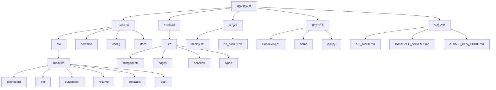
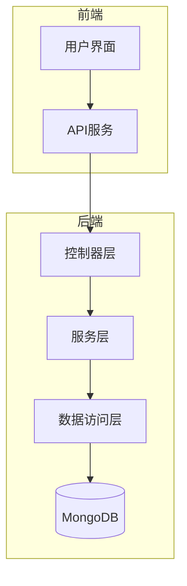
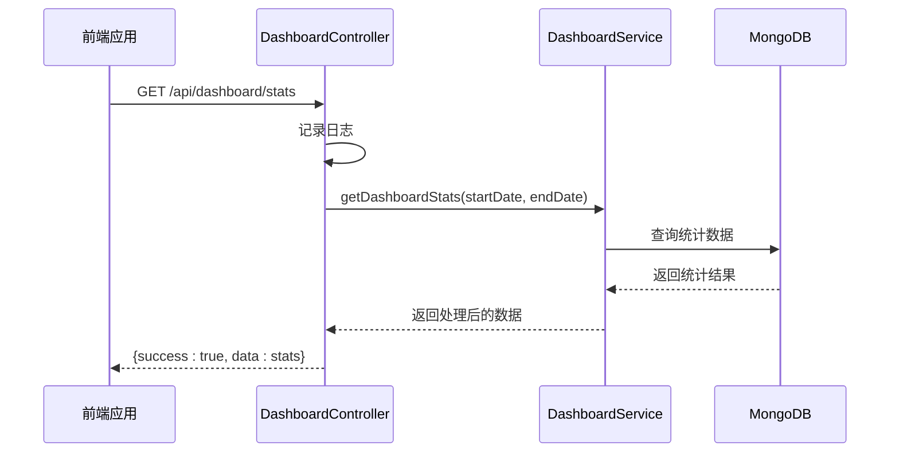
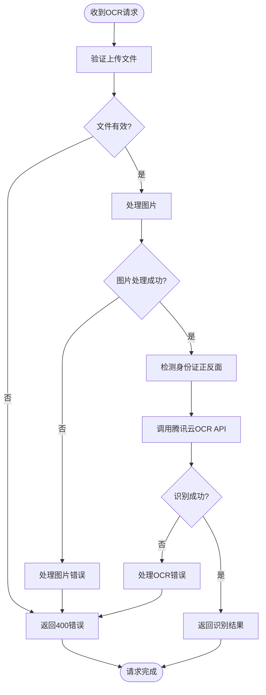
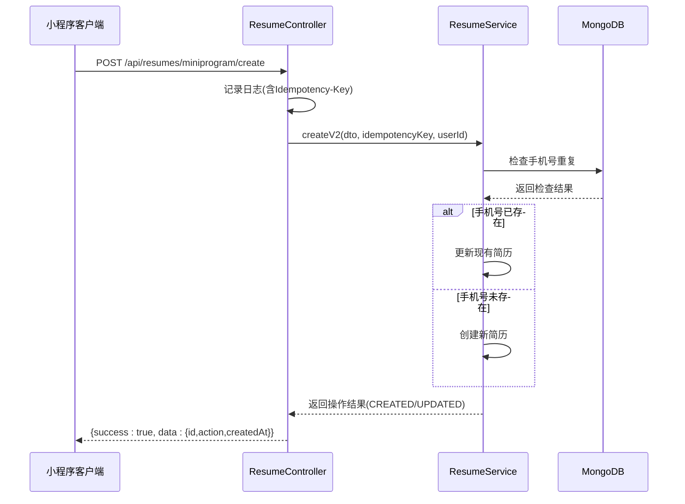
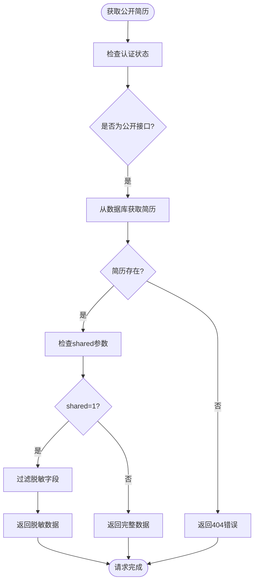
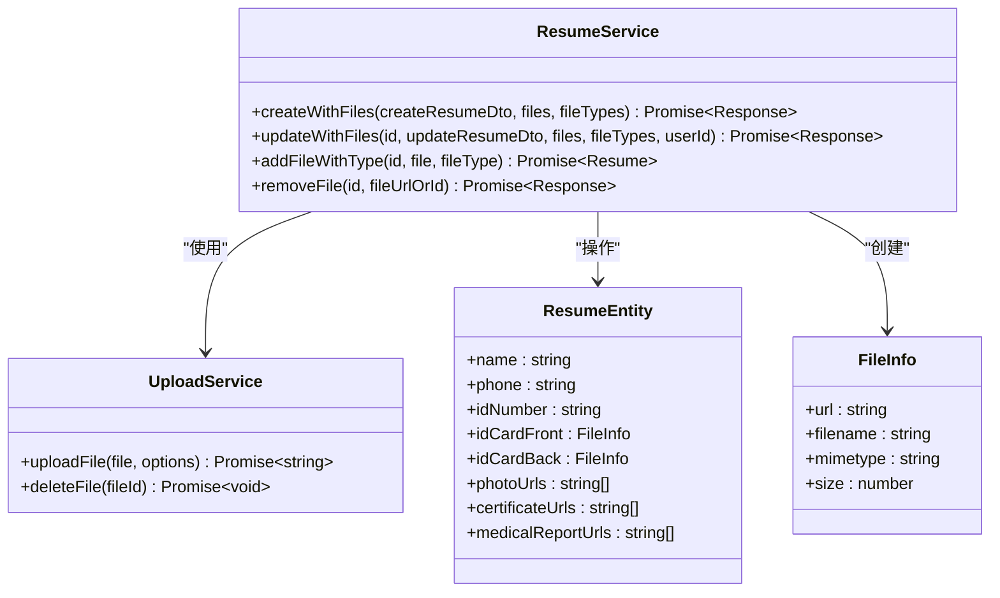
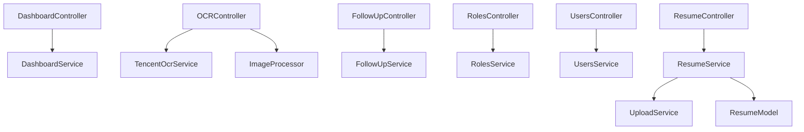

# API参考

<cite>
**本文档引用的文件**   
- [API_SPEC.md](file://backend/src/docs/API_SPEC.md) - *新增小程序接口和公开简历接口*
- [resume.controller.ts](file://backend/src/modules/resume/resume.controller.ts) - *新增小程序专用接口和公开简历接口*
</cite>

## 更新摘要
**变更内容**   
- 新增了小程序专用的简历创建、更新、文件上传和删除等API接口文档
- 新增了获取公开简历详情的API接口文档
- 更新了简历管理模块的详细组件分析，包含新的接口序列图
- 增强了源码追踪系统，添加了新接口的源文件引用

## 目录
1. [简介](#简介)
2. [项目结构](#项目结构)
3. [核心组件](#核心组件)
4. [架构概览](#架构概览)
5. [详细组件分析](#详细组件分析)
6. [依赖分析](#依赖分析)
7. [性能考虑](#性能考虑)
8. [故障排除指南](#故障排除指南)
9. [结论](#结论)

## 简介
本文档为安德家政CRM系统的RESTful API提供了全面的参考。文档基于系统控制器文件和API规范，详细记录了所有公开的API端点，包括HTTP方法、URL路径、请求参数、响应数据结构、状态码、认证要求和权限控制。文档特别关注客户管理、简历管理、电子签约、OCR识别等核心功能模块，为开发者提供清晰的集成指南。根据最新代码变更，文档已更新包含小程序专用接口和简历公开接口。

## 项目结构
安德家政CRM系统采用前后端分离的架构，后端基于NestJS框架，前端基于React技术栈。项目根目录下包含`backend`、`frontend`和`scripts`等主要目录。

**图示来源**
- [dashboard.controller.ts](file://backend/src/modules/dashboard/dashboard.controller.ts)
- [ocr.controller.ts](file://backend/src/modules/ocr/ocr.controller.ts)
- [baidu.controller.ts](file://backend/src/modules/baidu/baidu.controller.ts)

**本节来源**
- [dashboard.controller.ts](file://backend/src/modules/dashboard/dashboard.controller.ts)
- [ocr.controller.ts](file://backend/src/modules/ocr/ocr.controller.ts)
- [baidu.controller.ts](file://backend/src/modules/baidu/baidu.controller.ts)

## 核心组件
系统的核心组件包括用户管理、角色管理、简历管理、跟进记录、OCR识别和驾驶舱统计等模块。这些组件通过RESTful API提供服务，支持系统的各项业务功能。

**本节来源**
- [users.controller.ts](file://backend/src/modules/users/users.controller.ts)
- [roles.controller.ts](file://backend/src/modules/roles/roles.controller.ts)
- [resume.service.ts](file://backend/src/modules/resume/resume.service.ts)

## 架构概览
系统采用典型的分层架构，包括控制器层、服务层和数据访问层。控制器负责处理HTTP请求和响应，服务层包含业务逻辑，数据访问层与数据库交互。

**图示来源**
- [users.controller.ts](file://backend/src/modules/users/users.controller.ts)
- [resume.service.ts](file://backend/src/modules/resume/resume.service.ts)
- [resume.entity.ts](file://backend/src/modules/resume/models/resume.entity.ts)

## 详细组件分析
### 驾驶舱模块分析
驾驶舱模块提供系统关键指标的统计数据，包括客户业务、财务营收和运营效率等指标。

#### 驾驶舱API序列图

**图示来源**
- [dashboard.controller.ts](file://backend/src/modules/dashboard/dashboard.controller.ts)
- [dashboard.service.ts](file://backend/src/modules/dashboard/dashboard.service.ts)

**本节来源**
- [dashboard.controller.ts](file://backend/src/modules/dashboard/dashboard.controller.ts)

### OCR识别模块分析
OCR识别模块提供身份证识别功能，支持正面和背面的自动识别。

#### OCR识别流程图

**图示来源**
- [ocr.controller.ts](file://backend/src/modules/ocr/ocr.controller.ts)
- [tencent-ocr.service.ts](file://backend/src/modules/ocr/tencent-ocr.service.ts)

**本节来源**
- [ocr.controller.ts](file://backend/src/modules/ocr/ocr.controller.ts)

### 简历管理模块分析
简历管理模块是系统的核心功能之一，支持简历的创建、更新、查询和文件管理。根据最新代码变更，模块已新增小程序专用接口和简历公开接口。

#### 小程序简历创建API序列图

**图示来源**
- [resume.controller.ts](file://backend/src/modules/resume/resume.controller.ts)
- [resume.service.ts](file://backend/src/modules/resume/resume.service.ts)

**本节来源**
- [resume.controller.ts](file://backend/src/modules/resume/resume.controller.ts)
- [resume.service.ts](file://backend/src/modules/resume/resume.service.ts)

#### 简历公开接口流程图

**图示来源**
- [resume.controller.ts](file://backend/src/modules/resume/resume.controller.ts)
- [resume.service.ts](file://backend/src/modules/resume/resume.service.ts)

**本节来源**
- [resume.controller.ts](file://backend/src/modules/resume/resume.controller.ts)

#### 简历创建类图

**图示来源**
- [resume.service.ts](file://backend/src/modules/resume/resume.service.ts)
- [resume.entity.ts](file://backend/src/modules/resume/models/resume.entity.ts)
- [upload.service.ts](file://backend/src/modules/upload/upload.service.ts)

**本节来源**
- [resume.service.ts](file://backend/src/modules/resume/resume.service.ts)
- [resume.entity.ts](file://backend/src/modules/resume/models/resume.entity.ts)

## 依赖分析
系统各模块之间存在明确的依赖关系，控制器依赖服务层，服务层依赖数据访问层和外部服务。

**图示来源**
- [dashboard.controller.ts](file://backend/src/modules/dashboard/dashboard.controller.ts)
- [ocr.controller.ts](file://backend/src/modules/ocr/ocr.controller.ts)
- [follow-up.controller.ts](file://backend/src/modules/follow-up/follow-up.controller.ts)
- [roles.controller.ts](file://backend/src/modules/roles/roles.controller.ts)
- [users.controller.ts](file://backend/src/modules/users/users.controller.ts)
- [resume.service.ts](file://backend/src/modules/resume/resume.service.ts)

**本节来源**
- [dashboard.controller.ts](file://backend/src/modules/dashboard/dashboard.controller.ts)
- [ocr.controller.ts](file://backend/src/modules/ocr/ocr.controller.ts)
- [follow-up.controller.ts](file://backend/src/modules/follow-up/follow-up.controller.ts)
- [roles.controller.ts](file://backend/src/modules/roles/roles.controller.ts)
- [users.controller.ts](file://backend/src/modules/users/users.controller.ts)
- [resume.service.ts](file://backend/src/modules/resume/resume.service.ts)

## 性能考虑
系统在设计时考虑了性能优化，包括数据库查询优化、缓存机制和文件处理优化。简历列表查询采用了分页和排序优化，确保大数据量下的查询性能。OCR识别服务实现了性能报告功能，便于监控服务状态。

## 故障排除指南
当API调用出现问题时，可参考以下常见问题及解决方案：

1. **401未授权错误**：确保请求包含有效的JWT令牌。
2. **403禁止访问**：检查用户角色是否有权限访问该API。
3. **500服务器内部错误**：查看服务日志获取详细错误信息。
4. **文件上传失败**：检查文件大小是否超过5MB限制，文件格式是否为JPG、JPEG或PNG。
5. **身份证识别失败**：确保上传的身份证图片清晰、完整，无遮挡。
6. **小程序创建简历失败**：检查请求头中是否包含正确的Idempotency-Key，确保手机号未重复。
7. **公开简历无法访问**：确认URL路径是否正确，检查简历ID是否存在。

**本节来源**
- [dashboard.controller.ts](file://backend/src/modules/dashboard/dashboard.controller.ts)
- [ocr.controller.ts](file://backend/src/modules/ocr/ocr.controller.ts)
- [users.controller.ts](file://backend/src/modules/users/users.controller.ts)

## 结论
安德家政CRM系统的API设计遵循RESTful原则，结构清晰，功能完整。系统通过模块化设计实现了高内聚低耦合，便于维护和扩展。API文档为开发者提供了详细的集成指南，有助于快速实现系统集成。根据最新代码变更，系统已增强小程序集成能力，新增了专用接口和简历公开功能，为外部系统集成提供了更多可能性。