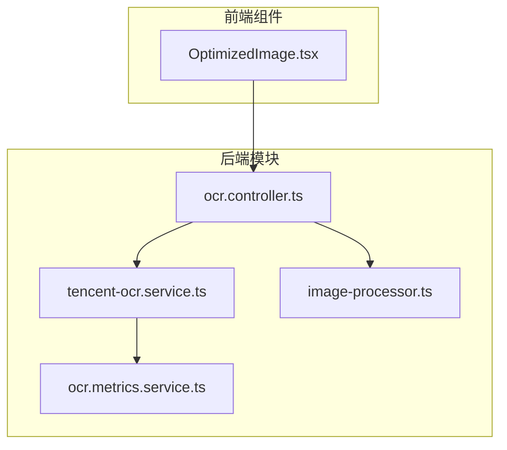
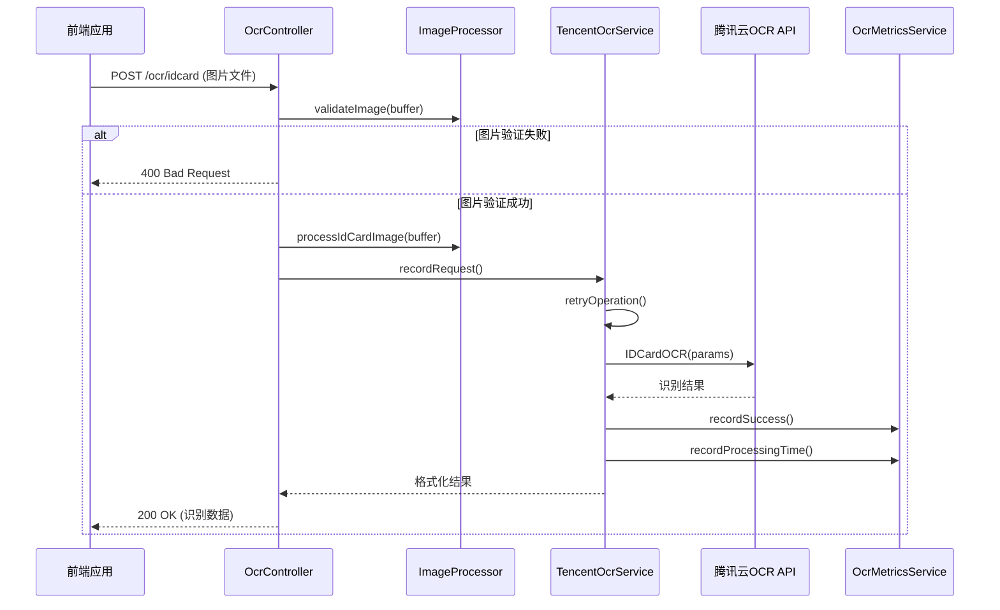
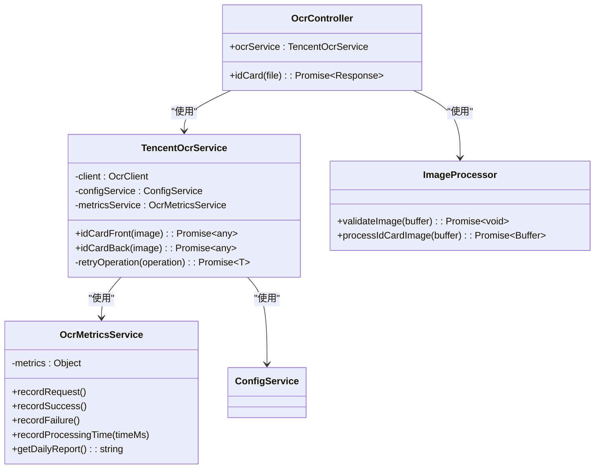

# OCR识别API

<cite>
**本文档引用的文件**  
- [ocr.controller.ts](file://backend/src/modules/ocr/ocr.controller.ts)
- [tencent-ocr.service.ts](file://backend/src/modules/ocr/tencent-ocr.service.ts)
- [ocr.metrics.service.ts](file://backend/src/modules/ocr/ocr.metrics.service.ts)
- [image-processor.ts](file://backend/src/utils/image-processor.ts)
- [OptimizedImage.tsx](file://frontend/src/components/OptimizedImage.tsx)
</cite>

## 目录
1. [简介](#简介)
2. [项目结构](#项目结构)
3. [核心组件](#核心组件)
4. [架构概述](#架构概述)
5. [详细组件分析](#详细组件分析)
6. [依赖分析](#依赖分析)
7. [性能考量](#性能考量)
8. [故障排除指南](#故障排除指南)
9. [结论](#结论)

## 简介
本文档旨在为OCR识别服务提供全面的API参考，重点描述如何通过系统调用腾讯云OCR服务。文档详细说明了`POST /ocr/idcard`接口的请求参数、响应数据结构、处理时间、错误重试机制和结果缓存策略。同时，文档涵盖了身份证等特定场景的识别准确率和限制条件，并提供了前端`OptimizedImage`组件与OCR服务集成的示例。此外，还列出了可能的错误状态码及其含义。

## 项目结构
OCR识别功能主要位于后端项目的`src/modules/ocr`目录下，由控制器、服务和指标服务三个核心文件构成。前端集成则通过`OptimizedImage`组件实现。



**图示来源**
- [ocr.controller.ts](file://backend/src/modules/ocr/ocr.controller.ts)
- [tencent-ocr.service.ts](file://backend/src/modules/ocr/tencent-ocr.service.ts)
- [ocr.metrics.service.ts](file://backend/src/modules/ocr/ocr.metrics.service.ts)
- [image-processor.ts](file://backend/src/utils/image-processor.ts)
- [OptimizedImage.tsx](file://frontend/src/components/OptimizedImage.tsx)

**本节来源**
- [ocr.controller.ts](file://backend/src/modules/ocr/ocr.controller.ts)
- [tencent-ocr.service.ts](file://backend/src/modules/ocr/tencent-ocr.service.ts)

## 核心组件
OCR识别服务的核心由`OcrController`、`TencentOcrService`和`OcrMetricsService`三个组件构成。`OcrController`负责接收HTTP请求并进行初步处理；`TencentOcrService`封装了与腾讯云OCR API的交互逻辑，包括错误重试和结果格式化；`OcrMetricsService`则负责收集和报告服务的性能指标。

**本节来源**
- [ocr.controller.ts](file://backend/src/modules/ocr/ocr.controller.ts#L0-L25)
- [tencent-ocr.service.ts](file://backend/src/modules/ocr/tencent-ocr.service.ts#L0-L48)
- [ocr.metrics.service.ts](file://backend/src/modules/ocr/ocr.metrics.service.ts#L0-L12)

## 架构概述
系统采用分层架构，前端通过HTTP请求调用后端的OCR API。后端控制器接收请求后，先对图片进行验证和预处理，然后调用OCR服务。OCR服务通过重试机制与腾讯云API通信，并将结果格式化后返回。整个过程的性能数据由指标服务进行监控和记录。



**图示来源**
- [ocr.controller.ts](file://backend/src/modules/ocr/ocr.controller.ts)
- [tencent-ocr.service.ts](file://backend/src/modules/ocr/tencent-ocr.service.ts)
- [image-processor.ts](file://backend/src/utils/image-processor.ts)
- [ocr.metrics.service.ts](file://backend/src/modules/ocr/ocr.metrics.service.ts)

## 详细组件分析

### OCR控制器分析
`OcrController`是OCR服务的入口，负责处理所有与OCR相关的HTTP请求。

#### API接口
控制器暴露了`POST /ocr/idcard`接口用于身份证识别。

**请求参数**
- **方法**: `POST`
- **路径**: `/ocr/idcard`
- **内容类型**: `multipart/form-data`
- **请求体**:
  - `file`: 二进制图片文件，支持JPG、JPEG、PNG格式。

**响应数据结构**
成功的响应返回一个JSON对象：
```json
{
  "success": true,
  "data": {
    "words_result": {
      "姓名": { "words": "张三" },
      "性别": { "words": "男" },
      "民族": { "words": "汉" },
      "出生": { "words": "19900101" },
      "住址": { "words": "北京市朝阳区..." },
      "公民身份号码": { "words": "110101199001011234" }
    },
    "risk_info": []
  },
  "message": "识别成功",
  "requestId": "1a2b3c4d"
}
```

**处理时间**
控制器通过`TencentOcrService`记录每次请求的处理时间，并由`OcrMetricsService`计算平均处理时间。

**本节来源**
- [ocr.controller.ts](file://backend/src/modules/ocr/ocr.controller.ts#L25-L199)

### 腾讯OCR服务分析
`TencentOcrService`是与腾讯云OCR API交互的核心服务。

#### OCR调用逻辑
服务通过`idCardFront`和`idCardBack`方法分别处理身份证正面和背面的识别。
1.  **初始化**: 在构造函数中使用环境变量中的`TENCENT_OCR_SECRET_ID`和`TENCENT_OCR_SECRET_KEY`初始化腾讯云客户端。
2.  **参数准备**: 将图片`Buffer`转换为Base64字符串，并设置`CardSide`参数。
3.  **API调用**: 使用`IDCardOCR`方法调用腾讯云API。
4.  **结果验证**: 验证API返回结果是否包含必要字段，并检查身份证号格式。
5.  **结果格式化**: 将腾讯云API的返回结果转换为统一的格式。

#### 错误重试机制
服务实现了基于`retry`库的重试机制。
- **重试次数**: 最多3次。
- **退避策略**: 指数退避，初始间隔1秒，最大间隔5秒。
- **实现**: 通过`retryOperation`私有方法包装所有可能失败的API调用。

#### 结果缓存策略
根据代码分析，当前实现中**并未直接实现结果缓存**。`OcrMetricsService`中虽然有`recordCacheHit`和`recordCacheMiss`方法，但`TencentOcrService`中并未调用它们。这表明缓存功能可能在规划中但尚未实现，或由外部系统（如CDN或Redis）处理。

**本节来源**
- [tencent-ocr.service.ts](file://backend/src/modules/ocr/tencent-ocr.service.ts#L0-L191)

### 图片处理器分析
`ImageProcessor`类负责在OCR识别前对图片进行验证和预处理。

#### 限制条件
- **文件大小**: 不能超过5MB。
- **图片格式**: 仅支持JPG、JPEG、PNG。
- **最小尺寸**: 宽高均不能小于300px。
- **处理逻辑**: 将图片调整至1024x1024像素以内，并以80%的质量保存为JPEG格式，以优化传输和识别效率。

**本节来源**
- [image-processor.ts](file://backend/src/utils/image-processor.ts#L0-L73)

### 不同场景下的识别准确率和限制条件
文档目标中提到的简历OCR场景，在当前代码库中**并未找到直接实现**。相关文件`resume.controller.ts`和`resume.service.ts`主要处理简历数据的CRUD操作，但未包含调用OCR服务进行简历识别的逻辑。因此，无法提供简历OCR的准确率和限制条件。

对于身份证识别，其准确率高度依赖于原始图片质量。系统通过`ImageProcessor`确保了输入图片的质量下限，从而间接保证了较高的识别准确率。

**本节来源**
- [image-processor.ts](file://backend/src/utils/image-processor.ts)
- [tencent-ocr.service.ts](file://backend/src/modules/ocr/tencent-ocr.service.ts)

### 前端集成示例
`OptimizedImage`是一个通用的图片优化组件，用于在前端高效地加载和显示图片。

#### 与OCR服务的集成
虽然`OptimizedImage`本身不直接调用OCR服务，但它可以作为OCR结果的展示组件。例如，在用户上传身份证后，前端可以将识别结果中的文字信息（如姓名、地址）与`OptimizedImage`组件结合，创建一个美观的预览界面。

```tsx
<OptimizedImage 
  src={idCardFrontUrl} 
  alt="身份证正面" 
  width="300px" 
  height="200px" 
/>
<p>姓名: {ocrResult.words_result.姓名.words}</p>
<p>身份证号: {ocrResult.words_result.公民身份号码.words}</p>
```

**本节来源**
- [OptimizedImage.tsx](file://frontend/src/components/OptimizedImage.tsx#L0-L116)

## 依赖分析
OCR模块的依赖关系清晰，遵循单一职责原则。



**图示来源**
- [ocr.controller.ts](file://backend/src/modules/ocr/ocr.controller.ts)
- [tencent-ocr.service.ts](file://backend/src/modules/ocr/tencent-ocr.service.ts)
- [ocr.metrics.service.ts](file://backend/src/modules/ocr/ocr.metrics.service.ts)
- [image-processor.ts](file://backend/src/utils/image-processor.ts)

**本节来源**
- [ocr.module.ts](file://backend/src/modules/ocr/ocr.module.ts#L0-L12)

## 性能考量
系统的性能主要由腾讯云OCR API的响应时间和网络延迟决定。

- **处理时间**: `OcrMetricsService`会记录每次请求的处理时间，并计算平均值。`getDailyReport()`方法会重置指标，因此报告反映的是每日的平均性能。
- **并发处理**: NestJS应用本身支持并发处理，但腾讯云API可能有调用频率限制，需在配置中注意。
- **图片处理**: `ImageProcessor`的预处理步骤会增加少量延迟，但有助于提高OCR识别的准确率和稳定性。

## 故障排除指南
以下是可能遇到的错误状态码及其含义：

| 状态码 | 含义 | 可能原因 |
| :--- | :--- | :--- |
| **200** | 成功 | 识别成功，返回结果。 |
| **400** | 请求参数错误 | 未上传文件、图片格式不支持、图片尺寸过小。 |
| **413** | 载荷过大 | 上传的图片文件超过5MB限制。 |
| **415** | 不支持的媒体类型 | 请求的Content-Type不是`multipart/form-data`。 |
| **422** | 处理失败 | 腾讯云OCR API返回错误，如图片模糊、关键信息缺失。 |
| **500** | 服务器内部错误 | 服务内部发生未预期的错误。 |
| **502** | 错误网关 | 调用腾讯云OCR API时发生网络或服务错误。 |
| **503** | 服务不可用 | 健康检查失败，服务可能过载或未正确启动。 |

**本节来源**
- [ocr.controller.ts](file://backend/src/modules/ocr/ocr.controller.ts#L79-L139)
- [image-processor.ts](file://backend/src/utils/image-processor.ts#L15-L38)

## 结论
本文档详细介绍了基于腾讯云OCR服务的API实现。系统通过`OcrController`提供RESTful接口，利用`TencentOcrService`实现与云服务的可靠通信，并通过`ImageProcessor`确保输入质量。尽管当前代码中未实现结果缓存，但其错误重试机制和性能监控功能为服务的稳定性和可维护性提供了保障。前端可通过`OptimizedImage`等组件安全地集成和展示OCR结果。