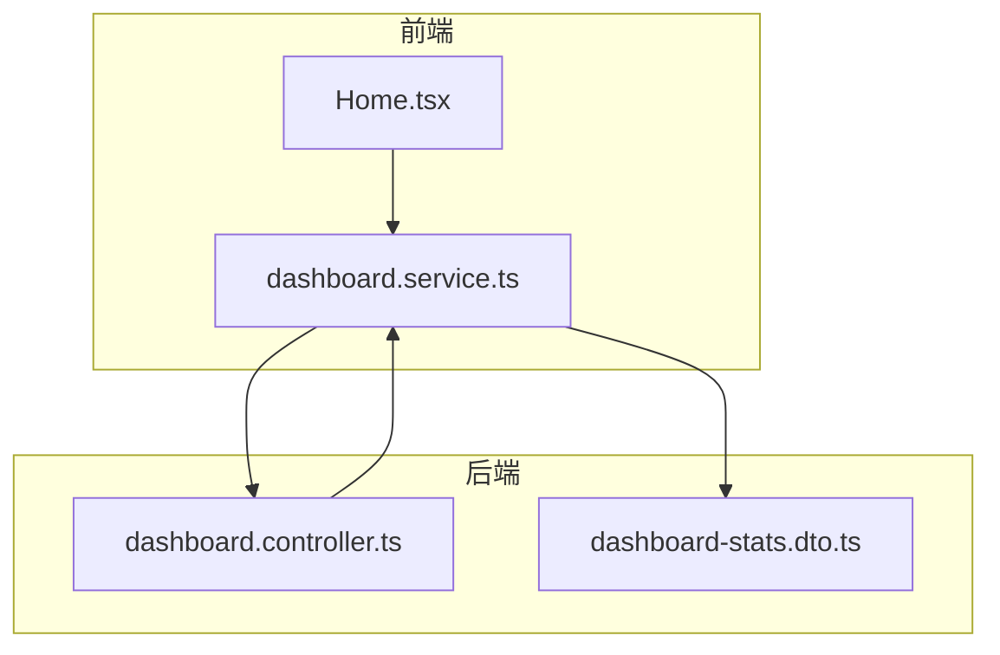
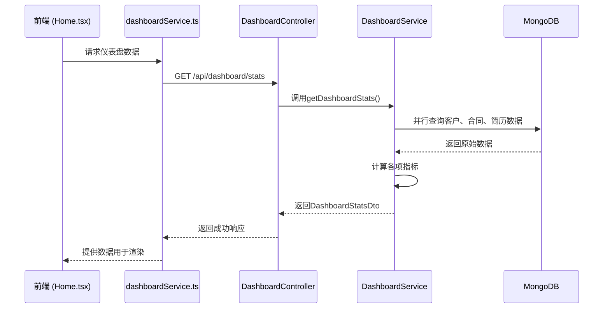
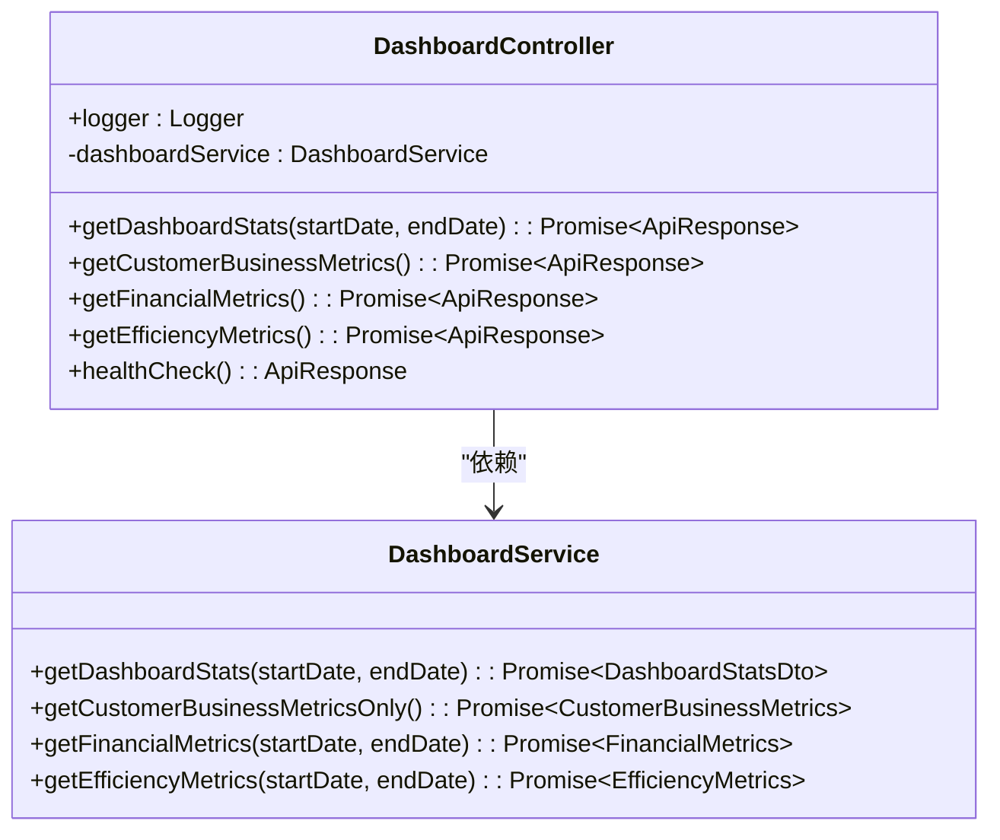
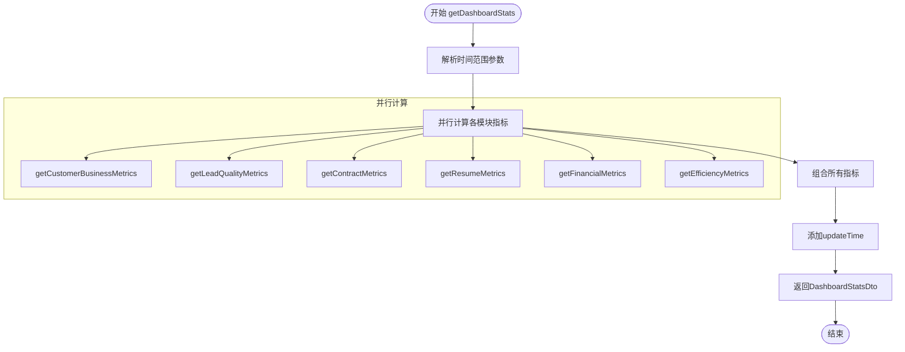
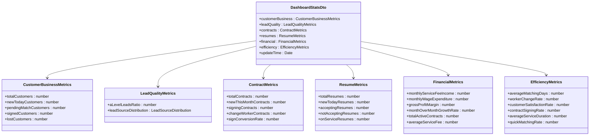
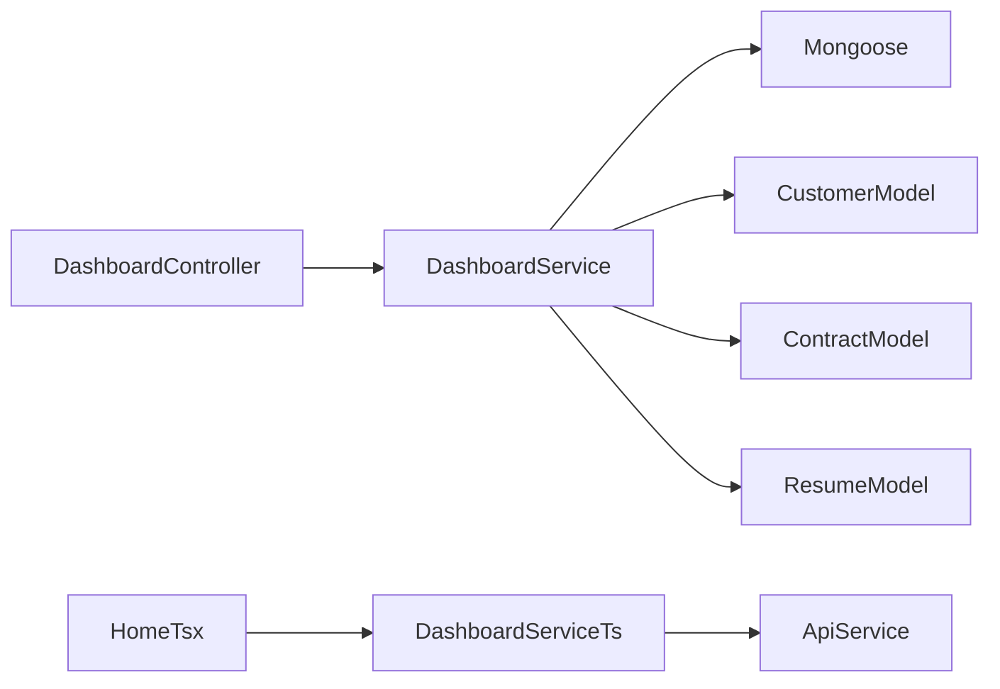

# 仪表盘统计API

<cite>
**本文档引用的文件**   
- [dashboard.controller.ts](file://backend/src/modules/dashboard/dashboard.controller.ts)
- [dashboard.service.ts](file://backend/src/modules/dashboard/dashboard.service.ts)
- [dashboard-stats.dto.ts](file://backend/src/modules/dashboard/dto/dashboard-stats.dto.ts)
- [Home.tsx](file://frontend/src/pages/Home.tsx)
- [dashboardService.ts](file://frontend/src/services/dashboardService.ts)
</cite>

## 目录
1. [简介](#简介)
2. [项目结构](#项目结构)
3. [核心组件](#核心组件)
4. [架构概览](#架构概览)
5. [详细组件分析](#详细组件分析)
6. [依赖分析](#依赖分析)
7. [性能考量](#性能考量)
8. [故障排除指南](#故障排除指南)
9. [结论](#结论)

## 简介
本文档详细描述了“安德家政CRM”系统中仪表盘统计模块的API设计与实现。该模块为前端Home页面提供关键业务指标，涵盖客户业务、线索质量、合同、简历、财务和运营效率六大维度。API通过`GET /dashboard/stats`端点提供聚合数据，支持时间范围筛选，并采用并行计算和潜在的缓存机制来优化性能。文档深入解析了`DashboardStatsDto`响应结构的计算逻辑，以及如何支持前端实时数据展示。尽管当前代码中未实现显式的访问频率限制和缓存，但其设计为未来集成此类高并发稳定性机制提供了基础。

## 项目结构
仪表盘模块位于后端`src/modules/dashboard`目录下，遵循NestJS的模块化设计。其核心由控制器（Controller）、服务（Service）和数据传输对象（DTO）构成。前端通过`services/dashboardService.ts`调用API，并在`pages/Home.tsx`中展示数据。

**图示来源**
- [dashboard.controller.ts](file://backend/src/modules/dashboard/dashboard.controller.ts)
- [dashboard.service.ts](file://backend/src/modules/dashboard/dashboard.service.ts)
- [dashboard-stats.dto.ts](file://backend/src/modules/dashboard/dto/dashboard-stats.dto.ts)
- [Home.tsx](file://frontend/src/pages/Home.tsx)
- [dashboardService.ts](file://frontend/src/services/dashboardService.ts)

## 核心组件
核心组件包括`DashboardController`，它暴露了`/stats`等RESTful端点；`DashboardService`，负责所有数据聚合的业务逻辑；以及`DashboardStatsDto`，定义了API响应的精确数据结构。前端的`dashboardService`类封装了API调用，而`Home`组件则负责数据的可视化。

**组件来源**
- [dashboard.controller.ts](file://backend/src/modules/dashboard/dashboard.controller.ts)
- [dashboard.service.ts](file://backend/src/modules/dashboard/dashboard.service.ts)
- [dashboard-stats.dto.ts](file://backend/src/modules/dashboard/dto/dashboard-stats.dto.ts)
- [Home.tsx](file://frontend/src/pages/Home.tsx)
- [dashboardService.ts](file://frontend/src/services/dashboardService.ts)

## 架构概览
系统采用典型的前后端分离架构。前端通过HTTP请求调用后端API。后端使用NestJS框架，通过Mongoose与MongoDB数据库交互，从`Customer`、`Contract`和`Resume`等模型中聚合数据。`DashboardService`是核心，它协调多个异步数据查询，并将结果组合成一个统一的响应。

**图示来源**
- [dashboard.controller.ts](file://backend/src/modules/dashboard/dashboard.controller.ts#L20-L44)
- [dashboard.service.ts](file://backend/src/modules/dashboard/dashboard.service.ts#L28-L66)
- [dashboard-stats.dto.ts](file://backend/src/modules/dashboard/dto/dashboard-stats.dto.ts)

## 详细组件分析

### 仪表盘控制器分析
`DashboardController`是API的入口，负责处理HTTP请求和响应。它使用NestJS的装饰器来定义路由、操作和API文档。

#### 控制器类图

**图示来源**
- [dashboard.controller.ts](file://backend/src/modules/dashboard/dashboard.controller.ts)
- [dashboard.service.ts](file://backend/src/modules/dashboard/dashboard.service.ts)

**组件来源**
- [dashboard.controller.ts](file://backend/src/modules/dashboard/dashboard.controller.ts)

### 仪表盘服务分析
`DashboardService`是数据聚合的核心，实现了所有统计指标的计算逻辑。

#### 数据聚合流程图

**图示来源**
- [dashboard.service.ts](file://backend/src/modules/dashboard/dashboard.service.ts#L28-L66)

**组件来源**
- [dashboard.service.ts](file://backend/src/modules/dashboard/dashboard.service.ts)

### 响应数据结构分析
`DashboardStatsDto`接口定义了API响应的完整结构，包含六个主要指标对象和一个更新时间戳。

#### 响应结构类图

**图示来源**
- [dashboard-stats.dto.ts](file://backend/src/modules/dashboard/dto/dashboard-stats.dto.ts)

**组件来源**
- [dashboard-stats.dto.ts](file://backend/src/modules/dashboard/dto/dashboard-stats.dto.ts)

## 依赖分析
`DashboardService`直接依赖于NestJS的`@nestjs/mongoose`模块和Mongoose的`Model`类，通过`@InjectModel`装饰器注入`Customer`、`Contract`和`Resume`的数据模型。这使得服务能够直接与数据库进行交互。前端`dashboardService`则依赖于`apiService`来进行HTTP通信。

**图示来源**
- [dashboard.service.ts](file://backend/src/modules/dashboard/dashboard.service.ts#L1-L15)
- [dashboard.controller.ts](file://backend/src/modules/dashboard/dashboard.controller.ts#L1-L15)
- [dashboardService.ts](file://frontend/src/services/dashboardService.ts#L1-L5)

**组件来源**
- [dashboard.service.ts](file://backend/src/modules/dashboard/dashboard.service.ts)
- [dashboard.controller.ts](file://backend/src/modules/dashboard/dashboard.controller.ts)
- [dashboardService.ts](file://frontend/src/services/dashboardService.ts)

## 性能考量
当前实现通过`Promise.all()`在`getDashboardStats`方法中并行执行六个独立的数据库查询，这是主要的性能优化策略，显著减少了总响应时间。然而，代码中并未实现缓存机制或异步计算队列。对于高并发场景，每次请求都会触发完整的数据库聚合计算，这可能成为性能瓶颈。建议未来引入缓存（如Redis），将计算结果缓存一段时间（例如5-10分钟），并设置定时任务异步更新缓存，以减轻数据库压力并提高响应速度。此外，`Home`页面的前端实现目前为空，实际应用中应实现轮询或WebSocket来获取实时更新。

**性能考量来源**
- [dashboard.service.ts](file://backend/src/modules/dashboard/dashboard.service.ts#L28-L66)

## 故障排除指南
- **500错误**：检查后端日志，通常由数据库查询失败或计算逻辑错误引起。确保`Customer`、`Contract`、`Resume`模型的字段名与数据库一致。
- **数据不准确**：验证`contractStatus`和`esignStatus`的状态映射逻辑。例如，客户状态“已签约”依赖于合同的`esignStatus`为'2'。检查`parseDateRange`方法是否正确处理了时间范围参数。
- **响应缓慢**：监控数据库查询性能。考虑为`createdAt`、`contractStatus`、`esignStatus`等常用查询字段建立数据库索引。
- **前端无法获取数据**：确认前端`dashboardService`中的API路径是否正确（应为`/api/dashboard/stats`），并检查网络请求是否被拦截。

**故障排除来源**
- [dashboard.controller.ts](file://backend/src/modules/dashboard/dashboard.controller.ts#L20-L44)
- [dashboard.service.ts](file://backend/src/modules/dashboard/dashboard.service.ts#L400-L429)
- [dashboardService.ts](file://frontend/src/services/dashboardService.ts#L0-L35)

## 结论
仪表盘统计API为系统提供了全面的业务洞察。其设计清晰，通过`DashboardStatsDto`提供了结构化的数据。核心的并行计算策略是当前主要的性能保障。为了在高并发下保持系统稳定，强烈建议在后续版本中集成缓存和异步计算机制。前端`Home`页面需要实现数据消费逻辑，以完成从数据聚合到可视化展示的完整闭环。