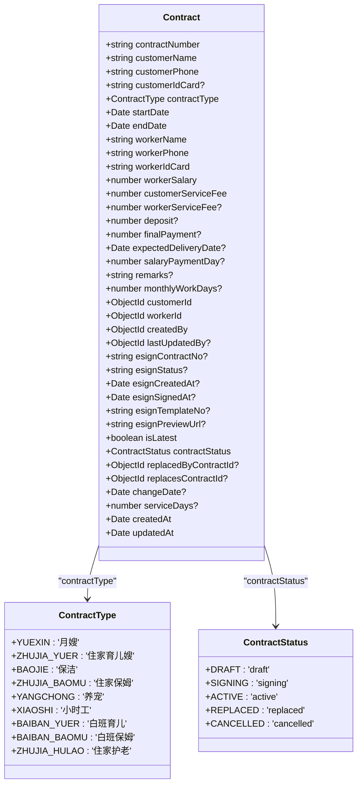
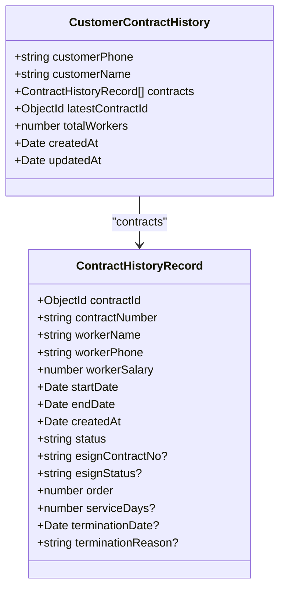
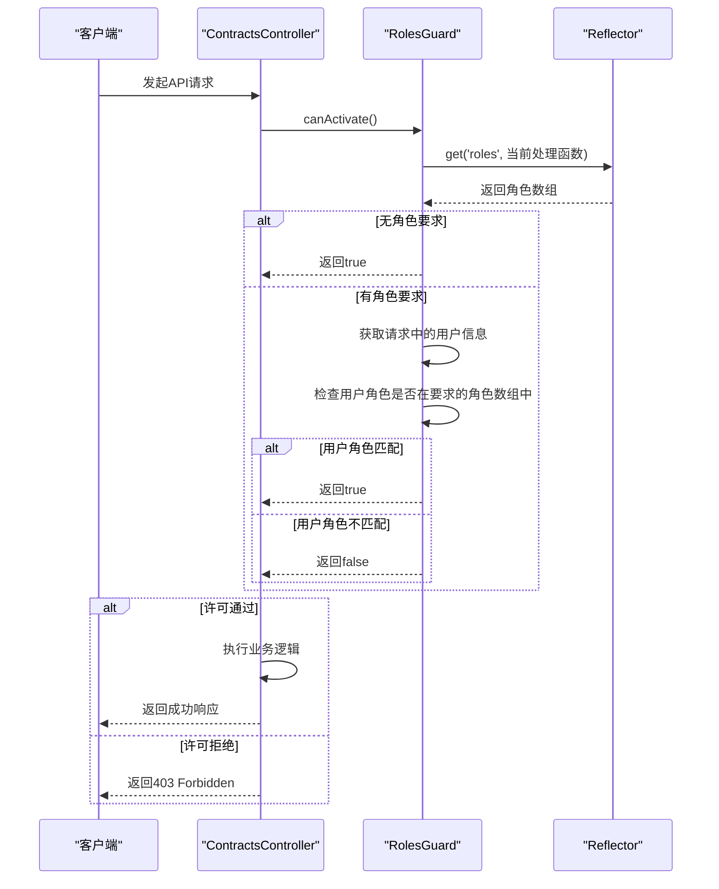
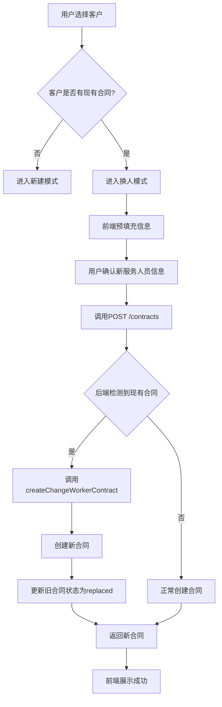

# 合同管理API

<cite>
**本文档引用的文件**   
- [contracts.controller.ts](file://backend/src/modules/contracts/contracts.controller.ts)
- [create-contract.dto.ts](file://backend/src/modules/contracts/dto/create-contract.dto.ts)
- [update-contract.dto.ts](file://backend/src/modules/contracts/dto/update-contract.dto.ts)
- [contract.model.ts](file://backend/src/modules/contracts/models/contract.model.ts)
- [customer-contract-history.model.ts](file://backend/src/modules/contracts/models/customer-contract-history.model.ts)
- [contracts.service.ts](file://backend/src/modules/contracts/contracts.service.ts)
- [roles.guard.ts](file://backend/src/modules/auth/guards/roles.guard.ts)
- [A客户换多个阿姨-技术实现文档.md](file://A客户换多个阿姨-技术实现文档.md)
</cite>

## 目录
1. [简介](#简介)
2. [核心API接口](#核心api接口)
3. [数据模型](#数据模型)
4. [权限与认证](#权限与认证)
5. [业务场景与流程](#业务场景与流程)
6. [换人模式详解](#换人模式详解)
7. [API调用示例](#api调用示例)

## 简介
本API参考文档详细说明了合同管理模块的核心功能，涵盖合同的创建、查询、更新和删除等全生命周期操作。文档重点介绍了合同与客户、服务人员的关联关系，以及通过`CustomerContractHistoryModel`获取客户合同历史记录的方法。同时，文档明确了接口的权限控制策略和认证机制，并提供了创建合同时的完整JSON示例，以及“换人模式”等复杂业务场景的API调用流程。

## 核心API接口

### 创建合同 (POST /contracts)
此接口用于创建新的合同记录。

**请求方法**: `POST`
**路径**: `/contracts`

**权限控制**: 需要有效的JWT令牌进行身份验证。

**请求体 (Request Body)**:
- **结构**: `CreateContractDto`
- **描述**: 包含合同的所有必要信息。

**成功响应 (200 OK)**:
```json
{
  "success": true,
  "data": { /* 合同模型 ContractModel 的实例 */ },
  "message": "合同创建成功"
}
```

**失败响应 (4xx/5xx)**:
```json
{
  "success": false,
  "message": "错误信息"
}
```

**Section sources**
- [contracts.controller.ts](file://backend/src/modules/contracts/contracts.controller.ts#L20-L46)
- [create-contract.dto.ts](file://backend/src/modules/contracts/dto/create-contract.dto.ts#L1-L203)

### 查询合同列表 (GET /contracts)
此接口用于分页查询合同列表。

**请求方法**: `GET`
**路径**: `/contracts`

**查询参数 (Query Parameters)**:
- `page` (string, 可选): 页码，默认为'1'。
- `limit` (string, 可选): 每页数量，默认为'10'。
- `search` (string, 可选): 搜索关键字，支持在合同编号、客户姓名、客户/服务人员电话中搜索。
- `showAll` (string, 可选): 是否显示所有合同。如果为'true'，则返回所有合同；否则，只返回每个客户的最新合同（`isLatest=true`）或状态非'replaced'的合同。

**权限控制**: 需要有效的JWT令牌进行身份验证。

**成功响应 (200 OK)**:
```json
{
  "success": true,
  "data": {
    "contracts": [ /* ContractModel 对象数组 */ ],
    "total": 100,
    "page": 1,
    "limit": 10,
    "totalPages": 10
  },
  "message": "获取合同列表成功"
}
```

**Section sources**
- [contracts.controller.ts](file://backend/src/modules/contracts/contracts.controller.ts#L48-L78)
- [contracts.service.ts](file://backend/src/modules/contracts/contracts.service.ts#L79-L157)

### 获取合同详情 (GET /contracts/:id)
此接口用于根据合同ID获取单个合同的详细信息。

**请求方法**: `GET`
**路径**: `/contracts/:id`

**路径参数 (Path Parameters)**:
- `id` (string): 合同的唯一标识符（MongoDB ObjectId）。

**权限控制**: 需要有效的JWT令牌进行身份验证。

**成功响应 (200 OK)**:
```json
{
  "success": true,
  "data": { /* 单个 ContractModel 对象 */ },
  "message": "获取合同详情成功"
}
```

**失败响应 (404 Not Found)**:
```json
{
  "success": false,
  "message": "合同不存在"
}
```

**Section sources**
- [contracts.controller.ts](file://backend/src/modules/contracts/contracts.controller.ts#L143-L159)
- [contracts.service.ts](file://backend/src/modules/contracts/contracts.service.ts#L159-L195)

### 更新合同 (PUT /contracts/:id)
此接口用于更新指定ID的合同信息。

**请求方法**: `PUT`
**路径**: `/contracts/:id`

**路径参数 (Path Parameters)**:
- `id` (string): 要更新的合同的唯一标识符。

**请求体 (Request Body)**:
- **结构**: `UpdateContractDto`
- **描述**: `UpdateContractDto`是`CreateContractDto`的子集，所有字段均为可选，允许部分更新。

**权限控制**: 需要有效的JWT令牌进行身份验证。更新操作会自动记录`lastUpdatedBy`字段。

**成功响应 (200 OK)**:
```json
{
  "success": true,
  "data": { /* 更新后的 ContractModel 对象 */ },
  "message": "合同更新成功"
}
```

**Section sources**
- [contracts.controller.ts](file://backend/src/modules/contracts/contracts.controller.ts#L161-L183)
- [update-contract.dto.ts](file://backend/src/modules/contracts/dto/update-contract.dto.ts#L1-L4)
- [contracts.service.ts](file://backend/src/modules/contracts/contracts.service.ts#L201-L249)

## 数据模型

### 合同模型 (ContractModel)
该模型定义了合同的核心数据结构。



**关键字段说明**:
- `contractNumber`: 合同编号，唯一且自动生成。
- `customerId`, `workerId`: 分别关联客户和简历（服务人员）的MongoDB ObjectId。
- `createdBy`, `lastUpdatedBy`: 记录创建和最后更新该合同的用户ID。
- `isLatest`: 布尔值，标识该合同是否为该客户的最新合同。
- `contractStatus`: 枚举值，表示合同的当前状态。
- `replacedByContractId`, `replacesContractId`: 用于构建合同替换链，实现“换人”功能。

**Diagram sources**
- [contract.model.ts](file://backend/src/modules/contracts/models/contract.model.ts#L1-L143)

### 客户合同历史模型 (CustomerContractHistoryModel)
该模型用于存储和查询单个客户的完整合同历史。



**关键字段说明**:
- `customerPhone`: 客户手机号，作为该集合的唯一索引和关联键。
- `contracts`: 一个`ContractHistoryRecord`对象的数组，按创建时间升序排列，记录了该客户的所有合同历史。
- `latestContractId`: 指向当前最新合同的ObjectId。
- `totalWorkers`: 该客户总共更换过多少位服务人员。

**Diagram sources**
- [customer-contract-history.model.ts](file://backend/src/modules/contracts/models/customer-contract-history.model.ts#L1-L80)

## 权限与认证

### 认证机制
所有合同管理API端点（除特别标注外）均使用JWT（JSON Web Token）进行认证。客户端在发起请求时，必须在HTTP头中包含`Authorization: Bearer <token>`。

**Section sources**
- [contracts.controller.ts](file://backend/src/modules/contracts/contracts.controller.ts#L18)

### 权限控制策略
系统通过`RolesGuard`实现基于角色的访问控制（RBAC）。



**实现说明**:
- `@UseGuards(JwtAuthGuard)`装饰器应用于`ContractsController`类，确保所有端点都经过JWT验证。
- `RolesGuard`会检查处理函数上通过`@Roles()`装饰器定义的角色要求，并与当前用户的角色进行比对。
- 如果处理函数没有定义角色要求，则默认允许访问。

**Diagram sources**
- [contracts.controller.ts](file://backend/src/modules/contracts/contracts.controller.ts#L18)
- [roles.guard.ts](file://backend/src/modules/auth/guards/roles.guard.ts#L3-L16)

## 业务场景与流程

### 合同创建流程
1.  **客户端**: 用户在前端填写合同信息，选择客户。
2.  **智能检测**: 前端调用`checkCustomerExistingContract` API，检查该客户是否已有合同。
3.  **模式判断**:
    *   **新建模式**: 如果客户无现有合同，进入正常创建流程。
    *   **换人模式**: 如果客户有现有合同，前端自动进入“换人模式”，并预填充相关信息。
4.  **API调用**: 客户端调用`POST /contracts`，发送`CreateContractDto`。
5.  **后端处理**:
    *   服务层`contractsService.create()`方法被调用。
    *   方法内部会再次调用`checkCustomerExistingContract`进行最终确认。
    *   如果检测到现有合同，将自动调用`createChangeWorkerContract`方法，执行换人合并逻辑。
    *   如果无现有合同，则正常创建新合同。
6.  **结果返回**: 返回创建成功的合同对象。

### 合同历史记录获取流程
要获取某个客户的完整合同历史，可以调用以下API：

**请求方法**: `GET`
**路径**: `/contracts/history/:customerPhone`

**路径参数**:
- `customerPhone` (string): 客户的手机号。

**成功响应**:
```json
{
  "success": true,
  "data": {
    "customerPhone": "13800138000",
    "customerName": "张三",
    "totalContracts": 3,
    "totalWorkers": 3,
    "totalServiceDays": 180,
    "currentContract": { /* 当前最新合同的简要信息 */ },
    "contracts": [ /* 按时间顺序排列的历史合同记录数组 */ ],
    "latestContractId": "686101813ad0e8bad843d822"
  },
  "message": "获取客户合同历史成功"
}
```

**后端逻辑**:
- 服务层`getCustomerContractHistory`方法会查询该客户手机号下的所有合同。
- 按创建时间排序，并构建包含换人关系的详细历史记录。
- 返回一个结构化的对象，便于前端展示换人时间线。

**Section sources**
- [contracts.controller.ts](file://backend/src/modules/contracts/contracts.controller.ts#L398-L418)
- [contracts.service.ts](file://backend/src/modules/contracts/contracts.service.ts#L200-L400)

## 换人模式详解
当客户需要更换服务人员时，系统通过“换人模式”来处理，确保合同的连续性和历史的完整性。

### 核心逻辑
1.  **创建新合同**: 为新的服务人员创建一份新的合同记录。
2.  **建立关联**: 新合同的`replacesContractId`字段指向旧合同的ID。
3.  **更新旧合同**: 旧合同的`isLatest`字段被设为`false`，`contractStatus`被设为`replaced`，`replacedByContractId`字段指向新合同的ID。
4.  **时间接续**: 新合同的开始时间（`startDate`）通常设置为换人操作的日期，结束时间（`endDate`）继承自原合同。

### API调用流程
1.  **检查现有合同**:
    ```http
    GET /api/contracts-test/check-customer/13800138000
    ```
    返回结果会指示该客户是否有现有合同。

2.  **创建换人合同**:
    ```http
    POST /api/contracts-test/change-worker/686101813ad0e8bad843d822
    Content-Type: application/json

    {
      "workerName": "李四",
      "workerPhone": "13900139000",
      "workerIdCard": "123456789012345678",
      "workerSalary": 8000,
      "customerServiceFee": 1000
      // ... 其他需要更新的字段
    }
    ```
    此请求会触发`createChangeWorkerContract`方法，自动完成新旧合同的状态更新和关联。



**Section sources**
- [A客户换多个阿姨-技术实现文档.md](file://A客户换多个阿姨-技术实现文档.md#L1-L345)
- [contracts.service.ts](file://backend/src/modules/contracts/contracts.service.ts#L538-L645)

## API调用示例

### 创建合同 (完整JSON示例)
```json
POST /contracts
Content-Type: application/json

{
  "customerName": "王五",
  "customerPhone": "13700137000",
  "customerIdCard": "11010119900307XXXX",
  "contractType": "住家育儿嫂",
  "startDate": "2024-12-01T00:00:00.000Z",
  "endDate": "2025-12-01T00:00:00.000Z",
  "workerName": "赵六",
  "workerPhone": "13600136000",
  "workerIdCard": "11010119850408XXXX",
  "workerSalary": 12000,
  "customerServiceFee": 2000,
  "workerServiceFee": 1000,
  "deposit": 3000,
  "finalPayment": 9000,
  "expectedDeliveryDate": "2024-11-20T00:00:00.000Z",
  "salaryPaymentDay": 15,
  "monthlyWorkDays": 26,
  "remarks": "客户有宠物，需注意",
  "customerId": "686101813ad0e8bad843d821",
  "workerId": "686101813ad0e8bad843d823",
  "createdBy": "686101813ad0e8bad843d824",
  "contractNumber": "CON12345678",
  "esignContractNo": "ESIGN123",
  "esignStatus": "signing",
  "esignTemplateNo": "TPL001",
  "customerAddress": "北京市朝阳区XX小区",
  "contractAmount": 14000,
  "serviceStartDate": "2024-12-01",
  "serviceEndDate": "2025-12-01",
  "serviceContent": "日常育儿、家务",
  "paymentMethod": "月付",
  "specialRequirements": "会做辅食"
}
```

### 更新合同示例
```json
PUT /contracts/686101813ad0e8bad843d822
Content-Type: application/json

{
  "remarks": "已添加新的服务要求",
  "workerSalary": 12500
}
```
此请求只会更新`remarks`和`workerSalary`两个字段。