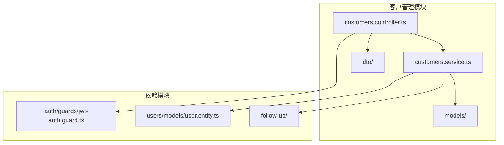
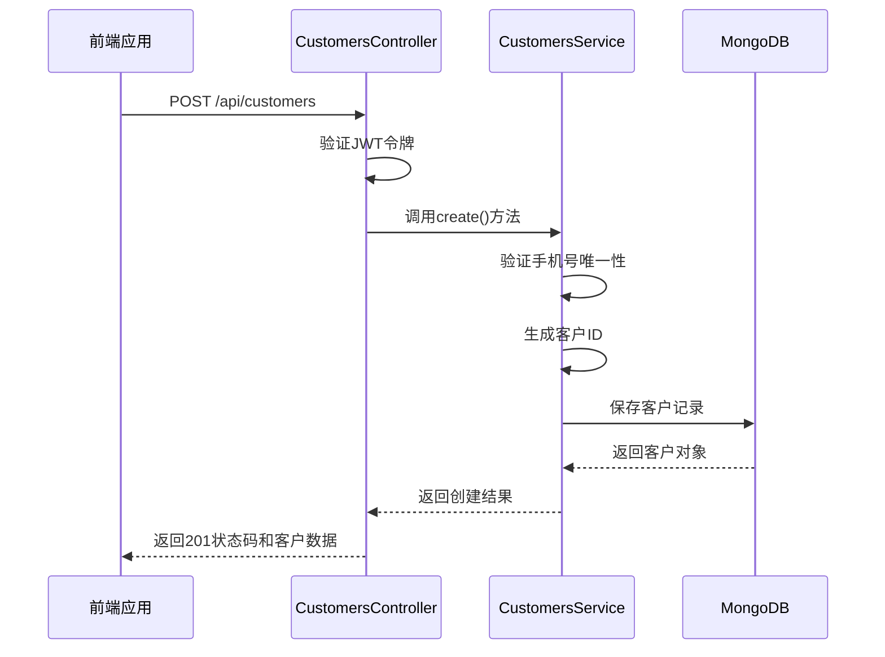
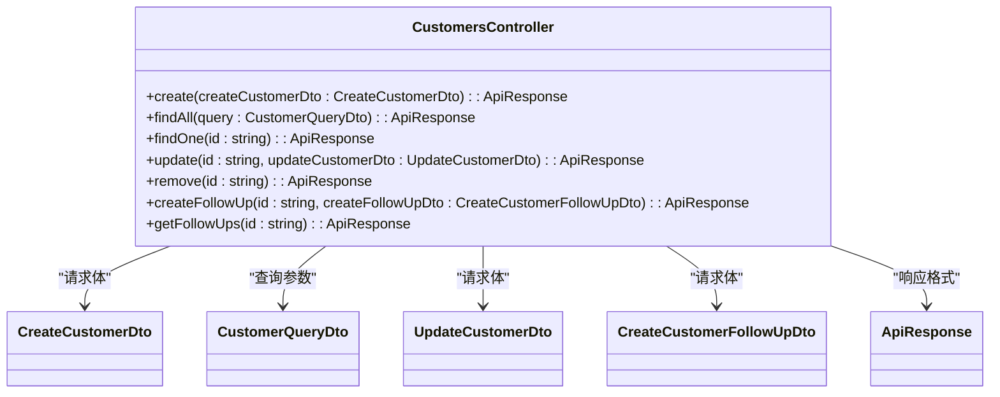
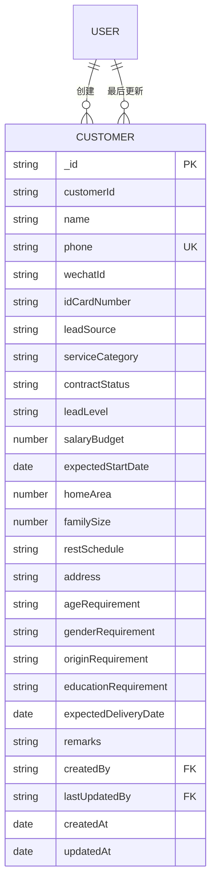
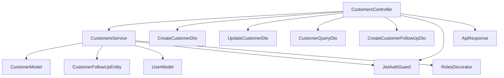

# 客户管理API

<cite>
**本文档引用的文件**  
- [customers.controller.ts](file://backend/src/modules/customers/customers.controller.ts#L0-L145)
- [customers.service.ts](file://backend/src/modules/customers/customers.service.ts#L0-L276)
- [create-customer.dto.ts](file://backend/src/modules/customers/dto/create-customer.dto.ts#L0-L116)
- [update-customer.dto.ts](file://backend/src/modules/customers/dto/update-customer.dto.ts#L0-L10)
- [customer-query.dto.ts](file://backend/src/modules/customers/dto/customer-query.dto.ts#L0-L63)
- [customer.model.ts](file://backend/src/modules/customers/models/customer.model.ts#L0-L98)
- [customer-follow-up.entity.ts](file://backend/src/modules/customers/models/customer-follow-up.entity.ts#L0-L63)
- [create-customer-follow-up.dto.ts](file://backend/src/modules/customers/dto/create-customer-follow-up.dto.ts#L0-L22)
- [jwt-auth.guard.ts](file://backend/src/modules/auth/guards/jwt-auth.guard.ts#L0-L21)
- [roles.decorator.ts](file://backend/src/modules/auth/decorators/roles.decorator.ts#L0-L2)
- [follow-up.controller.ts](file://backend/src/modules/follow-up/follow-up.controller.ts#L0-L106)
- [customerService.ts](file://frontend/src/services/customerService.ts#L0-L50)
- [customer.types.ts](file://frontend/src/types/customer.types.ts#L0-L101)
- [api-response.interface.ts](file://backend/src/common/interfaces/api-response.interface.ts)
</cite>

## 目录
1. [简介](#简介)
2. [项目结构](#项目结构)
3. [核心组件](#核心组件)
4. [架构概览](#架构概览)
5. [详细组件分析](#详细组件分析)
6. [依赖分析](#依赖分析)
7. [性能考虑](#性能考虑)
8. [故障排除指南](#故障排除指南)
9. [结论](#结论)

## 简介
本文档详细描述了客户管理模块的RESTful API接口，涵盖客户信息的创建、查询、更新和删除操作。文档包括HTTP方法、请求体结构、查询参数、响应数据格式及状态码说明。同时介绍了认证方式（JWT）和权限控制机制，并提供JSON请求/响应示例及curl调用方式。此外，还解释了客户跟进记录关联接口的集成方式。

## 项目结构
客户管理模块位于后端代码库的`/backend/src/modules/customers`目录下，采用NestJS框架实现，遵循MVC设计模式。模块包含控制器、服务、数据传输对象（DTO）、模型等组件，与用户、跟进记录等模块存在关联。



**图示来源**
- [customers.controller.ts](file://backend/src/modules/customers/customers.controller.ts#L0-L145)
- [customers.service.ts](file://backend/src/modules/customers/customers.service.ts#L0-L276)
- [customers.module.ts](file://backend/src/modules/customers/customers.module.ts#L0-L20)

**本节来源**
- [customers.controller.ts](file://backend/src/modules/customers/customers.controller.ts#L0-L145)
- [customers.module.ts](file://backend/src/modules/customers/customers.module.ts#L0-L20)

## 核心组件
客户管理模块的核心组件包括：
- **CustomersController**：处理HTTP请求，定义API端点
- **CustomersService**：实现业务逻辑，处理数据操作
- **CreateCustomerDto/UpdateCustomerDto**：定义请求数据结构和验证规则
- **CustomerModel**：定义数据库文档结构和字段类型
- **CustomerQueryDto**：定义分页和过滤查询参数

这些组件共同实现了客户信息的增删改查功能，并通过统一的API响应格式返回结果。

**本节来源**
- [customers.controller.ts](file://backend/src/modules/customers/customers.controller.ts#L0-L145)
- [customers.service.ts](file://backend/src/modules/customers/customers.service.ts#L0-L276)
- [create-customer.dto.ts](file://backend/src/modules/customers/dto/create-customer.dto.ts#L0-L116)
- [customer.model.ts](file://backend/src/modules/customers/models/customer.model.ts#L0-L98)

## 架构概览
客户管理API采用分层架构，前端通过HTTP请求调用后端API，后端通过控制器接收请求，服务层处理业务逻辑，最终与MongoDB数据库交互。所有API请求均需通过JWT认证守卫验证。



**图示来源**
- [customers.controller.ts](file://backend/src/modules/customers/customers.controller.ts#L38-L73)
- [customers.service.ts](file://backend/src/modules/customers/customers.service.ts#L26-L65)
- [jwt-auth.guard.ts](file://backend/src/modules/auth/guards/jwt-auth.guard.ts#L0-L21)

## 详细组件分析

### 客户管理控制器分析
CustomersController类定义了客户管理的所有API端点，使用`@Controller('customers')`装饰器指定基础路径，并通过`@UseGuards(JwtAuthGuard)`确保所有端点都需要JWT认证。

#### API端点定义


**图示来源**
- [customers.controller.ts](file://backend/src/modules/customers/customers.controller.ts#L0-L145)
- [create-customer.dto.ts](file://backend/src/modules/customers/dto/create-customer.dto.ts#L0-L116)
- [update-customer.dto.ts](file://backend/src/modules/customers/dto/update-customer.dto.ts#L0-L10)
- [customer-query.dto.ts](file://backend/src/modules/customers/dto/customer-query.dto.ts#L0-L63)

**本节来源**
- [customers.controller.ts](file://backend/src/modules/customers/customers.controller.ts#L0-L145)

### 创建客户DTO分析
CreateCustomerDto定义了创建客户时的请求体结构，使用class-validator进行字段验证，确保数据的完整性和正确性。

#### 请求体结构
```mermaid
classDiagram
class CreateCustomerDto {
+name : string
+phone : string
+wechatId? : string
+idCardNumber? : string
+leadSource : string
+contractStatus : string
+serviceCategory? : string
+leadLevel? : string
+salaryBudget? : number
+expectedStartDate? : string
+homeArea? : number
+familySize? : number
+restSchedule? : string
+address? : string
+ageRequirement? : string
+genderRequirement? : string
+originRequirement? : string
+educationRequirement? : string
+expectedDeliveryDate? : string
+remarks? : string
}
note right of CreateCustomerDto
必填字段：name, phone, leadSource, contractStatus
手机号需符合中国手机号格式
薪资预算范围：1000-50000元
end note
```

**图示来源**
- [create-customer.dto.ts](file://backend/src/modules/customers/dto/create-customer.dto.ts#L0-L116)

**本节来源**
- [create-customer.dto.ts](file://backend/src/modules/customers/dto/create-customer.dto.ts#L0-L116)

### 客户模型分析
Customer模型定义了数据库文档的结构，使用Mongoose Schema进行字段定义和类型约束。

#### 数据模型结构


**图示来源**
- [customer.model.ts](file://backend/src/modules/customers/models/customer.model.ts#L0-L98)

**本节来源**
- [customer.model.ts](file://backend/src/modules/customers/models/customer.model.ts#L0-L98)

### 客户查询DTO分析
CustomerQueryDto定义了分页查询和过滤的参数结构，支持多种搜索和排序选项。

#### 查询参数结构
```mermaid
classDiagram
class CustomerQueryDto {
+search? : string
+name? : string
+phone? : string
+caregiverName? : string
+caregiverPhone? : string
+leadSource? : string
+serviceCategory? : string
+contractStatus? : string
+leadLevel? : string
+page? : number = 1
+limit? : number = 10
+sortBy? : string = "createdAt"
+sortOrder? : "asc" | "desc" = "desc"
}
note right of CustomerQueryDto
默认分页：每页10条，按创建时间倒序
支持客户姓名、手机号模糊搜索
支持按阿姨姓名和手机号过滤
end note
```

**图示来源**
- [customer-query.dto.ts](file://backend/src/modules/customers/dto/customer-query.dto.ts#L0-L63)

**本节来源**
- [customer-query.dto.ts](file://backend/src/modules/customers/dto/customer-query.dto.ts#L0-L63)

### 更新客户DTO分析
UpdateCustomerDto继承自CreateCustomerDto，使用PartialType使其所有字段变为可选，同时对contractStatus字段添加了特定的枚举验证。

#### 更新请求体结构
```mermaid
classDiagram
class CreateCustomerDto {
+name : string
+phone : string
+wechatId? : string
+idCardNumber? : string
+leadSource : string
+contractStatus : string
+serviceCategory? : string
+leadLevel? : string
+salaryBudget? : number
+expectedStartDate? : string
+homeArea? : number
+familySize? : number
+restSchedule? : string
+address? : string
+ageRequirement? : string
+genderRequirement? : string
+originRequirement? : string
+educationRequirement? : string
+expectedDeliveryDate? : string
+remarks? : string
}
class UpdateCustomerDto {
+contractStatus? : string
}
UpdateCustomerDto --|> CreateCustomerDto : "继承"
note right of UpdateCustomerDto
所有字段均为可选
contractStatus字段有独立的验证规则
end note
```

**图示来源**
- [update-customer.dto.ts](file://backend/src/modules/customers/dto/update-customer.dto.ts#L0-L10)
- [create-customer.dto.ts](file://backend/src/modules/customers/dto/create-customer.dto.ts#L0-L116)

**本节来源**
- [update-customer.dto.ts](file://backend/src/modules/customers/dto/update-customer.dto.ts#L0-L10)

## 依赖分析
客户管理模块依赖于多个其他模块和组件，形成了清晰的依赖关系网络。



**图示来源**
- [customers.controller.ts](file://backend/src/modules/customers/customers.controller.ts#L0-L145)
- [customers.service.ts](file://backend/src/modules/customers/customers.service.ts#L0-L276)
- [customers.module.ts](file://backend/src/modules/customers/customers.module.ts#L0-L20)

**本节来源**
- [customers.controller.ts](file://backend/src/modules/customers/customers.controller.ts#L0-L145)
- [customers.service.ts](file://backend/src/modules/customers/customers.service.ts#L0-L276)

## 性能考虑
客户管理API在设计时考虑了性能优化，主要体现在以下几个方面：
- 在CustomerFollowUp实体上创建了复合索引（customerId + createdAt），提高了按客户ID查询跟进记录的性能
- 使用Mongoose的populate功能实现关联查询，减少数据库往返次数
- 分页查询支持指定排序字段和方向，避免全表扫描
- 对手机号字段设置了唯一索引，确保数据完整性的同时提高查询效率

## 故障排除指南
### 常见问题及解决方案
1. **创建客户失败 - 手机号已存在**
   - 问题原因：系统检测到手机号已存在客户记录
   - 解决方案：检查请求中的手机号是否已存在于系统中，或使用更新接口修改现有客户信息

2. **401 Unauthorized错误**
   - 问题原因：未提供JWT令牌或令牌已过期
   - 解决方案：确保在请求头中包含有效的Authorization: Bearer <token>字段

3. **403 Forbidden错误**
   - 问题原因：用户权限不足
   - 解决方案：检查用户角色是否具有访问该API的权限

4. **分页查询结果不正确**
   - 问题原因：查询参数格式错误或超出范围
   - 解决方案：检查page和limit参数是否为正整数，且符合系统限制

**本节来源**
- [customers.service.ts](file://backend/src/modules/customers/customers.service.ts#L26-L65)
- [jwt-auth.guard.ts](file://backend/src/modules/auth/guards/jwt-auth.guard.ts#L0-L21)

## 结论
客户管理API提供了一套完整的RESTful接口，支持客户信息的增删改查操作。API设计遵循REST原则，使用统一的响应格式，具有良好的可读性和易用性。通过JWT认证和潜在的角色权限控制，确保了API的安全性。结合详细的DTO验证和数据库索引优化，系统在保证数据完整性的同时也具有良好的性能表现。