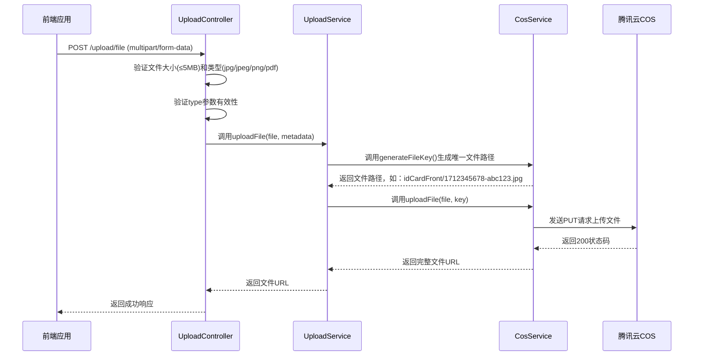
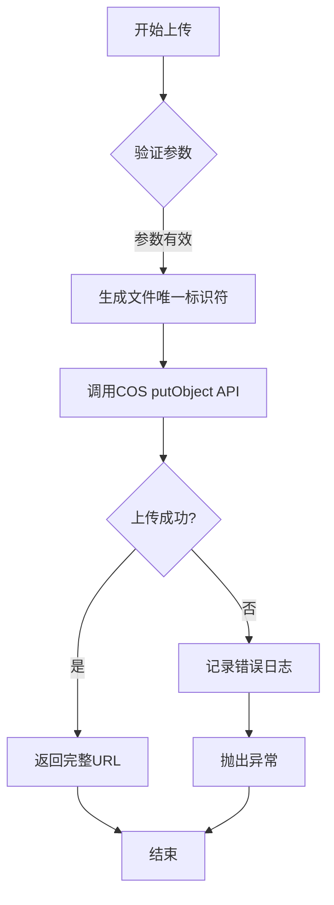
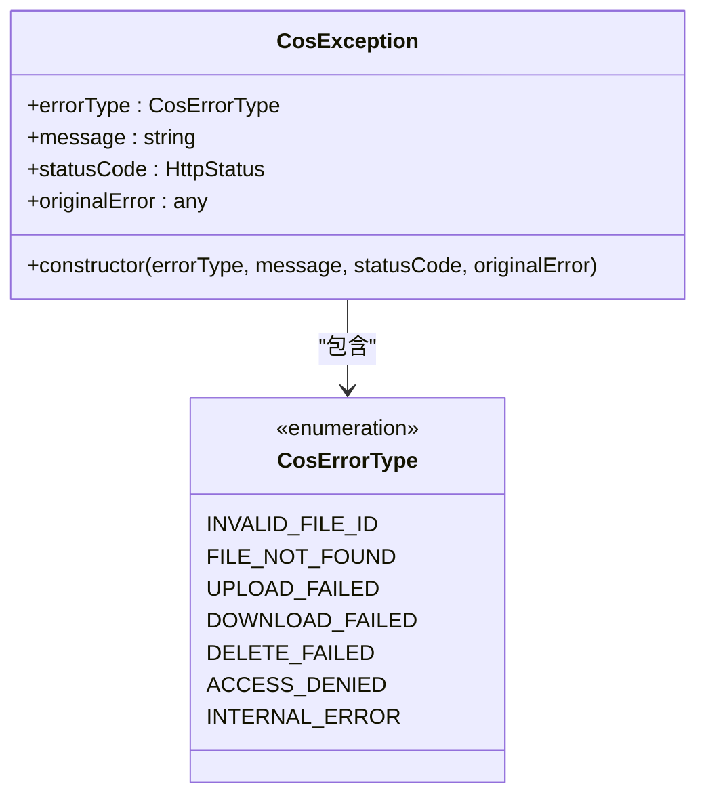

# 文件上传API

<cite>
**本文档引用的文件**  
- [upload.controller.ts](file://backend/src/modules/upload/upload.controller.ts#L1-L171)
- [cos.service.ts](file://backend/src/modules/upload/cos.service.ts#L1-L212)
- [upload.service.ts](file://backend/src/modules/upload/upload.service.ts#L1-L93)
- [cos.exception.ts](file://backend/src/modules/upload/exceptions/cos.exception.ts#L1-L30)
- [cos.config.ts](file://backend/src/config/cos.config.ts#L1-L20)
- [IDUploader.tsx](file://frontend/src/components/IDUploader.tsx#L1-L243)
- [upload.ts](file://frontend/src/constants/upload.ts#L1-L12)
</cite>

## 目录
1. [简介](#简介)
2. [核心接口说明](#核心接口说明)
3. [COS服务集成逻辑](#cos服务集成逻辑)
4. [错误处理机制](#错误处理机制)
5. [前后端协作流程](#前后端协作流程)
6. [用户体验实现](#用户体验实现)
7. [使用示例](#使用示例)

## 简介
本文档详细描述了系统中文件上传功能的API设计与实现，重点介绍与腾讯云对象存储（COS）的集成方案。文档涵盖后端API接口定义、COS服务处理逻辑、前端ID上传组件交互流程，以及完整的错误处理策略。该功能支持身份证正反面、个人照片、证书和报告等多种文件类型的上传，广泛应用于用户身份验证等业务场景。

## 核心接口说明

### POST /upload/file 接口
该接口用于将文件上传至腾讯云COS存储服务。

**请求方法**  
`POST /upload/file`

**请求头**  
```
Content-Type: multipart/form-data
```

**请求参数**  
| 参数名 | 类型 | 必填 | 说明 |
|--------|------|------|------|
| file | binary | 是 | 要上传的文件内容 |
| type | string | 是 | 文件类型，可选值：`idCardFront`, `idCardBack`, `personalPhoto`, `certificate`, `report` |

**文件限制**  
- **大小限制**：最大5MB（5 * 1024 * 1024 字节）
- **类型限制**：仅允许JPG、JPEG、PNG、PDF格式

**成功响应（201）**  
```json
{
  "success": true,
  "data": {
    "fileUrl": "https://housekeeping-1254058915.cos.ap-guangzhou.myqcloud.com/personalPhoto/1712345678-abc123.jpg",
    "filename": "id_front.jpg",
    "mimeType": "image/jpeg",
    "size": 102400
  }
}
```

**错误响应（400）**  
```json
{
  "errorType": "UPLOAD_FAILED",
  "message": "文件上传失败: 文件大小超过限制",
  "statusCode": 400,
  "timestamp": "2024-04-05T10:00:00.000Z"
}
```

**接口实现流程**  


**接口来源**  
- [upload.controller.ts](file://backend/src/modules/upload/upload.controller.ts#L28-L85)

## COS服务集成逻辑

### COS服务配置
COS服务使用以下配置连接腾讯云：

**配置项**  
- **SecretId**: AKIDjNmxrVs53we6JG0VllVzDArIcppZ9UZN
- **SecretKey**: czCML4XrwlJadYDcldFeojOmumPmsiJe
- **Bucket**: housekeeping-1254058915
- **Region**: ap-guangzhou
- **Domain**: housekeeping-1254058915.cos.ap-guangzhou.myqcloud.com
- **UploadExpireTime**: 600秒（上传凭证有效期）
- **DownloadExpireTime**: 3600秒（下载链接有效期）

**配置来源**  
- [cos.config.ts](file://backend/src/config/cos.config.ts#L1-L20)

### 文件上传流程
COS服务通过`cos-nodejs-sdk-v5` SDK与腾讯云进行交互。



**关键方法说明**  
- **generateFileKey**: 生成唯一文件路径，格式为`{type}/{timestamp}-{randomStr}.{extension}`
- **uploadFile**: 调用COS SDK的putObject方法上传文件
- **getSignedUrl**: 生成带签名的访问URL，用于安全下载
- **deleteFile**: 删除COS中的文件

**服务来源**  
- [cos.service.ts](file://backend/src/modules/upload/cos.service.ts#L1-L212)
- [upload.service.ts](file://backend/src/modules/upload/upload.service.ts#L1-L93)

## 错误处理机制

### COS异常类型
系统定义了多种COS相关的错误类型，便于前端进行针对性处理。



**错误码说明**  
| 错误类型 | HTTP状态码 | 说明 |
|----------|------------|------|
| INVALID_FILE_ID | 400 | 文件ID格式无效 |
| FILE_NOT_FOUND | 404 | 文件在COS中不存在 |
| UPLOAD_FAILED | 400 | 文件上传失败 |
| DOWNLOAD_FAILED | 400 | 文件下载失败 |
| DELETE_FAILED | 400 | 文件删除失败 |
| ACCESS_DENIED | 403 | 访问被拒绝 |
| INTERNAL_ERROR | 500 | 内部服务器错误 |

**异常处理策略**  
1. 在`UploadController`中捕获所有上传相关异常
2. 如果异常已是`CosException`类型，则直接抛出
3. 对于其他异常，包装为`CosException`并设置适当的错误类型
4. 返回结构化错误响应，包含错误类型、消息和时间戳

**异常来源**  
- [cos.exception.ts](file://backend/src/modules/upload/exceptions/cos.exception.ts#L1-L30)

## 前后端协作流程

### 组件架构
```mermaid
graph TB
subgraph "前端"
IDUploader[IDUploader组件]
API[API服务]
end
subgraph "后端"
Controller[UploadController]
Service[UploadService]
COS[CosService]
TencentCOS[腾讯云COS]
end
IDUploader --> API: 调用上传API
API --> Controller: 发送multipart/form-data请求
Controller --> Service: 调用uploadFile方法
Service --> COS: 生成文件路径并上传
COS --> TencentCOS: 实际文件存储
TencentCOS --> COS: 返回上传结果
COS --> Service: 返回文件URL
Service --> Controller: 返回成功响应
Controller --> API: 返回JSON数据
API --> IDUploader: 更新UI状态
```

### 数据流说明
1. 前端用户选择文件
2. 前端进行初步验证（类型、大小）
3. 调用后端`/upload/file`接口
4. 后端进行二次验证并上传至COS
5. 后端返回文件URL
6. 前端更新界面显示上传状态

**协作来源**  
- [IDUploader.tsx](file://frontend/src/components/IDUploader.tsx#L1-L243)
- [upload.controller.ts](file://backend/src/modules/upload/upload.controller.ts#L28-L85)

## 用户体验实现

### 前端验证规则
前端在上传前进行双重验证，提升用户体验：

**验证规则**  
- **文件类型**: 仅允许图片文件（`image/*`）
- **文件大小**: 不超过5MB（5 * 1024 * 1024 字节）
- **实时反馈**: 验证失败时显示错误消息，3秒后自动消失

**配置来源**  
- [upload.ts](file://frontend/src/constants/upload.ts#L1-L12)

### 用户界面交互
ID上传组件提供直观的用户界面：

**功能特性**  
- **双面上传**: 支持身份证正反面分别上传
- **实时预览**: 上传后立即显示图片预览
- **状态指示**: 显示"已上传"或"未上传"状态
- **删除功能**: 可删除已上传的文件重新选择
- **错误提示**: 红色横幅显示错误信息
- **上传指南**: 提供清晰的上传要求说明

**交互流程**  
```mermaid
flowchart TD
A[用户进入上传页面] --> B[点击"选择文件"按钮]
B --> C[系统打开文件选择对话框]
C --> D[用户选择文件]
D --> E{文件验证}
E --> |通过| F[显示预览和"已上传"状态]
E --> |不通过| G[显示错误消息]
G --> H[3秒后自动清除错误]
F --> I[用户可选择删除重新上传]
I --> B
```

**组件来源**  
- [IDUploader.tsx](file://frontend/src/components/IDUploader.tsx#L1-L243)

## 使用示例

### cURL上传示例
```bash
curl -X POST "http://localhost:3000/upload/file" \
  -H "Content-Type: multipart/form-data" \
  -F "file=@/path/to/id_front.jpg" \
  -F "type=idCardFront"
```

**成功响应**  
```json
{
  "success": true,
  "data": {
    "fileUrl": "https://housekeeping-1254058915.cos.ap-guangzhou.myqcloud.com/idCardFront/1712345678-abc123.jpg",
    "filename": "id_front.jpg",
    "mimeType": "image/jpeg",
    "size": 102400
  }
}
```

### 上传失败重试机制
系统建议的重试策略：

**重试逻辑**  
1. 捕获上传失败错误
2. 检查错误类型
3. 对于网络相关错误（如`UPLOAD_FAILED`），等待2秒后重试
4. 最多重试3次
5. 仍失败则提示用户检查网络连接

**伪代码实现**  
```typescript
async function uploadWithRetry(file, type, maxRetries = 3) {
  for (let i = 0; i <= maxRetries; i++) {
    try {
      return await uploadFile(file, type);
    } catch (error) {
      if (i === maxRetries || error.errorType !== 'UPLOAD_FAILED') {
        throw error;
      }
      // 指数退避
      await sleep(2000 * Math.pow(2, i));
    }
  }
}
```

**重试来源**  
- [IDUploader.tsx](file://frontend/src/components/IDUploader.tsx#L1-L243)
- [upload.controller.ts](file://backend/src/modules/upload/upload.controller.ts#L28-L85)