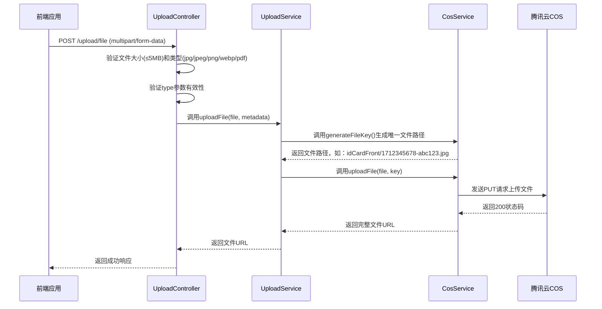
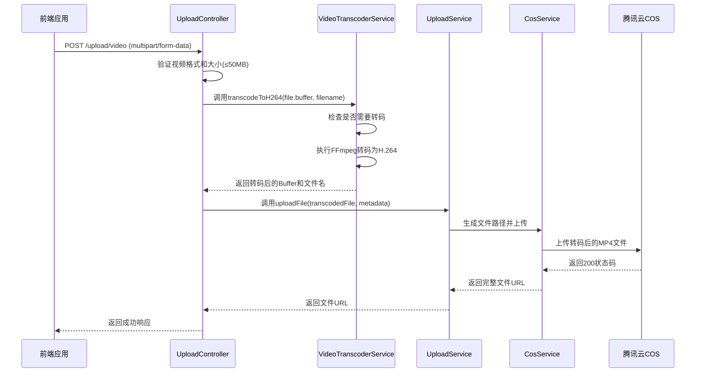
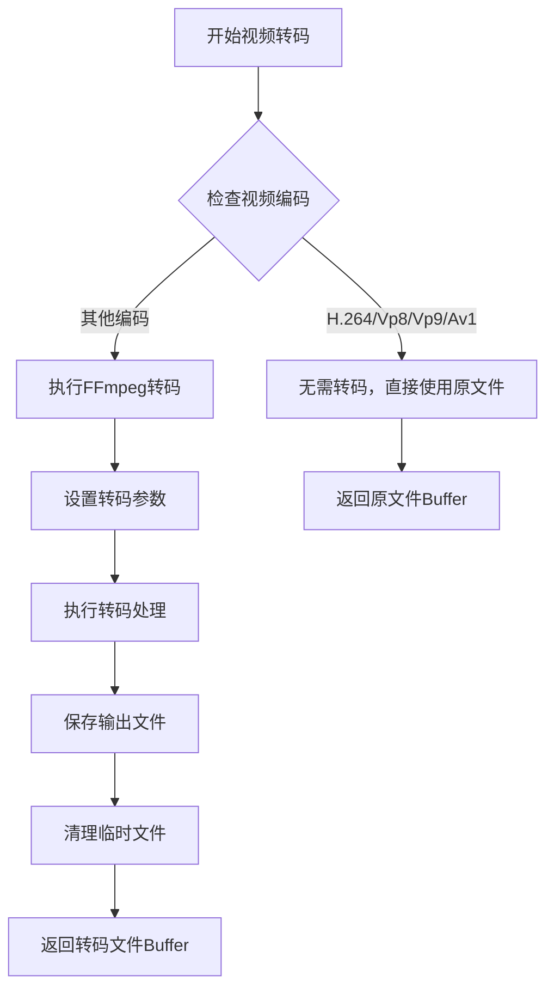
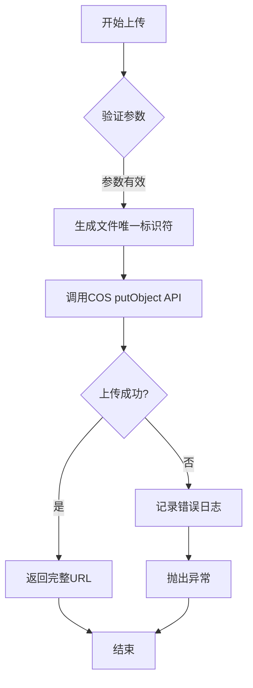
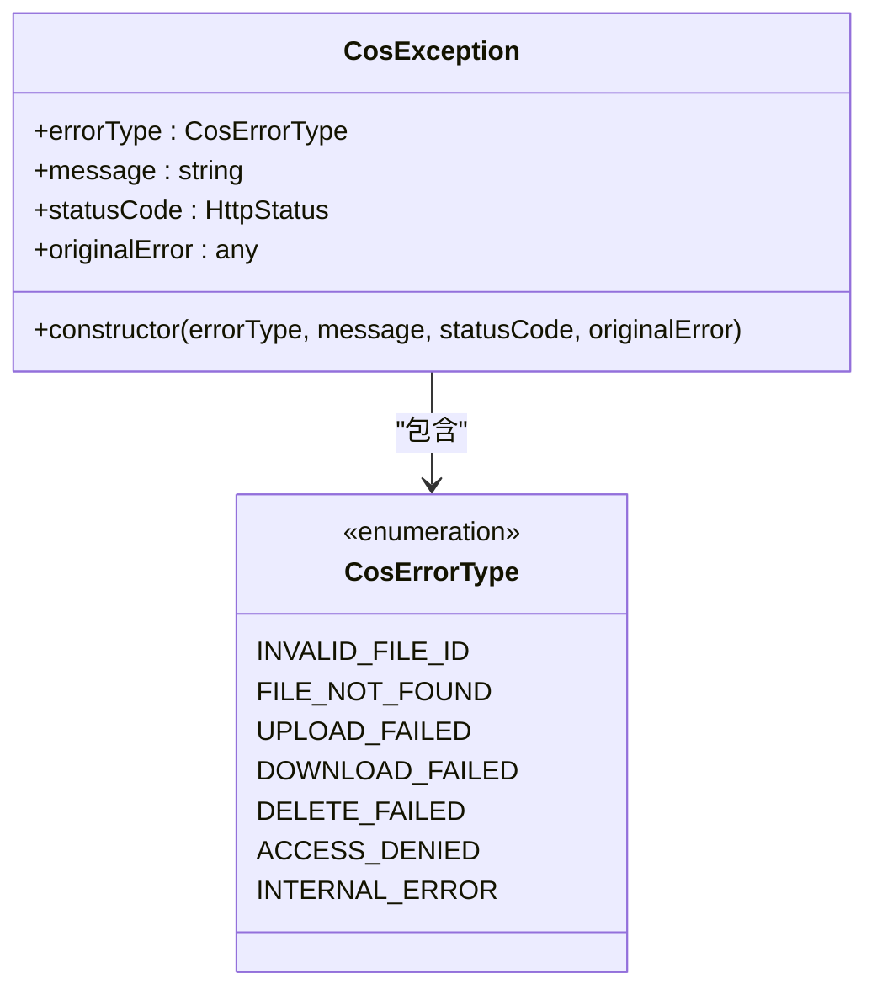

# 文件上传API

<cite>
**本文档引用的文件**  
- [upload.controller.ts](file://backend/src/modules/upload/upload.controller.ts#L1-L272)
- [cos.service.ts](file://backend/src/modules/upload/cos.service.ts#L1-L213)
- [upload.service.ts](file://backend/src/modules/upload/upload.service.ts#L1-L93)
- [video-transcoder.service.ts](file://backend/src/modules/upload/video-transcoder.service.ts#L1-L147)
- [cos.exception.ts](file://backend/src/modules/upload/exceptions/cos.exception.ts#L1-L30)
- [cos.config.ts](file://backend/src/config/cos.config.ts#L1-L20)
- [IDUploader.tsx](file://frontend/src/components/IDUploader.tsx#L1-L243)
- [VideoUpload.tsx](file://frontend/src/components/VideoUpload.tsx#L1-L235)
- [upload.ts](file://frontend/src/constants/upload.ts#L1-L15)
</cite>

## 更新摘要
**变更内容**   
- 新增视频转码和大文件支持功能
- 添加POST /upload/video接口用于视频上传
- 扩展文件大小限制从5MB到50MB
- 增强浏览器兼容性处理（H.264格式）
- 更新前端视频上传组件和进度显示

## 目录
1. [简介](#简介)
2. [核心接口说明](#核心接口说明)
3. [视频转码功能](#视频转码功能)
4. [COS服务集成逻辑](#cos服务集成逻辑)
5. [错误处理机制](#错误处理机制)
6. [前后端协作流程](#前后端协作流程)
7. [用户体验实现](#用户体验实现)
8. [使用示例](#使用示例)

## 简介
本文档详细描述了系统中文件上传功能的API设计与实现，重点介绍与腾讯云对象存储（COS）的集成方案。文档涵盖后端API接口定义、COS服务处理逻辑、视频转码功能、前端组件交互流程，以及完整的错误处理策略。该功能支持身份证正反面、个人照片、证书和报告等多种文件类型的上传，现已扩展支持视频文件的自动转码和大文件上传，广泛应用于用户身份验证、视频展示等业务场景。

## 核心接口说明

### POST /upload/file 接口
该接口用于将文件上传至腾讯云COS存储服务。

**请求方法**  
`POST /upload/file`

**请求头**  
```
Content-Type: multipart/form-data
```

**请求参数**  
| 参数名 | 类型 | 必填 | 说明 |
|--------|------|------|------|
| file | binary | 是 | 要上传的文件内容 |
| type | string | 是 | 文件类型，可选值：`idCardFront`, `idCardBack`, `personalPhoto`, `certificate`, `report`, `medicalReport`, `confinementMealPhoto`, `cookingPhoto`, `complementaryFoodPhoto`, `positiveReviewPhoto`, `workExperiencePhoto`, `banner`, `article` |

**文件限制**  
- **大小限制**：最大5MB（5 * 1024 * 1024 字节）
- **类型限制**：仅允许JPG、JPEG、PNG、WEBP、PDF格式

**成功响应（201）**  
```json
{
  "success": true,
  "data": {
    "fileUrl": "https://housekeeping-1254058915.cos.ap-guangzhou.myqcloud.com/personalPhoto/1712345678-abc123.jpg",
    "filename": "id_front.jpg",
    "mimeType": "image/jpeg",
    "size": 102400
  }
}
```

**接口实现流程**  


**接口来源**  
- [upload.controller.ts](file://backend/src/modules/upload/upload.controller.ts#L38-L101)

### POST /upload/video 接口
该接口用于上传视频文件，系统会自动将其转码为H.264格式以确保浏览器兼容性。

**请求方法**  
`POST /upload/video`

**请求头**  
```
Content-Type: multipart/form-data
```

**请求参数**  
| 参数名 | 类型 | 必填 | 说明 |
|--------|------|------|------|
| file | binary | 是 | 要上传的视频文件内容 |
| type | string | 是 | 视频类型，当前仅支持：`selfIntroductionVideo` |

**文件限制**  
- **大小限制**：最大50MB（50 * 1024 * 1024 字节）
- **类型限制**：支持MP4、QuickTime、AVI、WMV、WebM、MPEG、3GP等格式

**成功响应（201）**  
```json
{
  "success": true,
  "data": {
    "fileUrl": "https://housekeeping-1254058915.cos.ap-guangzhou.myqcloud.com/selfIntroductionVideo/1712345678-abc123.mp4",
    "filename": "introduction_video.mp4",
    "originalFilename": "introduction_video.mov",
    "mimeType": "video/mp4",
    "size": 20971520,
    "originalSize": 41943040
  }
}
```

**接口实现流程**  


**接口来源**  
- [upload.controller.ts](file://backend/src/modules/upload/upload.controller.ts#L180-L271)

## 视频转码功能

### 视频转码服务
VideoTranscoderService负责将各种格式的视频文件转码为H.264格式，确保在浏览器中的兼容性和流畅播放。

**转码配置**  
- **目标格式**：H.264 (libx264)
- **音频格式**：AAC
- **像素格式**：yuv420p (提高兼容性)
- **优化选项**：movflags +faststart (优化Web播放)
- **质量控制**：CRF 23 (平衡质量和文件大小)

**转码流程**  


**关键特性**  
- **智能检测**：自动检测视频编码格式，避免不必要的转码
- **浏览器兼容**：确保输出格式在主流浏览器中正常播放
- **质量保证**：使用CRF 23保持良好的视觉质量
- **性能优化**：启用faststart优化视频在网络环境下的播放性能

**服务来源**  
- [video-transcoder.service.ts](file://backend/src/modules/upload/video-transcoder.service.ts#L1-L147)

### FFmpeg配置详解
视频转码使用fluent-ffmpeg库进行处理，配置如下：

**视频编码参数**  
- `libx264`: H.264视频编码器
- `-preset fast`: 转码速度设置为fast
- `-crf 23`: 视频质量控制 (0-51, 数值越小质量越高)
- `-movflags +faststart`: 优化移动设备播放

**音频编码参数**  
- `aac`: AAC音频编码器
- 自动保留原始音频质量

**像素格式**  
- `yuv420p`: 提高跨平台兼容性

**错误处理**  
- 转码过程中捕获并记录详细的进度信息
- 异常情况自动清理临时文件
- 提供详细的错误日志便于调试

**配置来源**  
- [video-transcoder.service.ts](file://backend/src/modules/upload/video-transcoder.service.ts#L90-L119)

## COS服务集成逻辑

### COS服务配置
COS服务使用以下配置连接腾讯云：

**配置项**  
- **SecretId**: AKIDjNmxrVs53we6JG0VllVzDArIcppZ9UZN
- **SecretKey**: czCML4XrwlJadYDcldFeojOmumPmsiJe
- **Bucket**: housekeeping-1254058915
- **Region**: ap-guangzhou
- **Domain**: housekeeping-1254058915.cos.ap-guangzhou.myqcloud.com
- **UploadMaxSize**: 50MB（用于视频上传）
- **UploadExpireTime**: 600秒（上传凭证有效期）
- **DownloadExpireTime**: 3600秒（下载链接有效期）

**配置来源**  
- [cos.config.ts](file://backend/src/config/cos.config.ts#L1-L20)

### 文件上传流程
COS服务通过`cos-nodejs-sdk-v5` SDK与腾讯云进行交互。



**关键方法说明**  
- **generateFileKey**: 生成唯一文件路径，格式为`{type}/{timestamp}-{randomStr}.{extension}`
- **uploadFile**: 调用COS SDK的putObject方法上传文件
- **getSignedUrl**: 生成带签名的访问URL，用于安全下载
- **deleteFile**: 删除COS中的文件
- **doesFileExist**: 检查文件是否存在
- **getFileInfo**: 获取文件元数据信息
- **listFiles**: 获取文件列表
- **getUploadCredentials**: 获取上传凭证（用于分片上传）

**服务来源**  
- [cos.service.ts](file://backend/src/modules/upload/cos.service.ts#L1-L213)

## 错误处理机制

### COS异常类型
系统定义了多种COS相关的错误类型，便于前端进行针对性处理。



**错误码说明**  
| 错误类型 | HTTP状态码 | 说明 |
|----------|------------|------|
| INVALID_FILE_ID | 400 | 文件ID格式无效 |
| FILE_NOT_FOUND | 404 | 文件在COS中不存在 |
| UPLOAD_FAILED | 400 | 文件上传失败 |
| DOWNLOAD_FAILED | 400 | 文件下载失败 |
| DELETE_FAILED | 400 | 文件删除失败 |
| ACCESS_DENIED | 403 | 访问被拒绝 |
| INTERNAL_ERROR | 500 | 内部服务器错误 |

**异常处理策略**  
1. 在`UploadController`中捕获所有上传相关异常
2. 如果异常已是`CosException`类型，则直接抛出
3. 对于其他异常，包装为`CosException`并设置适当的错误类型
4. 返回结构化错误响应，包含错误类型、消息和时间戳

**异常来源**  
- [cos.exception.ts](file://backend/src/modules/upload/exceptions/cos.exception.ts#L1-L30)

## 前后端协作流程

### 组件架构
```mermaid
graph TB
subgraph "前端"
IDUploader[IDUploader组件]
VideoUpload[VideoUpload组件]
API[API服务]
end
subgraph "后端"
Controller[UploadController]
VideoTranscoder[VideoTranscoderService]
UploadService[UploadService]
COS[CosService]
TencentCOS[腾讯云COS]
end
IDUploader --> API: 调用上传API
VideoUpload --> API: 调用视频上传API
API --> Controller: 发送multipart/form-data请求
Controller --> VideoTranscoder: 视频转码处理
Controller --> UploadService: 调用uploadFile方法
VideoTranscoder --> UploadService: 返回转码后的文件
UploadService --> COS: 生成文件路径并上传
COS --> TencentCOS: 实际文件存储
TencentCOS --> COS: 返回上传结果
COS --> UploadService: 返回文件URL
UploadService --> Controller: 返回成功响应
Controller --> API: 返回JSON数据
API --> IDUploader: 更新UI状态
API --> VideoUpload: 更新UI状态
```

### 数据流说明
1. 前端用户选择文件
2. 前端进行初步验证（类型、大小）
3. 调用后端相应接口
4. 后端进行二次验证并上传至COS
5. 后端返回文件URL
6. 前端更新界面显示上传状态

**协作来源**  
- [IDUploader.tsx](file://frontend/src/components/IDUploader.tsx#L1-L243)
- [VideoUpload.tsx](file://frontend/src/components/VideoUpload.tsx#L1-L235)
- [upload.controller.ts](file://backend/src/modules/upload/upload.controller.ts#L38-L271)

## 用户体验实现

### 前端验证规则
前端在上传前进行双重验证，提升用户体验：

**文件类型验证**  
- **图片文件**: 仅允许图片文件（`image/*`）
- **PDF文件**: 仅允许PDF文件（`application/pdf`）
- **视频文件**: 支持MP4、QuickTime、AVI、WebM等格式

**文件大小验证**  
- **图片/PDF**: 不超过5MB（5 * 1024 * 1024 字节）
- **视频**: 不超过50MB（50 * 1024 * 1024 字节）

**实时反馈**  
- 验证失败时显示错误消息，3秒后自动消失
- 上传过程中显示详细的进度信息
- 成功上传后显示文件信息和操作按钮

**配置来源**  
- [upload.ts](file://frontend/src/constants/upload.ts#L1-L15)

### 用户界面交互
ID上传组件和视频上传组件提供直观的用户界面：

**ID上传组件功能特性**  
- **双面上传**: 支持身份证正反面分别上传
- **实时预览**: 上传后立即显示图片预览
- **状态指示**: 显示"已上传"或"未上传"状态
- **删除功能**: 可删除已上传的文件重新选择
- **错误提示**: 红色横幅显示错误信息
- **上传指南**: 提供清晰的上传要求说明

**视频上传组件功能特性**  
- **进度显示**: 分阶段显示上传和转码进度
- **状态提示**: 显示"正在上传"、"正在转码"、"即将完成"等状态
- **预览功能**: 支持视频预览和删除操作
- **错误处理**: 详细的错误提示和重试机制
- **模拟进度**: 通过定时器模拟上传和转码进度

**交互流程**  
```mermaid
flowchart TD
A[用户进入上传页面] --> B[点击"选择文件"按钮]
B --> C[系统打开文件选择对话框]
C --> D[用户选择文件]
D --> E{文件验证}
E --> |通过| F[显示预览和"已上传"状态]
E --> |不通过| G[显示错误消息]
G --> H[3秒后自动清除错误]
F --> I[用户可选择删除重新上传]
I --> B
```

**组件来源**  
- [IDUploader.tsx](file://frontend/src/components/IDUploader.tsx#L1-L243)
- [VideoUpload.tsx](file://frontend/src/components/VideoUpload.tsx#L1-L235)

## 使用示例

### cURL上传示例

#### 图片/PDF文件上传
```bash
curl -X POST "http://localhost:3000/upload/file" \
  -H "Content-Type: multipart/form-data" \
  -F "file=@/path/to/id_front.jpg" \
  -F "type=idCardFront"
```

**成功响应**  
```json
{
  "success": true,
  "data": {
    "fileUrl": "https://housekeeping-1254058915.cos.ap-guangzhou.myqcloud.com/idCardFront/1712345678-abc123.jpg",
    "filename": "id_front.jpg",
    "mimeType": "image/jpeg",
    "size": 102400
  }
}
```

#### 视频文件上传
```bash
curl -X POST "http://localhost:3000/upload/video" \
  -H "Content-Type: multipart/form-data" \
  -F "file=@/path/to/introduction_video.mov" \
  -F "type=selfIntroductionVideo"
```

**成功响应**  
```json
{
  "success": true,
  "data": {
    "fileUrl": "https://housekeeping-1254058915.cos.ap-guangzhou.myqcloud.com/selfIntroductionVideo/1712345678-abc123.mp4",
    "filename": "introduction_video.mp4",
    "originalFilename": "introduction_video.mov",
    "mimeType": "video/mp4",
    "size": 20971520,
    "originalSize": 41943040
  }
}
```

### 上传失败重试机制
系统建议的重试策略：

**重试逻辑**  
1. 捕获上传失败错误
2. 检查错误类型
3. 对于网络相关错误（如`UPLOAD_FAILED`），等待2秒后重试
4. 最多重试3次
5. 仍失败则提示用户检查网络连接

**伪代码实现**  
```typescript
async function uploadWithRetry(file, type, maxRetries = 3) {
  for (let i = 0; i <= maxRetries; i++) {
    try {
      return await uploadFile(file, type);
    } catch (error) {
      if (i === maxRetries || error.errorType !== 'UPLOAD_FAILED') {
        throw error;
      }
      // 指数退避
      await sleep(2000 * Math.pow(2, i));
    }
  }
}
```

**重试来源**  
- [IDUploader.tsx](file://frontend/src/components/IDUploader.tsx#L1-L243)
- [VideoUpload.tsx](file://frontend/src/components/VideoUpload.tsx#L1-L235)
- [upload.controller.ts](file://backend/src/modules/upload/upload.controller.ts#L38-L271)