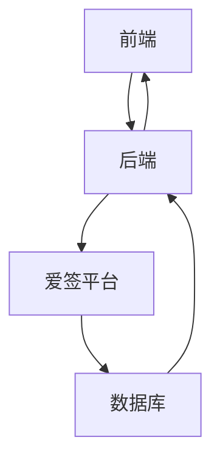
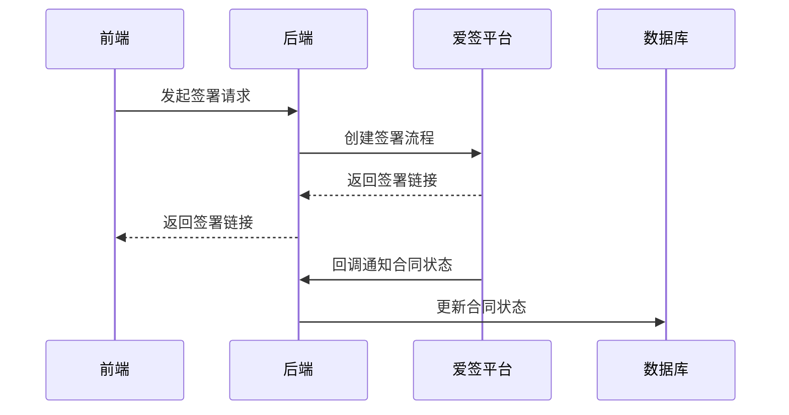
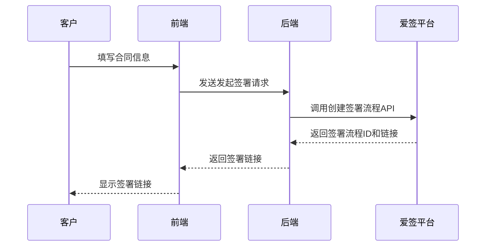
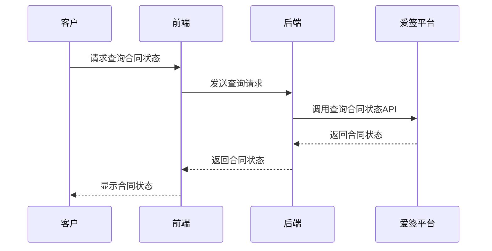
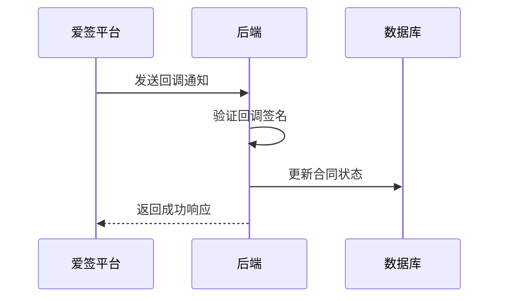
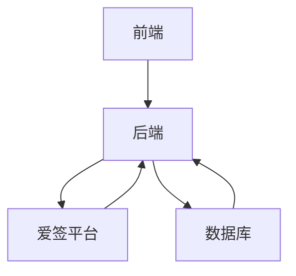

# 电子签约API

<cite>
**本文档引用的文件**
- [esign.controller.ts](file://backend/src/modules/esign/esign.controller.ts)
- [esign.service.ts](file://backend/src/modules/esign/esign.service.ts)
- [Payment.tsx](file://frontend/src/pages/Payment.tsx)
- [Api.py](file://爱签SDK/Api.py)
- [HttpUtils.py](file://爱签SDK/HttpUtils.py)
- [esign_payment_integration.js](file://backend/esign_payment_integration.js)
</cite>

## 目录
1. [简介](#简介)
2. [项目结构](#项目结构)
3. [核心组件](#核心组件)
4. [架构概述](#架构概述)
5. [详细组件分析](#详细组件分析)
6. [依赖分析](#依赖分析)
7. [性能考虑](#性能考虑)
8. [故障排除指南](#故障排除指南)
9. [结论](#结论)

## 简介
本文档详细描述了与爱签平台集成的电子签约功能API。重点介绍了发起签署、查询签署状态和处理回调通知等核心端点。文档还涵盖了请求参数、签名机制、回调验证逻辑以及错误处理策略。此外，提供了与前端支付流程（Payment.tsx）的集成示例，以及合同状态同步的实现方式。通过curl示例展示了如何安全地调用这些API，并解释了服务端签名（signStrategy.cs）在流程中的作用。

## 项目结构
电子签约功能主要分布在后端和前端两个部分。后端位于`backend/src/modules/esign`目录下，包含控制器、服务和模块文件。前端位于`frontend/src/pages/Payment.tsx`，负责支付流程的用户界面。

**图源**
- [esign.controller.ts](file://backend/src/modules/esign/esign.controller.ts)
- [esign.service.ts](file://backend/src/modules/esign/esign.service.ts)

**节源**
- [esign.controller.ts](file://backend/src/modules/esign/esign.controller.ts)
- [esign.service.ts](file://backend/src/modules/esign/esign.service.ts)

## 核心组件
电子签约功能的核心组件包括`ESignController`和`ESignService`。`ESignController`负责处理HTTP请求，而`ESignService`则封装了与爱签平台的交互逻辑。

**节源**
- [esign.controller.ts](file://backend/src/modules/esign/esign.controller.ts)
- [esign.service.ts](file://backend/src/modules/esign/esign.service.ts)

## 架构概述
系统架构采用典型的前后端分离模式。前端通过HTTP请求与后端通信，后端再与爱签平台进行交互。合同状态通过回调通知机制同步。

**图源**
- [esign.controller.ts](file://backend/src/modules/esign/esign.controller.ts)
- [esign.service.ts](file://backend/src/modules/esign/esign.service.ts)

## 详细组件分析

### 发起签署分析
发起签署功能通过`POST /esign/initiate`端点实现。该端点接收合同信息和签署人信息，调用爱签平台API创建签署流程。

#### 序列图

**图源**
- [esign.controller.ts](file://backend/src/modules/esign/esign.controller.ts)
- [esign.service.ts](file://backend/src/modules/esign/esign.service.ts)

**节源**
- [esign.controller.ts](file://backend/src/modules/esign/esign.controller.ts)
- [esign.service.ts](file://backend/src/modules/esign/esign.service.ts)

### 查询签署状态分析
查询签署状态功能通过`GET /esign/status/:contractId`端点实现。该端点根据合同ID查询爱签平台的合同状态。

#### 序列图

**图源**
- [esign.controller.ts](file://backend/src/modules/esign/esign.controller.ts)
- [esign.service.ts](file://backend/src/modules/esign/esign.service.ts)

**节源**
- [esign.controller.ts](file://backend/src/modules/esign/esign.controller.ts)
- [esign.service.ts](file://backend/src/modules/esign/esign.service.ts)

### 处理回调通知分析
处理回调通知功能通过`POST /esign/callback`端点实现。该端点接收爱签平台的回调通知，验证签名后更新合同状态。

#### 序列图

**图源**
- [esign_payment_integration.js](file://backend/esign_payment_integration.js)
- [esign.service.ts](file://backend/src/modules/esign/esign.service.ts)

**节源**
- [esign_payment_integration.js](file://backend/esign_payment_integration.js)
- [esign.service.ts](file://backend/src/modules/esign/esign.service.ts)

## 依赖分析
电子签约功能依赖于爱签平台的API、后端的数据库以及前端的用户界面。各组件之间的依赖关系如下：

**图源**
- [esign.controller.ts](file://backend/src/modules/esign/esign.controller.ts)
- [esign.service.ts](file://backend/src/modules/esign/esign.service.ts)

**节源**
- [esign.controller.ts](file://backend/src/modules/esign/esign.controller.ts)
- [esign.service.ts](file://backend/src/modules/esign/esign.service.ts)

## 性能考虑
在处理大量合同签署请求时，应注意以下性能考虑：
- 使用异步处理避免阻塞主线程
- 对频繁查询的合同状态进行缓存
- 优化数据库查询，避免N+1问题

## 故障排除指南
常见问题及解决方案：
- **签署链接无效**：检查爱签平台的API密钥和域名配置
- **回调通知未收到**：检查服务器防火墙设置，确保回调URL可访问
- **合同状态不同步**：检查数据库连接和更新逻辑

**节源**
- [esign.service.ts](file://backend/src/modules/esign/esign.service.ts)
- [esign_payment_integration.js](file://backend/esign_payment_integration.js)

## 结论
本文档详细描述了电子签约功能的API设计和实现。通过与爱签平台的集成，实现了合同的发起、签署和状态同步。前端支付流程与电子签约功能紧密结合，为用户提供了完整的合同签署和支付体验。