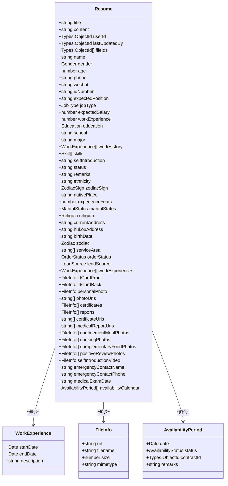
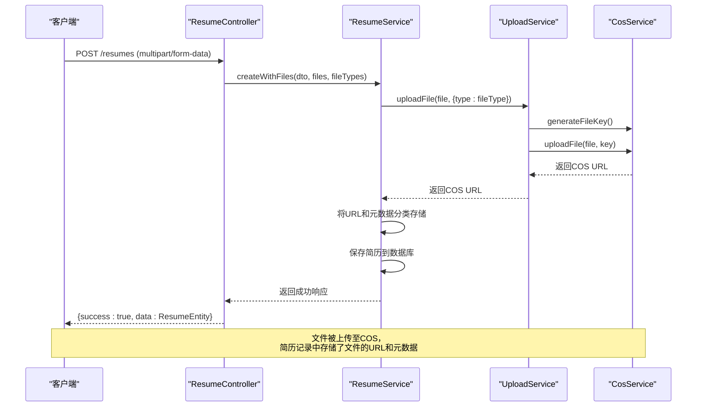
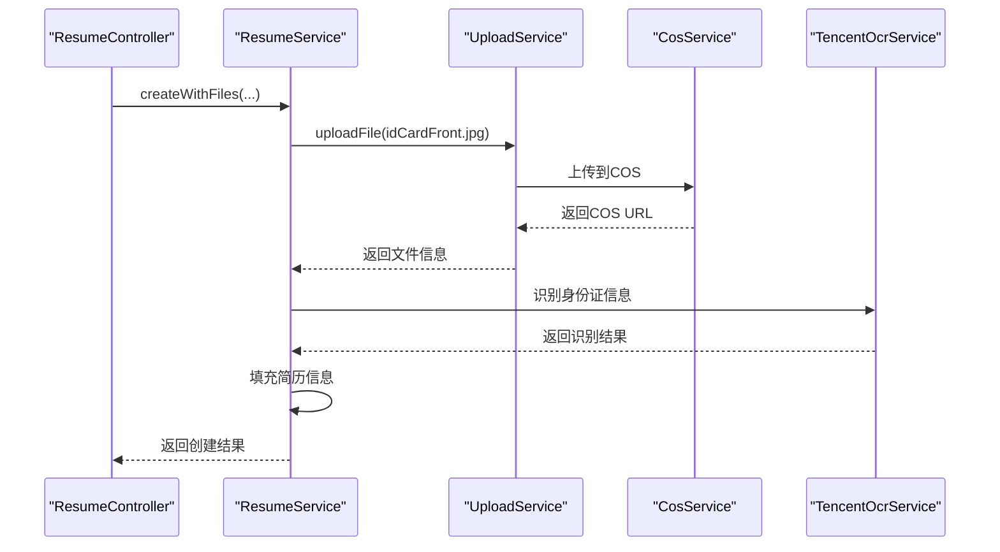

# 简历管理API

<cite>
**本文档引用的文件**   
- [resume.controller.ts](file://backend/src/modules/resume/resume.controller.ts#L1-L2306) - *新增小程序接口、公开简历接口、视频上传、照片分类和可用性日历接口*
- [create-resume.dto.ts](file://backend/src/modules/resume/dto/create-resume.dto.ts#L1-L490) - *更新为CreateResumeV2Dto*
- [update-resume.dto.ts](file://backend/src/modules/resume/dto/update-resume.dto.ts#L1-L7)
- [availability.dto.ts](file://backend/src/modules/resume/dto/availability.dto.ts#L1-L80)
- [resume.entity.ts](file://backend/src/modules/resume/models/resume.entity.ts#L1-L345)
- [work-experience.schema.ts](file://backend/src/modules/resume/models/work-experience.schema.ts#L1-L18)
- [file-info.schema.ts](file://backend/src/modules/resume/models/file-info.schema.ts#L1-L21)
- [availability-period.schema.ts](file://backend/src/modules/resume/models/availability-period.schema.ts#L1-L35)
- [resume.service.ts](file://backend/src/modules/resume/resume.service.ts#L1-L2237) - *新增createV2和addFileWithType方法*
- [tencent-ocr.service.ts](file://backend/src/modules/ocr/tencent-ocr.service.ts#L1-L192)
- [upload.service.ts](file://backend/src/modules/upload/upload.service.ts#L1-L93)
- [cos.service.ts](file://backend/src/modules/upload/cos.service.ts#L1-L212)
- [API_SPEC.md](file://backend/src/docs/API_SPEC.md) - *新增接口规范*
- [VideoUpload.tsx](file://frontend/src/components/VideoUpload.tsx#L1-L235)
- [SortableImageUpload.tsx](file://frontend/src/components/SortableImageUpload.tsx#L1-L399)
- [AvailabilityCalendar/index.tsx](file://frontend/src/components/AvailabilityCalendar/index.tsx#L1-L120)
- [upload.ts](file://frontend/src/constants/upload.ts#L1-L15)
</cite>

## 更新摘要
**变更内容**   
- 新增了视频上传接口，支持自我介绍视频的上传和管理
- 新增了照片分类上传功能，支持月子餐、烹饪、辅食添加、好评展示等分类照片
- 新增了可用性日历管理接口，支持档期状态管理和冲突检查
- 更新了简历创建和更新接口，支持更丰富的文件类型上传
- 新增了前端组件支持视频上传和照片分类管理

## 目录
1. [简介](#简介)
2. [核心API端点](#核心api端点)
3. [数据模型](#数据模型)
4. [文件上传与COS集成](#文件上传与cos集成)
5. [OCR自动识别集成](#ocr自动识别集成)
6. [视频上传与照片分类](#视频上传与照片分类)
7. [可用性日历管理](#可用性日历管理)
8. [请求示例](#请求示例)

## 简介
本API文档详细描述了简历管理模块的核心功能，包括简历的创建、查询、更新和删除。该模块支持通过`multipart/form-data`上传多种文件（如身份证、照片、证书、体检报告、视频等），并自动将文件存储至腾讯云COS对象存储。系统集成了腾讯云OCR服务，可在上传身份证照片时自动识别并填充个人信息。文档涵盖了所有关键接口的请求体、响应结构以及嵌套数据的处理方式，特别新增了视频上传、照片分类和可用性日历管理功能。

## 核心API端点

### 创建简历 (POST /resumes)
此端点用于创建新的简历记录。它支持通过`multipart/form-data`上传文件，并将文件信息与简历数据一同保存。

**请求体 (CreateResumeDto)**
该DTO定义了创建简历所需的所有字段，其中`name`, `phone`, `education`, `nativePlace`, `gender`, `jobType`, `experienceYears`为必填项。

```json
{
  "name": "张三",
  "phone": "13800138000",
  "age": 35,
  "wechat": "wxid_123456",
  "idNumber": "110101199001011234",
  "education": "bachelor",
  "maritalStatus": "single",
  "religion": "none",
  "currentAddress": "北京市朝阳区建国路88号",
  "nativePlace": "河南省郑州市",
  "hukouAddress": "河南省郑州市金水区",
  "birthDate": "1990-01-01",
  "ethnicity": "汉族",
  "gender": "male",
  "zodiac": "dragon",
  "zodiacSign": "leo",
  "jobType": "yuexin",
  "expectedSalary": 8000,
  "serviceArea": ["郑州市金水区"],
  "orderStatus": "accepting",
  "skills": ["zaojiao", "yuying"],
  "experienceYears": 5,
  "leadSource": "referral",
  "workExperiences": [
    {
      "startDate": "2020-01",
      "endDate": "2022-12",
      "description": "在郑州市某家庭担任育儿嫂"
    }
  ],
  "emergencyContactName": "李四",
  "emergencyContactPhone": "13900139000",
  "medicalExamDate": "2024-01-01"
}
```

**文件上传**
该接口使用`FileFieldsInterceptor`来处理多类型文件上传。文件字段如下：
- `idCardFront`: 身份证正面照片 (单个文件)
- `idCardBack`: 身份证背面照片 (单个文件)
- `photoFiles`: 个人照片 (最多30个)
- `certificateFiles`: 技能证书 (最多30个)
- `medicalReportFiles`: 体检报告 (最多10个)
- `selfIntroductionVideo`: 自我介绍视频 (单个文件，最大10MB)
- `confinementMealPhotos`: 月子餐照片 (最多30个)
- `cookingPhotos`: 烹饪照片 (最多30个)
- `complementaryFoodPhotos`: 辅食添加照片 (最多30个)
- `positiveReviewPhotos`: 好评展示照片 (最多30个)

**响应结构**
```json
{
  "success": true,
  "data": {
    // ResumeEntity 对象
  },
  "message": "创建简历成功"
}
```

**Section sources**
- [resume.controller.ts](file://backend/src/modules/resume/resume.controller.ts#L36-L274)

### 获取简历列表 (GET /resumes)
获取分页的简历列表。

**查询参数**
- `page`: 页码 (默认1)
- `pageSize`: 每页数量 (默认10)
- `keyword`: 搜索关键词 (姓名、手机号、期望职位)
- `jobType`: 工种筛选
- `orderStatus`: 接单状态筛选
- `maxAge`: 最大年龄筛选
- `nativePlace`: 籍贯筛选
- `ethnicity`: 民族筛选

**响应结构**
```json
{
  "success": true,
  "data": {
    "items": [
      // ResumeEntity 对象数组
    ],
    "total": 100,
    "page": 1,
    "pageSize": 10,
    "totalPages": 10
  },
  "message": "获取简历列表成功"
}
```

**Section sources**
- [resume.controller.ts](file://backend/src/modules/resume/resume.controller.ts#L507-L594)

### 获取简历详情 (GET /resumes/:id)
根据ID获取单个简历的完整信息。

**响应结构**
```json
{
  "success": true,
  "data": {
    // ResumeEntity 对象
  },
  "message": "获取简历详情成功"
}
```

**Section sources**
- [resume.controller.ts](file://backend/src/modules/resume/resume.controller.ts#L757-L800)

### 更新简历 (PUT /resumes/:id)
更新指定ID的简历信息，支持同时上传新文件。

**请求体 (UpdateResumeDto)**
`UpdateResumeDto`继承自`CreateResumeDto`，但所有字段均为可选。请求体结构与创建简历相同。

**文件上传**
与创建简历接口相同，使用`FileFieldsInterceptor`处理文件上传。

**响应结构**
```json
{
  "success": true,
  "data": {
    // ResumeEntity 对象
  },
  "message": "简历更新成功"
}
```

**Section sources**
- [resume.controller.ts](file://backend/src/modules/resume/resume.controller.ts#L1896-L1896)
- [update-resume.dto.ts](file://backend/src/modules/resume/dto/update-resume.dto.ts#L1-L7)

### 小程序创建简历 (POST /resumes/miniprogram/create)
专为小程序设计的简历创建接口，支持幂等性操作和手机号去重。

**请求头**
- `Authorization: Bearer [token]` (必需)
- `Idempotency-Key: [唯一键]` (可选，防重复提交)
- `api-version: [版本号]` (可选)
- `x-request-id: [请求ID]` (可选)

**请求体 (CreateResumeV2Dto)**
```json
{
  "name": "张三",
  "phone": "13800138000",
  "gender": "female",
  "age": 35,
  "jobType": "yuexin",
  "education": "high",
  "experienceYears": 3,
  "expectedSalary": 8000,
  "skills": ["chanhou", "yuying"],
  "serviceArea": ["北京市朝阳区"],
  "selfIntroduction": "自我介绍",
  "school": "学校名称",
  "major": "专业",
  "workExperiences": [
    {
      "startDate": "2020-01-01",
      "endDate": "2023-12-31",
      "description": "工作描述"
    }
  ]
}
```

**响应结构**
```json
{
  "success": true,
  "data": {
    "id": "66e2f4af8b1234567890abcd",
    "createdAt": "2025-09-12T10:19:27.671Z",
    "action": "CREATED"
  },
  "message": "创建简历成功"
}
```

**Section sources**
- [resume.controller.ts](file://backend/src/modules/resume/resume.controller.ts#L676-L755)
- [create-resume.dto.ts](file://backend/src/modules/resume/dto/create-resume.dto.ts#L121-L490)
- [resume.service.ts](file://backend/src/modules/resume/resume.service.ts#L728-L806)

### 获取公开简历 (GET /resumes/:id/public)
获取简历的公开详情，支持无认证访问，返回脱敏后的数据。

**响应结构**
```json
{
  "success": true,
  "data": {
    "id": "简历ID",
    "name": "姓名",
    "gender": "性别",
    "age": 30,
    "jobType": "工种",
    "education": "学历",
    "experienceYears": 5,
    "expectedSalary": 8000,
    "serviceArea": ["服务区域"],
    "skills": ["技能"],
    "nativePlace": "籍贯",
    "selfIntroduction": "自我介绍",
    "workExperiences": []
  },
  "message": "获取简历详情成功"
}
```

**Section sources**
- [resume.controller.ts](file://backend/src/modules/resume/resume.controller.ts#L757-L800)

### 生成简历分享链接 (POST /resumes/:id/share)
生成简历的分享链接，返回一个包含令牌的分享URL。

**请求体**
```json
{
  "expiresInHours": 72
}
```

**响应结构**
```json
{
  "success": true,
  "data": {
    "token": "分享令牌",
    "expireAt": "过期时间",
    "path": "/pages/public/detail/index?token=分享令牌"
  },
  "message": "生成分享链接成功"
}
```

**Section sources**
- [resume.controller.ts](file://backend/src/modules/resume/resume.controller.ts#L611-L638)
- [resume.service.ts](file://backend/src/modules/resume/resume.service.ts#L1367-L1394)

## 数据模型

### 简历实体 (ResumeEntity)
`Resume`类定义了简历在数据库中的完整结构，是所有API响应的核心。



**Diagram sources**
- [resume.entity.ts](file://backend/src/modules/resume/models/resume.entity.ts#L1-L345)
- [work-experience.schema.ts](file://backend/src/modules/resume/models/work-experience.schema.ts#L1-L18)
- [file-info.schema.ts](file://backend/src/modules/resume/models/file-info.schema.ts#L1-L21)
- [availability-period.schema.ts](file://backend/src/modules/resume/models/availability-period.schema.ts#L1-L35)

### 嵌套数据结构

#### 工作经历 (WorkExperienceSchema)
该模式定义了工作经历的结构，作为`Resume`实体中的一个数组字段。

**字段说明**
- **startDate**: 开始日期 (Date类型)
- **endDate**: 结束日期 (Date类型)
- **description**: 工作描述 (字符串)

**Section sources**
- [work-experience.schema.ts](file://backend/src/modules/resume/models/work-experience.schema.ts#L1-L18)

#### 文件信息 (FileInfoSchema)
该模式定义了文件的元数据，用于存储身份证、照片等文件的详细信息。

**字段说明**
- **url**: 文件在COS上的完整访问URL (字符串)
- **filename**: 文件原始名称 (字符串)
- **size**: 文件大小 (字节) (数字)
- **mimetype**: 文件MIME类型 (字符串)

**Section sources**
- [file-info.schema.ts](file://backend/src/modules/resume/models/file-info.schema.ts#L1-L21)

#### 可用性周期 (AvailabilityPeriodSchema)
该模式定义了可用性日历的结构，用于存储月嫂的档期信息。

**字段说明**
- **date**: 具体日期 (Date类型)
- **status**: 档期状态 (AvailabilityStatus枚举)
- **contractId**: 关联合同ID (ObjectId)
- **remarks**: 备注信息 (字符串)

**Section sources**
- [availability-period.schema.ts](file://backend/src/modules/resume/models/availability-period.schema.ts#L1-L35)

## 文件上传与COS集成
简历文件的上传流程涉及多个服务的协作，确保文件被安全地存储在腾讯云COS中，并将URL和元数据关联到简历记录。



**Diagram sources**
- [resume.controller.ts](file://backend/src/modules/resume/resume.controller.ts#L36-L274)
- [resume.service.ts](file://backend/src/modules/resume/resume.service.ts#L33-L178)
- [upload.service.ts](file://backend/src/modules/upload/upload.service.ts#L1-L93)
- [cos.service.ts](file://backend/src/modules/upload/cos.service.ts#L1-L212)

**关键服务说明**

- **CosService**: 负责与腾讯云COS的直接交互，包括生成文件Key、上传、下载和删除文件。
- **UploadService**: 提供更高层次的文件操作接口，如`uploadFile`和`getFile`，并处理元数据。
- **ResumeService**: 在创建或更新简历时，调用`UploadService`上传文件，并将返回的COS URL和元数据整合到简历对象中。

## OCR自动识别集成
当上传身份证照片时，系统会自动调用腾讯云OCR服务进行信息识别，以减少手动输入。



**Diagram sources**
- [resume.controller.ts](file://backend/src/modules/resume/resume.controller.ts#L36-L274)
- [resume.service.ts](file://backend/src/modules/resume/resume.service.ts#L33-L178)
- [tencent-ocr.service.ts](file://backend/src/modules/ocr/tencent-ocr.service.ts#L1-L192)

## 视频上传与照片分类

### 视频上传接口

#### 上传自我介绍视频 (POST /resumes/:id/upload)
上传简历相关的视频文件，主要用于自我介绍。

**请求体**
```json
{
  "file": "视频文件",
  "type": "selfIntroductionVideo"
}
```

**响应结构**
```json
{
  "success": true,
  "data": {
    "fileUrl": "https://cos.ap-beijing.myqcloud.com/...",
    "filename": "introduction.mp4",
    "mimeType": "video/mp4",
    "size": 10485760
  },
  "message": "上传文件成功"
}
```

**Section sources**
- [resume.controller.ts](file://backend/src/modules/resume/resume.controller.ts#L1918-L1963)

### 照片分类上传

#### 上传单个简历文件 (POST /resumes/:id/upload)
支持多种文件类型的上传，包括各类照片分类。

**请求体**
```json
{
  "file": "图片文件",
  "type": "personalPhoto|certificate|medicalReport|confinementMealPhoto|cookingPhoto|complementaryFoodPhoto|positiveReviewPhoto"
}
```

**响应结构**
```json
{
  "success": true,
  "data": {
    "fileUrl": "https://cos.ap-beijing.myqcloud.com/...",
    "filename": "photo.jpg",
    "mimeType": "image/jpeg",
    "size": 1048576
  },
  "message": "上传文件成功"
}
```

**Section sources**
- [resume.controller.ts](file://backend/src/modules/resume/resume.controller.ts#L1918-L1963)

#### 批量上传简历文件 (POST /resumes/:id/files)
支持批量上传多种类型的文件。

**请求体**
```json
{
  "files": ["文件1", "文件2", "文件3"]
}
```

**响应结构**
```json
{
  "success": true,
  "data": {
    "uploaded": 3,
    "failed": 0
  },
  "message": "批量上传成功"
}
```

**Section sources**
- [resume.controller.ts](file://backend/src/modules/resume/resume.controller.ts#L1965-L1988)

### 前端组件支持

#### 视频上传组件 (VideoUpload)
支持视频文件的上传、预览和删除功能。

**特性**
- 支持MP4、MOV、AVI、WebM格式
- 文件大小限制50MB（服务器会转码）
- 自动转码为浏览器兼容格式
- 进度显示和状态提示

**Section sources**
- [VideoUpload.tsx](file://frontend/src/components/VideoUpload.tsx#L1-L235)

#### 可拖拽图片上传组件 (SortableImageUpload)
支持图片的拖拽排序和批量管理。

**特性**
- 支持多种图片格式（JPEG、JPG、PNG）
- 最大支持30张图片
- 拖拽排序功能
- 预览和删除功能

**Section sources**
- [SortableImageUpload.tsx](file://frontend/src/components/SortableImageUpload.tsx#L1-L399)

## 可用性日历管理

### 档期状态枚举
可用性日历支持以下状态：

- **unset**: 未设置（灰色）
- **available**: 可接单（绿色）
- **unavailable**: 不可接单（黑色）
- **occupied**: 订单占用（红色）
- **leave**: 已请假（黄色）

### 获取档期日历 (GET /resumes/:id/availability)
获取指定简历的档期日历信息。

**查询参数**
- `startDate`: 开始日期 (可选)
- `endDate`: 结束日期 (可选)
- `status`: 档期状态 (可选)

**响应结构**
```json
{
  "success": true,
  "data": {
    "resumeId": "简历ID",
    "name": "姓名",
    "jobType": "工种",
    "availabilityCalendar": [
      {
        "date": "2024-01-01",
        "status": "available",
        "contractId": "合同ID",
        "remarks": "备注信息"
      }
    ]
  },
  "message": "获取档期成功"
}
```

**Section sources**
- [resume.controller.ts](file://backend/src/modules/resume/resume.controller.ts#L2169-L2192)
- [resume.service.ts](file://backend/src/modules/resume/resume.service.ts#L1923-L1960)

### 更新档期 (POST /resumes/:id/availability)
按日期范围更新档期状态。

**请求体 (UpdateAvailabilityDto)**
```json
{
  "startDate": "2024-01-01",
  "endDate": "2024-01-31",
  "status": "available",
  "contractId": "合同ID",
  "remarks": "备注信息"
}
```

**响应结构**
```json
{
  "success": true,
  "data": {
    "updated": 31,
    "message": "成功更新31天的档期"
  },
  "message": "成功更新31天的档期"
}
```

**Section sources**
- [resume.controller.ts](file://backend/src/modules/resume/resume.controller.ts#L2194-L2217)
- [resume.service.ts](file://backend/src/modules/resume/resume.service.ts#L1965-L2012)

### 批量更新档期 (POST /resumes/:id/availability/batch)
按日期列表批量更新档期状态。

**请求体 (BatchUpdateAvailabilityDto)**
```json
{
  "dates": ["2024-01-01", "2024-01-15", "2024-01-31"],
  "status": "occupied",
  "contractId": "合同ID",
  "remarks": "备注信息"
}
```

**响应结构**
```json
{
  "success": true,
  "data": {
    "updated": 3,
    "message": "成功更新3天的档期"
  },
  "message": "成功更新3天的档期"
}
```

**Section sources**
- [resume.controller.ts](file://backend/src/modules/resume/resume.controller.ts#L2219-L2242)
- [resume.service.ts](file://backend/src/modules/resume/resume.service.ts#L2017-L2051)

### 检查档期可用性 (GET /resumes/:id/availability/check)
检查指定日期范围内的档期是否可用。

**查询参数**
- `startDate`: 开始日期 (必需)
- `endDate`: 结束日期 (必需)

**响应结构**
```json
{
  "success": true,
  "data": {
    "isAvailable": true
  },
  "message": "档期可用"
}
```

**Section sources**
- [resume.controller.ts](file://backend/src/modules/resume/resume.controller.ts#L2273-L2304)
- [resume.service.ts](file://backend/src/modules/resume/resume.service.ts#L2056-L2079)

### 删除档期 (DELETE /resumes/:id/availability)
删除指定日期范围内的档期。

**查询参数**
- `startDate`: 开始日期 (必需)
- `endDate`: 结束日期 (必需)

**响应结构**
```json
{
  "success": true,
  "data": {
    "deleted": 31,
    "message": "成功删除31天的档期"
  },
  "message": "成功删除31天的档期"
}
```

**Section sources**
- [resume.controller.ts](file://backend/src/modules/resume/resume.controller.ts#L2244-L2271)
- [resume.service.ts](file://backend/src/modules/resume/resume.service.ts#L2084-L2109)

### 前端可用性日历组件
前端提供可用性日历组件，支持档期的可视化管理和操作。

**特性**
- 年度档期显示
- 档期状态颜色标识
- 日期范围选择
- 档期状态切换

**Section sources**
- [AvailabilityCalendar/index.tsx](file://frontend/src/components/AvailabilityCalendar/index.tsx#L1-L120)

## 请求示例

### 创建简历（含视频和照片分类）
```bash
curl -X POST https://api.example.com/resumes \
  -H "Authorization: Bearer YOUR_TOKEN" \
  -F "name=张三" \
  -F "phone=13800138000" \
  -F "gender=male" \
  -F "age=35" \
  -F "jobType=yuexin" \
  -F "selfIntroduction=自我介绍内容" \
  -F "photoFiles=@photo1.jpg" \
  -F "photoFiles=@photo2.jpg" \
  -F "certificateFiles=@certificate.pdf" \
  -F "selfIntroductionVideo=@introduction.mp4" \
  -F "confinementMealPhotos=@meal1.jpg" \
  -F "cookingPhotos=@cooking1.jpg" \
  -F "complementaryFoodPhotos=@food1.jpg" \
  -F "positiveReviewPhotos=@review1.jpg"
```

### 更新档期状态
```bash
curl -X POST https://api.example.com/resumes/:id/availability \
  -H "Authorization: Bearer YOUR_TOKEN" \
  -H "Content-Type: application/json" \
  -d '{
    "startDate": "2024-01-01",
    "endDate": "2024-01-31",
    "status": "available",
    "remarks": "春节期间可接单"
  }'
```

### 获取档期日历
```bash
curl -X GET "https://api.example.com/resumes/:id/availability?startDate=2024-01-01&endDate=2024-12-31&status=available" \
  -H "Authorization: Bearer YOUR_TOKEN"
```

### 上传视频文件
```bash
curl -X POST https://api.example.com/resumes/:id/upload \
  -H "Authorization: Bearer YOUR_TOKEN" \
  -F "file=@introduction.mp4" \
  -F "type=selfIntroductionVideo"
```

### 批量上传照片
```bash
curl -X POST https://api.example.com/resumes/:id/files \
  -H "Authorization: Bearer YOUR_TOKEN" \
  -F "files=@photo1.jpg" \
  -F "files=@photo2.jpg" \
  -F "files=@photo3.jpg"
```