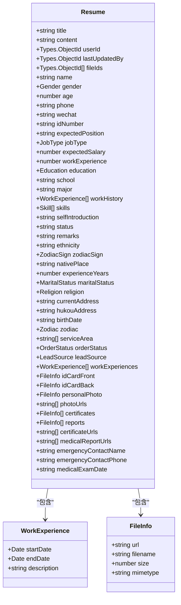

<docs>
# 简历管理API

<cite>
**本文档引用的文件**   
- [resume.controller.ts](file://backend/src/modules/resume/resume.controller.ts#L1-L831) - *新增小程序接口和公开简历接口*
- [create-resume.dto.ts](file://backend/src/modules/resume/dto/create-resume.dto.ts#L1-L464) - *更新为CreateResumeV2Dto*
- [update-resume.dto.ts](file://backend/src/modules/resume/dto/update-resume.dto.ts#L1-L7)
- [resume.entity.ts](file://backend/src/modules/resume/models/resume.entity.ts#L1-L277)
- [work-experience.schema.ts](file://backend/src/modules/resume/models/work-experience.schema.ts#L1-L18)
- [file-info.schema.ts](file://backend/src/modules/resume/models/file-info.schema.ts#L1-L21)
- [resume.service.ts](file://backend/src/modules/resume/resume.service.ts#L1-L1083) - *新增createV2和addFileWithType方法*
- [tencent-ocr.service.ts](file://backend/src/modules/ocr/tencent-ocr.service.ts#L1-L192)
- [upload.service.ts](file://backend/src/modules/upload/upload.service.ts#L1-L93)
- [cos.service.ts](file://backend/src/modules/upload/cos.service.ts#L1-L212)
- [API_SPEC.md](file://backend/src/docs/API_SPEC.md) - *新增接口规范*
</cite>

## 更新摘要
**变更内容**   
- 新增了小程序专用的简历创建、更新和文件上传接口
- 增加了简历公开访问接口，支持无认证访问和数据脱敏
- 更新了简历创建流程，支持幂等性操作和手机号去重
- 新增了简历分享功能，通过令牌生成安全的分享链接
- 更新了请求体DTO，增加了`selfIntroduction`等新字段

## 目录
1. [简介](#简介)
2. [核心API端点](#核心api端点)
3. [数据模型](#数据模型)
4. [文件上传与COS集成](#文件上传与cos集成)
5. [OCR自动识别集成](#ocr自动识别集成)
6. [请求示例](#请求示例)

## 简介
本API文档详细描述了简历管理模块的核心功能，包括简历的创建、查询、更新和删除。该模块支持通过`multipart/form-data`上传多种文件（如身份证、照片、证书、体检报告），并自动将文件存储至腾讯云COS对象存储。系统集成了腾讯云OCR服务，可在上传身份证照片时自动识别并填充个人信息。文档涵盖了所有关键接口的请求体、响应结构以及嵌套数据的处理方式。

## 核心API端点

### 创建简历 (POST /resumes)
此端点用于创建新的简历记录。它支持通过`multipart/form-data`上传文件，并将文件信息与简历数据一同保存。

**请求体 (CreateResumeDto)**
该DTO定义了创建简历所需的所有字段，其中`name`, `phone`, `education`, `nativePlace`, `gender`, `jobType`, `experienceYears`为必填项。

```json
{
  "name": "张三",
  "phone": "13800138000",
  "age": 35,
  "wechat": "wxid_123456",
  "idNumber": "110101199001011234",
  "education": "bachelor",
  "maritalStatus": "single",
  "religion": "none",
  "currentAddress": "北京市朝阳区建国路88号",
  "nativePlace": "河南省郑州市",
  "hukouAddress": "河南省郑州市金水区",
  "birthDate": "1990-01-01",
  "ethnicity": "汉族",
  "gender": "male",
  "zodiac": "dragon",
  "zodiacSign": "leo",
  "jobType": "yuexin",
  "expectedSalary": 8000,
  "serviceArea": ["郑州市金水区"],
  "orderStatus": "accepting",
  "skills": ["zaojiao", "yuying"],
  "experienceYears": 5,
  "leadSource": "referral",
  "workExperiences": [
    {
      "startDate": "2020-01",
      "endDate": "2022-12",
      "description": "在郑州市某家庭担任育儿嫂"
    }
  ],
  "emergencyContactName": "李四",
  "emergencyContactPhone": "13900139000",
  "medicalExamDate": "2024-01-01"
}
```

**文件上传**
该接口使用`FileFieldsInterceptor`来处理多类型文件上传。文件字段如下：
- `idCardFront`: 身份证正面照片 (单个文件)
- `idCardBack`: 身份证背面照片 (单个文件)
- `photoFiles`: 个人照片 (最多10个)
- `certificateFiles`: 技能证书 (最多10个)
- `medicalReportFiles`: 体检报告 (最多10个)

**响应结构**
```json
{
  "success": true,
  "data": {
    // ResumeEntity 对象
  },
  "message": "创建简历成功"
}
```

**Section sources**
- [resume.controller.ts](file://backend/src/modules/resume/resume.controller.ts#L20-L150)

### 获取简历列表 (GET /resumes)
获取分页的简历列表。

**查询参数**
- `page`: 页码 (默认1)
- `pageSize`: 每页数量 (默认10)
- `keyword`: 搜索关键词 (姓名、手机号、期望职位)
- `jobType`: 工种筛选
- `orderStatus`: 接单状态筛选
- `maxAge`: 最大年龄筛选
- `nativePlace`: 籍贯筛选
- `ethnicity`: 民族筛选

**响应结构**
```json
{
  "success": true,
  "data": {
    "items": [
      // ResumeEntity 对象数组
    ],
    "total": 100,
    "page": 1,
    "pageSize": 10,
    "totalPages": 10
  },
  "message": "获取简历列表成功"
}
```

**Section sources**
- [resume.controller.ts](file://backend/src/modules/resume/resume.controller.ts#L200-L300)

### 获取简历详情 (GET /resumes/:id)
根据ID获取单个简历的完整信息。

**响应结构**
```json
{
  "success": true,
  "data": {
    // ResumeEntity 对象
  },
  "message": "获取简历详情成功"
}
```

**Section sources**
- [resume.controller.ts](file://backend/src/modules/resume/resume.controller.ts#L500-L530)

### 更新简历 (PUT /resumes/:id)
更新指定ID的简历信息，支持同时上传新文件。

**请求体 (UpdateResumeDto)**
`UpdateResumeDto`继承自`CreateResumeDto`，但所有字段均为可选。请求体结构与创建简历相同。

**文件上传**
与创建简历接口相同，使用`FileFieldsInterceptor`处理文件上传。

**响应结构**
```json
{
  "success": true,
  "data": {
    // ResumeEntity 对象
  },
  "message": "简历更新成功"
}
```

**Section sources**
- [resume.controller.ts](file://backend/src/modules/resume/resume.controller.ts#L530-L600)
- [update-resume.dto.ts](file://backend/src/modules/resume/dto/update-resume.dto.ts#L1-L7)

### 小程序创建简历 (POST /resumes/miniprogram/create)
专为小程序设计的简历创建接口，支持幂等性操作和手机号去重。

**请求头**
- `Authorization: Bearer [token]` (必需)
- `Idempotency-Key: [唯一键]` (可选，防重复提交)
- `api-version: [版本号]` (可选)
- `x-request-id: [请求ID]` (可选)

**请求体 (CreateResumeV2Dto)**
```json
{
  "name": "张三",
  "phone": "13800138000",
  "gender": "female",
  "age": 35,
  "jobType": "yuexin",
  "education": "high",
  "experienceYears": 3,
  "expectedSalary": 8000,
  "skills": ["chanhou", "yuying"],
  "serviceArea": ["北京市朝阳区"],
  "selfIntroduction": "自我介绍",
  "school": "学校名称",
  "major": "专业",
  "workExperiences": [
    {
      "startDate": "2020-01-01",
      "endDate": "2023-12-31",
      "description": "工作描述"
    }
  ]
}
```

**响应结构**
```json
{
  "success": true,
  "data": {
    "id": "66e2f4af8b1234567890abcd",
    "createdAt": "2025-09-12T10:19:27.671Z",
    "action": "CREATED"
  },
  "message": "创建简历成功"
}
```

**Section sources**
- [resume.controller.ts](file://backend/src/modules/resume/resume.controller.ts#L659-L755)
- [create-resume.dto.ts](file://backend/src/modules/resume/dto/create-resume.dto.ts#L121-L490)
- [resume.service.ts](file://backend/src/modules/resume/resume.service.ts#L728-L806)

### 获取公开简历 (GET /resumes/:id/public)
获取简历的公开详情，支持无认证访问，返回脱敏后的数据。

**响应结构**
```json
{
  "success": true,
  "data": {
    "id": "简历ID",
    "name": "姓名",
    "gender": "性别",
    "age": 30,
    "jobType": "工种",
    "education": "学历",
    "experienceYears": 5,
    "expectedSalary": 8000,
    "serviceArea": ["服务区域"],
    "skills": ["技能"],
    "nativePlace": "籍贯",
    "selfIntroduction": "自我介绍",
    "workExperiences": []
  },
  "message": "获取简历详情成功"
}
```

**Section sources**
- [resume.controller.ts](file://backend/src/modules/resume/resume.controller.ts#L1200-L1246)

### 生成简历分享链接 (POST /resumes/:id/share)
生成简历的分享链接，返回一个包含令牌的分享URL。

**请求体**
```json
{
  "expiresInHours": 72
}
```

**响应结构**
```json
{
  "success": true,
  "data": {
    "token": "分享令牌",
    "expireAt": "过期时间",
    "path": "/pages/public/detail/index?token=分享令牌"
  },
  "message": "生成分享链接成功"
}
```

**Section sources**
- [resume.controller.ts](file://backend/src/modules/resume/resume.controller.ts#L611-L638)
- [resume.service.ts](file://backend/src/modules/resume/resume.service.ts#L1367-L1394)

## 数据模型

### 简历实体 (ResumeEntity)
`Resume`类定义了简历在数据库中的完整结构，是所有API响应的核心。



**Diagram sources**
- [resume.entity.ts](file://backend/src/modules/resume/models/resume.entity.ts#L1-L277)
- [work-experience.schema.ts](file://backend/src/modules/resume/models/work-experience.schema.ts#L1-L18)
- [file-info.schema.ts](file://backend/src/modules/resume/models/file-info.schema.ts#L1-L21)

### 嵌套数据结构

#### 工作经历 (WorkExperienceSchema)
该模式定义了工作经历的结构，作为`Resume`实体中的一个数组字段。

**字段说明**
- **startDate**: 开始日期 (Date类型)
- **endDate**: 结束日期 (Date类型)
- **description**: 工作描述 (字符串)

**Section sources**
- [work-experience.schema.ts](file://backend/src/modules/resume/models/work-experience.schema.ts#L1-L18)

#### 文件信息 (FileInfoSchema)
该模式定义了文件的元数据，用于存储身份证、照片等文件的详细信息。

**字段说明**
- **url**: 文件在COS上的完整访问URL (字符串)
- **filename**: 文件原始名称 (字符串)
- **size**: 文件大小 (字节) (数字)
- **mimetype**: 文件MIME类型 (字符串)

**Section sources**
- [file-info.schema.ts](file://backend/src/modules/resume/models/file-info.schema.ts#L1-L21)

## 文件上传与COS集成
简历文件的上传流程涉及多个服务的协作，确保文件被安全地存储在腾讯云COS中，并将URL和元数据关联到简历记录。


**Diagram sources**
- [resume.controller.ts](file://backend/src/modules/resume/resume.controller.ts#L20-L150)
- [resume.service.ts](file://backend/src/modules/resume/resume.service.ts#L1-L1083)
- [upload.service.ts](file://backend/src/modules/upload/upload.service.ts#L1-L93)
- [cos.service.ts](file://backend/src/modules/upload/cos.service.ts#L1-L212)

**关键服务说明**

- **CosService**: 负责与腾讯云COS的直接交互，包括生成文件Key、上传、下载和删除文件。
- **UploadService**: 提供更高层次的文件操作接口，如`uploadFile`和`getFile`，并处理元数据。
- **ResumeService**: 在创建或更新简历时，调用`UploadService`上传文件，并将返回的COS URL和元数据整合到简历对象中。

## OCR自动识别集成
当上传身份证照片时，系统会自动调用腾讯云OCR服务进行信息识别，以减少手动输入。

```mermaid
sequenceDiagram
participant Controller as "ResumeController"
participant ResumeService as "ResumeService"
participant UploadService as "UploadService"
participant CosService as "CosService"
participant TencentOcrService as "TencentOcrService"
Controller->>ResumeService : createWithFiles(...)
ResumeService->>UploadService : uploadFile(idCardFront.jpg)
UploadService->>CosService :