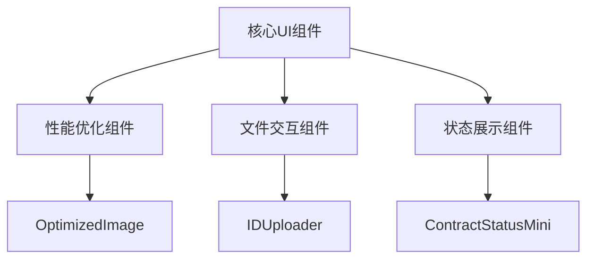
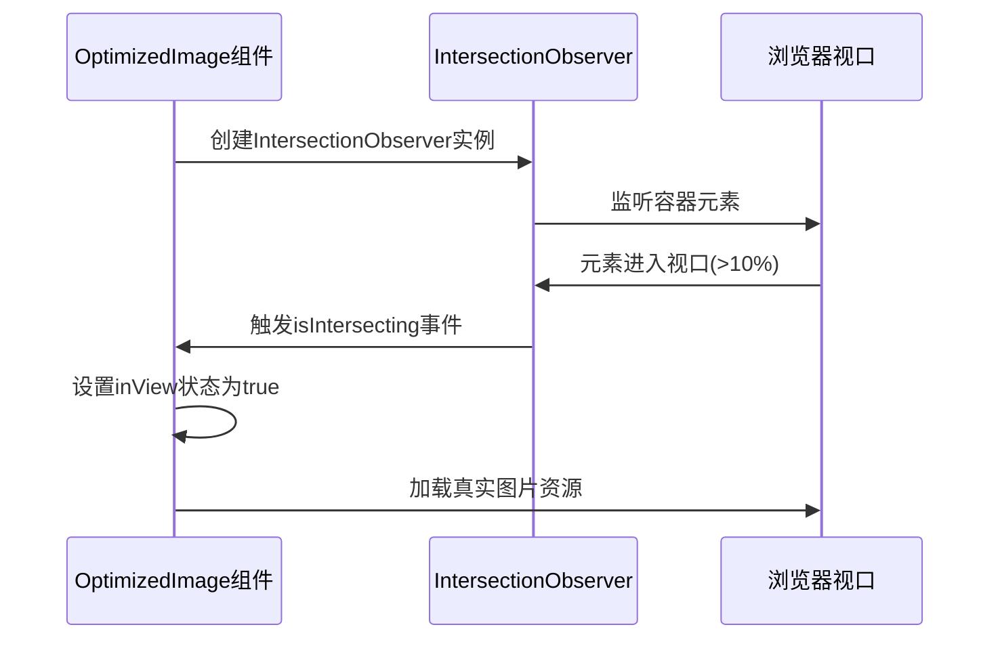
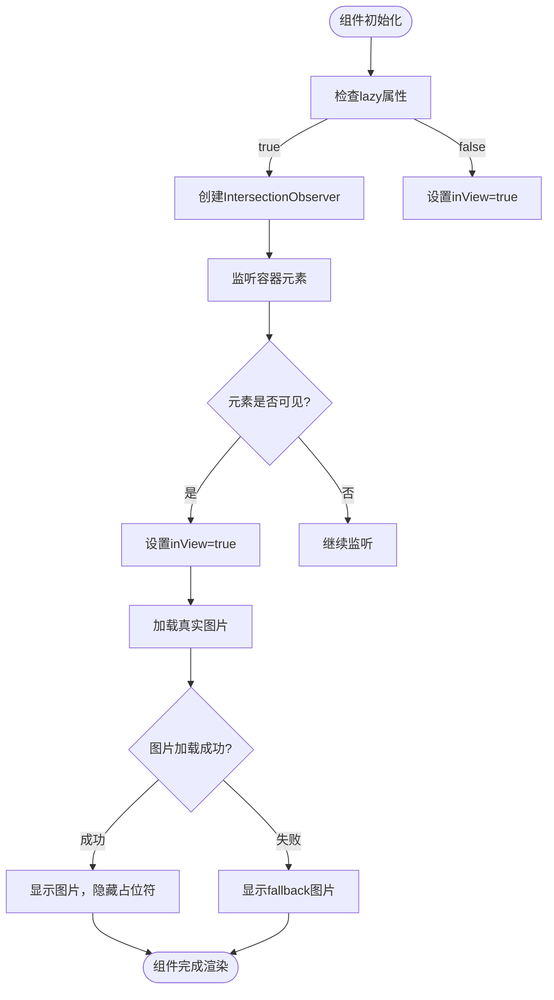
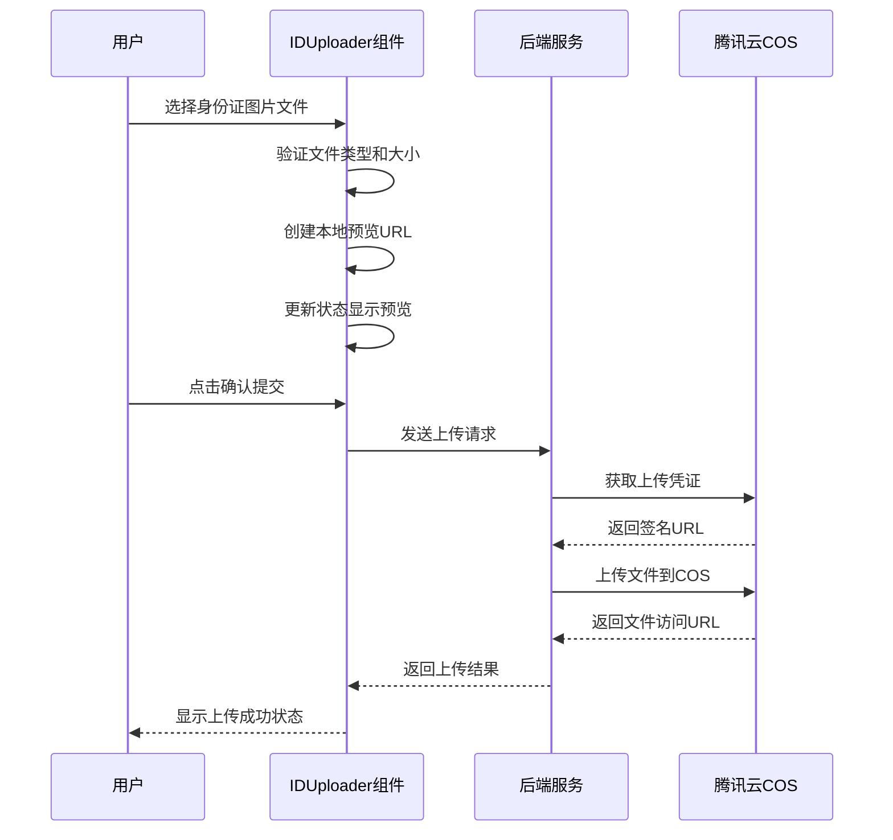
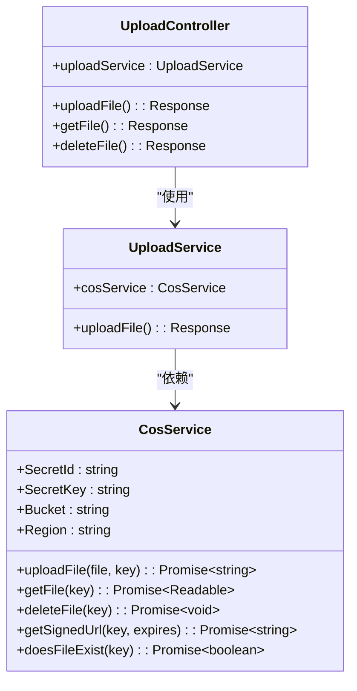
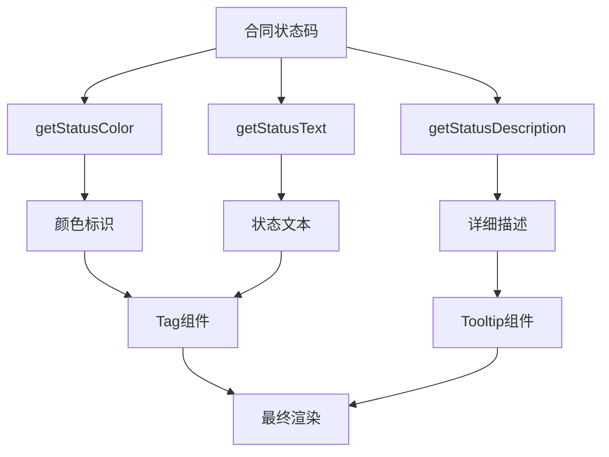
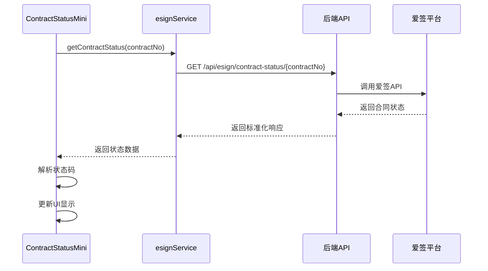
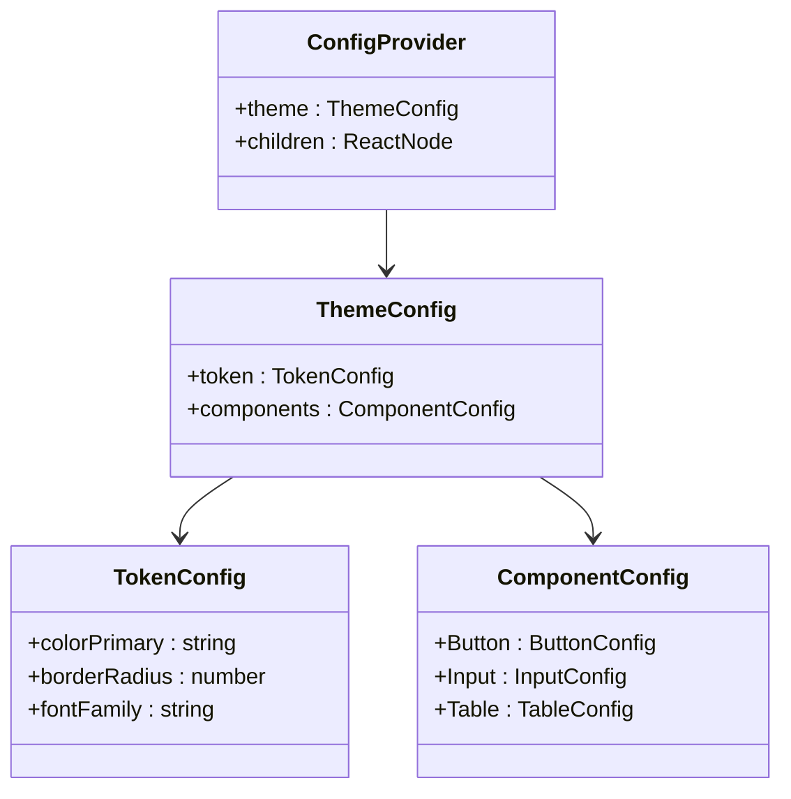
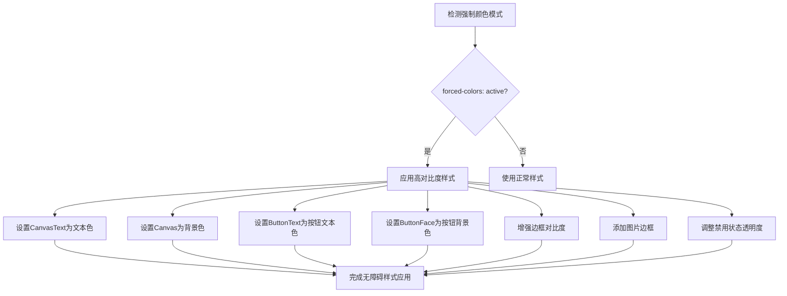

# UI组件与设计规范

<cite>
**本文档引用的文件**   
- [OptimizedImage.tsx](file://frontend/src/components/OptimizedImage.tsx)
- [IDUploader.tsx](file://frontend/src/components/IDUploader.tsx)
- [ContractStatusMini.tsx](file://frontend/src/components/ContractStatusMini.tsx)
- [forced-colors.css](file://frontend/src/styles/forced-colors.css)
- [main.tsx](file://frontend/src/main.tsx)
- [App.tsx](file://frontend/src/App.tsx)
- [esignService.ts](file://frontend/src/services/esignService.ts)
- [cos.service.ts](file://backend/src/modules/upload/cos.service.ts)
- [cos.config.ts](file://backend/src/config/cos.config.ts)
</cite>

## 目录
1. [系统介绍](#系统介绍)
2. [核心UI组件分析](#核心ui组件分析)
3. [图片优化组件实现](#图片优化组件实现)
4. [文件上传组件实现](#文件上传组件实现)
5. [状态展示组件设计](#状态展示组件设计)
6. [主题与无障碍访问](#主题与无障碍访问)
7. [最佳实践建议](#最佳实践建议)

## 系统介绍
本文档详细介绍了安得家政CRM系统的前端UI组件库设计与使用规范。系统采用React + Ant Design技术栈构建，重点关注性能优化、用户体验和可访问性。前端组件库包含一系列可复用的UI组件，如图片优化、文件上传、状态展示等，旨在提升开发效率和产品一致性。

系统通过模块化设计实现了组件的高内聚低耦合，前端与后端通过RESTful API进行通信。后端采用NestJS框架，集成了腾讯云COS对象存储服务用于文件管理，并通过爱签SDK实现电子合同签署功能。整体架构注重性能优化，特别是在图片加载、文件上传和状态管理方面采用了多种先进技术。

**Section sources**
- [App.tsx](file://frontend/src/App.tsx#L0-L97)
- [main.tsx](file://frontend/src/main.tsx#L0-L11)

## 核心UI组件分析
系统前端组件库包含多个核心UI组件，主要分为三大类：性能优化组件、文件交互组件和状态展示组件。这些组件通过合理的抽象和封装，实现了高复用性和易用性。

**Diagram sources**
- [OptimizedImage.tsx](file://frontend/src/components/OptimizedImage.tsx)
- [IDUploader.tsx](file://frontend/src/components/IDUploader.tsx)
- [ContractStatusMini.tsx](file://frontend/src/components/ContractStatusMini.tsx)

**Section sources**
- [OptimizedImage.tsx](file://frontend/src/components/OptimizedImage.tsx)
- [IDUploader.tsx](file://frontend/src/components/IDUploader.tsx)
- [ContractStatusMini.tsx](file://frontend/src/components/ContractStatusMini.tsx)

## 图片优化组件实现
OptimizedImage组件通过多种技术手段实现图片的高性能加载，包括懒加载、占位符显示和CDN优化。

### 懒加载机制
组件利用Intersection Observer API实现图片懒加载，当图片进入视口时才开始加载，有效减少初始页面加载时间。

**Diagram sources**
- [OptimizedImage.tsx](file://frontend/src/components/OptimizedImage.tsx#L16-L114)

### 组件实现细节
OptimizedImage组件通过状态管理实现加载过程的平滑过渡：

**Diagram sources**
- [OptimizedImage.tsx](file://frontend/src/components/OptimizedImage.tsx#L0-L116)

**Section sources**
- [OptimizedImage.tsx](file://frontend/src/components/OptimizedImage.tsx#L0-L116)

## 文件上传组件实现
IDUploader组件实现了身份证文件的上传功能，集成了前端验证、预览和后端COS存储。

### 文件上传流程
组件通过以下步骤实现文件上传：

**Diagram sources**
- [IDUploader.tsx](file://frontend/src/components/IDUploader.tsx#L15-L242)
- [cos.service.ts](file://backend/src/modules/upload/cos.service.ts#L0-L211)

### 后端COS集成
后端通过cos.service.ts实现与腾讯云COS的集成，提供文件上传、下载和管理功能。

**Diagram sources**
- [cos.service.ts](file://backend/src/modules/upload/cos.service.ts#L0-L211)
- [cos.config.ts](file://backend/src/config/cos.config.ts#L0-L19)

**Section sources**
- [IDUploader.tsx](file://frontend/src/components/IDUploader.tsx#L15-L242)
- [cos.service.ts](file://backend/src/modules/upload/cos.service.ts#L0-L211)
- [cos.config.ts](file://backend/src/config/cos.config.ts#L0-L19)

## 状态展示组件设计
ContractStatusMini组件用于展示合同的实时状态，通过颜色编码和工具提示提供丰富的状态信息。

### 状态映射设计
组件通过三个映射函数实现状态的可视化：

**Diagram sources**
- [ContractStatusMini.tsx](file://frontend/src/components/ContractStatusMini.tsx#L9-L123)

### 状态查询流程
组件通过调用电子合同服务获取实时状态：

**Diagram sources**
- [ContractStatusMini.tsx](file://frontend/src/components/ContractStatusMini.tsx#L9-L123)
- [esignService.ts](file://frontend/src/services/esignService.ts#L0-L846)

**Section sources**
- [ContractStatusMini.tsx](file://frontend/src/components/ContractStatusMini.tsx#L9-L123)
- [esignService.ts](file://frontend/src/services/esignService.ts#L0-L846)

## 主题与无障碍访问
系统通过Ant Design的ConfigProvider实现主题定制，并通过forced-colors.css支持无障碍访问。

### 主题配置
系统在App.tsx中通过ConfigProvider配置全局主题：

**Diagram sources**
- [App.tsx](file://frontend/src/App.tsx#L61-L97)

### 无障碍访问支持
系统通过forced-colors.css实现高对比度模式支持：

**Diagram sources**
- [forced-colors.css](file://frontend/src/styles/forced-colors.css#L0-L66)
- [main.tsx](file://frontend/src/main.tsx#L0-L11)

**Section sources**
- [forced-colors.css](file://frontend/src/styles/forced-colors.css#L0-L66)
- [main.tsx](file://frontend/src/main.tsx#L0-L11)
- [App.tsx](file://frontend/src/App.tsx#L61-L97)

## 最佳实践建议
基于系统设计，提出以下最佳实践建议：

### 组件复用原则
1. **单一职责**：每个组件只负责一个特定功能
2. **可配置性**：通过props提供足够的配置选项
3. **状态管理**：合理使用useState和useEffect管理组件状态
4. **类型安全**：使用TypeScript定义清晰的接口

### 样式隔离策略
1. **CSS Modules**：使用CSS Modules避免样式冲突
2. **BEM命名**：采用BEM命名规范提高可读性
3. **CSS变量**：使用CSS变量实现主题切换
4. **媒体查询**：合理使用媒体查询实现响应式布局

### 性能优化建议
1. **懒加载**：对非首屏内容实施懒加载
2. **图片优化**：使用适当的图片格式和尺寸
3. **代码分割**：按路由进行代码分割
4. **缓存策略**：合理使用浏览器缓存和内存缓存

### 无障碍访问最佳实践
1. **语义化HTML**：使用正确的HTML元素
2. **ARIA标签**：必要时添加ARIA属性
3. **键盘导航**：确保所有功能可通过键盘访问
4. **高对比度**：提供高对比度模式支持

**Section sources**
- [OptimizedImage.tsx](file://frontend/src/components/OptimizedImage.tsx)
- [IDUploader.tsx](file://frontend/src/components/IDUploader.tsx)
- [ContractStatusMini.tsx](file://frontend/src/components/ContractStatusMini.tsx)
- [forced-colors.css](file://frontend/src/styles/forced-colors.css)
- [App.tsx](file://frontend/src/App.tsx)