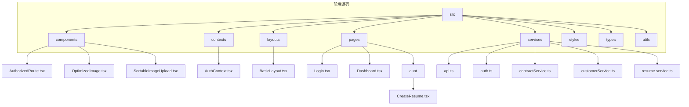
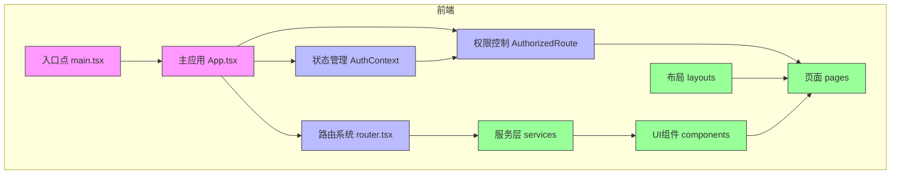
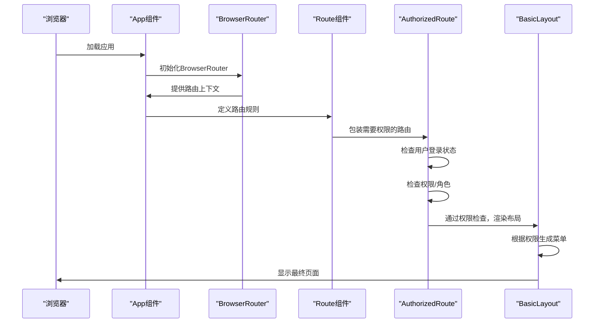
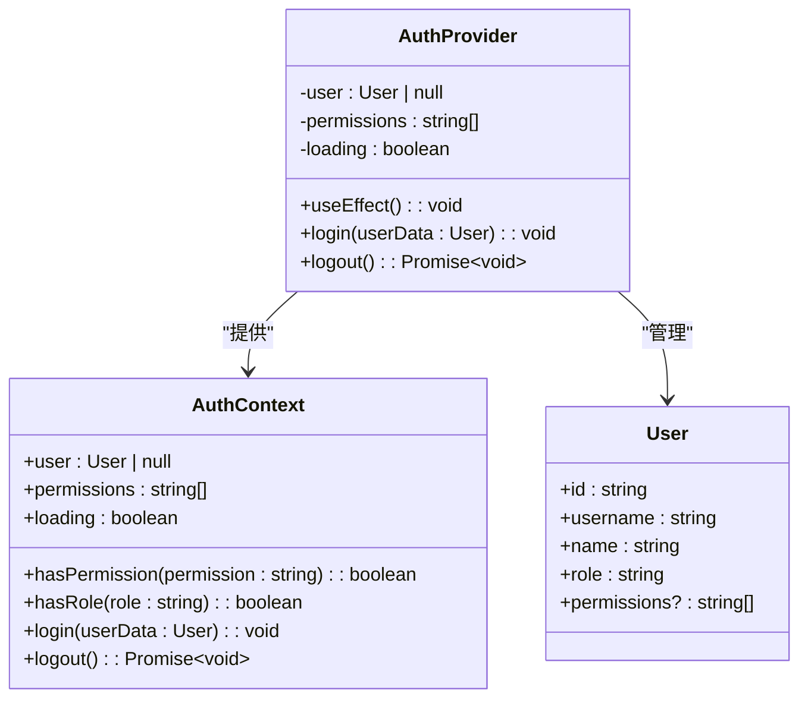
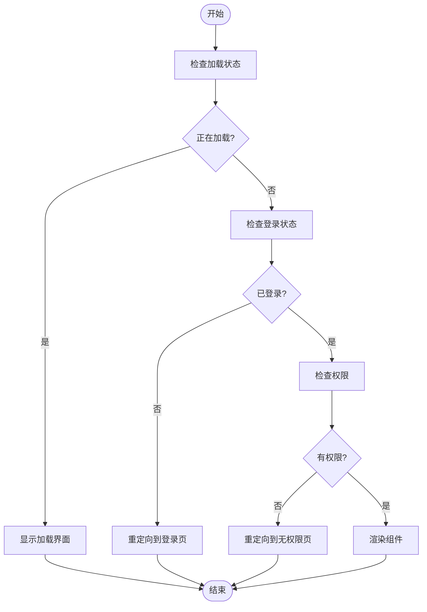
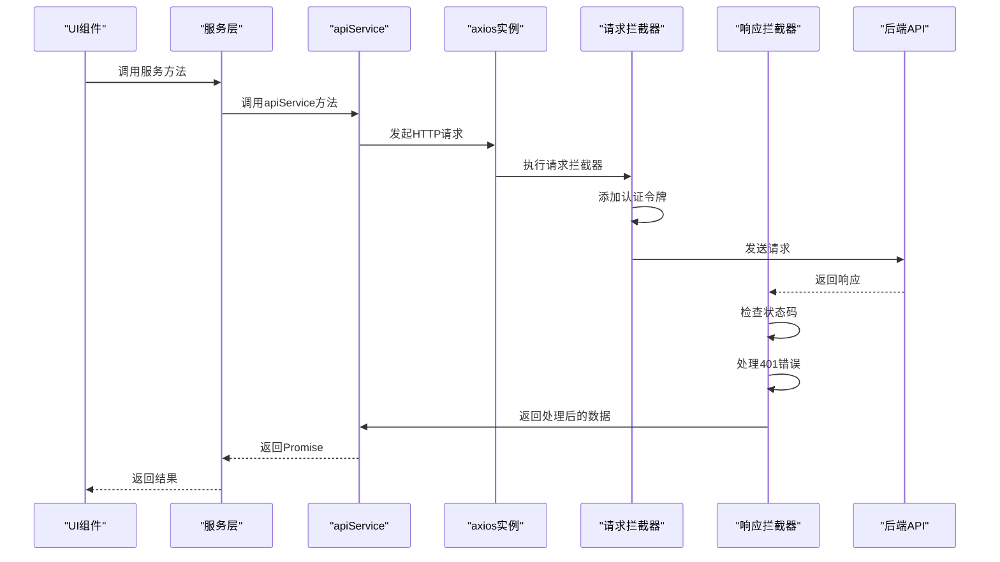
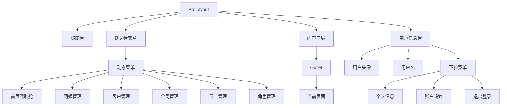
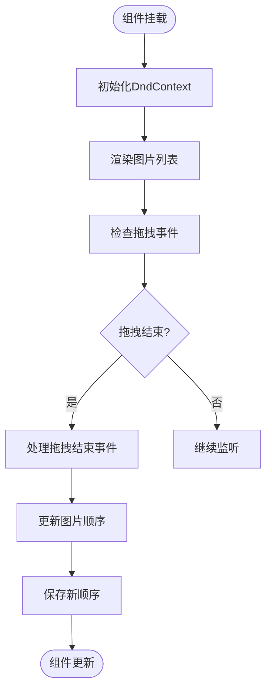
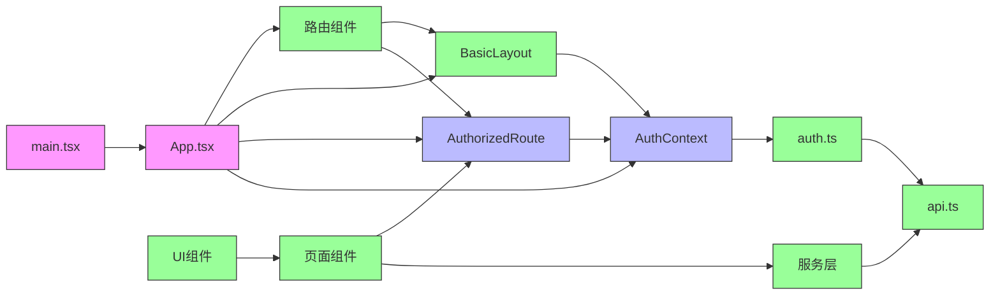

# 前端架构

<cite>
**本文档引用的文件**
- [main.tsx](file://frontend/src/main.tsx) - *更新了入口配置*
- [App.tsx](file://frontend/src/App.tsx) - *更新了路由配置*
- [AuthContext.tsx](file://frontend/src/contexts/AuthContext.tsx) - *更新了认证逻辑*
- [AuthorizedRoute.tsx](file://frontend/src/components/AuthorizedRoute.tsx) - *更新了权限验证逻辑*
- [api.ts](file://frontend/src/services/api.ts) - *更新了API服务*
- [BasicLayout.tsx](file://frontend/src/layouts/BasicLayout.tsx) - *更新了布局组件*
- [OptimizedImage.tsx](file://frontend/src/components/OptimizedImage.tsx) - *更新了图片优化组件*
- [CreateResume.tsx](file://frontend/src/pages/aunt/CreateResume.tsx) - *新增自我介绍字段和修复排序功能*
- [SortableImageUpload.tsx](file://frontend/src/components/SortableImageUpload.tsx) - *修复了图片上传排序问题*
</cite>

## 更新摘要
**变更内容**
- 在简历创建页面中添加了自我介绍输入框
- 修复了前端图片上传组件的排序问题
- 更新了相关组件的文档说明

## 目录
1. [项目结构](#项目结构)
2. [核心组件](#核心组件)
3. [架构概览](#架构概览)
4. [详细组件分析](#详细组件分析)
5. [依赖分析](#依赖分析)
6. [性能考虑](#性能考虑)
7. [故障排除指南](#故障排除指南)
8. [结论](#结论)

## 项目结构

该前端应用采用基于React + Vite的现代化架构，遵循组件化和模块化设计原则。项目结构清晰，按功能和职责进行组织。



**图示来源**
- [App.tsx](file://frontend/src/App.tsx#L0-L233)
- [main.tsx](file://frontend/src/main.tsx#L0-L11)

**本节来源**
- [App.tsx](file://frontend/src/App.tsx#L0-L233)
- [main.tsx](file://frontend/src/main.tsx#L0-L11)

## 核心组件

前端应用的核心组件包括路由系统、状态管理、权限控制、服务层和UI组件。这些组件共同构成了应用的基础架构。

**本节来源**
- [App.tsx](file://frontend/src/App.tsx#L0-L233)
- [AuthContext.tsx](file://frontend/src/contexts/AuthContext.tsx#L0-L121)
- [api.ts](file://frontend/src/services/api.ts#L0-L198)

## 架构概览

该前端应用采用现代化的React架构，结合Vite构建工具，实现了高效、可维护的代码结构。整体架构如下图所示：



**图示来源**
- [main.tsx](file://frontend/src/main.tsx#L0-L11)
- [App.tsx](file://frontend/src/App.tsx#L0-L233)
- [AuthContext.tsx](file://frontend/src/contexts/AuthContext.tsx#L0-L121)
- [AuthorizedRoute.tsx](file://frontend/src/components/AuthorizedRoute.tsx#L0-L69)
- [api.ts](file://frontend/src/services/api.ts#L0-L198)

## 详细组件分析

### 路由系统分析

路由系统是应用的导航中枢，负责管理页面间的跳转和URL映射。

#### 路由配置流程


**图示来源**
- [App.tsx](file://frontend/src/App.tsx#L0-L233)
- [AuthorizedRoute.tsx](file://frontend/src/components/AuthorizedRoute.tsx#L0-L69)
- [BasicLayout.tsx](file://frontend/src/layouts/BasicLayout.tsx#L0-L241)

**本节来源**
- [App.tsx](file://frontend/src/App.tsx#L0-L233)

### 状态管理与权限控制分析

状态管理和权限控制是应用安全性和用户体验的关键。

#### AuthContext 类图


**图示来源**
- [AuthContext.tsx](file://frontend/src/contexts/AuthContext.tsx#L0-L121)

#### 权限验证流程


**图示来源**
- [AuthorizedRoute.tsx](file://frontend/src/components/AuthorizedRoute.tsx#L0-L69)

**本节来源**
- [AuthContext.tsx](file://frontend/src/contexts/AuthContext.tsx#L0-L121)
- [AuthorizedRoute.tsx](file://frontend/src/components/AuthorizedRoute.tsx#L0-L69)

### 服务层与API通信分析

服务层负责与后端API进行通信，处理请求和响应。

#### API请求流程


**图示来源**
- [api.ts](file://frontend/src/services/api.ts#L0-L198)

#### API服务类图
```mermaid
classDiagram
class apiService {
+get~T~(url : string, params? : any) : Promise~ApiResponse~T~~
+post~T~(url : string, data? : any) : Promise~ApiResponse~T~~
+put~T~(url : string, data? : any) : Promise~ApiResponse~T~~
+patch~T~(url : string, data? : any) : Promise~ApiResponse~T~~
+delete~T~(url : string) : Promise~ApiResponse~T~~
+upload~T~(url : string, formData : FormData) : Promise~ApiResponse~T~~
+checkHealth() : Promise~boolean~
}
class ApiResponse {
+success : boolean
+data? : T
+message? : string
+error? : { code : string; details? : any }
+timestamp : number
}
class api {
+interceptors : { request, response }
+create(config : AxiosRequestConfig) : AxiosInstance
}
apiService --> ApiResponse : "返回"
apiService --> api : "使用"
```

**图示来源**
- [api.ts](file://frontend/src/services/api.ts#L0-L198)

**本节来源**
- [api.ts](file://frontend/src/services/api.ts#L0-L198)

### UI组件与布局分析

UI组件和布局负责构建用户界面，提供良好的用户体验。

#### 布局组件结构


**图示来源**
- [BasicLayout.tsx](file://frontend/src/layouts/BasicLayout.tsx#L0-L241)

**本节来源**
- [BasicLayout.tsx](file://frontend/src/layouts/BasicLayout.tsx#L0-L241)

### 简历创建页面分析

简历创建页面是系统的核心功能之一，允许用户创建和编辑阿姨简历。

#### 新增自我介绍字段
在`CreateResume.tsx`文件中，新增了自我介绍输入框，允许用户填写个人介绍信息。

```typescript
<Form.Item
  label="自我介绍"
  name="selfIntroduction"
  extra="请简单介绍一下自己的工作经验、技能特长、性格特点等（选填，最多1000字）"
>
  <Input.TextArea
    placeholder="请简单介绍一下自己的工作经验、技能特长、性格特点等..."
    rows={4}
    maxLength={1000}
    showCount
    style={{ width: '100%' }}
  />
</Form.Item>
```

**图示来源**
- [CreateResume.tsx](file://frontend/src/pages/aunt/CreateResume.tsx#L1600-L2399)

#### 图片上传排序功能
`SortableImageUpload`组件实现了图片的拖拽排序功能，解决了图片上传顺序混乱的问题。



**图示来源**
- [SortableImageUpload.tsx](file://frontend/src/components/SortableImageUpload.tsx#L0-L397)

**本节来源**
- [CreateResume.tsx](file://frontend/src/pages/aunt/CreateResume.tsx#L1600-L2399)
- [SortableImageUpload.tsx](file://frontend/src/components/SortableImageUpload.tsx#L0-L397)

## 依赖分析

前端应用的依赖关系清晰，各组件之间耦合度低，便于维护和扩展。



**图示来源**
- [main.tsx](file://frontend/src/main.tsx#L0-L11)
- [App.tsx](file://frontend/src/App.tsx#L0-L233)
- [AuthContext.tsx](file://frontend/src/contexts/AuthContext.tsx#L0-L121)
- [AuthorizedRoute.tsx](file://frontend/src/components/AuthorizedRoute.tsx#L0-L69)
- [BasicLayout.tsx](file://frontend/src/layouts/BasicLayout.tsx#L0-L241)
- [api.ts](file://frontend/src/services/api.ts#L0-L198)

**本节来源**
- [main.tsx](file://frontend/src/main.tsx#L0-L11)
- [App.tsx](file://frontend/src/App.tsx#L0-L233)

## 性能考虑

该前端应用在性能优化方面采取了多项策略，确保了良好的用户体验。

### 代码分割与懒加载

应用使用React的`React.lazy()`和`Suspense`组件实现了路由级别的代码分割和懒加载。当用户访问某个页面时，才加载该页面所需的代码，减少了初始加载时间。

```typescript
// 在App.tsx中实现的懒加载
const Login = React.lazy(() => import('./pages/Login'));
const Dashboard = React.lazy(() => import('./pages/Dashboard'));
// ... 其他页面组件
```

### 图片优化

`OptimizedImage`组件实现了多项图片优化策略：
- **懒加载**：使用`IntersectionObserver` API，只有当图片进入视口时才加载
- **错误处理**：提供备用图片(fallback)，当原图加载失败时显示
- **加载状态**：显示加载指示器，提升用户体验
- **占位符**：在图片加载期间显示占位符

### 请求优化

API服务层实现了以下优化：
- **请求重试**：网络错误时自动重试，提高请求成功率
- **健康检查**：提供`checkHealth`方法，用于检查后端服务状态
- **统一错误处理**：在响应拦截器中集中处理错误，便于调试和用户提示

### 布局优化

`BasicLayout`组件使用`useMemo`钩子对菜单进行记忆化处理，避免不必要的重新渲染，提高性能。

```typescript
const getAuthorizedMenus = useMemo((): MenuRoute[] => {
  // 菜单生成逻辑
}, [hasPermission, hasRole]);
```

**本节来源**
- [App.tsx](file://frontend/src/App.tsx#L0-L233)
- [OptimizedImage.tsx](file://frontend/src/components/OptimizedImage.tsx#L0-L116)
- [api.ts](file://frontend/src/services/api.ts#L0-L198)
- [BasicLayout.tsx](file://frontend/src/layouts/BasicLayout.tsx#L0-L241)

## 故障排除指南

### 常见问题及解决方案

#### 1. 页面白屏或加载失败
- **可能原因**：网络连接问题或后端服务不可用
- **解决方案**：
  - 检查网络连接
  - 使用`apiService.checkHealth()`检查后端服务状态
  - 查看浏览器控制台是否有错误信息

#### 2. 登录后无法访问页面
- **可能原因**：权限不足或角色不匹配
- **解决方案**：
  - 检查用户权限和角色
  - 确认`AuthorizedRoute`组件的`authority`或`role`属性设置正确
  - 查看`AuthContext`中的用户信息是否正确

#### 3. API请求失败
- **可能原因**：认证令牌过期或网络问题
- **解决方案**：
  - 检查请求拦截器是否正确添加了`Authorization`头
  - 查看响应拦截器是否正确处理了401错误
  - 确认API路径和参数是否正确

#### 4. 图片无法加载
- **可能原因**：图片URL错误或网络问题
- **解决方案**：
  - 检查`OptimizedImage`组件的`src`属性
  - 确认备用图片(fallback)是否设置
  - 查看浏览器开发者工具的网络面板

#### 5. 图片排序不保存
- **可能原因**：排序后未正确保存到服务器
- **解决方案**：
  - 检查`SortableImageUpload`组件的`onChange`回调是否正确触发
  - 确认在提交表单时是否包含了最新的图片顺序
  - 查看网络请求是否成功发送了排序信息

**本节来源**
- [api.ts](file://frontend/src/services/api.ts#L0-L198)
- [AuthContext.tsx](file://frontend/src/contexts/AuthContext.tsx#L0-L121)
- [AuthorizedRoute.tsx](file://frontend/src/components/AuthorizedRoute.tsx#L0-L69)
- [OptimizedImage.tsx](file://frontend/src/components/OptimizedImage.tsx#L0-L116)
- [CreateResume.tsx](file://frontend/src/pages/aunt/CreateResume.tsx#L1600-L2399)
- [SortableImageUpload.tsx](file://frontend/src/components/SortableImageUpload.tsx#L0-L397)

## 结论

该前端应用基于React + Vite架构，采用了现代化的开发实践和设计模式。通过组件化架构、Context API状态管理、精细化的权限控制、抽象的服务层和优化的UI组件，构建了一个高效、可维护的应用系统。

应用在架构设计上具有以下优点：
1. **清晰的分层结构**：代码组织合理，职责分明
2. **灵活的权限控制**：基于权限和角色的双重控制机制
3. **健壮的API通信**：统一的请求/响应处理和错误管理
4. **良好的用户体验**：懒加载、加载状态提示和错误处理
5. **可扩展性**：模块化设计便于功能扩展

建议开发者遵循以下最佳实践：
- 保持组件的单一职责原则
- 在服务层处理业务逻辑，避免在UI组件中直接调用API
- 充分利用TypeScript的类型系统，提高代码质量和可维护性
- 遵循Ant Design的设计规范，保持UI一致性
- 利用性能优化技术，持续提升应用性能
- 在新增功能时，确保相应的文档更新
- 修复bug时，不仅要修复代码，还要确保相关文档的准确性