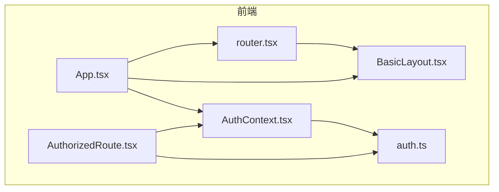
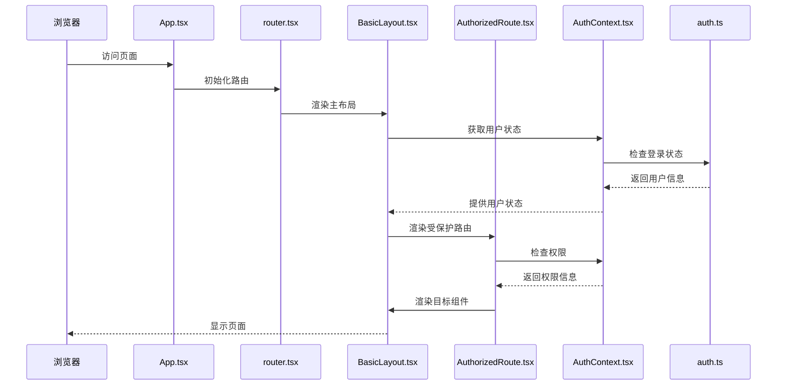
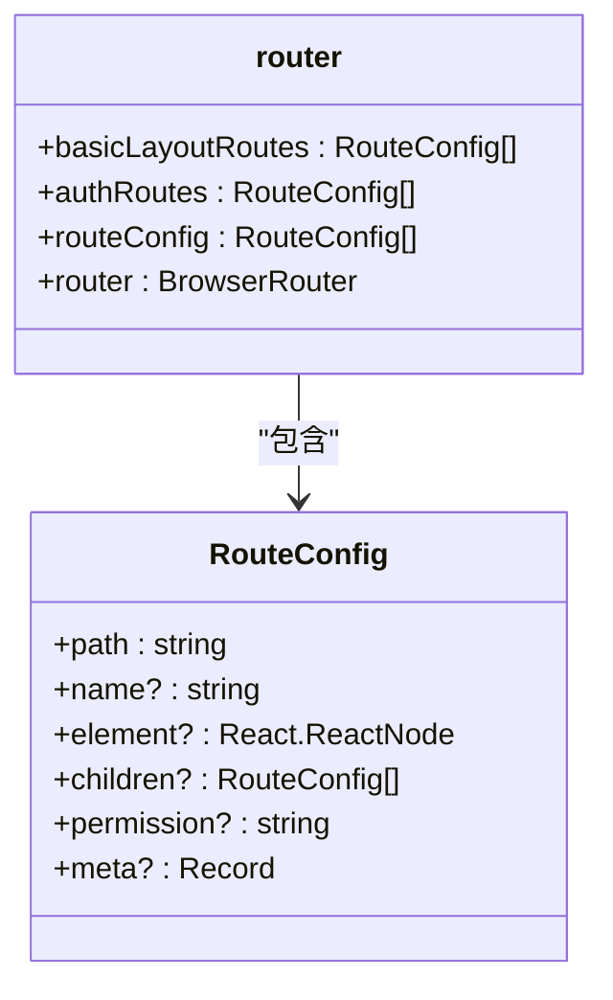
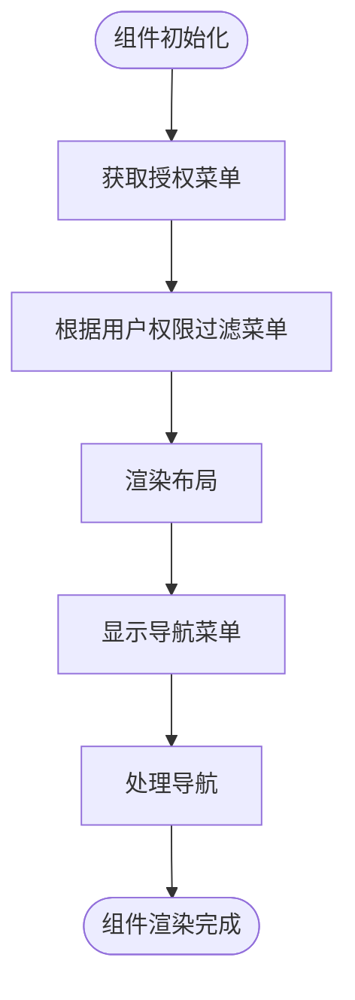
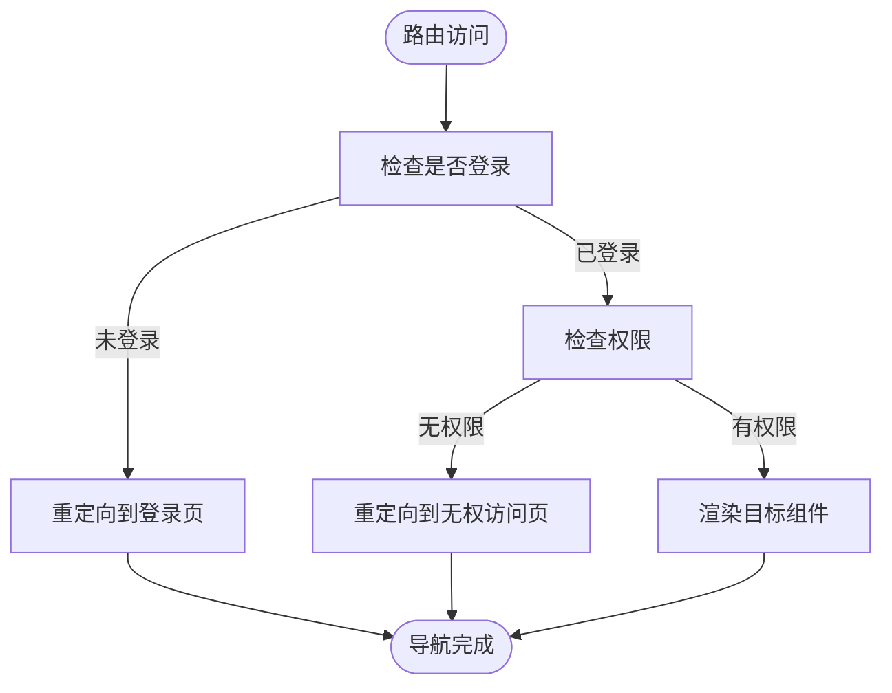

# 前端路由配置

<cite>
**本文档引用的文件**
- [router.tsx](file://frontend/src/router.tsx#L0-L116)
- [App.tsx](file://frontend/src/App.tsx#L0-L233)
- [BasicLayout.tsx](file://frontend/src/layouts/BasicLayout.tsx#L0-L242)
- [AuthorizedRoute.tsx](file://frontend/src/components/AuthorizedRoute.tsx#L0-L69)
- [AuthContext.tsx](file://frontend/src/contexts/AuthContext.tsx#L0-L121)
- [auth.ts](file://frontend/src/services/auth.ts#L0-L186)
- [SignContractPage.tsx](file://frontend/src/pages/esign/SignContractPage.tsx#L0-L360)
</cite>

## 目录
1. [项目结构](#项目结构)
2. [核心组件](#核心组件)
3. [架构概述](#架构概述)
4. [详细组件分析](#详细组件分析)
5. [依赖分析](#依赖分析)
6. [性能考虑](#性能考虑)
7. [故障排除指南](#故障排除指南)

## 项目结构
本项目采用典型的前后端分离架构，前端位于`frontend`目录下，使用React框架构建。前端路由系统是应用导航的核心，通过`react-router-dom`实现。路由配置主要集中在`router.tsx`文件中，该文件定义了所有路由规则。主布局组件`BasicLayout.tsx`负责提供统一的页面框架和导航菜单。权限控制通过`AuthorizedRoute.tsx`和`AuthContext.tsx`实现，确保只有经过认证和授权的用户才能访问特定页面。`App.tsx`作为应用的根组件，负责挂载路由和提供全局上下文。



**图示来源**
- [router.tsx](file://frontend/src/router.tsx#L0-L116)
- [App.tsx](file://frontend/src/App.tsx#L0-L233)
- [BasicLayout.tsx](file://frontend/src/layouts/BasicLayout.tsx#L0-L242)

**章节来源**
- [router.tsx](file://frontend/src/router.tsx#L0-L116)
- [App.tsx](file://frontend/src/App.tsx#L0-L233)

## 核心组件
前端路由系统的核心组件包括`router.tsx`中的路由定义、`App.tsx`中的路由挂载、`BasicLayout.tsx`中的布局管理以及`AuthorizedRoute.tsx`中的权限守卫。`router.tsx`文件使用`createBrowserRouter`函数创建路由实例，并通过`lazy`函数实现路由的懒加载，从而提升首屏加载性能。`App.tsx`文件通过`BrowserRouter`组件将路由系统集成到应用中，并使用`Suspense`组件处理异步加载的组件。`BasicLayout.tsx`作为主布局组件，提供了统一的页面框架和导航菜单，通过`ProLayout`组件实现。`AuthorizedRoute.tsx`组件实现了路由守卫功能，确保只有经过认证和授权的用户才能访问受保护的路由。

**章节来源**
- [router.tsx](file://frontend/src/router.tsx#L0-L116)
- [App.tsx](file://frontend/src/App.tsx#L0-L233)
- [BasicLayout.tsx](file://frontend/src/layouts/BasicLayout.tsx#L0-L242)
- [AuthorizedRoute.tsx](file://frontend/src/components/AuthorizedRoute.tsx#L0-L69)

## 架构概述
整个前端路由系统的架构基于React Router v6，采用了模块化和组件化的设计思想。路由配置被分离到`router.tsx`文件中，便于维护和管理。路由守卫逻辑被封装在`AuthorizedRoute.tsx`组件中，实现了权限控制的复用。主布局组件`BasicLayout.tsx`与路由系统紧密集成，通过`Outlet`组件渲染子路由的内容。认证和权限信息通过`AuthContext.tsx`提供的上下文进行管理，确保了状态的一致性和可预测性。这种架构设计使得路由系统具有良好的可扩展性和可维护性。



**图示来源**
- [App.tsx](file://frontend/src/App.tsx#L0-L233)
- [router.tsx](file://frontend/src/router.tsx#L0-L116)
- [BasicLayout.tsx](file://frontend/src/layouts/BasicLayout.tsx#L0-L242)
- [AuthorizedRoute.tsx](file://frontend/src/components/AuthorizedRoute.tsx#L0-L69)
- [AuthContext.tsx](file://frontend/src/contexts/AuthContext.tsx#L0-L121)
- [auth.ts](file://frontend/src/services/auth.ts#L0-L186)

## 详细组件分析
### 路由定义分析
`router.tsx`文件定义了应用的所有路由规则。路由配置被分为`basicLayoutRoutes`和`authRoutes`两部分，分别对应受保护的路由和公共路由。`basicLayoutRoutes`包含了需要登录才能访问的页面，如仪表板、简历列表等。`authRoutes`包含了登录页面等公共路由。通过`lazy`函数实现路由的懒加载，每个页面组件都被异步加载，从而实现代码分割，提升首屏加载性能。`routeConfig`数组合并了所有路由配置，并通过`createBrowserRouter`函数创建路由实例。



**图示来源**
- [router.tsx](file://frontend/src/router.tsx#L0-L116)

**章节来源**
- [router.tsx](file://frontend/src/router.tsx#L0-L116)

### 路由挂载分析
`App.tsx`文件是应用的根组件，负责将路由系统集成到应用中。通过`BrowserRouter`组件提供路由上下文，`Routes`和`Route`组件定义路由规则。`AuthProvider`组件提供认证上下文，`Suspense`组件处理异步加载的组件。受保护的路由通过`AuthorizedRoute`组件进行包装，实现权限控制。`PageContainer`组件提供页面容器，`BasicLayout`组件提供主布局。这种设计使得路由系统与应用的其他部分解耦，便于维护和扩展。

**章节来源**
- [App.tsx](file://frontend/src/App.tsx#L0-L233)

### 主布局组件分析
`BasicLayout.tsx`组件作为主布局组件，提供了统一的页面框架和导航菜单。通过`ProLayout`组件实现，支持侧边栏、顶部导航、面包屑等功能。导航菜单项根据用户的权限动态生成，通过`useMemo`钩子优化性能。`useLocation`和`useNavigate`钩子用于获取当前路由信息和进行页面导航。`Outlet`组件用于渲染子路由的内容，实现了嵌套路由的功能。用户下拉菜单提供了个人信息、账户设置和退出登录等功能。



**图示来源**
- [BasicLayout.tsx](file://frontend/src/layouts/BasicLayout.tsx#L0-L242)

**章节来源**
- [BasicLayout.tsx](file://frontend/src/layouts/BasicLayout.tsx#L0-L242)

### 路由守卫分析
`AuthorizedRoute.tsx`组件实现了路由守卫功能，确保只有经过认证和授权的用户才能访问受保护的路由。通过`useAuth`钩子获取用户状态和权限信息。首先检查用户是否已登录，如果未登录则重定向到登录页面。然后检查用户是否具有访问该路由所需的权限或角色，如果无权限则重定向到无权访问页面。`loading`状态用于处理权限信息加载过程中的显示。这种设计实现了细粒度的权限控制，提高了应用的安全性。



**图示来源**
- [AuthorizedRoute.tsx](file://frontend/src/components/AuthorizedRoute.tsx#L0-L69)

**章节来源**
- [AuthorizedRoute.tsx](file://frontend/src/components/AuthorizedRoute.tsx#L0-L69)

### 认证上下文分析
`AuthContext.tsx`文件定义了认证上下文，用于管理用户状态和权限信息。`AuthProvider`组件提供上下文，`useAuth`钩子用于在组件中访问上下文。`useEffect`钩子在组件挂载时初始化认证状态，从本地存储中读取用户信息和权限。`hasPermission`函数检查用户是否具有特定权限，支持通配符权限。`hasRole`函数检查用户是否具有特定角色。`login`和`logout`函数用于处理用户登录和登出逻辑。这种设计实现了全局状态管理，确保了状态的一致性和可预测性。

**章节来源**
- [AuthContext.tsx](file://frontend/src/contexts/AuthContext.tsx#L0-L121)

### 动态路由参数分析
动态路由参数在`SignContractPage.tsx`等页面中被广泛使用。通过`useParams`钩子获取URL中的动态参数，如合同ID。`useNavigate`钩子用于页面导航。在`SignContractPage`组件中，`useEffect`钩子监听`contractId`的变化，当ID变化时重新加载合同信息。这种设计实现了基于URL参数的动态内容加载，提高了用户体验。

**章节来源**
- [SignContractPage.tsx](file://frontend/src/pages/esign/SignContractPage.tsx#L0-L360)

## 依赖分析
前端路由系统依赖于多个核心库和组件。`react-router-dom`提供了路由功能，`antd`和`@ant-design/pro-components`提供了UI组件和布局。`react-cookies`用于管理Cookie，`jwt-decode`用于解析JWT令牌。`BasicLayout.tsx`依赖于`ProLayout`组件，`AuthorizedRoute.tsx`依赖于`AuthContext.tsx`提供的上下文。`AuthContext.tsx`依赖于`auth.ts`中的服务函数。这种依赖关系形成了一个清晰的层次结构，确保了代码的可维护性和可测试性。

```mermaid
graph TD
A[react-router-dom] --> B[App.tsx]
A --> C[router.tsx]
A --> D[BasicLayout.tsx]
A --> E[AuthorizedRoute.tsx]
F[antd] --> B
F --> D
G[@ant-design/pro-components] --> D
H[react-cookies] --> I[auth.ts]
J[jwt-decode] --> I
I --> K[AuthContext.tsx]
K --> E
K --> D
E --> B
D --> B
C --> B
```

**图示来源**
- [App.tsx](file://frontend/src/App.tsx#L0-L233)
- [router.tsx](file://frontend/src/router.tsx#L0-L116)
- [BasicLayout.tsx](file://frontend/src/layouts/BasicLayout.tsx#L0-L242)
- [AuthorizedRoute.tsx](file://frontend/src/components/AuthorizedRoute.tsx#L0-L69)
- [AuthContext.tsx](file://frontend/src/contexts/AuthContext.tsx#L0-L121)
- [auth.ts](file://frontend/src/services/auth.ts#L0-L186)

**章节来源**
- [App.tsx](file://frontend/src/App.tsx#L0-L233)
- [router.tsx](file://frontend/src/router.tsx#L0-L116)
- [BasicLayout.tsx](file://frontend/src/layouts/BasicLayout.tsx#L0-L242)
- [AuthorizedRoute.tsx](file://frontend/src/components/AuthorizedRoute.tsx#L0-L69)
- [AuthContext.tsx](file://frontend/src/contexts/AuthContext.tsx#L0-L121)
- [auth.ts](file://frontend/src/services/auth.ts#L0-L186)

## 性能考虑
前端路由系统在性能方面做了多项优化。首先，通过`lazy`函数实现路由的懒加载，将代码分割成多个小块，只在需要时加载，显著提升了首屏加载速度。其次，`BasicLayout.tsx`中的菜单项通过`useMemo`钩子进行缓存，避免了不必要的重新渲染。`AuthorizedRoute.tsx`组件在权限检查时也进行了优化，避免了重复的权限验证。此外，`Suspense`组件提供了加载状态的显示，改善了用户体验。这些优化措施共同确保了应用的高性能和流畅性。

## 故障排除指南
在使用前端路由系统时，可能会遇到一些常见问题。如果页面无法加载，首先检查网络连接和服务器状态。如果路由无法匹配，检查`router.tsx`中的路径配置是否正确。如果权限控制失效，检查`AuthorizedRoute.tsx`中的权限检查逻辑和`AuthContext.tsx`中的用户状态。如果动态路由参数无法获取，检查`useParams`钩子的使用是否正确。如果出现白屏，检查控制台是否有JavaScript错误。通过这些步骤，可以快速定位和解决路由相关的问题。

**章节来源**
- [router.tsx](file://frontend/src/router.tsx#L0-L116)
- [App.tsx](file://frontend/src/App.tsx#L0-L233)
- [BasicLayout.tsx](file://frontend/src/layouts/BasicLayout.tsx#L0-L242)
- [AuthorizedRoute.tsx](file://frontend/src/components/AuthorizedRoute.tsx#L0-L69)
- [AuthContext.tsx](file://frontend/src/contexts/AuthContext.tsx#L0-L121)
- [auth.ts](file://frontend/src/services/auth.ts#L0-L186)
- [SignContractPage.tsx](file://frontend/src/pages/esign/SignContractPage.tsx#L0-L360)