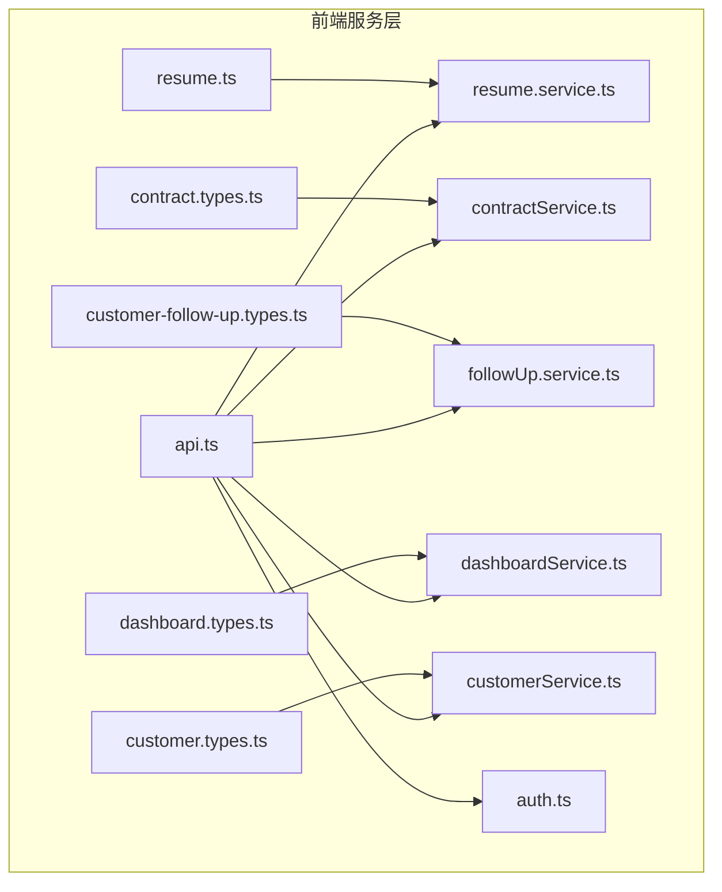
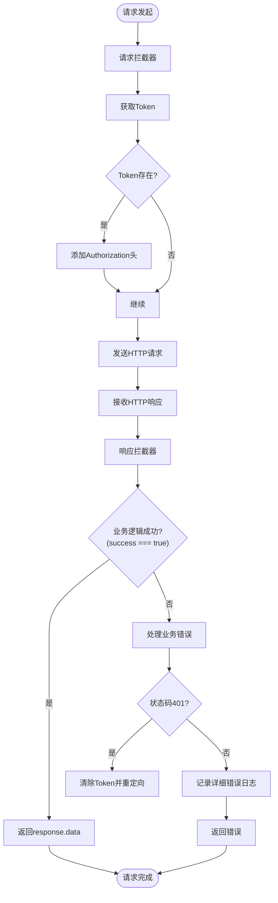
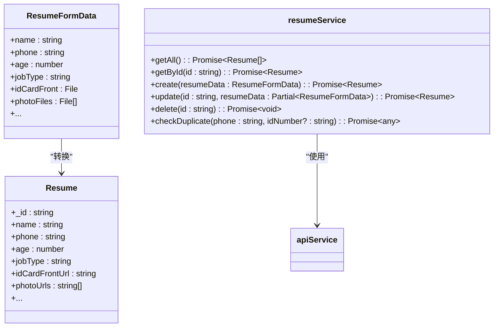
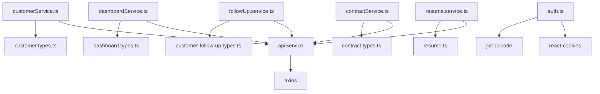

# 服务层与API通信

<cite>
**本文档引用的文件**  
- [api.ts](file://frontend/src/services/api.ts)
- [auth.ts](file://frontend/src/services/auth.ts)
- [resume.service.ts](file://frontend/src/services/resume.service.ts)
- [followUp.service.ts](file://frontend/src/services/followUp.service.ts)
- [contractService.ts](file://frontend/src/services/contractService.ts)
- [dashboardService.ts](file://frontend/src/services/dashboardService.ts)
- [customerService.ts](file://frontend/src/services/customerService.ts)
- [resume.ts](file://frontend/src/types/resume.ts)
- [customer-follow-up.types.ts](file://frontend/src/types/customer-follow-up.types.ts)
- [contract.types.ts](file://frontend/src/types/contract.types.ts)
- [dashboard.types.ts](file://frontend/src/types/dashboard.types.ts)
- [customer.types.ts](file://frontend/src/types/customer.types.ts)
</cite>

## 目录
1. [项目结构](#项目结构)
2. [核心组件](#核心组件)
3. [架构概览](#架构概览)
4. [详细组件分析](#详细组件分析)
5. [依赖分析](#依赖分析)
6. [性能考虑](#性能考虑)
7. [故障排除指南](#故障排除指南)
8. [结论](#结论)

## 项目结构
前端服务层位于`frontend/src/services`目录下，采用模块化设计，将不同业务领域的API调用封装在独立的服务文件中。这种结构提高了代码的可维护性和可复用性。核心的HTTP通信由`api.ts`文件统一管理，它基于axios库创建了一个全局的API实例，并配置了请求和响应拦截器。业务服务模块（如`resume.service.ts`、`contractService.ts`）则依赖于这个核心实例，专注于特定业务逻辑的实现。类型定义文件位于`frontend/src/types`目录，为API调用提供了类型安全保证。



**图示来源**
- [api.ts](file://frontend/src/services/api.ts)
- [resume.service.ts](file://frontend/src/services/resume.service.ts)
- [contractService.ts](file://frontend/src/services/contractService.ts)
- [followUp.service.ts](file://frontend/src/services/followUp.service.ts)
- [dashboardService.ts](file://frontend/src/services/dashboardService.ts)
- [customerService.ts](file://frontend/src/services/customerService.ts)
- [resume.ts](file://frontend/src/types/resume.ts)
- [contract.types.ts](file://frontend/src/types/contract.types.ts)
- [customer-follow-up.types.ts](file://frontend/src/types/customer-follow-up.types.ts)
- [dashboard.types.ts](file://frontend/src/types/dashboard.types.ts)
- [customer.types.ts](file://frontend/src/types/customer.types.ts)

**本节来源**
- [api.ts](file://frontend/src/services/api.ts)
- [resume.service.ts](file://frontend/src/services/resume.service.ts)
- [contractService.ts](file://frontend/src/services/contractService.ts)

## 核心组件
前端服务层的核心是`api.ts`文件，它封装了所有与后端的HTTP通信。该文件创建了一个axios实例，并通过拦截器实现了认证、错误处理和日志记录等横切关注点。`apiService`对象提供了`get`、`post`、`put`、`delete`和`upload`等便捷方法，简化了API调用。`auth.ts`文件负责管理用户认证状态，包括token的存储、读取和清除。各业务服务模块（如简历、合同、客户跟进）则利用`apiService`来实现具体的业务功能。

**本节来源**
- [api.ts](file://frontend/src/services/api.ts)
- [auth.ts](file://frontend/src/services/auth.ts)

## 架构概览
整个服务层架构围绕`api.ts`中的axios实例构建。请求首先通过请求拦截器，该拦截器会自动添加认证头。然后，请求被发送到后端。响应返回后，会经过响应拦截器处理，该拦截器负责解析标准响应格式、处理全局错误（如401未授权）并进行日志记录。业务服务模块通过调用`apiService`提供的方法来发起请求，这些方法内部使用了带有重试机制的`request`函数。类型定义文件确保了前后端数据契约的一致性。

```mermaid
sequenceDiagram
participant 前端组件 as 前端组件
participant 业务服务 as 业务服务 (e.g., resumeService)
participant apiService as apiService
participant axios实例 as axios实例
participant 后端 as 后端
前端组件->>业务服务 : 调用createResume()
业务服务->>apiService : 调用post('/api/resumes', data)
apiService->>axios实例 : 发起POST请求
axios实例->>axios实例 : 请求拦截器添加Authorization头
axios实例->>后端 : 发送HTTP请求
后端-->>axios实例 : 返回HTTP响应
axios实例->>axios实例 : 响应拦截器检查success字段
业务服务<<-apiService : 返回解析后的数据
前端组件<<-业务服务 : 返回简历数据
```

**图示来源**
- [api.ts](file://frontend/src/services/api.ts)
- [resume.service.ts](file://frontend/src/services/resume.service.ts)

## 详细组件分析

### api.ts分析
`api.ts`是整个前端API通信的基石。它首先创建一个axios实例，配置了基础URL、超时时间和默认的Content-Type。请求拦截器是其关键部分，它从`auth.ts`中获取token，并将其添加到每个请求的`Authorization`头中，实现了认证的自动化。



**图示来源**
- [api.ts](file://frontend/src/services/api.ts#L1-L198)

**本节来源**
- [api.ts](file://frontend/src/services/api.ts#L1-L198)

#### 响应拦截器功能
响应拦截器承担了多项重要职责：
1.  **业务逻辑错误处理**：检查响应数据中的`success`字段。如果为`false`，则抛出一个包含错误信息的JavaScript错误，便于上层代码捕获。
2.  **全局错误处理**：对于401未授权错误，它会自动清除本地存储的token，并将用户重定向到登录页，实现了无感的会话过期处理。
3.  **错误日志增强**：对于其他错误，它会使用`console.groupCollapsed`输出详细的请求配置和响应数据，极大地便利了开发和调试。
4.  **网络错误重试**：`request`函数实现了网络错误的自动重试机制，最多重试2次，每次间隔时间翻倍，提高了应用的健壮性。

#### 文件上传处理
`apiService`提供了一个专用的`upload`方法，用于处理文件上传。该方法会自动将`Content-Type`设置为`multipart/form-data`，并接受一个`FormData`对象作为数据。`resume.service.ts`中的`create`和`update`方法就是通过构建`FormData`对象来上传简历相关的文件（如身份证照片、证书等）。

**本节来源**
- [api.ts](file://frontend/src/services/api.ts#L71-L198)
- [resume.service.ts](file://frontend/src/services/resume.service.ts#L50-L150)

### 业务服务模块分析
业务服务模块遵循了清晰的职责划分和复用策略。每个模块（如`resume.service.ts`、`contractService.ts`）都导出一个包含多个方法的对象，这些方法封装了特定业务领域的API调用。

#### 简历服务 (resume.service.ts)
`resumeService`模块负责管理简历的CRUD操作。它定义了`Resume`和`ResumeFormData`接口，前者用于表示从后端获取的数据，后者用于表示前端表单数据。`create`和`update`方法会将`ResumeFormData`中的普通字段和文件字段分别处理，构建`FormData`对象进行上传。



**图示来源**
- [resume.service.ts](file://frontend/src/services/resume.service.ts#L1-L209)
- [resume.ts](file://frontend/src/types/resume.ts#L1-L94)

**本节来源**
- [resume.service.ts](file://frontend/src/services/resume.service.ts#L1-L209)
- [resume.ts](file://frontend/src/types/resume.ts#L1-L94)

#### 合同服务 (contractService.ts)
`contractService`模块提供了丰富的合同管理功能，包括创建、查询、更新、删除合同，以及获取合同统计信息和爱签（eSign）集成相关的功能。它还实现了`searchWorkers`方法，用于在创建合同时搜索服务人员。

**本节来源**
- [contractService.ts](file://frontend/src/services/contractService.ts#L1-L272)

#### 客户跟进服务 (followUp.service.ts)
`followUp.service.ts`定义了`FollowUpRecord`和`CreateFollowUpDto`等接口，并提供了创建、查询和删除跟进记录的方法。它还定义了一个`followUpTypeMap`常量，用于将后端的枚举值映射为前端显示的中文文本。

**本节来源**
- [followUp.service.ts](file://frontend/src/services/followUp.service.ts#L1-L129)

### 类型安全的API调用
项目通过`frontend/src/types`目录下的TypeScript接口定义，实现了类型安全的API调用。例如，`contract.types.ts`中定义了`Contract`和`CreateContractData`接口，`dashboard.types.ts`中定义了`DashboardStats`接口。当业务服务调用`apiService.get<DashboardStats>('/api/dashboard/stats')`时，TypeScript编译器就能确保返回的数据结构符合`DashboardStats`的定义，从而在开发阶段就捕获潜在的类型错误，保证了前后端数据契约的一致性。

**本节来源**
- [contract.types.ts](file://frontend/src/types/contract.types.ts#L1-L127)
- [dashboard.types.ts](file://frontend/src/types/dashboard.types.ts#L1-L59)
- [customer.types.ts](file://frontend/src/types/customer.types.ts#L1-L101)

## 依赖分析
服务层的依赖关系清晰。`api.ts`是核心，被所有业务服务模块所依赖。`auth.ts`被`api.ts`和需要认证信息的组件所依赖。各业务服务模块之间没有直接依赖，它们都通过`apiService`与后端通信。类型定义文件被相应的业务服务模块所依赖，以提供类型支持。



**图示来源**
- [api.ts](file://frontend/src/services/api.ts)
- [auth.ts](file://frontend/src/services/auth.ts)
- [resume.service.ts](file://frontend/src/services/resume.service.ts)
- [contractService.ts](file://frontend/src/services/contractService.ts)
- [followUp.service.ts](file://frontend/src/services/followUp.service.ts)
- [dashboardService.ts](file://frontend/src/services/dashboardService.ts)
- [customerService.ts](file://frontend/src/services/customerService.ts)
- [resume.ts](file://frontend/src/types/resume.ts)
- [contract.types.ts](file://frontend/src/types/contract.types.ts)
- [customer-follow-up.types.ts](file://frontend/src/types/customer-follow-up.types.ts)
- [dashboard.types.ts](file://frontend/src/types/dashboard.types.ts)
- [customer.types.ts](file://frontend/src/types/customer.types.ts)

**本节来源**
- [api.ts](file://frontend/src/services/api.ts)
- [auth.ts](file://frontend/src/services/auth.ts)
- [resume.service.ts](file://frontend/src/services/resume.service.ts)
- [contractService.ts](file://frontend/src/services/contractService.ts)
- [followUp.service.ts](file://frontend/src/services/followUp.service.ts)
- [dashboardService.ts](file://frontend/src/services/dashboardService.ts)
- [customerService.ts](file://frontend/src/services/customerService.ts)

## 性能考虑
服务层在性能方面做了以下考虑：
1.  **超时配置**：`api.ts`中设置了30秒的请求超时，防止请求长时间挂起。
2.  **错误重试**：`request`函数对网络错误实现了指数退避重试，提高了在不稳定网络环境下的成功率。
3.  **健康检查**：`apiService`提供了`checkHealth`方法，可用于在应用启动时或定期检查后端服务的可用性。
4.  **日志优化**：错误日志使用`console.groupCollapsed`进行分组，避免了过多的日志信息污染控制台。

## 故障排除指南
当遇到API通信问题时，可以按照以下步骤进行排查：
1.  **检查网络**：确认前端应用和后端服务是否都能正常访问。
2.  **查看浏览器控制台**：检查是否有401、404、500等HTTP错误。401错误通常意味着token过期或无效。
3.  **分析请求拦截器**：确认`Authorization`头是否被正确添加。
4.  **分析响应拦截器**：查看响应拦截器输出的详细日志，特别是`请求配置`和`响应数据`，这能帮助定位问题根源。
5.  **检查类型定义**：如果出现类型错误，检查TypeScript接口定义是否与后端返回的实际数据结构匹配。
6.  **验证文件上传**：对于文件上传失败，检查`FormData`对象的构建是否正确，以及后端是否支持`multipart/form-data`。

**本节来源**
- [api.ts](file://frontend/src/services/api.ts#L71-L120)
- [auth.ts](file://frontend/src/services/auth.ts#L113-L159)

## 结论
该项目的前端服务层架构设计良好，通过`api.ts`实现了HTTP通信的集中化管理，利用拦截器处理了认证、错误和日志等横切关注点。业务服务模块职责清晰，复用性强。结合TypeScript的类型系统，确保了API调用的安全性和前后端数据契约的一致性。整体架构既保证了代码的可维护性，又提供了良好的开发体验和应用健壮性。