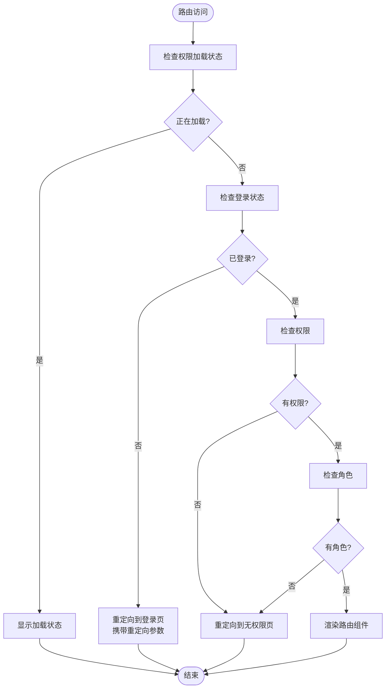

# 状态管理与认证机制

<cite>
**本文档引用的文件**   
- [AuthContext.tsx](file://frontend/src/contexts/AuthContext.tsx)
- [Authorized.tsx](file://frontend/src/components/Authorized.tsx)
- [AuthorizedRoute.tsx](file://frontend/src/components/AuthorizedRoute.tsx)
- [auth.ts](file://frontend/src/services/auth.ts)
- [App.tsx](file://frontend/src/App.tsx)
- [router.tsx](file://frontend/src/router.tsx)
- [auth.service.ts](file://backend/src/modules/auth/auth.service.ts)
- [auth.controller.ts](file://backend/src/modules/auth/auth.controller.ts)
- [api.ts](file://frontend/src/services/api.ts)
</cite>

## 目录
1. [项目结构](#项目结构)
2. [核心组件](#核心组件)
3. [架构概览](#架构概览)
4. [详细组件分析](#详细组件分析)
5. [依赖分析](#依赖分析)
6. [性能考量](#性能考量)
7. [故障排除指南](#故障排除指南)
8. [结论](#结论)

## 项目结构

项目采用前后端分离架构，前端位于`frontend`目录，后端位于`backend`目录。前端使用React框架，通过Context API实现状态管理，后端使用NestJS框架提供RESTful API服务。

**图示来源**
- [AuthContext.tsx](file://frontend/src/contexts/AuthContext.tsx)
- [Authorized.tsx](file://frontend/src/components/Authorized.tsx)
- [AuthorizedRoute.tsx](file://frontend/src/components/AuthorizedRoute.tsx)
- [auth.ts](file://frontend/src/services/auth.ts)
- [auth.service.ts](file://backend/src/modules/auth/auth.service.ts)
- [auth.controller.ts](file://backend/src/modules/auth/auth.controller.ts)

**本节来源**
- [AuthContext.tsx](file://frontend/src/contexts/AuthContext.tsx)
- [auth.service.ts](file://backend/src/modules/auth/auth.service.ts)

## 核心组件

系统的核心认证组件包括AuthContext、Authorized、AuthorizedRoute和auth服务。AuthContext使用React Context API管理用户认证状态，提供全局访问的认证信息。Authorized组件用于实现基于角色或权限的细粒度访问控制，支持按钮级别的权限判断。AuthorizedRoute组件则负责路由级别的权限控制，确保只有授权用户才能访问特定页面。auth服务封装了与后端API的交互，处理登录、登出和令牌管理等核心功能。

**本节来源**
- [AuthContext.tsx](file://frontend/src/contexts/AuthContext.tsx#L1-L122)
- [Authorized.tsx](file://frontend/src/components/Authorized.tsx#L1-L103)
- [AuthorizedRoute.tsx](file://frontend/src/components/AuthorizedRoute.tsx#L1-L70)
- [auth.ts](file://frontend/src/services/auth.ts#L1-L187)

## 架构概览

系统采用分层架构设计，从前端到后端形成完整的认证与权限控制体系。前端通过AuthContext提供全局状态管理，Authorized和AuthorizedRoute组件实现不同粒度的权限控制。auth服务层负责与后端API通信，处理认证相关的网络请求。后端通过NestJS的Guard机制实现JWT认证和角色权限验证。

**图示来源**
- [AuthContext.tsx](file://frontend/src/contexts/AuthContext.tsx)
- [AuthorizedRoute.tsx](file://frontend/src/components/AuthorizedRoute.tsx)
- [auth.ts](file://frontend/src/services/auth.ts)
- [auth.controller.ts](file://backend/src/modules/auth/auth.controller.ts)
- [auth.service.ts](file://backend/src/modules/auth/auth.service.ts)

## 详细组件分析

### AuthContext分析

AuthContext是前端认证状态管理的核心，使用React Context API实现跨组件状态共享。它维护用户信息、权限列表和加载状态，并提供登录、登出等操作方法。

**图示来源**
- [AuthContext.tsx](file://frontend/src/contexts/AuthContext.tsx#L1-L122)

**本节来源**
- [AuthContext.tsx](file://frontend/src/contexts/AuthContext.tsx#L1-L122)

### Authorized组件分析

Authorized组件实现基于角色或权限的细粒度访问控制，支持在组件级别进行权限判断。它提供两种使用方式：作为容器组件包装受保护内容，或作为AuthorizedButton用于按钮级别的权限控制。

**图示来源**
- [Authorized.tsx](file://frontend/src/components/Authorized.tsx#L1-L103)

**本节来源**
- [Authorized.tsx](file://frontend/src/components/Authorized.tsx#L1-L103)

### AuthorizedRoute组件分析

AuthorizedRoute组件负责路由级别的权限控制，集成在React Router系统中。它在用户访问受保护路由时进行权限验证，根据结果决定是渲染目标组件还是重定向到登录或无权限页面。

**图示来源**
- [AuthorizedRoute.tsx](file://frontend/src/components/AuthorizedRoute.tsx#L1-L70)

**本节来源**
- [AuthorizedRoute.tsx](file://frontend/src/components/AuthorizedRoute.tsx#L1-L70)
- [App.tsx](file://frontend/src/App.tsx#L1-L234)

### auth服务分析

auth服务封装了与后端认证API的交互，处理令牌管理、用户状态持久化等核心功能。它提供getToken、setToken、removeToken等方法管理JWT令牌，并实现isLoggedIn、isTokenExpired等工具函数。

**图示来源**
- [auth.ts](file://frontend/src/services/auth.ts#L1-L187)

**本节来源**
- [auth.ts](file://frontend/src/services/auth.ts#L1-L187)

## 依赖分析

系统各组件之间存在明确的依赖关系。前端组件依赖AuthContext提供的认证状态，AuthContext依赖auth服务与后端API通信。后端AuthController依赖AuthService实现业务逻辑，AuthService依赖JwtService生成和验证JWT令牌。

**图示来源**
- [App.tsx](file://frontend/src/App.tsx)
- [AuthContext.tsx](file://frontend/src/contexts/AuthContext.tsx)
- [auth.ts](file://frontend/src/services/auth.ts)
- [auth.controller.ts](file://backend/src/modules/auth/auth.controller.ts)
- [auth.service.ts](file://backend/src/modules/auth/auth.service.ts)

**本节来源**
- [App.tsx](file://frontend/src/App.tsx#L1-L234)
- [AuthContext.tsx](file://frontend/src/contexts/AuthContext.tsx#L1-L122)
- [auth.ts](file://frontend/src/services/auth.ts#L1-L187)

## 性能考量

系统在认证和权限控制方面考虑了多项性能优化措施。首先，使用localStorage和Cookie持久化用户状态，避免每次访问都重新登录。其次，权限信息在用户登录时一次性获取并缓存，减少后续请求的开销。此外，系统实现了令牌自动刷新机制，避免因令牌过期导致的用户体验中断。

在异常处理方面，系统对401未授权错误进行全局拦截，自动清除本地状态并重定向到登录页面。对于并发请求的令牌同步问题，通过在axios拦截器中统一管理Authorization头，确保所有请求使用最新的有效令牌。

## 故障排除指南

### 令牌过期处理

当JWT令牌过期时，系统会自动处理并重定向用户到登录页面。前端通过isTokenExpired函数检查令牌有效性，后端通过JwtAuthGuard验证请求的认证状态。

**本节来源**
- [api.ts](file://frontend/src/services/api.ts#L71-L74)
- [auth.ts](file://frontend/src/services/auth.ts#L49-L64)

### 并发请求令牌同步

系统通过全局管理Authorization头来解决并发请求的令牌同步问题。当用户登录或令牌刷新时，auth服务会更新axios的默认请求头，确保所有后续请求使用最新的令牌。

**本节来源**
- [auth.ts](file://frontend/src/services/auth.ts#L34-L47)

## 结论

本系统实现了完整的前端认证与权限控制体系，通过AuthContext、Authorized、AuthorizedRoute和auth服务等组件协同工作，提供了安全可靠的用户认证和细粒度的权限管理。系统采用JWT令牌进行状态管理，结合localStorage和Cookie实现登录状态持久化，并通过全局拦截器处理令牌过期等异常情况。整体架构清晰，组件职责明确，为应用的安全性提供了有力保障。