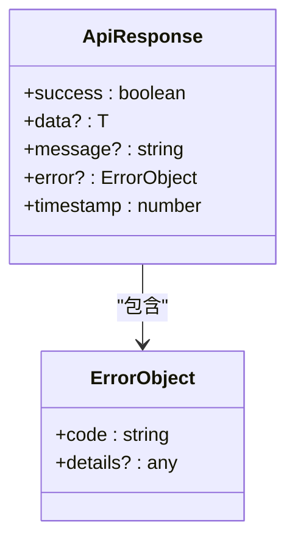
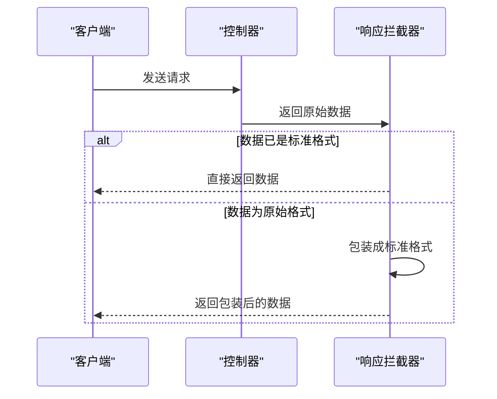
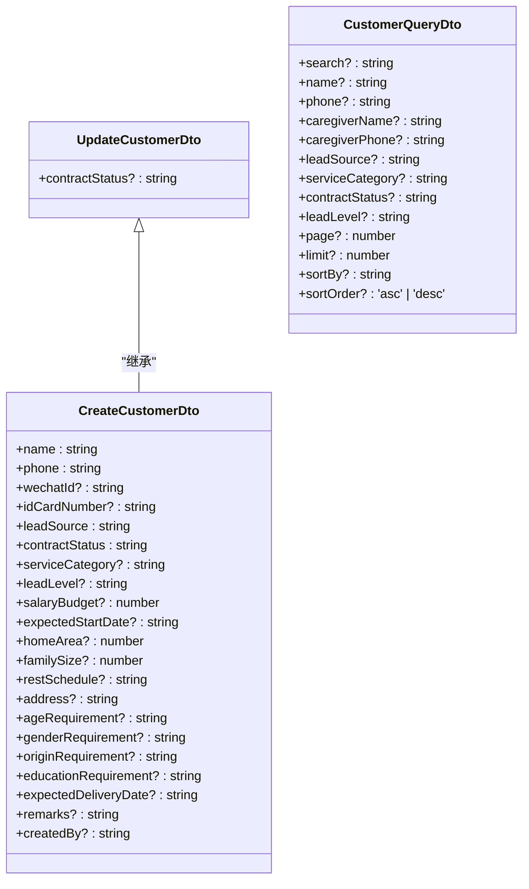
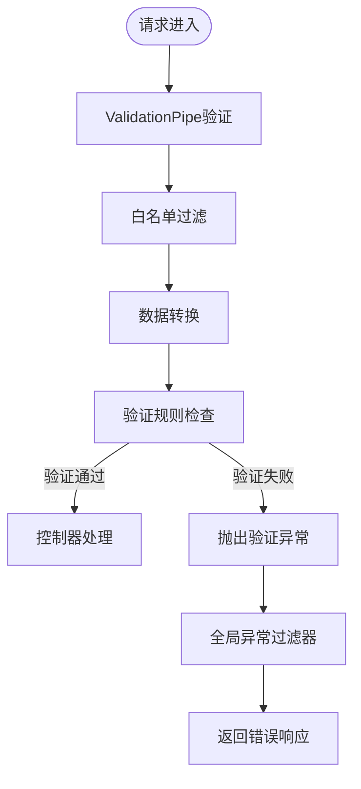
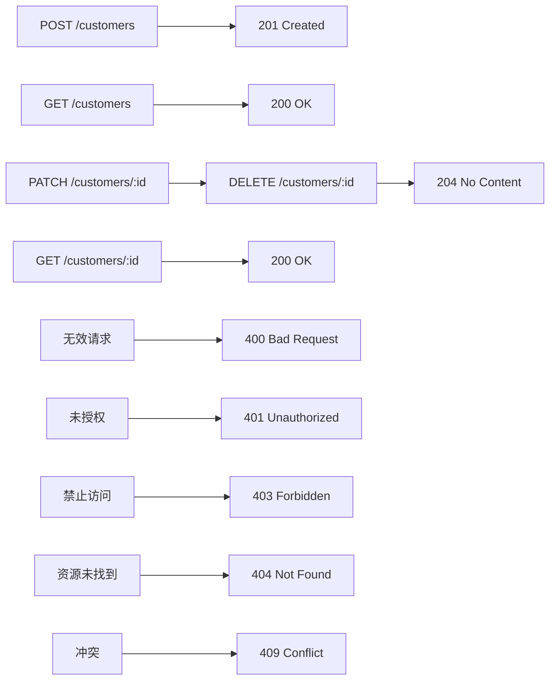
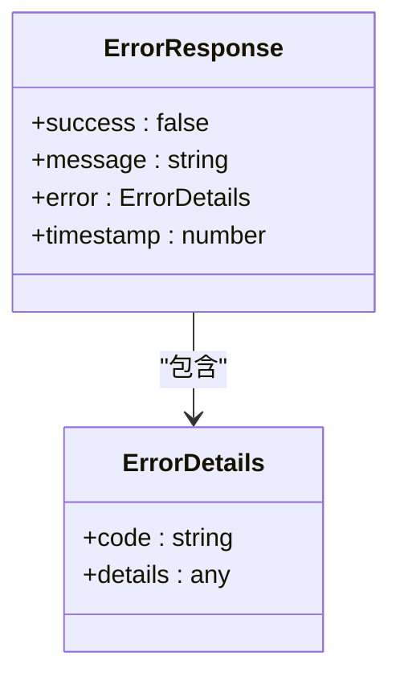

# API设计规范

<cite>
**本文档引用的文件**
- [api-response.interface.ts](file://backend/src/common/interfaces/api-response.interface.ts)
- [api-response.interceptor.ts](file://backend/src/common/interceptors/api-response.interceptor.ts)
- [customers.controller.ts](file://backend/src/modules/customers/customers.controller.ts)
- [http-exception.filter.ts](file://backend/src/common/filters/http-exception.filter.ts)
- [create-customer.dto.ts](file://backend/src/modules/customers/dto/create-customer.dto.ts)
- [update-customer.dto.ts](file://backend/src/modules/customers/dto/update-customer.dto.ts)
- [customer-query.dto.ts](file://backend/src/modules/customers/dto/customer-query.dto.ts)
- [main.ts](file://backend/src/main.ts)
</cite>

## 目录
1. [API响应标准化结构](#api响应标准化结构)
2. [DTO与请求数据验证](#dto与请求数据验证)
3. [ValidationPipe验证机制](#validationpipe验证机制)
4. [HTTP状态码使用准则](#http状态码使用准则)
5. [错误响应格式](#错误响应格式)
6. [API版本控制策略](#api版本控制策略)
7. [新API端点创建模板](#新api端点创建模板)

## API响应标准化结构

本项目采用统一的API响应结构，确保所有成功响应具有一致的数据格式。该结构由`ApiResponse`接口定义，并通过`ApiResponseInterceptor`拦截器自动应用。



**图示来源**
- [api-response.interface.ts](file://backend/src/common/interfaces/api-response.interface.ts#L1-L10)

**响应结构说明：**
- **success**: 布尔值，表示请求是否成功
- **data**: 泛型类型，包含实际的响应数据
- **message**: 字符串，提供操作结果的描述信息
- **error**: 错误对象，仅在失败时存在
- **timestamp**: 数字，记录响应生成的时间戳

`ApiResponseInterceptor`拦截器会自动将控制器返回的数据包装成此标准格式。如果数据已经是标准格式，则直接返回；否则，将其包装为成功响应。



**图示来源**
- [api-response.interceptor.ts](file://backend/src/common/interceptors/api-response.interceptor.ts#L1-L23)

**本节来源**
- [api-response.interface.ts](file://backend/src/common/interfaces/api-response.interface.ts#L1-L10)
- [api-response.interceptor.ts](file://backend/src/common/interceptors/api-response.interceptor.ts#L1-L23)

## DTO与请求数据验证

数据传输对象（DTO）用于定义API请求的数据结构和验证规则。在`customers.controller.ts`等控制器中，DTO通过`@Body()`装饰器接收请求数据，并确保数据的类型安全和有效性。



**图示来源**
- [create-customer.dto.ts](file://backend/src/modules/customers/dto/create-customer.dto.ts#L1-L116)
- [update-customer.dto.ts](file://backend/src/modules/customers/dto/update-customer.dto.ts#L1-L10)
- [customer-query.dto.ts](file://backend/src/modules/customers/dto/customer-query.dto.ts#L1-L63)

**主要DTO类型：**
- **CreateCustomerDto**: 用于创建客户，包含所有必填和可选字段
- **UpdateCustomerDto**: 用于更新客户，继承自CreateCustomerDto但所有字段可选
- **CustomerQueryDto**: 用于客户查询，支持分页、排序和多种搜索条件

**本节来源**
- [customers.controller.ts](file://backend/src/modules/customers/customers.controller.ts#L1-L145)
- [create-customer.dto.ts](file://backend/src/modules/customers/dto/create-customer.dto.ts#L1-L116)
- [update-customer.dto.ts](file://backend/src/modules/customers/dto/update-customer.dto.ts#L1-L10)
- [customer-query.dto.ts](file://backend/src/modules/customers/dto/customer-query.dto.ts#L1-L63)

## ValidationPipe验证机制

系统使用NestJS的`ValidationPipe`进行DTO验证。在`main.ts`中，通过`app.useGlobalPipes()`全局启用验证管道，确保所有请求数据都经过验证。



**图示来源**
- [main.ts](file://backend/src/main.ts#L33-L67)

**验证配置：**
- **whitelist: true**: 自动去除不在DTO定义中的属性
- **transform: true**: 自动将请求数据转换为DTO类型
- **forbidNonWhitelisted: false**: 暂时禁用非白名单属性的禁止（调试模式）
- **skipMissingProperties: true**: 跳过缺失属性的验证
- **disableErrorMessages: false**: 显示详细的错误信息

当请求数据不符合DTO定义时，`ValidationPipe`会自动抛出异常，该异常会被`HttpExceptionFilter`捕获并转换为标准的错误响应格式。

**本节来源**
- [main.ts](file://backend/src/main.ts#L33-L67)

## HTTP状态码使用准则

项目遵循RESTful API的最佳实践，使用标准的HTTP状态码来表示请求结果。



**图示来源**
- [customers.controller.ts](file://backend/src/modules/customers/customers.controller.ts#L38-L73)
- [http-exception.filter.ts](file://backend/src/common/filters/http-exception.filter.ts#L1-L31)

**具体使用规则：**
- **201 Created**: 用于`POST`请求成功创建资源，如`customers.controller.ts`中的`create`方法
- **200 OK**: 用于`GET`、`PUT`、`PATCH`请求成功，返回操作结果
- **204 No Content**: 用于`DELETE`请求成功，不返回响应体
- **400 Bad Request**: 请求数据无效或格式错误
- **401 Unauthorized**: 未提供或无效的身份验证
- **403 Forbidden**: 有身份验证但权限不足
- **404 Not Found**: 请求的资源不存在
- **409 Conflict**: 请求与现有资源冲突，如手机号重复

**本节来源**
- [customers.controller.ts](file://backend/src/modules/customers/customers.controller.ts#L38-L73)
- [http-exception.filter.ts](file://backend/src/common/filters/http-exception.filter.ts#L1-L31)

## 错误响应格式

错误响应格式与成功响应保持一致，遵循`ApiResponse`接口定义。`HttpExceptionFilter`全局异常过滤器负责将所有异常转换为标准的错误响应。



**图示来源**
- [http-exception.filter.ts](file://backend/src/common/filters/http-exception.filter.ts#L1-L31)

**错误响应结构：**
- **success**: 始终为`false`
- **message**: 错误的简要描述
- **error**: 包含错误代码和详细信息的对象
- **timestamp**: 错误发生的时间戳

错误代码采用`HTTP_状态码`的格式，如`HTTP_400`、`HTTP_404`等。异常过滤器还会记录错误日志，包括请求方法、URL、状态码和堆栈信息。

**本节来源**
- [http-exception.filter.ts](file://backend/src/common/filters/http-exception.filter.ts#L1-L31)

## API版本控制策略

当前项目采用基于URL前缀的简单版本控制策略。在`main.ts`中，通过`app.setGlobalPrefix('api')`设置全局API前缀。

```mermaid
flowchart LR
A[客户端请求] --> B[API网关]
B --> C[/api/v1/customers]
B --> D[/api/v2/customers]
C --> E[版本1控制器]
D --> F[版本2控制器]
```

**图示来源**
- [main.ts](file://backend/src/main.ts#L33-L67)

虽然当前代码中只设置了`api`前缀，但该设计为未来的版本控制提供了基础。可以通过以下方式实现版本控制：
- `/api/v1/customers` - 第一版API
- `/api/v2/customers` - 第二版API

这种策略允许新旧版本API共存，便于逐步迁移和向后兼容。

**本节来源**
- [main.ts](file://backend/src/main.ts#L33-L67)

## 新API端点创建模板

创建新API端点时应遵循以下模板和审查清单，确保代码质量和一致性。

```typescript
import {
  Controller,
  Get,
  Post,
  Body,
  Patch,
  Param,
  Delete,
  Query,
  UseGuards,
  Request,
  HttpStatus,
  HttpCode,
} from '@nestjs/common';
import { YourService } from './your.service';
import { CreateYourDto } from './dto/create-your.dto';
import { UpdateYourDto } from './dto/update-your.dto';
import { YourQueryDto } from './dto/your-query.dto';
import { JwtAuthGuard } from '../auth/guards/jwt-auth.guard';
import { ApiResponse } from '../../common/interfaces/api-response.interface';

@Controller('your-resource')
@UseGuards(JwtAuthGuard)
export class YourController {
  constructor(private readonly yourService: YourService) {}

  // 辅助方法：生成统一格式的API响应
  private createResponse(success: boolean, message: string, data?: any, error?: any): ApiResponse {
    return {
      success,
      message,
      data,
      error,
      timestamp: Date.now(),
    };
  }

  @Post()
  @HttpCode(HttpStatus.CREATED)
  async create(
    @Body() createYourDto: CreateYourDto,
    @Request() req,
  ): Promise<ApiResponse> {
    try {
      const resource = await this.yourService.create(
        createYourDto,
        req.user.userId,
      );
      return this.createResponse(true, '资源创建成功', resource);
    } catch (error) {
      return this.createResponse(false, error.message || '资源创建失败', null, error.message);
    }
  }

  @Get()
  async findAll(@Query() query: YourQueryDto): Promise<ApiResponse> {
    try {
      const result = await this.yourService.findAll(query);
      return this.createResponse(true, '资源列表获取成功', result);
    } catch (error) {
      return this.createResponse(false, '资源列表获取失败', null, error.message);
    }
  }

  @Get(':id')
  async findOne(@Param('id') id: string): Promise<ApiResponse> {
    try {
      const resource = await this.yourService.findOne(id);
      return this.createResponse(true, '资源详情获取成功', resource);
    } catch (error) {
      return this.createResponse(false, '资源详情获取失败', null, error.message);
    }
  }

  @Patch(':id')
  async update(
    @Param('id') id: string,
    @Body() updateYourDto: UpdateYourDto,
    @Request() req,
  ): Promise<ApiResponse> {
    try {
      const resource = await this.yourService.update(id, updateYourDto, req.user.userId);
      return this.createResponse(true, '资源信息更新成功', resource);
    } catch (error) {
      return this.createResponse(false, '资源信息更新失败', null, error.message);
    }
  }

  @Delete(':id')
  @HttpCode(HttpStatus.NO_CONTENT)
  async remove(@Param('id') id: string): Promise<ApiResponse> {
    try {
      await this.yourService.remove(id);
      return this.createResponse(true, '资源删除成功');
    } catch (error) {
      return this.createResponse(false, '资源删除失败', null, error.message);
    }
  }
}
```

### 审查清单
- [ ] 使用`@Controller`装饰器定义路由前缀
- [ ] 使用`@UseGuards(JwtAuthGuard)`确保身份验证
- [ ] 为每个方法实现统一的响应格式
- [ ] 使用适当的HTTP状态码（`201`用于创建，`204`用于删除）
- [ ] 实现完整的CRUD操作（如适用）
- [ ] 使用DTO进行请求数据验证
- [ ] 在服务层处理业务逻辑
- [ ] 正确处理异常并返回标准错误响应
- [ ] 添加必要的注释和文档

**本节来源**
- [customers.controller.ts](file://backend/src/modules/customers/customers.controller.ts#L1-L145)
- [create-customer.dto.ts](file://backend/src/modules/customers/dto/create-customer.dto.ts#L1-L116)
- [main.ts](file://backend/src/main.ts#L33-L67)