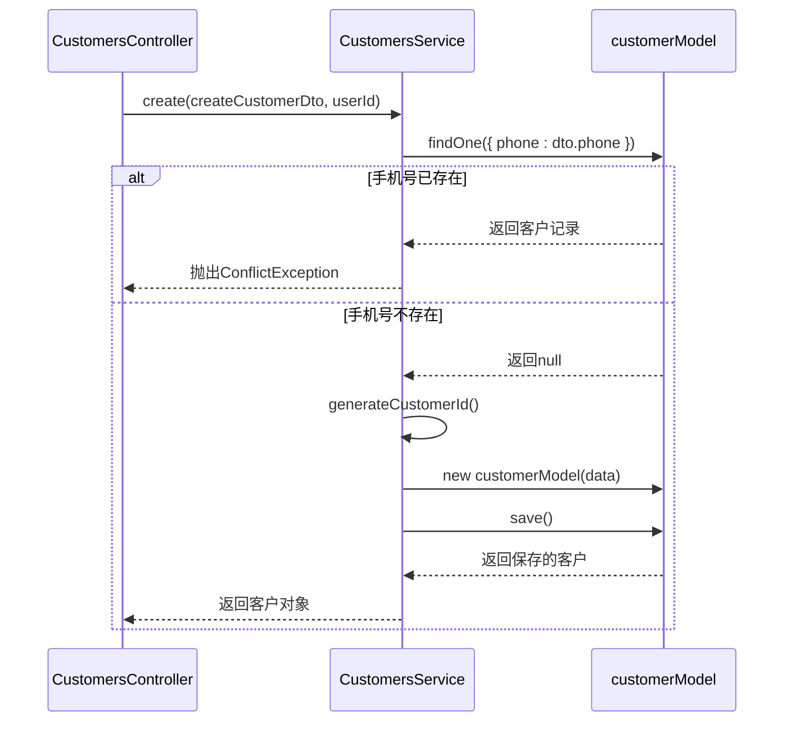
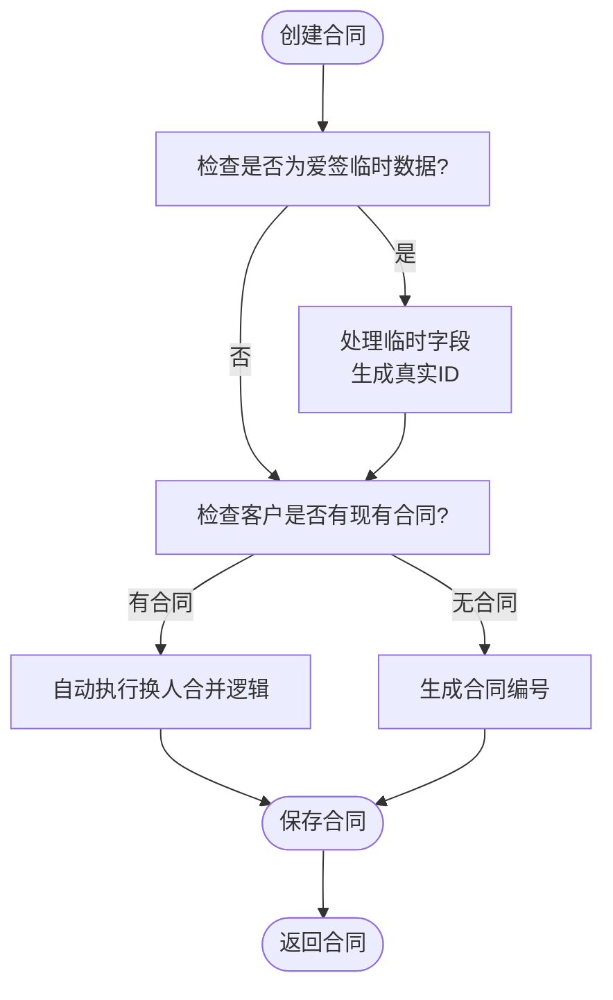
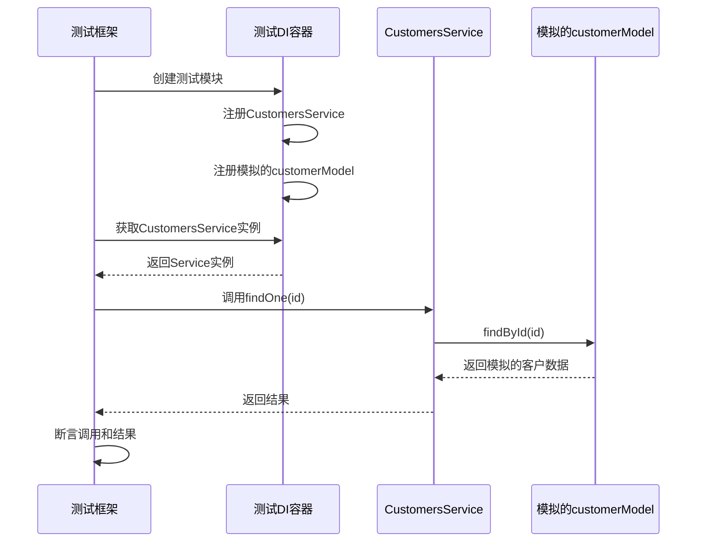

# 依赖注入系统

<cite>
**本文档引用的文件**
- [customers.service.ts](file://backend/src/modules/customers/customers.service.ts)
- [contracts.service.ts](file://backend/src/modules/contracts/contracts.service.ts)
- [customers.module.ts](file://backend/src/modules/customers/customers.module.ts)
- [contracts.module.ts](file://backend/src/modules/contracts/contracts.module.ts)
- [upload.service.ts](file://backend/src/modules/upload/upload.service.ts)
- [cos.service.ts](file://backend/src/modules/upload/cos.service.ts)
- [tencent-ocr.service.ts](file://backend/src/modules/ocr/tencent-ocr.service.ts)
- [customers.service.spec.ts](file://backend/src/modules/customers/__tests__/customers.service.spec.ts)
</cite>

## 目录
1. [引言](#引言)
2. [项目结构与依赖注入概览](#项目结构与依赖注入概览)
3. [核心服务分析：CustomersService](#核心服务分析：customersservice)
4. [核心服务分析：ContractsService](#核心服务分析：contractsservice)
5. [模块配置与Providers数组](#模块配置与providers数组)
6. [依赖注入的实现机制](#依赖注入的实现机制)
7. [服务生命周期与单例模式](#服务生命周期与单例模式)
8. [可测试性与单元测试](#可测试性与单元测试)
9. [编码规范与最佳实践](#编码规范与最佳实践)
10. [结论](#结论)

## 引言
本文档深入解析本项目中NestJS框架的依赖注入（Dependency Injection, DI）机制。通过分析`customers.service.ts`和`contracts.service.ts`两个核心服务，详细阐述了服务如何通过构造函数注入其他服务（如数据库模型、上传服务、OCR服务）来实现松耦合的设计。文档将解释`providers`数组在模块中的作用，`@Injectable()`装饰器如何标记可注入类，并分析DI容器如何管理服务的生命周期（单例模式），从而提升代码的可测试性。最后，文档将提供在新服务中正确使用依赖注入的编码规范和常见陷阱规避指南。

## 项目结构与依赖注入概览
本项目采用NestJS框架，其核心架构基于依赖注入和模块化设计。后端代码位于`backend/src`目录下，按照功能划分为多个模块（如`customers`、`contracts`、`upload`、`ocr`等）。每个模块（Module）包含控制器（Controller）、服务（Service）和数据模型（Model）。依赖注入是连接这些组件的粘合剂，它允许服务之间通过构造函数声明其依赖，由NestJS的DI容器自动解析和注入。

```mermaid
graph TB
subgraph "模块 (Module)"
A[控制器 (Controller)]
B[服务 (Service)]
C[数据模型 (Model)]
end
D[DI容器] --> A
D --> B
D --> C
B --> |注入| E[其他服务]
B --> |注入| F[数据库模型]
```

**Diagram sources**
- [customers.module.ts](file://backend/src/modules/customers/customers.module.ts)
- [contracts.module.ts](file://backend/src/modules/contracts/contracts.module.ts)

## 核心服务分析：CustomersService
`CustomersService`是客户管理模块的核心业务逻辑层。它通过依赖注入获取了与客户相关的数据库模型。

**Section sources**
- [customers.service.ts](file://backend/src/modules/customers/customers.service.ts)

### 依赖注入的实现
在`customers.service.ts`中，`CustomersService`类使用`@Injectable()`装饰器进行标记，使其成为可被DI容器管理的提供者（Provider）。

```typescript
@Injectable()
export class CustomersService {
  constructor(
    @InjectModel(Customer.name) private customerModel: Model<CustomerDocument>,
    @InjectModel('User') private userModel: Model<User>,
    @InjectModel(CustomerFollowUp.name) private customerFollowUpModel: Model<CustomerFollowUp>,
  ) {}
  // ... 业务方法
}
```

- **`@Injectable()`**: 该装饰器告诉NestJS的DI容器，`CustomersService`是一个可以被注入到其他组件（如控制器）中的服务。
- **构造函数注入**: 服务的依赖（`customerModel`, `userModel`, `customerFollowUpModel`）通过构造函数参数声明。DI容器在创建`CustomersService`实例时，会自动查找并注入这些依赖。
- **`@InjectModel()`**: 这是一个自定义装饰器，用于从Mongoose模块中注入特定的数据库模型。它确保了服务与数据库模型之间的松耦合，服务无需关心模型的创建过程。

### 服务功能
该服务提供了创建客户、查询客户列表、获取客户详情、更新客户信息等核心功能。例如，`create`方法在创建新客户前会检查手机号是否已存在，体现了业务逻辑的封装。



**Diagram sources**
- [customers.service.ts](file://backend/src/modules/customers/customers.service.ts#L40-L75)

## 核心服务分析：ContractsService
`ContractsService`负责合同的创建、查询和管理，其依赖注入模式与`CustomersService`类似，但逻辑更为复杂。

**Section sources**
- [contracts.service.ts](file://backend/src/modules/contracts/contracts.service.ts)

### 依赖注入的实现
`ContractsService`同样使用`@Injectable()`装饰器，并通过构造函数注入了`contractModel`和`customerContractHistoryModel`。

```typescript
@Injectable()
export class ContractsService {
  constructor(
    @InjectModel(Contract.name) private contractModel: Model<ContractDocument>,
    @InjectModel(CustomerContractHistory.name) private customerContractHistoryModel: Model<CustomerContractHistoryDocument>,
  ) {}
  // ... 业务方法
}
```

### 服务功能与复杂逻辑
`ContractsService`的`create`方法包含了复杂的业务逻辑：
1.  **自动换人模式**: 通过`customerPhone`检查客户是否已有合同，如果存在，则自动进入“换人合并模式”。
2.  **爱签数据同步**: 处理来自外部系统（爱签）的合同数据，将临时ID（如`'temp'`）替换为系统内的真实ID。
3.  **合同编号生成**: 自动生成唯一的合同编号。

这表明，一个服务可以注入多个模型，并在业务逻辑中协调它们。



**Diagram sources**
- [contracts.service.ts](file://backend/src/modules/contracts/contracts.service.ts#L20-L100)

## 模块配置与Providers数组
在NestJS中，模块（Module）是组织代码的基本单元。`providers`数组是模块配置中至关重要的部分，它定义了该模块提供的所有可注入的服务。

**Section sources**
- [customers.module.ts](file://backend/src/modules/customers/customers.module.ts)
- [contracts.module.ts](file://backend/src/modules/contracts/contracts.module.ts)

### CustomersModule 配置
```typescript
@Module({
  imports: [
    MongooseModule.forFeature([
      { name: Customer.name, schema: CustomerSchema },
      { name: CustomerFollowUp.name, schema: CustomerFollowUpSchema },
      { name: 'User', schema: UserSchema }
    ]),
  ],
  controllers: [CustomersController],
  providers: [CustomersService], // 声明CustomersService为提供者
  exports: [CustomersService],   // 允许其他模块导入此服务
})
export class CustomersModule {}
```
- **`providers: [CustomersService]`**: 这行代码将`CustomersService`注册到`CustomersModule`的DI容器中。这意味着`CustomersController`可以注入`CustomersService`，并且其他模块在导入`CustomersModule`后，也可以使用`CustomersService`（因为`exports`数组中也导出了它）。

### ContractsModule 配置
```typescript
@Module({
  imports: [
    MongooseModule.forFeature([...]),
    ESignModule, // 导入ESignModule以使用其服务
  ],
  controllers: [ContractsController, TestController],
  providers: [ContractsService],
  exports: [ContractsService],
})
export class ContractsModule {}
```
- **`imports: [ESignModule]`**: `ContractsModule`导入了`ESignModule`。这意味着`ContractsService`可以直接注入`ESignModule`中提供的任何服务（例如，用于电子签名的服务），实现了模块间的依赖。

## 依赖注入的实现机制
NestJS的依赖注入机制基于TypeScript的反射元数据（Reflection Metadata）和装饰器。

**Section sources**
- [customers.service.ts](file://backend/src/modules/customers/customers.service.ts)
- [upload.service.ts](file://backend/src/modules/upload/upload.service.ts)

### 可注入类的标记
`@Injectable()`装饰器是启用依赖注入的第一步。它为类添加了元数据，使NestJS的DI容器能够识别该类。

### 构造函数注入
当一个组件（如服务或控制器）需要另一个服务时，它通过构造函数来声明依赖。DI容器在实例化该组件时，会检查其构造函数的参数类型，并在容器中查找匹配的提供者。

#### 服务间依赖注入示例
`UploadService`不仅注入了数据库模型，还注入了另一个服务`CosService`，这展示了服务间的依赖。

```typescript
@Injectable()
export class UploadService {
  constructor(private readonly cosService: CosService) {} // 注入另一个服务

  async uploadFile(file: Express.Multer.File): Promise<string> {
    const key = this.cosService.generateFileKey(...); // 使用注入的服务
    return await this.cosService.uploadFile(file, key);
  }
}
```

```mermaid
classDiagram
class UploadService {
+uploadFile(file) : Promise~string~
+getFile(fileUrl) : Promise~{url, metadata}~
+deleteFile(fileUrl) : Promise~void~
}
class CosService {
+generateFileKey(filename, type) : string
+uploadFile(file, key) : Promise~string~
+getFileInfo(key) : Promise~any~
+getSignedUrl(key) : Promise~string~
+deleteFile(key) : Promise~void~
}
UploadService --> CosService : "依赖"
```

**Diagram sources**
- [upload.service.ts](file://backend/src/modules/upload/upload.service.ts#L10-L20)
- [cos.service.ts](file://backend/src/modules/upload/cos.service.ts)

### 上传与OCR服务的注入
虽然`customers.service.ts`和`contracts.service.ts`没有直接注入`UploadService`或`OcrService`，但根据项目结构，其他模块（如简历模块）会这样做。`OcrModule`的配置如下：
```typescript
@Module({
  imports: [ConfigModule],
  providers: [TencentOcrService, OcrMetricsService],
  exports: [TencentOcrService]
})
export class OcrModule {}
```
`TencentOcrService`本身也通过构造函数注入了`ConfigService`和`OcrMetricsService`，形成了一个依赖链。

## 服务生命周期与单例模式
在NestJS中，所有通过`providers`数组注册的服务默认都是**单例（Singleton）**的。

**Section sources**
- [app.module.ts](file://backend/src/app.module.ts)

### 单例模式
这意味着在整个应用程序的生命周期内，DI容器只为每个服务类创建一个实例。当多个组件请求同一个服务时，它们都获得对同一个实例的引用。

- **优点**:
  1.  **性能**: 避免了重复创建实例的开销。
  2.  **状态共享**: 服务可以持有状态（如缓存、连接池），这些状态在所有使用者之间共享。
  3.  **内存效率**: 减少了内存占用。

- **实现**: DI容器在应用启动时扫描所有模块的`providers`数组，为每个服务创建一个实例并将其存储在内部的“容器”中。后续的注入请求都返回这个唯一的实例。

## 可测试性与单元测试
依赖注入极大地提升了代码的可测试性。通过将依赖项从服务内部解耦，我们可以在测试时轻松地用模拟对象（Mock）替换真实的依赖。

**Section sources**
- [customers.service.spec.ts](file://backend/src/modules/customers/__tests__/customers.service.spec.ts)

### 单元测试中的模拟
在`customers.service.spec.ts`中，测试使用`Test.createTestingModule`创建一个测试模块，并通过`providers`数组配置了`CustomersService`和一个模拟的`customerModel`。

```typescript
const module: TestingModule = await Test.createTestingModule({
  providers: [
    CustomersService,
    {
      provide: getModelToken(Customer.name), // 指定要模拟的提供者
      useValue: jest.fn().mockImplementation(() => ({ // 提供模拟的实现
        ...mockCustomer,
        save: jest.fn().mockResolvedValue(mockCustomer),
      })),
    },
  ],
}).compile();

const service = module.get<CustomersService>(CustomersService); // 从测试容器获取服务
```

- **`provide`**: 指定要替换的提供者令牌（Token），这里是`getModelToken(Customer.name)`，对应数据库模型。
- **`useValue`**: 提供一个模拟的实现，这里是一个Jest模拟函数，其行为（如`save`方法）可以被预设和断言。
- **测试验证**: 测试用例通过`expect(mockModel.findById).toHaveBeenCalledWith(...)`来验证`CustomersService`的方法是否正确地调用了数据库模型的方法，而无需连接真实的数据库。



**Diagram sources**
- [customers.service.spec.ts](file://backend/src/modules/customers/__tests__/customers.service.spec.ts#L43-L90)

## 编码规范与最佳实践
为了在新服务中正确使用依赖注入并避免常见陷阱，请遵循以下指南：

**Section sources**
- [customers.service.ts](file://backend/src/modules/customers/customers.service.ts)
- [contracts.service.ts](file://backend/src/modules/contracts/contracts.service.ts)

### 编码规范
1.  **使用`@Injectable()`**: 为所有服务类添加`@Injectable()`装饰器。
2.  **构造函数注入**: 优先使用构造函数注入依赖，而不是属性注入，以保证依赖的不可变性和清晰性。
3.  **明确依赖**: 在构造函数中清晰地声明所有依赖项。
4.  **模块化**: 将相关功能组织到独立的模块中，并在`providers`数组中正确注册服务。
5.  **导出服务**: 如果一个服务需要被其他模块使用，记得在`exports`数组中导出它。

### 常见陷阱规避
1.  **循环依赖**: 避免两个模块或服务相互直接依赖。如果无法避免，考虑使用`forwardRef()`或重构代码。
2.  **忘记注册**: 确保所有服务都在某个模块的`providers`数组中注册，否则DI容器无法找到它。
3.  **过度注入**: 避免在一个服务中注入过多的依赖，这可能导致服务职责不单一（违反单一职责原则）。考虑将大服务拆分为更小的、职责明确的服务。
4.  **在构造函数中执行异步操作**: 构造函数应保持同步。如果需要异步初始化，使用`onModuleInit`生命周期钩子。

## 结论
本项目通过NestJS强大的依赖注入系统，实现了高度解耦、可维护和可测试的代码架构。`@Injectable()`装饰器和`providers`数组是配置DI的基础，而构造函数注入是实现松耦合的关键。DI容器管理的服务单例模式优化了性能和资源使用。通过在单元测试中使用模拟对象替换真实依赖，代码的可测试性得到了显著提升。遵循本文档的编码规范，可以确保新开发的服务能够无缝集成到现有的DI体系中，保持代码库的高质量和一致性。