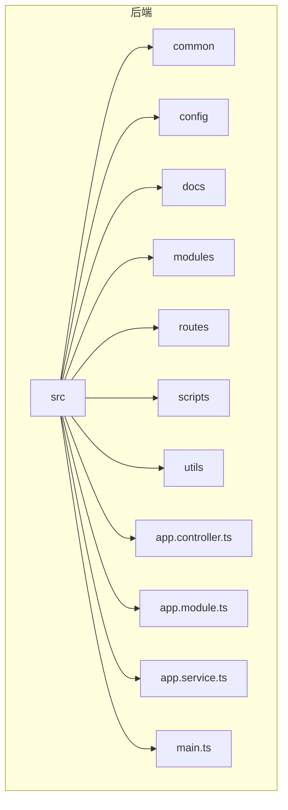
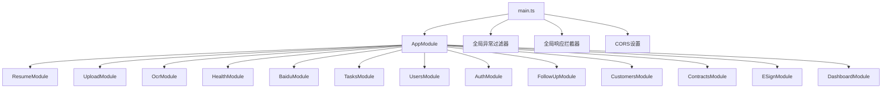
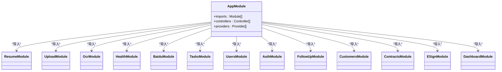
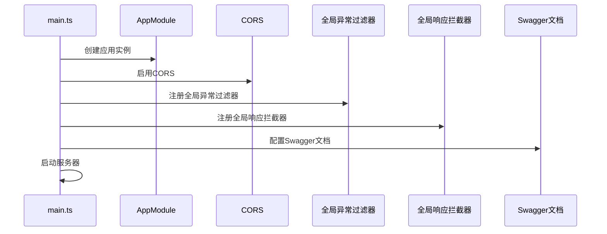
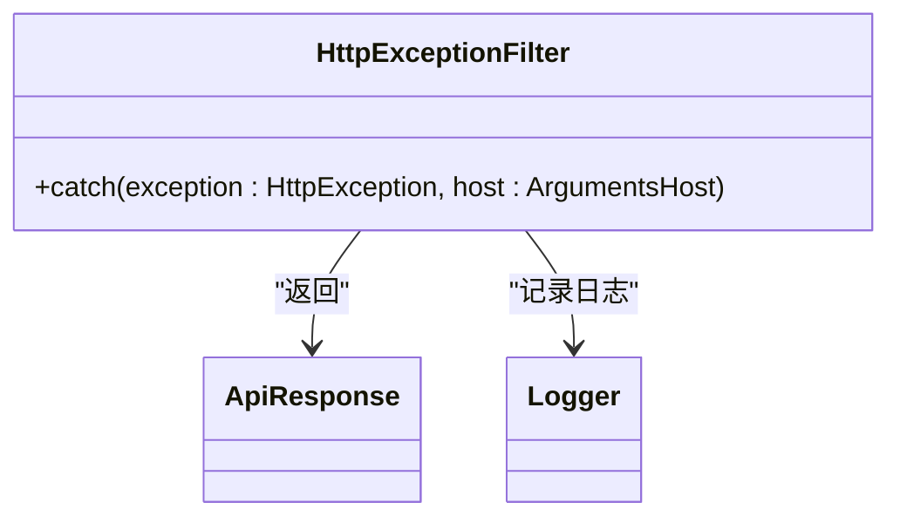
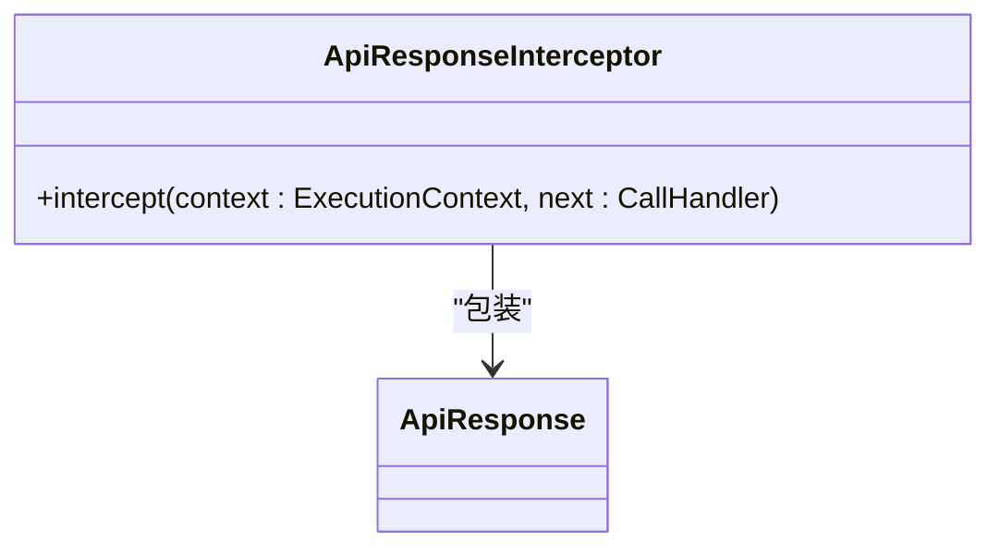
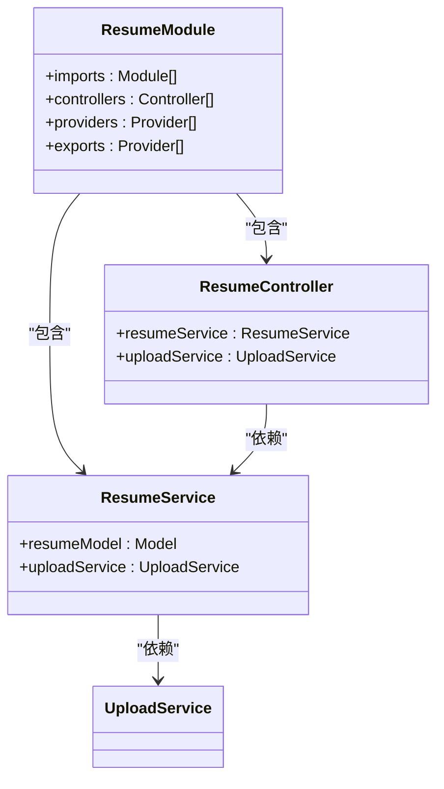
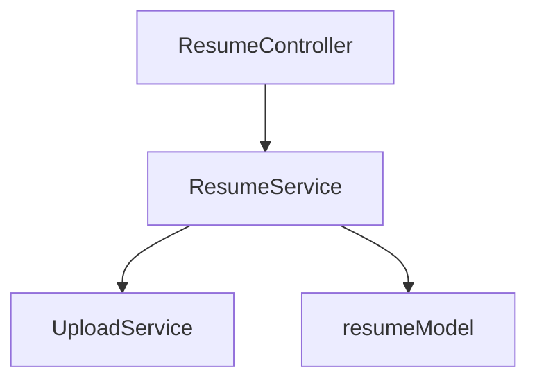

# 后端架构

<cite>
**本文档引用的文件**  
- [main.ts](file://backend/src/main.ts)
- [app.module.ts](file://backend/src/app.module.ts)
- [http-exception.filter.ts](file://backend/src/common/filters/http-exception.filter.ts)
- [api-response.interceptor.ts](file://backend/src/common/interceptors/api-response.interceptor.ts)
- [api-response.interface.ts](file://backend/src/common/interfaces/api-response.interface.ts)
- [resume.service.ts](file://backend/src/modules/resume/resume.service.ts)
- [resume.controller.ts](file://backend/src/modules/resume/resume.controller.ts)
- [resume.module.ts](file://backend/src/modules/resume/resume.module.ts)
</cite>

## 目录
1. [简介](#简介)
2. [项目结构](#项目结构)
3. [核心组件](#核心组件)
4. [架构概览](#架构概览)
5. [详细组件分析](#详细组件分析)
6. [依赖分析](#依赖分析)
7. [性能考虑](#性能考虑)
8. [故障排除指南](#故障排除指南)
9. [结论](#结论)

## 简介
本文档深入分析基于NestJS框架的后端架构，重点阐述其模块化设计和依赖注入系统。文档详细解释了主模块如何组织各个功能模块，`main.ts`中的应用初始化配置，以及控制器、服务、提供者和模块之间的关系。同时，文档还分析了全局异常处理和统一响应格式的实现机制，以及依赖注入如何提升代码的可测试性和可维护性。

## 项目结构
项目采用分层和模块化设计，后端代码位于`backend/src`目录下，主要分为`common`、`config`、`docs`、`modules`等目录。`common`目录包含全局的过滤器、拦截器和接口定义；`config`目录包含配置文件；`docs`目录包含API和数据库文档；`modules`目录包含各个功能模块。

**Diagram sources**
- [main.ts](file://backend/src/main.ts#L1-L89)
- [app.module.ts](file://backend/src/app.module.ts#L1-L55)

**Section sources**
- [main.ts](file://backend/src/main.ts#L1-L89)
- [app.module.ts](file://backend/src/app.module.ts#L1-L55)

## 核心组件
核心组件包括`main.ts`中的应用初始化配置、`app.module.ts`中的主模块定义、全局异常过滤器、全局响应拦截器和统一响应格式接口。

**Section sources**
- [main.ts](file://backend/src/main.ts#L1-L89)
- [app.module.ts](file://backend/src/app.module.ts#L1-L55)
- [http-exception.filter.ts](file://backend/src/common/filters/http-exception.filter.ts#L1-L31)
- [api-response.interceptor.ts](file://backend/src/common/interceptors/api-response.interceptor.ts#L1-L23)
- [api-response.interface.ts](file://backend/src/common/interfaces/api-response.interface.ts#L1-L9)

## 架构概览
系统采用NestJS框架，基于模块化设计和依赖注入系统。主模块`AppModule`组织各个功能模块，`main.ts`负责应用的初始化配置，包括CORS设置、全局异常过滤器、全局响应拦截器等。

**Diagram sources**
- [main.ts](file://backend/src/main.ts#L1-L89)
- [app.module.ts](file://backend/src/app.module.ts#L1-L55)

## 详细组件分析
### 主模块分析
主模块`AppModule`通过`@Module`装饰器定义，导入了各个功能模块，并声明了控制器和提供者。这种模块化设计使得代码结构清晰，易于维护和扩展。

**Diagram sources**
- [app.module.ts](file://backend/src/app.module.ts#L1-L55)

**Section sources**
- [app.module.ts](file://backend/src/app.module.ts#L1-L55)

### 应用初始化配置分析
`main.ts`文件负责应用的初始化配置，包括CORS设置、全局异常过滤器、全局响应拦截器、静态资源设置、全局验证和Swagger文档配置。

**Diagram sources**
- [main.ts](file://backend/src/main.ts#L1-L89)

**Section sources**
- [main.ts](file://backend/src/main.ts#L1-L89)

### 全局异常处理机制分析
全局异常过滤器`HttpExceptionFilter`实现了`ExceptionFilter`接口，捕获所有HTTP异常，并将其转换为统一的响应格式。

**Diagram sources**
- [http-exception.filter.ts](file://backend/src/common/filters/http-exception.filter.ts#L1-L31)

**Section sources**
- [http-exception.filter.ts](file://backend/src/common/filters/http-exception.filter.ts#L1-L31)

### 统一响应格式机制分析
全局响应拦截器`ApiResponseInterceptor`实现了`NestInterceptor`接口，将所有成功的响应包装成统一的格式。

**Diagram sources**
- [api-response.interceptor.ts](file://backend/src/common/interceptors/api-response.interceptor.ts#L1-L23)

**Section sources**
- [api-response.interceptor.ts](file://backend/src/common/interceptors/api-response.interceptor.ts#L1-L23)

### 简历模块分析
简历模块`ResumeModule`是一个典型的功能模块，包含控制器、服务、模型和DTO。它展示了NestJS中控制器、服务、提供者和模块之间的关系。

**Diagram sources**
- [resume.module.ts](file://backend/src/modules/resume/resume.module.ts#L1-L22)
- [resume.controller.ts](file://backend/src/modules/resume/resume.controller.ts#L1-L33)
- [resume.service.ts](file://backend/src/modules/resume/resume.service.ts#L1-L199)

**Section sources**
- [resume.module.ts](file://backend/src/modules/resume/resume.module.ts#L1-L22)
- [resume.controller.ts](file://backend/src/modules/resume/resume.controller.ts#L1-L33)
- [resume.service.ts](file://backend/src/modules/resume/resume.service.ts#L1-L199)

## 依赖分析
系统采用依赖注入系统，使得组件之间的依赖关系清晰，易于测试和维护。例如，`ResumeService`依赖于`UploadService`，`ResumeController`依赖于`ResumeService`。

**Diagram sources**
- [resume.service.ts](file://backend/src/modules/resume/resume.service.ts#L1-L199)
- [resume.controller.ts](file://backend/src/modules/resume/resume.controller.ts#L1-L33)

**Section sources**
- [resume.service.ts](file://backend/src/modules/resume/resume.service.ts#L1-L199)
- [resume.controller.ts](file://backend/src/modules/resume/resume.controller.ts#L1-L33)

## 性能考虑
系统在性能方面考虑了文件上传的大小限制、数据库查询的超时设置、日志记录的级别控制等。

## 故障排除指南
常见问题包括文件上传失败、数据库连接失败、API调用失败等。可以通过查看日志、检查配置文件、验证数据库连接等方式进行排查。

**Section sources**
- [main.ts](file://backend/src/main.ts#L1-L89)
- [http-exception.filter.ts](file://backend/src/common/filters/http-exception.filter.ts#L1-L31)

## 结论
本文档详细分析了基于NestJS框架的后端架构，重点阐述了其模块化设计和依赖注入系统。通过本文档，后端开发者可以更好地理解系统架构，遵循架构原则，扩展新模块。