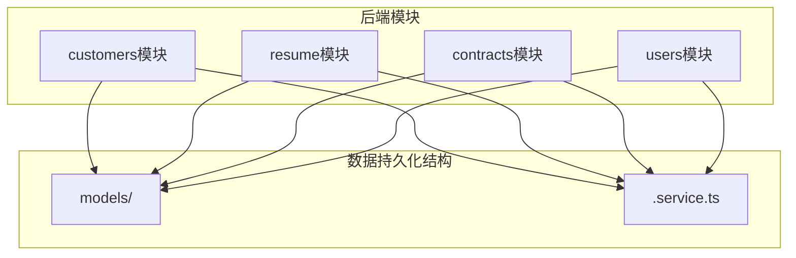
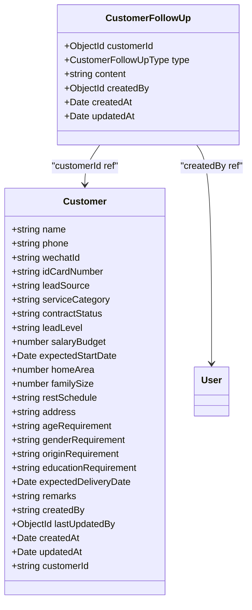
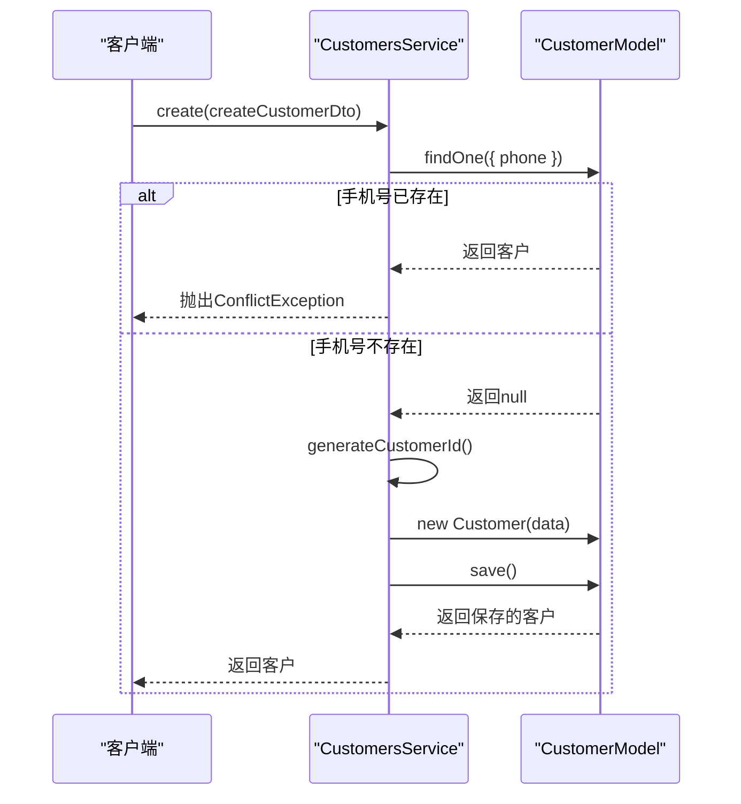
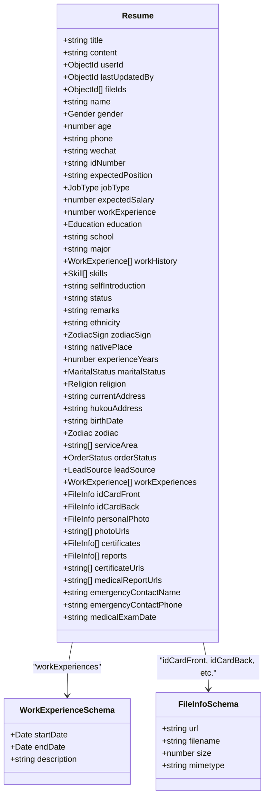
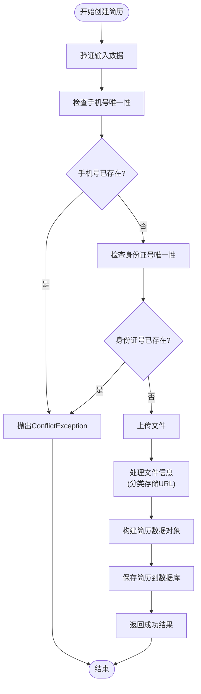
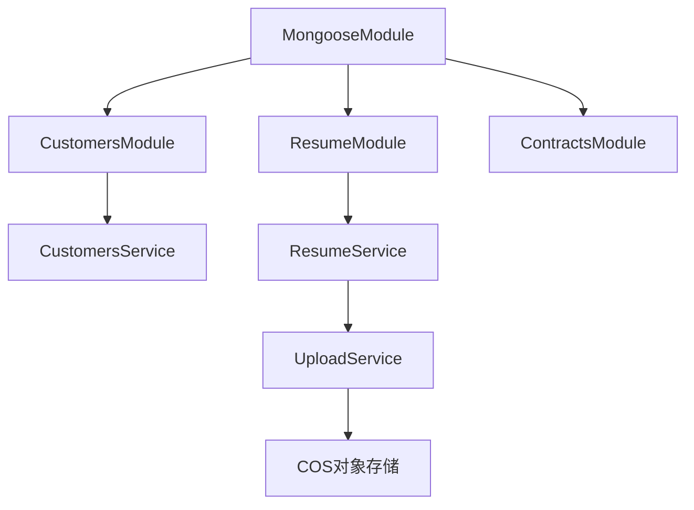

# 数据持久化层

<cite>
**本文档引用的文件**   
- [customer.model.ts](file://backend/src/modules/customers/models/customer.model.ts#L0-L98)
- [customer-follow-up.entity.ts](file://backend/src/modules/customers/models/customer-follow-up.entity.ts#L0-L63)
- [customers.service.ts](file://backend/src/modules/customers/customers.service.ts#L0-L308)
- [resume.entity.ts](file://backend/src/modules/resume/models/resume.entity.ts#L0-L276)
- [work-experience.schema.ts](file://backend/src/modules/resume/models/work-experience.schema.ts#L0-L17)
- [file-info.schema.ts](file://backend/src/modules/resume/models/file-info.schema.ts#L0-L20)
- [resume.service.ts](file://backend/src/modules/resume/resume.service.ts#L0-L1082)
- [customers.module.ts](file://backend/src/modules/customers/customers.module.ts#L0-L20)
- [resume.model.ts](file://backend/src/modules/contracts/models/contract.model.ts#L0-L20)
- [customer-contract-history.model.ts](file://backend/src/modules/contracts/models/customer-contract-history.model.ts#L0-L20)
- [app.module.ts](file://backend/src/app.module.ts#L19-L55)
</cite>

## 目录
1. [简介](#简介)
2. [项目结构](#项目结构)
3. [核心组件](#核心组件)
4. [架构概述](#架构概述)
5. [详细组件分析](#详细组件分析)
6. [依赖分析](#依赖分析)
7. [性能考虑](#性能考虑)
8. [故障排除指南](#故障排除指南)
9. [结论](#结论)

## 简介
本文档详细阐述了爱家政CRM系统中基于Mongoose与NestJS集成的数据持久化层。文档聚焦于实体（Entity）和模型（Model）的定义、服务层的CRUD操作实现、数据关联、索引策略以及性能优化实践。通过分析`customer`和`resume`模块，展示了如何在MongoDB中定义集合的Schema，包括字段类型、验证规则和索引，并说明了服务层如何注入模型实例来执行数据库操作。

## 项目结构
系统的后端代码位于`backend/src`目录下，采用基于功能的模块化组织方式。数据持久化相关的代码主要分布在各个功能模块的`models`和`services`子目录中。



**图源**
- [customer.model.ts](file://backend/src/modules/customers/models/customer.model.ts#L0-L98)
- [resume.entity.ts](file://backend/src/modules/resume/models/resume.entity.ts#L0-L276)

**本节来源**
- [customer.model.ts](file://backend/src/modules/customers/models/customer.model.ts#L0-L98)
- [resume.entity.ts](file://backend/src/modules/resume/models/resume.entity.ts#L0-L276)

## 核心组件
数据持久化的核心组件包括使用`@nestjs/mongoose`定义的**实体/模型类**和负责业务逻辑的**服务类**。实体类通过`@Prop`装饰器定义MongoDB文档的字段，而服务类则通过`@InjectModel()`装饰器注入Mongoose模型实例，从而执行数据库查询。

**本节来源**
- [customer.model.ts](file://backend/src/modules/customers/models/customer.model.ts#L0-L98)
- [customers.service.ts](file://backend/src/modules/customers/customers.service.ts#L0-L308)

## 架构概述
系统采用NestJS框架，通过`MongooseModule`实现与MongoDB的集成。在`app.module.ts`中配置了全局的Mongoose连接。各个业务模块（如`CustomersModule`、`ResumeModule`）通过`MongooseModule.forFeature()`方法注册其特定的模型，使其在该模块的作用域内可用。服务层（Service）通过依赖注入获取模型实例，实现对数据库的访问。

```mermaid
graph TD
A[AppModule] --> B[MongooseModule.forRootAsync]
B --> C[(MongoDB)]
A --> D[CustomersModule]
A --> E[ResumeModule]
D --> F[MongooseModule.forFeature<br/>{Customer, CustomerFollowUp}]
E --> G[MongooseModule.forFeature<br/>{Resume}]
F --> H[CustomersService]
G --> I[ResumeService]
H --> C
I --> C
```

**图源**
- [app.module.ts](file://backend/src/app.module.ts#L19-L55)
- [customers.module.ts](file://backend/src/modules/customers/customers.module.ts#L0-L20)

**本节来源**
- [app.module.ts](file://backend/src/app.module.ts#L19-L55)
- [customers.module.ts](file://backend/src/modules/customers/customers.module.ts#L0-L20)

## 详细组件分析

### 客户模块分析
`customers`模块管理客户信息及其跟进记录。它定义了`Customer`模型和`CustomerFollowUp`实体。

#### 实体与模型定义
`Customer`模型定义了客户的核心信息，如姓名、电话、服务类别和合同状态。`CustomerFollowUp`实体则用于记录与客户的互动。



**图源**
- [customer.model.ts](file://backend/src/modules/customers/models/customer.model.ts#L0-L98)
- [customer-follow-up.entity.ts](file://backend/src/modules/customers/models/customer-follow-up.entity.ts#L0-L63)

**本节来源**
- [customer.model.ts](file://backend/src/modules/customers/models/customer.model.ts#L0-L98)
- [customer-follow-up.entity.ts](file://backend/src/modules/customers/models/customer-follow-up.entity.ts#L0-L63)

#### 服务层CRUD操作
`CustomersService`通过注入`Customer`和`CustomerFollowUp`模型来实现CRUD操作。例如，`create`方法会检查手机号的唯一性并生成客户ID。



**图源**
- [customers.service.ts](file://backend/src/modules/customers/customers.service.ts#L0-L308)

**本节来源**
- [customers.service.ts](file://backend/src/modules/customers/customers.service.ts#L0-L308)

### 简历模块分析
`resume`模块管理服务人员的简历信息，其结构更为复杂，包含嵌套的子文档。

#### 实体与模型定义
`Resume`实体是核心，它使用`@Prop`装饰器定义了丰富的字段。关键特性是使用了嵌套的子文档模式（Subdocument Schemas）来管理文件和工作经历。



**图源**
- [resume.entity.ts](file://backend/src/modules/resume/models/resume.entity.ts#L0-L276)
- [work-experience.schema.ts](file://backend/src/modules/resume/models/work-experience.schema.ts#L0-L17)
- [file-info.schema.ts](file://backend/src/modules/resume/models/file-info.schema.ts#L0-L20)

**本节来源**
- [resume.entity.ts](file://backend/src/modules/resume/models/resume.entity.ts#L0-L276)
- [work-experience.schema.ts](file://backend/src/modules/resume/models/work-experience.schema.ts#L0-L17)
- [file-info.schema.ts](file://backend/src/modules/resume/models/file-info.schema.ts#L0-L20)

#### 服务层CRUD操作
`ResumeService`处理简历的创建、更新和文件管理。`createWithFiles`方法展示了如何在创建简历的同时处理文件上传。



**图源**
- [resume.service.ts](file://backend/src/modules/resume/resume.service.ts#L0-L1082)

**本节来源**
- [resume.service.ts](file://backend/src/modules/resume/resume.service.ts#L0-L1082)

## 依赖分析
数据持久化层的依赖关系清晰。`MongooseModule`是核心依赖，为所有模块提供数据库连接和模型注册功能。服务层依赖于`@InjectModel()`注入的模型实例。`ResumeService`还依赖于`UploadService`来处理文件的上传和删除。



**图源**
- [app.module.ts](file://backend/src/app.module.ts#L19-L55)
- [customers.module.ts](file://backend/src/modules/customers/customers.module.ts#L0-L20)
- [resume.service.ts](file://backend/src/modules/resume/resume.service.ts#L0-L1082)

**本节来源**
- [app.module.ts](file://backend/src/app.module.ts#L19-L55)
- [customers.module.ts](file://backend/src/modules/customers/customers.module.ts#L0-L20)
- [resume.service.ts](file://backend/src/modules/resume/resume.service.ts#L0-L1082)

## 性能考虑
系统在数据持久化方面实施了多项性能优化策略：
1.  **索引策略**：在`CustomerFollowUp`实体上为`customerId`和`createdAt`字段创建了复合索引，以加速按客户和时间查询跟进记录。
2.  **投影（Projection）**：在`findOne`等查询中使用`.select('-password')`或`.lean()`来减少返回的数据量，提高查询性能。
3.  **分页**：`findAll`方法实现了标准的分页机制，通过`skip`和`limit`避免一次性加载过多数据。
4.  **数据填充（Populate）**：使用`populate('createdBy', 'name username')`自动填充关联的用户信息，避免了手动查询。
5.  **强制排序修复**：在`resume.service.ts`中，通过在数据库排序后进行内存二次排序，确保了列表展示的顺序正确性。

**本节来源**
- [customer-follow-up.entity.ts](file://backend/src/modules/customers/models/customer-follow-up.entity.ts#L63)
- [customers.service.ts](file://backend/src/modules/customers/customers.service.ts#L0-L308)
- [resume.service.ts](file://backend/src/modules/resume/resume.service.ts#L0-L1082)

## 故障排除指南
*   **问题：创建客户时提示“该手机号已存在客户记录”**
    *   **原因**：`customers.service.ts`中的`create`方法会检查手机号的唯一性。
    *   **解决**：确认输入的手机号是否已关联到其他客户。

*   **问题：列表排序不正确**
    *   **原因**：`resume.service.ts`中存在一个已知的排序问题，部分记录的`updatedAt`字段可能为空。
    *   **解决**：服务中已实现`batchFixMissingUpdatedAt`方法来批量修复缺失的`updatedAt`字段，并在查询时进行强制二次排序。

*   **问题：文件上传失败**
    *   **原因**：可能与COS（对象存储）服务的配置或网络问题有关。
    *   **解决**：检查`upload.service.ts`中的上传逻辑和COS配置。

**本节来源**
- [customers.service.ts](file://backend/src/modules/customers/customers.service.ts#L0-L308)
- [resume.service.ts](file://backend/src/modules/resume/resume.service.ts#L0-L1082)

## 结论
爱家政CRM系统的数据持久化层设计良好，充分利用了NestJS与Mongoose的集成优势。通过清晰的实体/模型定义、服务层的封装以及合理的性能优化，实现了对客户和简历数据的有效管理。系统支持复杂的数据结构（如嵌套子文档）、数据关联和文件管理，为上层业务功能提供了坚实的基础。