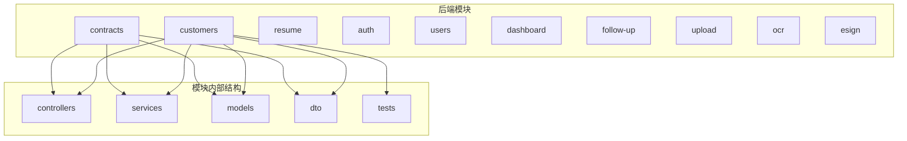
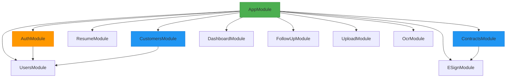
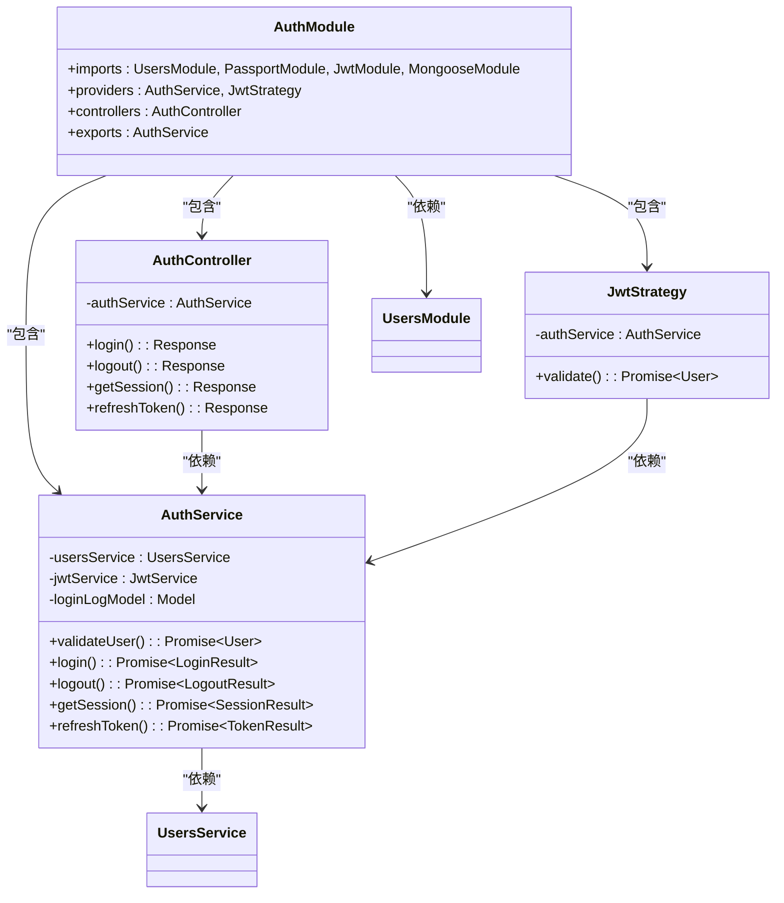
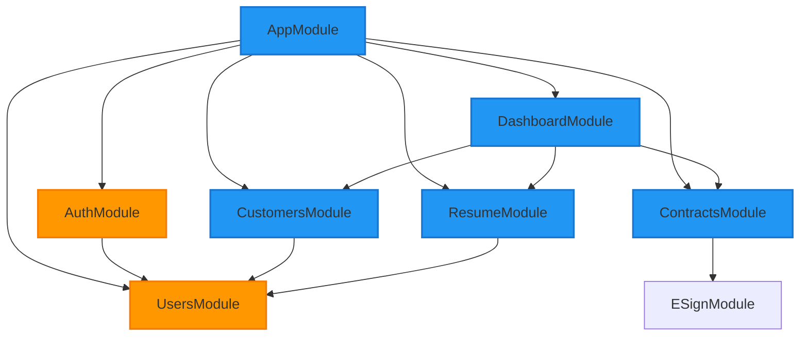

# 模块组织结构

<cite>
**本文档引用的文件**   
- [app.module.ts](file://backend/src/app.module.ts#L0-L55)
- [customers.module.ts](file://backend/src/modules/customers/customers.module.ts#L0-L20)
- [contracts.module.ts](file://backend/src/modules/contracts/contracts.module.ts#L0-L21)
- [auth.module.ts](file://backend/src/modules/auth/auth.module.ts#L0-L29)
- [customers.controller.ts](file://backend/src/modules/customers/customers.controller.ts#L0-L145)
- [customers.service.ts](file://backend/src/modules/customers/customers.service.ts#L0-L199)
- [contracts.controller.ts](file://backend/src/modules/contracts/contracts.controller.ts#L0-L199)
- [contracts.service.ts](file://backend/src/modules/contracts/contracts.service.ts#L0-L199)
- [create-customer.dto.ts](file://backend/src/modules/customers/dto/create-customer.dto.ts#L0-L116)
- [create-contract.dto.ts](file://backend/src/modules/contracts/dto/create-contract.dto.ts#L0-L199)
- [auth.service.ts](file://backend/src/modules/auth/auth.service.ts#L0-L154)
- [users.service.ts](file://backend/src/modules/users/users.service.ts)
</cite>

## 目录
1. [项目结构](#项目结构)
2. [核心模块分析](#核心模块分析)
3. [模块化架构概述](#模块化架构概述)
4. [详细组件分析](#详细组件分析)
5. [依赖关系分析](#依赖关系分析)

## 项目结构
本项目采用基于功能的模块化架构，将后端代码组织在`backend/src/modules`目录下。每个功能模块（如客户、合同、简历等）都有独立的子目录，包含其控制器、服务、模型、数据传输对象（DTO）等组件。这种组织方式实现了高内聚、低耦合的设计原则，使得每个模块都能独立开发、测试和维护。



**图示来源**
- [backend/src/modules](file://backend/src/modules)

**本节来源**
- [backend/src/modules](file://backend/src/modules)

## 核心模块分析
项目的核心模块包括客户（customers）、合同（contracts）、认证（auth）和用户（users）等。主应用模块`app.module.ts`通过`@Module`装饰器的`imports`数组导入这些功能模块，从而构建整个应用的依赖图。每个功能模块都使用`@Controller`、`@Service`、`@Injectable`等装饰器来组织其内部组件，实现了清晰的职责分离。

**本节来源**
- [app.module.ts](file://backend/src/app.module.ts#L0-L55)

## 模块化架构概述
NestJS的模块化系统是本项目架构的核心。`AppModule`作为根模块，负责协调所有功能模块。每个功能模块通过`@Module`装饰器定义，明确声明其依赖的其他模块、提供的控制器和服务。这种显式的依赖声明机制确保了应用结构的清晰性和可维护性。



**图示来源**
- [app.module.ts](file://backend/src/app.module.ts#L0-L55)
- [auth.module.ts](file://backend/src/modules/auth/auth.module.ts#L0-L29)
- [contracts.module.ts](file://backend/src/modules/contracts/contracts.module.ts#L0-L21)

**本节来源**
- [app.module.ts](file://backend/src/app.module.ts#L0-L55)

## 详细组件分析

### 客户模块分析
客户模块（CustomersModule）封装了客户管理的所有功能，包括客户信息、跟进记录等。该模块通过`MongooseModule.forFeature`注册其数据模型，并将`CustomersService`作为提供者导出，供其他模块复用。

#### 客户模块类图
```mermaid
classDiagram
class CustomersModule {
+imports : MongooseModule[]
+controllers : CustomersController[]
+providers : CustomersService[]
+exports : CustomersService[]
}
class CustomersController {
-customersService : CustomersService
+create() : ApiResponse
+findAll() : ApiResponse
+findOne() : ApiResponse
+update() : ApiResponse
+remove() : ApiResponse
+createFollowUp() : ApiResponse
+getFollowUps() : ApiResponse
}
class CustomersService {
-customerModel : Model<Customer>
-userModel : Model<User>
-customerFollowUpModel : Model<CustomerFollowUp>
+create() : Promise~Customer~
+findAll() : Promise~CustomerResult~
+findOne() : Promise~CustomerDetail~
+update() : Promise~Customer~
+remove() : Promise~void~
+createFollowUp() : Promise~CustomerFollowUp~
+getFollowUps() : Promise~CustomerFollowUp[]~
}
class CreateCustomerDto {
+name : string
+phone : string
+wechatId? : string
+idCardNumber? : string
+leadSource : string
+contractStatus : string
+serviceCategory? : string
+salaryBudget? : number
+expectedStartDate? : string
+homeArea? : number
+familySize? : number
+restSchedule? : string
+address? : string
}
class UpdateCustomerDto {
+name? : string
+phone? : string
+contractStatus? : string
+serviceCategory? : string
+salaryBudget? : number
+expectedStartDate? : string
+homeArea? : number
+familySize? : number
+restSchedule? : string
+address? : string
}
CustomersModule --> CustomersController : "包含"
CustomersModule --> CustomersService : "包含"
CustomersController --> CustomersService : "依赖"
CustomersService --> "Mongoose Model" : "使用"
CustomersController --> CreateCustomerDto : "使用"
CustomersController --> UpdateCustomerDto : "使用"
```

**图示来源**
- [customers.module.ts](file://backend/src/modules/customers/customers.module.ts#L0-L20)
- [customers.controller.ts](file://backend/src/modules/customers/customers.controller.ts#L0-L145)
- [customers.service.ts](file://backend/src/modules/customers/customers.service.ts#L0-L199)
- [create-customer.dto.ts](file://backend/src/modules/customers/dto/create-customer.dto.ts#L0-L116)

**本节来源**
- [customers.module.ts](file://backend/src/modules/customers/customers.module.ts#L0-L20)
- [customers.controller.ts](file://backend/src/modules/customers/customers.controller.ts#L0-L145)
- [customers.service.ts](file://backend/src/modules/customers/customers.service.ts#L0-L199)

### 合同模块分析
合同模块（ContractsModule）负责管理客户与家政服务人员之间的合同。该模块不仅依赖于自身的数据模型，还通过`imports`数组导入了`ESignModule`，实现了电子签约功能的集成。这种设计体现了模块间的依赖关系和功能复用。

#### 合同模块类图
```mermaid
classDiagram
class ContractsModule {
+imports : MongooseModule[], ESignModule
+controllers : ContractsController[]
+providers : ContractsService[]
+exports : ContractsService[]
}
class ContractsController {
-contractsService : ContractsService
-esignService : ESignService
+create() : Response
+findAll() : Response
+findOne() : Response
+update() : Response
+remove() : Response
}
class ContractsService {
-contractModel : Model<Contract>
-customerContractHistoryModel : Model<CustomerContractHistory>
+create() : Promise~Contract~
+findAll() : Promise~ContractResult~
+findOne() : Promise~Contract~
+update() : Promise~Contract~
+remove() : Promise~void~
+getStatistics() : Promise~Statistics~
}
class CreateContractDto {
+customerName : string
+customerPhone : string
+customerIdCard? : string
+contractType? : ContractType
+startDate? : string
+endDate? : string
+workerName? : string
+workerPhone? : string
+workerIdCard? : string
+workerSalary? : number
+customerServiceFee? : number
+workerServiceFee? : number
+deposit? : number
+finalPayment? : number
+expectedDeliveryDate? : string
+salaryPaymentDay? : number
+remarks? : string
+monthlyWorkDays? : number
+customerId? : string
+workerId? : string
+createdBy? : string
+contractNumber? : string
}
class UpdateContractDto {
+customerName? : string
+customerPhone? : string
+contractType? : ContractType
+startDate? : string
+endDate? : string
+workerName? : string
+workerPhone? : string
+workerIdCard? : string
+workerSalary? : number
+customerServiceFee? : number
+workerServiceFee? : number
+deposit? : number
+finalPayment? : number
+expectedDeliveryDate? : string
+salaryPaymentDay? : number
+remarks? : string
+monthlyWorkDays? : number
+customerId? : string
+workerId? : string
+lastUpdatedBy? : string
+contractNumber? : string
}
ContractsModule --> ContractsController : "包含"
ContractsModule --> ContractsService : "包含"
ContractsModule --> ESignModule : "依赖"
ContractsController --> ContractsService : "依赖"
ContractsController --> ESignService : "依赖"
ContractsService --> "Mongoose Model" : "使用"
ContractsController --> CreateContractDto : "使用"
ContractsController --> UpdateContractDto : "使用"
```

**图示来源**
- [contracts.module.ts](file://backend/src/modules/contracts/contracts.module.ts#L0-L21)
- [contracts.controller.ts](file://backend/src/modules/contracts/contracts.controller.ts#L0-L199)
- [contracts.service.ts](file://backend/src/modules/contracts/contracts.service.ts#L0-L199)
- [create-contract.dto.ts](file://backend/src/modules/contracts/dto/create-contract.dto.ts#L0-L199)

**本节来源**
- [contracts.module.ts](file://backend/src/modules/contracts/contracts.module.ts#L0-L21)
- [contracts.controller.ts](file://backend/src/modules/contracts/contracts.controller.ts#L0-L199)
- [contracts.service.ts](file://backend/src/modules/contracts/contracts.service.ts#L0-L199)

### 认证模块分析
认证模块（AuthModule）是一个典型的共享模块，被多个其他模块所依赖。它集成了JWT认证、Passport策略和用户服务，为整个应用提供统一的认证机制。该模块将`AuthService`导出，使得其他模块可以注入并使用认证功能。

#### 认证模块类图


**图示来源**
- [auth.module.ts](file://backend/src/modules/auth/auth.module.ts#L0-L29)
- [auth.service.ts](file://backend/src/modules/auth/auth.service.ts#L0-L154)
- [backend/src/modules/users/users.service.ts](file://backend/src/modules/users/users.service.ts)

**本节来源**
- [auth.module.ts](file://backend/src/modules/auth/auth.module.ts#L0-L29)
- [auth.service.ts](file://backend/src/modules/auth/auth.service.ts#L0-L154)

## 依赖关系分析
本项目的模块间依赖关系清晰且合理。`AppModule`作为根模块，直接依赖所有功能模块。`AuthModule`作为共享模块，被需要认证功能的模块间接依赖。`ContractsModule`依赖于`ESignModule`以实现电子签约功能，而`CustomersModule`和`AuthModule`都依赖于`UsersModule`来管理用户信息。这种依赖结构避免了循环依赖，确保了应用的稳定性和可扩展性。



**图示来源**
- [app.module.ts](file://backend/src/app.module.ts#L0-L55)
- [auth.module.ts](file://backend/src/modules/auth/auth.module.ts#L0-L29)
- [customers.module.ts](file://backend/src/modules/customers/customers.module.ts#L0-L20)
- [contracts.module.ts](file://backend/src/modules/contracts/contracts.module.ts#L0-L21)

**本节来源**
- [app.module.ts](file://backend/src/app.module.ts#L0-L55)
- [auth.module.ts](file://backend/src/modules/auth/auth.module.ts#L0-L29)