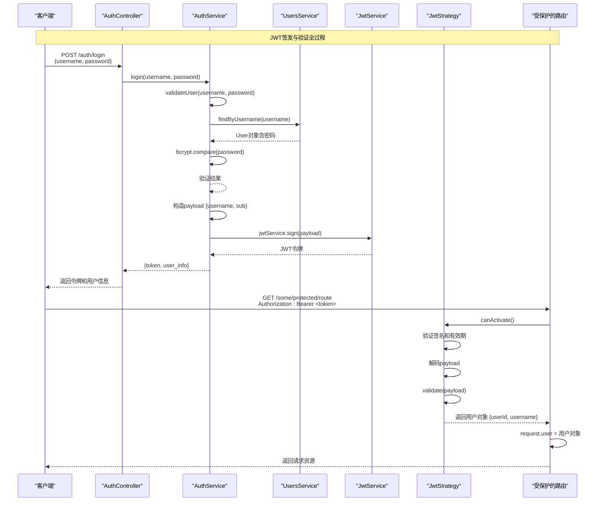

# JWT认证策略实现

<cite>
**本文档引用的文件**
- [jwt.strategy.ts](file://backend/src/modules/auth/jwt.strategy.ts)
- [auth.service.ts](file://backend/src/modules/auth/auth.service.ts)
- [users.service.ts](file://backend/src/modules/users/users.service.ts)
- [user.entity.ts](file://backend/src/modules/users/models/user.entity.ts)
- [auth.module.ts](file://backend/src/modules/auth/auth.module.ts)
- [production.config.js](file://backend/src/config/production.config.js)
</cite>

## 目录
1. [JWT认证策略实现](#jwt认证策略实现)
2. [JWT令牌验证机制](#jwt令牌验证机制)
3. [JWT令牌生成与签发](#jwt令牌生成与签发)
4. [JWT签发与验证全过程时序图](#jwt签发与验证全过程时序图)
5. [无状态认证的优缺点](#无状态认证的优缺点)

## JWT令牌验证机制

JWT令牌验证机制的核心是`JwtStrategy`类，它继承自NestJS Passport模块的`PassportStrategy(Strategy)`。该策略负责验证客户端请求中携带的JWT令牌的有效性。

在`jwt.strategy.ts`文件中，`JwtStrategy`类的构造函数配置了JWT验证的关键参数：
- `jwtFromRequest`: 使用`ExtractJwt.fromAuthHeaderAsBearerToken()`从HTTP请求头的`Authorization`字段中提取Bearer令牌。
- `ignoreExpiration`: 设置为`false`，表示必须验证令牌的过期时间。
- `secretOrKey`: 用于验证令牌签名的密钥，优先从环境变量`JWT_SECRET`中读取，若不存在则使用默认密钥`andejiazheng-secret-key`。

```typescript
constructor() {
  super({
    jwtFromRequest: ExtractJwt.fromAuthHeaderAsBearerToken(),
    ignoreExpiration: false,
    secretOrKey: process.env.JWT_SECRET || 'andejiazheng-secret-key',
  });
}
```

验证的核心逻辑在`validate`方法中。当Passport成功解码JWT令牌的payload后，会调用此方法。该方法接收解码后的payload对象，并返回一个用户对象。这个返回的用户对象将被附加到后续请求的`request.user`属性上，供控制器使用。

```typescript
async validate(payload: any) {
  return {
    userId: payload.sub,
    username: payload.username,
  };
}
```

值得注意的是，当前的`validate`方法实现较为简单，仅从payload中提取了`sub`（用户ID）和`username`（用户名），并返回一个包含这两个字段的用户对象。它**没有**从数据库中查询完整的用户实体。这意味着：
1.  **性能高效**：避免了每次请求都进行数据库查询。
2.  **信息有限**：返回的用户对象不包含角色（role）、权限（permissions）等关键信息。
3.  **潜在风险**：如果用户的角色或权限在令牌有效期内被修改，这些变更不会反映在已签发的令牌中，直到令牌过期或被刷新。

**验证流程总结**：
1.  客户端在请求头中携带`Authorization: Bearer <token>`。
2.  `JwtAuthGuard`守卫触发`JwtStrategy`。
3.  `JwtStrategy`使用`secretOrKey`验证令牌的签名是否有效。
4.  `JwtStrategy`检查令牌是否已过期（`ignoreExpiration: false`）。
5.  如果签名和有效期都通过验证，Passport会解码payload。
6.  调用`validate(payload)`方法，将解码后的信息转换为用户对象。
7.  用户对象被注入到`request.user`中，请求继续执行。

**Section sources**
- [jwt.strategy.ts](file://backend/src/modules/auth/jwt.strategy.ts#L1-L20)

## JWT令牌生成与签发

JWT令牌的生成和签发主要在`auth.service.ts`文件的`AuthService`类中完成，具体由`login`方法实现。

### Payload构造逻辑

当用户通过用户名和密码验证后，`login`方法会构造一个用于生成JWT的payload。这个payload是令牌的核心数据部分，包含了用户的身份信息。

```typescript
const payload = { username: user.username, sub: user._id };
```

从代码中可以看出，当前的payload构造逻辑非常简洁，仅包含两个字段：
- `username`: 用户名，用于标识用户。
- `sub` (Subject): 用户的唯一标识符（`_id`），通常用作用户ID。

**关键点分析**：
*   **角色信息缺失**：尽管用户实体（`user.entity.ts`）中明确包含了`role`字段，但在生成令牌的payload时，并未将其包含进去。这与`validate`方法返回的用户对象信息有限的问题相呼应。
*   **权限信息缺失**：用户的权限数组`permissions`同样未被包含在payload中。

### 安全参数配置

令牌的签发过程涉及多个安全参数，这些参数在应用的模块配置和环境配置中定义。

1.  **密钥管理 (Secret Key)**:
    *   **来源**：密钥通过`process.env.JWT_SECRET`从环境变量中读取，这是最佳实践，确保了密钥不会硬编码在代码中。
    *   **配置位置**：在`auth.module.ts`中，`JwtModule.register()`方法配置了`secret`选项；在`jwt.strategy.ts`中，`secretOrKey`选项也使用了相同的环境变量。`production.config.js`文件中也定义了`jwt.secret`，表明该配置是生产环境的一部分。
    *   **重要性**：密钥是HS256算法安全性的核心，必须严格保密。

2.  **过期时间 (Expiration Time)**:
    *   **配置**：在`auth.module.ts`中，`signOptions`的`expiresIn`被硬编码为`'24h'`，表示令牌有效期为24小时。
    *   **潜在改进**：虽然`production.config.js`中定义了`jwt.expiresIn`，但`auth.module.ts`并未使用它，导致无法通过环境变量灵活调整过期时间。

3.  **签名算法 (Signing Algorithm)**:
    *   **配置**：在`auth.module.ts`中，`signOptions`明确指定了`algorithm: 'HS256'`，这是一种基于密钥的哈希算法。

4.  **签发者与受众 (Issuer & Audience)**:
    *   **配置**：在`production.config.js`中定义了`issuer: 'andejiazheng-crm'`和`audience: 'crm-users'`。这些是JWT标准声明，用于标识令牌的签发方和预期接收方，增强了令牌的可验证性和安全性。

**签发流程总结**：
1.  用户提交登录请求（`/auth/login`）。
2.  `AuthService.validateUser`方法验证用户名和密码。
3.  验证成功后，`AuthService.login`方法被调用。
4.  构造payload对象（包含`username`和`sub`）。
5.  使用`this.jwtService.sign(payload)`方法，结合`HS256`算法和`JWT_SECRET`密钥，生成JWT令牌。
6.  将令牌和一个包含完整用户信息（ID、用户名、角色、权限、姓名）的对象一起返回给客户端。

**Section sources**
- [auth.service.ts](file://backend/src/modules/auth/auth.service.ts#L67-L113)
- [auth.module.ts](file://backend/src/modules/auth/auth.module.ts#L1-L29)
- [production.config.js](file://backend/src/config/production.config.js#L1-L42)

## JWT签发与验证全过程时序图



**Diagram sources**
- [auth.service.ts](file://backend/src/modules/auth/auth.service.ts#L67-L113)
- [jwt.strategy.ts](file://backend/src/modules/auth/jwt.strategy.ts#L1-L20)
- [auth.controller.ts](file://backend/src/modules/auth/auth.controller.ts#L1-L38)

## 无状态认证的优缺点

### 优点

1.  **可扩展性 (Scalability)**：这是无状态认证最大的优势。服务器不需要在内存或数据库中存储会话信息。每个请求都携带了所有必要的认证信息（JWT），因此可以轻松地在多个服务器实例之间进行负载均衡，无需共享会话存储。
2.  **性能 (Performance)**：对于简单的验证（如检查签名和过期时间），JWT验证通常比查询数据库或缓存来查找会话要快。这减少了数据库的负载。
3.  **跨域支持 (Cross-Domain Support)**：JWT可以轻松地在不同的域或服务之间传递，非常适合微服务架构和单点登录（SSO）场景。
4.  **自包含性 (Self-contained)**：JWT的payload可以包含用户信息，减少了客户端需要额外查询用户信息API的次数。

### 缺点

1.  **令牌吊销困难 (Token Revocation)**：一旦JWT被签发，除非它过期，否则服务器无法强制使其失效。例如，用户登出或修改密码后，已签发的令牌仍然有效。解决此问题通常需要引入一个令牌黑名单（如Redis），但这会牺牲一部分“无状态”的特性。
2.  **令牌大小 (Token Size)**：相比于简单的会话ID，JWT由于包含了用户信息和签名，体积较大。这会增加每个HTTP请求的开销，尤其是在移动网络环境下。
3.  **安全性依赖密钥 (Security Dependency)**：整个系统的安全性高度依赖于密钥（`JWT_SECRET`）的保密性。一旦密钥泄露，攻击者可以伪造任意用户的令牌。
4.  **信息更新延迟 (Information Staleness)**：如本文档分析所示，如果用户的角色或权限在令牌有效期内被修改，这些变更不会立即生效，直到用户重新登录获取新令牌。这对于需要实时权限控制的系统是一个挑战。
5.  **缺乏细粒度控制**：与服务器端会话相比，对单个令牌的控制能力较弱。

**Section sources**
- [jwt.strategy.ts](file://backend/src/modules/auth/jwt.strategy.ts#L1-L20)
- [auth.service.ts](file://backend/src/modules/auth/auth.service.ts#L67-L113)