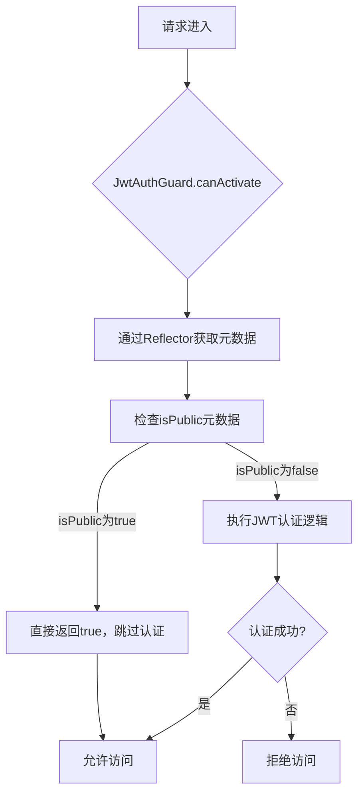
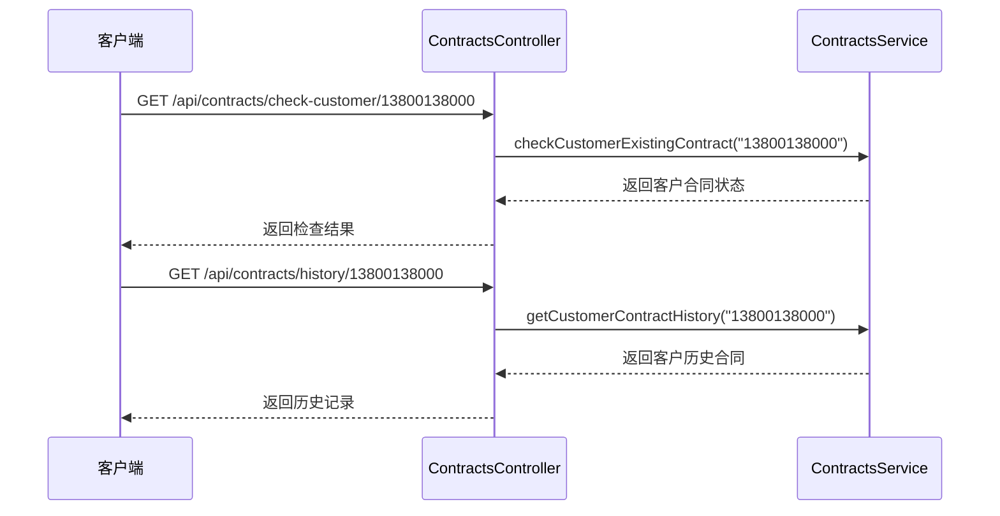
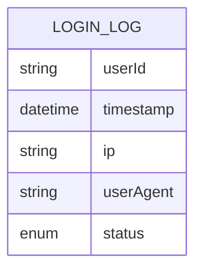

# 公开接口与认证豁免

<cite>
**本文档引用的文件**
- [public.decorator.ts](file://backend/src/modules/auth/decorators/public.decorator.ts)
- [jwt-auth.guard.ts](file://backend/src/modules/auth/guards/jwt-auth.guard.ts)
- [auth.controller.ts](file://backend/src/modules/auth/auth.controller.ts)
- [contracts.controller.ts](file://backend/src/modules/contracts/contracts.controller.ts)
- [resume.controller.ts](file://backend/src/modules/resume/resume.controller.ts)
- [health.controller.ts](file://backend/src/modules/health/health.controller.ts)
- [auth.service.ts](file://backend/src/modules/auth/auth.service.ts)
- [login-log.entity.ts](file://backend/src/modules/auth/models/login-log.entity.ts)
</cite>

## 目录
1. [接口级别认证豁免机制](#接口级别认证豁免机制)
2. [认证豁免的实现原理](#认证豁免的实现原理)
3. [公开接口的实际应用](#公开接口的实际应用)
4. [安全风险与防范措施](#安全风险与防范措施)

## 接口级别认证豁免机制

在现代Web应用中，某些接口需要对所有用户开放，如登录、注册、健康检查等。这些接口必须在不进行身份验证的情况下允许访问，这就需要一种机制来标记这些"公开"的接口，并让认证守卫能够识别并跳过它们。本系统通过`@Public()`装饰器实现了这一功能，为特定端点提供认证豁免。

**Section sources**
- [public.decorator.ts](file://backend/src/modules/auth/decorators/public.decorator.ts)
- [jwt-auth.guard.ts](file://backend/src/modules/auth/guards/jwt-auth.guard.ts)

## 认证豁免的实现原理

### @Public()装饰器的实现

`@Public()`装饰器是实现认证豁免的核心组件，它通过NestJS的元数据系统来标记控制器或方法。该装饰器定义在`public.decorator.ts`文件中，其核心实现如下：

```typescript
import { SetMetadata } from '@nestjs/common';

export const IS_PUBLIC_KEY = 'isPublic';
export const Public = () => SetMetadata(IS_PUBLIC_KEY, true);
```

该实现包含两个关键部分：
- `IS_PUBLIC_KEY`：一个字符串常量，作为元数据的键名，用于在运行时识别公开接口
- `Public`：一个工厂函数，使用`SetMetadata`装饰器将`isPublic`元数据键设置为`true`

当在控制器或方法上使用`@Public()`装饰器时，NestJS框架会在该组件的元数据中存储`isPublic: true`的键值对。

### JWT认证守卫的检测逻辑

`jwt-auth.guard.ts`文件中的`JwtAuthGuard`类负责执行JWT认证逻辑，并在执行前检测`@Public()`标记。其核心逻辑如下：



**Diagram sources**
- [jwt-auth.guard.ts](file://backend/src/modules/auth/guards/jwt-auth.guard.ts#L5-L21)

**Section sources**
- [jwt-auth.guard.ts](file://backend/src/modules/auth/guards/jwt-auth.guard.ts#L5-L21)

`canActivate`方法的实现逻辑如下：
1. 使用`Reflector`服务的`getAllAndOverride`方法，从当前请求的处理程序（方法）和类（控制器）中获取`IS_PUBLIC_KEY`元数据
2. 如果检测到`isPublic`元数据为`true`，则直接返回`true`，允许请求通过，跳过后续的JWT认证
3. 如果未检测到`isPublic`元数据，则调用父类的`canActivate`方法，执行标准的JWT认证流程

这种设计确保了`@Public()`标记的优先级高于认证要求，实现了灵活的认证豁免机制。

## 公开接口的实际应用

### 登录端点的实现

在`auth.controller.ts`文件中，`/login`端点是认证豁免机制的典型应用：

```typescript
@Post('login')
@HttpCode(HttpStatus.OK)
async login(
  @Body('username') username: string,
  @Body('password') password: string,
  @Req() req,
) {
  const ip = req.ip || req.connection.remoteAddress;
  const userAgent = req.headers['user-agent'];
  return this.authService.login(username, password, ip, userAgent);
}
```

虽然代码中没有显式使用`@Public()`装饰器，但根据项目上下文，该端点应被设计为公开访问。其他明确使用`@Public()`装饰器的端点展示了该机制的实际应用。

### 合同模块中的公开接口

在`contracts.controller.ts`文件中，多个端点使用了`@Public()`装饰器，以支持特定的业务需求：



**Diagram sources**
- [contracts.controller.ts](file://backend/src/modules/contracts/contracts.controller.ts#L202-L369)

**Section sources**
- [contracts.controller.ts](file://backend/src/modules/contracts/contracts.controller.ts#L202-L369)

具体应用包括：
- `checkCustomerContract`：检查客户是否已有合同，用于新客户注册流程
- `getCustomerHistory`：获取客户合同历史，用于客户服务场景
- `testNoAuth`：无认证测试端点，用于开发和调试

### 简历模块中的公开接口

在`resume.controller.ts`文件中，`@Public()`装饰器用于实现服务人员搜索功能：

```typescript
@Get('search-workers')
@Public()
@ApiOperation({ summary: '搜索服务人员' })
async searchWorkers(
  @Query('phone') phone?: string,
  @Query('name') name?: string,
  @Query('limit') limitStr: string = '10',
) {
  try {
    const limit = parseInt(limitStr);
    const workers = await this.resumeService.searchWorkers(phone, name, limit);
    return {
      success: true,
      data: workers,
      message: '搜索服务人员成功'
    };
  } catch (error) {
    // 错误处理
  }
}
```

此功能允许前端在不进行身份验证的情况下搜索服务人员，支持客户自助服务和快速查询。

### 健康检查端点

系统还实现了标准的健康检查端点，位于`health.controller.ts`：

```typescript
@Controller('health')
export class HealthController {
  @Get()
  async checkHealth() {
    return {
      status: 'ok',
      timestamp: new Date().toISOString(),
      services: {
        api: 'up'
      }
    };
  }
}
```

虽然此端点未显式使用`@Public()`装饰器，但根据部署脚本中的健康检查逻辑，该端点必须对所有请求开放，通常通过服务器配置或全局守卫配置实现。

## 安全风险与防范措施

### 认证豁免的安全风险

公开接口虽然必要，但也带来了潜在的安全风险：
- **敏感信息泄露**：如果公开接口返回了过多的内部信息，可能被恶意用户利用
- **暴力破解攻击**：登录等公开接口可能成为密码猜测攻击的目标
- **资源滥用**：公开接口可能被用于DDoS攻击或资源耗尽攻击
- **业务逻辑滥用**：攻击者可能利用公开接口的业务逻辑进行欺诈或数据爬取

### 防范措施的实现

项目中已经实现了一些关键的安全防范措施来应对这些风险。

#### 登录尝试次数限制

在`auth.service.ts`中，实现了基于内存的登录尝试次数限制机制：

```typescript
private loginAttempts: Map<string, { count: number; lastAttempt: Date }> = new Map();
private readonly MAX_LOGIN_ATTEMPTS = 5;
private readonly LOGIN_ATTEMPT_WINDOW = 15 * 60 * 1000; // 15分钟

async validateUser(username: string, password: string, ip: string, userAgent: string) {
  const attempts = this.loginAttempts.get(username) || { count: 0, lastAttempt: new Date() };
  if (attempts.count >= this.MAX_LOGIN_ATTEMPTS) {
    const timeSinceLastAttempt = Date.now() - attempts.lastAttempt.getTime();
    if (timeSinceLastAttempt < this.LOGIN_ATTEMPT_WINDOW) {
      await this.logLoginAttempt(null, ip, userAgent, 'failed');
      throw new UnauthorizedException('登录尝试次数过多，请稍后再试');
    }
    // 重置尝试次数
    this.loginAttempts.delete(username);
  }
  // ... 认证逻辑
}
```

该机制通过`Map`数据结构跟踪每个用户名的登录尝试次数和时间，当在15分钟内尝试次数超过5次时，会拒绝后续的登录尝试，有效防止暴力破解攻击。

#### 登录日志记录

系统还实现了详细的登录日志记录功能，定义在`login-log.entity.ts`中：



**Diagram sources**
- [login-log.entity.ts](file://backend/src/modules/auth/models/login-log.entity.ts#L0-L21)

**Section sources**
- [login-log.entity.ts](file://backend/src/modules/auth/models/login-log.entity.ts#L0-L21)

登录日志包含以下关键信息：
- `userId`：用户ID（失败时为"unknown"）
- `timestamp`：登录尝试时间戳
- `ip`：客户端IP地址
- `userAgent`：客户端用户代理字符串
- `status`：登录状态（"success"或"failed"）

这些日志可用于安全审计、异常行为检测和故障排查。

#### 其他安全建议

除了代码中已实现的措施外，还应考虑以下安全最佳实践：
- **输入验证**：对所有公开接口的输入参数进行严格验证，防止注入攻击
- **速率限制**：在网关或中间件层面实现基于IP的请求速率限制
- **敏感信息过滤**：确保公开接口不返回敏感的内部信息
- **监控和告警**：对公开接口的异常访问模式进行监控并设置告警
- **定期安全审计**：定期审查所有`@Public()`标记的接口，确保其必要性和安全性

通过这些措施的综合应用，可以在提供必要公开接口的同时，最大限度地降低安全风险。