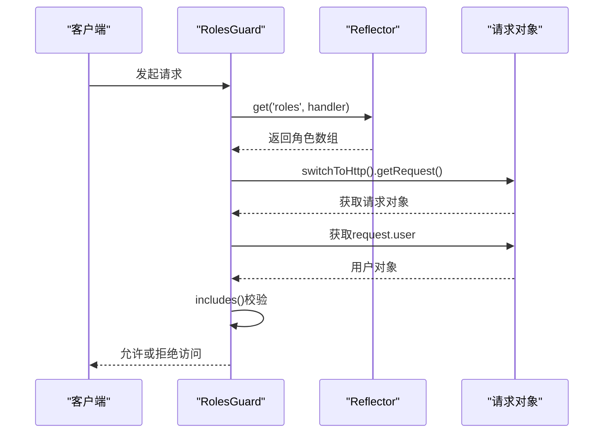
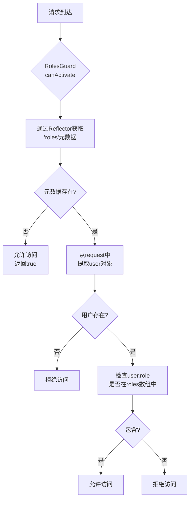
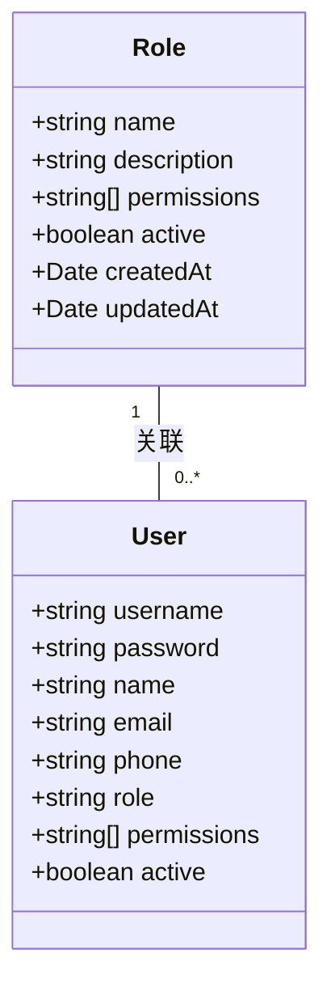

# 基于角色的访问控制（RBAC）

<cite>
**本文档引用文件**  
- [roles.guard.ts](file://backend/src/modules/auth/guards/roles.guard.ts#L1-L17)
- [roles.decorator.ts](file://backend/src/modules/auth/decorators/roles.decorator.ts#L1-L3)
- [user.entity.ts](file://backend/src/modules/users/models/user.entity.ts#L1-L46)
- [role.entity.ts](file://backend/src/modules/roles/models/role.entity.ts#L1-L30)
- [roles.service.ts](file://backend/src/modules/roles/roles.service.ts#L1-L133)
- [roles.controller.ts](file://backend/src/modules/roles/roles.controller.ts#L1-L147)
</cite>

## 目录
1. [基于角色的访问控制（RBAC）机制概述](#基于角色的访问控制rbac机制概述)
2. [核心组件分析](#核心组件分析)
3. [权限控制流程详解](#权限控制流程详解)
4. [角色定义与扩展机制](#角色定义与扩展机制)
5. [控制器权限应用示例](#控制器权限应用示例)
6. [异常处理与安全策略](#异常处理与安全策略)

## 基于角色的访问控制（RBAC）机制概述

本系统采用基于角色的访问控制（Role-Based Access Control, RBAC）机制，通过装饰器（Decorator）与守卫（Guard）协同工作实现细粒度的权限管理。该机制允许开发者在控制器或方法级别声明允许访问的角色，系统在请求执行前自动进行权限校验。

RBAC机制的核心由两个关键组件构成：
- **@Roles() 装饰器**：用于在控制器或方法上标记允许访问的角色元数据
- **RolesGuard 守卫**：在请求执行前读取元数据并进行实际的权限校验

该设计遵循关注点分离原则，将权限声明与权限校验逻辑解耦，提高了代码的可维护性和可复用性。

**Section sources**
- [roles.guard.ts](file://backend/src/modules/auth/guards/roles.guard.ts#L1-L17)
- [roles.decorator.ts](file://backend/src/modules/auth/decorators/roles.decorator.ts#L1-L3)

## 核心组件分析

### @Roles() 装饰器实现

`@Roles()` 装饰器定义在 `roles.decorator.ts` 文件中，其作用是将角色信息作为元数据附加到目标方法或控制器上。

```typescript
import { SetMetadata } from '@nestjs/common';

export const Roles = (...roles: string[]) => SetMetadata('roles', roles);
```

该装饰器接收一个或多个角色字符串作为参数，并使用 NestJS 的 `SetMetadata` 函数将这些角色信息以键值对的形式存储在元数据系统中，其中键为 `'roles'`，值为角色字符串数组。

**Section sources**
- [roles.decorator.ts](file://backend/src/modules/auth/decorators/roles.decorator.ts#L1-L3)

### RolesGuard 守卫实现

`RolesGuard` 是权限校验的核心逻辑，实现了 NestJS 的 `CanActivate` 接口，作为路由守卫在请求处理前执行。

```typescript
import { Injectable, CanActivate, ExecutionContext } from '@nestjs/common';
import { Reflector } from '@nestjs/core';

@Injectable()
export class RolesGuard implements CanActivate {
  constructor(private reflector: Reflector) {}

  canActivate(context: ExecutionContext): boolean {
    const roles = this.reflector.get<string[]>('roles', context.getHandler());
    if (!roles) {
      return true;
    }
    const request = context.switchToHttp().getRequest();
    const user = request.user;
    return roles.includes(user.role);
  }
}
```

守卫的执行流程如下：
1. 通过 `Reflector` 服务从当前执行上下文的方法处理器中获取名为 `'roles'` 的元数据
2. 如果未定义角色元数据，则默认允许访问（返回 `true`）
3. 从请求对象中提取已认证的用户信息
4. 检查用户的角色是否包含在允许的角色列表中

**Section sources**
- [roles.guard.ts](file://backend/src/modules/auth/guards/roles.guard.ts#L1-L17)

## 权限控制流程详解

### 元数据获取与用户提取



**Diagram sources**
- [roles.guard.ts](file://backend/src/modules/auth/guards/roles.guard.ts#L1-L17)

### 完整权限校验流程



**Diagram sources**
- [roles.guard.ts](file://backend/src/modules/auth/guards/roles.guard.ts#L1-L17)

## 角色定义与扩展机制

### 用户角色字段定义

在 `user.entity.ts` 文件中，用户实体定义了角色字段，采用字符串类型存储角色名称。

```typescript
@Schema({ timestamps: true })
export class User extends Document {
  // ... 其他字段
  
  @Prop({ required: true })
  role: string;

  @Prop({ type: [String], default: [] })
  permissions: string[];

  @Prop({ default: true })
  active: boolean;
}
```

角色字段特点：
- **类型**：字符串（string）
- **必填**：是（required: true）
- **存储方式**：直接存储角色名称而非枚举值
- **灵活性**：支持动态添加新角色而无需修改数据库结构

**Section sources**
- [user.entity.ts](file://backend/src/modules/users/models/user.entity.ts#L1-L46)

### 角色实体与权限设计

`role.entity.ts` 文件定义了角色实体，支持更复杂的角色权限管理。



**Diagram sources**
- [role.entity.ts](file://backend/src/modules/roles/models/role.entity.ts#L1-L30)
- [user.entity.ts](file://backend/src/modules/users/models/user.entity.ts#L1-L46)

### 默认角色初始化

系统在启动时通过 `RolesService` 的 `onModuleInit` 方法确保默认角色存在。

```typescript
async ensureDefaultRoles() {
  const defaultRoles = [
    {
      name: '系统管理员',
      description: '拥有系统所有权限',
      permissions: ['admin:all', 'resume:all', 'customer:all', 'user:all'],
      active: true
    },
    {
      name: '经理',
      description: '可以管理团队、阿姨资源和客户管理',
      permissions: ['resume:all', 'customer:all', 'user:view'],
      active: true
    },
    {
      name: '普通员工',
      description: '可以管理阿姨资源和客户',
      permissions: ['resume:view', 'resume:create', 'customer:view', 'customer:create'],
      active: true
    }
  ];

  for (const roleData of defaultRoles) {
    const existingRole = await this.findByName(roleData.name);
    if (!existingRole) {
      await this.create(roleData);
      console.log(`默认角色 "${roleData.name}" 已创建`);
    }
  }
}
```

该机制确保系统始终存在预定义的默认角色，即使数据库被清空也能自动恢复。

**Section sources**
- [roles.service.ts](file://backend/src/modules/roles/roles.service.ts#L1-L133)

## 控制器权限应用示例

虽然在代码搜索中未直接找到使用 `@Roles()` 装饰器的具体示例，但基于系统架构可以推断出典型的使用模式。

### 典型权限控制应用

```typescript
// 假设的控制器示例
@Controller('admin')
@UseGuards(JwtAuthGuard, RolesGuard)
export class AdminController {
  
  @Get('dashboard')
  @Roles('系统管理员', '经理')
  getDashboardData() {
    // 只有系统管理员和经理可以访问
    return this.dashboardService.getData();
  }

  @Post('users')
  @Roles('系统管理员')
  createUser(@Body() userData: CreateUserDto) {
    // 只有系统管理员可以创建用户
    return this.userService.create(userData);
  }

  @Put('users/:id')
  @Roles('系统管理员', '经理')
  updateUser(@Param('id') id: string, @Body() userData: UpdateUserDto) {
    // 系统管理员和经理可以更新用户
    return this.userService.update(id, userData);
  }

  @Get('users/profile')
  @Roles('系统管理员', '经理', '普通员工')
  getUserProfile(@Request() req) {
    // 所有认证用户都可以查看自己的资料
    return req.user;
  }
}
```

### 角色管理控制器分析

`roles.controller.ts` 文件中的角色管理控制器使用了 JWT 认证守卫，但未直接使用角色守卫，这表明角色管理权限可能在服务层或通过其他机制实现。

```typescript
@ApiTags('角色管理')
@Controller('roles')
@UseGuards(JwtAuthGuard)
export class RolesController {
  constructor(private readonly rolesService: RolesService) {}

  @Post()
  @ApiOperation({ summary: '创建角色' })
  async create(@Body() createRoleDto: CreateRoleDto) {
    // 创建角色逻辑
  }
}
```

**Section sources**
- [roles.controller.ts](file://backend/src/modules/roles/roles.controller.ts#L1-L147)

## 异常处理与安全策略

### 权限校验失败处理

当权限校验失败时，`RolesGuard` 会直接返回 `false`，导致 NestJS 框架抛出 `ForbiddenException`（403 禁止访问）异常。这种设计符合 RESTful API 的标准错误处理规范。

### 安全策略特点

1. **默认允许原则**：如果方法未使用 `@Roles()` 装饰器，则任何通过 JWT 认证的用户都可以访问
2. **精确匹配**：角色校验采用精确字符串匹配，不支持通配符或正则表达式
3. **单角色模型**：用户只能拥有一个主要角色，不支持多角色分配
4. **运行时校验**：权限校验在每次请求时动态执行，确保权限变更立即生效

### 建议的改进方向

1. **添加自定义异常**：可扩展 `RolesGuard` 以抛出带有详细信息的自定义异常
2. **支持多角色**：修改用户实体以支持角色数组而非单一角色
3. **权限继承**：实现角色继承机制，如经理角色自动继承普通员工的权限
4. **缓存优化**：对于频繁访问的权限校验，可引入缓存机制提高性能

**Section sources**
- [roles.guard.ts](file://backend/src/modules/auth/guards/roles.guard.ts#L1-L17)
- [user.entity.ts](file://backend/src/modules/users/models/user.entity.ts#L1-L46)