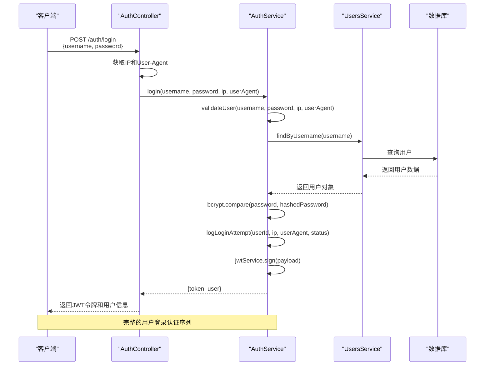
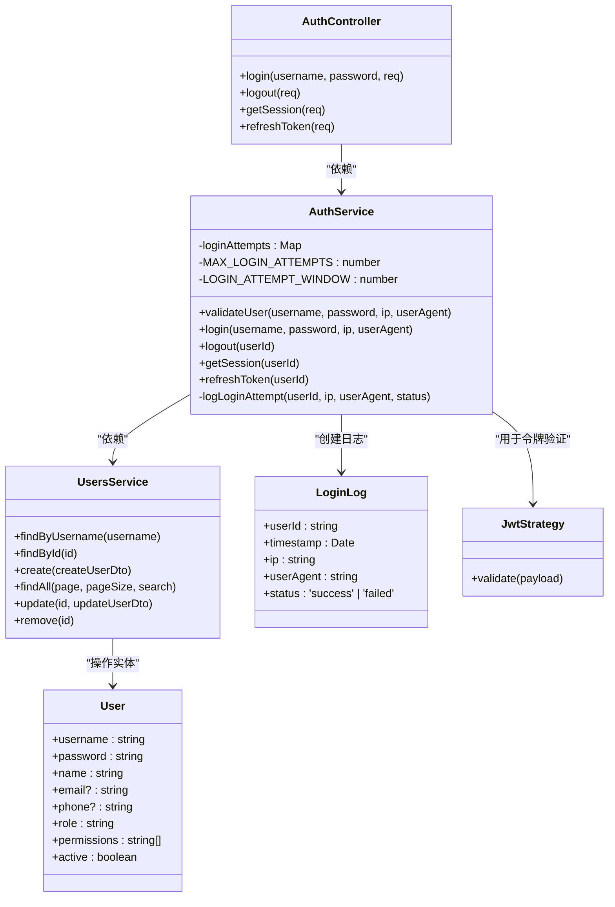
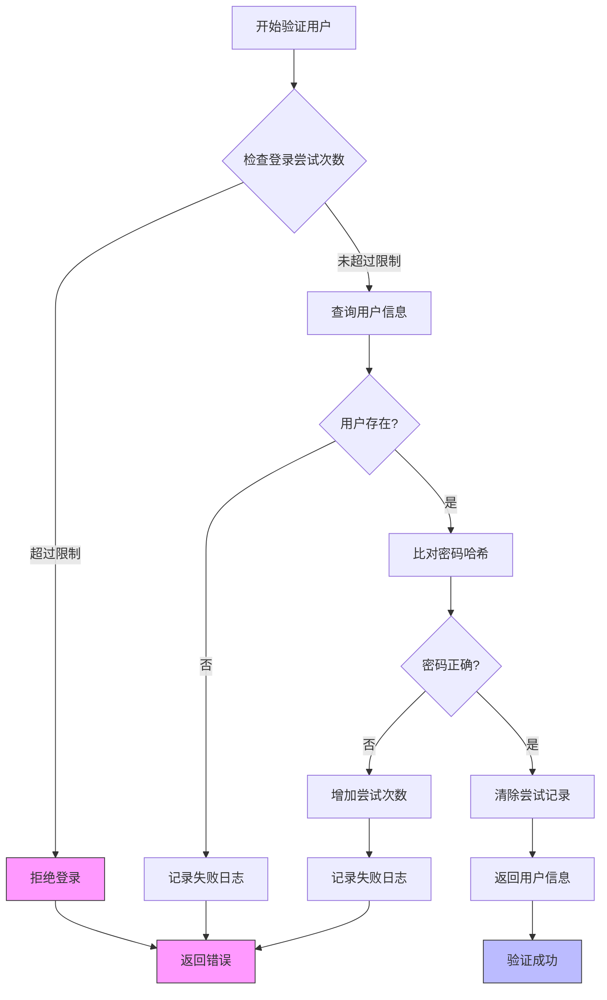
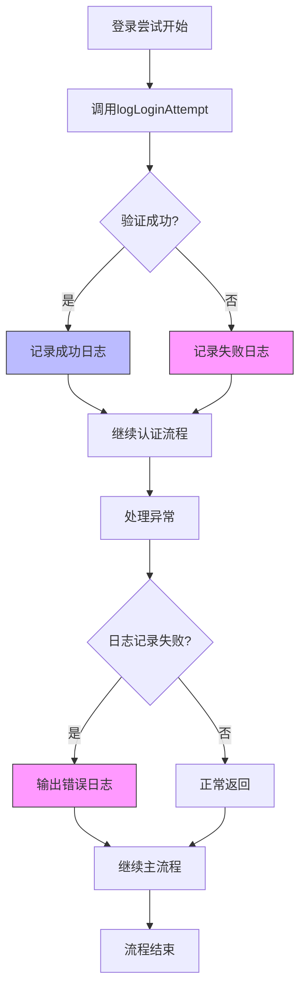

# 用户登录与令牌管理流程

<cite>
**本文档引用的文件**   
- [auth.controller.ts](file://backend/src/modules/auth/auth.controller.ts)
- [auth.service.ts](file://backend/src/modules/auth/auth.service.ts)
- [login-log.entity.ts](file://backend/src/modules/auth/models/login-log.entity.ts)
- [user.entity.ts](file://backend/src/modules/users/models/user.entity.ts)
- [users.service.ts](file://backend/src/modules/users/users.service.ts)
- [jwt.strategy.ts](file://backend/src/modules/auth/jwt.strategy.ts)
- [auth.module.ts](file://backend/src/modules/auth/auth.module.ts)
- [production.config.js](file://backend/src/config/production.config.js)
</cite>

## 目录
1. [用户登录认证流程](#用户登录认证流程)
2. [核心组件分析](#核心组件分析)
3. [认证服务详细逻辑](#认证服务详细逻辑)
4. [登录日志与安全审计](#登录日志与安全审计)
5. [令牌管理与最佳实践](#令牌管理与最佳实践)

## 用户登录认证流程

用户登录认证流程是系统安全的核心环节，从客户端提交凭证到服务器返回JWT令牌，整个过程涉及多个组件的协同工作。该流程确保了用户身份的合法性和系统的安全性。



**图示来源**
- [auth.controller.ts](file://backend/src/modules/auth/auth.controller.ts#L10-L20)
- [auth.service.ts](file://backend/src/modules/auth/auth.service.ts#L67-L113)
- [users.service.ts](file://backend/src/modules/users/users.service.ts#L26-L38)

**本节来源**
- [auth.controller.ts](file://backend/src/modules/auth/auth.controller.ts#L10-L20)
- [auth.service.ts](file://backend/src/modules/auth/auth.service.ts#L35-L113)

## 核心组件分析

用户登录认证功能由多个核心组件构成，这些组件遵循NestJS框架的模块化设计原则，实现了关注点分离。



**图示来源**
- [auth.controller.ts](file://backend/src/modules/auth/auth.controller.ts#L6-L38)
- [auth.service.ts](file://backend/src/modules/auth/auth.service.ts#L10-L154)
- [users.service.ts](file://backend/src/modules/users/users.service.ts#L10-L131)
- [login-log.entity.ts](file://backend/src/modules/auth/models/login-log.entity.ts#L4-L21)
- [user.entity.ts](file://backend/src/modules/users/models/user.entity.ts#L10-L45)

**本节来源**
- [auth.controller.ts](file://backend/src/modules/auth/auth.controller.ts#L6-L38)
- [auth.service.ts](file://backend/src/modules/auth/auth.service.ts#L10-L154)
- [users.service.ts](file://backend/src/modules/users/users.service.ts#L10-L131)

## 认证服务详细逻辑

### 登录端点请求处理

`auth.controller.ts`中的`/login`端点负责处理客户端的登录请求。该方法使用`@Body`装饰器提取用户名和密码，并通过`@Req()`获取请求对象以收集IP地址和用户代理信息。

```typescript
@Post('login')
@HttpCode(HttpStatus.OK)
async login(
  @Body('username') username: string,
  @Body('password') password: string,
  @Req() req,
) {
  const ip = req.ip || req.connection.remoteAddress;
  const userAgent = req.headers['user-agent'];
  return this.authService.login(username, password, ip, userAgent);
}
```

**本节来源**
- [auth.controller.ts](file://backend/src/modules/auth/auth.controller.ts#L10-L20)

### 用户验证与密码比对

`auth.service.ts`中的`validateUser`方法是认证逻辑的核心。它首先检查用户的登录尝试次数以防止暴力破解，然后通过`UsersService`查询用户信息，并使用`bcrypt`库进行密码哈希比对。



**本节来源**
- [auth.service.ts](file://backend/src/modules/auth/auth.service.ts#L35-L65)

### JWT令牌生成机制

`generateToken`方法的逻辑实现在`login`方法中。该方法创建一个包含用户标识信息的payload，然后使用`JwtService`生成安全的JWT令牌。令牌的有效期在配置中定义为24小时。

```typescript
const payload = { username: user.username, sub: user._id };
const token = this.jwtService.sign(payload);
```

JWT的密钥配置在`auth.module.ts`和`production.config.js`中，优先使用环境变量`JWT_SECRET`，若不存在则使用默认密钥。

```mermaid
flowchart LR
A[生成JWT令牌] --> B[创建Payload]
B --> C[包含username和sub(userId)]
C --> D[调用JwtService.sign()]
D --> E[使用JWT_SECRET签名]
E --> F[返回令牌字符串]
style A fill:#bbf,stroke:#333
style F fill:#bbf,stroke:#333
```

**本节来源**
- [auth.service.ts](file://backend/src/modules/auth/auth.service.ts#L85-L95)
- [auth.module.ts](file://backend/src/modules/auth/auth.module.ts#L18-L22)
- [production.config.js](file://backend/src/config/production.config.js#L78-L82)

## 登录日志与安全审计

### 登录日志实体设计

`login-log.entity.ts`文件定义了`LoginLog`实体，用于记录用户登录的安全审计信息。该实体包含用户ID、时间戳、IP地址、用户代理和登录状态等关键字段，满足安全合规要求。

```typescript
@Schema({ timestamps: true })
export class LoginLog extends Document {
  @Prop({ required: true })
  userId: string;

  @Prop({ required: true })
  timestamp: Date;

  @Prop({ required: true })
  ip: string;

  @Prop({ required: true })
  userAgent: string;

  @Prop({ required: true, enum: ['success', 'failed'] })
  status: 'success' | 'failed';
}
```

**本节来源**
- [login-log.entity.ts](file://backend/src/modules/auth/models/login-log.entity.ts#L4-L21)

### 登录日志记录流程

认证服务通过`logLoginAttempt`私有方法记录所有登录尝试，无论成功或失败。此方法异步创建日志记录，即使记录失败也不会影响主登录流程，确保了系统的健壮性。



**本节来源**
- [auth.service.ts](file://backend/src/modules/auth/auth.service.ts#L20-L33)

## 令牌管理与最佳实践

### 令牌刷新机制

系统实现了令牌刷新机制，允许用户在令牌过期前获取新的令牌，而无需重新登录。`refreshToken`方法验证用户身份后，生成一个新的JWT令牌。

```typescript
async refreshToken(userId: string) {
  const user = await this.usersService.findById(userId);
  if (!user) {
    throw new NotFoundException('用户不存在');
  }

  const payload = { username: user.username, sub: user._id };
  return {
    token: this.jwtService.sign(payload)
  };
}
```

**本节来源**
- [auth.service.ts](file://backend/src/modules/auth/auth.service.ts#L135-L154)

### 最佳实践建议

#### 登录最佳实践
- **客户端**：使用HTTPS传输凭证，避免在日志中记录密码
- **服务器端**：实施登录尝试限制，记录详细的审计日志
- **安全**：使用强密码策略，定期轮换JWT密钥

#### 刷新令牌最佳实践
- **频率**：在令牌过期前适当时间自动刷新
- **安全性**：刷新操作需要有效的当前令牌
- **用户体验**：实现无感刷新，避免频繁重新登录

#### 注销实现
虽然服务器端没有实现令牌黑名单机制，但客户端可以通过清除本地存储的令牌来实现注销功能。

```typescript
// 前端注销实现
export const logout = async (): Promise<void> => {
  try {
    await apiService.post('/api/auth/logout');
  } catch (error) {
    console.error('Logout API call failed:', error);
  } finally {
    removeToken(); // 清除本地令牌
  }
};
```

**本节来源**
- [auth.service.ts](file://backend/src/modules/auth/auth.service.ts#L115-L154)
- [auth.controller.ts](file://backend/src/modules/auth/auth.controller.ts#L22-L27)
- [auth.service.ts](file://backend/src/modules/auth/auth.service.ts#L115-L133)