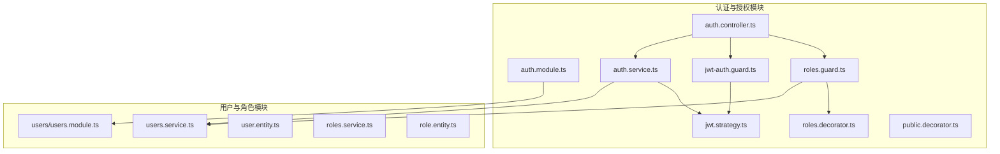
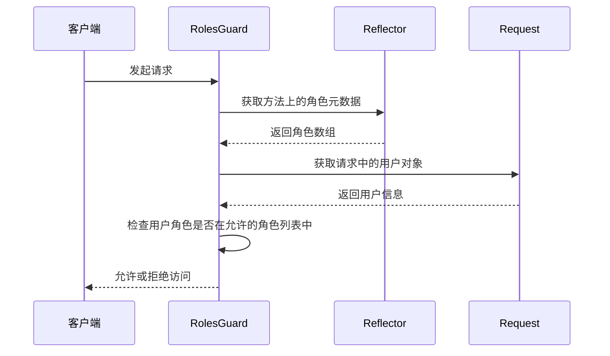
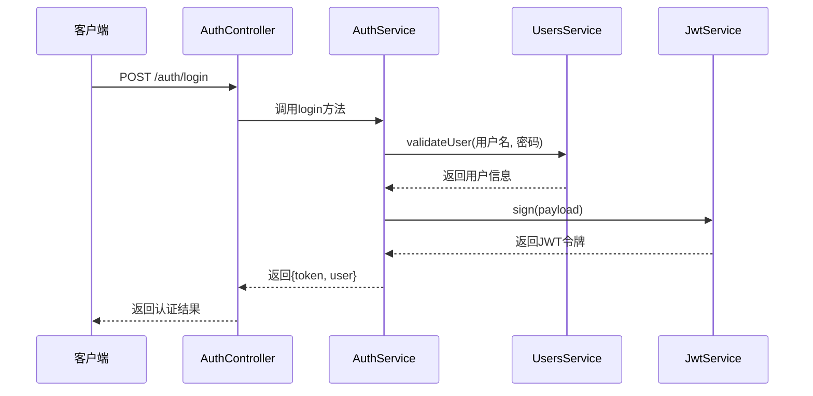

# 认证与授权机制

<cite>
**本文档中引用的文件**  
- [auth.module.ts](file://backend/src/modules/auth/auth.module.ts)
- [jwt.strategy.ts](file://backend/src/modules/auth/jwt.strategy.ts)
- [jwt-auth.guard.ts](file://backend/src/modules/auth/guards/jwt-auth.guard.ts)
- [roles.guard.ts](file://backend/src/modules/auth/guards/roles.guard.ts)
- [roles.decorator.ts](file://backend/src/modules/auth/decorators/roles.decorator.ts)
- [auth.service.ts](file://backend/src/modules/auth/auth.service.ts)
- [auth.controller.ts](file://backend/src/modules/auth/auth.controller.ts)
- [users.service.ts](file://backend/src/modules/users/users.service.ts)
- [roles.service.ts](file://backend/src/modules/roles/roles.service.ts)
</cite>

## 目录
1. [项目结构](#项目结构)
2. [核心组件](#核心组件)
3. [认证模块集成Passport策略](#认证模块集成passport策略)
4. [JWT令牌验证与用户信息提取](#jwt令牌验证与用户信息提取)
5. [路由保护与JWT守卫](#路由保护与jwt守卫)
6. [基于角色的细粒度权限控制](#基于角色的细粒度权限控制)
7. [API调用流程：生成、刷新与验证JWT令牌](#api调用流程生成刷新与验证jwt令牌)
8. [用户角色与权限映射关系](#用户角色与权限映射关系)

## 项目结构

项目采用NestJS框架，遵循模块化设计。认证与授权功能主要集中在`backend/src/modules/auth`目录下，通过模块、守卫、策略和装饰器实现完整的安全控制体系。



**图示来源**  
- [auth.module.ts](file://backend/src/modules/auth/auth.module.ts)
- [users/users.module.ts](file://backend/src/modules/users/users.module.ts)

**本节来源**  
- [auth.module.ts](file://backend/src/modules/auth/auth.module.ts)
- [project_structure](file://project_structure)

## 核心组件

认证与授权系统由多个核心组件构成，包括认证服务、JWT策略、守卫和装饰器。这些组件协同工作，确保系统的安全性。

**本节来源**  
- [auth.module.ts](file://backend/src/modules/auth/auth.module.ts)
- [jwt.strategy.ts](file://backend/src/modules/auth/jwt.strategy.ts)

## 认证模块集成Passport策略

`auth.module.ts`是认证功能的入口，通过NestJS的模块系统集成Passport框架，实现JWT认证。

```typescript
@Module({
  imports: [
    UsersModule,
    PassportModule,
    MongooseModule.forFeature([
      { name: LoginLog.name, schema: LoginLogSchema }
    ]),
    JwtModule.register({
      secret: process.env.JWT_SECRET || 'andejiazheng-secret-key',
      signOptions: { 
        expiresIn: '24h',
        algorithm: 'HS256'
      },
    }),
  ],
  providers: [AuthService, JwtStrategy],
  controllers: [AuthController],
  exports: [AuthService],
})
export class AuthModule {}
```

该模块导入了`PassportModule`和`JwtModule`，注册了JWT的密钥和过期时间，并将`JwtStrategy`作为提供者注入，从而实现了Passport策略的集成。

**本节来源**  
- [auth.module.ts](file://backend/src/modules/auth/auth.module.ts#L0-L29)

## JWT令牌验证与用户信息提取

`jwt.strategy.ts`定义了JWT策略，负责验证令牌的有效性并从令牌中提取用户信息。

```typescript
@Injectable()
export class JwtStrategy extends PassportStrategy(Strategy) {
  constructor() {
    super({
      jwtFromRequest: ExtractJwt.fromAuthHeaderAsBearerToken(),
      ignoreExpiration: false,
      secretOrKey: process.env.JWT_SECRET || 'andejiazheng-secret-key',
    });
  }

  async validate(payload: any) {
    return {
      userId: payload.sub,
      username: payload.username,
    };
  }
}
```

`validate`方法在令牌验证通过后被调用，返回包含用户ID和用户名的对象，该对象将被附加到请求对象的`user`属性上，供后续处理使用。

**本节来源**  
- [jwt.strategy.ts](file://backend/src/modules/auth/jwt.strategy.ts#L0-L20)

## 路由保护与JWT守卫

`jwt-auth.guard.ts`实现了JWT认证守卫，用于保护需要认证的路由。

```typescript
@Injectable()
export class JwtAuthGuard extends AuthGuard('jwt') {
  constructor(private reflector: Reflector) {
    super();
  }

  canActivate(context: ExecutionContext) {
    const isPublic = this.reflector.getAllAndOverride<boolean>(IS_PUBLIC_KEY, [
      context.getHandler(),
      context.getClass(),
    ]);
    if (isPublic) {
      return true;
    }
    return super.canActivate(context);
  }
} 
```

该守卫继承自`AuthGuard('jwt')`，并使用`Reflector`检查是否存在`@Public()`装饰器。如果存在，则允许访问，否则执行JWT认证流程。

**本节来源**  
- [jwt-auth.guard.ts](file://backend/src/modules/auth/guards/jwt-auth.guard.ts#L0-L21)

## 基于角色的细粒度权限控制

基于角色的访问控制（RBAC）通过`roles.guard.ts`和`roles.decorator.ts`实现。

### 角色装饰器

`roles.decorator.ts`定义了`@Roles()`装饰器，用于标记控制器方法所需的角色。

```typescript
export const Roles = (...roles: string[]) => SetMetadata('roles', roles); 
```

### 角色守卫

`roles.guard.ts`实现了角色守卫，检查当前用户的角色是否满足要求。



**图示来源**  
- [roles.guard.ts](file://backend/src/modules/auth/guards/roles.guard.ts#L0-L16)
- [roles.decorator.ts](file://backend/src/modules/auth/decorators/roles.decorator.ts#L0-L2)

**本节来源**  
- [roles.guard.ts](file://backend/src/modules/auth/guards/roles.guard.ts#L0-L16)
- [roles.decorator.ts](file://backend/src/modules/auth/decorators/roles.decorator.ts#L0-L2)

## API调用流程：生成、刷新与验证JWT令牌

认证流程通过`auth.controller.ts`中的API端点实现。

### 登录流程



### 刷新令牌流程

```typescript
@Post('refresh')
@UseGuards(JwtAuthGuard)
async refreshToken(@Req() req) {
  return this.authService.refreshToken(req.user.userId);
}
```

刷新令牌需要有效的JWT令牌，守卫会先验证令牌，然后调用服务生成新的令牌。

**图示来源**  
- [auth.controller.ts](file://backend/src/modules/auth/auth.controller.ts#L0-L38)
- [auth.service.ts](file://backend/src/modules/auth/auth.service.ts#L115-L154)

**本节来源**  
- [auth.controller.ts](file://backend/src/modules/auth/auth.controller.ts#L0-L38)
- [auth.service.ts](file://backend/src/modules/auth/auth.service.ts#L67-L113)

## 用户角色与权限映射关系

系统通过`users.service.ts`和`roles.service.ts`管理用户角色与权限的映射。

### 默认权限分配

在创建用户时，根据其角色分配默认权限：

```typescript
private getDefaultPermissions(role: string): string[] {
  switch (role) {
    case 'admin':
      return ['*']; // 管理员拥有所有权限
    case 'manager':
      return ['resume:all', 'customer:all', 'user:view'];
    case 'employee':
      return ['resume:view', 'resume:create', 'customer:view', 'customer:create'];
    default:
      return ['resume:view', 'customer:view'];
  }
}
```

### 默认角色初始化

系统启动时会确保默认角色存在：

```typescript
async ensureDefaultRoles() {
  const defaultRoles = [
    {
      name: '系统管理员',
      description: '拥有系统所有权限',
      permissions: ['admin:all', 'resume:all', 'customer:all', 'user:all'],
      active: true
    },
    {
      name: '经理',
      description: '可以管理团队、阿姨资源和客户管理',
      permissions: ['resume:all', 'customer:all', 'user:view'],
      active: true
    },
    {
      name: '普通员工',
      description: '可以管理阿姨资源和客户',
      permissions: ['resume:view', 'resume:create', 'customer:view', 'customer:create'],
      active: true
    }
  ];

  for (const roleData of defaultRoles) {
    const existingRole = await this.findByName(roleData.name);
    if (!existingRole) {
      await this.create(roleData);
      console.log(`默认角色 "${roleData.name}" 已创建`);
    }
  }
}
```

这种设计确保了系统具有预定义的安全策略，同时允许管理员根据需要创建和修改角色。

**本节来源**  
- [users.service.ts](file://backend/src/modules/users/users.service.ts#L115-L131)
- [roles.service.ts](file://backend/src/modules/roles/roles.service.ts#L83-L132)