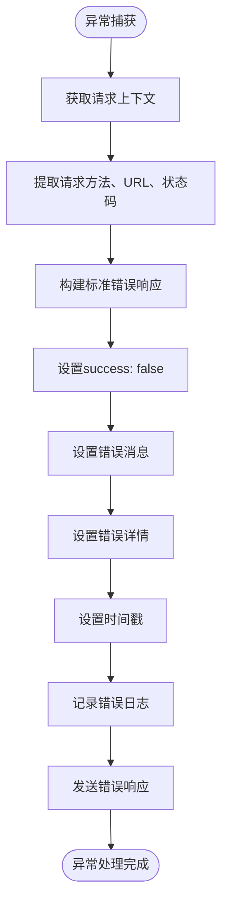

# 请求处理生命周期

<cite>
**本文档引用的文件**   
- [main.ts](file://backend/src/main.ts#L1-L89)
- [api-response.interceptor.ts](file://backend/src/common/interceptors/api-response.interceptor.ts#L1-L23)
- [http-exception.filter.ts](file://backend/src/common/filters/http-exception.filter.ts#L1-L31)
- [api-response.interface.ts](file://backend/src/common/interfaces/api-response.interface.ts#L1-L9)
- [customers.controller.ts](file://backend/src/modules/customers/customers.controller.ts#L1-L145)
- [create-customer.dto.ts](file://backend/src/modules/customers/dto/create-customer.dto.ts#L1-L116)
- [customers.service.ts](file://backend/src/modules/customers/customers.service.ts#L1-L308)
</cite>

## 目录
1. [简介](#简介)
2. [应用启动与全局配置](#应用启动与全局配置)
3. [请求处理流程详解](#请求处理流程详解)
4. [全局拦截器与异常过滤器](#全局拦截器与异常过滤器)
5. [客户创建请求的完整生命周期](#客户创建请求的完整生命周期)
6. [自定义扩展方法](#自定义扩展方法)

## 简介
本文档详细描述了从HTTP请求进入NestJS应用到响应返回的完整生命周期。以客户管理模块为例，展示了请求如何被路由、验证、执行业务逻辑、包装响应以及错误处理的全过程。重点分析了全局配置对所有控制器的一致性影响，包括全局拦截器和异常过滤器的作用机制。

## 应用启动与全局配置

应用的入口文件`main.ts`负责初始化NestJS应用实例，并配置全局行为。在`bootstrap`函数中，通过`NestFactory.create()`创建应用实例后，设置了CORS、API前缀、静态资源路径等基础配置。

最关键的是，通过`app.useGlobalInterceptors()`和`app.useGlobalFilters()`方法注册了全局拦截器和异常过滤器，这些配置将应用于所有控制器和路由，确保了整个应用响应格式和错误处理的一致性。


**图示来源**
- [main.ts](file://backend/src/main.ts#L1-L89)

**本节来源**
- [main.ts](file://backend/src/main.ts#L1-L89)

## 请求处理流程详解

NestJS的请求处理流程遵循一个清晰的管道模式，从请求进入应用到响应返回，经历多个处理阶段：

1. **路由匹配**：根据HTTP方法和URL路径，将请求路由到对应的控制器方法
2. **守卫验证**：通过`@UseGuards()`装饰器指定的守卫（如JWT认证守卫）进行权限验证
3. **管道验证**：使用`ValidationPipe`对请求数据进行验证和转换
4. **业务逻辑执行**：调用服务层方法执行核心业务逻辑
5. **响应拦截**：通过拦截器对成功响应进行格式化包装
6. **异常捕获**：在任何阶段发生错误时，由异常过滤器捕获并生成标准化错误响应


**图示来源**
- [main.ts](file://backend/src/main.ts#L1-L89)
- [customers.controller.ts](file://backend/src/modules/customers/customers.controller.ts#L1-L145)
- [create-customer.dto.ts](file://backend/src/modules/customers/dto/create-customer.dto.ts#L1-L116)

**本节来源**
- [main.ts](file://backend/src/main.ts#L1-L89)
- [customers.controller.ts](file://backend/src/modules/customers/customers.controller.ts#L1-L145)

## 全局拦截器与异常过滤器

### 全局响应拦截器

`ApiResponseInterceptor`实现了`NestInterceptor`接口，通过`intercept`方法拦截所有成功响应。其核心逻辑是将原始响应数据包装成统一的标准格式，确保所有API响应具有一致的结构。


**图示来源**
- [api-response.interceptor.ts](file://backend/src/common/interceptors/api-response.interceptor.ts#L1-L23)

**本节来源**
- [api-response.interceptor.ts](file://backend/src/common/interceptors/api-response.interceptor.ts#L1-L23)

### 全局异常过滤器

`HttpExceptionFilter`实现了`ExceptionFilter`接口，通过`@Catch(HttpException)`装饰器捕获所有HTTP异常。它将异常信息格式化为统一的错误响应结构，并记录详细的错误日志。



**图示来源**
- [http-exception.filter.ts](file://backend/src/common/filters/http-exception.filter.ts#L1-L31)

**本节来源**
- [http-exception.filter.ts](file://backend/src/common/filters/http-exception.filter.ts#L1-L31)

## 客户创建请求的完整生命周期

以创建客户请求为例，详细分析从HTTP请求到响应返回的完整生命周期。

### API响应接口定义

所有API响应遵循`ApiResponse`接口定义的统一格式：

```typescript
export interface ApiResponse<T = any> {
  success: boolean;
  data?: T;
  message?: string;
  error?: {
    code: string;
    details?: any;
  };
  timestamp: number;
}
```

### 请求处理流程

当客户端发送创建客户的POST请求时，经历以下步骤：

1. **路由匹配**：请求`POST /api/customers`被路由到`CustomersController.create()`方法
2. **JWT认证**：`@UseGuards(JwtAuthGuard)`确保请求携带有效的JWT令牌
3. **数据验证**：`CreateCustomerDto`中的`class-validator`装饰器验证请求数据
4. **业务执行**：调用`CustomersService.create()`方法创建客户记录
5. **响应包装**：`ApiResponseInterceptor`将成功响应包装成标准格式
6. **错误处理**：任何阶段的异常都被`HttpExceptionFilter`捕获并格式化


**图示来源**
- [customers.controller.ts](file://backend/src/modules/customers/customers.controller.ts#L1-L145)
- [create-customer.dto.ts](file://backend/src/modules/customers/dto/create-customer.dto.ts#L1-L116)
- [customers.service.ts](file://backend/src/modules/customers/customers.service.ts#L1-L308)

**本节来源**
- [customers.controller.ts](file://backend/src/modules/customers/customers.controller.ts#L1-L145)
- [create-customer.dto.ts](file://backend/src/modules/customers/dto/create-customer.dto.ts#L1-L116)
- [customers.service.ts](file://backend/src/modules/customers/customers.service.ts#L1-L308)

## 自定义扩展方法

### 自定义拦截器

要创建自定义拦截器，需实现`NestInterceptor`接口：

```typescript
import { Injectable, NestInterceptor, ExecutionContext, CallHandler } from '@nestjs/common';
import { Observable } from 'rxjs';
import { map } from 'rxjs/operators';

@Injectable()
export class CustomInterceptor implements NestInterceptor {
  intercept(context: ExecutionContext, next: CallHandler): Observable<any> {
    console.log('请求前处理');
    return next.handle().pipe(
      map(data => {
        console.log('响应后处理');
        return { ...data, processed: true };
      }),
    );
  }
}
```

### 自定义异常过滤器

要创建自定义异常过滤器，需实现`ExceptionFilter`接口：

```typescript
import { ExceptionFilter, Catch, ArgumentsHost, HttpException } from '@nestjs/common';

@Catch()
export class CustomExceptionFilter implements ExceptionFilter {
  catch(exception: unknown, host: ArgumentsHost) {
    const ctx = host.switchToHttp();
    const response = ctx.getResponse();
    const request = ctx.getRequest();

    const status = exception instanceof HttpException ? exception.getStatus() : 500;

    response.status(status).json({
      success: false,
      message: exception instanceof HttpException ? exception.message : '服务器内部错误',
      timestamp: Date.now(),
      path: request.url,
    });
  }
}
```

### 全局注册

在`main.ts`中注册自定义拦截器和过滤器：

```typescript
async function bootstrap() {
  const app = await NestFactory.create(AppModule);
  
  // 注册自定义全局拦截器
  app.useGlobalInterceptors(new CustomInterceptor());
  
  // 注册自定义全局过滤器
  app.useGlobalFilters(new CustomExceptionFilter());
  
  await app.listen(3000);
}
```

**本节来源**
- [main.ts](file://backend/src/main.ts#L1-L89)
- [api-response.interceptor.ts](file://backend/src/common/interceptors/api-response.interceptor.ts#L1-L23)
- [http-exception.filter.ts](file://backend/src/common/filters/http-exception.filter.ts#L1-L31)