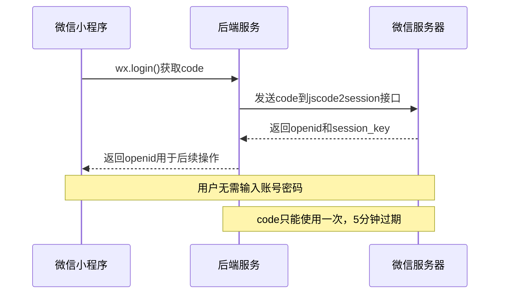
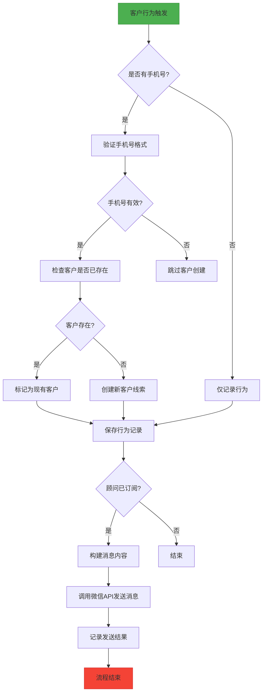

<docs>
# 微信API集成

<cite>
**本文档引用的文件**
- [WECHAT_API_DOCUMENTATION.md](file://WECHAT_API_DOCUMENTATION.md)
- [weixin.controller.ts](file://backend/src/modules/weixin/weixin.controller.ts)
- [weixin.service.ts](file://backend/src/modules/weixin/weixin.service.ts)
- [get-openid.dto.ts](file://backend/src/modules/weixin/dto/get-openid.dto.ts)
- [advisor-subscribe.dto.ts](file://backend/src/modules/weixin/dto/advisor-subscribe.dto.ts)
- [customer-action.dto.ts](file://backend/src/modules/weixin/dto/customer-action.dto.ts)
- [send-message.dto.ts](file://backend/src/modules/weixin/dto/send-message.dto.ts)
- [customer-lead.service.ts](file://backend/src/modules/weixin/services/customer-lead.service.ts)
- [api.ts](file://frontend/src/services/api.ts)
</cite>

## 目录
1. [简介](#简介)
2. [API接口](#api接口)
3. [认证流程](#认证流程)
4. [消息推送机制](#消息推送机制)
5. [前端集成方式](#前端集成方式)
6. [部署注意事项](#部署注意事项)
7. [代码示例](#代码示例)
8. [常见问题解答](#常见问题解答)

## 简介

本文档详细说明了CRM系统与微信小程序的API集成功能，包括用户认证、客户行为记录、自动客户线索创建和订阅消息推送等核心功能。系统通过微信开放接口实现小程序与后端服务的无缝对接，为顾问和客户提供便捷的交互体验。

**Section sources**
- [WECHAT_API_DOCUMENTATION.md](file://WECHAT_API_DOCUMENTATION.md#L1-L315)

## API接口

### 获取用户OpenID

**接口地址**: `POST /api/wechat/openid`

**功能**: 通过微信登录code获取用户openid

**请求参数**:
```json
{
  "code": "微信登录code"
}
```

**响应示例**:
```json
{
  "success": true,
  "data": {
    "openid": "wx_openid_123456789"
  },
  "message": "获取openid成功",
  "timestamp": 1626342025123
}
```

**Section sources**
- [weixin.controller.ts](file://backend/src/modules/weixin/weixin.controller.ts#L28-L69)
- [get-openid.dto.ts](file://backend/src/modules/weixin/dto/get-openid.dto.ts#L1-L10)

### 保存顾问订阅状态

**接口地址**: `POST /api/advisor/subscribe`

**功能**: 保存顾问的订阅消息授权状态

**请求参数**:
```json
{
  "advisorId": "顾问ID",
  "openid": "微信openid",
  "templateId": "订阅消息模板ID",
  "subscribed": true,
  "subscribeData": {
    "source": "miniprogram",
    "timestamp": "2024-01-01T12:00:00.000Z",
    "userAgent": {},
    "subscriptionStatus": "accept"
  }
}
```

**响应示例**:
```json
{
  "success": true,
  "data": {
    "_id": "507f1f77bcf86cd799439011",
    "advisorId": "advisor_123",
    "openid": "wx_openid_123456",
    "templateId": "template_123",
    "subscribed": true,
    "subscribeTime": "2024-01-01T12:00:00.000Z"
  },
  "message": "保存订阅状态成功",
  "timestamp": 1626342025123
}
```

**Section sources**
- [weixin.controller.ts](file://backend/src/modules/weixin/weixin.controller.ts#L71-L112)
- [advisor-subscribe.dto.ts](file://backend/src/modules/weixin/dto/advisor-subscribe.dto.ts#L1-L29)

### 记录客户行为（增强版）

**接口地址**: `POST /api/customer/action`

**功能**: 记录客户行为，支持自动创建客户线索

**请求参数**:
```json
{
  "customerId": "客户openid",
  "advisorId": "顾问ID",
  "actionType": "view_resume",
  "actionData": {
    "resumeId": "简历ID",
    "timestamp": "2024-01-01T12:00:00.000Z"
  },
  "customerName": "客户姓名",
  "customerPhone": "客户电话"
}
```

**响应示例**:
```json
{
  "success": true,
  "data": {
    "actionId": "507f1f77bcf86cd799439011",
    "customerCreated": true,
    "customerId": "507f1f77bcf86cd799439012",
    "action": {
      "_id": "507f1f77bcf86cd799439011",
      "customerId": "wx_openid_123456",
      "advisorId": "advisor_123",
      "actionType": "view_resume",
      "customerRecordId": "507f1f77bcf86cd799439012",
      "notified": false
    },
    "customer": {
      "_id": "507f1f77bcf86cd799439012",
      "name": "张三",
      "phone": "13800138000",
      "leadSource": "其他",
      "customerId": "CUS12345678901"
    }
  },
  "message": "记录客户行为成功，已创建新客户线索",
  "timestamp": 1626342025123
}
```

#### 自动客户线索创建规则

1. **触发条件**: 请求中包含有效的`customerPhone`字段
2. **手机号验证**: 必须是有效的中国手机号格式（1开头，11位数字）
3. **重复检查**: 系统会检查手机号是否已存在，避免重复创建
4. **客户信息**:
   - 姓名: `customerName`
   - 电话: `customerPhone`
   - 微信号: `customerId`（openid）
   - 线索来源: "其他"
   - 签约状态: "待定"
   - 创建人: `advisorId`
   - 备注: 自动生成，包含行为类型

#### 行为类型说明

| 行为类型 | 描述 | 触发场景 |
|---------|------|---------|
| `view_resume` | 查看简历 | 客户在小程序中查看顾问简历 |
| `contact_advisor` | 联系顾问 | 客户点击联系顾问按钮 |
| `book_service` | 预约服务 | 客户预约家政服务 |

**Section sources**
- [weixin.controller.ts](file://backend/src/modules/weixin/weixin.controller.ts#L114-L185)
- [customer-action.dto.ts](file://backend/src/modules/weixin/dto/customer-action.dto.ts#L1-L55)
- [customer-lead.service.ts](file://backend/src/modules/weixin/services/customer-lead.service.ts#L1-L139)

### 发送订阅消息

**接口地址**: `POST /api/message/send`

**功能**: 调用微信API发送订阅消息给顾问

**请求参数**:
```json
{
  "touser": "接收者openid",
  "template_id": "订阅消息模板ID",
  "data": {
    "thing1": {"value": "客户张三查看了您的简历"},
    "time2": {"value": "2024-01-01 12:00:00"},
    "thing3": {"value": "13800138000"},
    "thing7": {"value": "张三"}
  },
  "page": "pages/customer/detail?id=customer_123",
  "miniprogram_state": "formal"
}
```

**响应示例**:
```json
{
  "success": true,
  "data": {
    "errcode": 0,
    "errmsg": "ok",
    "msgid": 123456789
  },
  "message": "发送订阅消息成功",
  "timestamp": 1626342025123
}
```

#### 消息内容增强

系统会根据客户状态自动调整消息内容：

**新客户行为**:
- `view_resume`: "新客户查看了您的简历"
- `contact_advisor`: "新客户想要联系您"
- `book_service`: "新客户预约了您的服务"

**普通客户行为**:
- `view_resume`: "客户查看了您的简历"
- `contact_advisor`: "客户想要联系您"
- `book_service`: "客户预约了您的服务"

**Section sources**
- [weixin.controller.ts](file://backend/src/modules/weixin/weixin.controller.ts#L187-L258)
- [send-message.dto.ts](file://backend/src/modules/weixin/dto/send-message.dto.ts#L1-L31)

## 认证流程

微信API认证流程基于微信官方的code2Session机制，通过临时登录凭证code换取用户唯一标识openid和会话密钥session_key。



**Diagram sources**
- [weixin.service.ts](file://backend/src/modules/weixin/weixin.service.ts#L78-L118)

**Section sources**
- [weixin.service.ts](file://backend/src/modules/weixin/weixin.service.ts#L78-L118)
- [get-openid.dto.ts](file://backend/src/modules/weixin/dto/get-openid.dto.ts#L1-L10)

## 消息推送机制

消息推送机制采用微信订阅消息功能，当客户在小程序中进行特定行为时，系统会自动向对应的顾问推送通知。



**Diagram sources**
- [weixin.service.ts](file://backend/src/modules/weixin/weixin.service.ts#L224-L328)
- [customer-lead.service.ts](file://backend/src/modules/weixin/services/customer-lead.service.ts#L1-L139)

**Section sources**
- [weixin.service.ts](file://backend/src/modules/weixin/weixin.service.ts#L224-L328)
- [customer-lead.service.ts](file://backend/src/modules/weixin/services/customer-lead.service.ts#L1-L139)

## 前端集成方式

前端通过封装的API服务与微信API进行交互，确保请求的统一处理和错误管理。

```mermaid
classDiagram
class ApiService {
+get(url, params)
+post(url, data)
+put(url, data)
+patch(url, data)
+delete(url)
+upload(url, formData)
+checkHealth()
}
class Api {
+api : AxiosInstance
+request(config, retries, delay)
}
class Auth {
+getToken()
+removeToken()
}
ApiService --> Api : "使用"
ApiService --> Auth : "依赖"
Api --> Axios : "基于"
note right of ApiService : 封装了所有API请求方法<br/>包含重试机制和错误处理
note right of Api : 核心请求逻辑<br/>处理网络错误和重试
note right of Auth : 管理认证令牌<br/>自动添加到请求头
```

**Diagram sources**
- [api.ts](file://frontend/src/services/api.ts#L1-L203)

**Section sources**
- [api.ts](file://frontend/src/services/api.ts#L1-L203)

## 部署注意事项

### 环境变量配置

系统需要配置以下环境变量才能正常运行：

```env
# 微信小程序配置
WECHAT_APP_ID=wx49e364f40a26e5a9
WECHAT_APP_SECRET=your_app_secret_here
```

### 数据库要求

系统会自动创建以下MongoDB集合：
- `advisorsubscribes`: 顾问订阅状态
- `customeractions`: 客户行为记录
- `customers`: 客户信息（复用现有表）

### 性能优化

1. **缓存机制**: access_token自动缓存和刷新
2. **异步处理**: 消息发送采用异步处理，不阻塞主流程
3. **数据库索引**: 在手机号字段上建立索引，提高查询效率
4. **错误处理**: 完善的错误处理和重试机制

### 安全考虑

1. **手机号验证**: 严格验证手机号格式，防止无效数据
2. **重复检查**: 避免重复创建客户记录
3. **权限控制**: 确保只有有效的顾问ID可以创建客户
4. **数据完整性**: 所有客户记录都包含必要的字段

**Section sources**
- [WECHAT_API_DOCUMENTATION.md](file://WECHAT_API_DOCUMENTATION.md#L1-L315)

## 代码示例

### 后端服务实现

```mermaid
classDiagram
    class WeixinService {
        +getOpenid(code)
        +getAccessToken()
        +