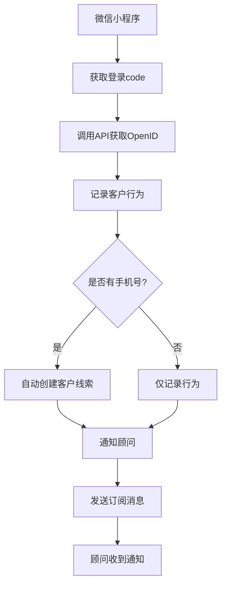
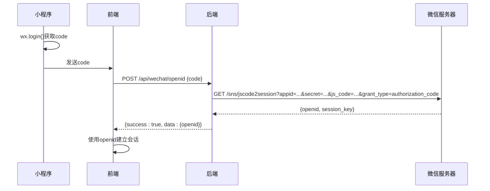
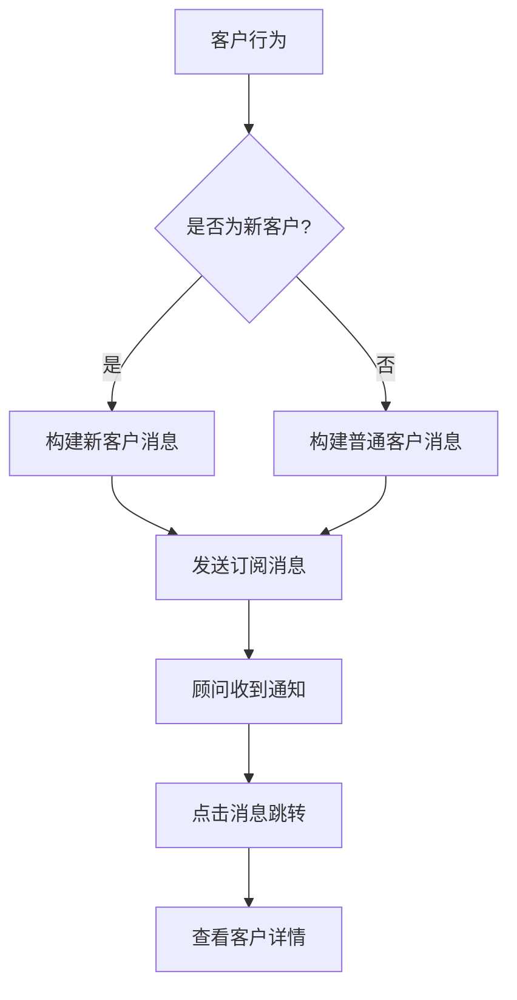

<docs>
# 微信小程序集成

<cite>
**本文档引用的文件**
- [WECHAT_API_DOCUMENTATION.md](file://WECHAT_API_DOCUMENTATION.md)
- [weixin.module.ts](file://backend/src/modules/weixin/weixin.module.ts)
- [weixin.controller.ts](file://backend/src/modules/weixin/weixin.controller.ts)
- [weixin.service.ts](file://backend/src/modules/weixin/weixin.service.ts)
- [customer-lead.service.ts](file://backend/src/modules/weixin/services/customer-lead.service.ts)
- [get-openid.dto.ts](file://backend/src/modules/weixin/dto/get-openid.dto.ts)
- [advisor-subscribe.dto.ts](file://backend/src/modules/weixin/dto/advisor-subscribe.dto.ts)
- [customer-action.dto.ts](file://backend/src/modules/weixin/dto/customer-action.dto.ts)
- [send-message.dto.ts](file://backend/src/modules/weixin/dto/send-message.dto.ts)
- [Login.tsx](file://frontend/src/pages/Login.tsx)
- [test_weixin_api.js](file://test_weixin_api.js)
- [production.config.js](file://backend/src/config/production.config.js)
</cite>

## 目录
1. [简介](#简介)
2. [API接口](#api接口)
3. [认证流程](#认证流程)
4. [消息推送机制](#消息推送机制)
5. [前端集成方式](#前端集成方式)
6. [部署注意事项](#部署注意事项)
7. [常见问题解答](#常见问题解答)

## 简介

本文档详细说明了安得家政管理系统与微信小程序的集成方案。系统通过微信API实现了用户认证、客户行为记录、自动客户线索创建和订阅消息推送等功能，为家政服务顾问和客户提供无缝的移动端体验。

微信小程序集成主要包含以下几个核心功能：
- 通过微信登录获取用户OpenID进行身份认证
- 记录客户在小程序中的行为（如查看简历、联系顾问等）
- 根据客户行为自动创建客户线索
- 向已订阅的顾问发送实时通知消息

该集成方案采用NestJS后端框架，通过RESTful API与微信小程序进行通信，确保了系统的可维护性和扩展性。

**Section sources**
- [WECHAT_API_DOCUMENTATION.md](file://WECHAT_API_DOCUMENTATION.md#L1-L315)

## API接口

系统提供了四个核心API接口用于微信小程序集成：

### 1. 获取用户OpenID

**接口地址**: `POST /api/wechat/openid`

**功能**: 通过微信登录code获取用户的openid，作为用户在系统中的唯一标识。

**请求参数**:
```json
{
  "code": "微信登录code"
}
```

**响应示例**:
```json
{
  "success": true,
  "data": {
    "openid": "wx_openid_123456789"
  },
  "message": "获取openid成功",
  "timestamp": 1626342025123
}
```

### 2. 保存顾问订阅状态

**接口地址**: `POST /api/advisor/subscribe`

**功能**: 保存顾问的订阅消息授权状态，以便后续向其发送通知。

**请求参数**:
```json
{
  "advisorId": "顾问ID",
  "openid": "微信openid",
  "templateId": "订阅消息模板ID",
  "subscribed": true,
  "subscribeData": {
    "source": "miniprogram",
    "timestamp": "2024-01-01T12:00:00.000Z",
    "userAgent": {},
    "subscriptionStatus": "accept"
  }
}
```

### 3. 记录客户行为

**接口地址**: `POST /api/customer/action`

**功能**: 记录客户在小程序中的行为，支持自动创建客户线索。

**请求参数**:
```json
{
  "customerId": "客户openid",
  "advisorId": "顾问ID",
  "actionType": "view_resume",
  "actionData": {
    "resumeId": "简历ID",
    "timestamp": "2024-01-01T12:00:00.000Z"
  },
  "customerName": "客户姓名",
  "customerPhone": "客户电话"
}
```

### 4. 发送订阅消息

**接口地址**: `POST /api/message/send`

**功能**: 调用微信API发送订阅消息给顾问。

**请求参数**:
```json
{
  "touser": "接收者openid",
  "template_id": "订阅消息模板ID",
  "data": {
    "thing1": {"value": "客户张三查看了您的简历"},
    "time2": {"value": "2024-01-01 12:00:00"},
    "thing3": {"value": "138000138000"},
    "thing7": {"value": "张三"}
  },
  "page": "pages/customer/detail?id=customer_123",
  "miniprogram_state": "formal"
}
```



**Diagram sources**
- [weixin.controller.ts](file://backend/src/modules/weixin/weixin.controller.ts#L1-L261)
- [weixin.service.ts](file://backend/src/modules/weixin/weixin.service.ts#L1-L329)

**Section sources**
- [weixin.controller.ts](file://backend/src/modules/weixin/weixin.controller.ts#L1-L261)
- [weixin.service.ts](file://backend/src/modules/weixin/weixin.service.ts#L1-L329)
- [get-openid.dto.ts](file://backend/src/modules/weixin/dto/get-openid.dto.ts#L1-L10)
- [advisor-subscribe.dto.ts](file://backend/src/modules/weixin/dto/advisor-subscribe.dto.ts#L1-L29)
- [customer-action.dto.ts](file://backend/src/modules/weixin/dto/customer-action.dto.ts#L1-L55)
- [send-message.dto.ts](file://backend/src/modules/weixin/dto/send-message.dto.ts#L1-L31)

## 认证流程

微信小程序的认证流程基于微信的OAuth2.0授权机制，通过code换取用户openid，实现安全的身份认证。

### 认证流程步骤

1. **小程序端获取登录code**
   - 小程序调用`wx.login()`获取临时登录凭证code
   - code有效期为5分钟，只能使用一次

2. **调用后端API获取OpenID**
   - 小程序将code发送到后端`/api/wechat/openid`接口
   - 后端调用微信API `sns/jscode2session` 接口，使用AppID、AppSecret和code换取openid

3. **后端处理认证结果**
   - 成功：返回用户的openid
   - 失败：返回错误信息

4. **建立会话**
   - 前端使用获取到的openid与系统建立会话
   - 系统可基于openid识别用户身份

### 安全考虑

- **AppSecret保密**: AppSecret仅在后端存储，不暴露给前端
- **code一次性使用**: 每个code只能使用一次，防止重放攻击
- **HTTPS传输**: 所有API调用均通过HTTPS加密传输
- **输入验证**: 对所有请求参数进行严格验证



**Diagram sources**
- [weixin.service.ts](file://backend/src/modules/weixin/weixin.service.ts#L1-L329)
- [weixin.controller.ts](file://backend/src/modules/weixin/weixin.controller.ts#L1-L261)

**Section sources**
- [weixin.service.ts](file://backend/src/modules/weixin/weixin.service.ts#L1-L329)
- [weixin.controller.ts](file://backend/src/modules/weixin/weixin.controller.ts#L1-L261)
- [get-openid.dto.ts](file://backend/src/modules/weixin/dto/get-openid.dto.ts#L1-L10)

## 消息推送机制

系统实现了基于微信订阅消息的消息推送机制，当客户在小程序中进行特定行为时，会自动向相关顾问发送通知。

### 消息推送流程

1. **订阅状态管理**
   - 顾问在小程序中授权订阅消息
   - 系统保存顾问的订阅状态（openid、模板ID、订阅状态等）

2. **行为触发**
   - 客户在小程序中进行特定行为（如查看简历）
   - 小程序调用`/api/customer/action`记录行为

3. **消息构建**
   - 系统检查相关顾问的订阅状态
   - 根据客户是否为新客户构建不同的消息内容
   - 新客户：显示"新客户查看了您的简历"
   - 普通客户：显示"客户查看了您的简历"

4. **消息发送**
   - 调用微信`message/subscribe/send`接口发送订阅消息
   - 消息包含跳转链接，可直接进入客户详情页

### 消息内容增强

系统会根据客户状态自动调整消息内容：

**新客户行为**:
- `view_resume`: "新客户查看了您的简历"
- `contact_advisor`: "新客户想要联系您"
- `book_service`: "新客户预约了您的服务"

**普通客户行为**:
- `view_resume`: "客户查看了您的简历"
- `contact_advisor`: "客户想要联系您"
- `book_service`: "客户预约了您的服务"



**Diagram sources**
- [weixin.service.ts](file://backend/src/modules/weixin/weixin.service.ts#L1-L329)
- [customer-lead.service.ts](file://backend/src/modules/weixin/services/customer-lead.service.ts#L1-L139)

**Section sources**
- [weixin.service.ts](file://backend/src/modules/weixin/weixin.service.ts#L1-L329)
- [customer-lead.service.ts](file://backend/src/modules/weixin/services/customer-lead.service.ts#L1-L139)
- [send-message.dto.ts](file://backend/src/modules/weixin/dto/send-message.dto.ts#L1-L31)

## 前端集成方式

前端通过React框架实现，与微信小程序的集成主要通过API调用完成。

### 集成要点

1. **API服务封装**
   - 在`services`目录下封装API调用
   - 统一处理请求、响应和错误

2. **页面组件集成**
   - 在相关页面组件中调用微信API
   - 如在简历页面集成"查看简历"行为记录

3. **状态管理**
   - 使用React Context管理用户认证状态
   - 在`contexts/AuthContext.tsx`中实现

### 登录页面示例

```typescript
// frontend/src/pages/Login.tsx
import React, { useState } from 'react';
import { useNavigate } from 'react-router-dom';
import { Alert, App } from 'antd';
import { LockOutlined, UserOutlined } from '@ant-design/icons';
import { LoginForm, ProFormText, ProFormCheckbox } from '@ant-design/pro-form';
import { login as authLogin } from '../services/auth';
import { useAuth } from '../contexts/AuthContext';
import styles from './Login.module.css';

const LoginPage: React.FC = () => {
  const [loginError, setLoginError] = useState<string>('');
  const [loading, setLoading] = useState<boolean>(false);
  const navigate = useNavigate();
  const { login: setUserAuth } = useAuth();
  const { message } = App.useApp();

  const handleSubmit = async (values: { username: string; password: string; remember: boolean }) => {
    try {
      setLoading(true);
      setLoginError('');
      
      // 调用登录API，authLogin 内部会处理 token 和用户信息的存储
      const response = await authLogin(values.username, values.password);
      
      // 更新 AuthContext
      setUserAuth(response.user);
      
      // 显示成功消息
      message.success('登录成功');
      
      // 跳转到仪表板
      navigate('/dashboard', { replace: true });
    } catch (error: any) {
      console.error('登录失败:', error);
      // 显示具体的错误消息
      setLoginError(error.message || '登录失败，请稍后重试');
    } finally {
      setLoading(false);
    }
  };

  return (
    <div className={styles.container}>
      <div className={styles.content}>
        <div className={styles.top}>
        <h1 className={styles.title}>安得家政管理系统</h1>
        </div>
        <div className={styles.loginCard}>
        {loginError && (
          <Alert
            message="登录失败"
            description={loginError}
            type="error"
            showIcon
            style={{ marginBottom: 24 }}
          />
        )}
        <LoginForm
          onFinish={handleSubmit}
          submitter={{
            searchConfig: {
              submitText: '登录',
            },
            submitButtonProps: {
              loading: loading,
              style: {
                width: '100%',
              },
            },
          }}
            style={{
              resize: 'none',
              overflow: 'hidden',
              userSelect: 'none',
            }}
            className={styles.noResizeForm}
        >
          <ProFormText
            name="username"
            fieldProps={{
              size: 'large',
              prefix: <UserOutlined />,
            }}
            placeholder="用户名"
            rules={[
              {
                required: true,
                message: '请输入用户名',
              },
            ]}
          />
          <ProFormText.Password
            name="password"
            fieldProps={{
              size: 'large',
              prefix: <LockOutlined />,
            }}
            placeholder="密码"
            rules={[
              {
                required: true,
                message: '请输入密码',
              },
            ]}
          />
          <ProFormCheckbox name="remember" valuePropName="checked">
            记住我
          </ProFormCheckbox>
        </LoginForm>
        </div>
      </div>
    </div>
  );
};

export default LoginPage;
```

**Section sources**
- [Login.tsx](file://frontend/src/pages/Login.tsx#L1-L116)

## 部署注意事项

### 环境变量配置

必须在生产环境中正确配置以下环境变量：

```env
# 微信小程序配置
WECHAT_APP_ID=wx49e364f40a26e5a9
WECHAT_APP_SECRET=your_app_secret_here

# 服务器配置
API_PORT=3001
API_HOST=0.0.0.0
CORS_ORIGIN=https://your-frontend-domain.com

# 数据库配置
DB_HOST=localhost
DB_PORT=5432
DB_NAME=andejiazheng_crm_prod
DB_USERNAME=crm_user
DB_PASSWORD=your_db_password

# JWT配置
JWT_SECRET=your_jwt_secret_key
JWT_EXPIRES_IN=24h

# Redis配置
REDIS_HOST=localhost
REDIS_PORT=6379
REDIS_PASSWORD=your_redis_password
REDIS_DB=0

# 会话配置
SESSION_SECRET=your_session_secret_key
```

### 部署步骤

1. **配置环境变量**
   - 在生产服务器上设置所有必要的环境变量
   - 确保AppSecret等敏感信息不暴露在代码中

2. **启动后端服务**
   ```bash
   cd backend
   npm run start:prod
   ```

3. **验证服务状态**
   - 访问健康检查接口 `/api/health`
   - 确保所有服务正常运行

4. **监控和日志**
   - 配置日志文件路径 `/var/log/andejiazheng-crm/`
   - 设置日志轮转策略
   - 监控关键指标（请求率、错误率等）

### 性能优化

1. **缓存机制**
   - access_token自动缓存和刷新
   - 使用Redis缓存频繁访问的数据

2. **异步处理**
   - 消息发送采用异步处理，不阻塞主流程
   - 使用队列系统处理耗时操作

3. **数据库优化**
   - 在手机号字段上建立索引，提高查询效率
   - 避免N+1查询问题

4. **