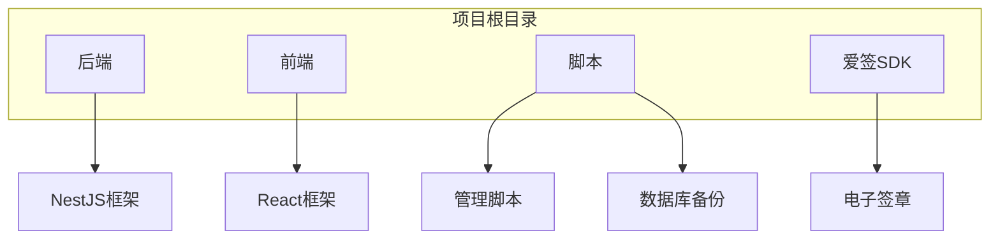

# 快速入门

<cite>
**本文档中引用的文件**   
- [README.md](file://README.md)
- [startup.sh](file://startup.sh)
- [ecosystem.config.js](file://ecosystem.config.js)
- [scripts/manage.sh](file://scripts/manage.sh)
- [scripts/db_backup.sh](file://scripts/db_backup.sh)
- [backend/src/main.ts](file://backend/src/main.ts)
- [frontend/src/main.tsx](file://frontend/src/main.tsx)
- [backend/package.json](file://backend/package.json)
- [frontend/package.json](file://frontend/package.json)
</cite>

## 目录
1. [简介](#简介)
2. [项目结构](#项目结构)
3. [前置依赖安装](#前置依赖安装)
4. [环境配置](#环境配置)
5. [系统启动](#系统启动)
6. [关键脚本解析](#关键脚本解析)
7. [端到端验证](#端到端验证)
8. [常见问题排查](#常见问题排查)
9. [总结](#总结)

## 简介

安得家政CRM系统是一个基于PM2的现代化家政服务管理平台，采用NestJS作为后端框架，React作为前端框架，MongoDB作为数据库。本快速入门指南旨在帮助新开发者在本地环境中成功搭建并运行该系统。文档将分步骤说明如何安装必要的依赖、配置环境变量、启动前后端服务，并提供常见问题的解决方案。

**Section sources**
- [README.md](file://README.md#L0-L64)

## 项目结构

安得家政CRM系统的项目结构清晰，分为后端、前端、脚本和SDK四个主要部分。后端使用NestJS框架，前端使用React框架，脚本目录包含各种管理脚本，SDK目录包含第三方服务的集成代码。



**Diagram sources**
- [README.md](file://README.md#L0-L64)

**Section sources**
- [README.md](file://README.md#L0-L64)

## 前置依赖安装

在开始搭建安得家政CRM系统之前，需要安装以下前置依赖：Node.js、MongoDB和Docker。

### Node.js安装

Node.js是运行NestJS和React应用的基础。建议使用Node.js 18.x或更高版本。

```bash
# 使用nvm安装Node.js
curl -o- https://raw.githubusercontent.com/nvm-sh/nvm/v0.39.0/install.sh | bash
source ~/.bashrc
nvm install 18
nvm use 18
nvm alias default 18
```

### MongoDB安装

MongoDB是安得家政CRM系统的数据库。可以通过以下命令安装MongoDB。

```bash
# Ubuntu系统安装MongoDB
sudo apt-get update
sudo apt-get install -y mongodb-org
sudo systemctl start mongod
sudo systemctl enable mongod
```

### Docker安装

Docker用于容器化部署，虽然本系统主要使用PM2进行进程管理，但Docker可以用于部署第三方服务。

```bash
# Ubuntu系统安装Docker
sudo apt-get update
sudo apt-get install -y docker.io
sudo systemctl start docker
sudo systemctl enable docker
```

**Section sources**
- [README.md](file://README.md#L0-L64)

## 环境配置

安得家政CRM系统通过环境变量进行配置。虽然项目中没有直接的.env文件，但配置信息通过PM2的ecosystem.config.js文件和部署脚本进行管理。

### PM2配置文件

PM2的配置文件ecosystem.config.js定义了前后端服务的启动参数，包括工作目录、脚本路径、环境变量等。

```javascript
module.exports = {
  apps: [
    // 后端生产环境
    {
      name: 'backend-prod',
      cwd: './backend',
      script: 'dist/main.js',
      env: {
        NODE_ENV: 'production',
        PORT: 3000
      },
      instances: 1,
      exec_mode: 'fork',
      max_memory_restart: '300M',
      error_file: '../logs/backend-prod-error.log',
      out_file: '../logs/backend-prod-out.log',
      log_date_format: 'YYYY-MM-DD HH:mm:ss',
      merge_logs: true,
      time: true,
      env_file: '.env'
    },
    // 后端开发环境
    {
      name: 'backend-dev',
      cwd: './backend',
      script: 'dist/main.js',
      watch: ['dist'],
      ignore_watch: ['node_modules', 'logs', 'uploads'],
      env: {
        NODE_ENV: 'development',
        PORT: 3001
      },
      instances: 1,
      exec_mode: 'fork',
      max_memory_restart: '300M',
      error_file: '../logs/backend-dev-error.log',
      out_file: '../logs/backend-dev-out.log',
      log_date_format: 'YYYY-MM-DD HH:mm:ss',
      merge_logs: true,
      time: true,
      env_file: '.env.dev'
    },
    // 前端生产环境
    {
      name: 'frontend-prod',
      cwd: './frontend',
      script: 'npm',
      args: 'run start:prod',
      env: {
        NODE_ENV: 'production',
        PORT: 8080
      },
      instances: 1,
      exec_mode: 'fork',
      max_memory_restart: '200M',
      error_file: '../logs/frontend-prod-error.log',
      out_file: '../logs/frontend-prod-out.log',
      log_date_format: 'YYYY-MM-DD HH:mm:ss',
      merge_logs: true,
      time: true
    },
    // 前端开发环境
    {
      name: 'frontend-dev',
      cwd: './frontend',
      script: 'npm',
      args: 'run dev -- --port 5173 --host',
      env: {
        NODE_ENV: 'development',
        PORT: 5173,
        VITE_API_BASE_URL: 'http://localhost:3001/api'
      },
      instances: 1,
      exec_mode: 'fork',
      max_memory_restart: '200M',
      error_file: '../logs/frontend-dev-error.log',
      out_file: '../logs/frontend-dev-out.log',
      log_date_format: 'YYYY-MM-DD HH:mm:ss',
      merge_logs: true,
      time: true
    }
  ]
};
```

**Diagram sources**
- [ecosystem.config.js](file://ecosystem.config.js#L0-L82)

**Section sources**
- [ecosystem.config.js](file://ecosystem.config.js#L0-L82)

## 系统启动

安得家政CRM系统提供了多种启动方式，包括开发模式和生产模式。

### 开发模式启动

在开发模式下，前后端服务会以开发环境配置启动，支持热重载和详细日志输出。

```bash
# 启动开发环境
./scripts/manage.sh start

# 查看服务状态
./scripts/manage.sh status

# 查看日志
./scripts/manage.sh logs
```

### 生产模式启动

在生产模式下，前后端服务会以生产环境配置启动，优化性能和安全性。

```bash
# 构建项目
./scripts/manage.sh build

# 部署项目
./scripts/manage.sh deploy
```

### 直接启动脚本

除了使用管理脚本，还可以直接使用PM2启动服务。

```bash
# 直接启动所有服务
pm2 start ecosystem.config.js

# 启动后端开发环境
pm2 start ecosystem.config.js --only backend-dev

# 启动前端开发环境
pm2 start ecosystem.config.js --only frontend-dev
```

**Section sources**
- [scripts/manage.sh](file://scripts/manage.sh#L0-L109)
- [ecosystem.config.js](file://ecosystem.config.js#L0-L82)

## 关键脚本解析

### startup.sh脚本

startup.sh脚本是系统的启动入口，负责记录启动时间、切换工作目录并使用PM2启动所有应用。

```bash
#!/bin/bash

# 记录启动时间
echo "启动脚本运行于 $(date)" >> logs/startup.log

# 确保目录存在
cd 

# 使用PM2启动所有应用
echo "正在启动所有应用..." >> logs/startup.log
pm2 start ecosystem.config.js

# 保存PM2进程列表
echo "保存PM2进程列表..." >> logs/startup.log
pm2 save

echo "启动脚本完成!" >> logs/startup.log 
```

**Section sources**
- [startup.sh](file://startup.sh#L0-L16)

### manage.sh脚本

manage.sh脚本是系统的管理入口，提供了启动、停止、重启、查看状态和日志等常用命令。

```bash
#!/bin/bash

# 安得家政CRM项目管理脚本
# 使用方法: ./scripts/manage.sh [start|stop|restart|status|logs|clean]

set -e

PROJECT_ROOT=""
cd "$PROJECT_ROOT"

case "$1" in
  start)
    echo "🚀 启动所有服务..."
    pm2 start ecosystem.config.js
    echo "✅ 所有服务已启动"
    pm2 list
    ;;
  
  stop)
    echo "🛑 停止所有服务..."
    pm2 stop ecosystem.config.js
    echo "✅ 所有服务已停止"
    ;;
  
  restart)
    echo "🔄 重启所有服务..."
    pm2 restart ecosystem.config.js
    echo "✅ 所有服务已重启"
    pm2 list
    ;;
  
  status)
    echo "📊 服务状态："
    pm2 list
    echo ""
    echo "📈 服务监控："
    pm2 monit
    ;;
  
  logs)
    if [ -n "$2" ]; then
      echo "📋 查看 $2 服务日志："
      pm2 logs "$2" --lines 50
    else
      echo "📋 查看所有服务日志："
      pm2 logs --lines 20
    fi
    ;;
  
  clean)
    echo "🧹 清理冗余进程和日志..."
    
    # 停止可能冲突的独立MongoDB
    sudo pkill -f "mongod.*--dbpath.*--logpath" || true
    
    # 清理旧日志
    find logs/ -name "*.log" -mtime +7 -delete 2>/dev/null || true
    
    # 重新加载PM2配置
    pm2 delete all || true
    pm2 start ecosystem.config.js
    
    echo "✅ 清理完成"
    ;;
  
  build)
    echo "🔨 构建项目..."
    
    # 构建后端
    echo "构建后端..."
    cd backend && npm run build && cd ..
    
    # 构建前端
    echo "构建前端..."
    cd frontend && npm run build && cd ..
    
    echo "✅ 构建完成"
    ;;
  
  deploy)
    echo "🚀 部署项目..."
    
    # 构建
    ./scripts/manage.sh build
    
    # 重启服务
    ./scripts/manage.sh restart
    
    echo "✅ 部署完成"
    ;;
  
  *)
    echo "用法: $0 {start|stop|restart|status|logs|clean|build|deploy}"
    echo ""
    echo "命令说明："
    echo "  start    - 启动所有服务"
    echo "  stop     - 停止所有服务"
    echo "  restart  - 重启所有服务"
    echo "  status   - 查看服务状态和监控"
    echo "  logs     - 查看日志 (可指定服务名)"
    echo "  clean    - 清理冗余进程和旧日志"
    echo "  build    - 构建前后端项目"
    echo "  deploy   - 完整部署 (构建+重启)"
    echo ""
    echo "示例："
    echo "  $0 logs backend    # 查看后端日志"
    echo "  $0 status          # 查看所有服务状态"
    exit 1
    ;;
esac 
```

**Section sources**
- [scripts/manage.sh](file://scripts/manage.sh#L0-L109)

## 端到端验证

为了验证环境配置的正确性，可以通过创建一个测试客户来测试系统的功能。

### 创建测试客户

1. 启动前后端服务
2. 打开浏览器，访问`http://localhost:5173`
3. 登录系统
4. 导航到客户管理页面
5. 点击“创建客户”按钮
6. 填写客户信息并保存

### 验证API调用

可以通过curl命令直接调用API来验证后端服务是否正常工作。

```bash
# 创建客户
curl -X POST http://localhost:3001/api/customers \
  -H "Content-Type: application/json" \
  -d '{
    "name": "测试客户",
    "phone": "13800138000",
    "address": "测试地址"
  }'

# 查询客户
curl http://localhost:3001/api/customers
```

**Section sources**
- [backend/src/main.ts](file://backend/src/main.ts#L0-L89)
- [frontend/src/main.tsx](file://frontend/src/main.tsx#L0-L30)

## 常见问题排查

### 端口冲突

如果启动服务时出现端口冲突，可以检查端口占用情况并释放端口。

```bash
# 检查端口占用
lsof -i :3000
lsof -i :5173

# 释放端口
kill -9 <PID>
```

### 数据库连接失败

如果数据库连接失败，可以检查MongoDB服务是否正常运行。

```bash
# 检查MongoDB服务状态
sudo systemctl status mongod

# 启动MongoDB服务
sudo systemctl start mongod
```

### 依赖安装错误

如果依赖安装失败，可以尝试清理缓存并重新安装。

```bash
# 清理npm缓存
npm cache clean --force

# 删除node_modules并重新安装
rm -rf node_modules package-lock.json
npm install
```

**Section sources**
- [scripts/db_backup.sh](file://scripts/db_backup.sh#L0-L226)

## 总结

本快速入门指南详细介绍了如何在本地环境中搭建和运行安得家政CRM系统。通过安装必要的依赖、配置环境变量、启动前后端服务，并进行端到端验证，可以确保系统正常运行。同时，提供了常见问题的解决方案，帮助开发者快速解决遇到的问题。

**Section sources**
- [README.md](file://README.md#L0-L64)
- [startup.sh](file://startup.sh#L0-L16)
- [ecosystem.config.js](file://ecosystem.config.js#L0-L82)
- [scripts/manage.sh](file://scripts/manage.sh#L0-L109)
- [scripts/db_backup.sh](file://scripts/db_backup.sh#L0-L226)
- [backend/src/main.ts](file://backend/src/main.ts#L0-L89)
- [frontend/src/main.tsx](file://frontend/src/main.tsx#L0-L30)
- [backend/package.json](file://backend/package.json#L0-L120)
- [frontend/package.json](file://frontend/package.json#L0-L70)