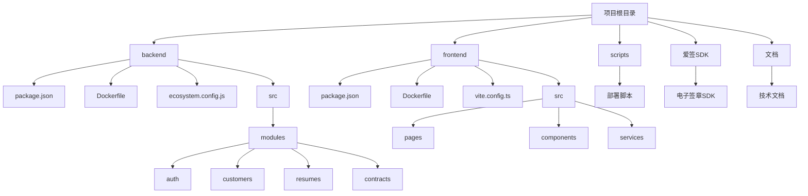

# 技术栈

<cite>
**本文档引用的文件**  
- [package.json](file://backend/package.json)
- [package.json](file://frontend/package.json)
- [Dockerfile](file://backend/Dockerfile)
- [Dockerfile](file://frontend/Dockerfile)
- [ecosystem.config.js](file://backend/ecosystem.config.js)
- [tsconfig.json](file://backend/tsconfig.json)
- [tsconfig.json](file://frontend/tsconfig.json)
- [main.ts](file://backend/src/main.ts)
- [API_SPEC.md](file://backend/src/docs/API_SPEC.md)
- [vite.config.ts](file://frontend/vite.config.ts)
</cite>

## 目录
1. [项目结构](#项目结构)
2. [后端技术栈](#后端技术栈)
3. [前端技术栈](#前端技术栈)
4. [TypeScript 配置](#typescript-配置)
5. [NestJS 框架应用](#nestjs-框架应用)
6. [Mongoose 与 MongoDB 集成](#mongoose-与-mongodb-集成)
7. [Ant Design 组件库](#ant-design-组件库)
8. [Swagger API 文档](#swagger-api-文档)
9. [PM2 进程管理](#pm2-进程管理)
10. [Docker 容器化部署](#docker-容器化部署)
11. [技术选型分析](#技术选型分析)
12. [新开发者入门指引](#新开发者入门指引)

## 项目结构

本项目采用前后端分离的架构，主要分为 `backend` 和 `frontend` 两个核心目录，分别存放后端服务和前端应用的代码。



**图示来源**  
- [backend/package.json](file://backend/package.json)
- [frontend/package.json](file://frontend/package.json)

## 后端技术栈

后端基于 Node.js 构建，采用 NestJS 框架作为核心架构，结合 MongoDB 作为数据存储，形成现代化的全栈 JavaScript 解决方案。

### 核心依赖

根据 `backend/package.json` 文件，后端主要依赖包括：

- **NestJS 生态**：`@nestjs/core`, `@nestjs/common`, `@nestjs/platform-express`
- **数据库**：`mongoose` (v8.16.1), `@nestjs/mongoose` (v11.0.3)
- **安全与认证**：`@nestjs/jwt`, `@nestjs/passport`, `bcrypt`
- **API 文档**：`@nestjs/swagger` (v8.1.1)
- **文件处理**：`multer`, `sharp`, `cos-nodejs-sdk-v5` (腾讯云 COS)
- **OCR 服务**：`tencentcloud-sdk-nodejs-ocr` (腾讯云 OCR)
- **工具库**：`axios`, `class-validator`, `class-transformer`, `uuid`

### 版本信息

- **Node.js**: 基于 Dockerfile 使用 `node:18` 镜像
- **NestJS**: v10.4.17
- **MongoDB**: 通过 Mongoose 驱动
- **TypeScript**: v4.9.5

**章节来源**  
- [backend/package.json](file://backend/package.json#L1-L120)

## 前端技术栈

前端采用 React + Vite 的现代化开发架构，结合 Ant Design 组件库，构建高性能、响应式的管理界面。

### 核心依赖

根据 `frontend/package.json` 文件，前端主要依赖包括：

- **框架**：`react` (v18.3.1), `react-dom`
- **构建工具**：`vite` (v4.5.14)
- **UI 组件库**：`antd` (v5.11.1), `@ant-design/pro-components`
- **状态管理**：`@reduxjs/toolkit`, `react-redux`
- **路由**：`react-router-dom` (v6.18.0)
- **表单处理**：`formik`, `yup`
- **HTTP 客户端**：`axios`
- **工具库**：`lodash`, `dayjs`, `jwt-decode`

### 版本信息

- **React**: v18.3.1
- **Vite**: v4.5.14
- **TypeScript**: v5.0.2
- **Ant Design**: v5.11.1

**章节来源**  
- [frontend/package.json](file://frontend/package.json#L1-L70)

## TypeScript 配置

项目在前后端均采用 TypeScript 以提升代码质量和可维护性，配置文件分别位于 `tsconfig.json`。

### 后端 TypeScript 配置

```json
{
  "compilerOptions": {
    "module": "CommonJS",
    "target": "ES2021",
    "outDir": "./dist",
    "baseUrl": "./",
    "paths": {
      "@auth/*": ["src/modules/auth/*"],
      "@follow-up/*": ["src/modules/follow-up/*"],
      "@resume/*": ["src/modules/resume/*"],
      "@users/*": ["src/modules/users/*"]
    },
    "emitDecoratorMetadata": true,
    "experimentalDecorators": true,
    "esModuleInterop": true,
    "skipLibCheck": true
  },
  "include": ["src/**/*"],
  "exclude": ["node_modules", "dist"]
}
```

关键配置说明：
- **模块系统**: 使用 `CommonJS`，兼容 Node.js 环境
- **装饰器支持**: 启用 `emitDecoratorMetadata` 和 `experimentalDecorators`，支持 NestJS 的依赖注入和元数据
- **路径别名**: 通过 `paths` 配置，使用 `@auth/*` 等别名简化模块导入
- **目标版本**: 编译为 `ES2021`，平衡新特性与兼容性

### 前端 TypeScript 配置

```json
{
  "compilerOptions": {
    "target": "ESNext",
    "module": "ESNext",
    "lib": ["DOM", "DOM.Iterable", "ESNext"],
    "baseUrl": ".",
    "paths": {
      "@/*": ["src/*"]
    },
    "moduleResolution": "node",
    "strict": true,
    "esModuleInterop": true
  },
  "include": ["src/**/*"],
  "exclude": ["node_modules"]
}
```

关键配置说明：
- **模块系统**: 使用 `ESNext`，充分发挥 Vite 的 ESM 优势
- **严格模式**: 启用 `strict`，提高类型安全性
- **路径别名**: 使用 `@/*` 指向 `src/` 目录，简化导入路径
- **目标版本**: 编译为 `ESNext`，由 Vite 负责兼容性处理

**章节来源**  
- [backend/tsconfig.json](file://backend/tsconfig.json#L1-L30)
- [frontend/tsconfig.json](file://frontend/tsconfig.json#L1-L32)

## NestJS 框架应用

NestJS 是一个基于 TypeScript 的渐进式 Node.js 框架，采用模块化、依赖注入和面向切面编程的设计理念。

### 应用初始化

`main.ts` 是应用的入口文件，负责创建 NestJS 应用实例并配置全局设置。

```typescript
async function bootstrap() {
  const app = await NestFactory.create(AppModule);
  
  // 全局CORS配置
  app.enableCors();
  
  // 全局前缀
  app.setGlobalPrefix('api');
  
  // 全局拦截器和过滤器
  app.useGlobalInterceptors(new ApiResponseInterceptor());
  app.useGlobalFilters(new HttpExceptionFilter());
  
  // 全局验证管道
  app.useGlobalPipes(new ValidationPipe({
    whitelist: true,
    transform: true
  }));
  
  // Swagger文档
  const document = SwaggerModule.createDocument(app, config);
  SwaggerModule.setup('api/docs', app, document);
  
  await app.listen(3000);
}
```

### 核心特性

- **模块化架构**: 通过 `@Module` 装饰器组织代码，如 `AuthModule`, `CustomersModule`
- **依赖注入**: 使用 `@Injectable` 和构造函数注入实现松耦合
- **控制器与服务分离**: `Controller` 处理 HTTP 请求，`Service` 封装业务逻辑
- **中间件与拦截器**: 实现日志、性能监控、响应格式化等功能
- **异常过滤器**: 统一处理异常，返回标准化错误响应

**章节来源**  
- [backend/src/main.ts](file://backend/src/main.ts#L1-L90)

## Mongoose 与 MongoDB 集成

项目采用 Mongoose 作为 MongoDB 的 ODM（对象文档映射）工具，通过 `@nestjs/mongoose` 模块实现与 NestJS 的无缝集成。

### 集成方式

1. **模块注册**: 在 `AppModule` 或功能模块中通过 `MongooseModule.forFeature()` 注册模型
2. **Schema 定义**: 在 `models` 目录下定义 Mongoose Schema
3. **实体注入**: 在 Service 中通过 `@InjectModel()` 注入模型

### 示例：简历模型

```typescript
// src/modules/resume/models/resume.entity.ts
import { Prop, Schema, SchemaFactory } from '@nestjs/mongoose';
import { Document } from 'mongoose';

@Schema({ timestamps: true })
export class Resume extends Document {
  @Prop({ required: true })
  name: string;

  @Prop({ required: true, unique: true })
  phone: string;

  @Prop()
  age: number;

  // 其他字段...
}

export const ResumeSchema = SchemaFactory.createForClass(Resume);
```

### 优势分析

- **灵活性**: MongoDB 的文档模型非常适合简历、客户等半结构化数据
- **扩展性**: 易于水平扩展，支持海量数据存储
- **开发效率**: 无需复杂的表结构设计和迁移，快速迭代
- **地理空间查询**: 支持地理位置索引，适用于家政服务的区域匹配

**章节来源**  
- [backend/package.json](file://backend/package.json#L30-L35)
- [backend/src/modules/resume/models/resume.entity.ts](file://backend/src/modules/resume/models/resume.entity.ts)

## Ant Design 组件库

前端采用 Ant Design 作为 UI 组件库，提供丰富、美观且功能强大的 React 组件。

### 应用场景

- **表单组件**: `Form`, `Input`, `Select`, `DatePicker` 用于简历、客户信息录入
- **表格组件**: `Table` 用于展示简历列表、客户列表
- **布局组件**: `Layout`, `Card`, `Row`, `Col` 构建页面布局
- **导航组件**: `Menu`, `Breadcrumb` 实现页面导航
- **反馈组件**: `Modal`, `Message`, `Notification` 提供用户交互反馈

### Pro Components

项目还使用了 `@ant-design/pro-components`，提供更高阶的封装：

- **ProTable**: 带搜索、分页、列设置的高级表格
- **ProForm**: 带校验、布局的高级表单
- **ProCard**: 带标题、操作区的卡片容器

### 优势

- **企业级设计**: 符合企业级应用的设计规范
- **开箱即用**: 组件功能完整，减少重复开发
- **主题定制**: 支持主题定制，满足品牌需求
- **国际化**: 内置多语言支持

**章节来源**  
- [frontend/package.json](file://frontend/package.json#L10-L12)

## Swagger API 文档

项目集成 Swagger 以自动生成和展示 API 文档，提高开发效率和接口可维护性。

### 集成配置

在 `main.ts` 中配置 Swagger：

```typescript
const config = new DocumentBuilder()
  .setTitle('安得家政CRM API')
  .setDescription('家政服务管理系统API文档')
  .setVersion('1.0')
  .build();
const document = SwaggerModule.createDocument(app, config);
SwaggerModule.setup('api/docs', app, document);
```

### 文档规范

`API_SPEC.md` 文件定义了统一的响应格式：

```json
{
  "success": true,
  "data": {},
  "message": "操作成功",
  "error": {},
  "timestamp": 1626342025123
}
```

### 访问地址

- **开发环境**: `http://localhost:3001/api/docs`
- **生产环境**: `http://localhost:3000/api/docs`

### 优势

- **自动化**: 减少手动编写文档的工作量
- **实时性**: 文档与代码同步更新
- **测试功能**: 提供在线 API 测试界面
- **标准化**: 统一接口规范，便于团队协作

**章节来源**  
- [backend/src/main.ts](file://backend/src/main.ts#L60-L70)
- [backend/src/docs/API_SPEC.md](file://backend/src/docs/API_SPEC.md#L1-L245)

## PM2 进程管理

PM2 是 Node.js 的进程管理工具，用于确保后端服务的稳定运行。

### 配置文件

`ecosystem.config.js` 定义了开发和生产环境的启动配置：

```javascript
module.exports = {
  apps: [
    {
      name: 'backend-dev',
      script: 'dist/main.js',
      watch: true,
      env_development: {
        NODE_ENV: 'development',
        PORT: 3001
      },
      max_memory_restart: '300M',
      log_date_format: 'YYYY-MM-DD HH:mm:ss'
    },
    {
      name: 'backend-prod',
      script: 'dist/main.js',
      env_production: {
        NODE_ENV: 'production',
        PORT: 3000
      },
      max_memory_restart: '300M',
      exec_mode: 'fork'
    }
  ]
};
```

### 启动脚本

`package.json` 中定义了 PM2 启动命令：

```json
"scripts": {
  "start:dev": "pm2 start ecosystem.config.js --only backend-dev",
  "start:prod": "pm2 start ecosystem.config.js --only backend-prod",
  "stop:dev": "pm2 stop backend-dev",
  "restart:dev": "pm2 restart backend-dev"
}
```

### 功能优势

- **进程守护**: 自动重启崩溃的进程
- **内存监控**: 达到内存上限时自动重启
- **日志管理**: 集中管理应用日志
- **多实例**: 支持集群模式，提高性能
- **环境隔离**: 区分开发、生产环境配置

**章节来源**  
- [backend/ecosystem.config.js](file://backend/ecosystem.config.js#L1-L57)
- [backend/package.json](file://backend/package.json#L6-L15)

## Docker 容器化部署

项目通过 Docker 实现容器化部署，确保开发、测试、生产环境的一致性。

### 后端 Dockerfile

```dockerfile
# 构建阶段
FROM node:18 AS builder
WORKDIR /app
COPY package*.json ./
RUN npm install --legacy-peer-deps
COPY . .
RUN npm run build

# 生产阶段
FROM node:18 AS production
WORKDIR /app
COPY package*.json ./
RUN npm install --only=production --legacy-peer-deps
COPY --from=builder /app/dist ./dist
COPY --from=builder /app/node_modules ./node_modules
COPY --from=builder /app/.env ./.env
EXPOSE 3000
HEALTHCHECK --interval=30s --timeout=10s --start-period=5s --retries=3 \
    CMD curl -f http://localhost:3000/api/health || exit 1
CMD ["node", "dist/main"]
```

### 前端 Dockerfile

```dockerfile
FROM node:18-alpine as builder
WORKDIR /app
COPY package*.json ./
RUN npm install --legacy-peer-deps
COPY . .
RUN npm run build

FROM nginx:alpine
COPY --from=builder /app/dist /usr/share/nginx/html
COPY nginx.conf /etc/nginx/conf.d/default.conf
EXPOSE 80
CMD ["nginx", "-g", "daemon off;"]
```

### 部署优势

- **环境一致性**: 避免"在我机器上能运行"的问题
- **快速部署**: 一键部署，减少配置时间
- **资源隔离**: 容器间资源隔离，提高安全性
- **可扩展性**: 易于横向扩展，支持微服务架构
- **健康检查**: 内置健康检查机制，确保服务可用性

**章节来源**  
- [backend/Dockerfile](file://backend/Dockerfile#L1-L51)
- [frontend/Dockerfile](file://frontend/Dockerfile#L1-L27)

## 技术选型分析

### 为何选择 MongoDB 而非关系型数据库

1. **数据模型灵活性**:
   - 家政 CRM 系统中的简历、客户信息具有半结构化特征
   - 不同阿姨的技能、证书、工作经历差异大，关系型数据库需要频繁修改表结构
   - MongoDB 的文档模型天然支持这种灵活性

2. **开发效率**:
   - 无需预先定义严格的表结构和外键关系
   - 快速迭代，适应业务需求变化
   - 减少数据库迁移的复杂性

3. **性能优势**:
   - 对于读多写少的场景（如简历查询），MongoDB 性能优异
   - 支持地理空间索引，便于实现"附近阿姨"等功能
   - 内嵌文档减少 JOIN 操作，提高查询效率

4. **扩展性**:
   - 易于水平扩展，支持海量数据存储
   - 适合未来业务规模扩大

### 技术组合优势

| 技术 | 优势 |
|------|------|
| NestJS | 模块化、依赖注入、TypeScript 支持，提高代码质量和可维护性 |
| React + Vite | 快速开发、热更新、现代构建工具，提升开发体验 |
| Ant Design | 企业级 UI 组件，快速构建专业界面 |
| Mongoose | MongoDB ODM，简化数据库操作 |
| Swagger | 自动生成 API 文档，提高协作效率 |
| PM2 | 进程守护，确保服务稳定性 |
| Docker | 环境一致性，简化部署 |

## 新开发者入门指引

### 学习资源

- **NestJS**: [https://docs.nestjs.com](https://docs.nestjs.com) - 官方文档，包含教程和 API 参考
- **React**: [https://react.dev](https://react.dev) - React 官方文档
- **Vite**: [https://vitejs.dev](https://vitejs.dev) - 现代化构建工具文档
- **Ant Design**: [https://ant.design](https://ant.design) - UI 组件库文档
- **MongoDB**: [https://www.mongodb.com/docs](https://www.mongodb.com/docs) - 数据库官方文档
- **TypeScript**: [https://www.typescriptlang.org/docs](https://www.typescriptlang.org/docs) - TypeScript 学习指南

### 最佳实践建议

1. **代码规范**:
   - 遵循项目现有的代码风格
   - 使用 ESLint 和 Prettier 保持代码一致性
   - 编写清晰的 Git 提交信息

2. **开发流程**:
   - 先阅读相关模块的文档和代码
   - 在开发分支上进行修改
   - 提交前运行测试 `npm run test`
   - 通过 PR 进行代码审查

3. **调试技巧**:
   - 使用 `console.log` 或调试器进行前端调试
   - 查看 PM2 日志 `npm run logs:dev`
   - 利用 Swagger 文档测试 API

4. **安全注意事项**:
   - 不要在代码中硬编码敏感信息
   - 验证所有用户输入
   - 遵循最小权限原则

5. **性能优化**:
   - 前端：使用 React.memo、useCallback 优化渲染
   - 后端：为常用查询字段创建索引
   - 数据库：定期清理无用数据

通过遵循这些指引，新开发者可以快速上手项目，为家政 CRM 系统的持续发展做出贡献。