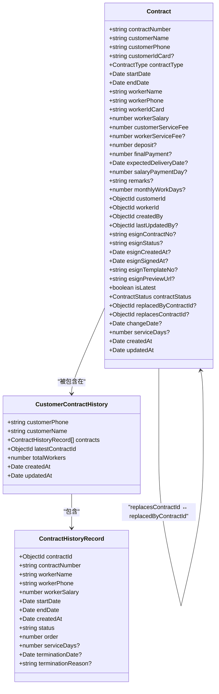
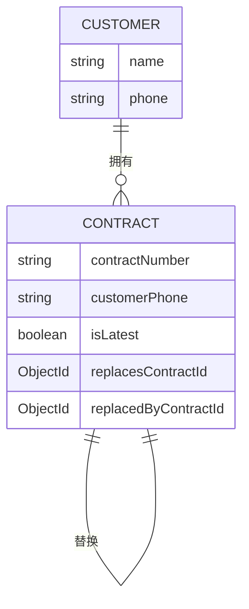
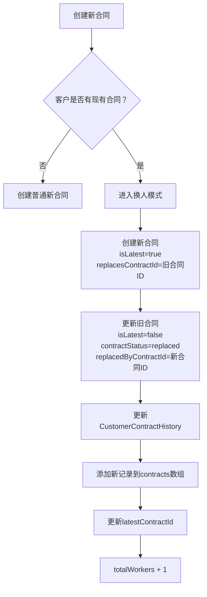
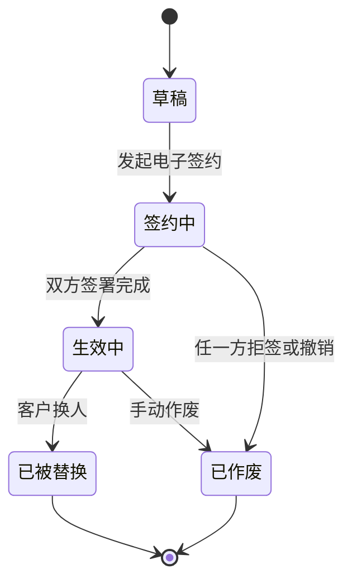

# 合同数据模型

<cite>
**本文档引用的文件**
- [contract.model.ts](file://backend/src/modules/contracts/models/contract.model.ts)
- [customer-contract-history.model.ts](file://backend/src/modules/contracts/models/customer-contract-history.model.ts)
- [contracts.service.ts](file://backend/src/modules/contracts/contracts.service.ts)
- [deployment-checklist.md](file://deployment-checklist.md)
</cite>

## 目录
1. [引言](#引言)
2. [核心数据结构分析](#核心数据结构分析)
3. [合同实体字段详解](#合同实体字段详解)
4. [客户与合同的关联关系](#客户与合同的关联关系)
5. [合同历史记录与版本控制](#合同历史记录与版本控制)
6. [合同状态机设计](#合同状态机设计)
7. [索引设计与性能优化](#索引设计与性能优化)
8. [数据一致性保障机制](#数据一致性保障机制)
9. [电子签约模块集成](#电子签约模块集成)
10. [典型查询用例与性能建议](#典型查询用例与性能建议)

## 引言
本文档深入分析了安得家政CRM系统中的合同数据模型，重点围绕`contract.model.ts`和`customer-contract-history.model.ts`两个核心文件。文档详细阐述了合同实体的核心字段、客户与合同的关联关系、合同历史记录的版本控制机制以及合同状态机的设计。同时，文档还涵盖了索引设计、数据一致性保障措施以及与爱签电子签约平台的集成点，为系统维护和性能优化提供指导。

## 核心数据结构分析

本文档的核心是`Contract`和`CustomerContractHistory`两个数据模型，它们共同构成了合同管理的基石。`Contract`模型代表单个合同实例，而`CustomerContractHistory`模型则用于聚合一个客户的所有合同历史，提供全局视图。

**图表来源**
- [contract.model.ts](file://backend/src/modules/contracts/models/contract.model.ts)
- [customer-contract-history.model.ts](file://backend/src/modules/contracts/models/customer-contract-history.model.ts)

**本节来源**
- [contract.model.ts](file://backend/src/modules/contracts/models/contract.model.ts)
- [customer-contract-history.model.ts](file://backend/src/modules/contracts/models/customer-contract-history.model.ts)

## 合同实体字段详解

`Contract`模型定义了合同的所有核心属性，这些字段覆盖了业务、财务、法律和操作等多个维度。

### 基础信息
- **合同编号** (`contractNumber`): 唯一标识符，由系统自动生成（如`CON1751007652612_53vpxu7sf`），确保全局唯一性。
- **客户信息**: 包括`customerName`（客户姓名）、`customerPhone`（客户手机号）和可选的`customerIdCard`（客户身份证号），用于客户身份识别。
- **服务类型** (`contractType`): 使用`ContractType`枚举定义，包含`月嫂`、`住家育儿嫂`、`保洁`、`住家保姆`、`养宠`、`小时工`、`白班育儿`、`白班保姆`和`住家护老`等九种类型。

### 服务周期与财务
- **服务周期** (`startDate`, `endDate`): 明确合同的起止日期，是计算服务天数和工资发放的基础。
- **金额信息**: 
  - `workerSalary`: 家政员工资，必填项。
  - `customerServiceFee`: 客户服务费，必填项。
  - `workerServiceFee?`: 家政员服务费，选填。
  - `deposit?`: 约定定金，选填。
  - `finalPayment?`: 约定尾款，选填。

### 人员与关联
- **家政员信息**: `workerName`、`workerPhone`、`workerIdCard`，与`workerId`外键关联到简历（Resume）实体。
- **关联ID**: 
  - `customerId`: 外键，关联到`Customer`实体。
  - `workerId`: 外键，关联到`Resume`实体。
  - `createdBy`: 外键，记录创建人（`User`实体）。
  - `lastUpdatedBy`: 外键，记录最后更新人（`User`实体）。

### 爱签集成字段
这些字段用于缓存和同步爱签电子签约平台的状态，避免频繁调用外部API。
- `esignContractNo?`: 爱签平台生成的合同编号。
- `esignStatus?`: 爱签合同状态的本地缓存。
- `esignCreatedAt?`: 爱签合同创建时间。
- `esignSignedAt?`: 爱签合同签署完成时间。
- `esignTemplateNo?`: 爱签模板编号。
- `esignPreviewUrl?`: 爱签预览链接（缓存）。

**本节来源**
- [contract.model.ts](file://backend/src/modules/contracts/models/contract.model.ts)

## 客户与合同的关联关系

系统通过`customerId`字段在`Contract`模型中建立与`Customer`实体的关联，实现了一对多的关系：一个客户可以拥有多个合同。这种设计支持了客户生命周期管理，特别是“一客多阿姨”的业务场景。

更进一步，系统通过`isLatest`布尔字段和`replacesContractId`/`replacesContractId`双向引用，实现了合同的版本控制和替换链。`isLatest: true`的合同代表该客户当前正在执行的合同。当客户需要更换家政员时，系统会创建一份新合同，并自动将旧合同的`isLatest`置为`false`，同时建立`replacesContractId`（新合同指向旧合同）和`replacedByContractId`（旧合同指向新合同）的关联，形成清晰的替换历史。

**图表来源**
- [contract.model.ts](file://backend/src/modules/contracts/models/contract.model.ts)

**本节来源**
- [contract.model.ts](file://backend/src/modules/contracts/models/contract.model.ts)
- [contracts.service.ts](file://backend/src/modules/contracts/contracts.service.ts)

## 合同历史记录与版本控制

为了提供客户合同的完整视图，系统专门设计了`CustomerContractHistory`模型。该模型以`customerPhone`作为唯一键，聚合了该客户的所有合同记录。

`CustomerContractHistory`的核心是`contracts`字段，它是一个`ContractHistoryRecord`子文档数组。每个`ContractHistoryRecord`都包含了从主合同中提取的关键信息，如合同编号、服务人员、薪资、服务周期等，形成了一个轻量级的历史快照。

这种设计的优势在于：
1.  **查询性能**: 获取一个客户的所有历史记录只需一次查询，避免了对`contracts`集合的多次查询和聚合。
2.  **数据完整性**: 即使主合同被修改或删除，历史记录中的快照信息依然保留。
3.  **业务逻辑清晰**: `totalWorkers`字段直接记录了该客户总共换过几个阿姨，便于统计分析。

**图表来源**
- [customer-contract-history.model.ts](file://backend/src/modules/contracts/models/customer-contract-history.model.ts)
- [contracts.service.ts](file://backend/src/modules/contracts/contracts.service.ts)

**本节来源**
- [customer-contract-history.model.ts](file://backend/src/modules/contracts/models/customer-contract-history.model.ts)
- [contracts.service.ts](file://backend/src/modules/contracts/contracts.service.ts)

## 合同状态机设计

合同状态机是业务流程的核心，它通过`contractStatus`字段和`esignStatus`字段共同驱动。

### 状态枚举
`ContractStatus`枚举定义了合同在系统内的五种核心状态：
- **草稿** (`draft`): 合同刚创建，尚未进入签约流程。
- **签约中** (`signing`): 合同已发送至爱签平台，等待客户和家政员签署。
- **生效中** (`active`): 合同已成功签署，双方开始履行合同。
- **已被替换** (`replaced`): 该合同已被一份新合同替换，服务终止。
- **已作废** (`cancelled`): 合同因故被取消，从未生效。

### 状态流转
状态流转主要通过业务逻辑自动触发：
1.  **创建**: 新合同默认状态为`draft`。
2.  **发起签约**: 当合同被推送至爱签平台时，状态更新为`signing`。
3.  **签约完成**: 爱签平台通过回调通知系统，系统将合同状态更新为`active`。
4.  **换人**: 当创建换人合同时，原合同状态自动从`active`变为`replaced`。
5.  **作废**: 通过爱签API手动将合同作废，状态变为`cancelled`。

值得注意的是，前端还会根据`esignStatus`（爱签平台的实时状态，如0=待签约, 1=签约中, 2=已签约）动态计算显示状态，这与数据库中的`contractStatus`可能存在短暂不一致，但最终会通过回调同步。

**图表来源**
- [contract.model.ts](file://backend/src/modules/contracts/models/contract.model.ts)
- [deployment-checklist.md](file://deployment-checklist.md)

**本节来源**
- [contract.model.ts](file://backend/src/modules/contracts/models/contract.model.ts)
- [contracts.service.ts](file://backend/src/modules/contracts/contracts.service.ts)
- [deployment-checklist.md](file://deployment-checklist.md)

## 索引设计与性能优化

虽然代码中未直接定义索引，但从查询模式和部署文档中可以推断出关键的索引策略。

### 推断的索引
1.  **复合索引** (`customerPhone`, `isLatest`): 这是最关键的索引，用于快速查询一个客户当前的最新合同。部署文档中的性能监控要点明确提到了此查询。
2.  **唯一索引** (`contractNumber`): 由`@Prop({ required: true, unique: true })`定义，确保合同编号的唯一性。
3.  **普通索引** (`customerId`): 用于通过客户ID查询其所有合同。
4.  **普通索引** (`workerId`): 用于通过家政员ID查询其所有合同。

### 性能优化建议
- **强制使用索引**: 所有涉及`customerPhone`的查询都应结合`isLatest`字段，以利用复合索引。
- **避免全表扫描**: 在`findAll`方法中，查询条件应尽可能具体，避免在大数据量下进行全表扫描。
- **定期维护**: 定期检查和重建索引，确保其效率。

**本节来源**
- [contract.model.ts](file://backend/src/modules/contracts/models/contract.model.ts)
- [deployment-checklist.md](file://deployment-checklist.md)

## 数据一致性保障机制

系统通过多种机制确保数据的一致性，尤其是在复杂的“换人”业务场景下。

### 事务性操作
在`createChangeWorkerContract`方法中，系统通过一系列原子操作来保证一致性：
1.  **创建新合同**: 新合同的`isLatest`为`true`，`replacesContractId`指向旧合同。
2.  **更新旧合同**: 将旧合同的`isLatest`置为`false`，`contractStatus`更新为`replaced`，并设置`replacedByContractId`指向新合同。
3.  **更新历史记录**: 更新`CustomerContractHistory`，添加新记录并更新`latestContractId`。

这些操作虽然没有使用数据库事务，但通过`findByIdAndUpdate`等原子操作和严格的业务逻辑顺序，最大限度地降低了数据不一致的风险。

### 服务层逻辑
`ContractsService`中的`checkCustomerExistingContract`方法在创建新合同时会自动检测客户是否已有合同，如果存在，则自动进入“换人”流程，避免了手动操作可能带来的错误。

**本节来源**
- [contracts.service.ts](file://backend/src/modules/contracts/contracts.service.ts)

## 电子签约模块集成

合同模型与`esign`模块深度集成，通过一系列字段和API实现无缝对接。

### 集成点
- **状态同步**: `esignStatus`字段缓存爱签平台的实时状态，`esignSignedAt`记录签署完成时间。
- **文档管理**: `esignContractNo`和`esignTemplateNo`用于在爱签平台定位合同和模板，`esignPreviewUrl`提供预览链接。
- **回调处理**: 系统提供了`POST /api/contracts/signed-callback/:contractId` API，用于接收爱签平台的签约成功通知，并更新本地合同状态。

### 设计考量
这种设计将外部依赖的状态进行本地化缓存，提高了系统的响应速度和稳定性。即使爱签平台暂时不可用，系统也能基于本地状态提供服务。

**本节来源**
- [contract.model.ts](file://backend/src/modules/contracts/models/contract.model.ts)
- [deployment-checklist.md](file://deployment-checklist.md)

## 典型查询用例与性能建议

### 典型查询用例
1.  **查询客户最新合同**: `db.contracts.find({customerPhone: "13800138000", isLatest: true})`。这是最频繁的查询，必须确保`(customerPhone, isLatest)`复合索引的存在。
2.  **获取客户合同历史**: `GET /api/contracts/history/:customerPhone`。此API会查询`CustomerContractHistory`集合，性能良好。
3.  **按服务类型统计**: `db.contracts.aggregate([{$group: {_id: "$contractType", count: {$sum: 1}}}])`。用于业务分析。
4.  **查找待签约合同**: `db.contracts.find({contractStatus: "signing"})`。用于监控待处理任务。

### 性能优化建议
- **索引优化**: 确保所有查询字段都有适当的索引。对于复合查询，优先使用复合索引。
- **分页查询**: 对于列表查询，必须使用分页（`page`, `limit`），避免一次性返回过多数据。
- **避免N+1查询**: 在返回合同列表时，使用`populate`一次性加载关联的客户和家政员信息，而不是在循环中逐个查询。
- **缓存策略**: 对于不常变动的查询结果（如统计信息），可以考虑使用Redis等缓存，减少数据库压力。

**本节来源**
- [contracts.service.ts](file://backend/src/modules/contracts/contracts.service.ts)
- [deployment-checklist.md](file://deployment-checklist.md)