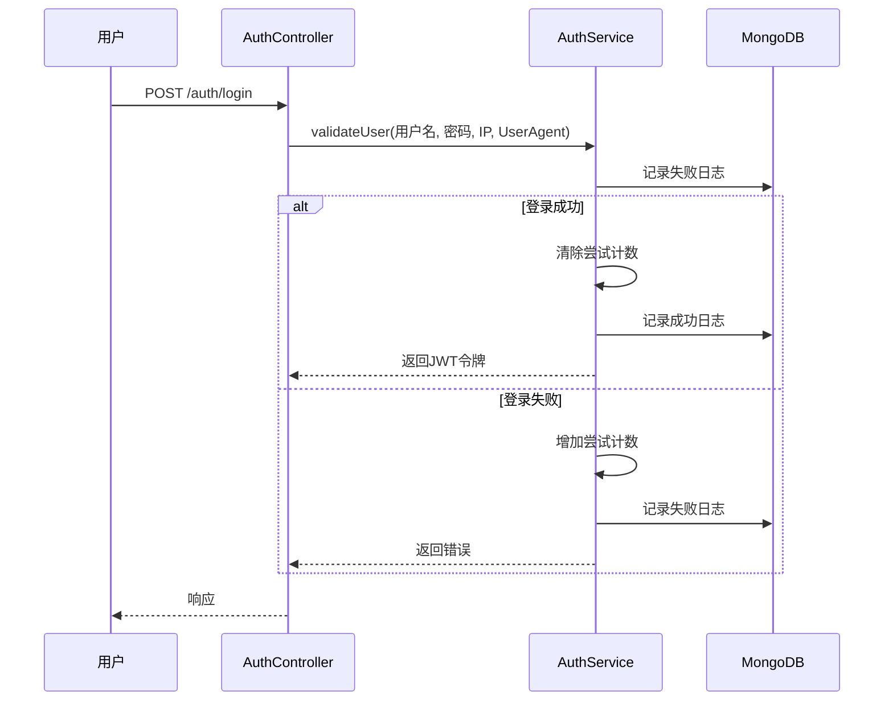

# 审计日志数据模型

<cite>
**本文档引用的文件**   
- [login-log.entity.ts](file://backend/src/modules/auth/models/login-log.entity.ts)
- [auth.service.ts](file://backend/src/modules/auth/auth.service.ts)
- [auth.controller.ts](file://backend/src/modules/auth/auth.controller.ts)
- [auth.module.ts](file://backend/src/modules/auth/auth.module.ts)
</cite>

## 目录
1. [引言](#引言)
2. [登录日志实体模型](#登录日志实体模型)
3. [字段详细说明](#字段详细说明)
4. [安全审计与异常检测](#安全审计与异常检测)
5. [数据保留策略](#数据保留策略)
6. [索引设计与查询优化](#索引设计与查询优化)
7. [与安全机制的集成](#与安全机制的集成)
8. [系统管理员日志分析最佳实践](#系统管理员日志分析最佳实践)

## 引言

本文件旨在详细描述安得家政管理系统中审计日志模块的数据模型，重点聚焦于 `login-log.entity.ts` 文件所定义的登录日志实体。该模型是系统安全审计的核心组成部分，用于记录所有用户的登录活动，为安全监控、异常行为检测和合规性审查提供关键数据支持。文档将全面阐述实体的字段定义、在安全体系中的作用、数据生命周期管理策略以及与其他安全功能的集成方式，为系统管理员提供清晰的操作和分析指导。

## 登录日志实体模型

登录日志实体（`LoginLog`）是基于 NestJS 框架和 Mongoose ODM（对象数据映射）构建的，用于在 MongoDB 数据库中持久化用户的登录事件。该实体定义了记录一次登录尝试所需的所有关键信息。

```mermaid
classDiagram
class LoginLog {
+string userId
+Date timestamp
+string ip
+string userAgent
+string status
}
note right of LoginLog
登录日志实体模型
用于记录用户登录活动
end note
```

**图示来源**
- [login-log.entity.ts](file://backend/src/modules/auth/models/login-log.entity.ts#L1-L21)

**本节来源**
- [login-log.entity.ts](file://backend/src/modules/auth/models/login-log.entity.ts#L1-L21)

## 字段详细说明

登录日志实体包含以下五个核心字段，每个字段都具有明确的业务含义和数据约束。

**用户ID (userId)**
- **类型**: `string`
- **约束**: `required: true`
- **说明**: 记录发起登录请求的用户的唯一标识符。在登录成功时，此字段为实际用户的数据库 `_id`；在登录失败且无法识别用户时，代码中会将其设置为 `'unknown'`，以确保日志的完整性。

**登录时间 (timestamp)**
- **类型**: `Date`
- **约束**: `required: true`
- **说明**: 记录登录尝试发生的具体时间点。该字段由 Mongoose 的 `timestamps` 选项自动管理，确保了时间记录的准确性和一致性。

**IP地址 (ip)**
- **类型**: `string`
- **约束**: `required: true`
- **说明**: 记录发起登录请求的客户端的 IP 地址。这是识别潜在恶意活动（如暴力破解）和进行地理定位分析的关键信息。

**设备信息 (userAgent)**
- **类型**: `string`
- **约束**: `required: true`
- **说明**: 记录客户端浏览器或应用程序的用户代理字符串（User-Agent）。该信息可用于识别登录所使用的设备类型（如手机、电脑）、操作系统和浏览器，有助于分析异常登录模式。

**登录结果 (status)**
- **类型**: `'success' | 'failed'`
- **约束**: `required: true`, `enum: ['success', 'failed']`
- **说明**: 明确标识本次登录尝试的结果。该字段采用枚举类型，确保了数据的规范性，是进行登录成功率统计和失败尝试监控的基础。

**本节来源**
- [login-log.entity.ts](file://backend/src/modules/auth/models/login-log.entity.ts#L1-L21)

## 安全审计与异常检测

登录日志实体在系统的安全审计和异常行为检测中扮演着至关重要的角色。

**安全审计**
- **可追溯性**: 每一条登录日志都提供了“谁在何时、何地、使用何种设备”登录系统的完整记录。这满足了合规性要求，允许管理员在发生安全事件后进行彻底的追溯调查。
- **行为分析**: 通过分析单个用户的登录历史，可以建立其正常的登录模式（如常用 IP、活跃时间段）。任何偏离此模式的登录（例如，深夜从陌生国家登录）都可被标记为可疑。

**异常检测**
- **实时监控**: 系统可以通过查询 `login-log` 集合，实时监控登录失败的频率和来源。例如，短时间内来自同一 IP 的大量失败登录，是典型的暴力破解攻击特征。
- **风险评分**: 结合 `ip` 和 `userAgent` 字段，可以构建更复杂的异常检测模型。例如，一个从未使用过移动设备的用户突然从移动设备登录，可能需要额外的身份验证。



**图示来源**
- [auth.service.ts](file://backend/src/modules/auth/auth.service.ts#L35-L65)
- [auth.controller.ts](file://backend/src/modules/auth/auth.controller.ts#L15-L22)

**本节来源**
- [auth.service.ts](file://backend/src/modules/auth/auth.service.ts#L35-L65)

## 数据保留策略

根据当前代码库的分析，系统尚未实现自动化的日志归档或删除策略。登录日志会持续存储在 MongoDB 数据库中，直到通过外部脚本或手动操作进行清理。

**潜在风险**
- **存储压力**: 长期积累的日志数据会占用大量磁盘空间。
- **性能下降**: 过大的日志集合会影响查询性能。

**建议策略**
- **自动清理**: 建议创建一个后台任务（如使用 Node.js 的 `cron` 库），定期（例如每天）扫描并删除超过 90 天的登录日志记录。这可以通过在 `LoginLog` 模型上执行 `deleteMany` 操作来实现。
- **日志归档**: 对于需要长期保留以满足合规要求的日志，建议实现归档机制，将旧日志导出到成本更低的存储系统（如对象存储）。

**本节来源**
- [check_housekeeping_db.js](file://backend/check_housekeeping_db.js)
- [scripts/deploy.sh](file://scripts/deploy.sh#L161-L201)

## 索引设计与查询优化

目前的代码中，`login-log.entity.ts` 文件仅定义了数据模型，但未显式声明数据库索引。然而，通过分析 `auth.service.ts` 中的查询逻辑，可以推断出优化查询性能所必需的索引。

**推荐索引**
- **复合索引 (userId, timestamp)**: 在 `getSession` 方法中，系统会查询特定用户的成功登录记录，并按时间倒序排列。为此，创建一个以 `userId` 为前缀、`timestamp` 为后缀的复合索引，可以极大提升此类查询的效率。
- **复合索引 (ip, timestamp)**: 为了有效监控来自特定 IP 的登录尝试（尤其是失败尝试），建议创建一个以 `ip` 为前缀、`timestamp` 为后缀的复合索引。
- **单字段索引 (status)**: 虽然 `status` 字段的基数较低（只有 success/failed 两种值），但在进行大规模日志分析时，一个单独的索引仍可能有助于加速按状态过滤的查询。

```mermaid
erDiagram
LOGIN_LOG {
string userId PK, FK
datetime timestamp PK
string ip
string userAgent
string status
}
USER {
string _id PK
string username
}
LOGIN_LOG ||--o{ USER : "belongsTo"
class LOGIN_LOG {
+userId (索引)
+timestamp (索引)
+ip (索引)
+userAgent
+status
}
note right of LOGIN_LOG
推荐的索引设计
(userId, timestamp)
(ip, timestamp)
(status)
end note
```

**图示来源**
- [login-log.entity.ts](file://backend/src/modules/auth/models/login-log.entity.ts#L1-L21)
- [auth.service.ts](file://backend/src/modules/auth/auth.service.ts#L115-L122)

**本节来源**
- [auth.service.ts](file://backend/src/modules/auth/auth.service.ts#L115-L122)

## 与安全机制的集成

登录日志模型与系统的其他安全机制深度集成，共同构成了一个主动防御体系。

**失败登录尝试监控**
- **实现**: `AuthService` 内部维护了一个 `Map` 结构 `loginAttempts`，用于在内存中跟踪每个用户名的登录尝试次数和时间。
- **联动**: 每次登录失败（无论是用户名不存在还是密码错误），`logLoginAttempt` 方法都会被调用，记录一条 `status: 'failed'` 的日志。同时，内存中的计数器会递增。
- **防护**: 当某个用户名在 15 分钟内连续失败 5 次，系统会触发锁定机制，拒绝后续的登录请求，有效防止暴力破解。

**会话管理**
- **集成**: `getSession` 接口不仅返回用户信息，还会查询 `login-log` 集合，获取该用户最近 5 次成功的登录记录（包括 IP 和设备信息）。
- **作用**: 此功能允许用户在个人中心查看自己的登录历史，及时发现并报告任何未经授权的访问，增强了用户的安全意识。

**本节来源**
- [auth.service.ts](file://backend/src/modules/auth/auth.service.ts#L35-L65)
- [auth.service.ts](file://backend/src/modules/auth/auth.service.ts#L115-L122)

## 系统管理员日志分析最佳实践

为了最大化登录日志的价值，系统管理员应遵循以下最佳实践：

1.  **定期审查**: 每周或每月定期审查登录日志，特别是关注 `status: 'failed'` 的记录，寻找异常模式。
2.  **设置告警**: 配置监控系统，在检测到以下情况时发送告警：
    -   单个 IP 在短时间内产生大量失败登录。
    -   高权限账户（如管理员）从非常用 IP 或设备登录。
    -   在非工作时间发生的登录活动。
3.  **利用工具**: 使用 MongoDB 的聚合管道（Aggregation Pipeline）或 BI 工具（如 Metabase）对日志数据进行可视化分析，生成登录成功率、失败来源分布等报表。
4.  **结合上下文**: 分析日志时，应结合用户信息（`user.entity.ts`）和业务上下文。例如，销售团队出差期间，来自新 IP 的登录可能是正常的。
5.  **保护日志本身**: 确保日志数据库的访问权限受到严格控制，防止攻击者篡改或删除日志以掩盖踪迹。

**本节来源**
- [auth.service.ts](file://backend/src/modules/auth/auth.service.ts)
- [login-log.entity.ts](file://backend/src/modules/auth/models/login-log.entity.ts)