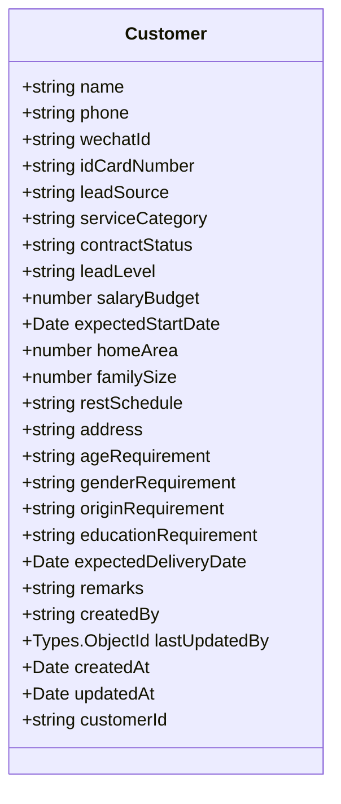
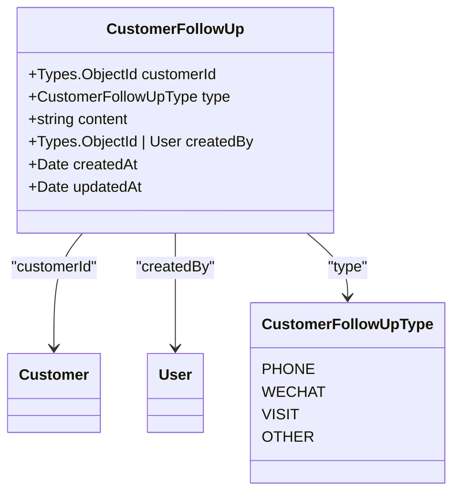
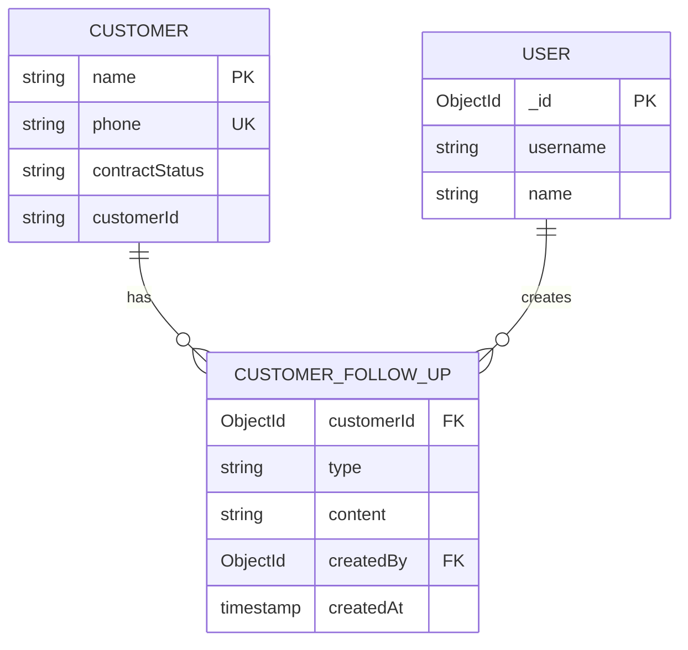
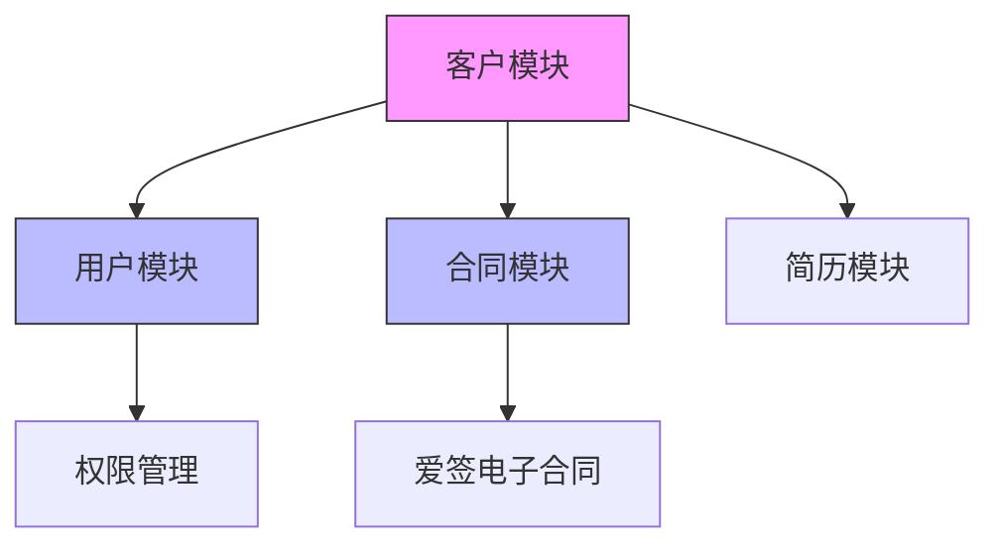
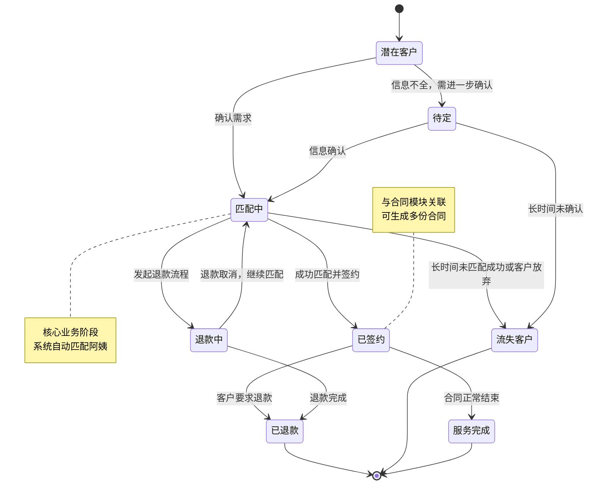

# 客户数据模型

<cite>
**本文档引用的文件**
- [customer.model.ts](file://backend/src/modules/customers/models/customer.model.ts)
- [customer-follow-up.entity.ts](file://backend/src/modules/customers/models/customer-follow-up.entity.ts)
- [customers.service.ts](file://backend/src/modules/customers/customers.service.ts)
- [customers.controller.ts](file://backend/src/modules/customers/customers.controller.ts)
- [create-customer.dto.ts](file://backend/src/modules/customers/dto/create-customer.dto.ts)
- [update-customer.dto.ts](file://backend/src/modules/customers/dto/update-customer.dto.ts)
- [create-customer-follow-up.dto.ts](file://backend/src/modules/customers/dto/create-customer-follow-up.dto.ts)
- [user.entity.ts](file://backend/src/modules/users/models/user.entity.ts)
- [contract.model.ts](file://backend/src/modules/contracts/models/contract.model.ts)
</cite>

## 目录
1. [客户数据模型概述](#客户数据模型概述)
2. [核心实体定义](#核心实体定义)
3. [客户主记录与跟进记录关系](#客户主记录与跟进记录关系)
4. [Mongoose Schema设计分析](#mongoose-schema设计分析)
5. [字段级说明与数据验证](#字段级说明与数据验证)
6. [索引策略与查询优化](#索引策略与查询优化)
7. [外键关联与模块集成](#外键关联与模块集成)
8. [客户生命周期状态转换](#客户生命周期状态转换)
9. [API接口与业务逻辑](#api接口与业务逻辑)

## 客户数据模型概述

客户数据模型是本系统的核心模块之一，用于管理客户基本信息、服务需求、家庭情况以及与客户相关的所有跟进记录。该模型采用Mongoose作为ODM（对象文档映射）工具，基于MongoDB构建，支持灵活的文档结构和强大的查询能力。客户主记录（Customer）与跟进记录（CustomerFollowUp）之间存在一对多的关系，即一个客户可以有多个跟进记录。

**客户主记录**（Customer）存储客户的基本信息、联系方式、需求偏好、状态标签等静态和动态数据。**跟进记录**（CustomerFollowUp）则记录了与客户沟通的详细情况，包括跟进方式、内容、创建人和时间等，用于追踪客户关系的发展过程。

该模型的设计遵循了数据完整性、查询性能和业务扩展性的原则，通过唯一索引防止手机号重复，通过复合索引优化常用查询，并通过外键引用实现与其他模块（如用户、合同）的关联。

## 核心实体定义

### 客户主记录实体 (Customer)

客户主记录实体定义了客户的核心信息，使用`@Schema`装饰器标记为Mongoose Schema，并通过`@Prop`装饰器定义各个字段的属性。

**Diagram sources**
- [customer.model.ts](file://backend/src/modules/customers/models/customer.model.ts#L1-L98)

**Section sources**
- [customer.model.ts](file://backend/src/modules/customers/models/customer.model.ts#L1-L98)

### 客户跟进记录实体 (CustomerFollowUp)

客户跟进记录实体定义了与客户沟通的详细信息，同样使用`@Schema`装饰器，并通过`@Prop`定义字段。它与客户主记录通过`customerId`字段建立外键关联。

**Diagram sources**
- [customer-follow-up.entity.ts](file://backend/src/modules/customers/models/customer-follow-up.entity.ts#L0-L63)

**Section sources**
- [customer-follow-up.entity.ts](file://backend/src/modules/customers/models/customer-follow-up.entity.ts#L0-L63)

## 客户主记录与跟进记录关系

客户主记录与跟进记录之间是一对多（1:N）的关系。一个客户（Customer）可以有多个跟进记录（CustomerFollowUp），但一个跟进记录只能属于一个客户。这种关系通过以下方式实现：

1.  **外键引用**：在`CustomerFollowUp`实体中，`customerId`字段被定义为对`Customer`集合的引用（`ref: 'Customer'`）。这确保了数据的引用完整性。
2.  **独立集合**：跟进记录被存储在独立的`customer_follow_ups`集合中，而不是嵌入在客户主记录内。这种设计选择基于以下权衡：
    *   **优点**：
        *   **性能**：避免了客户主记录文档过大。如果跟进记录很多，嵌入式数组会导致文档膨胀，影响读写性能。
        *   **灵活性**：可以独立地对跟进记录进行增删改查操作，不影响客户主记录。
        *   **查询优化**：可以为跟进记录集合创建专门的索引，优化按客户或按创建人查询的性能。
    *   **缺点**：
        *   **查询复杂度**：获取客户详情及其所有跟进记录需要进行两次查询或使用`populate`进行联表查询，增加了查询的复杂性。
        *   **事务性**：在MongoDB中，跨集合的操作需要使用事务来保证原子性。

在业务逻辑层（`customers.service.ts`），通过`populate`方法实现了关联查询，将`createdBy`用户的姓名和用户名填充到跟进记录中，方便前端展示。

**Diagram sources**
- [customer.model.ts](file://backend/src/modules/customers/models/customer.model.ts#L1-L98)
- [customer-follow-up.entity.ts](file://backend/src/modules/customers/models/customer-follow-up.entity.ts#L0-L63)
- [customers.service.ts](file://backend/src/modules/customers/customers.service.ts#L278-L308)

**Section sources**
- [customer.model.ts](file://backend/src/modules/customers/models/customer.model.ts#L1-L98)
- [customer-follow-up.entity.ts](file://backend/src/modules/customers/models/customer-follow-up.entity.ts#L0-L63)
- [customers.service.ts](file://backend/src/modules/customers/customers.service.ts#L278-L308)

## Mongoose Schema设计分析

### 客户主记录Schema (CustomerSchema)

`CustomerSchema`是通过`SchemaFactory.createForClass(Customer)`从`Customer`类自动生成的。其设计特点包括：

*   **时间戳**：`@Schema({ timestamps: true })`自动为文档添加`createdAt`和`updatedAt`字段，用于追踪记录的创建和更新时间。
*   **必填字段**：`name`、`phone`、`leadSource`、`contractStatus`和`createdBy`被标记为`required: true`，确保了核心数据的完整性。
*   **唯一约束**：`phone`字段设置了`unique: true`，防止同一手机号被重复注册为客户。
*   **枚举约束**：多个字段（如`leadSource`, `contractStatus`, `serviceCategory`）使用`enum`来限制其值必须在预定义的列表中，保证了数据的一致性。
*   **外键引用**：`lastUpdatedBy`字段引用了`User`集合，用于记录最后修改客户信息的用户。

### 客户跟进记录Schema (CustomerFollowUpSchema)

`CustomerFollowUpSchema`同样通过`SchemaFactory`生成，并包含以下设计：

*   **集合命名**：`@Schema({ collection: 'customer_follow_ups' })`显式指定了集合名称，避免了默认的复数化规则。
*   **外键引用**：`customerId`字段引用`Customer`集合，`createdBy`字段引用`User`集合。
*   **自动填充**：`createdBy`字段使用了`autopopulate: { select: 'name username' }`，这是一个Mongoose插件功能，可以在查询时自动填充指定的用户信息，减少了手动`populate`的代码量。
*   **索引定义**：在Schema定义之外，通过`CustomerFollowUpSchema.index()`方法添加了两个复合索引，这是优化查询性能的关键。

## 字段级说明与数据验证

### 客户主记录字段说明

| 字段名 | 类型 | 是否必填 | 说明 |
| :--- | :--- | :--- | :--- |
| `name` | string | 是 | 客户姓名 |
| `phone` | string | 是 | 客户手机号，唯一索引，用于登录和联系 |
| `wechatId` | string | 否 | 客户微信号 |
| `idCardNumber` | string | 否 | 客户身份证号 |
| `leadSource` | string | 是 | 线索来源，枚举值：美团、抖音、快手、小红书、转介绍、其他 |
| `serviceCategory` | string | 否 | 需求品类，枚举值：月嫂、住家育儿嫂、保洁等 |
| `contractStatus` | string | 是 | 签约状态，枚举值：已签约、匹配中、流失客户、已退款、退款中、待定 |
| `leadLevel` | string | 否 | 线索等级，枚举值：A类、B类、C类、D类 |
| `salaryBudget` | number | 否 | 薪资预算，单位：元 |
| `expectedStartDate` | Date | 否 | 期望上户日期 |
| `homeArea` | number | 否 | 家庭面积，单位：平方米 |
| `familySize` | number | 否 | 家庭人口 |
| `restSchedule` | string | 否 | 休息方式，枚举值：单休、双休、无休、调休、待定 |
| `address` | string | 否 | 家庭地址 |
| `ageRequirement` | string | 否 | 对阿姨的年龄要求 |
| `genderRequirement` | string | 否 | 对阿姨的性别要求 |
| `originRequirement` | string | 否 | 对阿姨的籍贯要求 |
| `educationRequirement` | string | 否 | 对阿姨的学历要求 |
| `expectedDeliveryDate` | Date | 否 | 客户的预产期 |
| `remarks` | string | 否 | 备注信息 |
| `createdBy` | string | 是 | 创建人用户ID |
| `lastUpdatedBy` | ObjectId | 否 | 最后更新人用户ID，引用User集合 |
| `customerId` | string | 否 | 系统生成的客户ID，格式为CUS+时间戳+随机数 |

### 数据验证规则

数据验证在DTO（Data Transfer Object）层和Schema层双重进行，确保了API输入和数据库存储的双重安全。

*   **创建客户验证 (CreateCustomerDto)**：
    *   `phone`：使用`@IsPhoneNumber('CN')`验证是否为中国大陆手机号。
    *   `salaryBudget`：使用`@Min(1000)`和`@Max(50000)`限制预算范围。
    *   `homeArea` 和 `familySize`：同样有最小值和最大值限制。
    *   所有枚举字段（`leadSource`, `contractStatus`等）都使用`@IsEnum`进行验证，并提供清晰的错误消息。
*   **更新客户验证 (UpdateCustomerDto)**：
    *   继承自`CreateCustomerDto`，但所有字段都是可选的（`PartialType`）。
    *   `contractStatus`字段有独立的`@IsEnum`验证。
*   **创建跟进记录验证 (CreateCustomerFollowUpDto)**：
    *   `type`：必须是`CustomerFollowUpType`枚举中的一个值。
    *   `content`：不能为空，且长度不能超过1000个字符（`@MaxLength(1000)`）。

**Section sources**
- [customer.model.ts](file://backend/src/modules/customers/models/customer.model.ts#L1-L98)
- [create-customer.dto.ts](file://backend/src/modules/customers/dto/create-customer.dto.ts#L0-L116)
- [update-customer.dto.ts](file://backend/src/modules/customers/dto/update-customer.dto.ts#L0-L10)
- [create-customer-follow-up.dto.ts](file://backend/src/modules/customers/dto/create-customer-follow-up.dto.ts#L0-L22)

## 索引策略与查询优化

合理的索引策略是保证数据库查询性能的关键。

### 客户主记录索引

*   **唯一索引**：`phone`字段上的唯一索引（`unique: true`）是强制性的，用于防止手机号重复。在`customers.service.ts`的`create`方法中，通过`findOne({ phone })`查询来检查手机号是否已存在，这个查询会利用该索引，效率很高。
*   **默认索引**：`_id`字段是MongoDB自动创建的唯一索引，用于通过ID快速查找客户。
*   **复合索引建议**：虽然代码中未显式定义，但根据业务查询模式，建议为以下字段创建复合索引：
    *   `{ contractStatus: 1, createdAt: -1 }`：用于按状态（如“匹配中”）和创建时间排序查询客户列表，是驾驶舱统计和客户列表页的常用查询。
    *   `{ leadSource: 1, createdAt: -1 }`：用于分析不同来源线索的转化情况。

### 客户跟进记录索引

在`customer-follow-up.entity.ts`文件末尾，显式定义了两个复合索引：

*   `CustomerFollowUpSchema.index({ customerId: 1, createdAt: -1 })`：这是最关键的索引。它支持按`customerId`查询该客户的所有跟进记录，并按`createdAt`倒序排列（最新的记录在前）。`customers.service.ts`中的`getFollowUps`方法正是利用了这个索引。
*   `CustomerFollowUpSchema.index({ createdBy: 1 })`：支持按`createdBy`（创建人）查询某个用户创建的所有跟进记录，可用于绩效统计。

**Section sources**
- [customer.model.ts](file://backend/src/modules/customers/models/customer.model.ts#L6-L7)
- [customer-follow-up.entity.ts](file://backend/src/modules/customers/models/customer-follow-up.entity.ts#L61-L63)
- [customers.service.ts](file://backend/src/modules/customers/customers.service.ts#L26-L65)

## 外键关联与模块集成

客户数据模型通过外键与其他核心模块紧密集成，形成完整的业务闭环。

*   **与用户模块 (User) 的关联**：
    *   `Customer.createdBy` 和 `Customer.lastUpdatedBy` 字段引用`User`集合，记录了客户记录的创建者和最后修改者。
    *   `CustomerFollowUp.createdBy` 字段同样引用`User`集合，记录了跟进记录的创建者。在查询时，通过`populate`填充`name`和`username`字段，方便在界面上显示用户姓名。
*   **与合同模块 (Contract) 的关联**：
    *   虽然`Customer`实体中没有直接引用`Contract`，但`Contract`实体中有一个`customerId`字段，引用了`Customer`集合。这表明一个客户可以签订多份合同（例如，更换阿姨后签订新合同）。
    *   这种设计实现了客户与合同的一对多关系。通过客户ID，可以查询到该客户的所有历史合同记录。

**Diagram sources**
- [customer.model.ts](file://backend/src/modules/customers/models/customer.model.ts#L34-L35)
- [contract.model.ts](file://backend/src/modules/contracts/models/contract.model.ts#L108-L110)
- [user.entity.ts](file://backend/src/modules/users/models/user.entity.ts#L1-L45)

**Section sources**
- [customer.model.ts](file://backend/src/modules/customers/models/customer.model.ts#L34-L35)
- [contract.model.ts](file://backend/src/modules/contracts/models/contract.model.ts#L108-L110)
- [user.entity.ts](file://backend/src/modules/users/models/user.entity.ts#L1-L45)

## 客户生命周期状态转换

客户的生命周期通过`contractStatus`字段来体现，该字段的值定义了客户所处的业务阶段。状态转换图如下：

**状态说明**：
*   **潜在客户**：新创建的客户，尚未明确需求。
*   **匹配中**：客户需求已确认，系统正在为其匹配合适的阿姨。这是最核心的业务阶段。
*   **已签约**：客户已与阿姨成功签约，合同生效。
*   **流失客户**：因各种原因（如长时间未匹配到合适阿姨、客户改变主意等）而失去的客户。
*   **已退款**：客户已办理退款，业务终止。
*   **退款中**：客户已发起退款申请，正在处理中。
*   **待定**：客户信息不完整或需求不明确，需要进一步沟通确认。

状态的变更通过`customers.controller.ts`中的`PATCH /customers/:id`接口实现，由`customers.service.ts`中的`update`方法处理。

**Diagram sources**
- [customer.model.ts](file://backend/src/modules/customers/models/customer.model.ts#L15-L20)
- [update-customer.dto.ts](file://backend/src/modules/customers/dto/update-customer.dto.ts#L0-L10)

**Section sources**
- [customer.model.ts](file://backend/src/modules/customers/models/customer.model.ts#L15-L20)
- [update-customer.dto.ts](file://backend/src/modules/customers/dto/update-customer.dto.ts#L0-L10)

## API接口与业务逻辑

客户模块提供了完整的RESTful API，由`CustomersController`定义，`CustomersService`实现。

### 核心API端点

*   **POST /customers**：创建新客户。服务层会检查手机号唯一性并生成`customerId`。
*   **GET /customers**：获取客户列表，支持分页、搜索和多种筛选条件。
*   **GET /customers/:id**：获取单个客户详情，**包含其所有跟进记录**和创建/更新人信息。
*   **PATCH /customers/:id**：更新客户信息。更新手机号时会检查是否与其他客户冲突。
*   **DELETE /customers/:id**：删除客户。
*   **POST /customers/:id/follow-ups**：为客户创建一条新的跟进记录。
*   **GET /customers/:id/follow-ups**：获取客户的所有跟进记录。

### 业务逻辑关键点

*   **手机号唯一性校验**：在创建和更新客户时，都会查询数据库检查手机号是否已被占用，确保了数据的唯一性。
*   **客户ID生成**：`generateCustomerId()`方法生成格式为`CUS+时间戳后8位+3位随机数`的ID，保证了全局唯一性。
*   **关联数据查询**：`findOne`方法不仅返回客户数据，还通过`populate`关联查询了创建人、最后更新人和所有跟进记录，为前端提供了一站式的数据。
*   **错误处理**：使用`NotFoundException`和`ConflictException`等标准异常，向客户端返回清晰的错误信息。

**Section sources**
- [customers.controller.ts](file://backend/src/modules/customers/customers.controller.ts#L0-L145)
- [customers.service.ts](file://backend/src/modules/customers/customers.service.ts#L0-L308)