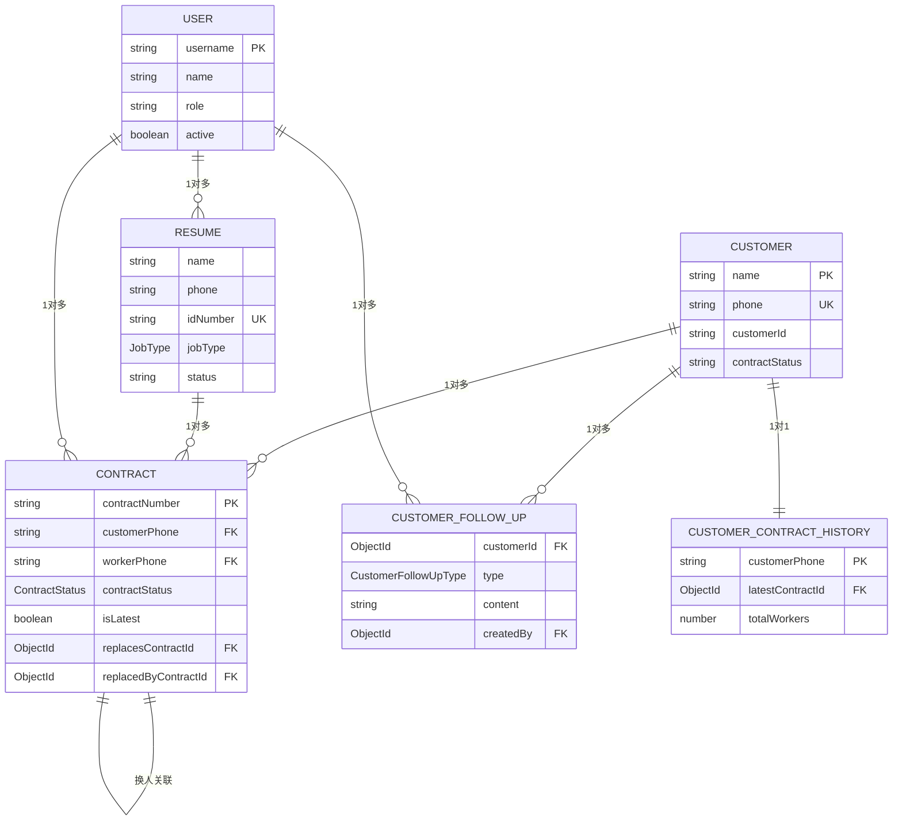

# 数据模型

<cite>
**本文档引用的文件**   
- [DATABASE_SCHEMA.md](file://backend/src/docs/DATABASE_SCHEMA.md)
- [resume.entity.ts](file://backend/src/modules/resume/models/resume.entity.ts)
- [user.entity.ts](file://backend/src/modules/users/models/user.entity.ts)
- [customer.model.ts](file://backend/src/modules/customers/models/customer.model.ts)
- [contract.model.ts](file://backend/src/modules/contracts/models/contract.model.ts)
- [customer-contract-history.model.ts](file://backend/src/modules/contracts/models/customer-contract-history.model.ts)
- [customer-follow-up.entity.ts](file://backend/src/modules/customers/models/customer-follow-up.entity.ts)
- [work-experience.schema.ts](file://backend/src/modules/resume/models/work-experience.schema.ts)
- [file-info.schema.ts](file://backend/src/modules/resume/models/file-info.schema.ts)
</cite>

## 更新摘要
**变更内容**   
- **更新**：在“简历（Resume）集合”部分添加了`selfIntroduction`（自我介绍）字段的详细说明，该字段已在代码中实现。
- **更新**：更新了“核心实体与数据模型”部分的“简历（Resume）集合”小节，以反映最新的数据模型变更。
- **更新**：更新了“简历（Resume）集合”的“字段与数据类型”和“约束与索引”部分，以包含新字段。
- **更新**：更新了“Section sources”以包含最新的文件引用。

## 目录
1. [引言](#引言)
2. [核心实体与数据模型](#核心实体与数据模型)
3. [实体关系与业务逻辑](#实体关系与业务逻辑)
4. [数据完整性与索引策略](#数据完整性与索引策略)
5. [Mongoose Schema设计模式](#mongoose-schema设计模式)
6. [数据生命周期管理](#数据生命周期管理)

## 引言
本文档旨在全面描述安得家政CRM系统的数据模型。基于`DATABASE_SCHEMA.md`和各模块的实体文件，本文详细定义了系统中的核心实体（如客户、合同、简历、用户）及其相互关系。文档解释了各集合的字段、数据类型、约束、索引和业务规则，并通过实体关系图（ERD）可视化其关联。本指南为数据库管理员和后端开发者提供了数据完整性保障和性能优化的指导。

## 核心实体与数据模型

### 简历（Resume）集合
简历集合（`resumes`）存储家政服务人员的完整信息，是系统的核心数据之一。

**字段与数据类型**:
- **基础信息**:
  - `name` (字符串): 姓名。
  - `gender` (枚举): 性别，取值为`male`（男）或`female`（女）。
  - `age` (数字): 年龄。
  - `phone` (字符串): 手机号。
  - `wechat` (字符串, 可选): 微信号。
  - `idNumber` (字符串, 可选): 身份证号。
  - `ethnicity` (字符串, 可选): 民族。
  - `zodiac` (枚举, 可选): 生肖。
  - `zodiacSign` (枚举, 可选): 星座。
  - `nativePlace` (字符串): 籍贯。
  - `experienceYears` (数字): 工作年限。
  - `maritalStatus` (枚举, 可选): 婚姻状况。
  - `religion` (枚举, 可选): 宗教信仰。
  - `currentAddress` (字符串, 可选): 当前住址。
  - `hukouAddress` (字符串, 可选): 户口所在地。
  - `birthDate` (字符串, 可选): 出生日期。
- **工作信息**:
  - `expectedPosition` (字符串): 期望职位。
  - `jobType` (枚举): 工种，如`yuexin`（月嫂）、`zhujia-yuer`（住家育儿嫂）等。
  - `expectedSalary` (数字): 期望薪资。
  - `workExperience` (数字): 工作经验（年）。
  - `education` (枚举): 学历。
  - `school` (字符串): 毕业院校。
  - `major` (字符串): 专业。
  - `workHistory` (对象数组): 工作经历，每个对象包含`startDate`、`endDate`和`description`。
  - `skills` (字符串数组): 技能特长，如`muying`（母婴护理师）、`cuiru`（催乳）等。
  - `selfIntroduction` (字符串, 可选): **自我介绍**。这是一个新增的可选字段，允许家政员输入一段文字来介绍自己的性格、特长、服务理念等。
  - `status` (字符串): 状态（如`pending`待审核）。
  - `remarks` (字符串, 可选): 备注。
  - `serviceArea` (字符串数组): 服务区域。
  - `orderStatus` (枚举, 可选): 接单状态。
  - `leadSource` (枚举, 可选): 线索来源。
- **文件信息**:
  - `idCardFront` (嵌入式文档): 身份证正面照片信息，包含`url`、`filename`、`size`、`mimetype`。
  - `idCardBack` (嵌入式文档): 身份证背面照片信息。
  - `personalPhoto` (嵌入式文档): 个人照片信息。
  - `certificates` (嵌入式文档数组): 证书照片信息。
  - `reports` (嵌入式文档数组): 体检报告信息。
  - `photoUrls` (字符串数组): 个人照片URL数组（冗余字段，用于快速访问）。
  - `certificateUrls` (字符串数组): 证书照片URL数组（冗余字段）。
  - `medicalReportUrls` (字符串数组): 体检报告URL数组（冗余字段）。
- **元数据**:
  - `userId` (ObjectId, 引用`User`): 创建该简历的用户ID。
  - `lastUpdatedBy` (ObjectId, 引用`User`, 可选): 最后更新人ID。
  - `fileIds` (ObjectId数组): 关联的文件ID数组。
  - `createdAt` (日期): 创建时间。
  - `updatedAt` (日期): 更新时间。

**约束与索引**:
- `idNumber` 字段具有**唯一稀疏索引**（`unique: true, sparse: true`），确保身份证号不重复，同时允许`null`值存在。
- `createdAt` 和 `updatedAt` 字段由Mongoose的`timestamps: true`选项自动管理。

**Section sources**
- [resume.entity.ts](file://backend/src/modules/resume/models/resume.entity.ts#L76-L275)
- [work-experience.schema.ts](file://backend/src/modules/resume/models/work-experience.schema.ts#L1-L17)
- [file-info.schema.ts](file://backend/src/modules/resume/models/file-info.schema.ts#L1-L20)

### 用户（User）集合
用户集合（`users`）存储系统内所有用户的账户信息。

**字段与数据类型**:
- `username` (字符串): 用户名，必须唯一。
- `password` (字符串): 密码，以加密形式存储。
- `name` (字符串): 姓名。
- `email` (字符串, 可选): 邮箱。
- `phone` (字符串, 可选): 手机号。
- `role` (字符串): 角色，如`admin`（管理员）、`manager`（经理）、`employee`（员工）。
- `permissions` (字符串数组): 权限列表。
- `active` (布尔值): 账户是否激活，默认为`true`。
- `createdAt` (日期): 创建时间。
- `updatedAt` (日期): 更新时间。

**约束与索引**:
- `username` 字段具有**唯一索引**，确保用户名不重复。

**Section sources**
- [user.entity.ts](file://backend/src/modules/users/models/user.entity.ts#L18-L43)

### 客户（Customer）集合
客户集合（`customers`）存储潜在或已签约客户的详细信息。

**字段与数据类型**:
- `name` (字符串): 客户姓名。
- `phone` (字符串): 客户手机号，必须唯一。
- `wechatId` (字符串, 可选): 客户微信号。
- `idCardNumber` (字符串, 可选): 客户身份证号。
- `leadSource` (字符串): 线索来源，如“美团”、“抖音”、“转介绍”等。
- `serviceCategory` (字符串): 服务类别，如“月嫂”、“保洁”等。
- `contractStatus` (字符串): 合同状态，如“已签约”、“匹配中”、“流失客户”等。
- `leadLevel` (字符串): 线索等级，如“A类”、“B类”等。
- `salaryBudget` (数字): 薪资预算。
- `expectedStartDate` (日期): 期望开始日期。
- `homeArea` (数字): 房屋面积。
- `familySize` (数字): 家庭人数。
- `restSchedule` (字符串): 休息安排。
- `address` (字符串): 服务地址。
- `ageRequirement` (字符串, 可选): 对阿姨的年龄要求。
- `genderRequirement` (字符串, 可选): 对阿姨的性别要求。
- `originRequirement` (字符串, 可选): 对阿姨的籍贯要求。
- `educationRequirement` (字符串, 可选): 对阿姨的学历要求。
- `expectedDeliveryDate` (日期, 可选): 预产期。
- `remarks` (字符串, 可选): 备注。
- `createdBy` (字符串): 创建人ID（字符串形式）。
- `lastUpdatedBy` (ObjectId, 引用`User`): 最后更新人ID。
- `customerId` (字符串): 系统生成的客户ID。
- `createdAt` (日期): 创建时间。
- `updatedAt` (日期): 更新时间。

**约束与索引**:
- `phone` 字段具有**唯一索引**，确保手机号不重复。

**Section sources**
- [customer.model.ts](file://backend/src/modules/customers/models/customer.model.ts#L5-L96)

### 合同（Contract）集合
合同集合（`contracts`）记录客户与家政员之间的服务合同。

**字段与数据类型**:
- `contractNumber` (字符串): 合同编号，自动生成且唯一。
- `customerName` (字符串): 客户姓名。
- `customerPhone` (字符串): 客户手机号。
- `customerIdCard` (字符串, 可选): 客户身份证号。
- `contractType` (枚举): 合同类型，对应`ContractType`枚举。
- `startDate` (日期): 服务开始日期。
- `endDate` (日期): 服务结束日期。
- `workerName` (字符串): 劳动者（家政员）姓名。
- `workerPhone` (字符串): 劳动者电话。
- `workerIdCard` (字符串): 劳动者身份证号。
- `workerSalary` (数字): 家政员工资。
- `customerServiceFee` (数字): 客户服务费。
- `workerServiceFee` (数字, 可选): 家政员服务费。
- `deposit` (数字, 可选): 定金。
- `finalPayment` (数字, 可选): 尾款。
- `expectedDeliveryDate` (日期, 可选): 预产期。
- `salaryPaymentDay` (数字, 1-31): 工资发放日。
- `monthlyWorkDays` (数字, 1-31): 月工作天数。
- `remarks` (字符串, 可选): 备注。
- `customerId` (ObjectId, 引用`Customer`): 关联的客户ID。
- `workerId` (ObjectId, 引用`Resume`): 关联的简历ID。
- `createdBy` (ObjectId, 引用`User`): 创建人ID。
- `lastUpdatedBy` (ObjectId, 引用`User`): 最后更新人ID。
- **爱签（eSign）集成字段**:
  - `esignContractNo` (字符串): 爱签合同编号。
  - `esignStatus` (字符串): 爱签合同状态缓存。
  - `esignCreatedAt` (日期): 爱签合同创建时间。
  - `esignSignedAt` (日期): 爱签合同签署完成时间。
  - `esignTemplateNo` (字符串): 爱签模板编号。
  - `esignPreviewUrl` (字符串): 爱签预览链接。
- **换人功能字段**:
  - `isLatest` (布尔值): 是否为该客户的最新合同。
  - `contractStatus` (枚举): 合同状态，如`draft`（草稿）、`signing`（签约中）、`active`（生效中）、`replaced`（已被替换）、`cancelled`（已作废）。
  - `replacedByContractId` (ObjectId, 引用`Contract`): 被哪个合同替换。
  - `replacesContractId` (ObjectId, 引用`Contract`): 替换了哪个合同。
  - `changeDate` (日期): 换人生效日期。
  - `serviceDays` (数字): 实际服务天数。
- `createdAt` (日期): 录入时间。
- `updatedAt` (日期): 更新时间。

**约束与索引**:
- `contractNumber` 字段具有**唯一索引**，确保合同编号全局唯一。

**Section sources**
- [contract.model.ts](file://backend/src/modules/contracts/models/contract.model.ts#L26-L140)

### 客户合同历史（CustomerContractHistory）集合
客户合同历史集合（`customer_contract_histories`）专门用于存储客户的所有合同历史记录，优化历史查询性能。

**字段与数据类型**:
- `customerPhone` (字符串): 客户手机号，作为关联键且唯一。
- `customerName` (字符串): 客户姓名。
- `contracts` (子文档数组): 合同历史记录数组，每个`ContractHistoryRecord`包含：
  - `contractId` (ObjectId, 引用`Contract`): 合同ID。
  - `contractNumber` (字符串): 合同编号。
  - `workerName` (字符串): 家政员姓名。
  - `workerPhone` (字符串): 家政员电话。
  - `workerSalary` (数字): 家政员工资。
  - `startDate` (日期): 开始日期。
  - `endDate` (日期): 结束日期。
  - `status` (字符串): 状态（`active`或`replaced`）。
  - `order` (数字): 第几任阿姨。
  - `serviceDays` (数字): 实际服务天数。
  - `terminationDate` (日期): 终止日期。
  - `terminationReason` (字符串): 终止原因。
- `latestContractId` (ObjectId, 引用`Contract`): 最新合同ID。
- `totalWorkers` (数字): 总共换过几个阿姨。
- `createdAt` (日期): 创建时间。
- `updatedAt` (日期): 更新时间。

**设计说明**: 此集合通过`customerPhone`进行分片，将一个客户的所有历史合同聚合在一起，避免了对`contracts`主集合的复杂聚合查询。

**Section sources**
- [customer-contract-history.model.ts](file://backend/src/modules/contracts/models/customer-contract-history.model.ts#L1-L79)

### 客户跟进记录（CustomerFollowUp）集合
客户跟进记录集合（`customer_follow_ups`）存储与客户沟通的详细记录。

**字段与数据类型**:
- `customerId` (ObjectId, 引用`Customer`): 关联的客户ID。
- `type` (枚举): 跟进方式，如`phone`（电话）、`wechat`（微信）、`visit`（到店）等。
- `content` (字符串): 跟进内容。
- `createdBy` (ObjectId, 引用`User`): 创建人ID。
- `createdAt` (日期): 创建时间。
- `updatedAt` (日期): 更新时间。

**约束与索引**:
- 为`customerId`和`createdAt`创建了**复合索引**（`{ customerId: 1, createdAt: -1 }`），极大优化了按客户查询并按时间倒序排列跟进记录的性能。
- 为`createdBy`创建了索引，便于查询某用户创建的所有跟进记录。

**Section sources**
- [customer-follow-up.entity.ts](file://backend/src/modules/customers/models/customer-follow-up.entity.ts#L24-L57)

## 实体关系与业务逻辑

### 核心实体关系图

**Diagram sources**
- [customer.model.ts](file://backend/src/modules/customers/models/customer.model.ts)
- [contract.model.ts](file://backend/src/modules/contracts/models/contract.model.ts)
- [resume.entity.ts](file://backend/src/modules/resume/models/resume.entity.ts)
- [user.entity.ts](file://backend/src/modules/users/models/user.entity.ts)
- [customer-follow-up.entity.ts](file://backend/src/modules/customers/models/customer-follow-up.entity.ts)
- [customer-contract-history.model.ts](file://backend/src/modules/contracts/models/customer-contract-history.model.ts)

### 关键关系与业务规则详解

#### 客户与合同（1对多）
- **关系**: 一个客户可以有多个合同（例如，因换人而产生新合同），但一个合同只属于一个客户。
- **实现**: 在`Contract`实体中，`customerId`字段是引用`Customer`集合的`ObjectId`。
- **业务逻辑**: 当创建新合同时，系统会检查该客户是否已有“生效中”或“签约中”的合同。对于“换人”场景，系统会创建一份新合同，并将原合同的`isLatest`设为`false`，同时在新合同中设置`replacesContractId`指向原合同。

#### 简历与合同（1对多）
- **关系**: 一份简历（代表一位家政员）可以与多个客户签订合同（即服务过多个家庭），但一份合同只关联一位家政员。
- **实现**: 在`Contract`实体中，`workerId`字段是引用`Resume`集合的`ObjectId`。
- **业务逻辑**: 在创建合同时，需要选择一位家政员，系统会根据其简历信息填充合同中的`workerName`、`workerPhone`等字段。

#### 用户与简历（1对多）
- **关系**: 一个系统用户（如管理员或经理）可以创建和管理多份简历。
- **实现**: 在`Resume`实体中，`userId`字段是引用`User`集合的`ObjectId`，表示简历的创建者。
- **业务逻辑**: 用户在系统中录入家政员信息时，会自动关联其用户ID。

#### 客户与跟进记录（1对多）
- **关系**: 一个客户可以有多个跟进记录，但一条跟进记录只属于一个客户。
- **实现**: 在`CustomerFollowUp`实体中，`customerId`字段是引用`Customer`集合的`ObjectId`。
- **API路径**: `/api/customers/{customerId}/follow-ups`，体现了这种从属关系。

#### 合同与合同（换人关联）
- **关系**: 这是一种特殊的自引用关系，用于处理“换人”业务。
- **实现**: `Contract`实体包含`replacesContractId`和`replacedByContractId`两个字段，它们都引用`Contract`集合自身。
- **业务逻辑**: 当为一个客户创建“换人合同”时，新合同的`replacesContractId`指向被替换的旧合同，而旧合同的`replacedByContractId`会指向新合同。`isLatest`字段用于快速标识当前有效的合同。

#### 客户与客户合同历史（1对1）
- **关系**: 一个客户对应一份合同历史记录。
- **实现**: `CustomerContractHistory`集合以`customerPhone`作为主键，与`Customer`集合的`phone`字段关联。
- **业务逻辑**: 每当客户签订新合同或合同状态变更时，系统会自动同步更新`CustomerContractHistory`集合，保持数据一致性。

**Section sources**
- [contract.model.ts](file://backend/src/modules/contracts/models/contract.model.ts)
- [customer.model.ts](file://backend/src/modules/customers/models/customer.model.ts)
- [resume.entity.ts](file://backend/src/modules/resume/models/resume.entity.ts)
- [customer-follow-up.entity.ts](file://backend/src/modules/customers/models/customer-follow-up.entity.ts)
- [customer-contract-history.model.ts](file://backend/src/modules/contracts/models/customer-contract-history.model.ts)
- [contracts.service.ts](file://backend/src/modules/contracts/contracts.service.ts#L433-L463)
- [customers.service.ts](file://backend/src/modules/customers/customers.service.ts#L278-L308)

## 数据完整性与索引策略

### 数据完整性保障
- **唯一性约束**: 关键字段如`User.username`、`Customer.phone`、`Resume.idNumber`（稀疏唯一）、`Contract.contractNumber`均设置了唯一索引，防止数据重复。
- **引用完整性**: 使用`ref`属性建立文档间的引用关系（如`Contract.customerId`引用`Customer`），虽然MongoDB不强制外键约束，但应用层逻辑确保了引用的有效性。
- **枚举值校验**: 大量字段使用了`enum`约束（如`jobType`, `contractStatus`），确保数据符合预定义的业务规则。
- **非空校验**: `required: true`确保了关键业务字段（如客户姓名、手机号）不能为空。

### 索引策略与性能优化
- **主键索引**: 所有集合默认在`_id`上创建索引。
- **唯一索引**: 用于保证字段唯一性，如`User.username`。
- **复合索引**: 为高频查询创建，如`CustomerFollowUp`上的`{ customerId: 1, createdAt: -1 }`，能高效支持“获取某客户所有跟进记录并按时间排序”的查询。
- **稀疏索引**: `Resume.idNumber`的索引是稀疏的，只对非`null`值建立索引，节省了存储空间并允许`null`值存在。
- **时间戳索引**: `createdAt`和`updatedAt`字段的索引支持按时间范围查询。

**Section sources**
- [user.entity.ts](file://backend/src/modules/users/models/user.entity.ts#L18)
- [customer.model.ts](file://backend/src/modules/customers/models/customer.model.ts#L10)
- [resume.entity.ts](file://backend/src/modules/resume/models/resume.entity.ts#L108)
- [contract.model.ts](file://backend/src/modules/contracts/models/contract.model.ts#L30)
- [customer-follow-up.entity.ts](file://backend/src/modules/customers/models/customer-follow-up.entity.ts#L62-L63)

## Mongoose Schema设计模式

### 嵌入式文档 vs. 引用
本系统根据数据访问模式和一致性要求，灵活采用了两种设计模式：
- **嵌入式文档 (Embedded Documents)**: 用于`Resume`中的`workHistory`、`certificates`、`reports`等。这些数据与简历主体紧密耦合，通常需要一起读取，嵌入式设计可以减少查询次数，提高读取性能。
- **引用 (References)**: 用于`Contract`中的`customerId`、`workerId`、`createdBy`等。这些是与其他集合的关联，数据可能独立变化。使用引用可以保持数据的规范化，避免数据冗余和更新异常。

### 冗余字段设计
为了优化查询性能，在`Resume`实体中存在`photoUrls`、`certificateUrls`、`medicalReportUrls`等冗余字段。这些字段是从嵌入式文档`personalPhoto`、`certificates`、`reports`中提取的`url`值组成的数组。这样，当需要快速获取所有照片URL时，无需遍历嵌入式文档，直接读取数组即可，牺牲了少量存储空间换取了查询效率。

### 子文档（Subdocuments）
`CustomerContractHistory`集合中的`contracts`字段是一个子文档数组。子文档与嵌入式文档类似，但在此场景下，它明确表示了“历史记录”这一聚合概念，使数据结构更清晰。

**Section sources**
- [resume.entity.ts](file://backend/src/modules/resume/models/resume.entity.ts)
- [work-experience.schema.ts](file://backend/src/modules/resume/models/work-experience.schema.ts)
- [file-info.schema.ts](file://backend/src/modules/resume/models/file-info.schema.ts)
- [customer-contract-history.model.ts](file://backend/src/modules/contracts/models/customer-contract-history.model.ts)

## 数据生命周期管理

### 数据归档与保留
- **合同状态管理**: 通过`contractStatus`字段（`draft`, `active`, `replaced`, `cancelled`）来管理合同的生命周期。已作废或被替换的合同不会被物理删除，而是通过状态标记，实现了软删除和历史追溯。
- **历史数据分离**: `CustomerContractHistory`集合专门用于存储历史数据，将频繁变更的“最新状态”与稳定的“历史记录”分离，优化了主集合的性能。

### 数据同步
- **事件驱动同步**: 当`Contract`集合中的合同状态或`isLatest`字段发生变化时，系统会触发逻辑，自动更新`CustomerContractHistory`集合中的`latestContractId`和`contracts`数组，确保两个集合的数据一致性。

**Section sources**
- [contract.model.ts](file://backend/src/modules/contracts/models/contract.model.ts)
- [customer-contract-history.model.ts](file://backend/src/modules/contracts/models/customer-contract-history.model.ts)
- [contracts.service.ts](file://backend/src/modules/contracts/contracts.service.ts)