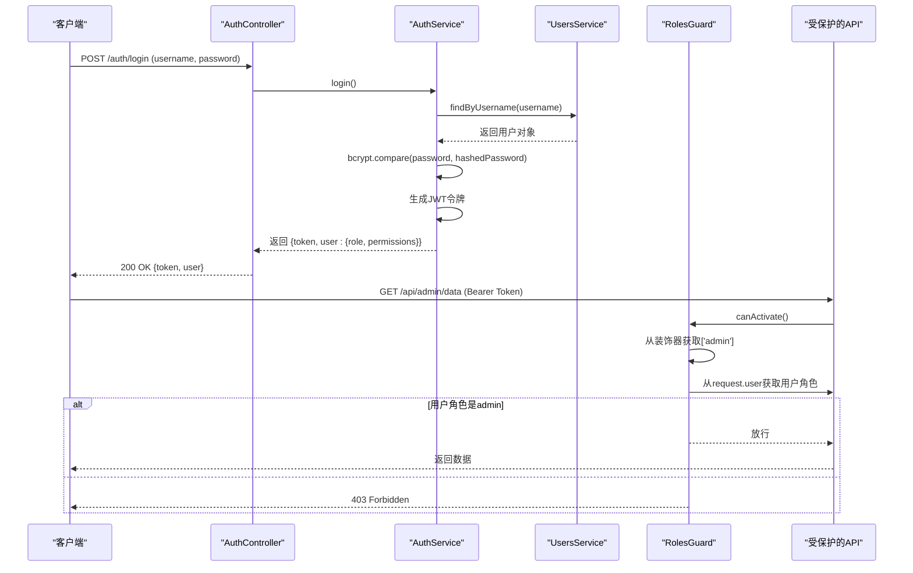
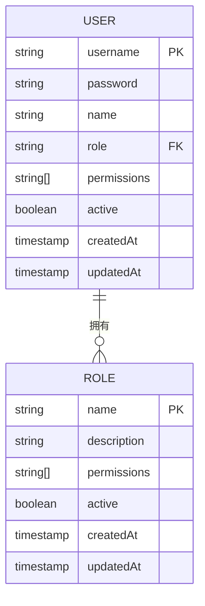

# 用户与角色数据模型

<cite>
**本文档引用的文件**   
- [user.entity.ts](file://backend/src/modules/users/models/user.entity.ts)
- [role.entity.ts](file://backend/src/modules/roles/models/role.entity.ts)
- [users.service.ts](file://backend/src/modules/users/users.service.ts)
- [roles.service.ts](file://backend/src/modules/roles/roles.service.ts)
- [jwt.strategy.ts](file://backend/src/modules/auth/jwt.strategy.ts)
- [auth.service.ts](file://backend/src/modules/auth/auth.service.ts)
- [roles.guard.ts](file://backend/src/modules/auth/guards/roles.guard.ts)
- [roles.decorator.ts](file://backend/src/modules/auth/decorators/roles.decorator.ts)
- [login-log.entity.ts](file://backend/src/modules/auth/models/login-log.entity.ts)
- [DATABASE_SCHEMA.md](file://backend/src/docs/DATABASE_SCHEMA.md)
</cite>

## 目录
1. [用户实体模型](#用户实体模型)
2. [角色实体模型](#角色实体模型)
3. [用户与角色关系](#用户与角色关系)
4. [权限控制实现](#权限控制实现)
5. [安全设计考量](#安全设计考量)
6. [RBAC权限模型](#rbac权限模型)

## 用户实体模型

用户实体（User Entity）定义了系统中用户的核心数据结构，包含认证信息、个人信息和权限配置。该模型基于Mongoose ODM构建，使用`@Schema`和`@Prop`装饰器进行数据建模。

### 字段定义

用户实体包含以下关键字段：

**认证信息**
- **用户名**: `username` (字符串, 必填, 唯一) - 用户的登录名，用于身份验证。
- **密码**: `password` (字符串, 必填) - 存储经过哈希加密的密码，永不以明文形式存储。

**个人信息**
- **姓名**: `name` (字符串, 必填) - 用户的真实姓名。
- **邮箱**: `email` (字符串, 可选) - 用户的电子邮箱地址。
- **电话**: `phone` (字符串, 可选) - 用户的联系电话。

**权限与状态**
- **角色**: `role` (字符串, 必填) - 用户所属的角色名称，如 "admin"、"manager" 等，是实现基于角色的访问控制（RBAC）的关键。
- **权限**: `permissions` (字符串数组, 默认为空数组) - 一个权限码列表，用于细粒度的访问控制。
- **激活状态**: `active` (布尔值, 默认为 `true`) - 标识用户账户是否处于激活状态。

**时间戳**
- `createdAt` 和 `updatedAt` - 由 `@Schema({ timestamps: true })` 自动管理，记录文档的创建和更新时间。

```typescript
@Schema({ timestamps: true })
export class User extends Document {
  @Prop({ required: true, unique: true })
  username: string;

  @Prop({ required: true })
  password: string;

  @Prop({ required: true })
  name: string;

  @Prop()
  email?: string;

  @Prop()
  phone?: string;

  @Prop({ required: true })
  role: string;

  @Prop({ type: [String], default: [] })
  permissions: string[];

  @Prop({ default: true })
  active: boolean;
}
```

**Section sources**
- [user.entity.ts](file://backend/src/modules/users/models/user.entity.ts#L15-L44)

## 角色实体模型

角色实体（Role Entity）定义了系统中角色的结构，是权限管理的基础。每个角色代表一组预定义的权限集合。

### 字段定义

角色实体包含以下关键字段：

- **名称**: `name` (字符串, 必填, 唯一) - 角色的唯一标识名称，如 "系统管理员"。
- **描述**: `description` (字符串, 必填) - 对角色职责和权限的详细说明。
- **权限**: `permissions` (字符串数组, 默认为空数组) - 该角色所拥有的所有权限码列表。
- **激活状态**: `active` (布尔值, 默认为 `true`) - 标识该角色定义是否有效。
- **时间戳**: `createdAt` 和 `updatedAt` - 由 `@Schema({ timestamps: true })` 自动管理。

```typescript
@Schema({ timestamps: true })
export class Role extends Document {
  @ApiProperty({ description: '角色名称' })
  @Prop({ required: true, unique: true })
  name: string;

  @ApiProperty({ description: '角色描述' })
  @Prop({ required: true })
  description: string;

  @ApiProperty({ description: '权限列表', type: [String] })
  @Prop({ type: [String], default: [] })
  permissions: string[];

  @ApiProperty({ description: '是否激活' })
  @Prop({ default: true })
  active: boolean;

  @ApiProperty({ description: '创建时间' })
  createdAt: Date;

  @ApiProperty({ description: '更新时间' })
  updatedAt: Date;
}
```

**Section sources**
- [role.entity.ts](file://backend/src/modules/roles/models/role.entity.ts#L6-L28)

## 用户与角色关系

系统采用**多对一（Many-to-One）** 的关系来连接用户和角色。这意味着：

- **一个角色可以被多个用户共享**。例如，系统中可以有多个“经理”或“普通员工”。
- **一个用户只能拥有一个角色**。用户的身份和权限由其 `role` 字段的值唯一确定。

这种设计简化了权限管理，使得权限的分配和变更可以通过修改用户的角色来批量完成。当需要调整某个角色的权限时，只需更新该角色的 `permissions` 数组，所有属于该角色的用户将自动继承新的权限。

### 权限字段的来源

虽然用户实体中直接存储了 `permissions` 字段，但其值并非独立维护。在用户创建和更新时，系统会根据其 `role` 字段自动填充默认权限。

```mermaid
flowchart TD
A[创建或更新用户] --> B{是否提供权限列表?}
B --> |是| C[使用提供的权限列表]
B --> |否| D[根据角色查询默认权限]
D --> E[调用 getDefaultPermissions(role)]
E --> F[返回预设的权限码数组]
F --> G[将权限数组赋值给用户]
G --> H[保存用户数据]
```

**Diagram sources**
- [users.service.ts](file://backend/src/modules/users/users.service.ts#L30-L112)

**Section sources**
- [users.service.ts](file://backend/src/modules/users/users.service.ts#L30-L112)

## 权限控制实现

系统的权限控制基于JWT（JSON Web Token）和NestJS的守卫（Guards）机制实现，形成了一个完整的认证与授权流程。

### JWT令牌中的权限

当用户成功登录时，`AuthService` 会生成一个JWT令牌。该令牌的载荷（payload）包含了用户的核心信息，包括 `username` 和 `userId`（`sub`）。更重要的是，登录成功后返回给客户端的响应中，会包含一个包含用户 `role` 和 `permissions` 的对象。

```typescript
// auth.service.ts
async login(username: string, password: string, ip: string, userAgent: string) {
  const user = await this.validateUser(username, password, ip, userAgent);
  // ... 验证逻辑
  const payload = { username: user.username, sub: user._id };
  const token = this.jwtService.sign(payload);
  
  return {
    token,
    user: {
      id: user._id,
      username: user.username,
      role: user.role,
      permissions: user.permissions, // 将权限信息返回给前端
      name: user.name
    },
  };
}
```

前端应用在收到此响应后，会将用户的 `role` 和 `permissions` 信息存储在本地（如 `localStorage` 或 `sessionStorage`），并在后续的UI渲染和API调用中使用这些信息。

### 基于角色的访问控制（RBAC）

系统实现了细粒度的RBAC，通过自定义的装饰器和守卫来保护API端点。

1.  **`@Roles` 装饰器**: 用于在控制器的方法上声明访问该方法所需的角色。
    ```typescript
    // roles.decorator.ts
    export const Roles = (...roles: string[]) => SetMetadata('roles', roles);
    ```
    例如，`@Roles('admin')` 表示只有管理员角色才能访问该接口。

2.  **`RolesGuard` 守卫**: 在请求到达控制器方法之前执行。它会从装饰器中提取所需的角色列表，并与当前请求用户（从JWT解码后存入 `request.user`）的角色进行比对。
    ```typescript
    // roles.guard.ts
    canActivate(context: ExecutionContext): boolean {
      const roles = this.reflector.get<string[]>('roles', context.getHandler());
      if (!roles) return true; // 如果没有设置角色要求，则放行
      const request = context.switchToHttp().getRequest();
      const user = request.user;
      return roles.includes(user.role); // 检查用户角色是否在允许的列表中
    }
    ```
    如果用户角色匹配，则请求被放行；否则，返回403 Forbidden错误。



**Diagram sources**
- [auth.service.ts](file://backend/src/modules/auth/auth.service.ts#L67-L113)
- [roles.guard.ts](file://backend/src/modules/auth/guards/roles.guard.ts#L0-L16)
- [roles.decorator.ts](file://backend/src/modules/auth/decorators/roles.decorator.ts#L0-L2)

**Section sources**
- [auth.service.ts](file://backend/src/modules/auth/auth.service.ts#L67-L113)
- [roles.guard.ts](file://backend/src/modules/auth/guards/roles.guard.ts#L0-L16)
- [roles.decorator.ts](file://backend/src/modules/auth/decorators/roles.decorator.ts#L0-L2)

## 安全设计考量

系统在设计上融入了多项安全措施，以保护用户数据和系统资源。

### 密码哈希策略

系统严格遵守密码安全最佳实践，绝不以明文存储密码。所有密码在存储前都使用 `bcrypt` 算法进行哈希加密。

- **加密库**: 使用 `bcrypt` 库，这是一个专门为密码哈希设计的、抗暴力破解的算法。
- **盐值（Salt）**: `bcrypt` 在哈希过程中会自动生成一个唯一的盐值，有效防止彩虹表攻击。
- **工作因子（Work Factor）**: 在 `UsersService` 中，`bcrypt.hash(password, 10)` 的第二个参数 `10` 是工作因子，它决定了哈希计算的复杂度。值越高，计算越慢，安全性也越高。`10` 是一个在安全性和性能之间取得良好平衡的常用值。

```typescript
// users.service.ts
async create(createUserDto: CreateUserDto) {
  const hashedPassword = await bcrypt.hash(createUserDto.password, 10); // 使用bcrypt和工作因子10进行哈希
  const createdUser = new this.userModel({
    ...createUserDto,
    password: hashedPassword // 存储哈希后的密码
  });
  // ...
}
```

### 审计日志机制

系统实现了关键操作的审计日志记录，以追踪用户活动和保障安全。

- **登录日志**: 系统通过 `LoginLog` 实体记录每一次登录尝试，无论成功或失败。
  - **记录内容**: 包含 `userId`、`timestamp`、`ip`（客户端IP地址）、`userAgent`（客户端浏览器信息）和 `status`（'success' 或 'failed'）。
  - **目的**: 用于安全审计、检测异常登录行为（如暴力破解）和故障排查。
- **角色变更审计**: 根据现有代码分析，系统**目前没有实现**专门的角色变更审计日志。当用户的角色被更新时，系统会更新 `User` 文档，但没有独立的日志条目来记录“谁在何时将用户A的角色从B改为了C”。这是一个潜在的安全增强点。

```typescript
// login-log.entity.ts
@Schema({ timestamps: true })
export class LoginLog extends Document {
  @Prop({ required: true })
  userId: string;

  @Prop({ required: true })
  timestamp: Date;

  @Prop({ required: true })
  ip: string;

  @Prop({ required: true })
  userAgent: string;

  @Prop({ required: true, enum: ['success', 'failed'] })
  status: 'success' | 'failed';
}
```

**Section sources**
- [users.service.ts](file://backend/src/modules/users/users.service.ts#L30-L35)
- [auth.service.ts](file://backend/src/modules/auth/auth.service.ts#L35-L65)
- [login-log.entity.ts](file://backend/src/modules/auth/models/login-log.entity.ts#L6-L21)

## RBAC权限模型

本系统采用基于角色的访问控制（Role-Based Access Control, RBAC）模型，将权限管理从用户个体转移到角色层面，极大地简化了权限的分配和维护。

### 模型结构



**Diagram sources**
- [user.entity.ts](file://backend/src/modules/users/models/user.entity.ts)
- [role.entity.ts](file://backend/src/modules/roles/models/role.entity.ts)

### 典型访问控制场景

1.  **管理员（admin）**: 拥有最高权限，可以访问系统所有功能，如用户管理、角色管理、数据统计等。其 `permissions` 通常为 `['*']`，表示通配符权限。
2.  **经理（manager）**: 拥有管理团队和客户的核心权限，如查看所有简历（`resume:all`）、管理所有客户（`customer:all`），但可能无法创建新用户（`user:create`）。
3.  **普通员工（employee）**: 拥有基础操作权限，如查看和创建简历（`resume:view`, `resume:create`）、查看和创建客户（`customer:view`, `customer:create`），但无法访问管理功能。

### 权限码设计

权限码采用 `资源:操作` 的命名规范，例如：
- `user:view`: 查看用户列表
- `user:create`: 创建新用户
- `resume:all`: 对简历拥有所有权限
- `customer:all`: 对客户拥有所有权限

这种设计使得权限的含义清晰，易于理解和扩展。

**Section sources**
- [DATABASE_SCHEMA.md](file://backend/src/docs/DATABASE_SCHEMA.md#L130-L252)
- [roles.service.ts](file://backend/src/modules/roles/roles.service.ts#L83-L132)
- [users.service.ts](file://backend/src/modules/users/users.service.ts#L110-L112)