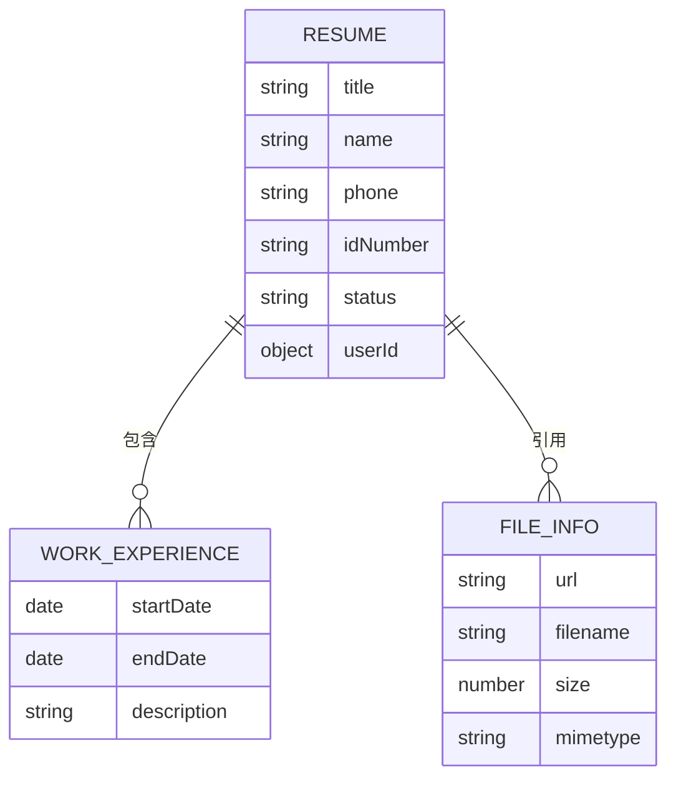
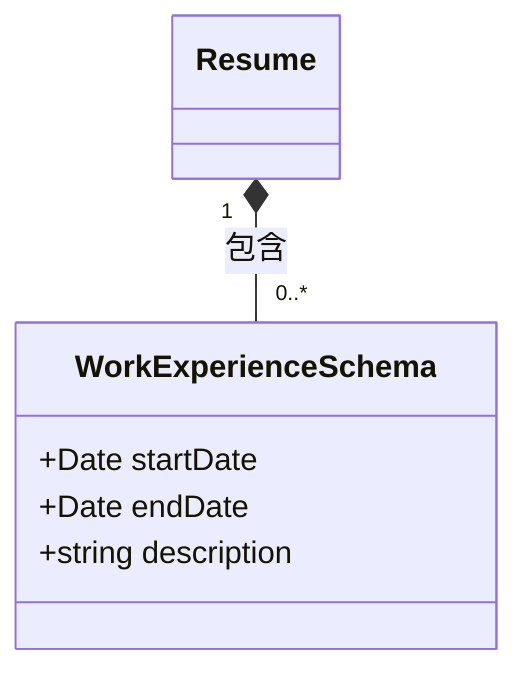
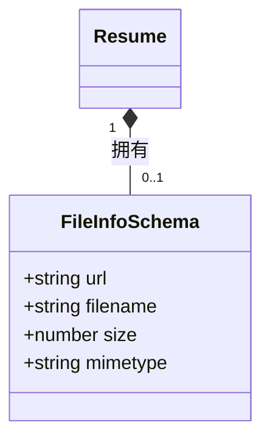
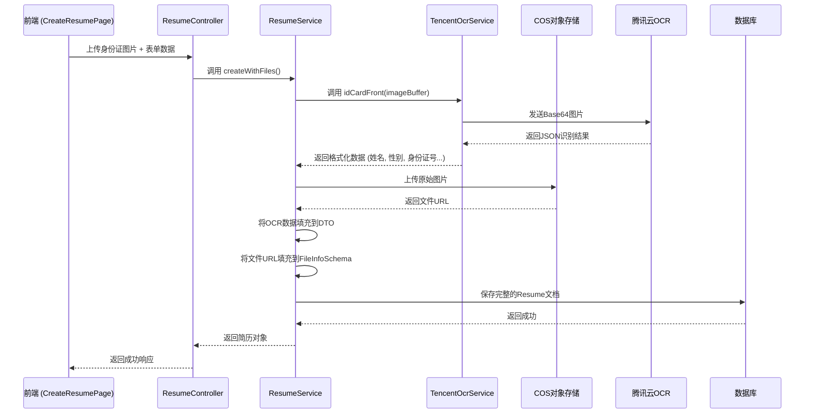

# 简历数据模型

<cite>
**本文档引用的文件**  
- [resume.entity.ts](file://backend/src/modules/resume/models/resume.entity.ts) - *在提交 f9fce021a375a73a7c3e3f9f9d517c34d88c0ac0 中更新了自我介绍字段*
- [work-experience.schema.ts](file://backend/src/modules/resume/models/work-experience.schema.ts)
- [file-info.schema.ts](file://backend/src/modules/resume/models/file-info.schema.ts)
- [tencent-ocr.service.ts](file://backend/src/modules/ocr/tencent-ocr.service.ts)
- [resume.service.ts](file://backend/src/modules/resume/resume.service.ts)
- [resume.controller.ts](file://backend/src/modules/resume/resume.controller.ts)
- [DATABASE_SCHEMA.md](file://backend/src/docs/DATABASE_SCHEMA.md) - *在提交 f9fce021a375a73a7c3e3f9f9d517c34d88c0ac0 中更新*
</cite>

## 更新摘要
**变更内容**   
- 更新了“简历主实体分析”部分，添加了对新字段 `selfIntroduction` 的说明。
- 在“数据验证与索引策略”部分补充了 `selfIntroduction` 字段的验证规则。
- 更新了所有受影响的文件源引用，标记了在最近提交中被修改的文件。
- 保持了文档其余部分的完整性，仅针对代码变更进行了精确更新。

## 目录
1. [简介](#简介)
2. [核心数据结构](#核心数据结构)
3. [简历主实体分析](#简历主实体分析)
4. [嵌套子文档设计](#嵌套子文档设计)
5. [数据验证与索引策略](#数据验证与索引策略)
6. [OCR数据集成流程](#ocr数据集成流程)
7. [性能与优化考量](#性能与优化考量)

## 简介
本文件详细阐述了简历管理模块的数据模型设计，涵盖简历主实体（`resume.entity.ts`）及其关联的嵌套Schema（`work-experience.schema.ts` 和 `file-info.schema.ts`）。文档深入解析了字段结构、数据验证规则、索引策略以及与OCR识别模块的集成流程，旨在为开发者和系统维护人员提供全面的技术参考。

## 核心数据结构
简历模块采用Mongoose作为ODM（对象文档映射）工具，构建了以`Resume`实体为核心的文档结构。该设计将个人基本信息、工作经历、技能标签和文件附件等数据整合在一个主文档中，并通过嵌入式子文档（Embedded Subdocuments）的方式管理复杂数据类型。

**图示来源**  
- [resume.entity.ts](file://backend/src/modules/resume/models/resume.entity.ts)
- [work-experience.schema.ts](file://backend/src/modules/resume/models/work-experience.schema.ts)
- [file-info.schema.ts](file://backend/src/modules/resume/models/file-info.schema.ts)

## 简历主实体分析
`Resume`实体是简历数据模型的核心，定义了服务人员的全部信息。

### 字段结构
`Resume`实体包含以下主要字段：

**个人基本信息**
- **姓名**: `name` (字符串，必填)
- **性别**: `gender` (枚举类型，`Gender`，必填)
- **年龄**: `age` (数字，必填)
- **手机号**: `phone` (字符串，必填，唯一)
- **微信**: `wechat` (字符串，可选)
- **身份证号**: `idNumber` (字符串，可选，唯一)

**职业与教育信息**
- **期望职位**: `expectedPosition` (字符串，必填)
- **工作类型**: `jobType` (枚举类型，`JobType`，必填)
- **期望薪资**: `expectedSalary` (数字，必填)
- **工作经验**: `workExperience` (数字，年)
- **学历**: `education` (枚举类型，`Education`，必填)
- **毕业院校**: `school` (字符串，必填)
- **专业**: `major` (字符串，必填)

**其他信息**
- **自我介绍**: `selfIntroduction` (字符串，可选，最大长度1000字符) - *新增于2.4.8版本*
- **状态**: `status` (字符串，如"pending", "active")
- **民族**: `ethnicity` (字符串，可选)
- **籍贯**: `nativePlace` (字符串，必填)
- **婚姻状况**: `maritalStatus` (枚举类型，`MaritalStatus`，可选)
- **宗教**: `religion` (枚举类型，`Religion`，可选)
- **出生日期**: `birthDate` (字符串，可选)
- **星座**: `zodiac` (枚举类型，`Zodiac`，可选)
- **服务区域**: `serviceArea` (字符串数组，可选)

**系统与审计字段**
- **用户ID**: `userId` (ObjectId，引用`User`实体，必填)
- **最后更新者**: `lastUpdatedBy` (ObjectId，引用`User`实体，可选)
- **文件ID数组**: `fileIds` (ObjectId数组，用于关联上传文件)

**Section sources**
- [resume.entity.ts](file://backend/src/modules/resume/models/resume.entity.ts#L0-L264) - *已更新*

## 嵌套子文档设计
为了管理复杂且可重复的数据，简历模型采用了嵌入式子文档（Embedded Subdocuments）的设计模式。

### 工作经历数组
`workExperiences`字段是一个`WorkExperienceSchema`对象的数组，用于存储多段工作经历。

**字段说明**:
- **开始日期**: `startDate` (日期类型，必填)
- **结束日期**: `endDate` (日期类型，必填)
- **描述**: `description` (字符串，必填)

**设计优势**:
- **读取性能高**: 查询简历时，所有工作经历可以一次性加载，避免了多次数据库查询（JOIN操作）。
- **数据一致性**: 相关数据存储在一起，保证了事务的原子性。

**潜在问题**:
- **文档膨胀**: 如果一个用户有大量工作经历，单个文档的大小会急剧增加，可能影响性能。
- **更新开销**: 更新数组中的单个元素可能需要重写整个文档。

**时间排序逻辑**: 在查询时，通常会使用`.sort()`方法对`workExperiences`数组进行排序，例如按`startDate`降序排列以显示最新的经历。

**Section sources**
- [work-experience.schema.ts](file://backend/src/modules/resume/models/work-experience.schema.ts#L0-L17)
- [resume.entity.ts](file://backend/src/modules/resume/models/resume.entity.ts#L178-L180)

### 文件信息与COS对象存储
`idCardFront`, `idCardBack`, `personalPhoto`, `certificates`, `reports`等字段使用`FileInfoSchema`来存储文件的元数据。

**字段说明**:
- **URL**: `url` (字符串，必填) - 文件在COS（腾讯云对象存储）中的访问链接。
- **文件名**: `filename` (字符串，必填) - 文件的原始名称。
- **大小**: `size` (数字，必填) - 文件大小（字节）。
- **MIME类型**: `mimetype` (字符串，必填) - 文件的媒体类型（如`image/jpeg`, `application/pdf`）。

**与COS的映射关系**:
1.  当用户上传文件时，`upload.service.ts`会将文件推送到COS。
2.  COS返回一个唯一的URL。
3.  系统将URL、文件名、大小和MIME类型等信息提取出来，填充到`FileInfoSchema`中。
4.  这个`FileInfoSchema`对象被嵌入到`Resume`文档的相应字段中。
5.  前端通过`url`字段直接访问COS上的文件进行展示。

**Section sources**
- [file-info.schema.ts](file://backend/src/modules/resume/models/file-info.schema.ts#L0-L20)
- [resume.entity.ts](file://backend/src/modules/resume/models/resume.entity.ts#L182-L196)

## 数据验证与索引策略
### 数据验证规则
模型通过`class-validator`库和Mongoose的内置验证器来确保数据的完整性和正确性。

**必填字段 (`@IsString`, `@IsNumber`, `required: true`)**
- `name`, `phone`, `gender`, `age`, `expectedPosition`, `jobType`, `expectedSalary`, `workExperience`, `education`, `school`, `major`, `nativePlace`, `experienceYears`

**可选字段 (`@IsOptional`)**
- `wechat`, `idNumber`, `selfIntroduction`, `remarks`, `ethnicity`, `maritalStatus`, `religion`, `currentAddress`, `hukouAddress`, `birthDate`, `zodiac`, `orderStatus`, `leadSource`

**枚举验证 (`@IsEnum`)**
- `gender`, `jobType`, `education`, `maritalStatus`, `religion`, `zodiac`, `zodiacSign`, `skills`

**新增字段验证**
- `selfIntroduction`: 使用 `@IsString()` 和 `@IsOptional()` 进行验证，并通过 `@Transform` 处理字符串的空格和换行。

**唯一性索引**
- `phone` 字段在数据库层面有唯一索引，防止手机号重复。
- `idNumber` 字段有**稀疏唯一索引**（`sparse: true, unique: true`），这意味着只有当`idNumber`有值时才会进行唯一性检查，允许存在多个`idNumber`为空的简历。

**Section sources**
- [resume.entity.ts](file://backend/src/modules/resume/models/resume.entity.ts#L0-L264) - *已更新*
- [create-resume.dto.ts](file://backend/src/modules/resume/dto/create-resume.dto.ts#L492-L846) - *包含selfIntroduction字段的完整验证规则*

### 索引策略
- **稀疏唯一索引**: `ResumeSchema.index({ idNumber: 1 }, { unique: true, sparse: true, background: true })` 确保身份证号的唯一性，同时允许空值。
- **复合查询索引**: 虽然代码中未显式定义，但根据`searchWorkers`方法的查询逻辑（按`phone`或`name`搜索），可以推断出`phone`和`name`字段上应有索引以优化搜索性能。
- **排序索引**: `updatedAt`和`createdAt`字段通常有索引，以支持按时间排序的查询。

## OCR数据集成流程
系统集成了腾讯云OCR服务，用于从身份证图片中自动提取文本信息，填充简历。

### 集成流程
1.  **文件上传**: 用户在前端上传身份证正反面图片。
2.  **后端接收**: `resume.controller.ts`的`create`方法接收上传的文件。
3.  **调用OCR服务**: `resume.service.ts`在创建简历前，会调用`TencentOcrService`。
4.  **执行识别**: `TencentOcrService`将图片转换为Base64编码，调用腾讯云OCR API。
5.  **数据提取与填充**: OCR服务返回结构化数据（如姓名、性别、身份证号、地址等），`resume.service.ts`将这些数据提取并填充到`CreateResumeDto`中。
6.  **创建简历**: 使用填充了OCR数据的DTO创建最终的简历文档。

**关键代码点**:
- **OCR服务实现**: `tencent-ocr.service.ts`中的`idCardFront`和`idCardBack`方法负责与腾讯云API交互。
- **错误处理**: OCR服务包含重试机制（`retry-operation`）和详细的错误处理，确保服务的健壮性。
- **数据格式化**: OCR服务将腾讯云返回的数据格式化为统一的结构，便于上层服务使用。

**Section sources**
- [tencent-ocr.service.ts](file://backend/src/modules/ocr/tencent-ocr.service.ts#L8-L191)
- [resume.service.ts](file://backend/src/modules/resume/resume.service.ts#L14-L1013)
- [resume.controller.ts](file://backend/src/modules/resume/resume.controller.ts#L23-L1022)

## 性能与优化考量
### 优点
- **读取性能优异**: 嵌入式子文档设计减少了数据库查询次数，提高了读取效率。
- **数据局部性好**: 相关数据存储在一起，有利于缓存。

### 潜在问题与优化建议
- **文档膨胀**: `workExperiences`和`certificates`等数组字段可能导致文档过大。建议监控文档大小，必要时可考虑将历史工作经历或大量证书迁移到独立的集合中。
- **索引维护**: 频繁更新的数组字段可能影响索引性能。应定期分析查询模式，优化索引。
- **OCR延迟**: OCR识别是耗时操作，应在非阻塞的异步流程中处理，避免影响主创建流程的响应时间。