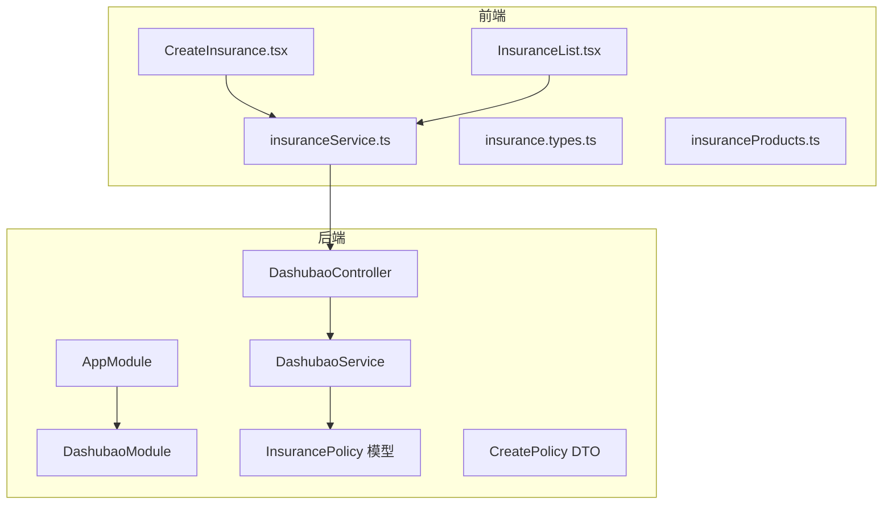
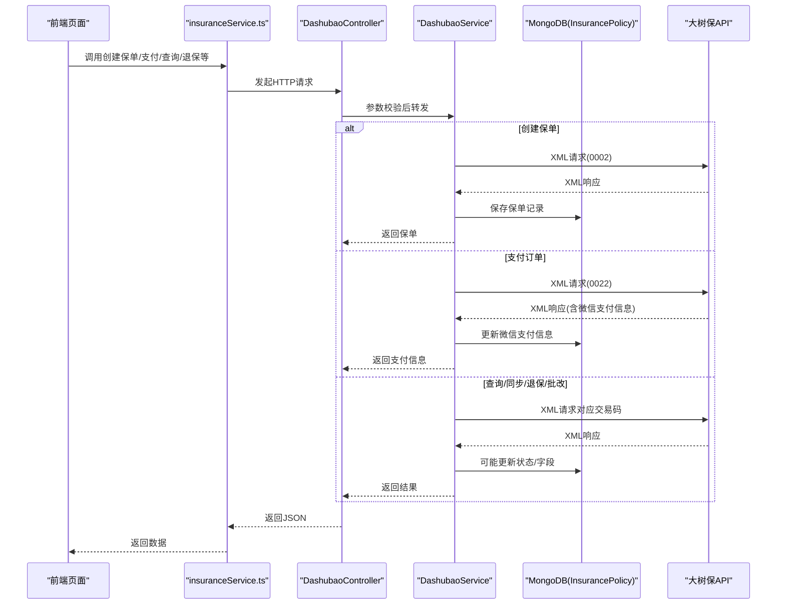
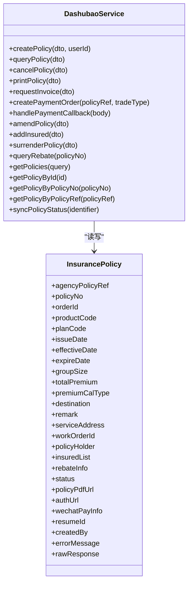
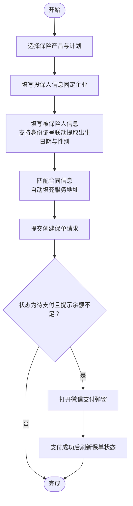
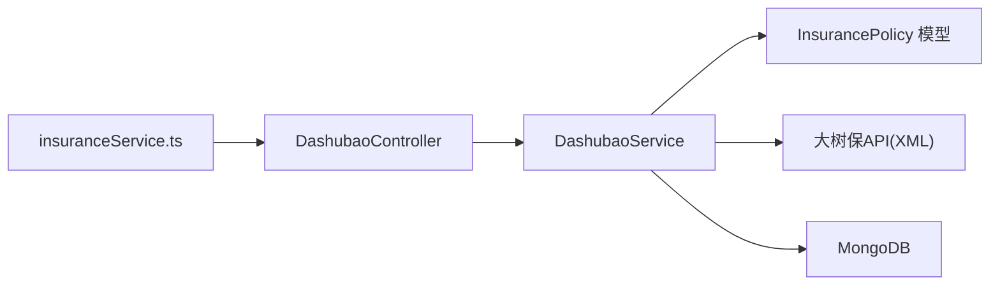

# 保险管理

<cite>
**本文引用的文件**
- [backend/src/modules/dashubao/dashubao.module.ts](file://backend/src/modules/dashubao/dashubao.module.ts)
- [backend/src/modules/dashubao/dashubao.controller.ts](file://backend/src/modules/dashubao/dashubao.controller.ts)
- [backend/src/modules/dashubao/dashubao.service.ts](file://backend/src/modules/dashubao/dashubao.service.ts)
- [backend/src/modules/dashubao/models/insurance-policy.model.ts](file://backend/src/modules/dashubao/models/insurance-policy.model.ts)
- [backend/src/modules/dashubao/dto/create-policy.dto.ts](file://backend/src/modules/dashubao/dto/create-policy.dto.ts)
- [backend/src/app.module.ts](file://backend/src/app.module.ts)
- [frontend/src/pages/insurance/CreateInsurance.tsx](file://frontend/src/pages/insurance/CreateInsurance.tsx)
- [frontend/src/pages/insurance/InsuranceList.tsx](file://frontend/src/pages/insurance/InsuranceList.tsx)
- [frontend/src/services/insuranceService.ts](file://frontend/src/services/insuranceService.ts)
- [frontend/src/types/insurance.types.ts](file://frontend/src/types/insurance.types.ts)
- [frontend/src/config/insuranceProducts.ts](file://frontend/src/config/insuranceProducts.ts)
</cite>

## 目录
1. [简介](#简介)
2. [项目结构](#项目结构)
3. [核心组件](#核心组件)
4. [架构总览](#架构总览)
5. [详细组件分析](#详细组件分析)
6. [依赖分析](#依赖分析)
7. [性能考虑](#性能考虑)
8. [故障排查指南](#故障排查指南)
9. [结论](#结论)
10. [附录](#附录)

## 简介
本项目提供“保险管理”能力，围绕大树保（Dashubao）保险平台，实现从“新建投保”到“保单管理”的全链路闭环：
- 前端提供可视化流程与交互（选择产品、填写被保险人、支付、打印、退保、换人等）
- 后端通过模块化设计对接大树保API，完成保单创建、状态同步、支付、退保、批改等操作，并持久化到MongoDB
- 通过Swagger标注API，便于前后端协作与联调

## 项目结构
保险模块位于后端的独立模块中，采用“控制器-服务-模型-DTO”的分层组织；前端提供两个页面：新建投保与保单列表管理；并通过服务封装统一的API调用。

图表来源
- [backend/src/app.module.ts](file://backend/src/app.module.ts#L1-L70)
- [backend/src/modules/dashubao/dashubao.module.ts](file://backend/src/modules/dashubao/dashubao.module.ts#L1-L21)
- [backend/src/modules/dashubao/dashubao.controller.ts](file://backend/src/modules/dashubao/dashubao.controller.ts#L1-L214)
- [backend/src/modules/dashubao/dashubao.service.ts](file://backend/src/modules/dashubao/dashubao.service.ts#L1-L770)
- [backend/src/modules/dashubao/models/insurance-policy.model.ts](file://backend/src/modules/dashubao/models/insurance-policy.model.ts#L1-L271)
- [backend/src/modules/dashubao/dto/create-policy.dto.ts](file://backend/src/modules/dashubao/dto/create-policy.dto.ts#L1-L380)
- [frontend/src/services/insuranceService.ts](file://frontend/src/services/insuranceService.ts#L1-L115)
- [frontend/src/pages/insurance/CreateInsurance.tsx](file://frontend/src/pages/insurance/CreateInsurance.tsx#L1-L993)
- [frontend/src/pages/insurance/InsuranceList.tsx](file://frontend/src/pages/insurance/InsuranceList.tsx#L1-L718)
- [frontend/src/types/insurance.types.ts](file://frontend/src/types/insurance.types.ts#L1-L258)
- [frontend/src/config/insuranceProducts.ts](file://frontend/src/config/insuranceProducts.ts#L1-L17)

章节来源
- [backend/src/app.module.ts](file://backend/src/app.module.ts#L1-L70)
- [backend/src/modules/dashubao/dashubao.module.ts](file://backend/src/modules/dashubao/dashubao.module.ts#L1-L21)

## 核心组件
- DashubaoModule：模块装配，注册Mongoose模型、控制器与服务
- DashubaoController：对外暴露REST接口，鉴权与参数校验
- DashubaoService：业务逻辑核心，封装大树保API交互、XML构建与解析、本地数据持久化
- InsurancePolicy 模型：MongoDB Schema定义，含保单状态、投保人/被保险人/返佣信息、微信支付信息等
- CreatePolicy DTO：请求参数校验与转换
- 前端 CreateInsurance 页面：产品选择、被保险人录入、合同/简历联动、支付引导
- 前端 InsuranceList 页面：保单列表、状态同步、打印、退保、换人、支付

章节来源
- [backend/src/modules/dashubao/dashubao.module.ts](file://backend/src/modules/dashubao/dashubao.module.ts#L1-L21)
- [backend/src/modules/dashubao/dashubao.controller.ts](file://backend/src/modules/dashubao/dashubao.controller.ts#L1-L214)
- [backend/src/modules/dashubao/dashubao.service.ts](file://backend/src/modules/dashubao/dashubao.service.ts#L1-L770)
- [backend/src/modules/dashubao/models/insurance-policy.model.ts](file://backend/src/modules/dashubao/models/insurance-policy.model.ts#L1-L271)
- [backend/src/modules/dashubao/dto/create-policy.dto.ts](file://backend/src/modules/dashubao/dto/create-policy.dto.ts#L1-L380)
- [frontend/src/pages/insurance/CreateInsurance.tsx](file://frontend/src/pages/insurance/CreateInsurance.tsx#L1-L993)
- [frontend/src/pages/insurance/InsuranceList.tsx](file://frontend/src/pages/insurance/InsuranceList.tsx#L1-L718)
- [frontend/src/services/insuranceService.ts](file://frontend/src/services/insuranceService.ts#L1-L115)
- [frontend/src/types/insurance.types.ts](file://frontend/src/types/insurance.types.ts#L1-L258)
- [frontend/src/config/insuranceProducts.ts](file://frontend/src/config/insuranceProducts.ts#L1-L17)

## 架构总览
后端采用NestJS模块化架构，Dashubao模块通过Mongoose连接MongoDB，控制器负责鉴权与参数校验，服务层负责与大树保API交互及本地数据持久化。前端通过统一的服务封装调用后端接口，页面负责用户体验与业务流程编排。

图表来源
- [backend/src/modules/dashubao/dashubao.controller.ts](file://backend/src/modules/dashubao/dashubao.controller.ts#L1-L214)
- [backend/src/modules/dashubao/dashubao.service.ts](file://backend/src/modules/dashubao/dashubao.service.ts#L1-L770)
- [backend/src/modules/dashubao/models/insurance-policy.model.ts](file://backend/src/modules/dashubao/models/insurance-policy.model.ts#L1-L271)
- [frontend/src/services/insuranceService.ts](file://frontend/src/services/insuranceService.ts#L1-L115)

## 详细组件分析

### 后端模块与依赖注入
- DashubaoModule 导入 ConfigModule 与 MongooseModule.forFeature，注册控制器与服务，并导出服务供其他模块使用
- AppModule 将 DashubaoModule 注册到根模块，确保全局可用

章节来源
- [backend/src/modules/dashubao/dashubao.module.ts](file://backend/src/modules/dashubao/dashubao.module.ts#L1-L21)
- [backend/src/app.module.ts](file://backend/src/app.module.ts#L1-L70)

### 控制器：接口定义与鉴权
- 接口覆盖：创建保单、查询保单、注销保单、打印保单、申请发票、创建支付订单、支付回调、批改、批增、退保、返佣查询、本地保单列表与详情、状态同步
- 鉴权：除支付回调外，均使用JWT鉴权
- 参数校验：使用Swagger注解与DTO校验

章节来源
- [backend/src/modules/dashubao/dashubao.controller.ts](file://backend/src/modules/dashubao/dashubao.controller.ts#L1-L214)

### 服务：业务逻辑与大树保API交互
- 环境配置：根据NODE_ENV自动切换测试/生产环境，读取用户名与密码
- XML构建与解析：统一构建请求XML与解析响应XML
- 保单生命周期：
  - 创建保单：生成渠道流水号，构造XML，调用大树保API，保存本地记录
  - 支付订单：查询本地保单，构造支付XML，更新微信支付信息
  - 支付回调：解析大树保回调XML，更新本地保单状态
  - 查询/同步：支持按保单号或商户单号查询，同步状态
  - 注销/退保：调用对应交易码，更新本地状态
  - 打印保单：返回PDF二进制流
  - 批改/批增：替换被保险人、增加被保险人
  - 返佣查询：查询返佣信息
- 数据持久化：使用Mongoose Schema，建立索引以提升查询效率

图表来源
- [backend/src/modules/dashubao/dashubao.service.ts](file://backend/src/modules/dashubao/dashubao.service.ts#L1-L770)
- [backend/src/modules/dashubao/models/insurance-policy.model.ts](file://backend/src/modules/dashubao/models/insurance-policy.model.ts#L1-L271)

章节来源
- [backend/src/modules/dashubao/dashubao.service.ts](file://backend/src/modules/dashubao/dashubao.service.ts#L1-L770)
- [backend/src/modules/dashubao/models/insurance-policy.model.ts](file://backend/src/modules/dashubao/models/insurance-policy.model.ts#L1-L271)

### 数据模型：InsurancePolicy
- 字段覆盖：保单基础信息、投保人、被保险人列表、返佣信息、状态、电子保单URL、微信支付信息、关联简历ID、创建人ID、错误信息、原始响应
- 索引：按创建时间倒序、按简历ID+状态复合索引、按投保人索引，提升查询性能

章节来源
- [backend/src/modules/dashubao/models/insurance-policy.model.ts](file://backend/src/modules/dashubao/models/insurance-policy.model.ts#L1-L271)

### DTO：参数校验与转换
- CreatePolicyDto：产品代码、计划代码、生效/结束日期、被保险人数量、总保费、服务地址、工作单号、投保人、被保险人列表、返佣信息、简历ID
- 其他DTO：查询、注销、打印、发票、退保、批改、批增等

章节来源
- [backend/src/modules/dashubao/dto/create-policy.dto.ts](file://backend/src/modules/dashubao/dto/create-policy.dto.ts#L1-L380)

### 前端：新建投保流程
- 产品选择：展示保险产品与计划，支持月/年计划与月数选择，自动计算总保费
- 被保险人录入：支持多被保险人，身份证号联动提取出生日期与性别
- 合同/简历联动：根据姓名/身份证/手机号匹配合同信息，自动填充服务地址
- 提交与支付：提交后若状态为待支付且提示余额不足，则打开支付弹窗；支付成功后刷新保单状态

图表来源
- [frontend/src/pages/insurance/CreateInsurance.tsx](file://frontend/src/pages/insurance/CreateInsurance.tsx#L1-L993)
- [frontend/src/services/insuranceService.ts](file://frontend/src/services/insuranceService.ts#L1-L115)
- [frontend/src/types/insurance.types.ts](file://frontend/src/types/insurance.types.ts#L1-L258)
- [frontend/src/config/insuranceProducts.ts](file://frontend/src/config/insuranceProducts.ts#L1-L17)

章节来源
- [frontend/src/pages/insurance/CreateInsurance.tsx](file://frontend/src/pages/insurance/CreateInsurance.tsx#L1-L993)
- [frontend/src/services/insuranceService.ts](file://frontend/src/services/insuranceService.ts#L1-L115)
- [frontend/src/types/insurance.types.ts](file://frontend/src/types/insurance.types.ts#L1-L258)
- [frontend/src/config/insuranceProducts.ts](file://frontend/src/config/insuranceProducts.ts#L1-L17)

### 前端：保单列表与管理
- 列表展示：支持按状态过滤、分页、刷新
- 操作能力：查看详情、打印保单、同步状态、注销保单、换人、退保、支付
- 退保与换人：弹窗收集必要信息，调用后端接口，成功后刷新列表

章节来源
- [frontend/src/pages/insurance/InsuranceList.tsx](file://frontend/src/pages/insurance/InsuranceList.tsx#L1-L718)
- [frontend/src/services/insuranceService.ts](file://frontend/src/services/insuranceService.ts#L1-L115)
- [frontend/src/types/insurance.types.ts](file://frontend/src/types/insurance.types.ts#L1-L258)

## 依赖分析
- 模块耦合
  - DashubaoModule 仅依赖 ConfigModule 与 MongooseModule，职责清晰
  - DashubaoController 依赖 DashubaoService，保持控制器薄逻辑
  - DashubaoService 依赖 ConfigService、Mongoose Model、axios、xml2js
- 外部依赖
  - 大树保API：通过XML协议交互，支持多种交易码
  - MongoDB：存储保单与相关元数据
  - 前端：Ant Design + Ant Design Pro，统一的服务封装与类型定义

图表来源
- [backend/src/modules/dashubao/dashubao.controller.ts](file://backend/src/modules/dashubao/dashubao.controller.ts#L1-L214)
- [backend/src/modules/dashubao/dashubao.service.ts](file://backend/src/modules/dashubao/dashubao.service.ts#L1-L770)
- [backend/src/modules/dashubao/models/insurance-policy.model.ts](file://backend/src/modules/dashubao/models/insurance-policy.model.ts#L1-L271)
- [frontend/src/services/insuranceService.ts](file://frontend/src/services/insuranceService.ts#L1-L115)

章节来源
- [backend/src/modules/dashubao/dashubao.controller.ts](file://backend/src/modules/dashubao/dashubao.controller.ts#L1-L214)
- [backend/src/modules/dashubao/dashubao.service.ts](file://backend/src/modules/dashubao/dashubao.service.ts#L1-L770)
- [frontend/src/services/insuranceService.ts](file://frontend/src/services/insuranceService.ts#L1-L115)

## 性能考虑
- 数据库索引：模型已建立按创建时间倒序、简历ID+状态、投保人索引，有助于分页与条件查询
- 异步并发：列表查询同时执行数据与总数查询，减少往返次数
- 日志与超时：服务层对大树保API设置超时，避免阻塞；日志输出请求与响应，便于定位问题
- 前端分页：列表页支持自定义页码与条数，减轻后端压力

章节来源
- [backend/src/modules/dashubao/models/insurance-policy.model.ts](file://backend/src/modules/dashubao/models/insurance-policy.model.ts#L266-L271)
- [backend/src/modules/dashubao/dashubao.service.ts](file://backend/src/modules/dashubao/dashubao.service.ts#L138-L182)
- [frontend/src/pages/insurance/InsuranceList.tsx](file://frontend/src/pages/insurance/InsuranceList.tsx#L480-L499)

## 故障排查指南
- 支付回调未生效
  - 检查回调地址是否正确配置（BACKEND_BASE_URL），确认回调XML解析与状态更新逻辑
  - 关注日志中回调请求体与处理结果
- 保单状态不同步
  - 使用“同步保单状态”接口，支持按保单号或商户单号查询
  - 若大树保返回PDF链接，视为已生效
- 退保失败
  - 确认保单号与退保原因参数正确
  - 查看返回的Message字段，核对大树保侧状态
- 打印保单为空
  - 确认大树保返回的PDF URL存在
  - 前端下载Blob时检查Content-Type与文件名
- 参数校验失败
  - 前端提交前已做基础校验，后端DTO也会拦截非法参数
  - 检查日期格式（yyyyMMddHHmmss）、证件类型与性别枚举

章节来源
- [backend/src/modules/dashubao/dashubao.service.ts](file://backend/src/modules/dashubao/dashubao.service.ts#L500-L549)
- [backend/src/modules/dashubao/dashubao.service.ts](file://backend/src/modules/dashubao/dashubao.service.ts#L702-L767)
- [frontend/src/pages/insurance/InsuranceList.tsx](file://frontend/src/pages/insurance/InsuranceList.tsx#L95-L114)
- [frontend/src/types/insurance.types.ts](file://frontend/src/types/insurance.types.ts#L1-L258)

## 结论
该保险管理模块通过清晰的模块划分与严格的参数校验，实现了与大树保API的稳定对接，并在前端提供了完整的用户体验。建议持续关注：
- 大树保API变更与交易码兼容性
- 前端交互细节优化（如批量操作、导出报表）
- 监控与告警：对大树保API超时与失败率进行观测

## 附录
- 常用接口路径（后端）
  - POST /api/dashubao/policy：创建保单
  - POST /api/dashubao/policy/query：查询保单
  - POST /api/dashubao/policy/cancel：注销保单
  - POST /api/dashubao/policy/print：打印保单（PDF）
  - POST /api/dashubao/policy/invoice：申请电子发票
  - POST /api/dashubao/policy/payment/{policyRef}：创建支付订单
  - POST /api/dashubao/payment/callback：支付回调
  - POST /api/dashubao/policy/amend：批改（换人）
  - POST /api/dashubao/policy/add-insured：批增（增加被保险人）
  - POST /api/dashubao/policy/surrender：退保
  - GET /api/dashubao/policy/rebate/{policyNo}：返佣查询
  - GET /api/dashubao/policies：本地保单列表
  - GET /api/dashubao/policy/{id}：按ID获取保单
  - GET /api/dashubao/policy/by-policy-no/{policyNo}：按保单号获取
  - GET /api/dashubao/policy/by-policy-ref/{policyRef}：按商户单号获取
  - POST /api/dashubao/policy/sync/{policyNo}：同步保单状态

章节来源
- [backend/src/modules/dashubao/dashubao.controller.ts](file://backend/src/modules/dashubao/dashubao.controller.ts#L1-L214)