# 可用性日历系统

<cite>
**本文档引用的文件**
- [frontend/src/components/AvailabilityCalendar/index.tsx](file://frontend/src/components/AvailabilityCalendar/index.tsx)
- [frontend/src/services/api.ts](file://frontend/src/services/api.ts)
- [backend/src/modules/resume/resume.controller.ts](file://backend/src/modules/resume/resume.controller.ts)
- [backend/src/modules/resume/resume.service.ts](file://backend/src/modules/resume/resume.service.ts)
- [backend/src/modules/resume/dto/availability.dto.ts](file://backend/src/modules/resume/dto/availability.dto.ts)
- [backend/src/modules/resume/models/availability-period.schema.ts](file://backend/src/modules/resume/models/availability-period.schema.ts)
- [backend/src/modules/resume/models/resume.entity.ts](file://backend/src/modules/resume/models/resume.entity.ts)
- [backend/test-availability-api.js](file://backend/test-availability-api.js)
</cite>

## 目录
1. [简介](#简介)
2. [项目结构](#项目结构)
3. [核心组件](#核心组件)
4. [架构概览](#架构概览)
5. [详细组件分析](#详细组件分析)
6. [依赖关系分析](#依赖关系分析)
7. [性能考虑](#性能考虑)
8. [故障排除指南](#故障排除指南)
9. [结论](#结论)

## 简介

可用性日历系统是一个专门为月嫂服务设计的档期管理系统。该系统允许用户查看和管理月嫂的可用性状态，包括可接单、不可接单、订单占用、请假等不同状态。系统采用前后端分离架构，前端使用React + Ant Design构建用户界面，后端使用NestJS + MongoDB提供RESTful API服务。

该系统的核心功能包括：
- 年度档期可视化展示
- 档期状态管理（可接单、不可接单、占用、请假）
- 档期冲突检查
- 批量档期更新
- 档期删除功能

## 项目结构

整个项目采用模块化的组织方式，主要分为三个部分：

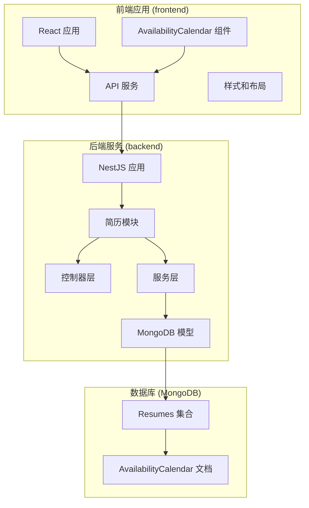

**图表来源**
- [frontend/src/components/AvailabilityCalendar/index.tsx](file://frontend/src/components/AvailabilityCalendar/index.tsx#L1-L318)
- [backend/src/modules/resume/resume.controller.ts](file://backend/src/modules/resume/resume.controller.ts#L2200-L2306)

**章节来源**
- [frontend/src/components/AvailabilityCalendar/index.tsx](file://frontend/src/components/AvailabilityCalendar/index.tsx#L1-L318)
- [backend/src/modules/resume/resume.controller.ts](file://backend/src/modules/resume/resume.controller.ts#L2200-L2306)

## 核心组件

### 前端组件架构

前端的可用性日历组件采用函数式组件设计，使用React Hooks管理状态和生命周期。组件支持以下核心特性：

- **年度视图**：显示完整的年历，包含12个月份
- **状态可视化**：使用颜色编码表示不同的档期状态
- **交互式操作**：支持档期更新、删除等操作
- **响应式设计**：适配不同屏幕尺寸

### 后端API架构

后端提供完整的RESTful API接口，支持档期的增删改查操作：

- **GET** `/api/resumes/:id/availability` - 获取档期数据
- **POST** `/api/resumes/:id/availability` - 更新档期
- **DELETE** `/api/resumes/:id/availability` - 删除档期
- **GET** `/api/resumes/:id/availability/check` - 检查档期可用性

**章节来源**
- [frontend/src/components/AvailabilityCalendar/index.tsx](file://frontend/src/components/AvailabilityCalendar/index.tsx#L35-L314)
- [backend/src/modules/resume/resume.controller.ts](file://backend/src/modules/resume/resume.controller.ts#L2200-L2306)

## 架构概览

系统采用经典的三层架构设计，实现了清晰的职责分离：

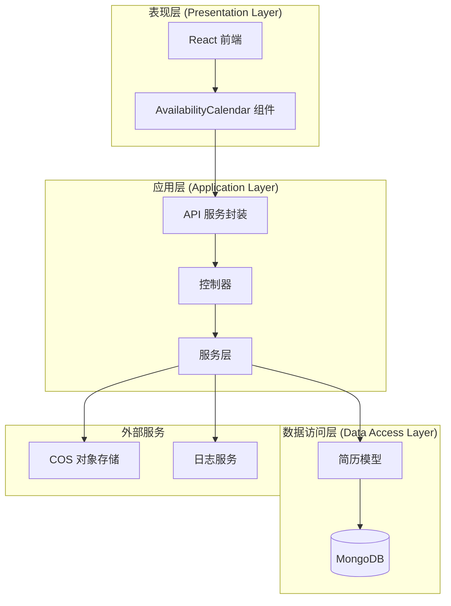

**图表来源**
- [frontend/src/services/api.ts](file://frontend/src/services/api.ts#L179-L226)
- [backend/src/modules/resume/resume.controller.ts](file://backend/src/modules/resume/resume.controller.ts#L2200-L2306)
- [backend/src/modules/resume/resume.service.ts](file://backend/src/modules/resume/resume.service.ts#L18-L31)

## 详细组件分析

### 前端可用性日历组件

#### 组件结构分析

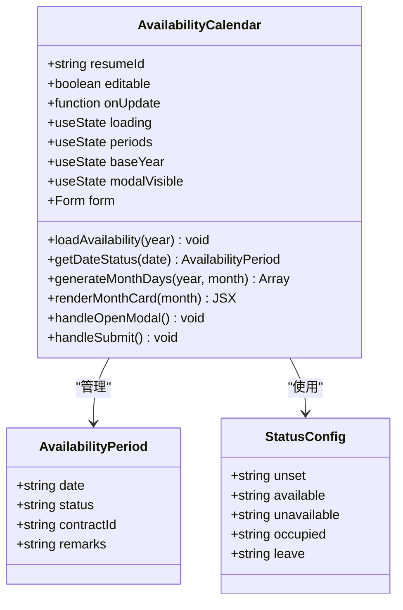

**图表来源**
- [frontend/src/components/AvailabilityCalendar/index.tsx](file://frontend/src/components/AvailabilityCalendar/index.tsx#L12-L31)

#### 数据流分析

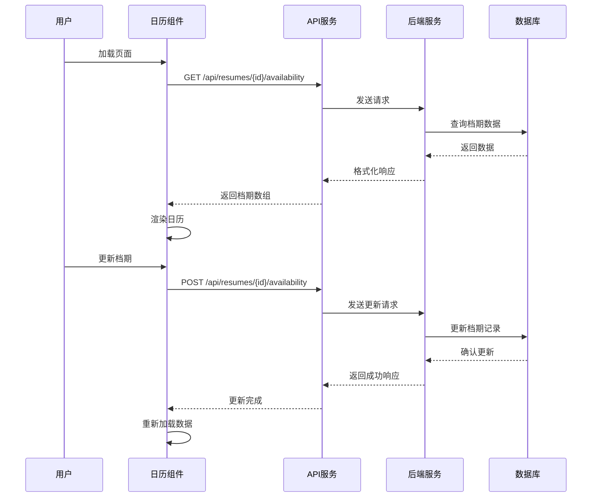

**图表来源**
- [frontend/src/components/AvailabilityCalendar/index.tsx](file://frontend/src/components/AvailabilityCalendar/index.tsx#L42-L78)
- [frontend/src/services/api.ts](file://frontend/src/services/api.ts#L179-L226)

**章节来源**
- [frontend/src/components/AvailabilityCalendar/index.tsx](file://frontend/src/components/AvailabilityCalendar/index.tsx#L35-L314)

### 后端服务架构

#### 控制器层分析

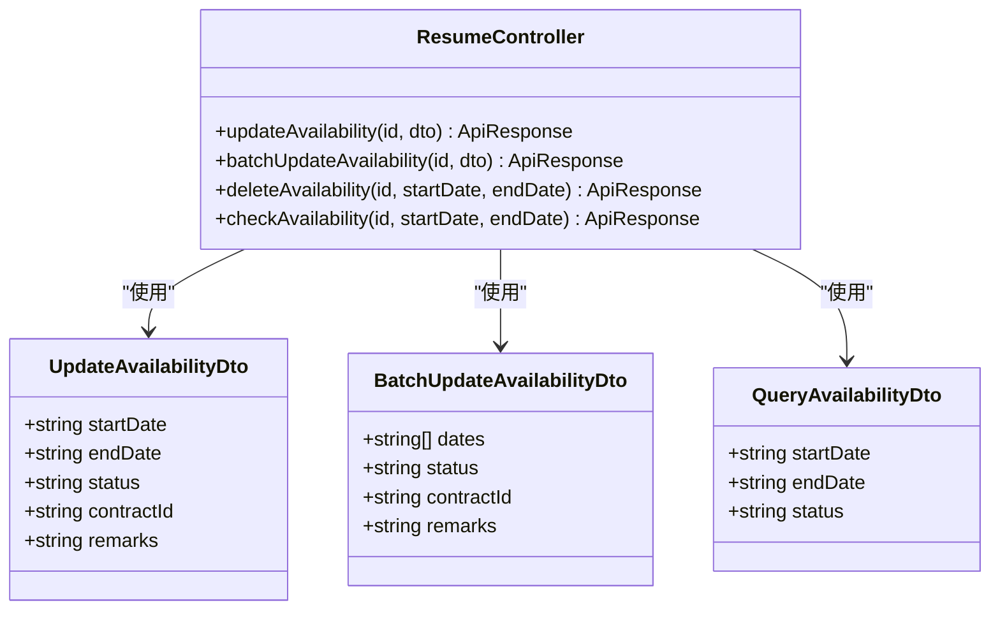

**图表来源**
- [backend/src/modules/resume/resume.controller.ts](file://backend/src/modules/resume/resume.controller.ts#L2200-L2306)
- [backend/src/modules/resume/dto/availability.dto.ts](file://backend/src/modules/resume/dto/availability.dto.ts#L6-L35)

#### 服务层实现

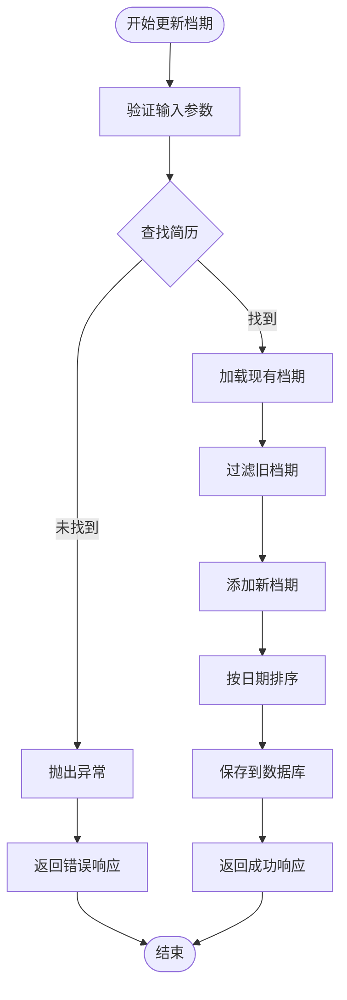

**图表来源**
- [backend/src/modules/resume/resume.service.ts](file://backend/src/modules/resume/resume.service.ts#L1964-L2012)

**章节来源**
- [backend/src/modules/resume/resume.controller.ts](file://backend/src/modules/resume/resume.controller.ts#L2200-L2306)
- [backend/src/modules/resume/resume.service.ts](file://backend/src/modules/resume/resume.service.ts#L1964-L2109)

### 数据模型设计

#### 档期状态枚举

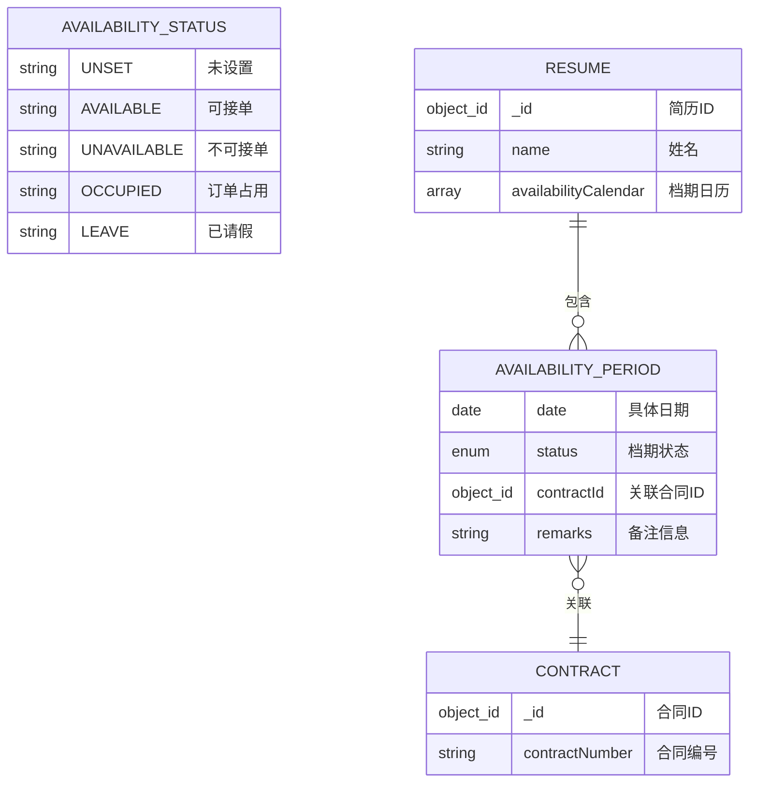

**图表来源**
- [backend/src/modules/resume/models/availability-period.schema.ts](file://backend/src/modules/resume/models/availability-period.schema.ts#L4-L31)
- [backend/src/modules/resume/models/resume.entity.ts](file://backend/src/modules/resume/models/resume.entity.ts#L31-L96)

**章节来源**
- [backend/src/modules/resume/models/availability-period.schema.ts](file://backend/src/modules/resume/models/availability-period.schema.ts#L1-L35)
- [backend/src/modules/resume/models/resume.entity.ts](file://backend/src/modules/resume/models/resume.entity.ts#L31-L96)

## 依赖关系分析

### 前端依赖关系

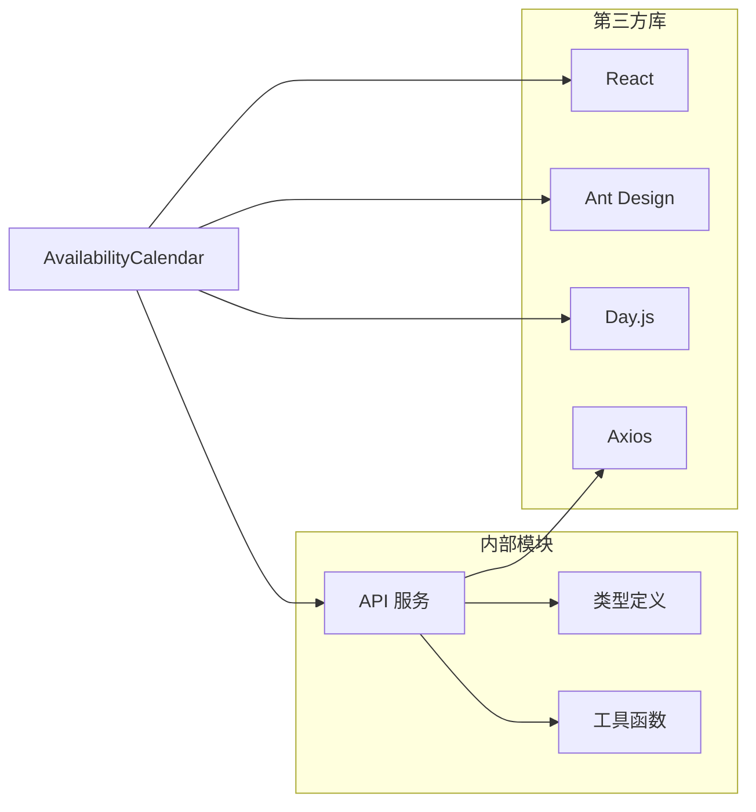

**图表来源**
- [frontend/src/components/AvailabilityCalendar/index.tsx](file://frontend/src/components/AvailabilityCalendar/index.tsx#L1-L10)
- [frontend/src/services/api.ts](file://frontend/src/services/api.ts#L1-L228)

### 后端依赖关系

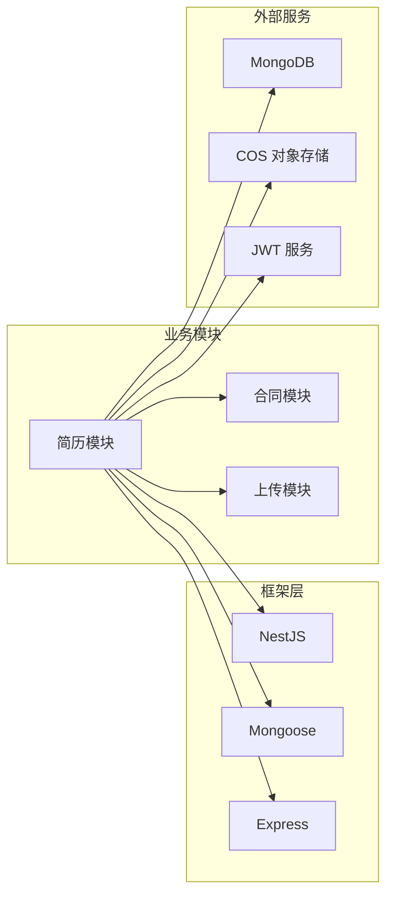

**图表来源**
- [backend/src/modules/resume/resume.service.ts](file://backend/src/modules/resume/resume.service.ts#L1-L31)

**章节来源**
- [frontend/src/components/AvailabilityCalendar/index.tsx](file://frontend/src/components/AvailabilityCalendar/index.tsx#L1-L10)
- [frontend/src/services/api.ts](file://frontend/src/services/api.ts#L1-L228)
- [backend/src/modules/resume/resume.service.ts](file://backend/src/modules/resume/resume.service.ts#L1-L31)

## 性能考虑

### 前端性能优化

1. **虚拟滚动**：对于大量数据的展示，可以考虑实现虚拟滚动来提升渲染性能
2. **懒加载**：档期数据按需加载，避免一次性加载整年的数据
3. **缓存策略**：利用浏览器缓存减少重复请求
4. **防抖处理**：对频繁的操作进行防抖处理

### 后端性能优化

1. **索引优化**：为档期查询建立合适的数据库索引
2. **分页查询**：对于大量数据的查询实现分页机制
3. **连接池管理**：合理配置数据库连接池大小
4. **缓存策略**：使用Redis缓存热点数据

### 数据库优化

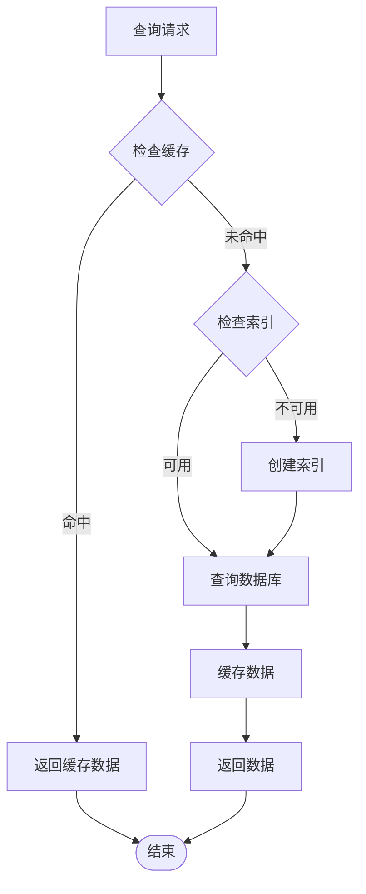

## 故障排除指南

### 常见问题及解决方案

#### 前端问题

1. **档期数据不显示**
   - 检查API请求是否成功
   - 验证resumeId参数是否正确
   - 确认网络连接正常

2. **档期更新失败**
   - 检查表单验证规则
   - 确认用户权限
   - 查看控制台错误信息

#### 后端问题

1. **数据库连接异常**
   - 检查MongoDB服务状态
   - 验证连接字符串配置
   - 确认防火墙设置

2. **API响应超时**
   - 检查数据库查询性能
   - 优化索引配置
   - 调整超时时间设置

**章节来源**
- [frontend/src/components/AvailabilityCalendar/index.tsx](file://frontend/src/components/AvailabilityCalendar/index.tsx#L61-L68)
- [frontend/src/services/api.ts](file://frontend/src/services/api.ts#L110-L149)

### API测试

系统提供了完整的API测试脚本，用于验证档期功能的正确性：

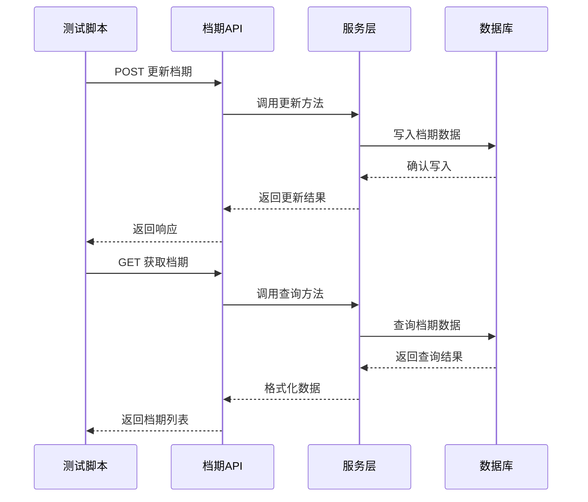

**图表来源**
- [backend/test-availability-api.js](file://backend/test-availability-api.js#L16-L67)

**章节来源**
- [backend/test-availability-api.js](file://backend/test-availability-api.js#L1-L150)

## 结论

可用性日历系统是一个功能完整、架构清晰的档期管理解决方案。系统具有以下特点：

1. **用户友好**：直观的日历界面，支持多种档期状态的可视化展示
2. **功能完整**：涵盖档期管理的全生命周期操作
3. **架构合理**：前后端分离，职责明确，易于维护和扩展
4. **性能良好**：采用现代化的技术栈，具备良好的性能表现

该系统为月嫂服务提供了高效的档期管理能力，有助于提升服务质量和运营效率。未来可以考虑增加更多高级功能，如档期预测、智能推荐等，进一步提升用户体验。