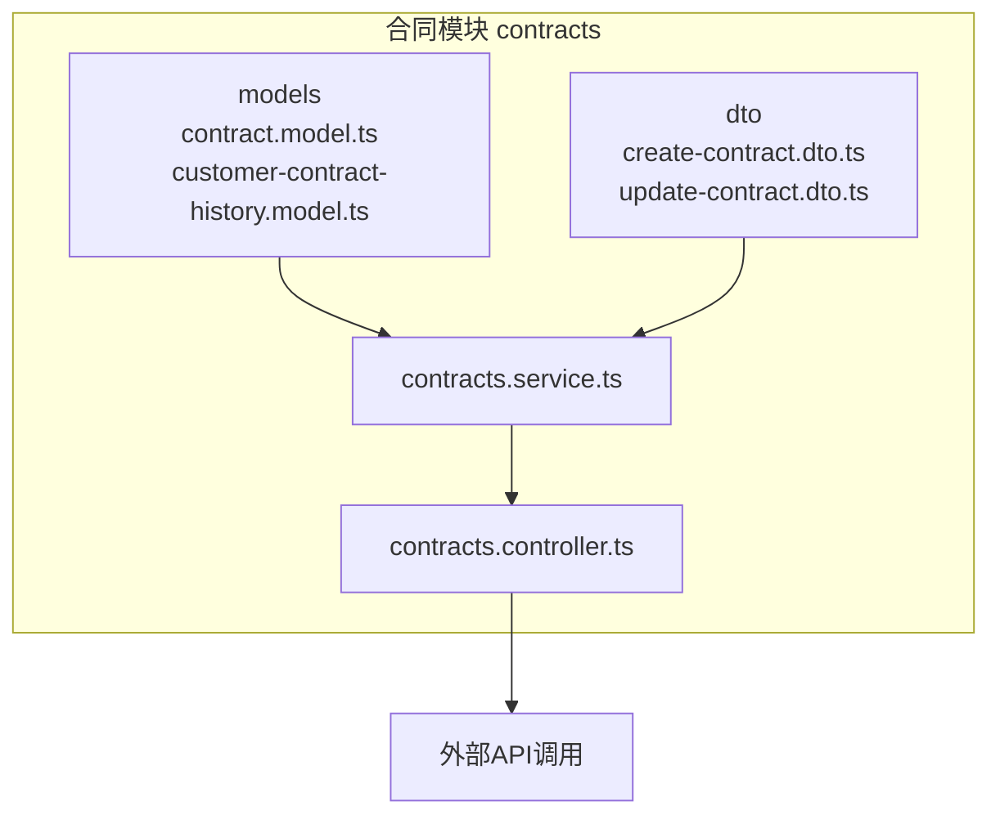
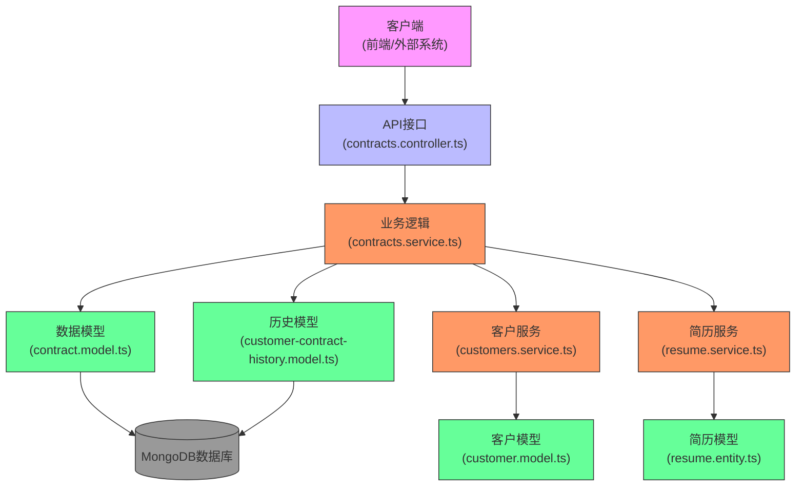
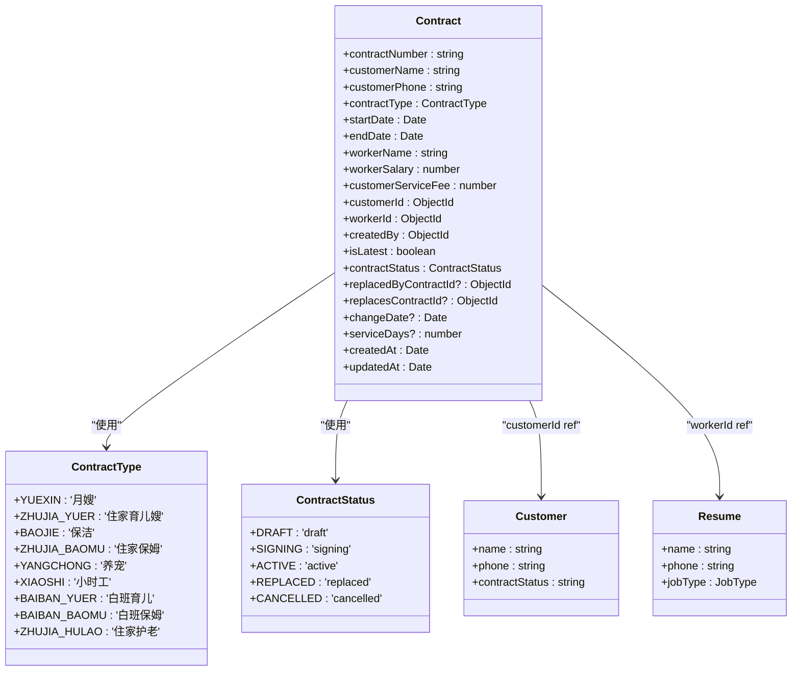
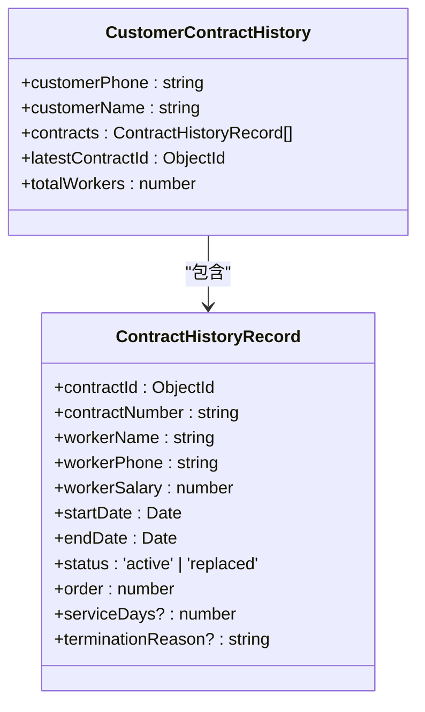
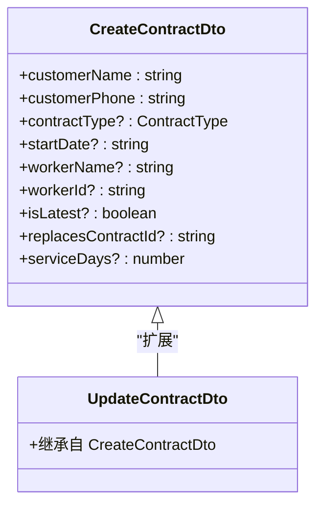
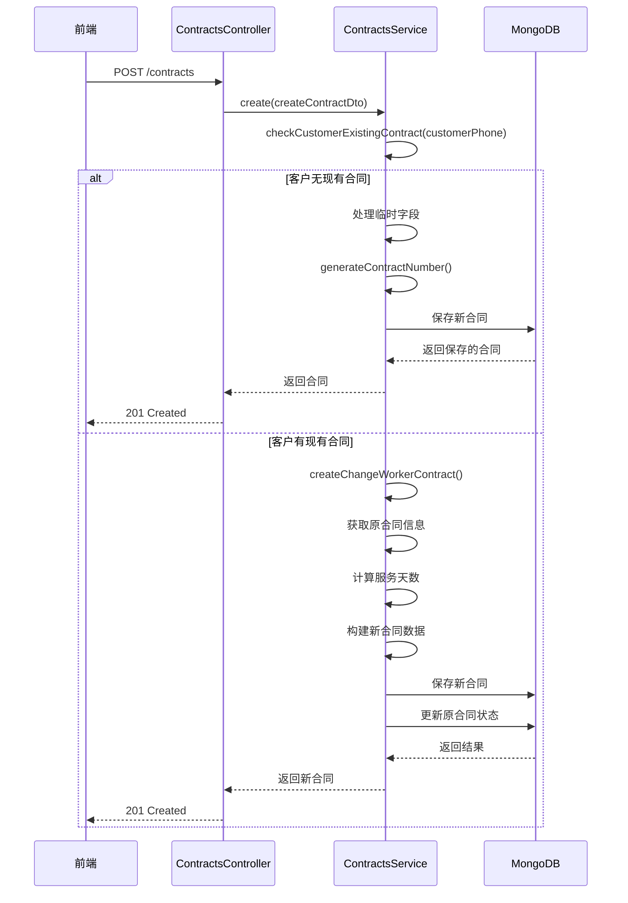
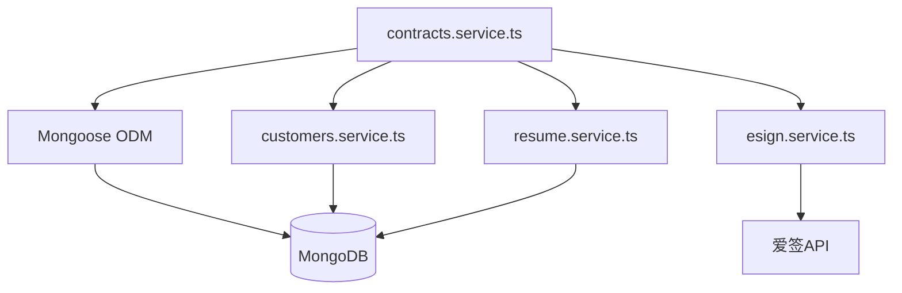

# 合同管理模块

<cite>
**本文档引用文件**   
- [contract.model.ts](file://backend/src/modules/contracts/models/contract.model.ts)
- [customer-contract-history.model.ts](file://backend/src/modules/contracts/models/customer-contract-history.model.ts)
- [create-contract.dto.ts](file://backend/src/modules/contracts/dto/create-contract.dto.ts)
- [update-contract.dto.ts](file://backend/src/modules/contracts/dto/update-contract.dto.ts)
- [contracts.service.ts](file://backend/src/modules/contracts/contracts.service.ts)
- [customer.model.ts](file://backend/src/modules/customers/models/customer.model.ts)
- [resume.entity.ts](file://backend/src/modules/resume/models/resume.entity.ts)
- [A客户换多个阿姨-技术实现文档.md](file://A客户换多个阿姨-技术实现文档.md)
</cite>

## 目录
1. [引言](#引言)
2. [项目结构](#项目结构)
3. [核心组件](#核心组件)
4. [架构概述](#架构概述)
5. [详细组件分析](#详细组件分析)
6. [依赖分析](#依赖分析)
7. [性能考虑](#性能考虑)
8. [故障排除指南](#故障排除指南)
9. [结论](#结论)

## 引言
本文档深入解析了合同管理模块的设计与实现，重点描述了合同全生命周期管理功能，包括合同创建、状态变更、信息更新与历史记录追踪。详细说明了`contract.model.ts`中的核心字段如合同状态、服务类型、价格、关联客户与阿姨简历的引用关系。分析了`contracts.service.ts`中合同创建时的业务校验逻辑，如客户状态检查、重复合同防止机制。阐述了`customer-contract-history.model.ts`在记录合同变更轨迹中的作用，支持“客户换多个阿姨”等复杂业务场景。解释了DTO层对输入数据的结构化约束与转换机制。结合客户模块与简历模块，说明了跨模块数据关联查询的实现方式。提供了合同状态机设计思路及典型使用案例，如合同暂停、终止、续约等操作的API调用流程。

## 项目结构
合同管理模块位于`backend/src/modules/contracts`目录下，采用NestJS框架的模块化设计。该模块包含数据传输对象（DTO）、数据模型（Models）、控制器（Controller）、服务（Service）等标准组件，实现了高内聚、低耦合的架构。



**图示来源**
- [contract.model.ts](file://backend/src/modules/contracts/models/contract.model.ts)
- [customer-contract-history.model.ts](file://backend/src/modules/contracts/models/customer-contract-history.model.ts)
- [create-contract.dto.ts](file://backend/src/modules/contracts/dto/create-contract.dto.ts)
- [update-contract.dto.ts](file://backend/src/modules/contracts/dto/update-contract.dto.ts)
- [contracts.service.ts](file://backend/src/modules/contracts/contracts.service.ts)
- [contracts.controller.ts](file://backend/src/modules/contracts/contracts.controller.ts)

## 核心组件
合同管理模块的核心组件包括合同数据模型、客户合同历史模型、数据传输对象（DTO）和合同服务。这些组件共同协作，实现了合同的创建、查询、更新、删除以及复杂的换人业务逻辑。合同模型定义了合同的核心字段和与客户、阿姨简历的引用关系。客户合同历史模型用于记录客户合同的完整变更轨迹。DTO层对输入数据进行结构化约束和转换。合同服务则封装了所有业务逻辑，是模块的核心。

**组件来源**
- [contract.model.ts](file://backend/src/modules/contracts/models/contract.model.ts)
- [customer-contract-history.model.ts](file://backend/src/modules/contracts/models/customer-contract-history.model.ts)
- [create-contract.dto.ts](file://backend/src/modules/contracts/dto/create-contract.dto.ts)
- [update-contract.dto.ts](file://backend/src/modules/contracts/dto/update-contract.dto.ts)
- [contracts.service.ts](file://backend/src/modules/contracts/contracts.service.ts)

## 架构概述
合同管理模块遵循典型的MVC（Model-View-Controller）架构模式，但在后端服务中，View层被API接口所替代。整体架构清晰，职责分明。



**图示来源**
- [contracts.controller.ts](file://backend/src/modules/contracts/contracts.controller.ts)
- [contracts.service.ts](file://backend/src/modules/contracts/contracts.service.ts)
- [contract.model.ts](file://backend/src/modules/contracts/models/contract.model.ts)
- [customer-contract-history.model.ts](file://backend/src/modules/contracts/models/customer-contract-history.model.ts)
- [customers.service.ts](file://backend/src/modules/customers/customers.service.ts)
- [customer.model.ts](file://backend/src/modules/customers/models/customer.model.ts)
- [resume.service.ts](file://backend/src/modules/resume/resume.service.ts)
- [resume.entity.ts](file://backend/src/modules/resume/models/resume.entity.ts)

## 详细组件分析
本节将对合同管理模块中的关键组件进行深入分析，包括数据模型、DTO和核心服务。

### 合同数据模型分析
`contract.model.ts`文件定义了合同的核心数据结构，是整个模块的基石。它使用Mongoose的Schema来定义字段、类型、约束和与其他模型的引用关系。



**图示来源**
- [contract.model.ts](file://backend/src/modules/contracts/models/contract.model.ts)
- [customer.model.ts](file://backend/src/modules/customers/models/customer.model.ts)
- [resume.entity.ts](file://backend/src/modules/resume/models/resume.entity.ts)

**组件来源**
- [contract.model.ts](file://backend/src/modules/contracts/models/contract.model.ts#L0-L142)

#### 核心字段说明
- **合同编号 (contractNumber)**: 唯一标识符，自动生成，确保合同的唯一性。
- **客户信息**: 包括`customerName`, `customerPhone`, `customerIdCard`，用于标识合同关联的客户。
- **服务类型 (contractType)**: 使用`ContractType`枚举，定义了所有可能的服务类型，如月嫂、住家育儿嫂等。
- **服务时间**: `startDate`和`endDate`定义了合同的有效期。
- **薪资与费用**: `workerSalary`（家政员工资）、`customerServiceFee`（客户服务费）等字段记录了合同的财务信息。
- **关联ID**: `customerId`和`workerId`是MongoDB的ObjectId，分别引用`Customer`和`Resume`模型，实现了数据的关联查询。
- **创建与更新信息**: `createdBy`和`lastUpdatedBy`记录了操作人。
- **换人功能字段**:
  - `isLatest`: 布尔值，标记该合同是否为该客户的最新合同。
  - `contractStatus`: 使用`ContractStatus`枚举，管理合同的生命周期状态。
  - `replacedByContractId`: 指向替换该合同的新合同ID。
  - `replacesContractId`: 指向该合同所替换的旧合同ID。
  - `changeDate`: 换人的生效日期。
  - `serviceDays`: 记录该合同的实际服务天数。

### 客户合同历史模型分析
`customer-contract-history.model.ts`文件定义了`CustomerContractHistory`模型，专门用于记录单个客户的所有合同变更历史，是实现“客户换多个阿姨”复杂业务场景的关键。



**图示来源**
- [customer-contract-history.model.ts](file://backend/src/modules/contracts/models/customer-contract-history.model.ts#L0-L79)

**组件来源**
- [customer-contract-history.model.ts](file://backend/src/modules/contracts/models/customer-contract-history.model.ts#L0-L79)

#### 核心字段说明
- **customerPhone**: 作为主键，通过客户手机号关联所有历史合同。
- **contracts**: 一个`ContractHistoryRecord`子文档数组，按时间顺序存储了该客户的所有合同记录。
- **latestContractId**: 指向当前最新合同的ID，便于快速查询。
- **totalWorkers**: 记录该客户总共更换过多少位阿姨。
- **ContractHistoryRecord子文档**:
  - `order`: 记录这是第几任阿姨，用于排序和展示。
  - `status`: 记录该历史合同的状态（active或replaced）。
  - `terminationReason`: 记录合同终止的原因（如“换人”）。

### DTO层分析
DTO（Data Transfer Object）层位于`dto`目录下，负责对API的输入数据进行结构化、验证和转换。



**图示来源**
- [create-contract.dto.ts](file://backend/src/modules/contracts/dto/create-contract.dto.ts#L0-L202)
- [update-contract.dto.ts](file://backend/src/modules/contracts/dto/update-contract.dto.ts#L0-L3)

**组件来源**
- [create-contract.dto.ts](file://backend/src/modules/contracts/dto/create-contract.dto.ts#L0-L202)
- [update-contract.dto.ts](file://backend/src/modules/contracts/dto/update-contract.dto.ts#L0-L3)

#### 核心验证规则
- **必填项验证**: 使用`@IsNotEmpty`确保`customerName`和`customerPhone`不为空。
- **格式验证**: 使用`@IsPhoneNumber('CN')`验证中国手机号格式。
- **枚举验证**: 使用`@IsEnum(ContractType)`确保`contractType`的值在预定义的枚举中。
- **数值范围验证**: 使用`@Min`和`@Max`确保`salaryPaymentDay`在1-31之间。
- **数据转换**: 使用`@Transform`装饰器将字符串类型的数字转换为`number`类型。

### 合同服务分析
`contracts.service.ts`是合同管理模块的业务逻辑中心，包含了所有核心功能的实现。

#### 合同创建与换人逻辑
`create`方法是处理合同创建的核心入口。它首先检查客户是否已有合同，如果存在，则自动进入“换人模式”，调用`createChangeWorkerContract`方法。



**图示来源**
- [contracts.service.ts](file://backend/src/modules/contracts/contracts.service.ts#L0-L199)
- [contracts.service.ts](file://backend/src/modules/contracts/contracts.service.ts#L500-L645)

**组件来源**
- [contracts.service.ts](file://backend/src/modules/contracts/contracts.service.ts#L0-L645)

##### 业务校验逻辑
1. **客户状态检查**: `checkCustomerExistingContract`方法通过`customerPhone`查询数据库，检查该客户是否已有合同。这是防止重复创建合同和触发换人逻辑的关键。
2. **重复合同防止机制**: 通过`checkCustomerExistingContract`的检查，系统能自动识别客户是否已有合同，从而避免为同一客户创建多个独立合同，确保了数据的一致性。

##### 换人合同创建流程
`createChangeWorkerContract`方法实现了复杂的换人逻辑：
1. **获取原合同**: 根据传入的`originalContractId`查询原合同信息。
2. **计算服务天数**: 计算从原合同开始到当前日期的天数，并记录在原合同的`serviceDays`字段中。
3. **构建新合同**: 创建一个新合同，其`customerName`, `customerPhone`, `customerId`等客户信息与原合同保持一致，但`workerName`, `workerId`等服务人员信息来自新的输入。新合同的`startDate`设置为换人日期（当前日期），`endDate`继承原合同的结束日期。
4. **建立替换关系**: 新合同的`replacesContractId`指向原合同ID，原合同的`replacedByContractId`指向新合同ID。
5. **更新状态**: 将原合同的`isLatest`设为`false`，`contractStatus`设为`replaced`；将新合同的`isLatest`设为`true`。
6. **保存并返回**: 保存新合同，并更新原合同状态。

#### 客户合同历史查询
`getCustomerContractHistory`方法用于查询客户的完整合同历史。它通过`customerPhone`查询所有相关合同，按创建时间排序，并构建一个包含所有历史记录的响应对象，包括每任阿姨的服务信息和替换关系。

### 跨模块数据关联查询
合同模块通过`customerId`和`workerId`字段与客户模块和简历模块建立了关联。在查询合同详情时，服务层使用`populate`方法进行数据填充，从而实现跨模块查询。

```typescript
const contract = await this.contractModel
  .findById(id)
  .populate('customerId', 'name phone customerId') // 关联客户模块
  .populate('workerId', 'name phone idCardNumber') // 关联简历模块
  .populate('createdBy', 'name username') // 关联用户模块
  .exec();
```

**组件来源**
- [contracts.service.ts](file://backend/src/modules/contracts/contracts.service.ts#L200-L249)

## 依赖分析
合同管理模块的依赖关系清晰，主要依赖于数据库和外部服务。



**图示来源**
- [contracts.service.ts](file://backend/src/modules/contracts/contracts.service.ts)
- [customers.service.ts](file://backend/src/modules/customers/customers.service.ts)
- [resume.service.ts](file://backend/src/modules/resume/resume.service.ts)
- [esign.service.ts](file://backend/src/modules/esign/esign.service.ts)

**组件来源**
- [contracts.service.ts](file://backend/src/modules/contracts/contracts.service.ts)
- [customers.service.ts](file://backend/src/modules/customers/customers.service.ts)
- [resume.service.ts](file://backend/src/modules/resume/resume.service.ts)
- [esign.service.ts](file://backend/src/modules/esign/esign.service.ts)

## 性能考虑
- **数据库索引**: `contractNumber`和`customerPhone`字段被设置为唯一索引，确保了查询效率。
- **数据填充 (Populate)**: 在查询合同详情时使用`populate`，虽然方便，但可能影响性能。对于高并发场景，可以考虑使用聚合管道（Aggregation Pipeline）进行更高效的关联查询。
- **历史查询优化**: `getCustomerContractHistory`方法一次性查询所有历史合同，对于历史记录很长的客户可能成为性能瓶颈。可以考虑分页或缓存机制。

## 故障排除指南
- **问题**: 创建合同时报错“客户已有合同”。
  - **原因**: 系统检测到该客户手机号已有关联的合同。
  - **解决方案**: 检查是否需要进入“换人模式”，如果是，则确保流程正确；如果不是，则检查客户手机号是否输入错误。
- **问题**: 合同状态流转不正确。
  - **原因**: `createChangeWorkerContract`方法中的状态更新逻辑可能未正确执行。
  - **解决方案**: 检查日志，确认`isLatest`和`contractStatus`字段是否被正确更新。
- **问题**: 爱签集成失败。
  - **原因**: 爱签API返回特定错误码（如101000表示合同已签署完成）。
  - **解决方案**: 查看`A客户换多个阿姨-技术实现文档.md`中的错误码处理部分，确保撤销/作废逻辑正确。

## 结论
合同管理模块设计精良，通过引入`isLatest`标志、`contractStatus`状态机和`replacedByContractId`/`replacesContractId`双向引用，成功实现了“客户换多个阿姨”这一复杂业务场景。模块采用清晰的分层架构，DTO层确保了输入数据的合法性，服务层封装了复杂的业务逻辑，数据模型层定义了严谨的数据结构。跨模块的`populate`机制实现了数据的无缝关联。该模块为合同的全生命周期管理提供了强大而灵活的支持。