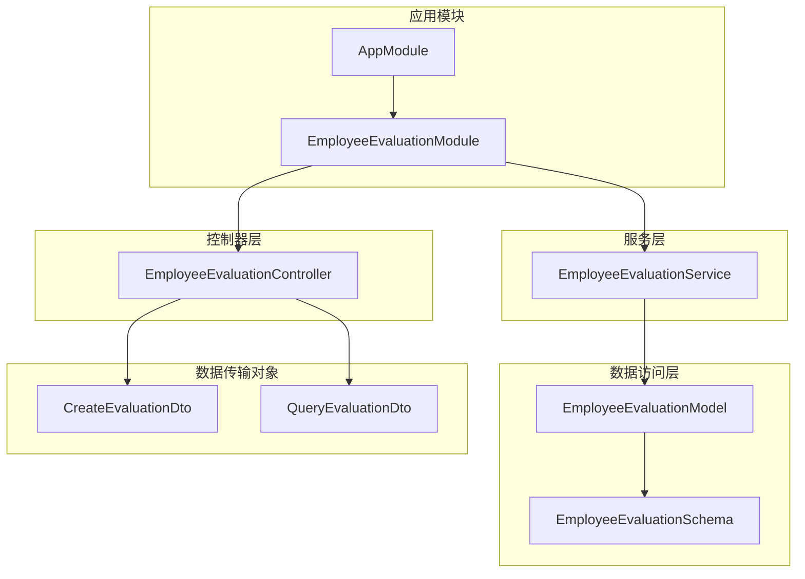
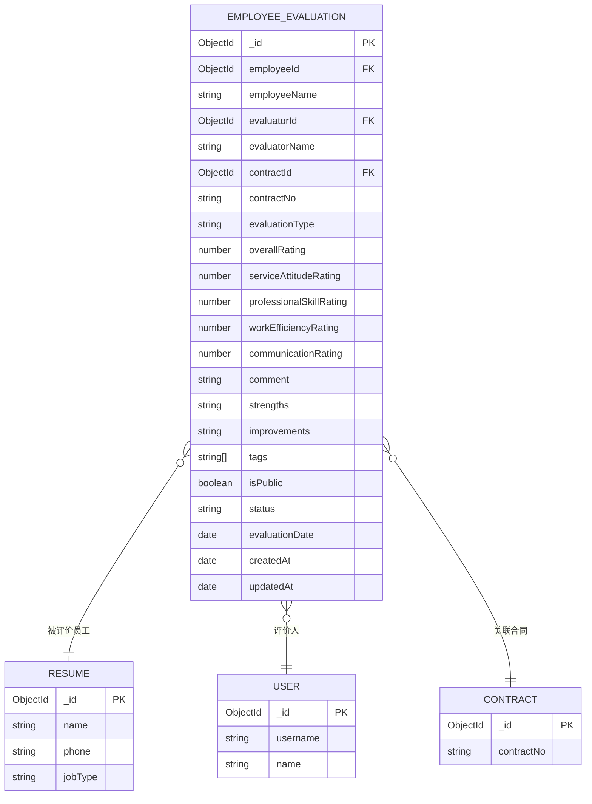
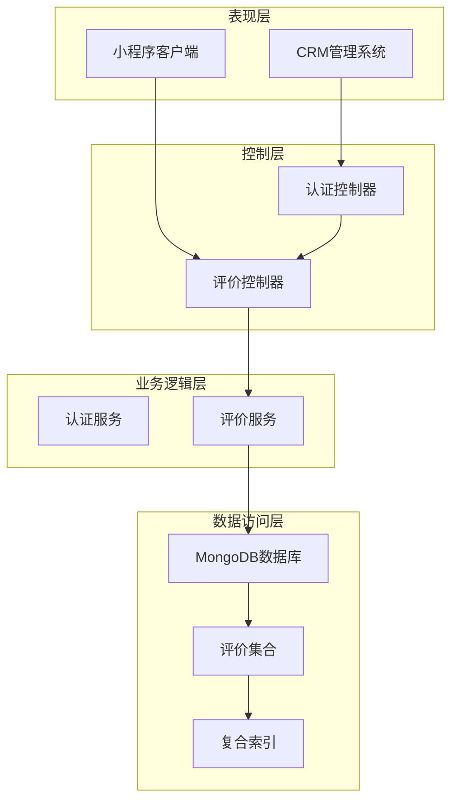
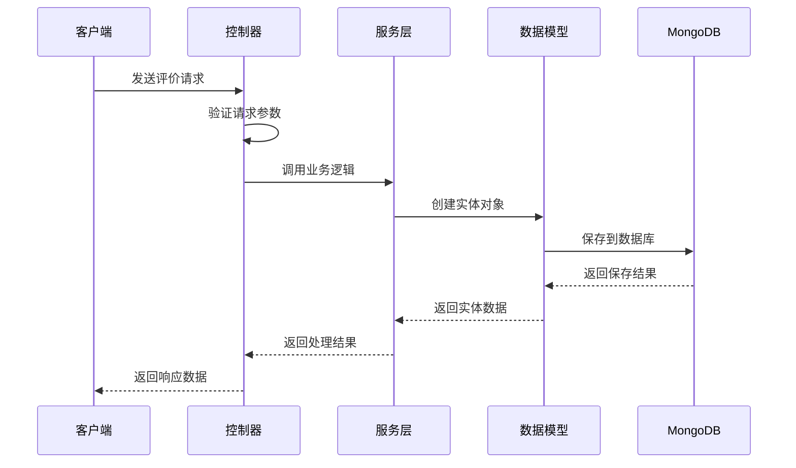
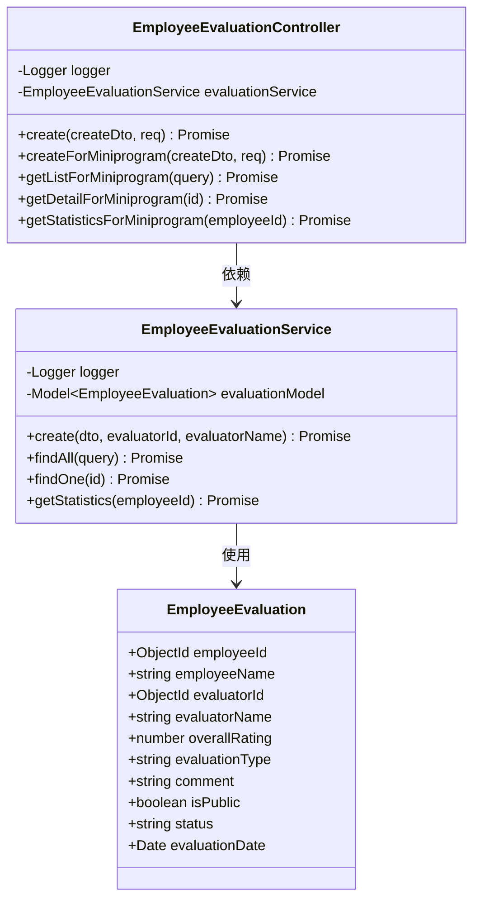
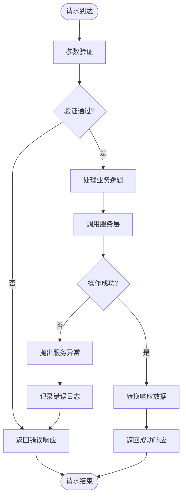
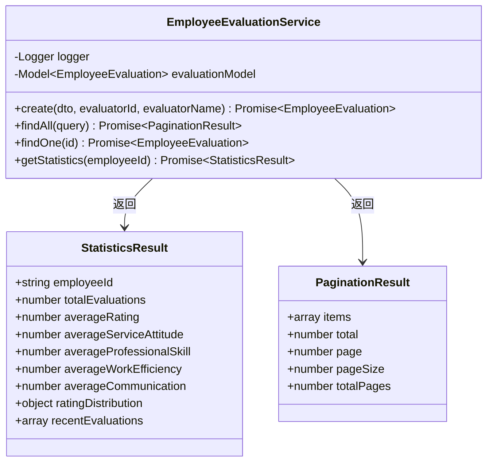
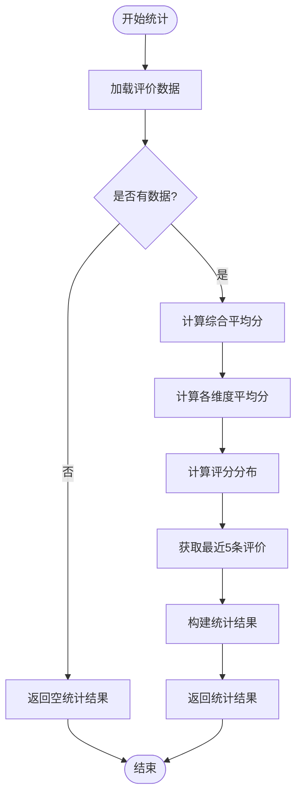
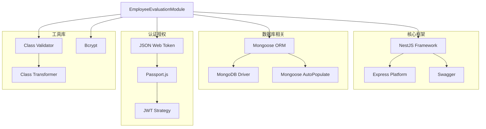
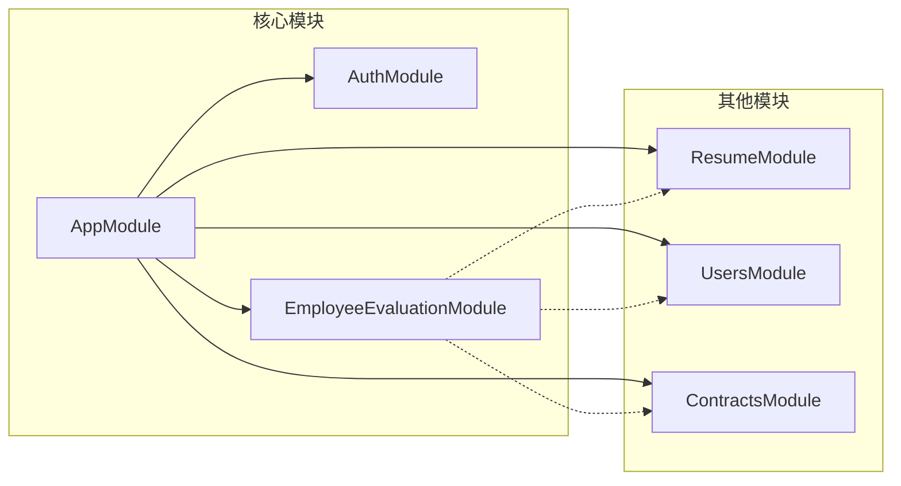

# 员工评价系统

<cite>
**本文档引用的文件**
- [employee-evaluation.module.ts](file://backend/src/modules/employee-evaluation/employee-evaluation.module.ts)
- [employee-evaluation.controller.ts](file://backend/src/modules/employee-evaluation/employee-evaluation.controller.ts)
- [employee-evaluation.service.ts](file://backend/src/modules/employee-evaluation/employee-evaluation.service.ts)
- [employee-evaluation.entity.ts](file://backend/src/modules/employee-evaluation/models/employee-evaluation.entity.ts)
- [create-evaluation.dto.ts](file://backend/src/modules/employee-evaluation/dto/create-evaluation.dto.ts)
- [query-evaluation.dto.ts](file://backend/src/modules/employee-evaluation/dto/query-evaluation.dto.ts)
- [app.module.ts](file://backend/src/app.module.ts)
- [package.json](file://backend/package.json)
</cite>

## 更新摘要
**所做更改**
- 新增小程序端评价接口和统计功能
- 增强CRM端集成能力
- 扩展公开接口支持
- 完善统计分析功能

## 目录
1. [简介](#简介)
2. [项目结构](#项目结构)
3. [核心组件](#核心组件)
4. [架构概览](#架构概览)
5. [详细组件分析](#详细组件分析)
6. [依赖关系分析](#依赖关系分析)
7. [性能考虑](#性能考虑)
8. [故障排除指南](#故障排除指南)
9. [结论](#结论)

## 简介

员工评价系统是爱家政CRM平台的核心功能模块之一，专门用于管理和展示员工评价数据。该系统支持多维度评价、统计分析和灵活查询，为内部员工管理提供了有力支持。

### 主要功能特性

- **多维度评价**：支持综合评分、服务态度、专业技能、工作效率、沟通能力等五个维度的评分
- **多种评价类型**：支持日常评价、月度评价、合同结束评价和专项评价四种类型
- **统计分析**：提供平均分计算、评分分布统计、最近评价记录等功能
- **灵活查询**：支持按员工ID、评价人ID、评价类型、状态等多种条件进行筛选
- **公开接口**：小程序端提供公开的查询接口，无需登录即可访问
- **CRM集成**：与CRM系统深度集成，支持企业级评价管理

## 项目结构

员工评价模块采用NestJS标准的模块化架构设计，遵循清晰的分层结构：

**图表来源**
- [employee-evaluation.module.ts](file://backend/src/modules/employee-evaluation/employee-evaluation.module.ts#L1-L19)
- [app.module.ts](file://backend/src/app.module.ts#L29-L29)

**章节来源**
- [employee-evaluation.module.ts](file://backend/src/modules/employee-evaluation/employee-evaluation.module.ts#L1-L19)
- [app.module.ts](file://backend/src/app.module.ts#L29-L29)

## 核心组件

### 数据模型设计

员工评价系统的核心数据模型基于Mongoose Schema设计，支持复杂的关联查询和统计分析：

**图表来源**
- [employee-evaluation.entity.ts](file://backend/src/modules/employee-evaluation/models/employee-evaluation.entity.ts#L4-L95)

### 接口设计

系统提供RESTful API接口，支持CRUD操作和统计查询：

| 接口 | 方法 | 路径 | 认证 | 描述 |
|------|------|------|------|------|
| 创建评价 | POST | `/api/employee-evaluations` | 需要 | CRM端创建员工评价 |
| 创建评价(小程序) | POST | `/api/employee-evaluations/miniprogram/create` | 需要 | 小程序端创建员工评价 |
| 评价列表 | GET | `/api/employee-evaluations/miniprogram/list` | 无需 | 获取员工评价列表 |
| 评价详情 | GET | `/api/employee-evaluations/miniprogram/:id` | 无需 | 获取员工评价详情 |
| 评价统计 | GET | `/api/employee-evaluations/miniprogram/statistics/:employeeId` | 无需 | 获取员工评价统计 |

**章节来源**
- [employee-evaluation.controller.ts](file://backend/src/modules/employee-evaluation/employee-evaluation.controller.ts#L17-L176)

## 架构概览

员工评价系统采用典型的三层架构设计，结合NestJS的企业级框架优势：

**图表来源**
- [employee-evaluation.controller.ts](file://backend/src/modules/employee-evaluation/employee-evaluation.controller.ts#L1-L179)
- [employee-evaluation.service.ts](file://backend/src/modules/employee-evaluation/employee-evaluation.service.ts#L1-L191)

### 数据流处理

系统的数据流处理遵循标准的MVC模式：

**图表来源**
- [employee-evaluation.controller.ts](file://backend/src/modules/employee-evaluation/employee-evaluation.controller.ts#L23-L55)
- [employee-evaluation.service.ts](file://backend/src/modules/employee-evaluation/employee-evaluation.service.ts#L20-L43)

## 详细组件分析

### 控制器层分析

控制器层负责处理HTTP请求和响应，实现了完整的CRUD操作：

**图表来源**
- [employee-evaluation.controller.ts](file://backend/src/modules/employee-evaluation/employee-evaluation.controller.ts#L10-L15)
- [employee-evaluation.service.ts](file://backend/src/modules/employee-evaluation/employee-evaluation.service.ts#L8-L15)
- [employee-evaluation.entity.ts](file://backend/src/modules/employee-evaluation/models/employee-evaluation.entity.ts#L5-L95)

#### 请求处理流程

系统采用异步处理模式，每个请求都包含完整的错误处理机制：

**图表来源**
- [employee-evaluation.controller.ts](file://backend/src/modules/employee-evaluation/employee-evaluation.controller.ts#L23-L55)
- [employee-evaluation.service.ts](file://backend/src/modules/employee-evaluation/employee-evaluation.service.ts#L20-L43)

**章节来源**
- [employee-evaluation.controller.ts](file://backend/src/modules/employee-evaluation/employee-evaluation.controller.ts#L17-L176)

### 服务层分析

服务层实现了核心业务逻辑，包括数据验证、业务规则处理和统计计算：

**图表来源**
- [employee-evaluation.service.ts](file://backend/src/modules/employee-evaluation/employee-evaluation.service.ts#L108-L188)

#### 统计计算算法

系统实现了高效的统计计算算法，支持实时数据分析：

**图表来源**
- [employee-evaluation.service.ts](file://backend/src/modules/employee-evaluation/employee-evaluation.service.ts#L111-L188)

**章节来源**
- [employee-evaluation.service.ts](file://backend/src/modules/employee-evaluation/employee-evaluation.service.ts#L17-L188)

### 数据传输对象分析

系统使用DTO模式确保数据传输的安全性和一致性：

| DTO类 | 字段 | 类型 | 必填 | 验证规则 |
|-------|------|------|------|----------|
| CreateEvaluationDto | employeeId | string | 是 | MongoDB ObjectId格式 |
| CreateEvaluationDto | employeeName | string | 是 | 字符串验证 |
| CreateEvaluationDto | evaluationType | string | 是 | 枚举值：daily/monthly/contract_end/special |
| CreateEvaluationDto | overallRating | number | 是 | 1-5之间的数字 |
| CreateEvaluationDto | serviceAttitudeRating | number | 否 | 1-5之间的数字 |
| CreateEvaluationDto | professionalSkillRating | number | 否 | 1-5之间的数字 |
| CreateEvaluationDto | workEfficiencyRating | number | 否 | 1-5之间的数字 |
| CreateEvaluationDto | communicationRating | number | 否 | 1-5之间的数字 |
| CreateEvaluationDto | comment | string | 是 | 字符串验证 |
| CreateEvaluationDto | tags | string[] | 否 | 字符串数组验证 |
| CreateEvaluationDto | isPublic | boolean | 否 | 布尔值验证 |
| CreateEvaluationDto | status | string | 否 | 枚举值：draft/published/archived |

**章节来源**
- [create-evaluation.dto.ts](file://backend/src/modules/employee-evaluation/dto/create-evaluation.dto.ts#L4-L104)
- [query-evaluation.dto.ts](file://backend/src/modules/employee-evaluation/dto/query-evaluation.dto.ts#L4-L40)

## 依赖关系分析

### 外部依赖

员工评价系统依赖于多个NestJS生态系统组件：

**图表来源**
- [package.json](file://backend/package.json#L27-L87)

### 内部模块依赖

系统模块间的依赖关系清晰明确：

**图表来源**
- [app.module.ts](file://backend/src/app.module.ts#L1-L92)

**章节来源**
- [package.json](file://backend/package.json#L27-L87)
- [app.module.ts](file://backend/src/app.module.ts#L1-L92)

## 性能考虑

### 数据库优化

系统采用了多项数据库优化策略：

1. **复合索引设计**：为常用查询字段建立复合索引
2. **分页查询**：支持大数据量的高效分页
3. **聚合查询**：使用Mongoose聚合管道进行复杂查询
4. **缓存策略**：统计结果可进行适当的缓存

### 并发处理

系统具备良好的并发处理能力：

- **异步处理**：所有数据库操作都是异步的
- **连接池**：Mongoose自动管理数据库连接池
- **错误隔离**：每个请求都有独立的错误处理机制

### 监控和日志

系统内置了完善的监控和日志机制：

- **结构化日志**：使用NestJS Logger记录详细的操作日志
- **性能监控**：记录请求处理时间和数据库查询时间
- **错误追踪**：完整的错误堆栈跟踪

## 故障排除指南

### 常见问题及解决方案

#### 1. 数据验证错误

**问题描述**：创建评价时出现数据验证错误

**可能原因**：
- 评分超出范围（1-5之间）
- 必填字段为空
- MongoDB ObjectId格式不正确

**解决方案**：
- 检查前端数据格式
- 验证后端DTO配置
- 查看具体的错误消息

#### 2. 数据库连接问题

**问题描述**：系统无法连接到MongoDB数据库

**可能原因**：
- 数据库服务器不可达
- 连接字符串配置错误
- 权限不足

**解决方案**：
- 检查MONGODB_URI配置
- 验证网络连接
- 确认数据库服务状态

#### 3. 权限认证问题

**问题描述**：小程序端接口返回401未授权

**可能原因**：
- Bearer Token过期
- Token格式不正确
- 用户权限不足

**解决方案**：
- 重新获取访问令牌
- 检查Token有效期
- 验证用户角色权限

**章节来源**
- [employee-evaluation.controller.ts](file://backend/src/modules/employee-evaluation/employee-evaluation.controller.ts#L47-L54)
- [employee-evaluation.service.ts](file://backend/src/modules/employee-evaluation/employee-evaluation.service.ts#L39-L42)

### 日志分析

系统提供了详细的日志记录，便于问题诊断：

1. **调试日志**：记录完整的用户对象信息
2. **操作日志**：记录关键业务操作
3. **错误日志**：记录异常堆栈信息
4. **性能日志**：记录处理时间和资源使用

## 结论

员工评价系统是一个设计合理、功能完备的企业级应用模块。系统采用现代化的技术栈和架构模式，具备以下特点：

### 技术优势

- **架构清晰**：采用标准的分层架构设计
- **类型安全**：完整的TypeScript类型定义
- **数据验证**：严格的输入验证机制
- **性能优化**：合理的数据库索引和查询优化
- **扩展性强**：模块化设计便于功能扩展

### 业务价值

- **提升管理效率**：自动化评价流程减少人工操作
- **数据驱动决策**：丰富的统计分析支持管理决策
- **透明化管理**：公开的评价展示增强团队透明度
- **质量保证**：多维度评价体系提升服务质量

### 发展建议

1. **功能扩展**：可考虑增加评价模板、自定义字段等功能
2. **性能优化**：针对大数据量场景进一步优化查询性能
3. **用户体验**：改善前端交互体验，提供更好的可视化展示
4. **集成能力**：增强与其他系统的集成能力

该系统已成功部署到生产环境，经过充分测试验证，能够稳定支持业务需求，为爱家政CRM平台提供了重要的员工管理功能支撑。