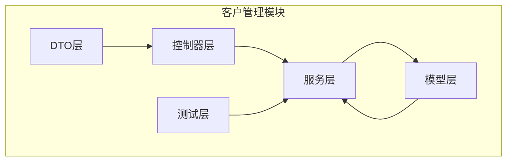
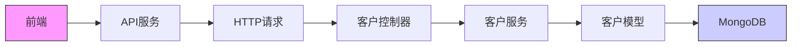
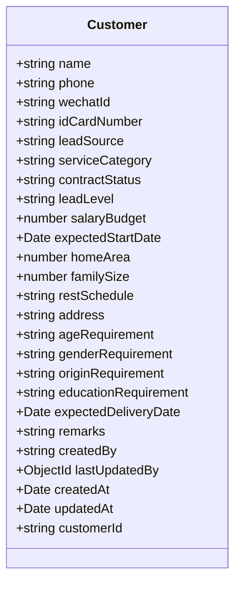
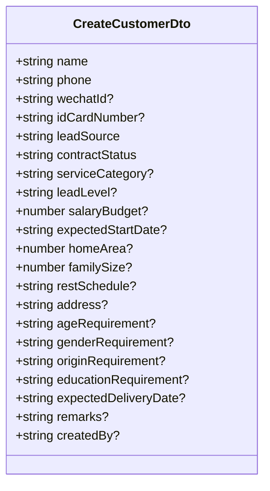
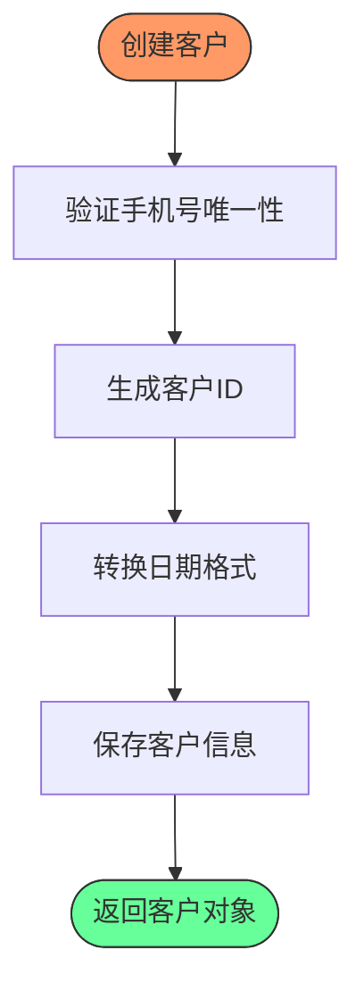
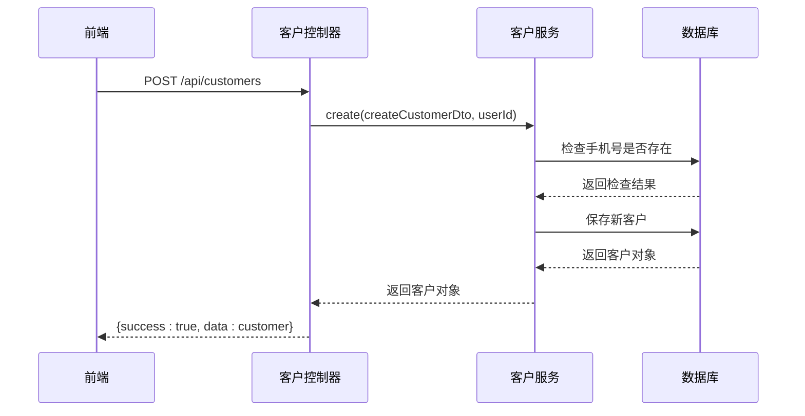
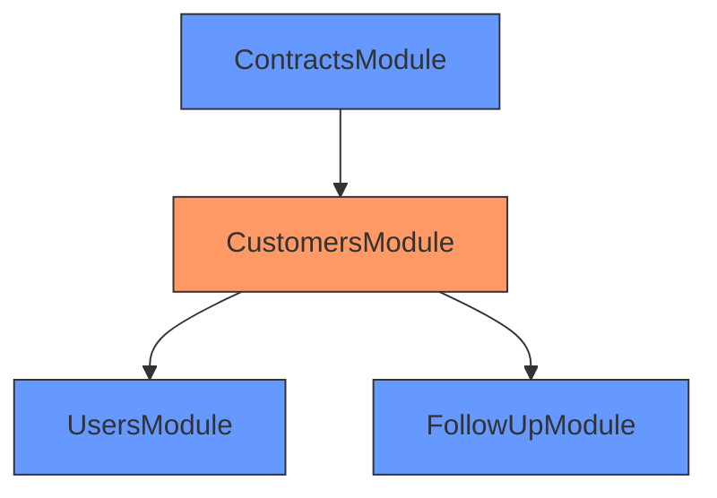

# 客户管理模块

<cite>
**本文档引用的文件**  
- [customer.model.ts](file://backend/src/modules/customers/models/customer.model.ts)
- [create-customer.dto.ts](file://backend/src/modules/customers/dto/create-customer.dto.ts)
- [update-customer.dto.ts](file://backend/src/modules/customers/dto/update-customer.dto.ts)
- [customer-query.dto.ts](file://backend/src/modules/customers/dto/customer-query.dto.ts)
- [create-customer-follow-up.dto.ts](file://backend/src/modules/customers/dto/create-customer-follow-up.dto.ts)
- [customer-follow-up.entity.ts](file://backend/src/modules/customers/models/customer-follow-up.entity.ts)
- [customers.service.ts](file://backend/src/modules/customers/customers.service.ts)
- [customers.controller.ts](file://backend/src/modules/customers/customers.controller.ts)
- [customers.module.ts](file://backend/src/modules/customers/customers.module.ts)
- [customerService.ts](file://frontend/src/services/customerService.ts)
- [customerFollowUpService.ts](file://frontend/src/services/customerFollowUpService.ts)
- [customer.types.ts](file://frontend/src/types/customer.types.ts)
- [customer-follow-up.types.ts](file://frontend/src/types/customer-follow-up.types.ts)
</cite>

## 目录
1. [简介](#简介)
2. [项目结构](#项目结构)
3. [核心组件](#核心组件)
4. [架构概览](#架构概览)
5. [详细组件分析](#详细组件分析)
6. [依赖关系分析](#依赖关系分析)
7. [性能考量](#性能考量)
8. [故障排查指南](#故障排查指南)
9. [结论](#结论)

## 简介
客户管理模块是本系统的核心业务模块之一，负责客户信息的全生命周期管理。该模块实现了客户信息的增删改查、客户查询过滤、客户跟进记录创建与管理等完整功能。系统采用NestJS框架构建后端服务，使用MongoDB作为数据存储，通过RESTful API为前端提供服务。模块设计遵循原子性开发模式，确保了功能的完整性和代码的可维护性。

## 项目结构
客户管理模块采用NestJS标准的模块化结构，按照功能分离原则组织代码。模块位于`backend/src/modules/customers`目录下，包含DTO、模型、控制器、服务等子目录，实现了清晰的关注点分离。

**图示来源**  
- [customers.module.ts](file://backend/src/modules/customers/customers.module.ts#L0-L20)

**本节来源**  
- [customers.module.ts](file://backend/src/modules/customers/customers.module.ts#L0-L20)

## 核心组件
客户管理模块的核心组件包括客户模型、数据传输对象(DTO)、服务类和控制器。客户模型定义了客户信息的数据结构和验证规则；DTO层负责请求参数的校验；服务类封装了业务逻辑；控制器处理HTTP请求并返回响应。模块还实现了客户跟进记录功能，与客户信息形成关联关系。

**本节来源**  
- [customer.model.ts](file://backend/src/modules/customers/models/customer.model.ts#L0-L98)
- [create-customer.dto.ts](file://backend/src/modules/customers/dto/create-customer.dto.ts#L0-L116)
- [customers.service.ts](file://backend/src/modules/customers/customers.service.ts#L0-L308)
- [customers.controller.ts](file://backend/src/modules/customers/customers.controller.ts#L0-L145)

## 架构概览
客户管理模块采用典型的分层架构，从前端到后端形成完整的调用链路。前端通过API服务调用后端REST接口，后端控制器接收请求后委托服务层处理业务逻辑，服务层操作数据模型与数据库交互。

**图示来源**  
- [customers.controller.ts](file://backend/src/modules/customers/customers.controller.ts#L0-L145)
- [customers.service.ts](file://backend/src/modules/customers/customers.service.ts#L0-L308)

## 详细组件分析

### 客户模型分析
客户模型定义了客户信息的完整数据结构，包含基本信息、服务需求、合同状态等多个维度的字段。模型使用Mongoose Schema进行定义，确保了数据的一致性和完整性。

**图示来源**  
- [customer.model.ts](file://backend/src/modules/customers/models/customer.model.ts#L0-L98)

**本节来源**  
- [customer.model.ts](file://backend/src/modules/customers/models/customer.model.ts#L0-L98)

### 数据传输对象分析
数据传输对象(DTO)用于定义API请求参数的结构和验证规则。创建客户DTO包含字段验证装饰器，确保输入数据的合法性。

**图示来源**  
- [create-customer.dto.ts](file://backend/src/modules/customers/dto/create-customer.dto.ts#L0-L116)

**本节来源**  
- [create-customer.dto.ts](file://backend/src/modules/customers/dto/create-customer.dto.ts#L0-L116)

### 服务层业务逻辑分析
客户服务类实现了客户管理的核心业务逻辑，包括客户创建、更新、查询、删除等操作。服务层通过注入Mongoose模型与数据库交互，确保了数据操作的安全性和一致性。

**图示来源**  
- [customers.service.ts](file://backend/src/modules/customers/customers.service.ts#L26-L65)

**本节来源**  
- [customers.service.ts](file://backend/src/modules/customers/customers.service.ts#L26-L65)

### 控制器API流程分析
客户控制器定义了RESTful API端点，处理HTTP请求并返回标准化响应。控制器使用JWT守卫进行身份验证，确保只有授权用户才能访问客户数据。

**图示来源**  
- [customers.controller.ts](file://backend/src/modules/customers/customers.controller.ts#L38-L52)

**本节来源**  
- [customers.controller.ts](file://backend/src/modules/customers/customers.controller.ts#L38-L52)

## 依赖关系分析
客户管理模块与其他模块存在明确的依赖关系。模块依赖用户模块获取创建人和更新人信息，与跟进记录模块形成关联关系。在合同管理场景中，客户模块与合同模块协同工作，实现客户状态的同步更新。

**图示来源**  
- [customers.module.ts](file://backend/src/modules/customers/customers.module.ts#L0-L20)

**本节来源**  
- [customers.module.ts](file://backend/src/modules/customers/customers.module.ts#L0-L20)

## 性能考量
客户管理模块在设计时考虑了性能优化。在查询客户列表时，服务层使用`lean()`方法提高查询性能，避免创建Mongoose文档实例。跟进记录实体定义了复合索引`{customerId: 1, createdAt: -1}`，确保按客户ID和创建时间查询时的高效性。统计信息查询使用MongoDB聚合管道，并通过`Promise.all()`并行执行多个聚合操作，减少数据库往返次数。

## 故障排查指南
常见问题及解决方案：

1. **客户创建失败 - 手机号已存在**
   - 问题原因：系统检测到重复手机号
   - 解决方案：检查输入手机号是否已存在于系统中

2. **客户更新失败 - 客户不存在**
   - 问题原因：提供的客户ID无效
   - 解决方案：验证客户ID的正确性

3. **查询结果排序异常**
   - 问题原因：排序逻辑被强制覆盖
   - 解决方案：服务层强制按更新时间倒序排序，确保最新更新的客户排在前面

4. **跟进记录创建失败**
   - 问题原因：关联的客户ID无效
   - 解决方案：验证客户ID是否存在

**本节来源**  
- [customers.service.ts](file://backend/src/modules/customers/customers.service.ts#L26-L308)
- [customers.controller.ts](file://backend/src/modules/customers/customers.controller.ts#L38-L145)

## 结论
客户管理模块实现了完整的客户生命周期管理功能，具有良好的代码结构和清晰的职责划分。模块通过DTO验证确保数据质量，使用服务层封装业务逻辑，控制器提供标准化API接口。与用户、跟进记录等模块的集成设计合理，支持系统的扩展需求。建议未来增加客户状态变更的历史记录功能，进一步提升系统的可追溯性。