# 小程序用户管理系统

<cite>
**本文档引用的文件**
- [README.md](file://README.md)
- [DOCUMENTATION.md](file://DOCUMENTATION.md)
- [backend/src/app.module.ts](file://backend/src/app.module.ts)
- [backend/src/main.ts](file://backend/src/main.ts)
- [backend/src/modules/miniprogram-user/miniprogram-user.module.ts](file://backend/src/modules/miniprogram-user/miniprogram-user.module.ts)
- [backend/src/modules/miniprogram-user/miniprogram-user.controller.ts](file://backend/src/modules/miniprogram-user/miniprogram-user.controller.ts)
- [backend/src/modules/miniprogram-user/miniprogram-user.service.ts](file://backend/src/modules/miniprogram-user/miniprogram-user.service.ts)
- [backend/src/modules/miniprogram-user/models/miniprogram-user.entity.ts](file://backend/src/modules/miniprogram-user/models/miniprogram-user.entity.ts)
- [backend/src/modules/miniprogram-user/dto/register-miniprogram-user.dto.ts](file://backend/src/modules/miniprogram-user/dto/register-miniprogram-user.dto.ts)
- [backend/docs/小程序API完整文档.md](file://backend/docs/小程序API完整文档.md)
- [frontend/src/pages/miniprogram-users/MiniProgramUserList.tsx](file://frontend/src/pages/miniprogram-users/MiniProgramUserList.tsx)
- [frontend/src/App.tsx](file://frontend/src/App.tsx)
- [frontend/src/router.tsx](file://frontend/src/router.tsx)
- [frontend/package.json](file://frontend/package.json)
- [backend/package.json](file://backend/package.json)
</cite>

## 目录
1. [项目概述](#项目概述)
2. [系统架构](#系统架构)
3. [核心模块分析](#核心模块分析)
4. [小程序用户管理功能](#小程序用户管理功能)
5. [API接口设计](#api接口设计)
6. [前端集成方案](#前端集成方案)
7. [数据模型设计](#数据模型设计)
8. [安全与权限控制](#安全与权限控制)
9. [性能优化策略](#性能优化策略)
10. [部署与运维](#部署与运维)
11. [故障排除指南](#故障排除指南)
12. [总结](#总结)

## 项目概述

安得家政CRM系统是一套基于NestJS + React的现代化家政服务管理平台，专门为家政服务行业提供从客户获取、阿姨简历管理、智能匹配到合同签约的全流程数字化解决方案。

### 系统特色功能

- **客户全生命周期管理**：从线索获取到签约服务的完整跟踪
- **数字化签约**：集成爱签电子签约平台
- **智能匹配**：客户需求与阿姨档期自动匹配
- **视频面试**：集成ZEGO音视频SDK
- **保险服务**：集成大树保保险平台
- **多端协同**：CRM后台 + 微信小程序协同工作

### 技术架构概览

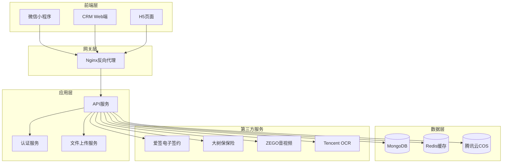

**图表来源**
- [backend/src/app.module.ts](file://backend/src/app.module.ts#L36-L82)
- [backend/src/main.ts](file://backend/src/main.ts#L752-L783)

**章节来源**
- [README.md](file://README.md#L1-L66)
- [DOCUMENTATION.md](file://DOCUMENTATION.md#L26-L100)

## 系统架构

### 技术栈组成

**后端技术栈**
- **NestJS**: Node.js企业级框架，提供模块化架构
- **MongoDB**: NoSQL数据库，支持灵活的数据模型
- **Mongoose**: ODM对象文档映射器
- **JWT**: JSON Web Token认证
- **Socket.IO**: 实时通信支持
- **TypeScript**: 强类型编程语言

**前端技术栈**
- **React**: 用户界面库
- **Vite**: 构建工具
- **Ant Design**: UI组件库
- **Redux Toolkit**: 状态管理
- **TypeScript**: 类型安全

**第三方集成**
- 爱签电子签约
- 大树保保险
- ZEGO音视频
- 腾讯云OCR/COS

### 系统部署架构

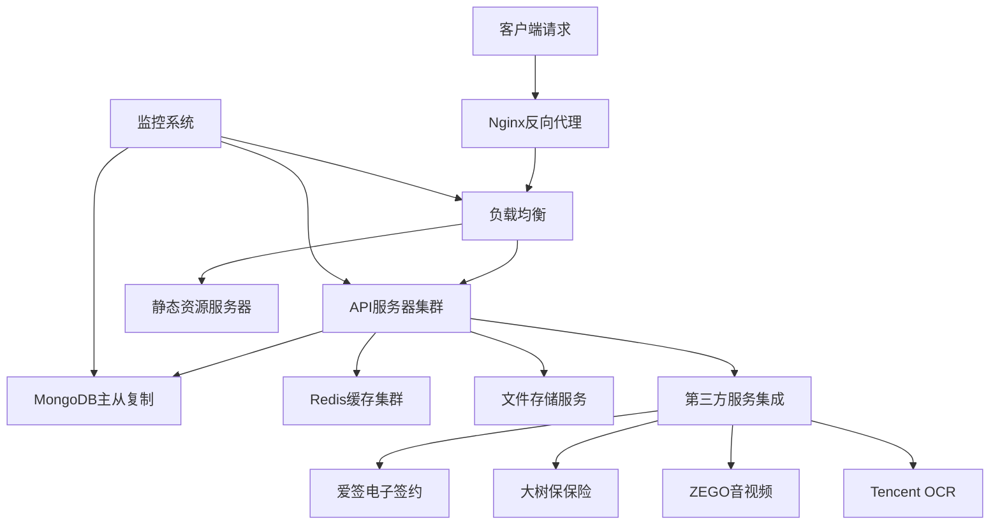

**图表来源**
- [backend/src/main.ts](file://backend/src/main.ts#L49-L55)
- [backend/src/config/production.config.js](file://backend/src/config/production.config.js#L1-L141)

**章节来源**
- [backend/src/app.module.ts](file://backend/src/app.module.ts#L1-L92)
- [backend/src/main.ts](file://backend/src/main.ts#L34-L104)

## 核心模块分析

### 应用模块组织

系统采用模块化架构，每个功能模块都是独立的NestJS模块，具有清晰的职责边界：

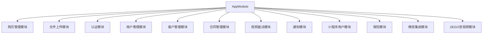

**图表来源**
- [backend/src/app.module.ts](file://backend/src/app.module.ts#L56-L81)

### 数据库连接配置

系统使用Mongoose进行MongoDB连接管理，支持连接池和自动重连：

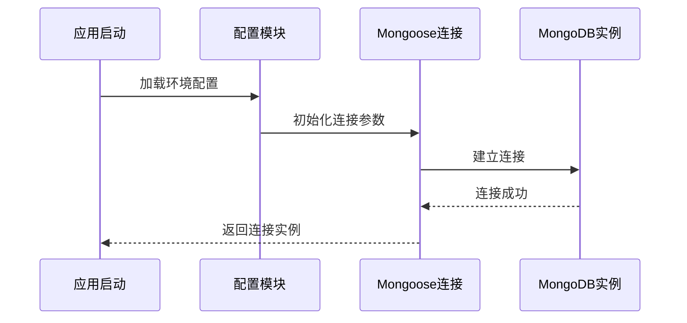

**图表来源**
- [backend/src/app.module.ts](file://backend/src/app.module.ts#L43-L55)

**章节来源**
- [backend/src/app.module.ts](file://backend/src/app.module.ts#L1-L92)

## 小程序用户管理功能

### 功能特性

小程序用户管理系统提供完整的用户生命周期管理功能：

1. **用户注册与登录**
   - OpenID自动登录
   - 手机号授权注册
   - 账号密码登录
   - 多种登录方式支持

2. **用户信息管理**
   - 基本信息维护
   - 头像上传管理
   - 地区信息记录
   - 登录行为追踪

3. **统计分析**
   - 用户增长趋势
   - 活跃度统计
   - 地域分布分析

### 核心业务流程

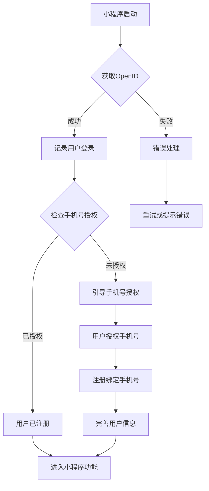

**图表来源**
- [backend/docs/小程序API完整文档.md](file://backend/docs/小程序API完整文档.md#L729-L751)

**章节来源**
- [backend/docs/小程序API完整文档.md](file://backend/docs/小程序API完整文档.md#L65-L85)

## API接口设计

### 用户管理接口

系统提供RESTful API接口，支持小程序端直接调用：

#### 用户注册接口

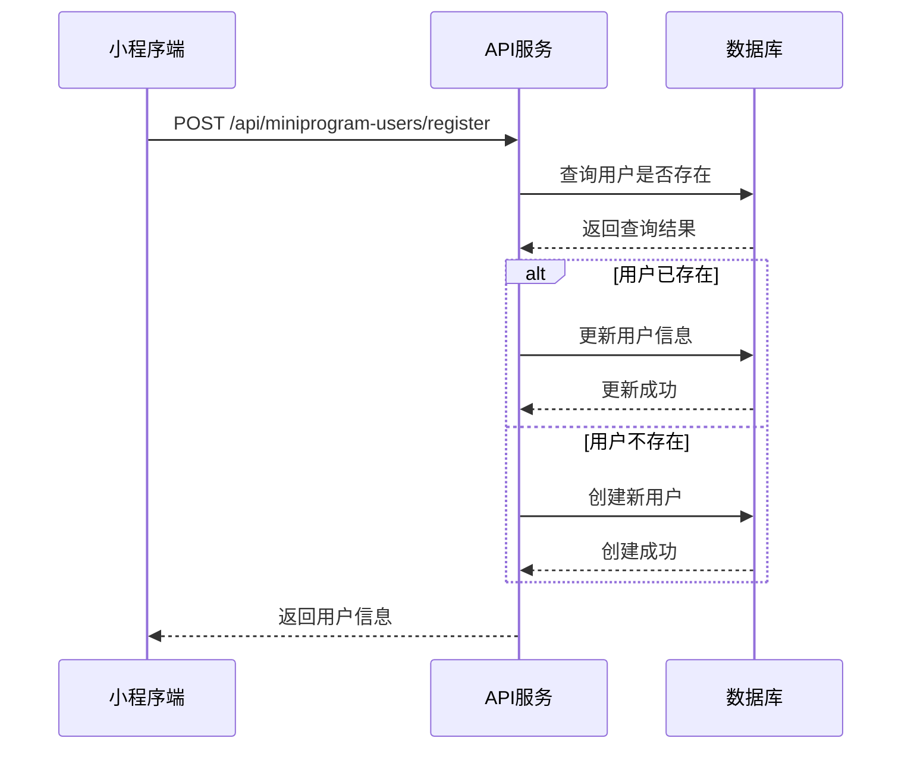

**图表来源**
- [backend/src/modules/miniprogram-user/miniprogram-user.controller.ts](file://backend/src/modules/miniprogram-user/miniprogram-user.controller.ts#L27-L52)

#### 登录接口

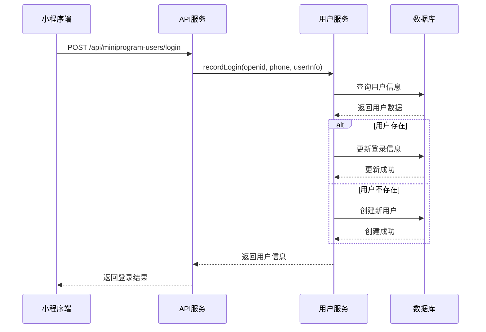

**图表来源**
- [backend/src/modules/miniprogram-user/miniprogram-user.controller.ts](file://backend/src/modules/miniprogram-user/miniprogram-user.controller.ts#L54-L120)

**章节来源**
- [backend/src/modules/miniprogram-user/miniprogram-user.controller.ts](file://backend/src/modules/miniprogram-user/miniprogram-user.controller.ts#L1-L306)

### 接口规范

| 接口 | 方法 | 路径 | 认证 | 说明 |
|------|------|------|------|------|
| 用户注册或更新 | POST | `/api/miniprogram-users/register` | ❌ 无需认证 | 注册新用户或更新现有用户信息 |
| 记录用户登录 | POST | `/api/miniprogram-users/login` | ❌ 无需认证 | 使用OpenID或手机号登录 |
| 账号密码登录 | POST | `/api/miniprogram-users/login-with-password` | ❌ 无需认证 | 使用账号和密码登录 |
| 获取用户列表 | GET | `/api/miniprogram-users` | ✅ JWT认证 | 获取小程序用户列表 |
| 获取统计信息 | GET | `/api/miniprogram-users/statistics` | ✅ JWT认证 | 获取用户统计信息 |

**章节来源**
- [backend/docs/小程序API完整文档.md](file://backend/docs/小程序API完整文档.md#L75-L84)

## 前端集成方案

### React组件架构

前端采用React + TypeScript构建，支持模块化开发：

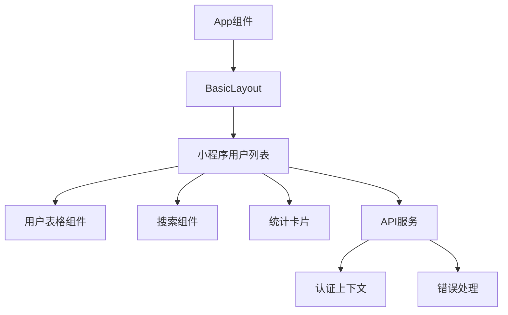

**图表来源**
- [frontend/src/App.tsx](file://frontend/src/App.tsx#L55-L378)

### 路由配置

系统使用React Router进行路由管理，支持权限控制：

```mermaid
flowchart LR
Root[/] --> Dashboard[仪表板]
Root --> MiniProgramUsers[小程序用户管理]
Root --> Customers[客户管理]
Root --> Resumes[简历管理]
MiniProgramUsers --> List[用户列表]
MiniProgramUsers --> Statistics[统计信息]
List --> Protected{权限验证}
Statistics --> Protected
Protected --> Admin[管理员权限]
Protected --> Manager[经理权限]
Protected --> Guest[普通用户]
```

**图表来源**
- [frontend/src/router.tsx](file://frontend/src/router.tsx#L211-L220)

**章节来源**
- [frontend/src/pages/miniprogram-users/MiniProgramUserList.tsx](file://frontend/src/pages/miniprogram-users/MiniProgramUserList.tsx#L1-L287)
- [frontend/src/App.tsx](file://frontend/src/App.tsx#L354-L378)

## 数据模型设计

### 用户实体模型

小程序用户采用灵活的MongoDB文档模型设计：

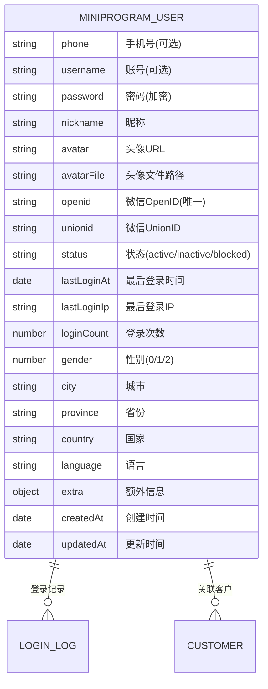

**图表来源**
- [backend/src/modules/miniprogram-user/models/miniprogram-user.entity.ts](file://backend/src/modules/miniprogram-user/models/miniprogram-user.entity.ts#L14-L70)

### 数据库索引设计

为提高查询性能，系统建立了以下索引：

| 索引类型 | 字段 | 用途 |
|----------|------|------|
| 唯一索引 | phone | 手机号唯一性约束 |
| 唯一索引 | username | 用户名唯一性约束 |
| 唯一索引 | openid | OpenID唯一性约束 |
| 普通索引 | createdAt | 按创建时间排序 |
| 普通索引 | lastLoginAt | 按登录时间排序 |

**章节来源**
- [backend/src/modules/miniprogram-user/models/miniprogram-user.entity.ts](file://backend/src/modules/miniprogram-user/models/miniprogram-user.entity.ts#L74-L80)

## 安全与权限控制

### 认证机制

系统采用多层安全防护：

1. **OpenID认证**: 小程序启动时自动获取，无需用户授权
2. **手机号授权**: 用户授权后绑定手机号
3. **账号密码认证**: 用户设置后可直接登录
4. **JWT令牌**: 管理端操作使用JWT认证

### 权限控制

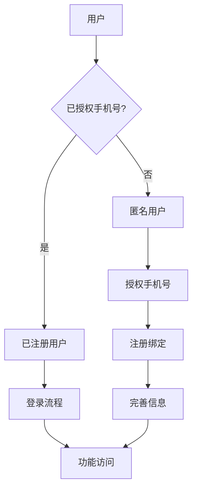

**图表来源**
- [backend/src/modules/miniprogram-user/miniprogram-user.service.ts](file://backend/src/modules/miniprogram-user/miniprogram-user.service.ts#L118-L229)

### 数据安全

- **密码加密**: 使用bcrypt进行密码哈希存储
- **敏感信息过滤**: 响应中不返回密码字段
- **IP记录**: 记录用户登录IP地址
- **登录统计**: 统计登录次数和时间

**章节来源**
- [backend/src/modules/miniprogram-user/miniprogram-user.service.ts](file://backend/src/modules/miniprogram-user/miniprogram-user.service.ts#L18-L40)

## 性能优化策略

### 缓存策略

系统采用多级缓存机制：

1. **Redis缓存**: 热数据缓存
2. **数据库索引**: 查询性能优化
3. **静态资源缓存**: CDN加速

### 数据库优化

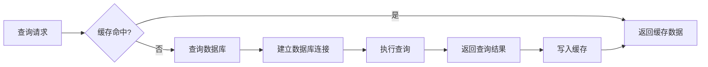

**图表来源**
- [backend/src/config/production.config.js](file://backend/src/config/production.config.js#L69-L77)

### 前端性能优化

- **代码分割**: 按需加载组件
- **懒加载**: 路由级懒加载
- **图片优化**: 响应式图片处理
- **状态管理**: Redux Toolkit优化

**章节来源**
- [frontend/src/App.tsx](file://frontend/src/App.tsx#L8-L68)

## 部署与运维

### 部署配置

系统支持多种部署方式：

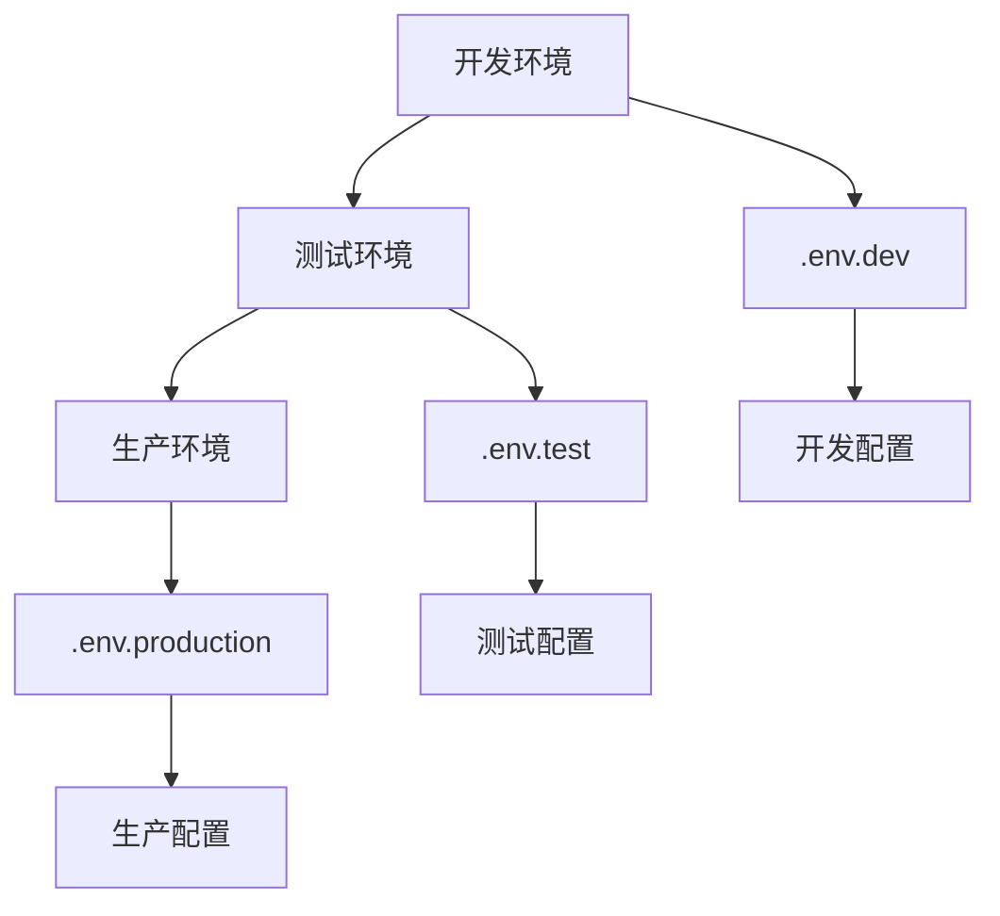

**图表来源**
- [backend/src/main.ts](file://backend/src/main.ts#L18-L26)

### 监控与日志

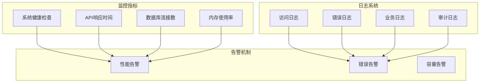

**图表来源**
- [backend/src/config/production.config.js](file://backend/src/config/production.config.js#L123-L140)

**章节来源**
- [backend/src/main.ts](file://backend/src/main.ts#L94-L98)

## 故障排除指南

### 常见问题诊断

#### 用户注册问题

**问题**: 用户注册失败
**排查步骤**:
1. 检查手机号格式是否正确
2. 验证OpenID是否唯一
3. 确认数据库连接正常
4. 查看错误日志

#### 登录异常

**问题**: 用户无法登录
**排查步骤**:
1. 验证OpenID有效性
2. 检查用户状态
3. 确认密码加密正确
4. 查看登录IP记录

#### API调用失败

**问题**: 小程序端API调用失败
**排查步骤**:
1. 检查CORS配置
2. 验证JWT令牌
3. 确认API版本兼容性
4. 查看网络连接状态

### 性能问题诊断

#### 数据库性能问题

**症状**: 查询响应缓慢
**解决方案**:
1. 检查数据库索引
2. 优化查询语句
3. 增加缓存层
4. 调整连接池配置

#### 内存泄漏问题

**症状**: 应用内存持续增长
**解决方案**:
1. 检查定时任务
2. 验证事件监听器
3. 确认数据库连接释放
4. 使用内存分析工具

**章节来源**
- [backend/src/main.ts](file://backend/src/main.ts#L98-L101)

## 总结

安得家政CRM系统的小程序用户管理系统是一个功能完整、架构清晰的现代化应用。系统采用前后端分离的设计，结合了多种先进技术，为家政服务行业提供了全面的数字化解决方案。

### 系统优势

1. **模块化设计**: 清晰的功能模块划分，便于维护和扩展
2. **多端协同**: 支持小程序、Web端等多种客户端
3. **安全可靠**: 多层安全防护，确保数据安全
4. **性能优异**: 优化的数据库设计和缓存策略
5. **易于部署**: 完善的部署配置和监控体系

### 技术亮点

- **灵活的用户认证**: 支持多种登录方式，适应不同业务场景
- **完善的统计分析**: 提供用户行为和业务指标分析
- **高性能架构**: 基于微服务理念的模块化设计
- **现代化技术栈**: 使用最新的前端和后端技术

### 未来发展方向

1. **AI智能匹配**: 集成机器学习算法优化客户与阿姨匹配
2. **移动端优化**: 进一步提升移动端用户体验
3. **数据分析增强**: 提供更深入的业务洞察
4. **国际化支持**: 支持多语言和多地区业务

该系统为家政服务行业的数字化转型提供了坚实的技术基础，具有良好的扩展性和维护性，能够满足不断发展的业务需求。