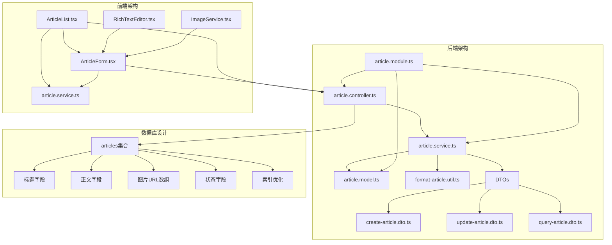
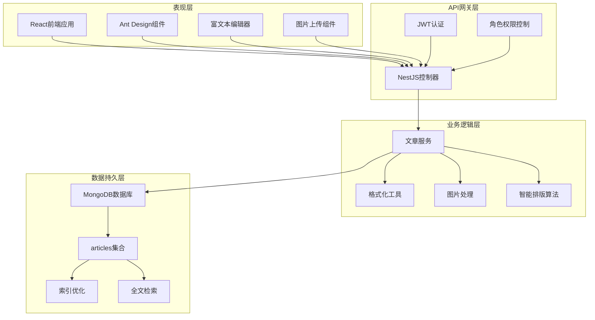
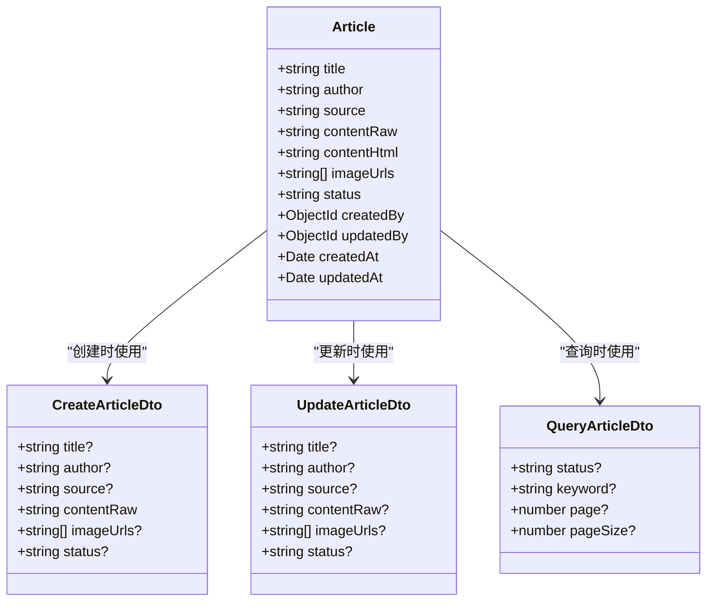
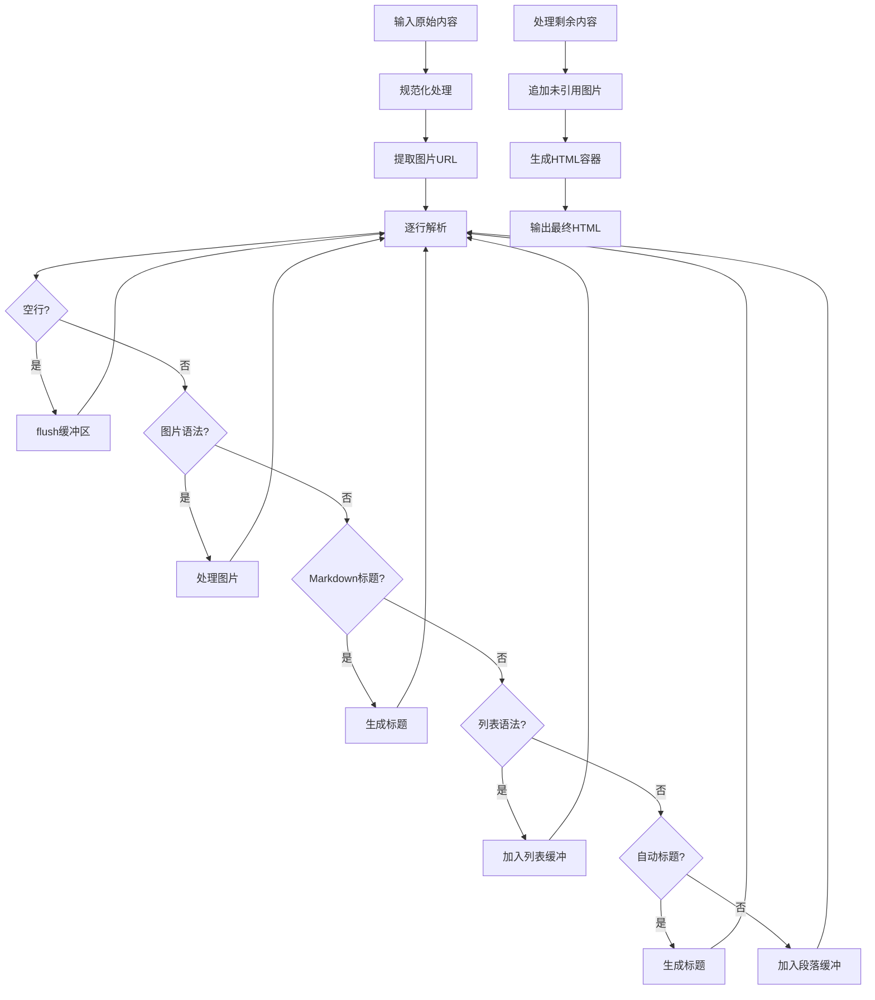
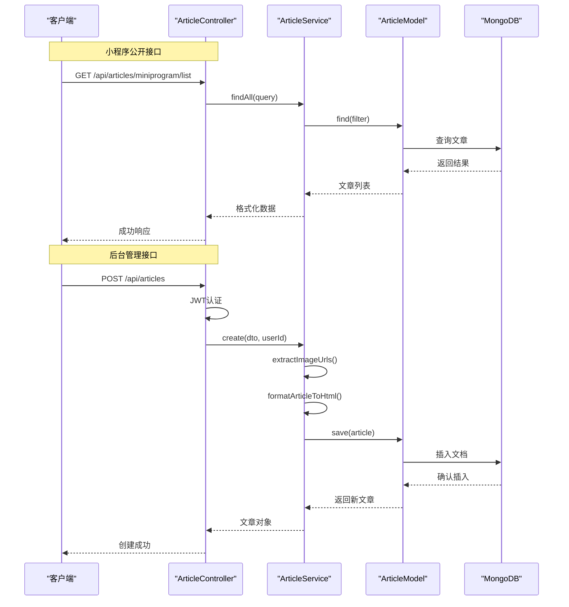
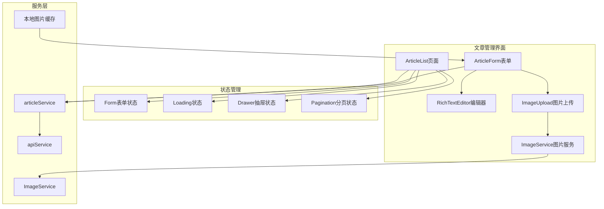
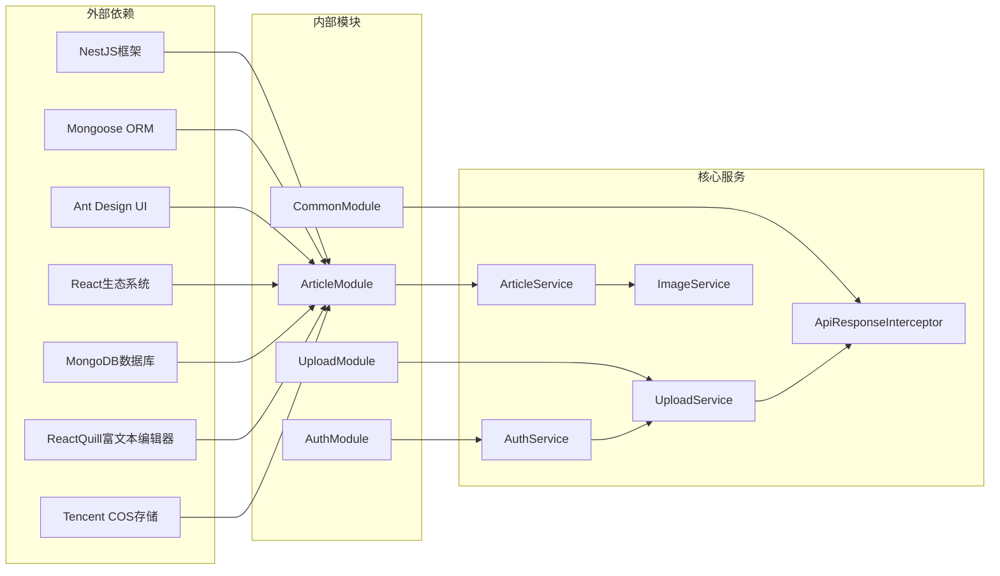

# 文章管理增强

<cite>
**本文档引用的文件**
- [backend/src/modules/article/article.controller.ts](file://backend/src/modules/article/article.controller.ts)
- [backend/src/modules/article/article.service.ts](file://backend/src/modules/article/article.service.ts)
- [backend/src/modules/article/article.module.ts](file://backend/src/modules/article/article.module.ts)
- [backend/src/modules/article/dto/create-article.dto.ts](file://backend/src/modules/article/dto/create-article.dto.ts)
- [backend/src/modules/article/dto/update-article.dto.ts](file://backend/src/modules/article/dto/update-article.dto.ts)
- [backend/src/modules/article/dto/query-article.dto.ts](file://backend/src/modules/article/dto/query-article.dto.ts)
- [backend/src/modules/article/models/article.model.ts](file://backend/src/modules/article/models/article.model.ts)
- [backend/src/modules/article/utils/format-article.util.ts](file://backend/src/modules/article/utils/format-article.util.ts)
- [frontend/src/pages/baobei/ArticleList.tsx](file://frontend/src/pages/baobei/ArticleList.tsx)
- [frontend/src/pages/baobei/ArticleForm.tsx](file://frontend/src/pages/baobei/ArticleForm.tsx)
- [frontend/src/services/article.service.ts](file://frontend/src/services/article.service.ts)
- [frontend/src/components/RichTextEditor.tsx](file://frontend/src/components/RichTextEditor.tsx)
- [frontend/src/services/api.ts](file://frontend/src/services/api.ts)
- [frontend/src/services/imageService.ts](file://frontend/src/services/imageService.ts)
</cite>

## 更新摘要
**变更内容**
- 新增完整的baobei后台平台专用文章内容管理系统
- 增强富文本编辑器功能，支持智能排版和图片处理
- 完善多端支持，包括小程序端和后台管理端
- 优化图片上传和处理机制，支持本地图片临时存储
- 增强文章状态管理和发布流程

## 目录
1. [简介](#简介)
2. [项目结构](#项目结构)
3. [核心组件](#核心组件)
4. [架构概览](#架构概览)
5. [详细组件分析](#详细组件分析)
6. [依赖关系分析](#依赖关系分析)
7. [性能考虑](#性能考虑)
8. [故障排除指南](#故障排除指南)
9. [结论](#结论)

## 简介

文章管理增强功能是基于 NestJS 和 React 构建的完整内容管理系统，专为褓贝后台平台设计。该系统提供完整的文章内容管理能力，支持小程序端的文章展示和后台管理端的文章编辑功能，具备智能排版、图片处理、全文检索等核心特性。

系统采用前后端分离架构，后端使用 NestJS 框架配合 MongoDB 数据库存储，前端使用 Ant Design 和 React 技术栈构建用户界面。通过 RESTful API 实现数据交互，支持文章的创建、编辑、删除、发布状态管理等功能。

**更新** 新增了专门针对baobei后台平台的定制化功能，包括智能排版算法、富文本编辑器集成、图片上传处理等增强特性。

## 项目结构

文章管理模块遵循 NestJS 的标准目录结构，采用按功能域划分的组织方式：

**图表来源**
- [backend/src/modules/article/article.controller.ts](file://backend/src/modules/article/article.controller.ts#L1-L132)
- [backend/src/modules/article/article.service.ts](file://backend/src/modules/article/article.service.ts#L1-L191)
- [backend/src/modules/article/article.module.ts](file://backend/src/modules/article/article.module.ts#L1-L14)

**章节来源**
- [backend/src/modules/article/article.controller.ts](file://backend/src/modules/article/article.controller.ts#L1-L132)
- [backend/src/modules/article/article.service.ts](file://backend/src/modules/article/article.service.ts#L1-L191)
- [backend/src/modules/article/article.module.ts](file://backend/src/modules/article/article.module.ts#L1-L14)

## 核心组件

### 后端核心组件

#### 文章控制器 (ArticleController)
负责处理所有文章相关的 HTTP 请求，提供 RESTful API 接口。控制器实现了完整的 CRUD 操作，并区分了小程序公开接口和后台管理接口。

#### 文章服务 (ArticleService)
业务逻辑的核心实现，包含文章的创建、更新、删除、状态管理等功能。服务层还实现了智能排版、图片 URL 提取、全文检索等高级功能。

#### 文章模型 (Article)
基于 Mongoose 的数据模型定义，描述了文章在数据库中的存储结构，包括标题、正文、图片、状态等字段。

### 前端核心组件

#### 文章列表页面 (ArticleList)
提供文章的列表展示、搜索过滤、状态切换、删除操作等功能，使用 Ant Design 的表格组件实现数据可视化。

#### 文章表单页面 (ArticleForm)
完整的文章编辑界面，支持富文本编辑、图片上传、智能排版、实时预览等功能。

#### 富文本编辑器 (RichTextEditor)
基于 ReactQuill 的富文本编辑器，提供标题、字体、列表、图片等格式化功能，支持中文本地化配置。

**更新** 新增了智能排版功能，支持自动识别标题、列表、段落等内容结构，并提供预览功能。

**章节来源**
- [backend/src/modules/article/article.controller.ts](file://backend/src/modules/article/article.controller.ts#L25-L132)
- [backend/src/modules/article/article.service.ts](file://backend/src/modules/article/article.service.ts#L10-L191)
- [frontend/src/pages/baobei/ArticleList.tsx](file://frontend/src/pages/baobei/ArticleList.tsx#L26-L242)
- [frontend/src/pages/baobei/ArticleForm.tsx](file://frontend/src/pages/baobei/ArticleForm.tsx#L219-L663)
- [frontend/src/components/RichTextEditor.tsx](file://frontend/src/components/RichTextEditor.tsx#L1-L113)

## 架构概览

系统采用分层架构设计，清晰分离了表现层、业务逻辑层、数据访问层：

**图表来源**
- [backend/src/modules/article/article.controller.ts](file://backend/src/modules/article/article.controller.ts#L1-L132)
- [backend/src/modules/article/article.service.ts](file://backend/src/modules/article/article.service.ts#L1-L191)
- [frontend/src/pages/baobei/ArticleList.tsx](file://frontend/src/pages/baobei/ArticleList.tsx#L1-L242)

## 详细组件分析

### 文章模型设计

文章模型采用了灵活的数据结构设计，支持多种内容格式和元数据管理：

**图表来源**
- [backend/src/modules/article/models/article.model.ts](file://backend/src/modules/article/models/article.model.ts#L10-L53)
- [backend/src/modules/article/dto/create-article.dto.ts](file://backend/src/modules/article/dto/create-article.dto.ts#L11-L42)
- [backend/src/modules/article/dto/update-article.dto.ts](file://backend/src/modules/article/dto/update-article.dto.ts#L1-L5)
- [backend/src/modules/article/dto/query-article.dto.ts](file://backend/src/modules/article/dto/query-article.dto.ts#L5-L29)

### 智能排版算法

系统实现了强大的智能排版功能，能够自动识别标题、列表、段落等内容结构：

**更新** 新增了自动标题识别功能，能够智能识别短行文本作为标题，并支持Markdown语法和自动生成标题。

**图表来源**
- [backend/src/modules/article/utils/format-article.util.ts](file://backend/src/modules/article/utils/format-article.util.ts#L62-L182)

### API 接口流程

系统提供了完整的 RESTful API 接口，支持小程序端和后台管理端的不同需求：

**图表来源**
- [backend/src/modules/article/article.controller.ts](file://backend/src/modules/article/article.controller.ts#L32-L130)
- [backend/src/modules/article/article.service.ts](file://backend/src/modules/article/article.service.ts#L47-L75)

**章节来源**
- [backend/src/modules/article/models/article.model.ts](file://backend/src/modules/article/models/article.model.ts#L10-L60)
- [backend/src/modules/article/utils/format-article.util.ts](file://backend/src/modules/article/utils/format-article.util.ts#L1-L191)
- [backend/src/modules/article/article.controller.ts](file://backend/src/modules/article/article.controller.ts#L30-L130)

### 前端组件架构

前端采用响应式设计，提供了完整的文章管理界面：

**更新** 新增了本地图片缓存机制，支持临时存储用户粘贴的图片，在保存时统一上传到COS存储。

**图表来源**
- [frontend/src/pages/baobei/ArticleList.tsx](file://frontend/src/pages/baobei/ArticleList.tsx#L26-L242)
- [frontend/src/pages/baobei/ArticleForm.tsx](file://frontend/src/pages/baobei/ArticleForm.tsx#L219-L663)
- [frontend/src/services/article.service.ts](file://frontend/src/services/article.service.ts#L25-L52)

**章节来源**
- [frontend/src/pages/baobei/ArticleList.tsx](file://frontend/src/pages/baobei/ArticleList.tsx#L1-L242)
- [frontend/src/pages/baobei/ArticleForm.tsx](file://frontend/src/pages/baobei/ArticleForm.tsx#L1-L663)
- [frontend/src/services/article.service.ts](file://frontend/src/services/article.service.ts#L1-L52)

## 依赖关系分析

系统各组件之间的依赖关系清晰明确，遵循单一职责原则：

**更新** 新增了ImageService依赖关系，用于处理图片压缩、上传和缓存功能。

**图表来源**
- [backend/src/modules/article/article.module.ts](file://backend/src/modules/article/article.module.ts#L1-L14)
- [backend/src/modules/article/article.service.ts](file://backend/src/modules/article/article.service.ts#L1-L17)

**章节来源**
- [backend/src/modules/article/article.module.ts](file://backend/src/modules/article/article.module.ts#L1-L14)
- [backend/src/modules/article/article.service.ts](file://backend/src/modules/article/article.service.ts#L1-L17)

## 性能考虑

### 数据库优化策略

系统在数据库层面实现了多项优化措施：

1. **复合索引设计**：为常用查询条件建立复合索引
2. **全文检索支持**：启用 MongoDB 文本搜索功能
3. **分页查询优化**：使用 skip 和 limit 实现高效分页
4. **字段选择优化**：避免不必要的字段传输

### 前端性能优化

1. **虚拟滚动**：大量数据时使用虚拟滚动提升渲染性能
2. **懒加载**：图片和组件按需加载
3. **状态缓存**：合理使用 React hooks 缓存计算结果
4. **防抖节流**：搜索和过滤操作使用防抖优化

### API 性能优化

1. **并发处理**：使用 Promise.all 并行执行多个查询
2. **数据压缩**：传输过程中进行数据压缩
3. **缓存策略**：合理设置响应缓存头
4. **错误处理**：统一的错误处理减少重复代码

**更新** 新增了图片上传优化，支持本地图片临时存储和批量上传处理。

## 故障排除指南

### 常见问题及解决方案

#### 文章图片显示问题
- **症状**：文章中的图片无法正常显示
- **原因**：图片 URL 格式不正确或图片被删除
- **解决方案**：检查图片 URL 是否为 HTTP/HTTPS 格式，确认图片资源是否存在

#### 富文本编辑器异常
- **症状**：编辑器无法正常工作或内容丢失
- **原因**：浏览器兼容性问题或本地存储异常
- **解决方案**：清除浏览器缓存，检查浏览器版本兼容性

#### API 请求失败
- **症状**：文章 CRUD 操作失败
- **原因**：网络连接问题或服务器异常
- **解决方案**：检查网络连接，查看服务器日志，确认 API 端点可用性

#### 权限认证问题
- **症状**：无法访问后台管理功能
- **原因**：JWT 令牌过期或用户权限不足
- **解决方案**：重新登录获取新的 JWT 令牌，确认用户角色权限

#### 图片上传失败
- **症状**：文章图片上传失败或显示异常
- **原因**：网络问题、COS存储配置错误或图片格式不支持
- **解决方案**：检查网络连接，确认COS存储配置，验证图片格式和大小限制

**更新** 新增了图片上传相关的故障排除指南。

**章节来源**
- [backend/src/modules/article/article.service.ts](file://backend/src/modules/article/article.service.ts#L169-L191)
- [frontend/src/pages/baobei/ArticleForm.tsx](file://frontend/src/pages/baobei/ArticleForm.tsx#L385-L479)

## 结论

文章管理增强功能是一个功能完整、架构清晰的内容管理系统。系统通过前后端分离的设计，实现了良好的用户体验和高效的开发维护模式。

主要特点包括：
- **完整的 CRUD 功能**：支持文章的创建、编辑、删除、查询
- **智能排版**：自动识别内容结构，生成美观的 HTML 内容
- **多端支持**：同时支持小程序端展示和后台管理端编辑
- **安全可靠**：完善的权限控制和数据验证机制
- **性能优化**：数据库索引、分页查询、缓存策略等多重优化
- **富文本编辑**：基于ReactQuill的专业富文本编辑器
- **图片处理**：支持本地图片缓存、压缩和批量上传
- **智能排版**：自动识别标题、列表、段落等内容结构

该系统为后续的功能扩展奠定了良好的基础，可以根据业务需求进一步增强搜索功能、增加内容审核流程、优化图片处理性能等。

**更新** 新系统专门为baobei后台平台定制，提供了更加专业和完整的内容管理解决方案，满足了褓贝平台对文章内容管理的特殊需求。