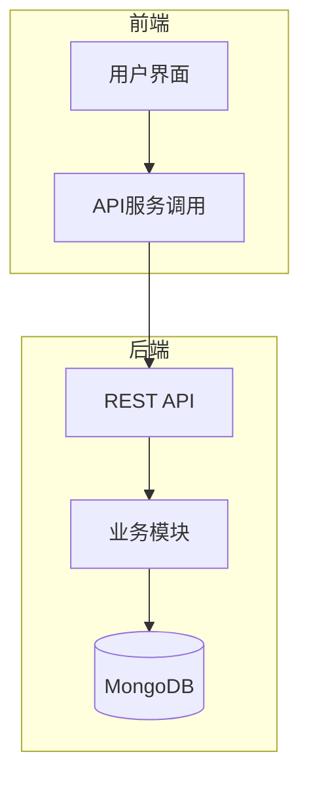
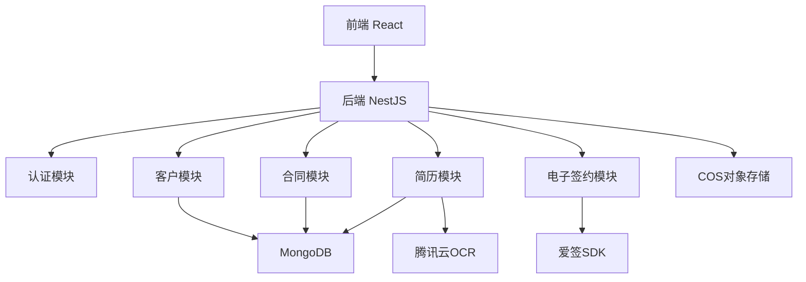
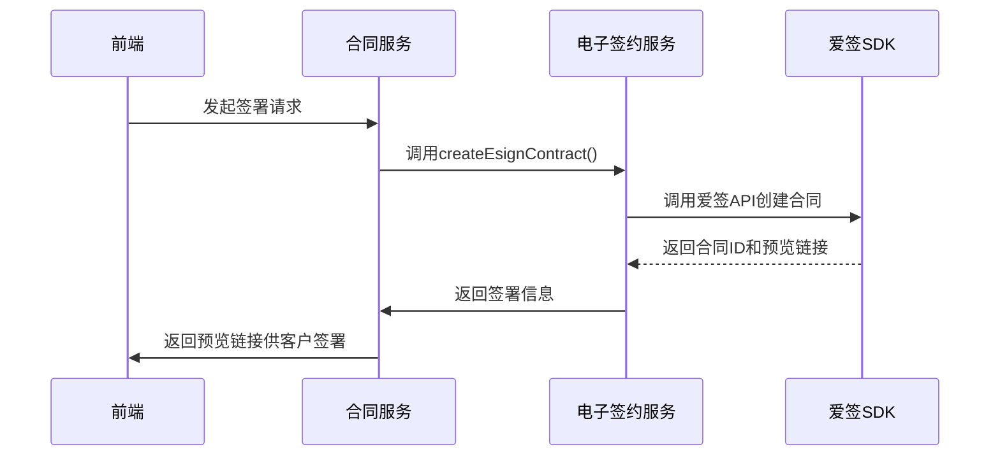
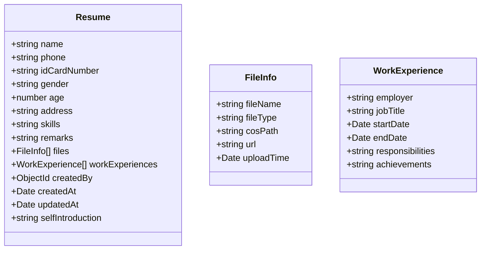
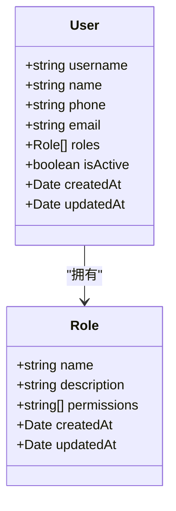
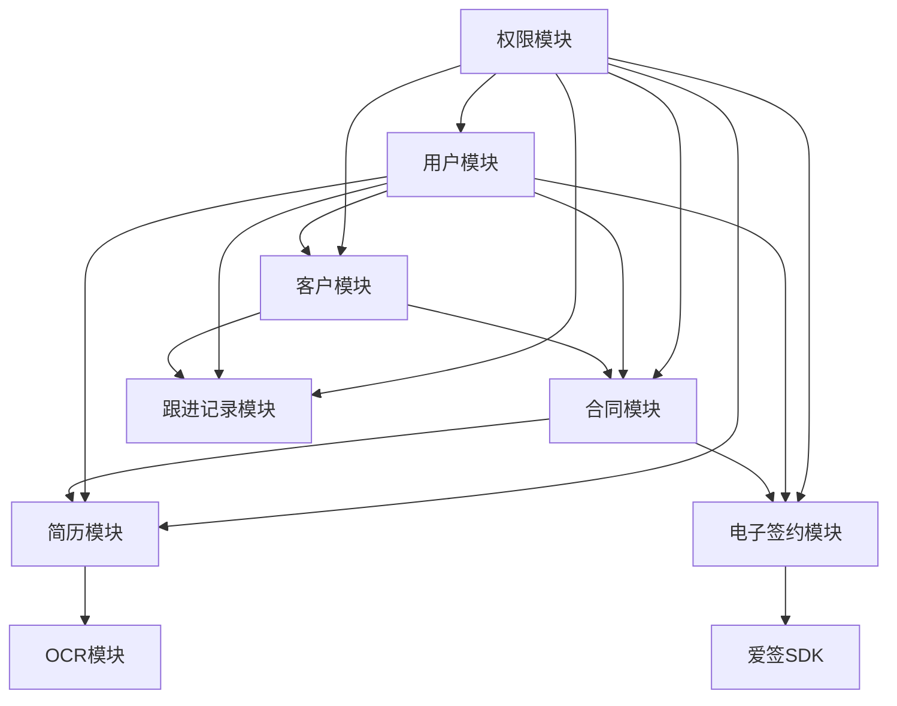

# 核心功能模块

<cite>
**本文档引用的文件**   
- [customer.model.ts](file://backend/src/modules/customers/models/customer.model.ts)
- [customer-follow-up.entity.ts](file://backend/src/modules/customers/models/customer-follow-up.entity.ts)
- [contract.model.ts](file://backend/src/modules/contracts/models/contract.model.ts)
- [customer-contract-history.model.ts](file://backend/src/modules/contracts/models/customer-contract-history.model.ts)
- [esign.service.ts](file://backend/src/modules/esign/esign.service.ts)
- [resume.entity.ts](file://backend/src/modules/resume/models/resume.entity.ts)
- [work-experience.schema.ts](file://backend/src/modules/resume/models/work-experience.schema.ts)
- [role.entity.ts](file://backend/src/modules/roles/models/role.entity.ts)
- [user.entity.ts](file://backend/src/modules/users/models/user.entity.ts)
- [auth.service.ts](file://backend/src/modules/auth/auth.service.ts)
- [tencent-ocr.service.ts](file://backend/src/modules/ocr/tencent-ocr.service.ts)
- [create-resume.dto.ts](file://backend/src/modules/resume/dto/create-resume.dto.ts) - *新增自我介绍字段*
- [resume.controller.ts](file://backend/src/modules/resume/resume.controller.ts) - *新增小程序接口*
- [auth.controller.ts](file://backend/src/modules/auth/auth.controller.ts) - *新增小程序登录接口*
</cite>

## 更新摘要
**变更内容**   
- 在简历管理模块中添加了“自我介绍”功能，更新了相关数据模型和DTO。
- 为简历模块和认证模块增加了新的API接口，以支持小程序功能。
- 更新了简历管理模块的领域模型和实现细节，以反映最新的代码变更。

## 目录
1. [引言](#引言)
2. [项目结构](#项目结构)
3. [核心组件](#核心组件)
4. [架构概览](#架构概览)
5. [详细组件分析](#详细组件分析)
6. [依赖关系分析](#依赖关系分析)
7. [性能考量](#性能考量)
8. [故障排查指南](#故障排查指南)
9. [结论](#结论)

## 引言
本文档全面介绍“安德家政CRM”系统的核心业务功能模块，包括客户管理、合同管理、电子签约、简历管理和用户权限管理。文档旨在为业务分析师和开发者提供一个统一的系统能力视图，涵盖各模块的高层次业务目标、技术实现概览、领域模型、关键业务规则及模块间交互。

## 项目结构
系统采用前后端分离架构，后端基于NestJS框架，前端基于React。主要目录结构如下：
- `backend/`: 后端服务，使用NestJS构建，包含模块化设计的业务逻辑。
- `frontend/`: 前端应用，使用React + TypeScript构建，负责用户界面和交互。
- `scripts/`: 部署和运维脚本。
- `爱签SDK/`: 第三方电子签约服务的SDK和集成示例。



**图示来源**
- [main.ts](file://backend/src/main.ts#L1-L10)
- [app.module.ts](file://backend/src/app.module.ts#L5-L15)

## 核心组件
系统核心由五大业务模块构成：客户管理、合同管理、电子签约、简历管理和用户权限管理。这些模块通过清晰的领域模型和RESTful API进行交互，共同支撑家政服务的业务流程。

**模块来源**
- [customer.model.ts](file://backend/src/modules/customers/models/customer.model.ts#L1-L98)
- [contract.model.ts](file://backend/src/modules/contracts/models/contract.model.ts#L1-L142)

## 架构概览
系统采用分层架构，从前端到后端依次为：用户界面层、API网关层、业务逻辑层、数据访问层和数据存储层。认证授权通过JWT实现，文件存储使用COS，OCR识别集成腾讯云服务，电子签约对接爱签SDK。



**图示来源**
- [app.module.ts](file://backend/src/app.module.ts#L1-L20)
- [auth.module.ts](file://backend/src/modules/auth/auth.module.ts#L1-L10)

## 详细组件分析

### 客户管理模块分析
客户管理模块负责维护潜在客户和签约客户的信息，并记录所有跟进活动。

#### 领域模型
客户实体（Customer）包含客户的基本信息、服务需求、合同状态等。跟进记录实体（CustomerFollowUp）记录与客户的沟通历史。

```mermaid
classDiagram
class Customer {
+string name
+string phone
+string wechatId
+string idCardNumber
+string leadSource
+string serviceCategory
+string contractStatus
+string leadLevel
+number salaryBudget
+Date expectedStartDate
+string address
+string remarks
+string createdBy
+ObjectId lastUpdatedBy
+Date createdAt
+Date updatedAt
+string customerId
}
class CustomerFollowUp {
+ObjectId customerId
+CustomerFollowUpType type
+string content
+ObjectId createdBy
+Date createdAt
+Date updatedAt
}
enum CustomerFollowUpType {
PHONE
WECHAT
VISIT
OTHER
}
CustomerFollowUp --> Customer : "关联"
```

**图示来源**
- [customer.model.ts](file://backend/src/modules/customers/models/customer.model.ts#L1-L98)
- [customer-follow-up.entity.ts](file://backend/src/modules/customers/models/customer-follow-up.entity.ts#L1-L63)

**业务规则**
- 客户手机号必须唯一。
- 客户合同状态包括：已签约、匹配中、流失客户等。
- 跟进记录必须关联到一个客户，并记录创建人。

**模块来源**
- [customers.service.ts](file://backend/src/modules/customers/customers.service.ts#L1-L200)
- [follow-up.service.ts](file://backend/src/modules/follow-up/follow-up.service.ts#L1-L100)

### 合同管理模块分析
合同管理模块处理合同的全生命周期，从创建、签署到生效、替换或作废。

#### 领域模型
合同实体（Contract）包含详细的合同条款、双方信息、财务数据和状态。合同状态机确保合同流转的合规性。

```mermaid
classDiagram
class Contract {
+string contractNumber
+string customerName
+string customerPhone
+string customerIdCard
+ContractType contractType
+Date startDate
+Date endDate
+string workerName
+string workerPhone
+string workerIdCard
+number workerSalary
+number customerServiceFee
+number deposit
+number finalPayment
+Date expectedDeliveryDate
+number salaryPaymentDay
+string remarks
+number monthlyWorkDays
+ObjectId customerId
+ObjectId workerId
+ObjectId createdBy
+ObjectId lastUpdatedBy
+string esignContractNo
+string esignStatus
+Date esignCreatedAt
+Date esignSignedAt
+string esignTemplateNo
+string esignPreviewUrl
+boolean isLatest
+ContractStatus contractStatus
+ObjectId replacedByContractId
+ObjectId replacesContractId
+Date changeDate
+number serviceDays
+Date createdAt
+Date updatedAt
}
enum ContractType {
YUEXIN
ZHUJIA_YUER
BAOJIE
ZHUJIA_BAOMU
YANGCHONG
XIAOSHI
BAIBAN_YUER
BAIBAN_BAOMU
ZHUJIA_HULAO
}
enum ContractStatus {
DRAFT
SIGNING
ACTIVE
REPLACED
CANCELLED
}
```

**图示来源**
- [contract.model.ts](file://backend/src/modules/contracts/models/contract.model.ts#L1-L142)

**业务规则**
- 合同编号必须唯一。
- 合同状态机：草稿(DRAFT) -> 签约中(SIGNING) -> 生效中(ACTIVE)。生效中的合同可被替换(REPLACED)或作废(CANCELLED)。
- “换人”功能通过`isLatest`标志和`replacesContractId`/`replacedByContractId`外键实现，确保一个客户在同一时期只有一个最新有效合同。

**模块来源**
- [contracts.service.ts](file://backend/src/modules/contracts/contracts.service.ts#L1-L300)

### 电子签约模块分析
电子签约模块负责与爱签SDK集成，实现合同的在线签署。

#### 集成流程
该模块通过调用爱签SDK的API，将系统内的合同数据转化为电子合同，并处理签署状态的同步。



**图示来源**
- [esign.service.ts](file://backend/src/modules/esign/esign.service.ts#L1-L150)
- [contracts.service.ts](file://backend/src/modules/contracts/contracts.service.ts#L200-L250)

**关键实现**
- `esign.service.ts`封装了与爱签SDK的交互逻辑。
- 合同实体中缓存了爱签合同编号、状态和预览链接，避免频繁调用第三方API。

### 简历管理模块分析
简历管理模块支持家政员简历的创建、OCR识别和工作经历管理。

#### 领域模型
简历实体（Resume）包含家政员的个人信息和文件信息。工作经历（WorkExperience）作为嵌套文档存储。



**图示来源**
- [resume.entity.ts](file://backend/src/modules/resume/models/resume.entity.ts#L1-L50)
- [work-experience.schema.ts](file://backend/src/modules/resume/models/work-experience.schema.ts#L1-L30)

**新增功能：自我介绍**
在简历实体中新增了`selfIntroduction`字段，允许家政员填写自我介绍。该字段为可选字段，最大长度为1000个字符。

**模块来源**
- [resume.entity.ts](file://backend/src/modules/resume/models/resume.entity.ts#L1-L265) - *新增自我介绍字段*
- [create-resume.dto.ts](file://backend/src/modules/resume/dto/create-resume.dto.ts#L1-L847) - *新增自我介绍字段*

**OCR集成**
- `tencent-ocr.service.ts`调用腾讯云OCR API，从身份证或简历图片中提取文本信息。
- OCR结果用于自动填充简历表单，提高数据录入效率。

**模块来源**
- [tencent-ocr.service.ts](file://backend/src/modules/ocr/tencent-ocr.service.ts#L1-L100)
- [resume.service.ts](file://backend/src/modules/resume/resume.service.ts#L1-L200)

#### 新增API接口
为支持小程序功能，简历模块新增了以下API接口：

**小程序创建简历接口**
- **路径**: `POST /resumes/miniprogram/create`
- **功能**: 支持幂等性和去重的小程序简历创建
- **请求体**: `CreateResumeV2Dto`
- **响应**: 返回创建的简历ID和操作类型（CREATED/UPDATED）

**获取小程序简历详情接口**
- **路径**: `GET /resumes/miniprogram/:id`
- **功能**: 获取简历详情，包含自我介绍字段

**模块来源**
- [resume.controller.ts](file://backend/src/modules/resume/resume.controller.ts#L659-L755) - *新增小程序接口*

### 用户权限管理模块分析
用户权限管理模块实现基于角色的访问控制（RBAC），确保系统安全。

#### 领域模型
用户（User）和角色（Role）实体构成权限体系的基础。用户被分配一个或多个角色，角色拥有特定权限。



**图示来源**
- [user.entity.ts](file://backend/src/modules/users/models/user.entity.ts#L1-L40)
- [role.entity.ts](file://backend/src/modules/roles/models/role.entity.ts#L1-L30)

**权限控制实现**
- 使用`@Roles()`装饰器和`RolesGuard`守卫来保护API端点。
- JWT令牌中包含用户的角色信息，用于在请求时进行权限校验。
- 认证服务（`auth.service.ts`）负责用户登录和JWT令牌的生成。

**模块来源**
- [roles.guard.ts](file://backend/src/modules/auth/guards/roles.guard.ts#L1-L50)
- [roles.decorator.ts](file://backend/src/modules/auth/decorators/roles.decorator.ts#L1-L20)
- [auth.service.ts](file://backend/src/modules/auth/auth.service.ts#L1-L100)

#### 新增API接口
为支持小程序功能，认证模块新增了以下API接口：

**小程序登录接口**
- **路径**: `POST /auth/miniprogram-login`
- **功能**: 小程序专用登录接口，通过微信授权码和手机号登录
- **请求参数**: code（微信授权码）、phone（手机号）

**模块来源**
- [auth.controller.ts](file://backend/src/modules/auth/auth.controller.ts#L33-L41) - *新增小程序登录接口*

## 依赖关系分析
各模块之间通过清晰的依赖关系进行交互，共同完成业务流程。



**图示来源**
- [app.module.ts](file://backend/src/app.module.ts#L1-L30)
- [contracts.module.ts](file://backend/src/modules/contracts/contracts.module.ts#L1-L10)

## 性能考量
- 在`CustomerFollowUp`和`Contract`模型上建立了复合索引，以优化按客户ID和时间排序的查询性能。
- 使用COS对象存储来处理大文件上传，减轻数据库压力。
- 对爱签和腾讯云OCR等第三方API调用结果进行缓存，减少外部依赖和延迟。

## 故障排查指南
- **客户跟进记录无法创建**：检查`customerId`和`createdBy`字段是否有效，确保关联的客户和用户存在。
- **电子签约失败**：查看`esign.service.ts`的日志，确认爱签SDK的API密钥和配置正确，检查网络连接。
- **OCR识别率低**：确保上传的图片清晰、完整，符合腾讯云OCR的输入要求。
- **权限错误**：验证JWT令牌是否有效，检查用户角色及其权限是否正确配置。

**模块来源**
- [http-exception.filter.ts](file://backend/src/common/filters/http-exception.filter.ts#L1-L30)
- [cos.exception.ts](file://backend/src/modules/upload/exceptions/cos.exception.ts#L1-L20)

## 结论
本系统通过模块化设计，实现了家政CRM的核心业务功能。客户、合同、简历、电子签约和权限管理模块紧密协作，形成了一个高效、安全的业务闭环。系统架构清晰，扩展性强，为后续功能迭代奠定了坚实基础。近期更新增加了简历的自我介绍功能和小程序专用API接口，进一步提升了系统的用户体验和功能性。