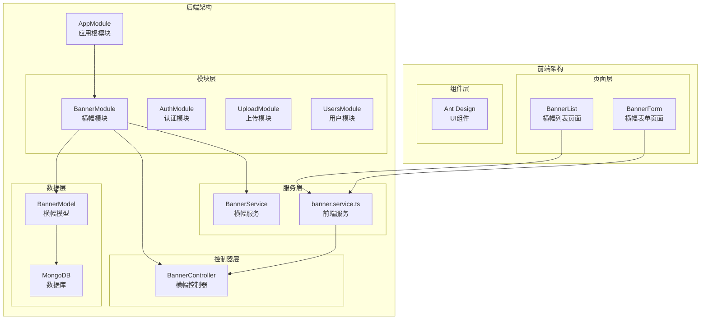
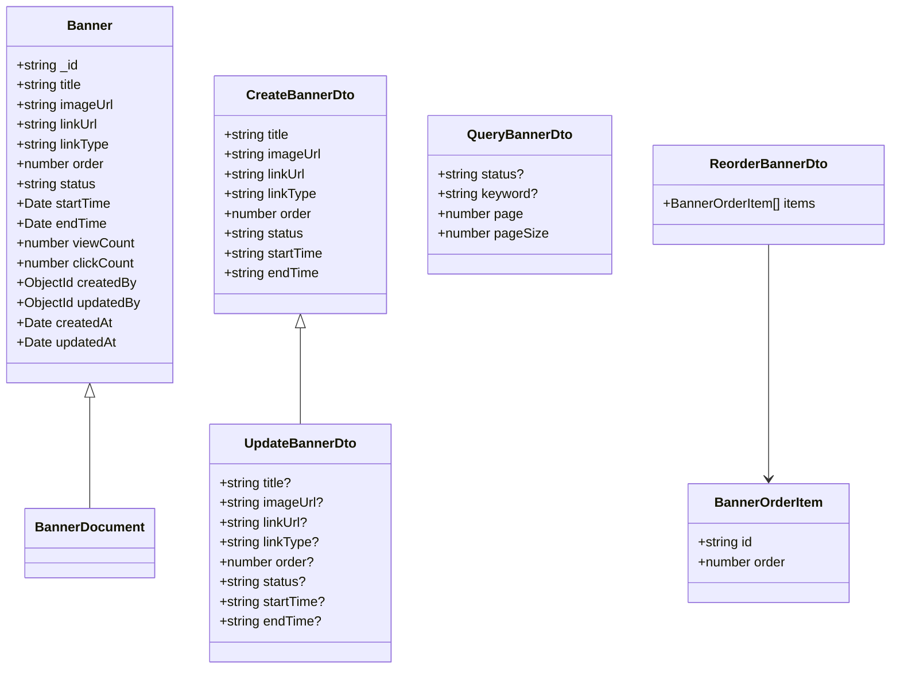
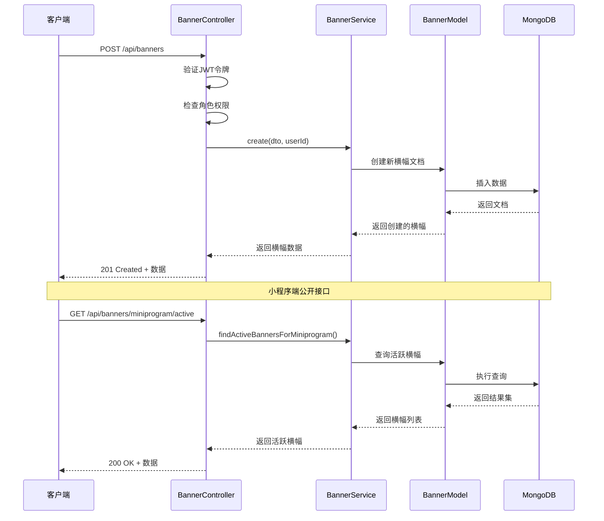
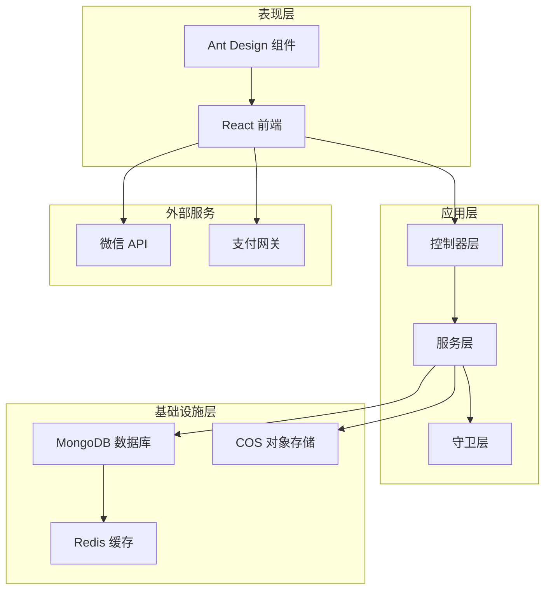
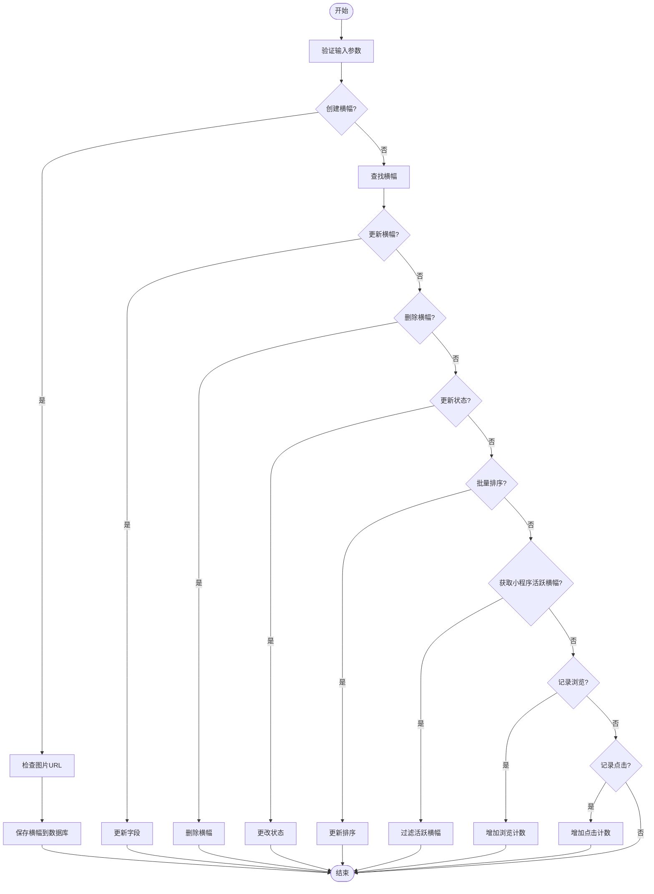
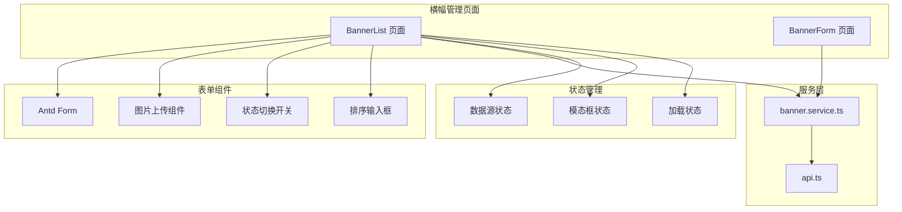
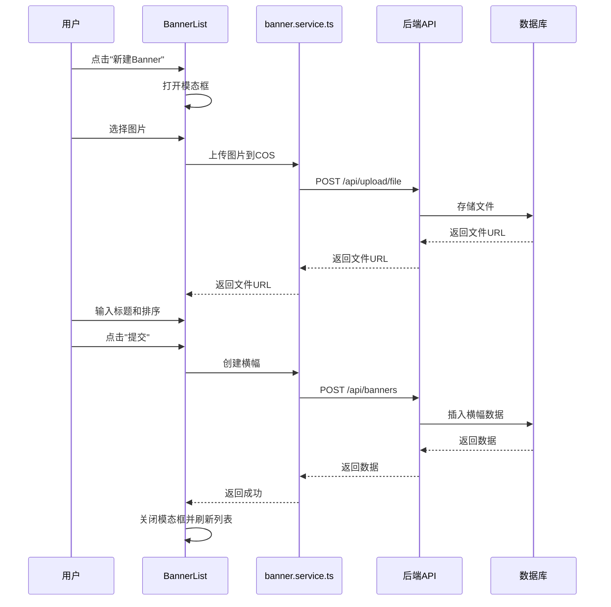
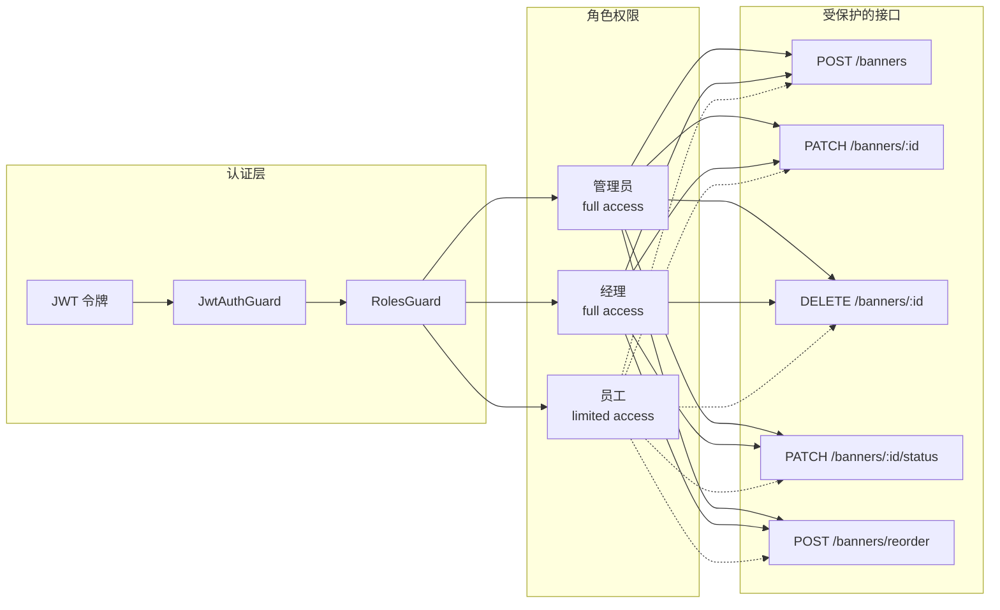
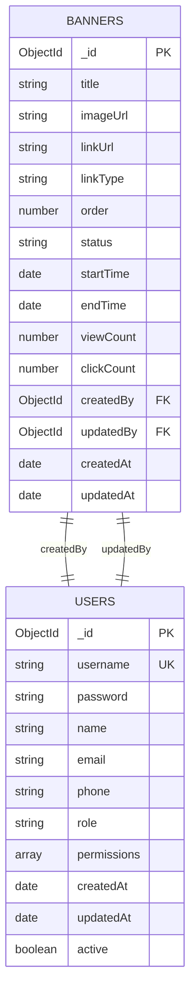
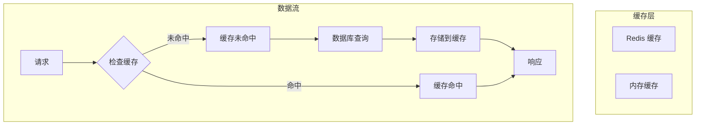

# 横幅管理系统

<cite>
**本文档引用的文件**
- [backend/src/modules/banner/banner.controller.ts](file://backend/src/modules/banner/banner.controller.ts)
- [backend/src/modules/banner/banner.service.ts](file://backend/src/modules/banner/banner.service.ts)
- [backend/src/modules/banner/banner.module.ts](file://backend/src/modules/banner/banner.module.ts)
- [backend/src/modules/banner/models/banner.model.ts](file://backend/src/modules/banner/models/banner.model.ts)
- [backend/src/modules/banner/dto/create-banner.dto.ts](file://backend/src/modules/banner/dto/create-banner.dto.ts)
- [backend/src/modules/banner/dto/update-banner.dto.ts](file://backend/src/modules/banner/dto/update-banner.dto.ts)
- [backend/src/modules/banner/dto/query-banner.dto.ts](file://backend/src/modules/banner/dto/query-banner.dto.ts)
- [backend/src/modules/banner/dto/reorder-banner.dto.ts](file://backend/src/modules/banner/dto/reorder-banner.dto.ts)
- [frontend/src/pages/baobei/BannerList.tsx](file://frontend/src/pages/baobei/BannerList.tsx)
- [frontend/src/pages/baobei/BannerForm.tsx](file://frontend/src/pages/baobei/BannerForm.tsx)
- [frontend/src/services/banner.service.ts](file://frontend/src/services/banner.service.ts)
- [backend/src/app.module.ts](file://backend/src/app.module.ts)
- [backend/src/main.ts](file://backend/src/main.ts)
- [backend/src/docs/DATABASE_SCHEMA.md](file://backend/src/docs/DATABASE_SCHEMA.md)
- [backend/package.json](file://backend/package.json)
- [frontend/package.json](file://frontend/package.json)
</cite>

## 目录
1. [简介](#简介)
2. [项目结构](#项目结构)
3. [核心组件](#核心组件)
4. [架构概览](#架构概览)
5. [详细组件分析](#详细组件分析)
6. [依赖关系分析](#依赖关系分析)
7. [性能考虑](#性能考虑)
8. [故障排除指南](#故障排除指南)
9. [结论](#结论)

## 简介

横幅管理系统是一个基于 NestJS 和 React 的全栈应用程序，专门用于管理网站横幅广告。该系统提供了完整的横幅生命周期管理功能，包括创建、编辑、删除、状态管理和排序控制等核心功能。

系统采用前后端分离架构，后端使用 NestJS 框架构建 RESTful API，前端使用 React + Ant Design 开发用户界面。数据存储采用 MongoDB，通过 Mongoose 进行对象文档映射。

主要特性包括：
- 多角色权限管理（管理员、经理、员工）
- 横幅状态控制（启用/禁用）
- 时间范围限制（生效开始时间和结束时间）
- 排序管理功能
- 访问统计（浏览量、点击量）
- 小程序端公开接口支持

## 项目结构

该项目采用模块化架构设计，横幅管理功能位于独立的模块中，便于维护和扩展。



**图表来源**
- [backend/src/app.module.ts](file://backend/src/app.module.ts#L36-L82)
- [backend/src/modules/banner/banner.module.ts](file://backend/src/modules/banner/banner.module.ts#L7-L14)

**章节来源**
- [backend/src/app.module.ts](file://backend/src/app.module.ts#L1-L92)
- [backend/src/modules/banner/banner.module.ts](file://backend/src/modules/banner/banner.module.ts#L1-L17)

## 核心组件

### 数据模型设计

横幅系统的核心数据模型定义了完整的横幅信息结构，支持多种链接类型和状态管理。



**图表来源**
- [backend/src/modules/banner/models/banner.model.ts](file://backend/src/modules/banner/models/banner.model.ts#L10-L73)
- [backend/src/modules/banner/dto/create-banner.dto.ts](file://backend/src/modules/banner/dto/create-banner.dto.ts#L4-L53)
- [backend/src/modules/banner/dto/update-banner.dto.ts](file://backend/src/modules/banner/dto/update-banner.dto.ts#L1-L6)
- [backend/src/modules/banner/dto/query-banner.dto.ts](file://backend/src/modules/banner/dto/query-banner.dto.ts#L5-L31)
- [backend/src/modules/banner/dto/reorder-banner.dto.ts](file://backend/src/modules/banner/dto/reorder-banner.dto.ts#L4-L20)

### 控制器架构

横幅控制器实现了完整的 CRUD 操作和业务逻辑处理，支持多角色权限管理和公开接口。



**图表来源**
- [backend/src/modules/banner/banner.controller.ts](file://backend/src/modules/banner/banner.controller.ts#L33-L46)
- [backend/src/modules/banner/banner.controller.ts](file://backend/src/modules/banner/banner.controller.ts#L65-L76)

**章节来源**
- [backend/src/modules/banner/banner.controller.ts](file://backend/src/modules/banner/banner.controller.ts#L1-L194)
- [backend/src/modules/banner/banner.service.ts](file://backend/src/modules/banner/banner.service.ts#L1-L211)

## 架构概览

系统采用分层架构设计，确保关注点分离和代码可维护性。



**图表来源**
- [backend/src/main.ts](file://backend/src/main.ts#L34-L102)
- [backend/src/app.module.ts](file://backend/src/app.module.ts#L36-L82)

### API 接口设计

系统提供 RESTful API 接口，支持完整的横幅管理功能：

| 方法 | 路径 | 权限 | 描述 |
|------|------|------|------|
| POST | `/api/banners` | 管理员/经理 | 创建新横幅 |
| GET | `/api/banners` | 管理员/经理 | 获取横幅列表（分页） |
| GET | `/api/banners/:id` | 管理员/经理 | 获取单个横幅详情 |
| PATCH | `/api/banners/:id` | 管理员/经理 | 更新横幅信息 |
| DELETE | `/api/banners/:id` | 管理员/经理 | 删除横幅 |
| PATCH | `/api/banners/:id/status` | 管理员/经理 | 更新横幅状态 |
| POST | `/api/banners/reorder` | 管理员/经理 | 批量调整排序 |
| GET | `/api/banners/miniprogram/active` | 公开 | 获取小程序活跃横幅 |
| POST | `/api/banners/:id/view` | 公开 | 记录横幅浏览 |
| POST | `/api/banners/:id/click` | 公开 | 记录横幅点击 |

**章节来源**
- [backend/src/modules/banner/banner.controller.ts](file://backend/src/modules/banner/banner.controller.ts#L26-L194)

## 详细组件分析

### 后端服务层

服务层负责业务逻辑处理和数据访问，实现了横幅管理的核心功能。

#### 业务流程分析



**图表来源**
- [backend/src/modules/banner/banner.service.ts](file://backend/src/modules/banner/banner.service.ts#L21-L208)

#### 数据访问模式

服务层使用 Mongoose 进行数据操作，实现了以下关键功能：

1. **分页查询**：支持按状态和关键词过滤，返回分页结果
2. **条件查询**：根据时间范围动态生成查询条件
3. **批量操作**：支持批量更新排序和状态
4. **聚合统计**：记录浏览和点击统计数据

**章节来源**
- [backend/src/modules/banner/banner.service.ts](file://backend/src/modules/banner/banner.service.ts#L36-L208)

### 前端用户界面

前端使用 React 和 Ant Design 构建用户界面，提供了直观的横幅管理体验。

#### 页面组件架构



**图表来源**
- [frontend/src/pages/baobei/BannerList.tsx](file://frontend/src/pages/baobei/BannerList.tsx#L11-L36)
- [frontend/src/services/banner.service.ts](file://frontend/src/services/banner.service.ts#L26-L63)

#### 用户交互流程



**图表来源**
- [frontend/src/pages/baobei/BannerList.tsx](file://frontend/src/pages/baobei/BannerList.tsx#L84-L105)
- [frontend/src/pages/baobei/BannerList.tsx](file://frontend/src/pages/baobei/BannerList.tsx#L108-L137)

**章节来源**
- [frontend/src/pages/baobei/BannerList.tsx](file://frontend/src/pages/baobei/BannerList.tsx#L1-L243)
- [frontend/src/pages/baobei/BannerForm.tsx](file://frontend/src/pages/baobei/BannerForm.tsx#L1-L28)
- [frontend/src/services/banner.service.ts](file://frontend/src/services/banner.service.ts#L1-L66)

### 权限控制系统

系统实现了基于 JWT 的多角色权限控制，确保不同用户只能访问相应的功能。

#### 权限架构设计



**图表来源**
- [backend/src/modules/banner/banner.controller.ts](file://backend/src/modules/banner/banner.controller.ts#L33-L46)
- [backend/src/modules/banner/banner.controller.ts](file://backend/src/modules/banner/banner.controller.ts#L94-L127)

**章节来源**
- [backend/src/modules/banner/banner.controller.ts](file://backend/src/modules/banner/banner.controller.ts#L31-L162)

## 依赖关系分析

系统使用现代化的技术栈，各组件之间保持松耦合的设计。

```mermaid
graph TB
subgraph "后端依赖"
NestJS[@nestjs/*]
Mongoose[mongoose]
Express[express]
Swagger[@nestjs/swagger]
ClassValidator[class-validator]
Dotenv[dotenv]
end
subgraph "前端依赖"
React[react]
AntD[antd]
Axios[axios]
DayJS[dayjs]
Formik[formik]
QRCode[qrcode.react]
end
subgraph "开发工具"
TypeScript[typescript]
ESLint[eslint]
Prettier[prettier]
Jest[jest]
Vite[vite]
end
NestJS --> Mongoose
NestJS --> Express
NestJS --> Swagger
NestJS --> ClassValidator
React --> AntD
React --> Axios
React --> DayJS
React --> Formik
TypeScript --> ESLint
TypeScript --> Prettier
TypeScript --> Jest
TypeScript --> Vite
```

**图表来源**
- [backend/package.json](file://backend/package.json#L27-L88)
- [frontend/package.json](file://frontend/package.json#L17-L48)

### 数据库设计

系统采用 MongoDB 作为主要数据存储，横幅数据模型设计如下：



**图表来源**
- [backend/src/modules/banner/models/banner.model.ts](file://backend/src/modules/banner/models/banner.model.ts#L10-L73)

**章节来源**
- [backend/src/docs/DATABASE_SCHEMA.md](file://backend/src/docs/DATABASE_SCHEMA.md#L1-L253)

## 性能考虑

系统在设计时充分考虑了性能优化，采用了多种策略来提升用户体验。

### 数据库优化

1. **索引策略**：
   - 复合索引：`(status: 1, order: 1)` 用于快速筛选和排序
   - 时间索引：`(createdAt: -1)` 用于最新数据查询
   - 查询优化：使用投影减少数据传输

2. **查询优化**：
   - 分页查询：避免一次性加载大量数据
   - 条件查询：动态构建查询条件，减少不必要的筛选
   - 异步操作：使用 Promise.all 并行执行多个查询

### 缓存策略

虽然当前实现未包含缓存层，但系统设计支持后续添加缓存机制：



### 性能监控

系统提供了完善的日志记录和错误处理机制：

- **结构化日志**：使用 NestJS 内置日志系统
- **异常处理**：统一的异常过滤器处理各种错误情况
- **性能指标**：记录关键操作的执行时间和错误率

## 故障排除指南

### 常见问题及解决方案

#### 数据库连接问题

**症状**：应用启动时报数据库连接错误
**解决方案**：
1. 检查 `.env` 文件中的 `MONGODB_URI` 配置
2. 确认 MongoDB 服务正在运行
3. 验证网络连接和防火墙设置

#### 权限认证问题

**症状**：API 请求返回 401 或 403 错误
**解决方案**：
1. 确认 JWT 令牌有效且未过期
2. 检查用户角色权限配置
3. 验证 API 路由的权限注解

#### 文件上传问题

**症状**：图片上传失败或返回空 URL
**解决方案**：
1. 检查 COS 服务配置和凭证
2. 验证文件大小和格式限制
3. 确认网络连接稳定

#### 数据查询问题

**症状**：横幅列表为空或查询结果不正确
**解决方案**：
1. 检查查询参数和过滤条件
2. 验证数据库索引是否正常
3. 确认数据格式和字段类型

**章节来源**
- [backend/src/main.ts](file://backend/src/main.ts#L98-L101)
- [backend/src/modules/banner/banner.service.ts](file://backend/src/modules/banner/banner.service.ts#L82-L122)

### 调试技巧

1. **启用详细日志**：在开发环境中使用 `debug` 级别日志
2. **使用 Swagger UI**：通过 `/api/docs` 查看和测试 API
3. **检查环境变量**：确认所有必需的环境变量已正确设置
4. **验证数据库连接**：使用 MongoDB 客户端工具检查连接状态

## 结论

横幅管理系统是一个设计合理、功能完整的全栈应用程序。系统采用现代化的技术栈和架构模式，具有以下优势：

### 技术优势
- **模块化设计**：清晰的模块边界和职责分离
- **类型安全**：完整的 TypeScript 类型定义
- **RESTful API**：标准化的接口设计
- **权限控制**：灵活的多角色权限管理
- **数据验证**：严格的输入验证和错误处理

### 功能特性
- **完整的 CRUD 操作**：支持横幅的全生命周期管理
- **状态管理**：支持启用/禁用状态控制
- **时间限制**：支持生效时间范围控制
- **排序功能**：灵活的排序管理机制
- **统计功能**：内置的浏览和点击统计

### 扩展性
系统设计支持后续功能扩展，如：
- 添加更多横幅类型和链接选项
- 集成更多第三方服务
- 实现更复杂的权限控制
- 添加缓存层提升性能

该系统为横幅管理提供了可靠的技术基础，能够满足企业级应用的需求，并为未来的功能扩展奠定了良好的技术基础。