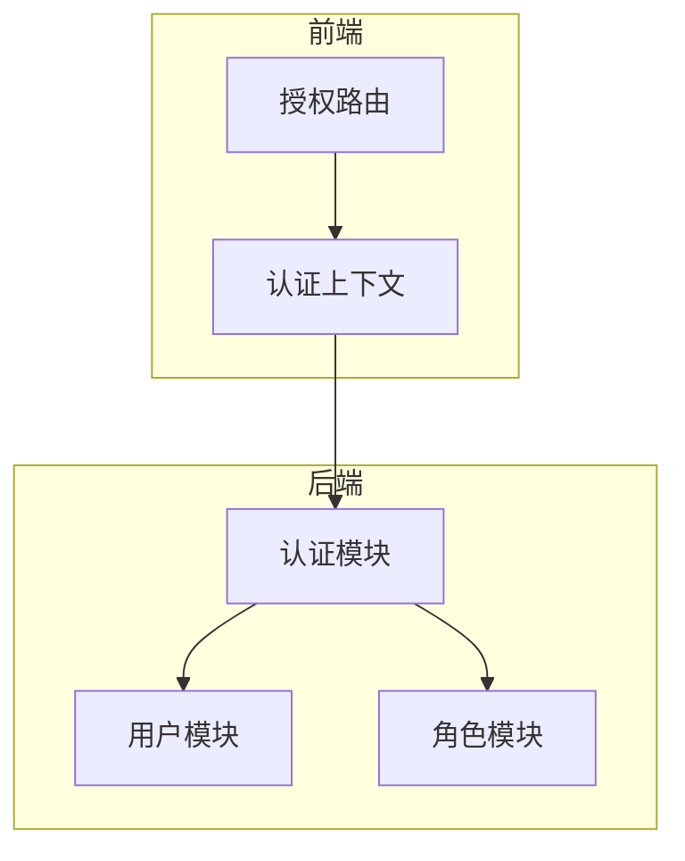
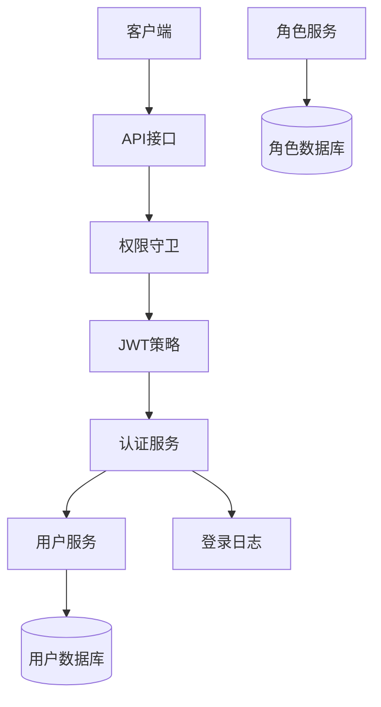
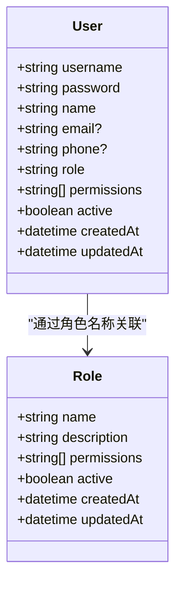
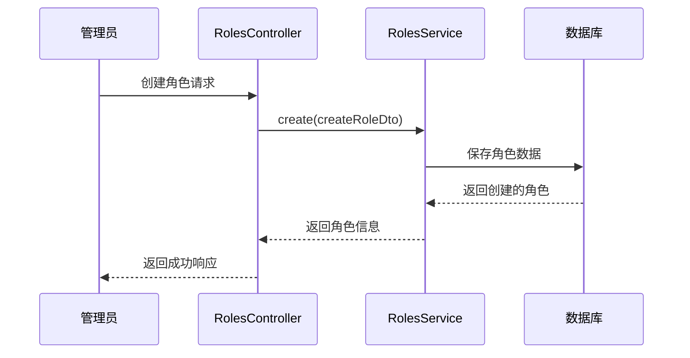
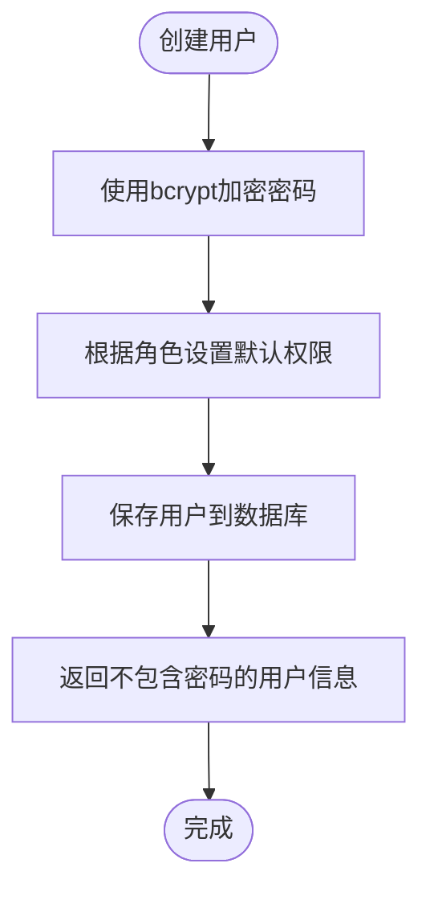
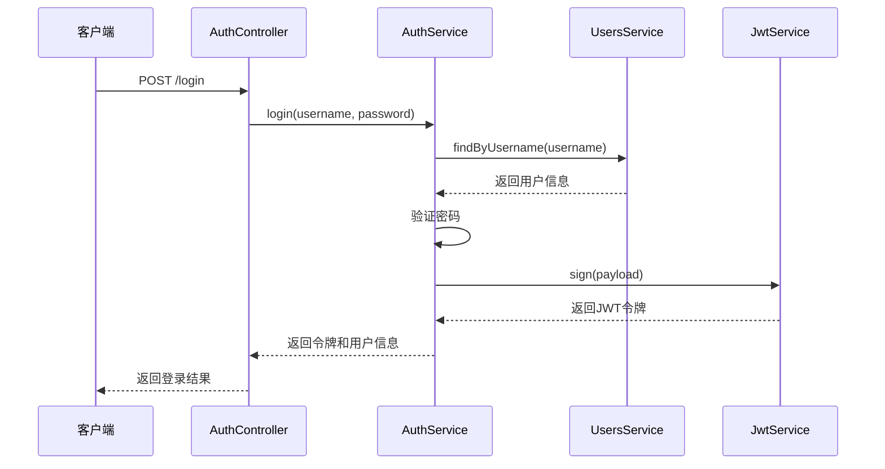
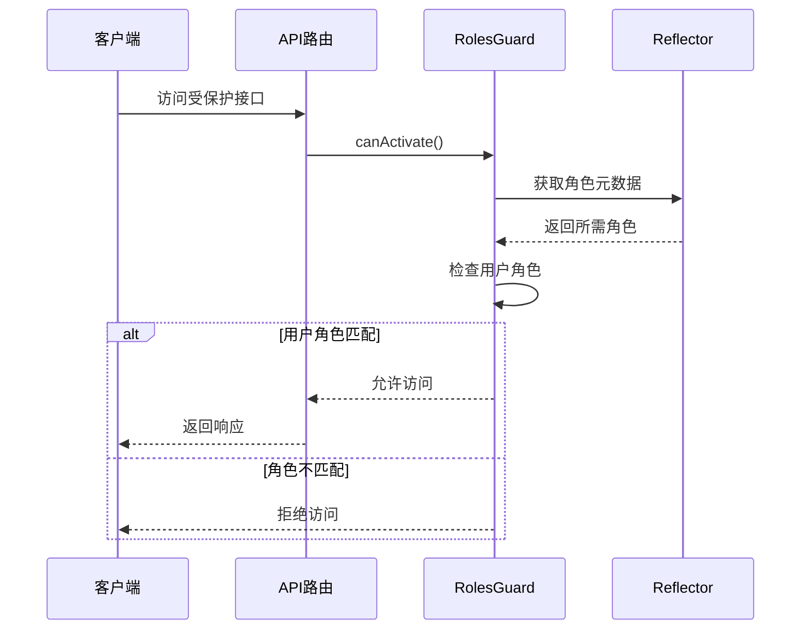
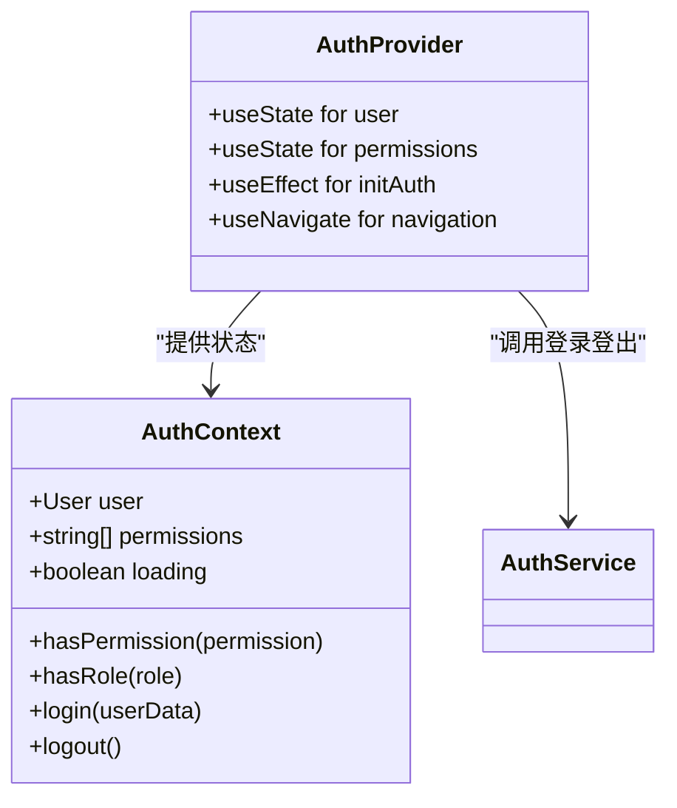
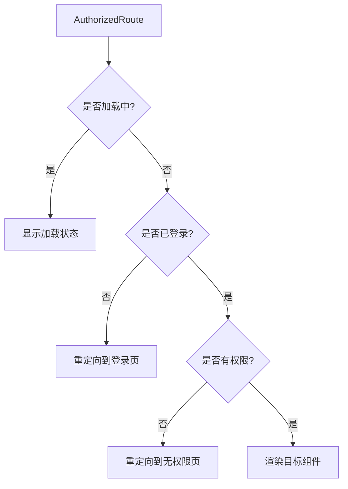
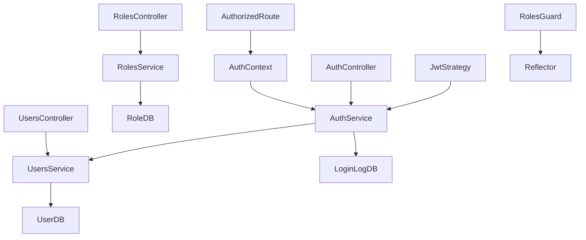

# 用户权限管理模块

<cite>
**本文档引用的文件**  
- [user.entity.ts](file://backend/src/modules/users/models/user.entity.ts)
- [role.entity.ts](file://backend/src/modules/roles/models/role.entity.ts)
- [roles.service.ts](file://backend/src/modules/roles/roles.service.ts)
- [users.service.ts](file://backend/src/modules/users/users.service.ts)
- [auth.service.ts](file://backend/src/modules/auth/auth.service.ts)
- [jwt.strategy.ts](file://backend/src/modules/auth/jwt.strategy.ts)
- [roles.guard.ts](file://backend/src/modules/auth/guards/roles.guard.ts)
- [roles.decorator.ts](file://backend/src/modules/auth/decorators/roles.decorator.ts)
- [AuthContext.tsx](file://frontend/src/contexts/AuthContext.tsx)
- [AuthorizedRoute.tsx](file://frontend/src/components/AuthorizedRoute.tsx)
- [check_permissions.js](file://check_permissions.js)
</cite>

## 目录
1. [引言](#引言)
2. [项目结构](#项目结构)
3. [核心组件](#核心组件)
4. [架构概览](#架构概览)
5. [详细组件分析](#详细组件分析)
6. [依赖分析](#依赖分析)
7. [性能考虑](#性能考虑)
8. [故障排除指南](#故障排除指南)
9. [结论](#结论)

## 引言
本文档深入剖析用户权限管理模块的RBAC（基于角色的访问控制）实现机制。详细说明用户与角色的数据模型设计、权限字段结构、认证与授权流程，以及前后端协同控制机制。通过代码级分析和可视化图表，全面揭示系统的安全控制体系。

## 项目结构
用户权限管理模块分布在后端和前端两个主要目录中，采用分层架构设计，职责清晰。

**图示来源**  
- [user.entity.ts](file://backend/src/modules/users/models/user.entity.ts)
- [role.entity.ts](file://backend/src/modules/roles/models/role.entity.ts)
- [AuthContext.tsx](file://frontend/src/contexts/AuthContext.tsx)

## 核心组件
本模块的核心组件包括用户实体、角色实体、认证服务、授权守卫和前端状态管理器。这些组件共同构建了完整的权限控制系统。

**本节来源**  
- [user.entity.ts](file://backend/src/modules/users/models/user.entity.ts#L1-L45)
- [role.entity.ts](file://backend/src/modules/roles/models/role.entity.ts#L1-L29)

## 架构概览
系统采用基于JWT的无状态认证机制，结合RBAC模型实现细粒度权限控制。整体架构分为数据层、服务层、控制层和表现层。

**图示来源**  
- [auth.service.ts](file://backend/src/modules/auth/auth.service.ts#L1-L154)
- [jwt.strategy.ts](file://backend/src/modules/auth/jwt.strategy.ts#L1-L20)
- [users.service.ts](file://backend/src/modules/users/users.service.ts#L1-L131)

## 详细组件分析

### 数据模型分析

#### 用户与角色实体关系
用户和角色通过角色名称进行关联，用户实体中存储角色名称和权限列表，实现灵活的权限分配。

**图示来源**  
- [user.entity.ts](file://backend/src/modules/users/models/user.entity.ts#L1-L45)
- [role.entity.ts](file://backend/src/modules/roles/models/role.entity.ts#L1-L29)

### 服务层逻辑分析

#### 角色管理服务
`RolesService` 负责角色的全生命周期管理，包括创建、查询、更新和删除操作，并确保系统默认角色的存在。

**图示来源**  
- [roles.service.ts](file://backend/src/modules/roles/roles.service.ts#L1-L132)

#### 用户管理服务
`UsersService` 处理用户账户的创建、更新和查询，自动为不同角色分配默认权限，并使用bcrypt加密存储密码。

**图示来源**  
- [users.service.ts](file://backend/src/modules/users/users.service.ts#L1-L131)

### 认证与授权流程

#### JWT认证流程
系统使用JWT实现无状态认证，通过`AuthService`签发令牌，`JwtStrategy`验证令牌有效性。

**图示来源**  
- [auth.service.ts](file://backend/src/modules/auth/auth.service.ts#L1-L154)
- [jwt.strategy.ts](file://backend/src/modules/auth/jwt.strategy.ts#L1-L20)

#### 接口权限控制流程
通过`RolesGuard`和`Roles`装饰器实现接口级别的角色权限控制，确保只有授权用户才能访问特定接口。

**图示来源**  
- [roles.guard.ts](file://backend/src/modules/auth/guards/roles.guard.ts#L1-L16)
- [roles.decorator.ts](file://backend/src/modules/auth/decorators/roles.decorator.ts#L1-L2)

### 前端权限管理

#### 认证上下文管理
`AuthContext` 使用React Context API管理全局登录状态和权限信息，提供便捷的权限检查方法。

**图示来源**  
- [AuthContext.tsx](file://frontend/src/contexts/AuthContext.tsx#L1-L121)

#### 授权路由控制
`AuthorizedRoute` 组件根据用户权限和角色决定是否渲染特定路由，实现前端路由级别的访问控制。

**图示来源**  
- [AuthorizedRoute.tsx](file://frontend/src/components/AuthorizedRoute.tsx#L1-L69)

## 依赖分析
权限管理模块各组件之间存在明确的依赖关系，形成清晰的调用链路。

**图示来源**  
- [auth.service.ts](file://backend/src/modules/auth/auth.service.ts#L1-L154)
- [users.service.ts](file://backend/src/modules/users/users.service.ts#L1-L131)
- [roles.service.ts](file://backend/src/modules/roles/roles.service.ts#L1-L132)

## 性能考虑
系统在权限管理方面进行了多项优化：
- 使用Mongoose的`lean()`方法提高查询性能，直接返回普通JavaScript对象
- 在用户服务中使用`select('-password')`避免返回敏感信息
- 登录尝试限制机制防止暴力破解攻击
- 默认角色预加载减少数据库查询次数

## 故障排除指南

### 常见权限问题及解决方案
1. **越权访问问题**
   - 确保所有敏感接口都使用`@Roles()`装饰器进行保护
   - 定期审计权限配置，使用`check_permissions.js`脚本验证

2. **JWT令牌验证失败**
   - 检查`JWT_SECRET`环境变量是否正确配置
   - 确认客户端在请求头中正确传递Bearer令牌

3. **角色权限不生效**
   - 检查`RolesGuard`是否正确注册为全局守卫
   - 验证用户实体中的角色字段与守卫中定义的角色是否匹配

**本节来源**  
- [check_permissions.js](file://check_permissions.js#L1-L165)
- [roles.guard.ts](file://backend/src/modules/auth/guards/roles.guard.ts#L1-L16)

## 结论
本用户权限管理模块采用成熟的RBAC模型，结合JWT认证机制，实现了安全、灵活的访问控制。通过前后端协同工作，既保证了接口级别的安全性，又提供了良好的用户体验。建议遵循最小权限原则配置角色权限，并定期进行权限审计以确保系统安全。