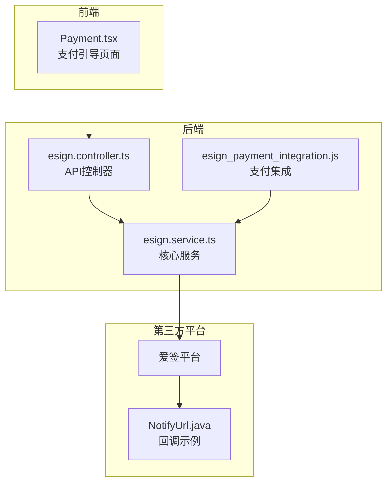
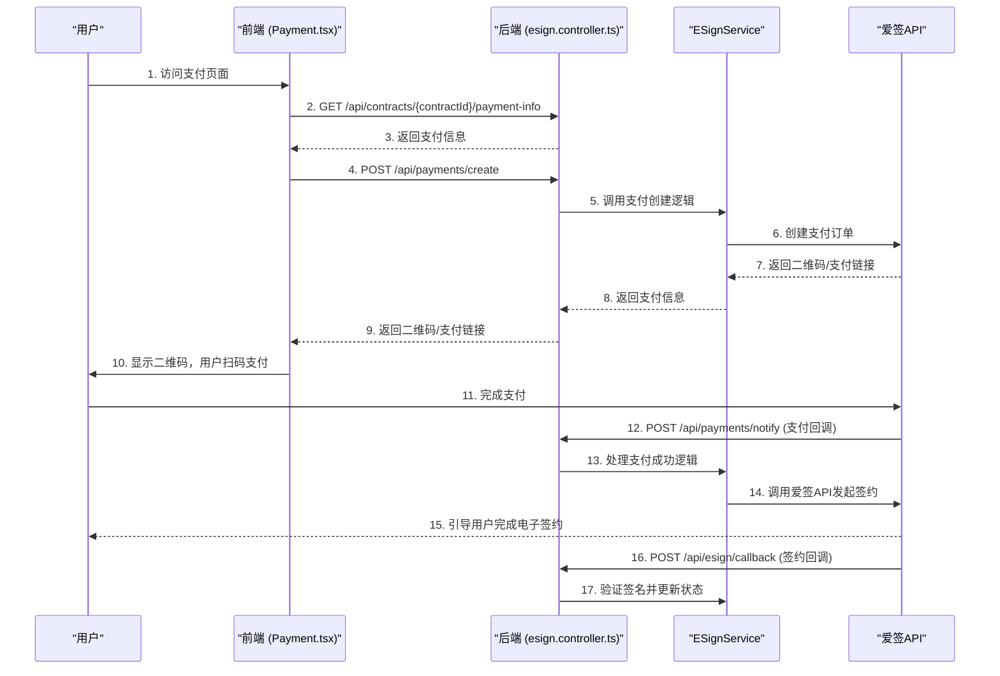
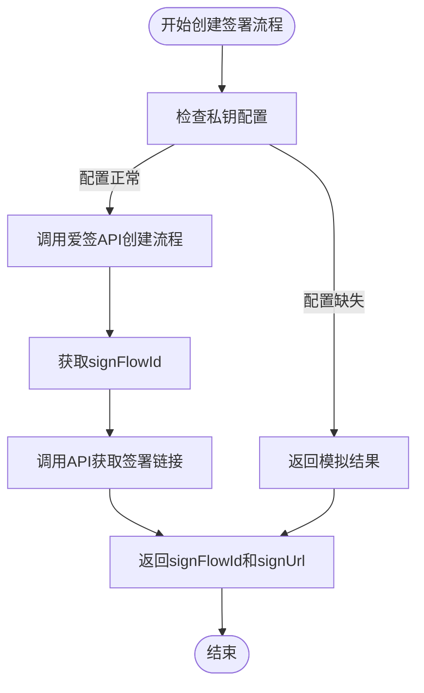
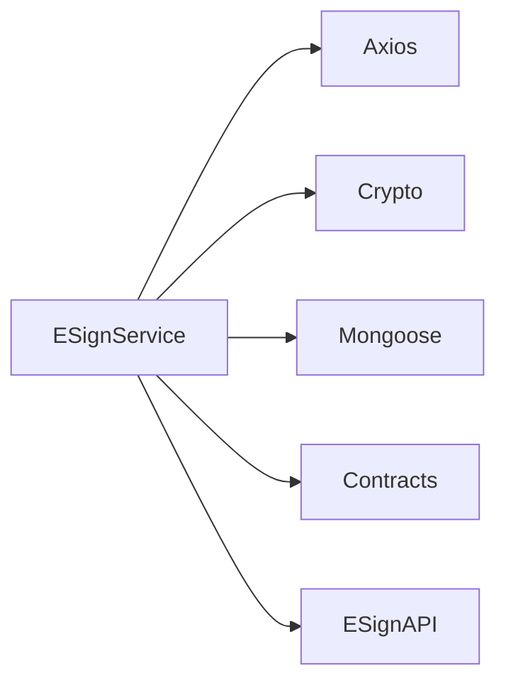

# 电子签约模块

<cite>
**本文档引用的文件**
- [esign.service.ts](file://backend/src/modules/esign/esign.service.ts)
- [esign.controller.ts](file://backend/src/modules/esign/esign.controller.ts)
- [Payment.tsx](file://frontend/src/pages/Payment.tsx)
- [esign_payment_integration.js](file://backend/esign_payment_integration.js)
- [NotifyUrl.java](file://爱签SDK/demo/src/main/java/controller/NotifyUrl.java)
- [test_api_with_auth.js](file://test_api_with_auth.js)
</cite>

## 目录
1. [项目结构](#项目结构)
2. [核心组件](#核心组件)
3. [架构概览](#架构概览)
4. [详细组件分析](#详细组件分析)
5. [依赖分析](#依赖分析)
6. [性能考量](#性能考量)
7. [故障排除指南](#故障排除指南)
8. [结论](#结论)

## 项目结构
电子签约模块是系统中的一个关键功能，它与爱签平台深度集成，实现了合同的电子化签署。该模块的代码结构清晰，遵循了典型的后端（NestJS）和前端（React）分离的架构。

后端代码位于 `backend/src/modules/esign` 目录下，主要由三个文件构成：
*   **`esign.service.ts`**: 核心业务逻辑文件，封装了与爱签SDK的所有交互，包括创建签署流程、查询状态、处理回调等。
*   **`esign.controller.ts`**: API控制器，定义了供前端调用的RESTful端点。
*   **`esign.module.ts`**: 模块定义文件，负责将服务和控制器组织在一起。

前端代码位于 `frontend/src/pages/Payment.tsx`，是一个独立的支付页面组件，负责引导用户完成支付流程。此外，`backend/` 目录下还存在 `esign_payment_integration.js` 文件，它定义了支付与签约联动的API路由。爱签SDK的Java示例代码 `NotifyUrl.java` 则展示了回调通知的处理逻辑。

**图源**
- [esign.service.ts](file://backend/src/modules/esign/esign.service.ts)
- [esign.controller.ts](file://backend/src/modules/esign/esign.controller.ts)
- [Payment.tsx](file://frontend/src/pages/Payment.tsx)
- [esign_payment_integration.js](file://backend/esign_payment_integration.js)
- [NotifyUrl.java](file://爱签SDK/demo/src/main/java/controller/NotifyUrl.java)

## 核心组件
本模块的核心组件是 `ESignService`，它作为系统与爱签平台之间的桥梁。该服务通过 `axios` 库发起HTTP请求，调用爱签的OpenAPI接口。其主要职责包括：
*   **配置管理**: 从环境变量中读取 `appId`、`privateKey`、`publicKey` 等关键配置。
*   **API调用**: 封装了创建签署流程、查询状态、下载文档等核心功能。
*   **安全验证**: 实现了回调通知的签名验证，确保数据来源的可靠性。
*   **错误处理**: 对API调用过程中的异常进行捕获和处理，提供清晰的错误信息。

前端的 `Payment` 组件是用户交互的入口，它通过调用后端API，实现了从支付到签约的无缝衔接。

**节源**
- [esign.service.ts](file://backend/src/modules/esign/esign.service.ts)
- [Payment.tsx](file://frontend/src/pages/Payment.tsx)

## 架构概览
整个电子签约模块的架构遵循了分层设计原则，确保了业务逻辑的清晰和可维护性。

**图源**
- [esign.service.ts](file://backend/src/modules/esign/esign.service.ts)
- [esign.controller.ts](file://backend/src/modules/esign/esign.controller.ts)
- [Payment.tsx](file://frontend/src/pages/Payment.tsx)
- [esign_payment_integration.js](file://backend/esign_payment_integration.js)

## 详细组件分析
### ESignService 分析
`ESignService` 是整个模块的引擎，其内部通过一系列方法实现了与爱签平台的交互。

#### 创建签署流程
`createSignFlow` 方法是发起签约的核心。它接收一个包含合同信息和签署人列表的 `signRequest` 对象，然后调用爱签的 `/v1/signflows` 接口创建签署流程。成功后，会立即调用 `/v1/signflows/{signFlowId}/signers/signUrl` 接口获取第一个签署人的签署链接。

**图源**
- [esign.service.ts](file://backend/src/modules/esign/esign.service.ts#L250-L319)

**节源**
- [esign.service.ts](file://backend/src/modules/esign/esign.service.ts#L250-L319)

#### 查询签署状态
`getSignFlowStatus` 方法用于查询指定签署流程的当前状态。它通过 `signFlowId` 调用爱签的 `/v1/signflows/{signFlowId}` 接口，并返回包含状态和文档信息的响应。

**节源**
- [esign.service.ts](file://backend/src/modules/esign/esign.service.ts#L324-L357)

#### 下载已签署文档
`downloadSignedDocument` 方法用于获取已签署合同的下载链接。它通过 `signFlowId` 和 `documentId` 调用爱签的 `/v1/signflows/{signFlowId}/documents/{documentId}/downloadUrl` 接口。

**节源**
- [esign.service.ts](file://backend/src/modules/esign/esign.service.ts#L362-L385)

#### 验证回调签名
`verifyCallback` 方法是确保系统安全的关键。当爱签平台推送状态变更通知时，此方法会使用爱签提供的公钥，对请求中的 `signature`、`timestamp` 和 `body` 进行RSA-SHA256签名验证，以确认通知的真实性。

**节源**
- [esign.service.ts](file://backend/src/modules/esign/esign.service.ts#L390-L406)

### ESignController 分析
`ESignController` 将 `ESignService` 的功能暴露为REST API。

#### 暴露创建合同流程
`createContractFlow` 方法是一个POST端点，它接收前端传来的合同数据，生成一个唯一的 `contractNo`，然后调用 `esignService.createCompleteContractFlow` 方法。该方法处理了从创建合同到获取签署链接的完整流程，并将结果返回给前端。

**节源**
- [esign.controller.ts](file://backend/src/modules/esign/esign.controller.ts#L340-L399)

#### 暴露查询合同状态
`getContractStatus` 方法是一个GET端点，它接收 `contractNo` 作为路径参数。该方法调用 `esignService.getContractStatus` 查询状态，并对爱签API返回的特定错误码（如100056, 100066）进行友好化处理，方便前端展示。

**节源**
- [esign.controller.ts](file://backend/src/modules/esign/esign.controller.ts#L591-L650)

### Payment 组件分析
`Payment` 组件是用户完成支付的界面。其核心逻辑在 `handlePayment` 函数中：
1.  调用 `/api/payments/create` 创建支付订单。
2.  根据支付方式，显示二维码（微信/支付宝）或跳转到银行支付页面。
3.  启动轮询，通过 `/api/payments/{paymentId}/status` 接口查询支付状态。
4.  支付成功后，跳转到结果页面。

**节源**
- [Payment.tsx](file://frontend/src/pages/Payment.tsx#L100-L180)

### 支付与签约联动机制分析
`esign_payment_integration.js` 文件定义了 `create-contract-with-payment` 路由，这是实现支付与签约联动的关键。其流程如下：
1.  创建爱签合同，并设置 `redirectUrl` 为支付引导页面。
2.  将合同信息保存到数据库。
3.  当爱签回调通知合同已签署（`status === '2'`）时，系统会引导用户跳转到支付页面。
4.  支付成功后，通过 `/payments/notify` 回调更新合同的支付状态，并触发后续业务逻辑（如分配服务人员）。

**节源**
- [esign_payment_integration.js](file://backend/esign_payment_integration.js#L30)

### 回调通知处理分析
`NotifyUrl.java` 文件是爱签SDK提供的回调处理示例。`notify` 方法接收来自爱签的POST请求，其中包含 `action`、`contractNo`、`status` 等参数。其核心是 `rsaEncrypt.doCheck` 方法，用于验证 `sign` 签名的有效性，确保回调请求来自爱签官方，防止伪造。

**节源**
- [NotifyUrl.java](file://爱签SDK/demo/src/main/java/controller/NotifyUrl.java#L20-L50)

### 调试指南
`test_api_with_auth.js` 文件提供了一个完整的调试脚本。它通过以下步骤验证接口连通性：
1.  尝试使用预设的凭据登录，获取认证 `token`。
2.  调用 `makeAuthenticatedRequest` 函数，使用 `token` 发起带认证的API请求。
3.  输出请求和响应的详细信息，便于排查问题。
4.  通过直接查询数据库来验证API功能是否按预期工作。

**节源**
- [test_api_with_auth.js](file://test_api_with_auth.js#L100-L150)

## 依赖分析
该模块的依赖关系清晰，主要依赖于：
*   **外部服务**: 爱签平台（核心依赖）。
*   **内部模块**: 合同管理模块（`contracts`），用于存储和查询合同数据。
*   **第三方库**: `axios`（HTTP客户端），`crypto`（加密签名），`mongoose`（数据库操作）。

**图源**
- [esign.service.ts](file://backend/src/modules/esign/esign.service.ts)
- [go.mod](file://backend/package.json)

## 性能考量
*   **API调用**: 所有与爱签的API调用都设置了30秒的超时，防止长时间阻塞。
*   **轮询机制**: 前端通过轮询查询支付状态，间隔为2秒，5分钟后停止，避免了不必要的请求。
*   **日志记录**: 服务中包含了详细的日志，便于监控和性能分析。

## 故障排除指南
*   **API连接失败**: 检查 `ESIGN_APP_ID`、`ESIGN_PRIVATE_KEY` 等环境变量是否正确配置。
*   **回调验证失败**: 确保 `ESIGN_PUBLIC_KEY` 与爱签平台提供的公钥完全一致。
*   **支付不跳转**: 检查 `esign_payment_integration.js` 中的 `redirectUrl` 是否正确。
*   **状态查询错误**: 参考 `getContractStatus` 方法中的错误码映射表进行排查。

**节源**
- [esign.service.ts](file://backend/src/modules/esign/esign.service.ts)
- [esign.controller.ts](file://backend/src/modules/esign/esign.controller.ts)

## 结论
电子签约模块通过 `ESignService` 与爱签平台实现了深度集成，提供了从创建合同、发起签约、状态查询到文档下载的完整功能。通过 `esign.controller.ts` 暴露的REST API，前端 `Payment` 组件能够无缝引导用户完成“支付-签约”的业务流程。`esign_payment_integration.js` 和 `NotifyUrl.java` 确保了支付与签约的联动以及回调通知的安全性。整体架构设计合理，代码结构清晰，具备良好的可维护性和扩展性。