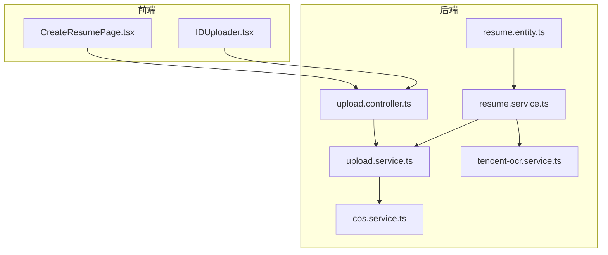
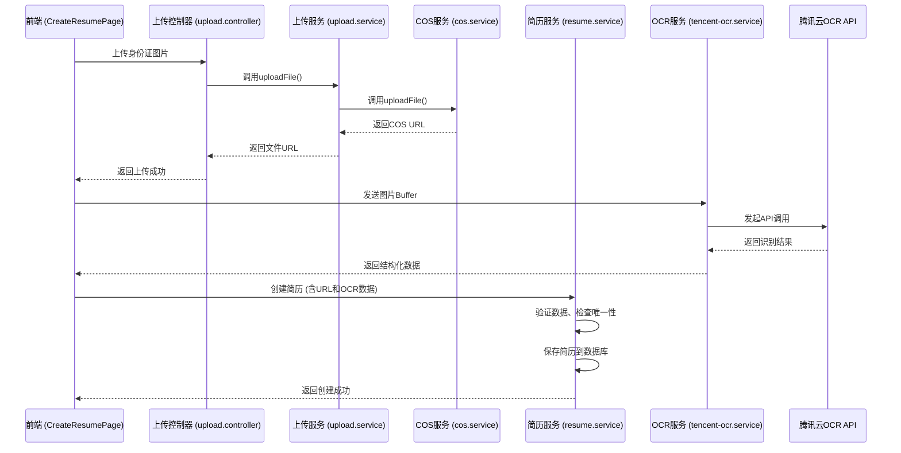
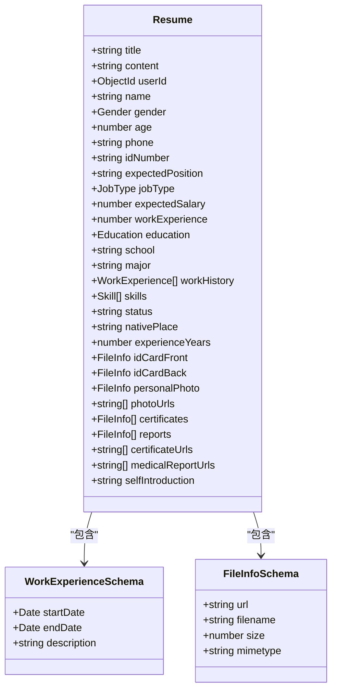
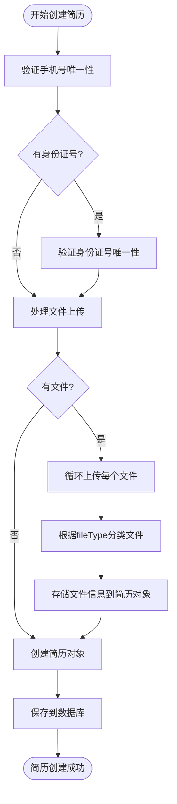
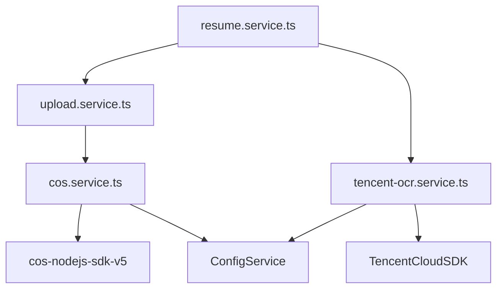

# 简历管理模块

<cite>
**本文档引用的文件**
- [resume.entity.ts](file://backend/src/modules/resume/models/resume.entity.ts)
- [work-experience.schema.ts](file://backend/src/modules/resume/models/work-experience.schema.ts)
- [file-info.schema.ts](file://backend/src/modules/resume/models/file-info.schema.ts)
- [resume.service.ts](file://backend/src/modules/resume/resume.service.ts)
- [tencent-ocr.service.ts](file://backend/src/modules/ocr/tencent-ocr.service.ts)
- [upload.controller.ts](file://backend/src/modules/upload/upload.controller.ts)
- [cos.service.ts](file://backend/src/modules/upload/cos.service.ts)
- [CreateResumePage.tsx](file://frontend/src/pages/resume/CreateResumePage.tsx)
- [create-resume.dto.ts](file://backend/src/modules/resume/dto/create-resume.dto.ts)
- [resume.controller.ts](file://backend/src/modules/resume/resume.controller.ts)
</cite>

## 更新摘要
**变更内容**
- 新增了对简历中“自我介绍”字段的支持，已在领域模型、DTO和前后端流程中实现。
- 为小程序创建简历的场景增加了专用API接口`/resumes/miniprogram/create`，支持幂等性处理和数据去重。
- 更新了`CreateResumeV2Dto`以包含`selfIntroduction`字段，并增强了数据规范化和校验逻辑。
- 相关的文档部分已更新以反映这些变更。

## 目录
1. [简介](#简介)
2. [项目结构](#项目结构)
3. [核心组件](#核心组件)
4. [架构概览](#架构概览)
5. [详细组件分析](#详细组件分析)
6. [依赖分析](#依赖分析)
7. [性能考量](#性能考量)
8. [故障排除指南](#故障排除指南)
9. [结论](#结论)

## 简介
本技术文档全面解析了“简历管理模块”的功能实现，涵盖阿姨简历的创建、编辑、OCR识别与文件存储的全流程。文档详细阐述了领域模型设计、业务逻辑、API集成、文件处理机制以及前后端协同工作流程。通过深入分析`resume.entity.ts`中的数据结构、`resume.service.ts`中的业务逻辑、`tencent-ocr.service.ts`的OCR服务集成，以及`upload.controller.ts`和`cos.service.ts`的文件上传与存储流程，为开发者和维护者提供了完整的系统视图。同时，文档结合前端`CreateResumePage.tsx`组件，说明了多步骤表单的设计与状态管理，确保了数据的一致性和用户体验。本次更新重点说明了新增的“自我介绍”功能和为小程序优化的简历创建API。

## 项目结构
简历管理模块是整个系统的核心功能之一，其代码结构遵循了清晰的分层设计。后端代码位于`backend/src/modules/resume`目录下，采用NestJS框架的模块化组织方式。核心领域模型`resume.entity.ts`定义了简历的完整数据结构，而`dto`目录下的`create-resume.dto.ts`和`update-resume.dto.ts`则定义了数据传输对象。业务逻辑由`resume.service.ts`实现，它依赖于`upload.service.ts`进行文件操作，并通过`ocr`模块与腾讯OCR服务进行交互。文件上传的入口点是`upload.controller.ts`，它将请求转发给`cos.service.ts`，后者负责与腾讯云对象存储（COS）进行实际的通信。

**图示来源**
- [resume.entity.ts](file://backend/src/modules/resume/models/resume.entity.ts)
- [resume.service.ts](file://backend/src/modules/resume/resume.service.ts)
- [tencent-ocr.service.ts](file://backend/src/modules/ocr/tencent-ocr.service.ts)
- [upload.controller.ts](file://backend/src/modules/upload/upload.controller.ts)
- [cos.service.ts](file://backend/src/modules/upload/cos.service.ts)
- [CreateResumePage.tsx](file://frontend/src/pages/resume/CreateResumePage.tsx)

**本节来源**
- [resume.entity.ts](file://backend/src/modules/resume/models/resume.entity.ts)
- [resume.service.ts](file://backend/src/modules/resume/resume.service.ts)
- [upload.controller.ts](file://backend/src/modules/upload/upload.controller.ts)

## 核心组件
简历管理模块的核心在于其领域模型设计和业务逻辑的实现。`resume.entity.ts`文件定义了`Resume`类，它继承自Mongoose的`Document`，并使用`@Schema`和`@Prop`装饰器来映射数据库结构。该模型不仅包含了阿姨的基本信息（如姓名、性别、年龄、电话），还嵌套了复杂的数据结构，如工作经历（`workExperiences`）和文件元数据（`idCardFront`, `personalPhoto`等）。`resume.service.ts`是业务逻辑的中心，它实现了简历的创建、更新、查询和删除等核心功能，并处理了与文件上传和OCR识别的协同流程。

**本节来源**
- [resume.entity.ts](file://backend/src/modules/resume/models/resume.entity.ts#L0-L277)
- [resume.service.ts](file://backend/src/modules/resume/resume.service.ts#L0-L1083)

## 架构概览
该模块的架构是一个典型的分层架构，从前端用户界面到后端服务，再到外部API和云存储。前端通过HTTP请求与后端的`upload.controller.ts`和`resume.service.ts`进行交互。`resume.service.ts`作为业务逻辑的协调者，调用`upload.service.ts`来处理文件，调用`tencent-ocr.service.ts`来处理OCR识别。`upload.service.ts`则作为`cos.service.ts`的封装，后者直接与腾讯云COS进行API调用。这种分层设计确保了关注点分离，使得代码更易于维护和测试。

**图示来源**
- [resume.service.ts](file://backend/src/modules/resume/resume.service.ts#L0-L1083)
- [tencent-ocr.service.ts](file://backend/src/modules/ocr/tencent-ocr.service.ts#L0-L192)
- [upload.controller.ts](file://backend/src/modules/upload/upload.controller.ts#L0-L171)
- [cos.service.ts](file://backend/src/modules/upload/cos.service.ts#L0-L212)
- [CreateResumePage.tsx](file://frontend/src/pages/resume/CreateResumePage.tsx)

## 详细组件分析
本节将深入分析简历管理模块的各个关键组件，包括其数据结构、业务逻辑和交互流程。

### 领域模型分析
`resume.entity.ts`文件定义了简历的领域模型，它是一个复杂的嵌套文档结构。该模型使用Mongoose的Schema来定义数据结构，并通过`@Prop`装饰器进行配置。**本次更新中，模型已扩展以支持“自我介绍”功能**。在`IResume`接口和`Resume`类中，新增了`selfIntroduction`字段，其类型为可选的字符串（`string?`），并使用`@Prop({ nullable: true })`装饰器标记为数据库中的可空字段。该字段用于存储阿姨的个性化描述，丰富了简历内容。

**图示来源**
- [resume.entity.ts](file://backend/src/modules/resume/models/resume.entity.ts#L0-L277)
- [work-experience.schema.ts](file://backend/src/modules/resume/models/work-experience.schema.ts#L0-L18)
- [file-info.schema.ts](file://backend/src/modules/resume/models/file-info.schema.ts#L0-L21)

**本节来源**
- [resume.entity.ts](file://backend/src/modules/resume/models/resume.entity.ts#L0-L277)

### 业务逻辑分析
`resume.service.ts`文件是简历业务逻辑的核心。`createWithFiles`方法负责简历的创建流程。它首先验证手机号和身份证号的唯一性，然后调用`uploadService.uploadFile`上传所有关联文件。文件上传成功后，会根据`fileTypes`参数将文件信息分类存储到简历对象的相应字段中（如`idCardFront`, `photoUrls`等）。最后，简历数据被保存到MongoDB数据库。该方法还实现了错误处理，确保即使部分文件上传失败，简历主体也能被创建。

**图示来源**
- [resume.service.ts](file://backend/src/modules/resume/resume.service.ts#L0-L1083)

**本节来源**
- [resume.service.ts](file://backend/src/modules/resume/resume.service.ts#L0-L1083)

### OCR服务分析
`tencent-ocr.service.ts`封装了与腾讯云OCR API的交互。`idCardFront`方法是其核心，它接收一个图片Buffer，将其转换为Base64字符串，然后通过`retry`库发起带重试机制的API调用。该方法实现了完整的错误处理和数据验证流程：首先检查API返回的错误，然后验证识别结果是否包含所有必要字段（如姓名、性别、身份证号），最后验证身份证号的格式是否正确。如果所有验证通过，它会将腾讯云的响应格式转换为一个统一的格式，以便前端使用。该服务还集成了`OcrMetricsService`来记录请求、成功、失败和处理时间等性能指标。

**本节来源**
- [tencent-ocr.service.ts](file://backend/src/modules/ocr/tencent-ocr.service.ts#L0-L192)

### 文件上传流程分析
文件上传流程始于`upload.controller.ts`的`uploadFile`端点。该控制器使用`FileInterceptor`拦截上传的文件，并通过`ParseFilePipe`进行验证（文件大小不超过5MB，类型为jpg、jpeg、png或pdf）。验证通过后，请求被转发给`upload.service.ts`的`uploadFile`方法。该服务调用`cos.service.ts`的`generateFileKey`方法生成一个唯一的文件存储路径（如`idCardFront/1700000000-abc123.jpg`），然后调用`cos.service.ts`的`uploadFile`方法将文件Buffer上传到腾讯云COS。上传成功后，`cos.service.ts`返回一个完整的COS URL（如`https://bucket.cos.ap-guangzhou.myqcloud.com/idCardFront/1700000000-abc123.jpg`），该URL最终被返回给前端，用于在简历中引用该文件。

**本节来源**
- [upload.controller.ts](file://backend/src/modules/upload/upload.controller.ts#L0-L171)
- [upload.service.ts](file://backend/src/modules/upload/upload.service.ts#L0-L93)
- [cos.service.ts](file://backend/src/modules/upload/cos.service.ts#L0-L212)

### 前端组件分析
`CreateResumePage.tsx`是简历创建的前端入口，它实现了一个多步骤表单。该组件使用React的状态管理来跟踪表单数据。当用户上传身份证正面图片时，会触发一个流程：首先调用`upload.service`将图片上传到服务器并获取COS URL，然后将图片Buffer发送到`tencent-ocr.service`进行识别。OCR识别成功后，返回的结构化数据（如姓名、身份证号）会自动填充到表单的相应字段中，极大地提升了用户体验。用户可以对自动填充的数据进行手动修正，然后继续填写其他信息，最终提交完整的简历数据。

**本节来源**
- [CreateResumePage.tsx](file://frontend/src/pages/resume/CreateResumePage.tsx)

## 依赖分析
该模块的依赖关系清晰，遵循了依赖倒置原则。`resume.service.ts`依赖于`upload.service.ts`和`tencent-ocr.service.ts`的抽象接口，而不是具体的实现。`upload.service.ts`又依赖于`cos.service.ts`。`cos.service.ts`依赖于外部的`cos-nodejs-sdk-v5`包和`configService`来获取配置。`tencent-ocr.service.ts`依赖于`TencentCloudSDK`包。这种依赖结构使得模块易于进行单元测试，因为可以轻松地用模拟对象（mocks）替换这些服务。

**图示来源**
- [resume.service.ts](file://backend/src/modules/resume/resume.service.ts#L0-L1083)
- [upload.service.ts](file://backend/src/modules/upload/upload.service.ts#L0-L93)
- [cos.service.ts](file://backend/src/modules/upload/cos.service.ts#L0-L212)
- [tencent-ocr.service.ts](file://backend/src/modules/ocr/tencent-ocr.service.ts#L0-L192)

**本节来源**
- [resume.service.ts](file://backend/src/modules/resume/resume.service.ts#L0-L1083)
- [upload.service.ts](file://backend/src/modules/upload/upload.service.ts#L0-L93)
- [cos.service.ts](file://backend/src/modules/upload/cos.service.ts#L0-L212)

## 性能考量
该模块在性能方面做了多项优化。`resume.service.ts`中的`findAll`方法使用了`lean()`查询，这可以显著提高查询性能，因为它返回的是普通JavaScript对象而不是Mongoose文档。文件上传和OCR识别都是耗时操作，因此它们被设计为异步执行。`tencent-ocr.service.ts`实现了重试机制（最多3次），以应对网络波动或API临时不可用的情况，提高了系统的健壮性。`cos.service.ts`通过直接返回COS的签名URL来提供文件访问，避免了后端服务器作为文件传输的中转站，从而减轻了服务器的负载。

## 故障排除指南
当遇到问题时，可以按照以下步骤进行排查：
1.  **文件上传失败**：检查`upload.controller.ts`的日志，确认文件是否通过了大小和类型验证。检查`cos.service.ts`的日志，确认COS的SecretId和SecretKey配置是否正确。
2.  **OCR识别失败**：检查`tencent-ocr.service.ts`的日志，确认API调用是否成功。检查返回的`risk_info`字段，了解是否存在图片质量问题。确认图片Buffer是否正确传递。
3.  **简历创建失败**：检查`resume.service.ts`的日志，最常见的原因是手机号或身份证号重复。确保`idNumber`字段的稀疏唯一索引已正确创建。
4.  **文件无法访问**：检查`upload.service.ts`的`getFile`方法，确认传入的`fileUrl`是否是完整的COS URL。检查`cos.service.ts`的`getSignedUrl`方法，确认签名URL的生成是否成功。

**本节来源**
- [resume.service.ts](file://backend/src/modules/resume/resume.service.ts#L0-L1083)
- [tencent-ocr.service.ts](file://backend/src/modules/ocr/tencent-ocr.service.ts#L0-L192)
- [upload.service.ts](file://backend/src/modules/upload/upload.service.ts#L0-L93)
- [cos.service.ts](file://backend/src/modules/upload/cos.service.ts#L0-L212)

## 结论
简历管理模块通过一个设计精良、职责分明的架构，实现了从简历创建到文件存储的完整闭环。其核心优势在于将复杂的业务逻辑（如数据验证、唯一性检查）、外部服务集成（如腾讯OCR）和云存储操作（如COS）进行了清晰的分层和解耦。通过自动化的OCR识别，系统极大地提升了数据录入的效率和准确性。整个流程从用户上传身份证图片开始，经过后端服务的协调，最终将结构化数据和文件URL持久化到数据库和云存储中，为后续的阿姨管理和客户匹配提供了坚实的数据基础。该模块的设计充分考虑了可维护性、性能和健壮性，是一个成功的后端服务实现案例。