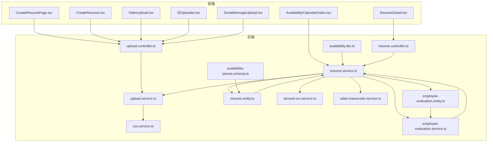
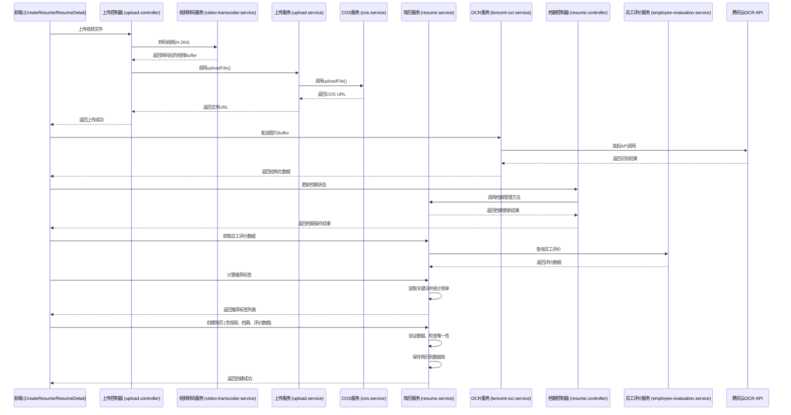
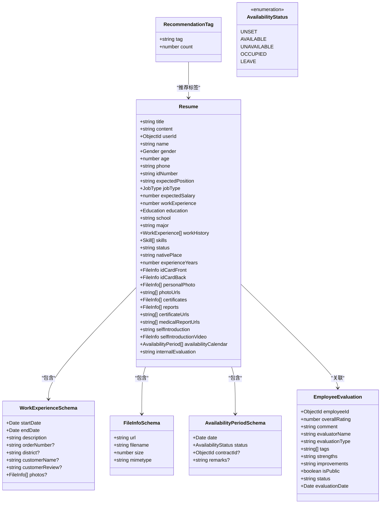
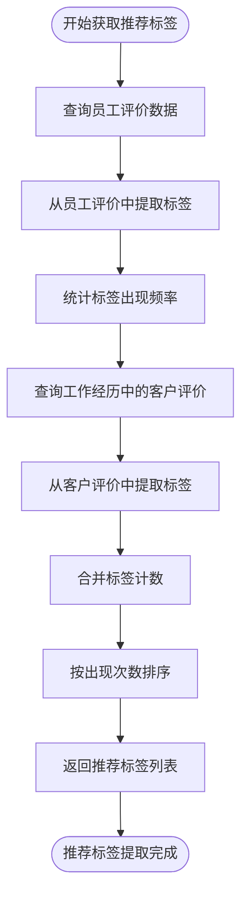
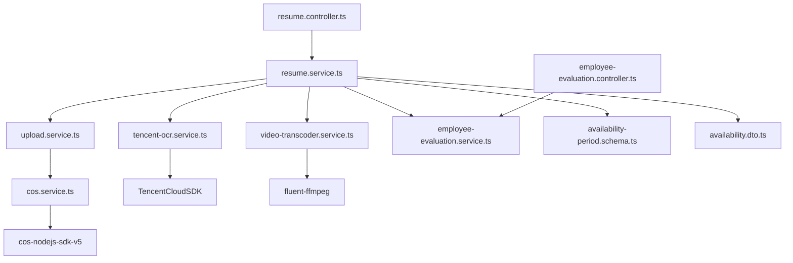

# 简历管理模块

<cite>
**本文档引用的文件**
- [resume.entity.ts](file://backend/src/modules/resume/models/resume.entity.ts)
- [work-experience.schema.ts](file://backend/src/modules/resume/models/work-experience.schema.ts)
- [file-info.schema.ts](file://backend/src/modules/resume/models/file-info.schema.ts)
- [availability-period.schema.ts](file://backend/src/modules/resume/models/availability-period.schema.ts)
- [resume.service.ts](file://backend/src/modules/resume/resume.service.ts)
- [resume.controller.ts](file://backend/src/modules/resume/resume.controller.ts)
- [tencent-ocr.service.ts](file://backend/src/modules/ocr/tencent-ocr.service.ts)
- [upload.controller.ts](file://backend/src/modules/upload/upload.controller.ts)
- [cos.service.ts](file://backend/src/modules/upload/cos.service.ts)
- [video-transcoder.service.ts](file://backend/src/modules/upload/video-transcoder.service.ts)
- [employee-evaluation.entity.ts](file://backend/src/modules/employee-evaluation/models/employee-evaluation.entity.ts)
- [employee-evaluation.service.ts](file://backend/src/modules/employee-evaluation/employee-evaluation.service.ts)
- [CreateResumePage.tsx](file://frontend/src/pages/resume/CreateResumePage.tsx)
- [CreateResume.tsx](file://frontend/src/pages/aunt/CreateResume.tsx)
- [ResumeDetail.tsx](file://frontend/src/pages/aunt/ResumeDetail.tsx)
- [VideoUpload.tsx](file://frontend/src/components/VideoUpload.tsx)
- [AvailabilityCalendar/index.tsx](file://frontend/src/components/AvailabilityCalendar/index.tsx)
- [upload.ts](file://frontend/src/constants/upload.ts)
- [create-resume.dto.ts](file://backend/src/modules/resume/dto/create-resume.dto.ts)
- [availability.dto.ts](file://backend/src/modules/resume/dto/availability.dto.ts)
- [resume.ts](file://frontend/src/types/resume.ts)
</cite>

## 更新摘要
**变更内容**
- 新增推荐标签提取功能，从员工评价和客户评价中智能提取关键词
- 集成员工评价系统，支持内部员工评价的创建、统计和展示
- 增强简历数据模型，新增内部评价字段和推荐标签字段
- 更新前端组件，新增推荐标签展示和员工评价管理功能

## 目录
1. [简介](#简介)
2. [项目结构](#项目结构)
3. [核心组件](#核心组件)
4. [架构概览](#架构概览)
5. [详细组件分析](#详细组件分析)
6. [依赖分析](#依赖分析)
7. [性能考量](#性能考量)
8. [故障排除指南](#故障排除指南)
9. [结论](#结论)

## 简介
本技术文档全面解析了"简历管理模块"的功能实现，涵盖阿姨简历的创建、编辑、OCR识别与文件存储的全流程。**本次更新重点新增了推荐标签提取功能、员工评价集成和增强的简历数据模型**。文档详细阐述了领域模型设计、业务逻辑、API集成、文件处理机制以及前后端协同工作流程。通过深入分析`resume.entity.ts`中的数据结构、`resume.service.ts`中的业务逻辑、`tencent-ocr.service.ts`的OCR服务集成，以及`upload.controller.ts`和`cos.service.ts`的文件上传与存储流程，为开发者和维护者提供了完整的系统视图。同时，文档结合前端`CreateResumePage.tsx`、`CreateResume.tsx`和`ResumeDetail.tsx`组件，说明了多步骤表单的设计与状态管理，确保了数据的一致性和用户体验。

**本次更新重点**：
- 新增推荐标签提取功能，智能分析评价内容生成推荐标签
- 集成员工评价系统，支持内部员工评价的创建、统计和展示
- 增强简历数据模型，新增内部评价字段和推荐标签字段
- 更新前端组件，新增推荐标签展示和员工评价管理功能

## 项目结构
简历管理模块是整个系统的核心功能之一，其代码结构遵循了清晰的分层设计。后端代码位于`backend/src/modules/resume`目录下，采用NestJS框架的模块化组织方式。核心领域模型`resume.entity.ts`定义了简历的完整数据结构，**新增了内部评价和推荐标签字段**。`dto`目录下的`create-resume.dto.ts`和`update-resume.dto.ts`定义了数据传输对象，**新增了内部评价字段**。业务逻辑由`resume.service.ts`实现，它依赖于`upload.service.ts`进行文件操作，并通过`ocr`模块与腾讯OCR服务进行交互。**新增了员工评价查询和推荐标签提取功能**。文件上传的入口点是`upload.controller.ts`，它将请求转发给`cos.service.ts`，后者负责与腾讯云对象存储（COS）进行实际的通信。新增的`video-transcoder.service.ts`提供视频转码服务，确保浏览器兼容性。

**图示来源**
- [resume.entity.ts](file://backend/src/modules/resume/models/resume.entity.ts)
- [resume.service.ts](file://backend/src/modules/resume/resume.service.ts)
- [tencent-ocr.service.ts](file://backend/src/modules/ocr/tencent-ocr.service.ts)
- [upload.controller.ts](file://backend/src/modules/upload/upload.controller.ts)
- [cos.service.ts](file://backend/src/modules/upload/cos.service.ts)
- [video-transcoder.service.ts](file://backend/src/modules/upload/video-transcoder.service.ts)
- [availability-period.schema.ts](file://backend/src/modules/resume/models/availability-period.schema.ts)
- [availability.dto.ts](file://backend/src/modules/resume/dto/availability.dto.ts)
- [employee-evaluation.entity.ts](file://backend/src/modules/employee-evaluation/models/employee-evaluation.entity.ts)
- [employee-evaluation.service.ts](file://backend/src/modules/employee-evaluation/employee-evaluation.service.ts)
- [resume.controller.ts](file://backend/src/modules/resume/resume.controller.ts)
- [CreateResumePage.tsx](file://frontend/src/pages/resume/CreateResumePage.tsx)
- [CreateResume.tsx](file://frontend/src/pages/aunt/CreateResume.tsx)
- [ResumeDetail.tsx](file://frontend/src/pages/aunt/ResumeDetail.tsx)
- [VideoUpload.tsx](file://frontend/src/components/VideoUpload.tsx)
- [AvailabilityCalendar/index.tsx](file://frontend/src/components/AvailabilityCalendar/index.tsx)

**本节来源**
- [resume.entity.ts](file://backend/src/modules/resume/models/resume.entity.ts)
- [resume.service.ts](file://backend/src/modules/resume/resume.service.ts)
- [upload.controller.ts](file://backend/src/modules/upload/upload.controller.ts)

## 核心组件
简历管理模块的核心在于其领域模型设计和业务逻辑的实现。**本次更新中，模型已扩展以支持推荐标签和员工评价功能**。`resume.entity.ts`文件定义了`Resume`类，它继承自Mongoose的`Document`，并使用`@Schema`和`@Prop`装饰器来映射数据库结构。在`IResume`接口和`Resume`类中，新增了`internalEvaluation`字段用于存储内部员工评价，以及`recommendationTags`字段用于存储推荐标签列表。`resume.service.ts`是业务逻辑的中心，它实现了简历的创建、更新、查询和删除等核心功能，并处理了与文件上传、OCR识别、档期管理和**员工评价查询**的协同流程。**新增了`getRecommendationTags`方法，用于从员工评价和客户评价中提取推荐标签**。

**本节来源**
- [resume.entity.ts](file://backend/src/modules/resume/models/resume.entity.ts#L94-L96)
- [resume.service.ts](file://backend/src/modules/resume/resume.service.ts#L2113-L2237)

## 架构概览
该模块的架构是一个典型的分层架构，从前端用户界面到后端服务，再到外部API和云存储。**本次更新中，架构已扩展以支持员工评价系统和推荐标签提取功能**。前端通过HTTP请求与后端的`upload.controller.ts`、`resume.controller.ts`和专门的档期管理接口进行交互。`resume.service.ts`作为业务逻辑的协调者，调用`upload.service.ts`来处理文件，调用`tencent-ocr.service.ts`来处理OCR识别，调用`video-transcoder.service.ts`来处理视频转码，**调用`employee-evaluation.service.ts`来查询员工评价数据**。`upload.service.ts`则作为`cos.service.ts`的封装，后者直接与腾讯云COS进行API调用。档期管理通过独立的控制器和DTO实现，提供完整的档期生命周期管理。**新增的推荐标签提取功能通过`getRecommendationTags`方法实现，从员工评价和工作经历中的客户评价中提取关键词**。这种分层设计确保了关注点分离，使得代码更易于维护和测试。

**图示来源**
- [resume.service.ts](file://backend/src/modules/resume/resume.service.ts#L2113-L2237)
- [tencent-ocr.service.ts](file://backend/src/modules/ocr/tencent-ocr.service.ts)
- [upload.controller.ts](file://backend/src/modules/upload/upload.controller.ts)
- [cos.service.ts](file://backend/src/modules/upload/cos.service.ts)
- [video-transcoder.service.ts](file://backend/src/modules/upload/video-transcoder.service.ts)
- [resume.controller.ts](file://backend/src/modules/resume/resume.controller.ts)
- [employee-evaluation.service.ts](file://backend/src/modules/employee-evaluation/employee-evaluation.service.ts)

## 详细组件分析
本节将深入分析简历管理模块的各个关键组件，包括其数据结构、业务逻辑和交互流程。

### 领域模型分析
`resume.entity.ts`文件定义了简历的领域模型，它是一个复杂的嵌套文档结构。**本次更新中，模型已扩展以支持推荐标签和员工评价功能**。在`IResume`接口和`Resume`类中，新增了`internalEvaluation`字段，其类型为可选的字符串，用于存储内部员工评价内容。新增了`recommendationTags`字段，虽然在实体中未直接定义，但在服务层和控制器中已实现相关功能。`AvailabilityPeriodSchema`定义了档期的详细结构，包含日期、状态、合同ID和备注等字段。`WorkExperienceSchema`扩展了工作经历的结构，新增了`customerReview`字段用于存储客户评价内容。

**图示来源**
- [resume.entity.ts](file://backend/src/modules/resume/models/resume.entity.ts#L39-L97)
- [work-experience.schema.ts](file://backend/src/modules/resume/models/work-experience.schema.ts)
- [file-info.schema.ts](file://backend/src/modules/resume/models/file-info.schema.ts)
- [availability-period.schema.ts](file://backend/src/modules/resume/models/availability-period.schema.ts#L4-L11)
- [employee-evaluation.entity.ts](file://backend/src/modules/employee-evaluation/models/employee-evaluation.entity.ts#L46-L95)

**本节来源**
- [resume.entity.ts](file://backend/src/modules/resume/models/resume.entity.ts#L94-L96)

### 业务逻辑分析
`resume.service.ts`文件是简历业务逻辑的核心。**本次更新中，服务已扩展以支持员工评价查询和推荐标签提取功能**。`getEmployeeEvaluations`方法负责查询员工评价数据，直接操作`employee_evaluations`集合，筛选出状态为`published`的评价，按评价日期降序排列，限制返回10条记录。该方法返回标准化的评价数据结构，包含整体评分、评价内容、评价人、评价日期、评价类型、标签、优点和待改进项等字段。`getRecommendationTags`方法实现了推荐标签提取的核心逻辑，从员工评价和工作经历中的客户评价中提取关键词。该方法首先查询员工评价，统计评价标签的出现频率，然后从工作经历的客户评价中提取关键词，最后按出现次数排序返回推荐标签列表。

**图示来源**
- [resume.service.ts](file://backend/src/modules/resume/resume.service.ts#L2113-L2237)

**本节来源**
- [resume.service.ts](file://backend/src/modules/resume/resume.service.ts#L2113-L2237)

### 员工评价系统分析
员工评价系统是本次更新的重要组成部分，提供了完整的员工评价生命周期管理。系统包含`EmployeeEvaluation`实体，定义了评价的完整数据结构，包括整体评分、评价内容、评价人、评价类型、标签、优点、待改进项、公开状态、状态和评价时间等字段。`EmployeeEvaluationSchema`定义了评价数据的索引策略，包括按员工ID和评价日期的复合索引、按评价人ID的索引和按状态的索引。`employee-evaluation.service.ts`提供了评价统计功能，计算平均评分、评分分布和最近评价等统计数据。`getEmployeeEvaluations`方法在简历服务中被调用，用于获取简历关联的员工评价数据。

**本节来源**
- [employee-evaluation.entity.ts](file://backend/src/modules/employee-evaluation/models/employee-evaluation.entity.ts#L46-L95)
- [employee-evaluation.service.ts](file://backend/src/modules/employee-evaluation/employee-evaluation.service.ts#L123-L189)
- [resume.service.ts](file://backend/src/modules/resume/resume.service.ts#L2113-L2143)

### 推荐标签提取功能分析
推荐标签提取功能是本次更新的核心创新，通过智能分析评价内容生成推荐标签。该功能实现了三个层次的标签提取：**员工评价标签提取、客户评价关键词提取和标签频率统计**。`extractTagsFromComment`私有方法定义了4-6个字的正面评价关键词词库，包括"形象气质好"、"好沟通"、"做事仔细认真"等关键词。`getRecommendationTags`方法首先查询员工评价，提取评价标签和关键词；然后遍历工作经历中的客户评价，提取关键词；最后统计标签出现频率并按降序排列。该功能为简历匹配和推荐系统提供了智能化的数据支撑。

**本节来源**
- [resume.service.ts](file://backend/src/modules/resume/resume.service.ts#L2145-L2237)

### 前端组件分析
前端组件方面，**新增了推荐标签展示和员工评价管理功能**。`ResumeDetail.tsx`组件新增了推荐理由卡片，用于展示从员工评价和客户评价中提取的推荐标签。组件使用`RecommendationTag`接口定义标签数据结构，包含标签文本和出现次数。推荐标签以标签云的形式展示，每个标签显示为蓝色圆角标签，格式为"标签文本(出现次数)"。`CreateResume.tsx`组件新增了内部评价字段，允许管理员填写内部员工评价内容。`ResumeDetail.tsx`组件还新增了员工评价卡片，用于展示内部员工评价的详细信息，包括整体评分、评价内容、评价人和评价时间等。

**本节来源**
- [ResumeDetail.tsx](file://frontend/src/pages/aunt/ResumeDetail.tsx#L394-L450)
- [ResumeDetail.tsx](file://frontend/src/pages/aunt/ResumeDetail.tsx#L1732-L1763)
- [CreateResume.tsx](file://frontend/src/pages/aunt/CreateResume.tsx#L134-L134)
- [CreateResume.tsx](file://frontend/src/pages/aunt/CreateResume.tsx#L1806-L1806)

### 文件上传流程分析
文件上传流程基于`upload.controller.ts`的`uploadFile`端点。**本次更新中，上传流程已扩展以支持视频文件的特殊处理**。该控制器使用`FileInterceptor`拦截上传的文件，并通过`ParseFilePipe`进行验证。对于视频文件，系统会先调用`videoTranscoderService.transcodeToH264`进行转码，确保生成的视频是H.264格式。验证通过后，请求被转发给`upload.service.ts`的`uploadFile`方法。该服务调用`cos.service.ts`的`generateFileKey`方法生成一个唯一的文件存储路径，然后调用`cos.service.ts`的`uploadFile`方法将文件Buffer上传到腾讯云COS。上传成功后，`cos.service.ts`返回一个完整的COS URL，该URL最终被返回给前端，用于在简历中引用该文件。

**本节来源**
- [upload.controller.ts](file://backend/src/modules/upload/upload.controller.ts#L37-L48)
- [upload.service.ts](file://backend/src/modules/upload/upload.service.ts)
- [cos.service.ts](file://backend/src/modules/upload/cos.service.ts)
- [video-transcoder.service.ts](file://backend/src/modules/upload/video-transcoder.service.ts#L14-L52)

## 依赖分析
该模块的依赖关系清晰，遵循了依赖倒置原则。**本次更新中，依赖关系已扩展以支持员工评价系统**。`resume.service.ts`依赖于`upload.service.ts`、`tencent-ocr.service.ts`、`video-transcoder.service.ts`和**`employee-evaluation.service.ts`**的抽象接口。`upload.service.ts`又依赖于`cos.service.ts`。`cos.service.ts`依赖于外部的`cos-nodejs-sdk-v5`包和`configService`来获取配置。`tencent-ocr.service.ts`依赖于`TencentCloudSDK`包。**新增的员工评价服务依赖于`employee-evaluation.service.ts`**。档期管理通过独立的DTO和控制器实现，与核心业务逻辑解耦。**推荐标签提取功能通过直接操作数据库集合实现，避免了额外的服务依赖**。这种依赖结构使得模块易于进行单元测试，因为可以轻松地用模拟对象（mocks）替换这些服务。

**图示来源**
- [resume.service.ts](file://backend/src/modules/resume/resume.service.ts)
- [upload.service.ts](file://backend/src/modules/upload/upload.service.ts)
- [cos.service.ts](file://backend/src/modules/upload/cos.service.ts)
- [tencent-ocr.service.ts](file://backend/src/modules/ocr/tencent-ocr.service.ts)
- [video-transcoder.service.ts](file://backend/src/modules/upload/video-transcoder.service.ts)
- [employee-evaluation.service.ts](file://backend/src/modules/employee-evaluation/employee-evaluation.service.ts)
- [availability-period.schema.ts](file://backend/src/modules/resume/models/availability-period.schema.ts)
- [availability.dto.ts](file://backend/src/modules/resume/dto/availability.dto.ts)
- [resume.controller.ts](file://backend/src/modules/resume/resume.controller.ts)
- [employee-evaluation.controller.ts](file://backend/src/modules/employee-evaluation/employee-evaluation.controller.ts)

**本节来源**
- [resume.service.ts](file://backend/src/modules/resume/resume.service.ts)
- [upload.service.ts](file://backend/src/modules/upload/upload.service.ts)
- [cos.service.ts](file://backend/src/modules/upload/cos.service.ts)

## 性能考量
该模块在性能方面做了多项优化。**本次更新中，性能优化已扩展到员工评价查询和推荐标签提取功能**。`resume.service.ts`中的`findAll`方法使用了`lean()`查询，这可以显著提高查询性能，因为它返回的是普通JavaScript对象而不是Mongoose文档。`getEmployeeEvaluations`方法使用了数据库索引优化，查询条件包括`employeeId`和`status`字段，限制返回10条记录，避免了全表扫描。`getRecommendationTags`方法使用了`Map`数据结构进行标签计数，时间复杂度为O(n)，其中n是评价数量。文件上传和OCR识别都是耗时操作，因此它们被设计为异步执行。`tencent-ocr.service.ts`实现了重试机制（最多3次），以应对网络波动或API临时不可用的情况，提高了系统的健壮性。`cos.service.ts`通过直接返回COS的签名URL来提供文件访问，避免了后端服务器作为文件传输的中转站，从而减轻了服务器的负载。档期查询通过数据库索引优化，使用复合索引`availabilityCalendar.date`和`availabilityCalendar.status`提高查询性能。**推荐标签提取功能通过内存中的Map操作实现高效统计，避免了重复的数据库查询**。

## 故障排除指南
当遇到问题时，可以按照以下步骤进行排查：
1. **视频上传失败**：检查`upload.controller.ts`的日志，确认视频文件是否通过了大小和类型验证。检查`video-transcoder.service.ts`的日志，确认FFmpeg转码是否成功。检查`cos.service.ts`的日志，确认COS的SecretId和SecretKey配置是否正确。
2. **档期管理异常**：检查`resume.controller.ts`的日志，确认档期API调用是否正常。检查`resume.service.ts`的档期管理方法，确认数据库操作是否成功。确认`availability-calendar`索引是否正确创建。
3. **OCR识别失败**：检查`tencent-ocr.service.ts`的日志，确认API调用是否成功。检查返回的`risk_info`字段，了解是否存在图片质量问题。确认图片Buffer是否正确传递。
4. **简历创建失败**：检查`resume.service.ts`的日志，最常见的原因是手机号或身份证号重复。确保`idNumber`字段的稀疏唯一索引已正确创建。
5. **文件无法访问**：检查`upload.service.ts`的`getFile`方法，确认传入的`fileUrl`是否是完整的COS URL。检查`cos.service.ts`的`getSignedUrl`方法，确认签名URL的生成是否成功。
6. **员工评价查询失败**：检查`employee-evaluation.service.ts`的日志，确认数据库查询是否成功。检查`employee_evaluations`集合的索引是否正确创建。确认查询条件中的`employeeId`和`status`字段是否有效。
7. **推荐标签提取失败**：检查`resume.service.ts`中`getRecommendationTags`方法的日志，确认数据库查询和标签提取过程是否成功。检查员工评价数据的完整性和有效性。确认关键词词库的完整性。

**本节来源**
- [resume.service.ts](file://backend/src/modules/resume/resume.service.ts#L2113-L2237)
- [tencent-ocr.service.ts](file://backend/src/modules/ocr/tencent-ocr.service.ts)
- [upload.service.ts](file://backend/src/modules/upload/upload.service.ts)
- [cos.service.ts](file://backend/src/modules/upload/cos.service.ts)
- [video-transcoder.service.ts](file://backend/src/modules/upload/video-transcoder.service.ts)
- [employee-evaluation.service.ts](file://backend/src/modules/employee-evaluation/employee-evaluation.service.ts)

## 结论
简历管理模块通过一个设计精良、职责分明的架构，实现了从简历创建到文件存储的完整闭环。**本次更新显著增强了模块的功能性，新增的推荐标签提取功能、员工评价集成和增强的简历数据模型为系统带来了更强的智能化价值**。其核心优势在于将复杂的业务逻辑（如数据验证、唯一性检查、视频转码、档期管理、员工评价查询、推荐标签提取）、外部服务集成（如腾讯OCR、FFmpeg转码）和云存储操作（如COS）进行了清晰的分层和解耦。通过自动化的OCR识别、视频转码、员工评价管理和智能推荐标签提取，系统极大地提升了数据录入的效率、多媒体内容的兼容性、评价管理的智能化和简历匹配的准确性。整个流程从用户上传身份证图片和视频文件开始，经过后端服务的协调，最终将结构化数据、文件URL、档期信息、员工评价和推荐标签持久化到数据库和云存储中，为后续的阿姨管理和客户匹配提供了更加丰富和智能化的数据基础。该模块的设计充分考虑了可维护性、性能和健壮性，是一个成功的后端服务实现案例。