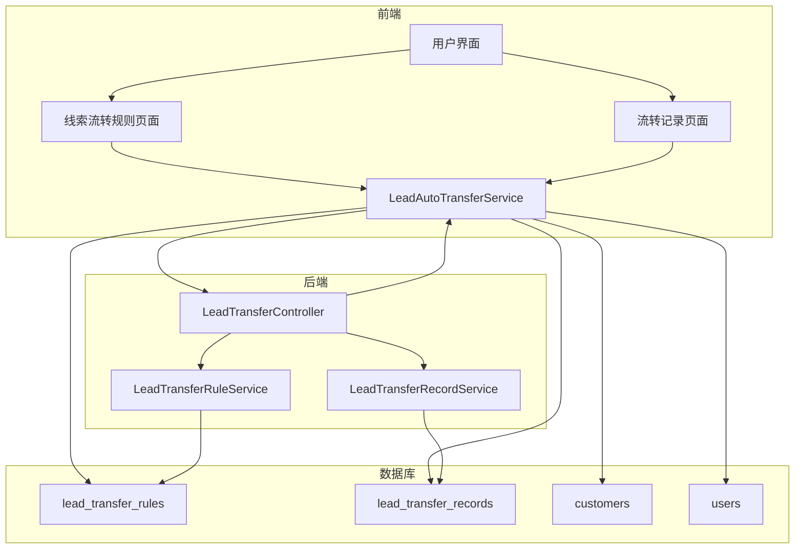
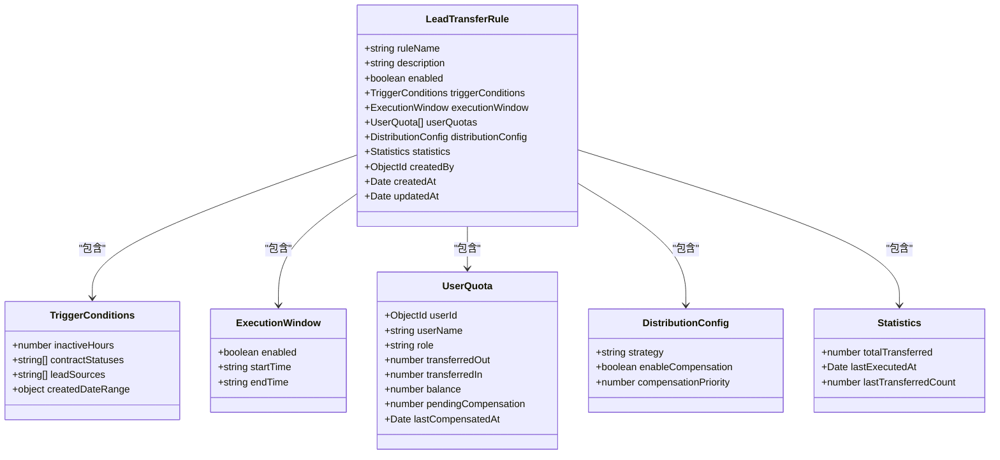
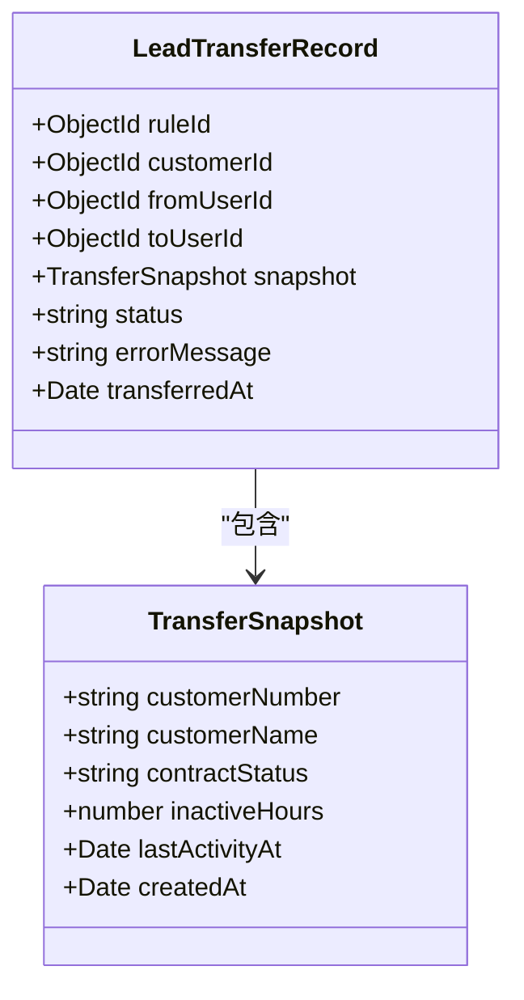
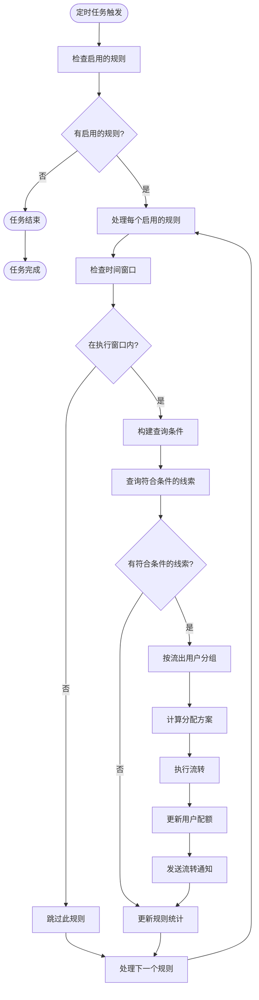
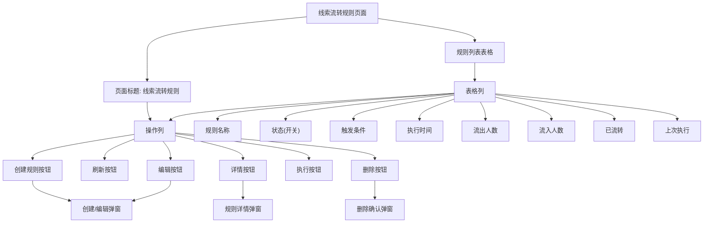
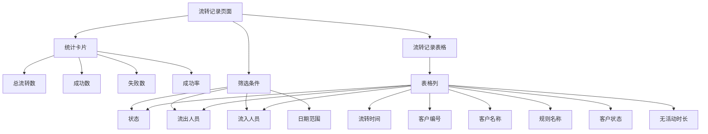
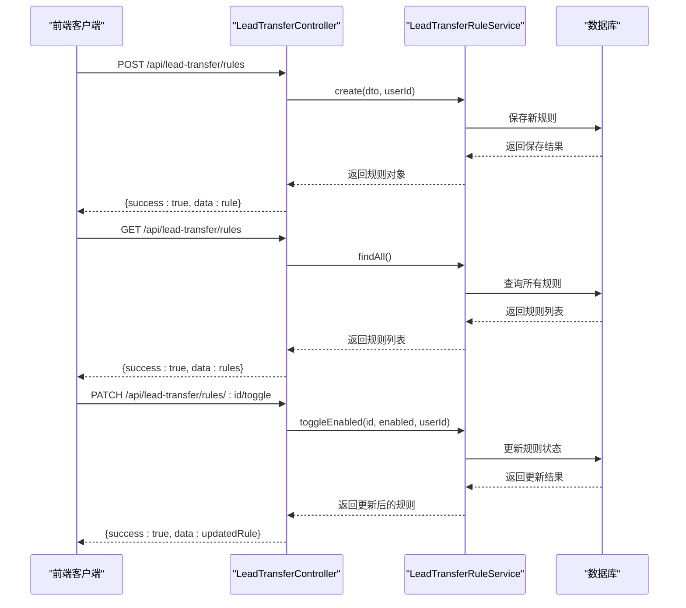
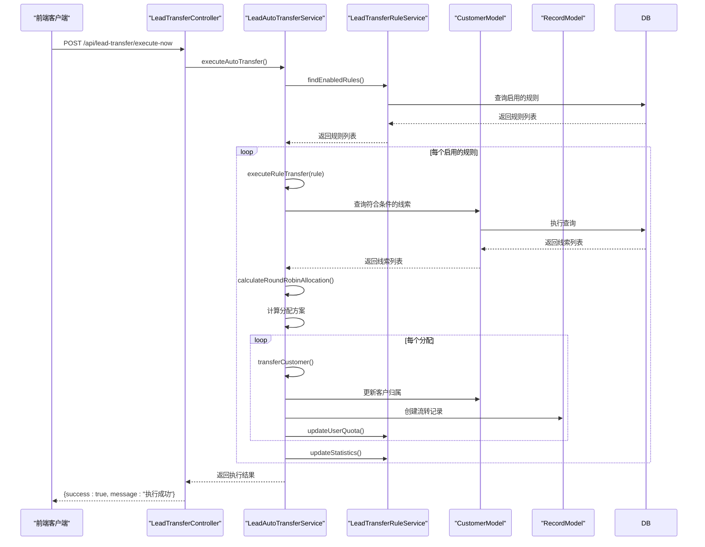

# 线索自动转移

<cite>
**本文档引用文件**   
- [lead-transfer.controller.ts](file://backend/src/modules/customers/controllers/lead-transfer.controller.ts)
- [lead-auto-transfer.service.ts](file://backend/src/modules/customers/services/lead-auto-transfer.service.ts)
- [lead-transfer-rule.model.ts](file://backend/src/modules/customers/models/lead-transfer-rule.model.ts)
- [lead-transfer-record.model.ts](file://backend/src/modules/customers/models/lead-transfer-record.model.ts)
- [create-lead-transfer-rule.dto.ts](file://backend/src/modules/customers/dto/create-lead-transfer-rule.dto.ts)
- [LeadTransferRules.tsx](file://frontend/src/pages/customers/LeadTransferRules.tsx)
- [LeadTransferRecords.tsx](file://frontend/src/pages/customers/LeadTransferRecords.tsx)
- [leadTransfer.ts](file://frontend/src/services/leadTransfer.ts)
- [LEAD_TRANSFER_TEST_REPORT.md](file://LEAD_TRANSFER_TEST_REPORT.md)
- [LEAD_TRANSFER_USER_GUIDE.md](file://LEAD_TRANSFER_USER_GUIDE.md)
- [LEAD_TRANSFER_UPDATE_LOG.md](file://LEAD_TRANSFER_UPDATE_LOG.md)
</cite>

## 目录
1. [简介](#简介)
2. [核心功能](#核心功能)
3. [系统架构](#系统架构)
4. [数据模型](#数据模型)
5. [工作流程](#工作流程)
6. [前端界面](#前端界面)
7. [API接口](#api接口)
8. [最佳实践](#最佳实践)
9. [常见问题](#常见问题)
10. [测试与验证](#测试与验证)

## 简介

线索自动转移功能是安德家政CRM系统中的核心功能之一，旨在解决线索长时间无人跟进的问题。该功能通过自动化的方式，将符合条件的线索从一组员工自动流转到另一组员工，确保线索得到及时处理，同时保证流转的公平性和合理性。

系统每小时整点自动执行一次流转任务，管理员也可以手动触发流转。通过灵活的规则配置，可以满足不同业务场景的需求，如销售组线索流转、特定时期线索流转等。

**Section sources**
- [LEAD_TRANSFER_USER_GUIDE.md](file://LEAD_TRANSFER_USER_GUIDE.md#L1-L299)
- [LEAD_TRANSFER_TEST_REPORT.md](file://LEAD_TRANSFER_TEST_REPORT.md#L1-L130)

## 核心功能

线索自动转移功能包含以下核心功能：

1. **自动流转**：线索在待定/匹配中状态下，超过48小时自动流转
2. **手动配置**：可配置流出名单、流入名单、线索状态、创建日期范围
3. **平衡算法**：流出量=流入量，支持补偿机制
4. **时间窗口**：可配置执行时间窗口（如9:30-18:30）
5. **持续触发**：只要线索保持符合条件的状态，就会持续被流转
6. **线索来源筛选**：可指定只流转特定来源的线索（如美团、抖音、快手、小红书等）
7. **手动执行**：管理员可通过API或界面手动触发流转

系统通过定时任务每小时检查一次符合条件的线索，并根据配置的规则进行自动流转。每次流转后，会记录详细的流转日志，包括流转时间、原负责人、新负责人、流转原因等信息。

**Section sources**
- [LEAD_TRANSFER_TEST_REPORT.md](file://LEAD_TRANSFER_TEST_REPORT.md#L5-L12)
- [LEAD_TRANSFER_USER_GUIDE.md](file://LEAD_TRANSFER_USER_GUIDE.md#L5-L9)

## 系统架构

线索自动转移功能的系统架构分为前端、后端和数据库三个主要部分，各部分通过清晰的接口进行交互。



**Diagram sources **
- [lead-transfer.controller.ts](file://backend/src/modules/customers/controllers/lead-transfer.controller.ts#L20-L24)
- [lead-auto-transfer.service.ts](file://backend/src/modules/customers/services/lead-auto-transfer.service.ts#L15-L28)
- [lead-transfer-rule.model.ts](file://backend/src/modules/customers/models/lead-transfer-rule.model.ts#L103-L137)
- [lead-transfer-record.model.ts](file://backend/src/modules/customers/models/lead-transfer-record.model.ts#L31-L58)

## 数据模型

### 流转规则模型 (LeadTransferRule)

流转规则是线索自动转移的核心配置，定义了何时、何条件下进行流转。



**Diagram sources **
- [lead-transfer-rule.model.ts](file://backend/src/modules/customers/models/lead-transfer-rule.model.ts#L103-L137)

### 流转记录模型 (LeadTransferRecord)

流转记录用于记录每次线索流转的详细信息，便于追溯和审计。



**Diagram sources **
- [lead-transfer-record.model.ts](file://backend/src/modules/customers/models/lead-transfer-record.model.ts#L31-L58)

## 工作流程

线索自动转移的工作流程包括定时任务触发、规则检查、条件匹配、分配计算和执行流转等步骤。



**Diagram sources **
- [lead-auto-transfer.service.ts](file://backend/src/modules/customers/services/lead-auto-transfer.service.ts#L73-L98)

## 前端界面

### 线索流转规则页面

前端提供了直观的用户界面，方便管理员创建、编辑和管理流转规则。



**Diagram sources **
- [LeadTransferRules.tsx](file://frontend/src/pages/customers/LeadTransferRules.tsx#L373-L755)

### 流转记录页面

流转记录页面提供了详细的流转历史记录和统计信息。



**Diagram sources **
- [LeadTransferRecords.tsx](file://frontend/src/pages/customers/LeadTransferRecords.tsx#L173-L293)

## API接口

### 规则管理API



**Diagram sources **
- [lead-transfer.controller.ts](file://backend/src/modules/customers/controllers/lead-transfer.controller.ts#L37-L128)
- [lead-transfer-rule.service.ts](file://backend/src/modules/customers/services/lead-transfer-rule.service.ts#L21-L134)

### 流转执行API



**Diagram sources **
- [lead-transfer.controller.ts](file://backend/src/modules/customers/controllers/lead-transfer.controller.ts#L175-L198)
- [lead-auto-transfer.service.ts](file://backend/src/modules/customers/services/lead-auto-transfer.service.ts#L73-L315)

## 最佳实践

### 1. 合理设置无活动时间

- **建议**：48-72小时
- **太短**：可能导致频繁流转，影响客户体验
- **太长**：线索可能长时间无人跟进

### 2. 明确流出和流入名单

- **流出名单**：通常是业务繁忙或线索过多的员工
- **流入名单**：通常是有空闲时间或需要更多线索的员工

### 3. 启用补偿机制

- 确保长期公平性
- 避免某些员工一直流出，某些员工一直流入

### 4. 设置合理的时间窗口

- **建议**：工作时间（9:30-18:30）
- 避免在非工作时间流转，影响员工休息

### 5. 定期查看流转记录

- 检查流转是否正常
- 分析流转原因
- 优化规则配置

### 6. 监控平衡状态

- 定期查看用户配额统计
- 确保平衡值不要偏差太大
- 必要时调整补偿优先级

**Section sources**
- [LEAD_TRANSFER_USER_GUIDE.md](file://LEAD_TRANSFER_USER_GUIDE.md#L207-L235)

## 常见问题

### Q1: 规则什么时候执行？

**A**: 系统每小时整点自动执行一次（例如：10:00、11:00、12:00...）。如果启用了时间窗口，则只在指定时间范围内执行。

### Q2: 为什么我的线索没有被流转？

**A**: 请检查以下条件：
1. 规则是否已启用
2. 线索状态是否符合（待定或匹配中）
3. 线索的 lastActivityAt 是否超过48小时
4. 线索的负责人是否在流出名单中
5. 当前时间是否在执行窗口内（如果启用了时间窗口）

### Q3: 平衡算法是如何工作的？

**A**: 
- 系统会记录每个人的流出和流入数量
- 计算平衡值 = 流出 - 流入
- 下次流转时，优先分配给平衡值为正（亏欠）的人
- 权重计算：`weight = 1 + (balance × compensationPriority)`

### Q4: 线索会被重复流转吗？

**A**: 会的！只要线索保持在"待定"或"匹配中"状态，并且超过48小时没有活动，就会持续被流转。每次流转后，lastActivityAt 会更新为当前时间，重新开始计时。

### Q5: 如何暂停某个规则？

**A**: 在规则列表页面，点击规则右侧的开关按钮，即可禁用该规则。

### Q6: 可以手动触发流转吗？

**A**: 管理员可以通过API手动触发：
```bash
curl -X POST "http://localhost:3001/api/lead-transfer/execute-now" \
  -H "Authorization: Bearer YOUR_TOKEN"
```

### Q7: 如何查看某个员工的流转统计？

**A**: 在规则详情页面的"用户配额统计"部分，可以看到每个员工的详细流转数据。

**Section sources**
- [LEAD_TRANSFER_USER_GUIDE.md](file://LEAD_TRANSFER_USER_GUIDE.md#L169-L204)

## 测试与验证

### 测试结果

#### 后端API测试

- ✅ **规则管理API**
  - `POST /api/lead-transfer/rules` - 创建规则 ✅
  - `GET /api/lead-transfer/rules` - 获取规则列表 ✅
  - `GET /api/lead-transfer/rules/:id` - 获取规则详情 ✅
  - `PATCH /api/lead-transfer/rules/:id` - 更新规则 ✅
  - `PATCH /api/lead-transfer/rules/:id/toggle` - 启用/禁用规则 ✅
  - `DELETE /api/lead-transfer/rules/:id` - 删除规则 ✅

- ✅ **流转记录API**
  - `GET /api/lead-transfer/records` - 获取流转记录 ✅
  - `GET /api/lead-transfer/statistics` - 获取统计数据 ✅
  - `GET /api/lead-transfer/user-statistics/:userId` - 获取用户统计 ✅

- ✅ **手动触发API（测试用）**
  - `POST /api/lead-transfer/execute-now` - 立即执行流转 ✅

#### 流转逻辑测试

- ✅ **测试场景1：基本流转**
  - 客户从 师丽娜 流转至 朱小双
  - 流转记录已创建
  - 客户归属已更新
  - lastActivityAt 已更新为当前时间

- ✅ **测试场景2：平衡算法**
  - 师丽娜: 流出1, 流入0, balance=1 (亏欠)
  - 孔丽新: 流出0, 流入0, balance=0 (平衡)
  - 宋静: 流出0, 流入0, balance=0 (平衡)
  - 朱小双: 流出0, 流入1, balance=-1 (盈余)
  - 结论：✅ 平衡算法正常工作，下一轮流转会优先补偿师丽娜

- ✅ **测试场景3：时间窗口**
  - 配置：executionWindow.enabled = false
  - 结果：✅ 任何时间都可以执行流转
  - 配置：executionWindow.enabled = true, 9:30-18:30
  - 结果：✅ 仅在指定时间窗口内执行

**Section sources**
- [LEAD_TRANSFER_TEST_REPORT.md](file://LEAD_TRANSFER_TEST_REPORT.md#L15-L69)